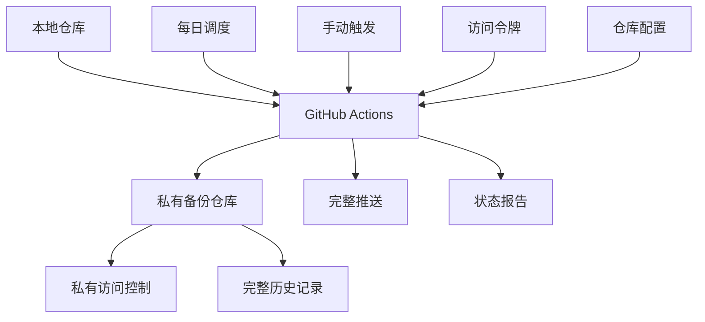

# 简化私有备份系统设计文档

## 概述

简化私有备份系统是一个直接的解决方案，通过创建私有GitHub仓库来备份所有本地内容，并设置每日自动同步。系统利用现有的GitHub基础设施和Actions工作流程，提供安全、可靠的备份服务。

## 架构

### 系统架构图



### 核心组件

1. **私有备份仓库 (Private Backup Repository)**
   - GitHub上的私有仓库
   - 存储所有本地内容的完整副本
   - 保持与源仓库相同的结构

2. **同步工作流程 (Sync Workflow)**
   - GitHub Actions自动化工作流程
   - 每日定时执行和手动触发
   - 处理推送和状态报告

3. **认证管理 (Authentication Manager)**
   - 安全的GitHub访问令牌管理
   - 权限验证和访问控制
   - 凭据保护机制

## 组件和接口

### 备份仓库管理器

```javascript
class BackupRepositoryManager {
  async createPrivateRepo(repoName) {
    // 创建私有GitHub仓库
  }
  
  async configureRemote(repoUrl) {
    // 配置远程仓库连接
  }
  
  async verifyAccess() {
    // 验证仓库访问权限
  }
}
```

### 同步管理器

```javascript
class SyncManager {
  async performFullSync() {
    // 执行完整同步
  }
  
  async generateSyncReport() {
    // 生成同步报告
  }
  
  async handleSyncErrors(errors) {
    // 处理同步错误
  }
}
```

## 数据模型

### 备份配置

```javascript
interface BackupConfig {
  privateRepoName: string;
  privateRepoUrl: string;
  syncSchedule: string; // cron表达式
  accessToken: string;
  lastSyncTime: Date;
  syncStatus: 'success' | 'failed' | 'pending';
}
```

### 同步报告

```javascript
interface SyncReport {
  timestamp: Date;
  filesCount: number;
  totalSize: number;
  status: 'success' | 'failed';
  errors: string[];
  duration: number;
}
```

## 正确性属性

*属性是一个特征或行为，应该在系统的所有有效执行中保持为真。*

### 属性1: 备份完整性
*对于任何*同步操作，私有备份仓库应该包含与本地仓库相同的所有文件和Git历史
**验证: 需求 2.1, 2.2, 2.3**

### 属性2: 每日同步一致性
*对于任何*每日同步调度，系统应该在指定时间执行同步操作
**验证: 需求 3.1, 3.2**

### 属性3: 私有访问控制
*对于任何*备份仓库访问，只有授权用户应该能够访问私有内容
**验证: 需求 4.2, 4.3**

### 属性4: 同步状态准确性
*对于任何*同步操作，生成的状态报告应该准确反映同步结果和统计信息
**验证: 需求 3.4, 2.4**

## 错误处理

### 网络连接错误
- 重试机制：最多3次尝试
- 超时设置：30秒连接超时
- 失败通知：记录错误日志

### 认证错误
- 令牌验证失败：提示更新访问令牌
- 权限不足：检查仓库权限设置
- 账户问题：提供故障排除指导

### 同步冲突
- 强制推送：覆盖远程更改
- 冲突记录：详细记录冲突信息
- 手动解决：提供手动干预选项

## 测试策略

### 单元测试
- 仓库创建和配置功能
- 同步逻辑的正确性
- 错误处理机制
- 报告生成功能

### 集成测试
- GitHub API集成测试
- 完整同步流程测试
- 工作流程触发测试
- 权限验证测试