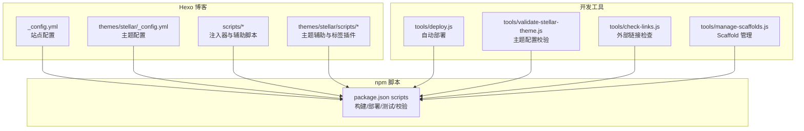
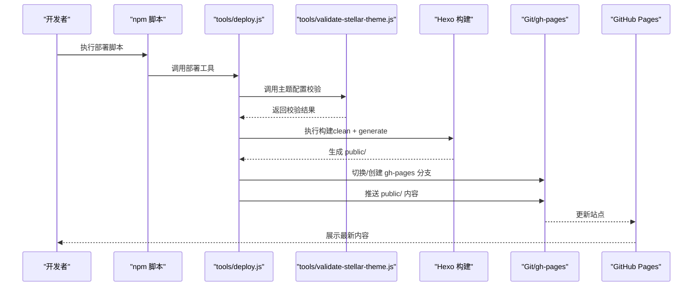
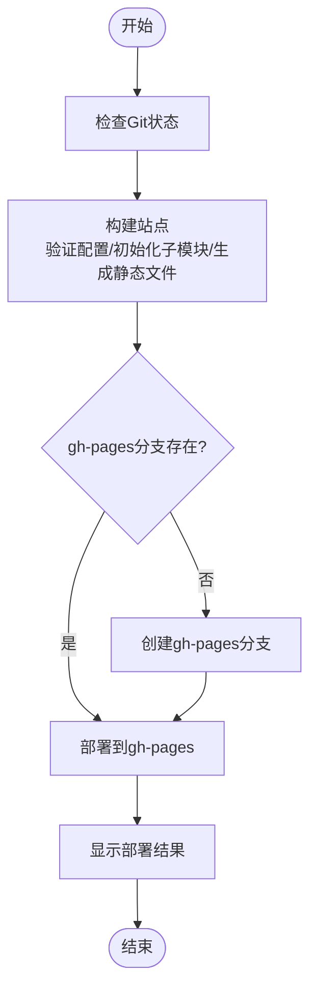
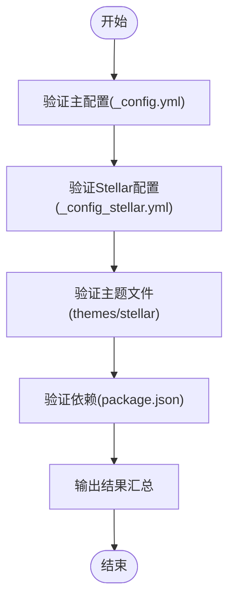
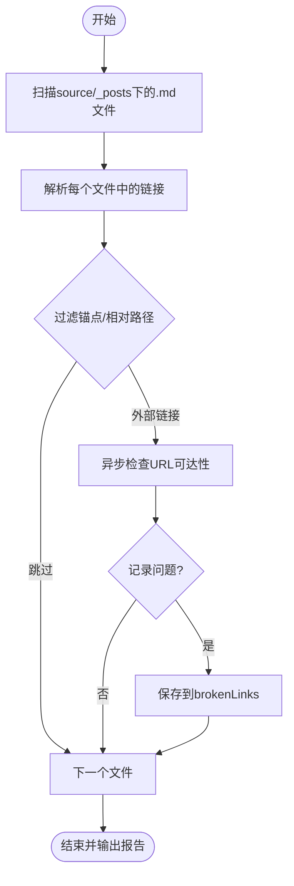
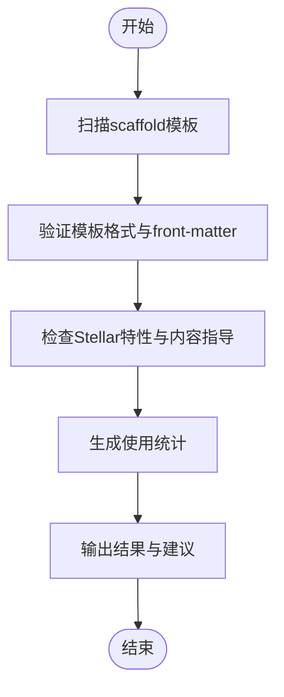
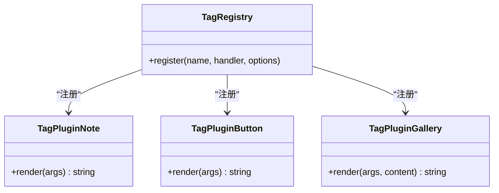
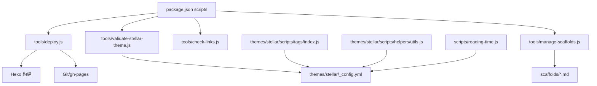

# API参考

<cite>
**本文引用的文件**
- [package.json](file://package.json)
- [_config.yml](file://_config.yml)
- [themes/stellar/_config.yml](file://themes/stellar/_config.yml)
- [tools/deploy.js](file://tools/deploy.js)
- [tools/validate-stellar-theme.js](file://tools/validate-stellar-theme.js)
- [tools/check-links.js](file://tools/check-links.js)
- [tools/manage-scaffolds.js](file://tools/manage-scaffolds.js)
- [themes/stellar/scripts/helpers/utils.js](file://themes/stellar/scripts/helpers/utils.js)
- [themes/stellar/scripts/tags/index.js](file://themes/stellar/scripts/tags/index.js)
- [themes/stellar/scripts/tags/lib/note.js](file://themes/stellar/scripts/tags/lib/note.js)
- [themes/stellar/scripts/tags/lib/button.js](file://themes/stellar/scripts/tags/lib/button.js)
- [themes/stellar/scripts/tags/lib/gallery.js](file://themes/stellar/scripts/tags/lib/gallery.js)
- [scripts/reading-time.js](file://scripts/reading-time.js)
</cite>

## 目录
1. [简介](#简介)
2. [项目结构](#项目结构)
3. [核心组件](#核心组件)
4. [架构总览](#架构总览)
5. [详细组件分析](#详细组件分析)
6. [依赖关系分析](#依赖关系分析)
7. [性能考虑](#性能考虑)
8. [故障排除指南](#故障排除指南)
9. [结论](#结论)
10. [附录](#附录)

## 简介
本文件为 H1S97X 博客的完整 API 参考文档，涵盖以下方面：
- 命令行接口（npm 脚本、部署工具、验证工具）的参数与用法
- 主题 API（Stellar）的接口规范，包括自定义标签插件的参数、返回值与使用示例
- 辅助函数 API，包括函数签名、参数类型、返回值与调用示例
- 配置 API 参考，包括配置项含义、默认值与可选范围
- 开发工具 API，包括工具函数的参数与返回值
- 完整的使用场景与代码示例，帮助开发者正确使用各种 API 接口

## 项目结构
本项目基于 Hexo + Stellar 主题，结合自研工具链实现一键部署、配置校验、链接检查与 Scaffold 管理。

**图表来源**
- [package.json](file://package.json#L5-L41)
- [_config.yml](file://_config.yml#L1-L136)
- [themes/stellar/_config.yml](file://themes/stellar/_config.yml#L1-L725)
- [tools/deploy.js](file://tools/deploy.js#L1-L472)
- [tools/validate-stellar-theme.js](file://tools/validate-stellar-theme.js#L1-L313)
- [tools/check-links.js](file://tools/check-links.js#L1-L133)
- [tools/manage-scaffolds.js](file://tools/manage-scaffolds.js#L1-L517)

**章节来源**
- [package.json](file://package.json#L5-L41)
- [_config.yml](file://_config.yml#L1-L136)
- [themes/stellar/_config.yml](file://themes/stellar/_config.yml#L1-L725)

## 核心组件
- 命令行接口（npm scripts）
  - 构建与清理：build、build:test、build:staging、clean
  - 服务器：server、server:staging
  - 部署：deploy、deploy:manual、deploy:preview、deploy:stellar、deploy:check
  - 主题管理：themes:add、themes:check、themes:status、themes:update、themes:init
  - Stellar 验证与测试：stellar:validate、stellar:test
  - 工作流与链接检查：workflows:check、workflows:report、check-links
  - Scaffold 管理：scaffolds:validate、scaffolds:list、scaffolds:stats、scaffolds:all
  - 测试与质量：test、test:watch、test:coverage、lint、lint:fix、validate、precommit、prepare
- 部署工具（tools/deploy.js）
  - 自动部署到 GitHub Pages（gh-pages 分支），支持 dry-run 预览模式
- 验证工具（tools/validate-stellar-theme.js）
  - 校验主配置、Stellar 配置、主题文件存在性与依赖完整性
- 链接检查工具（tools/check-links.js）
  - 扫描 Markdown 中的外部链接并检测有效性
- Scaffold 管理工具（tools/manage-scaffolds.js）
  - 验证、列出、统计 Scaffold 模板使用情况
- 主题辅助与标签插件（themes/stellar/scripts）
  - 辅助函数：get_page
  - 标签插件注册：note、button、gallery 等
- 注入器（scripts/reading-time.js）
  - 在文章页面注入阅读时间与字数统计

**章节来源**
- [package.json](file://package.json#L5-L41)
- [tools/deploy.js](file://tools/deploy.js#L1-L472)
- [tools/validate-stellar-theme.js](file://tools/validate-stellar-theme.js#L1-L313)
- [tools/check-links.js](file://tools/check-links.js#L1-L133)
- [tools/manage-scaffolds.js](file://tools/manage-scaffolds.js#L1-L517)
- [themes/stellar/scripts/helpers/utils.js](file://themes/stellar/scripts/helpers/utils.js#L1-L21)
- [themes/stellar/scripts/tags/index.js](file://themes/stellar/scripts/tags/index.js#L1-L56)
- [scripts/reading-time.js](file://scripts/reading-time.js#L1-L46)

## 架构总览
下图展示从命令行到主题与工具的交互关系：

**图表来源**
- [package.json](file://package.json#L5-L41)
- [tools/deploy.js](file://tools/deploy.js#L383-L418)
- [tools/validate-stellar-theme.js](file://tools/validate-stellar-theme.js#L22-L45)

## 详细组件分析

### 命令行接口（npm scripts）
- 构建与清理
  - build：hexo generate
  - build:test：hexo clean && hexo generate
  - build:staging：hexo clean && hexo generate --config _config.yml,_config.staging.yml
  - clean：hexo clean
- 服务器
  - server：hexo server
  - server:staging：hexo server --config _config.yml,_config.staging.yml
- 部署
  - deploy：node tools/deploy.js
  - deploy:manual：hexo deploy
  - deploy:preview：node tools/deploy.js --dry-run
  - deploy:stellar：npm run stellar:validate && npm run clean && npm run build && node tools/deploy.js
  - deploy:check：npm run stellar:validate && npm run build:test
- 主题管理
  - themes:add：node tools/add-remaining-themes.js
  - themes:check：node tools/add-remaining-themes.js --check
  - themes:status：git submodule status
  - themes:update：git submodule update --remote
  - themes:init：git submodule update --init --recursive
- Stellar 验证与测试
  - stellar:validate：node tools/validate-stellar-theme.js
  - stellar:test：npm run clean && npm run stellar:validate && npm run build:test
- 工作流与链接检查
  - workflows:check：node tools/check-workflows.js
  - workflows:report：node tools/check-workflows.js --report
  - check-links：node tools/check-links.js
- Scaffold 管理
  - scaffolds:validate：node tools/manage-scaffolds.js validate
  - scaffolds:list：node tools/manage-scaffolds.js list
  - scaffolds:stats：node tools/manage-scaffolds.js stats
  - scaffolds:all：node tools/manage-scaffolds.js all
- 测试与质量
  - test、test:watch、test:coverage：jest
  - lint、lint:fix：eslint
  - validate：npm run test && npm run check-links
  - precommit：npm run validate
  - prepare：husky install

**章节来源**
- [package.json](file://package.json#L5-L41)

### 部署工具 API（tools/deploy.js）
- 类：BlogDeployer
  - 构造函数：初始化根目录、public 目录、当前分支、dry-run 模式
  - 方法：
    - execCommand(command, options)：执行命令并返回结果，支持 dry-run
    - checkGitStatus()：检查 Git 仓库状态、当前分支、未提交更改、远程仓库
    - buildSite()：验证主题配置、初始化子模块、清理旧文件、生成静态文件、验证关键文件、统计 HTML 数量
    - checkGhPagesBranch()：检查 gh-pages 分支是否存在
    - createGhPagesBranch()：创建孤立分支、初始提交、推送并切回原分支
    - deployToGhPages()：切换到 gh-pages、清空分支内容、复制 public/、提交推送、切回原分支
    - copyDirectory(src, dest)：递归复制目录
    - findFiles(dir, extension)：递归查找指定扩展名文件
    - showResult()：显示部署结果与主题特性
    - deploy()：执行完整部署流程（检查 -> 构建 -> 创建/检查分支 -> 部署 -> 结果）
    - showHelp()：显示帮助信息
- 参数与返回值
  - execCommand：传入命令字符串与可选选项；返回执行结果字符串或抛出错误
  - checkGitStatus/buildSite/deployToGhPages/showResult/deploy：无显式返回值（void），通过控制台输出状态
  - checkGhPagesBranch/createGhPagesBranch：返回布尔或执行成功/失败
- 使用示例
  - 预览部署：node tools/deploy.js --dry-run
  - 实际部署：node tools/deploy.js
  - 通过 npm 脚本：npm run deploy

**图表来源**
- [tools/deploy.js](file://tools/deploy.js#L383-L418)

**章节来源**
- [tools/deploy.js](file://tools/deploy.js#L12-L472)

### 验证工具 API（tools/validate-stellar-theme.js）
- 类：StellarThemeValidator
  - 构造函数：初始化错误、警告、信息数组
  - 方法：
    - validate()：依次验证主配置、Stellar 配置、主题文件、依赖包，输出汇总结果
    - validateMainConfig()：校验 _config.yml 主题设置、基本字段、搜索配置
    - validateStellarConfig()：校验 _config_stellar.yml 导航菜单、站点结构、搜索、评论、插件
    - validateThemeFiles()：校验 themes/stellar 关键文件存在性与版本
    - validateDependencies()：校验 package.json 中 Hexo 与推荐依赖
    - outputResults()：输出错误、警告、信息并给出总结
- 参数与返回值
  - validate/validateMainConfig/validateStellarConfig/validateThemeFiles/validateDependencies：无显式返回值（void）
  - outputResults：输出汇总并根据错误数决定进程退出码
- 使用示例
  - 校验主题：node tools/validate-stellar-theme.js

**图表来源**
- [tools/validate-stellar-theme.js](file://tools/validate-stellar-theme.js#L22-L45)

**章节来源**
- [tools/validate-stellar-theme.js](file://tools/validate-stellar-theme.js#L12-L313)

### 链接检查工具 API（tools/check-links.js）
- 类：LinkChecker
  - 构造函数：初始化 brokenLinks 列表与已检查 URL 集合
  - 方法：
    - checkUrl(url)：异步检查外部 URL 可达性（支持 http/https），超时 5 秒
    - checkMarkdownFile(filePath)：解析 Markdown 中的链接，过滤锚点与相对路径，检查外部链接
    - checkAllFiles()：遍历 source/_posts 下所有 .md 文件，逐个检查并输出结果
- 参数与返回值
  - checkUrl：接收 URL 字符串；返回布尔值（可达性）
  - checkMarkdownFile：接收文件路径；无返回值（void），内部记录问题
  - checkAllFiles：无参数；无返回值（void），输出统计与问题列表
- 使用示例
  - 检查所有 Markdown 外链：node tools/check-links.js

**图表来源**
- [tools/check-links.js](file://tools/check-links.js#L78-L125)

**章节来源**
- [tools/check-links.js](file://tools/check-links.js#L8-L133)

### Scaffold 管理工具 API（tools/manage-scaffolds.js）
- 类：ScaffoldManager
  - 构造函数：初始化根目录、scaffolds 目录、扫描结果与统计
  - 方法：
    - scanScaffolds()：扫描 scaffolds 目录，输出发现的模板
    - validateScaffolds()/validateScaffold()：验证模板格式、front-matter、Stellar 特性、内容指导
    - checkBasicStructure()/checkFrontMatter()/checkStellarFeatures()/checkContentGuidance()：具体检查逻辑
    - getRequiredFields(name)：返回各模板的必需字段映射
    - generateUsageStats()：统计文章总数、布局分布、分类分布、Stellar 特性使用率
    - getAllMarkdownFiles(dir)：递归获取 .md 文件
    - displayStats()：打印统计信息
    - showResults()：输出通过/警告/错误项与总结
    - provideSuggestions()：输出优化建议与相关文档
    - listScaffolds()：列出可用模板及其描述与使用方式
    - run()/showHelp()：根据命令执行相应功能
- 参数与返回值
  - run：无返回值（void），根据命令行参数执行不同流程
  - showResults/displayStats/provideSuggestions/listScaffolds：无返回值（void）
- 使用示例
  - 验证：node tools/manage-scaffolds.js validate
  - 列表：node tools/manage-scaffolds.js list
  - 统计：node tools/manage-scaffolds.js stats
  - 全量：node tools/manage-scaffolds.js all

**图表来源**
- [tools/manage-scaffolds.js](file://tools/manage-scaffolds.js#L25-L52)
- [tools/manage-scaffolds.js](file://tools/manage-scaffolds.js#L57-L89)
- [tools/manage-scaffolds.js](file://tools/manage-scaffolds.js#L209-L270)

**章节来源**
- [tools/manage-scaffolds.js](file://tools/manage-scaffolds.js#L12-L517)

### 主题辅助函数 API（themes/stellar/scripts/helpers/utils.js）
- 函数：get_page(id)
  - 功能：根据页面或文章的 _id 查找页面对象，若未找到返回 null
  - 参数：id（字符串或数字）
  - 返回：页面对象或 null
  - 使用场景：在主题模板中根据 ID 获取页面或文章数据

**章节来源**
- [themes/stellar/scripts/helpers/utils.js](file://themes/stellar/scripts/helpers/utils.js#L7-L20)

### 主题标签插件 API（themes/stellar/scripts/tags）
- 注册入口（themes/stellar/scripts/tags/index.js）
  - 注册容器类、数据类、表达类、阅读类与其它插件
  - 示例：tabs、box、friends、gallery、timeline、note、button、checkbox、radio、image、video 等
- 典型插件实现与参数
  - note（themes/stellar/scripts/tags/lib/note.js）
    - 语法：
    - 参数：
      - color：颜色（可选）
      - title：标题（可选）
      - content：内容（必需，Markdown）
    - 返回：HTML 字符串（带 color、title 与渲染后的 Markdown 内容）
  - button（themes/stellar/scripts/tags/lib/button.js）
    - 语法：
    - 参数：
      - text：按钮文本（必需）
      - url：链接地址（必需）
      - color：颜色（可选）
      - icon：图标键或地址（可选）
      - size：尺寸（可选）
    - 返回：HTML 字符串（带 title、href、图标与文本）
  - gallery（themes/stellar/scripts/tags/lib/gallery.js）
    - 语法：...
    - 参数：
      - layout：布局（grid/flow，默认 grid）
      - size：尺寸（mix/s/m/l/xl，默认 mix）
      - ratio：长宽比（origin/square，默认 square）
    - 内容：多行 Markdown 图片语法（）
    - 返回：HTML 字符串（包含图片懒加载、fancybox、标题与占位图）

**图表来源**
- [themes/stellar/scripts/tags/index.js](file://themes/stellar/scripts/tags/index.js#L5-L56)
- [themes/stellar/scripts/tags/lib/note.js](file://themes/stellar/scripts/tags/lib/note.js#L10-L35)
- [themes/stellar/scripts/tags/lib/button.js](file://themes/stellar/scripts/tags/lib/button.js#L11-L39)
- [themes/stellar/scripts/tags/lib/gallery.js](file://themes/stellar/scripts/tags/lib/gallery.js#L37-L63)

**章节来源**
- [themes/stellar/scripts/tags/index.js](file://themes/stellar/scripts/tags/index.js#L1-L56)
- [themes/stellar/scripts/tags/lib/note.js](file://themes/stellar/scripts/tags/lib/note.js#L10-L35)
- [themes/stellar/scripts/tags/lib/button.js](file://themes/stellar/scripts/tags/lib/button.js#L11-L39)
- [themes/stellar/scripts/tags/lib/gallery.js](file://themes/stellar/scripts/tags/lib/gallery.js#L37-L63)

### 注入器 API（scripts/reading-time.js）
- 注入器：body_end
  - 功能：在文章页面的 #post-meta 区域注入阅读时间与字数统计
  - 计算规则：
    - 中文字符按每分钟 300 字计算
    - 英文单词按每分钟 200 词计算
    - 字数格式化：≥1000 显示为 k
  - DOM 选择：优先查找 .md-text.content 与 #post-meta
  - 返回：注入包含 SVG 图标与文本的 span 元素

**章节来源**
- [scripts/reading-time.js](file://scripts/reading-time.js#L9-L45)

### 配置 API 参考
- 站点配置（_config.yml）
  - 基本信息：title、subtitle、description、author、keywords、language、timezone
  - URL 与链接：url、permalink、pretty_urls、pretty_urls.trailing_index/trailing_html
  - 目录与渲染：source_dir、public_dir、tag_dir、archive_dir、category_dir、code_dir、i18n_dir、skip_render
  - 写作与高亮：new_post_name、default_layout、titlecase、external_link.enable/field/exclude、filename_case、render_drafts、post_asset_folder、relative_link、future、highlight/prismjs
  - 首页与分页：index_generator.path/per_page/order_by、per_page、pagination_dir、pagination
  - 元信息：meta_generator
  - 日期时间：date_format、time_format、updated_option
  - 扩展与部署：theme、aplayer.meting/aplayer.asset_inject、search.path/field/format/limit、feed.*、deploy.type/repo/branch
- 主题配置（themes/stellar/_config.yml）
  - 基本信息：stellar.version/homepage/repo/main_css/main_js
  - SEO 与结构化数据：canonical、open_graph、structured_data
  - 侧边栏与导航：logo.avatar/logo.title/logo.subtitle、menubar.columns/items
  - 站点结构树：site_tree.home/index_blog/index_wiki/post/wiki/notebooks/notes/author/error_page/page
  - 笔记本与文章：notebook.auto_excerpt/notebook.per_page/notebook.order_by/notebook.license/notebook.share、article.type/article.indent/article.cover_ratio/article.banner_ratio/article.auto_banner/article.auto_excerpt/article.license/article.share、article.related_posts.enable/max_count
  - 搜索：search.service/local_search.field/path/content/skip_search、search.algolia_search.*
  - 评论系统：comments.service/comment_title/lazyload/custom_css、comments.giscus.*、comments.twikoo.*、comments.waline.*、comments.artalk.*、comments.beaudar.*
  - 标签插件默认行为：tag_plugins.note.*、tag_plugins.checkbox.interactive、tag_plugins.quot.*、tag_plugins.emoji.*、tag_plugins.icon.default_color、tag_plugins.button.default_color、tag_plugins.image.fancybox、tag_plugins.copy.toast、tag_plugins.timeline.max-height、tag_plugins.mark.default_color、tag_plugins.hashtag.default_color、tag_plugins.okr.border/status.*
  - 依赖与内置服务：dependencies.jquery/marked/lazyload.transition/lazyload.fix_ratio、data_services.*（mdrender/siteinfo/ghinfo/rating/vote/sites/friends/friends_and_posts/timeline/fcircle/weibo/memos/twikoo_latest_comment/waline_latest_comment/artalk_latest_comment/giscus_latest_comment/contributors.edit_this_page）
  - 插件接入：plugins.preload.*、plugins.fancybox.*、plugins.swiper.*、plugins.scrollreveal.*、plugins.tianli_gpt.*、plugins.katex/inject.*、plugins.mathjax.*、plugins.mermaid.*、plugins.copycode.*、plugins.heti.*
  - 样式与主题：style.prefers_theme/style.smooth_scroll/style.font-size/root/body/code/codeblock、style.font-family.body/code/codeblock、style.text-align/style.prefix、style.border-radius.*、style.color.*、style.animated_avatar.*、style.codeblock.*、style.loading.*、style.gradient、style.leftbar.*、style.paginator.*、style.error_page、style.header_prefix.*
  - 默认资源：default.avatar/link/cover/image/project/banner/loading/image_onerror
  - API 主机：api_host.ghapi/ghraw/gist/ghcard
  - 系统设置：system.override_pretty_urls

**章节来源**
- [_config.yml](file://_config.yml#L1-L136)
- [themes/stellar/_config.yml](file://themes/stellar/_config.yml#L1-L725)

## 依赖关系分析
- npm 脚本驱动工具链：通过 scripts 字段统一入口，便于 CI/CD 与本地开发
- 部署流程依赖：部署工具依赖主题配置校验、Hexo 构建与 Git 操作
- 主题插件依赖：标签插件依赖主题配置中的 tag_plugins.* 与 utils.icon
- 注入器依赖：reading-time 注入器依赖文章页面 DOM 结构

**图表来源**
- [package.json](file://package.json#L5-L41)
- [tools/deploy.js](file://tools/deploy.js#L106-L130)
- [tools/validate-stellar-theme.js](file://tools/validate-stellar-theme.js#L26-L36)
- [tools/manage-scaffolds.js](file://tools/manage-scaffolds.js#L25-L52)
- [themes/stellar/scripts/tags/index.js](file://themes/stellar/scripts/tags/index.js#L1-L56)
- [themes/stellar/scripts/helpers/utils.js](file://themes/stellar/scripts/helpers/utils.js#L7-L20)
- [scripts/reading-time.js](file://scripts/reading-time.js#L9-L16)

**章节来源**
- [package.json](file://package.json#L5-L41)

## 性能考虑
- 部署预览模式（--dry-run）：在不执行实际 Git 操作的情况下模拟部署流程，降低风险与等待时间
- 链接检查超时：外部链接检查设置 5 秒超时，避免阻塞 CI/CD
- 构建阶段缓存：建议在 CI 环境缓存 node_modules 与生成的 public/ 目录以提升速度
- 主题插件按需加载：主题配置中的 data_services 与 plugins 仅在使用时加载，减少不必要的资源消耗

## 故障排除指南
- 部署失败
  - 检查 Git 仓库状态与远程仓库配置
  - 确认 public/ 目录存在且包含关键文件（index.html、main.css、main.js、search.json、sitemap.xml）
  - 使用 --dry-run 预览部署流程定位问题
- 主题配置错误
  - 使用 npm run stellar:validate 或 node tools/validate-stellar-theme.js 获取详细错误与建议
  - 确认 _config.yml 中 theme 设置为 stellar，且 _config_stellar.yml 存在
- 外部链接失效
  - 使用 npm run check-links 或 node tools/check-links.js 检查并记录问题链接
- Scaffold 模板问题
  - 使用 npm run scaffolds:validate 或 node tools/manage-scaffolds.js validate 获取模板验证报告
  - 使用 scaffolds:list 查看可用模板与使用方式

**章节来源**
- [tools/deploy.js](file://tools/deploy.js#L413-L418)
- [tools/validate-stellar-theme.js](file://tools/validate-stellar-theme.js#L262-L296)
- [tools/check-links.js](file://tools/check-links.js#L112-L124)
- [tools/manage-scaffolds.js](file://tools/manage-scaffolds.js#L327-L362)

## 结论
本参考文档系统性梳理了 H1S97X 博客的命令行接口、部署与验证工具、主题 API、辅助函数与配置项，提供了详细的参数、返回值与使用示例。通过这些工具与 API，开发者可以高效地构建、部署、维护与扩展博客系统。

## 附录
- 常用命令速查
  - 构建与预览：npm run build / npm run server
  - 部署：npm run deploy / npm run deploy:preview
  - 验证：npm run stellar:validate / npm run validate
  - 链接检查：npm run check-links
  - Scaffold：npm run scaffolds:validate / scaffolds:list / scaffolds:stats / scaffolds:all
- 相关文档
  - Hexo 官方文档：https://hexo.io/docs/
  - Stellar 主题文档：https://xaoxuu.com/wiki/stellar/