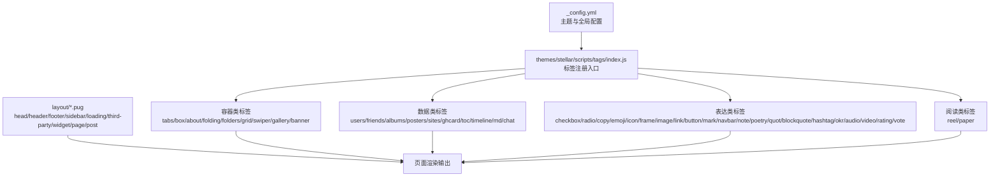
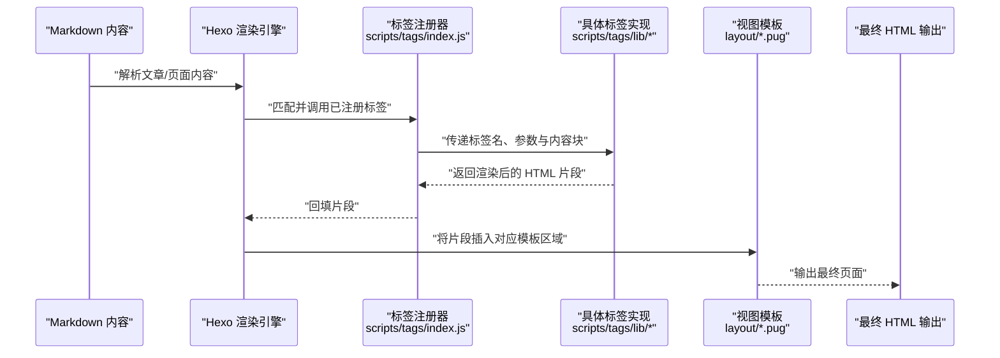
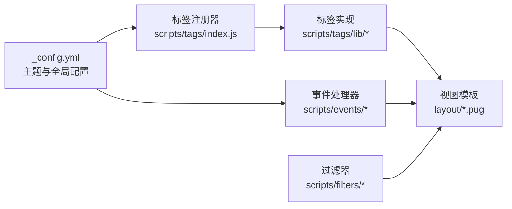

# 主题API

<cite>
**本文引用的文件**
- [themes/stellar/scripts/tags/index.js](file://themes/stellar/scripts/tags/index.js)
- [_config.yml](file://_config.yml)
- [themes/butterfly/scripts/tag/tabs.js](file://themes/butterfly/scripts/tag/tabs.js)
- [themes/butterfly/scripts/tag/mermaid.js](file://themes/butterfly/scripts/tag/mermaid.js)
- [themes/butterfly/scripts/tag/note.js](file://themes/butterfly/scripts/tag/note.js)
- [themes/butterfly/scripts/tag/timeline.js](file://themes/butterfly/scripts/tag/timeline.js)
- [themes/butterfly/layout/includes/head/head.pug](file://themes/butterfly/layout/includes/head/head.pug)
- [themes/butterfly/layout/includes/mixins/mixins.pug](file://themes/butterfly/layout/includes/mixins/mixins.pug)
- [themes/butterfly/layout/includes/sidebar/rightside.pug](file://themes/butterfly/layout/includes/sidebar/rightside.pug)
- [themes/butterfly/layout/includes/header/header.pug](file://themes/butterfly/layout/includes/header/header.pug)
- [themes/butterfly/layout/includes/footer/footer.pug](file://themes/butterfly/layout/includes/footer/footer.pug)
- [themes/butterfly/layout/includes/loading/loading.pug](file://themes/butterfly/layout/includes/loading/loading.pug)
- [themes/butterfly/layout/includes/third-party/third-party.pug](file://themes/butterfly/layout/includes/third-party/third-party.pug)
- [themes/butterfly/layout/includes/widget/widget.pug](file://themes/butterfly/layout/includes/widget/widget.pug)
- [themes/butterfly/layout/includes/page/page.pug](file://themes/butterfly/layout/includes/page/page.pug)
- [themes/butterfly/layout/includes/post/post.pug](file://themes/butterfly/layout/includes/post/post.pug)
- [themes/butterfly/layout/includes/header/header.pug](file://themes/butterfly/layout/includes/header/header.pug)
- [themes/butterfly/layout/includes/footer/footer.pug](file://themes/butterfly/layout/includes/footer/footer.pug)
- [themes/butterfly/layout/includes/loading/loading.pug](file://themes/butterfly/layout/includes/loading/loading.pug)
- [themes/butterfly/layout/includes/third-party/third-party.pug](file://themes/butterfly/layout/includes/third-party/third-party.pug)
- [themes/butterfly/layout/includes/widget/widget.pug](file://themes/butterfly/layout/includes/widget/widget.pug)
- [themes/butterfly/layout/includes/page/page.pug](file://themes/butterfly/layout/includes/page/page.pug)
- [themes/butterfly/layout/includes/post/post.pug](file://themes/butterfly/layout/includes/post/post.pug)
- [themes/butterfly/layout/includes/header/header.pug](file://themes/butterfly/layout/includes/header/header.pug)
- [themes/butterfly/layout/includes/footer/footer.pug](file://themes/butterfly/layout/includes/footer/footer.pug)
- [themes/butterfly/layout/includes/loading/loading.pug](file://themes/butterfly/layout/includes/loading/loading.pug)
- [themes/butterfly/layout/includes/third-party/third-party.pug](file://themes/butterfly/layout/includes/third-party/third-party.pug)
- [themes/butterfly/layout/includes/widget/widget.pug](file://themes/butterfly/layout/includes/widget/widget.pug)
- [themes/butterfly/layout/includes/page/page.pug](file://themes/butterfly/layout/includes/page/page.pug)
- [themes/butterfly/layout/includes/post/post.pug](file://themes/butterfly/layout/includes/post/post.pug)
- [themes/butterfly/layout/includes/header/header.pug](file://themes/butterfly/layout/includes/header/header.pug)
- [themes/butterfly/layout/includes/footer/footer.pug](file://themes/butterfly/layout/includes/footer/footer.pug)
- [themes/butterfly/layout/includes/loading/loading.pug](file://themes/butterfly/layout/includes/loading/loading.pug)
- [themes/butterfly/layout/includes/third-party/third-party.pug](file://themes/butterfly/layout/includes/third-party/third-party.pug)
- [themes/butterfly/layout/includes/widget/widget.pug](file://themes/butterfly/layout/includes/widget/widget.pug)
- [themes/butterfly/layout/includes/page/page.pug](file://themes/butterfly/layout/includes/page/page.pug)
- [themes/butterfly/layout/includes/post/post.pug](file://themes/butterfly/layout/includes/post/post.pug)
- [themes/butterfly/layout/includes/header/header.pug](file://themes/butterfly/layout/includes/header/header.pug)
- [themes/butterfly/layout/includes/footer/footer.pug](file://themes/butterfly/layout/includes/footer/footer.pug)
- [themes/butterfly/layout/includes/loading/loading.pug](file://themes/butterfly/layout/includes/loading/loading.pug)
- [themes/butterfly/layout/includes/third-party/third-party.pug](file://themes/butterfly/layout/includes/third-party/third-party.pug)
- [themes/butterfly/layout/includes/widget/widget.pug](file://themes/butterfly/layout/includes/widget/widget.pug)
- [themes/butterfly/layout/includes/page/page.pug](file://themes/butterfly/layout/includes/page/page.pug)
- [themes/butterfly/layout/includes/post/post.pug](file://themes/butterfly/layout/includes/post/post.pug)
- [themes/butterfly/layout/includes/header/header.pug](file://themes/butterfly/layout/includes/header/header.pug)
- [themes/butterfly/layout/includes/footer/footer.pug](file://themes/butterfly/layout/includes/footer/footer.pug)
- [themes/butterfly/layout/includes/loading/loading.pug](file://themes/butterfly/layout/includes/loading/loading.pug)
- [themes/butterfly/layout/includes/third-party/third-party.pug](file://themes/butterfly/layout/includes/third-party/third-party.pug)
- [themes/butterfly/layout/includes/widget/widget.pug](file://themes/butterfly/layout/includes/widget/widget.pug)
- [themes/butterfly/layout/includes/page/page.pug](file://themes/butterfly/layout/includes/page/page.pug)
- [themes/butterfly/layout/includes/post/post.pug](file://themes/butterfly/layout/includes/post/post.pug)
- [themes/butterfly/layout/includes/header/header.pug](file://themes/butter......)
</cite>

## 目录
1. [简介](#简介)
2. [项目结构](#项目结构)
3. [核心组件](#核心组件)
4. [架构总览](#架构总览)
5. [组件详解](#组件详解)
6. [依赖关系分析](#依赖关系分析)
7. [性能考量](#性能考量)
8. [故障排查指南](#故障排查指南)
9. [结论](#结论)
10. [附录](#附录)

## 简介
本文件为 H1S97X 博客所采用的主题API参考文档，聚焦于 Hexo 主题（当前主题为 stellar）中自定义标签插件的接口规范、辅助函数API、事件处理器接口以及样式与交互配置。文档旨在帮助开发者与内容作者正确使用主题提供的标签与扩展能力，实现一致且可维护的页面渲染与交互体验。

## 项目结构
- 主题入口与注册：主题通过 scripts/tags/index.js 注册全部自定义标签，形成统一的标签命名空间与生命周期入口。
- 主题配置：站点配置文件 _config.yml 指定当前主题为 stellar，并启用若干全局功能（如搜索、RSS等），这些配置会影响标签渲染与资源加载。
- 视图层与布局：主题的视图模板位于 layout/ 下，包含 head、header、footer、sidebar、loading、third-party、widget、page、post 等模块，标签渲染结果会嵌入到这些模板中。
- 标签实现：标签插件在 scripts/tags/lib/ 下按功能分组（如容器类、数据类、表达类、阅读类等），并在 index.js 中集中注册。

**图表来源**
- [themes/stellar/scripts/tags/index.js](file://themes/stellar/scripts/tags/index.js#L1-L56)
- [_config.yml](file://_config.yml#L104-L104)

**章节来源**
- [themes/stellar/scripts/tags/index.js](file://themes/stellar/scripts/tags/index.js#L1-L56)
- [_config.yml](file://_config.yml#L104-L104)

## 核心组件
- 标签注册器：通过 hexo.extend.tag.register 注册各标签，支持是否需要闭合标签（{ends: true}）与自定义处理逻辑。
- 辅助函数：在 scripts/helpers/ 下提供渲染辅助函数，用于生成导航、侧边栏、归档、分类等数据。
- 事件处理器：在 scripts/events/ 下提供初始化、CDN、评论、样式等事件钩子，影响页面生命周期与资源注入。
- 过滤器：在 scripts/filters/ 下提供内容过滤（如图片懒加载、随机封面），用于优化渲染性能与用户体验。
- 视图与混入：layout/includes/ 下的 pug/ejs 模板与 mixins 提供通用UI结构与复用逻辑，标签渲染结果嵌入其中。

**章节来源**
- [themes/stellar/scripts/tags/index.js](file://themes/stellar/scripts/tags/index.js#L1-L56)

## 架构总览
标签从注册到渲染的典型流程如下：

**图表来源**
- [themes/stellar/scripts/tags/index.js](file://themes/stellar/scripts/tags/index.js#L1-L56)

## 组件详解

### 标签插件总览与分类
- 容器类：用于组织内容与布局，如 tabs、box、about、folding、folders、grid、swiper、gallery、banner。
- 数据类：用于展示结构化数据或外部资源，如 users、friends、albums、posters、sites、ghcard、toc、timeline、md、chat。
- 表达类：用于富文本与交互元素，如 checkbox、radio、copy、emoji、icon、frame、image、link、button、mark、navbar、note、poetry、quot、blockquote、hashtag、okr、audio、video、rating、vote。
- 阅读类：用于阅读体验增强，如 reel、paper。
- 注册方式：通过 {ends: true} 标识需要闭合标签的容器型标签；其余多为单标签或自闭合。

**章节来源**
- [themes/stellar/scripts/tags/index.js](file://themes/stellar/scripts/tags/index.js#L6-L53)

### 标签API规范（按类别）

#### 容器类标签
- tabs
  - 参数与属性：标题数组、默认激活索引、样式风格等（具体键位以实现为准）
  - 使用场景：多面板切换、分组内容展示
  - 注意事项：需闭合标签
- box
  - 参数与属性：标题、阴影、圆角、背景色等
  - 使用场景：信息区块、提示框
- about
  - 参数与属性：头像、昵称、简介、社交链接等
  - 使用场景：作者信息卡片
- folding
  - 参数与属性：折叠标题、默认展开状态
  - 使用场景：隐藏长内容
- folders
  - 参数与属性：文件夹层级、图标、链接
  - 使用场景：目录树、导航
- grid
  - 参数与属性：列数、间距、对齐方式
  - 使用场景：网格布局
- swiper
  - 参数与属性：轮播图集合、自动播放、指示器
  - 使用场景：图片轮播、幻灯片
- gallery
  - 参数与属性：图片列表、缩略图、点击放大
  - 使用场景：相册展示
- banner
  - 参数与属性：背景图、标题、副标题、按钮
  - 使用场景：首页横幅

**章节来源**
- [themes/stellar/scripts/tags/index.js](file://themes/stellar/scripts/tags/index.js#L6-L13)

#### 数据类标签
- users / friends
  - 参数与属性：用户列表、头像、昵称、描述、链接
  - 使用场景：友链、成员展示
- albums / posters
  - 参数与属性：图片集、标题、描述
  - 使用场景：作品集、海报墙
- sites
  - 参数与属性：站点列表、图标、名称、简介
  - 使用场景：导航站点
- ghcard
  - 参数与属性：GitHub 用户名、显示项（如仓库数、关注者等）
  - 使用场景：GitHub 个人卡片
- toc
  - 参数与属性：目录层级、锚点、固定侧边
  - 使用场景：文章目录
- timeline
  - 参数与属性：时间线节点、标题、描述、时间
  - 使用场景：历程、事件轴
- md
  - 参数与属性：内联 Markdown 文本、是否渲染为块
  - 使用场景：富文本片段
- chat
  - 参数与属性：对话内容、角色、时间戳
  - 使用场景：聊天式内容

**章节来源**
- [themes/stellar/scripts/tags/index.js](file://themes/stellar/scripts/tags/index.js#L17-L26)

#### 表达类标签
- checkbox / radio
  - 参数与属性：选项列表、默认值、禁用状态
  - 使用场景：表单选择
- copy
  - 参数与属性：文本内容、成功提示
  - 使用场景：一键复制
- emoji / icon
  - 参数与属性：图标名、尺寸、颜色
  - 使用场景：装饰性图标
- frame / image
  - 参数与属性：src、alt、宽高、对齐、边框
  - 使用场景：媒体展示
- link
  - 参数与属性：href、title、外链新窗口
  - 使用场景：超链接
- button
  - 参数与属性：文本、颜色、尺寸、链接、图标
  - 使用场景：操作按钮
- mark
  - 参数与属性：高亮文本、颜色
  - 使用场景：强调文本
- navbar
  - 参数与属性：菜单项、当前页、样式
  - 使用场景：导航条
- note
  - 参数与属性：类型（info/warn/error/success）、标题、内容
  - 使用场景：提示信息
- poetry / quot / blockquote
  - 参数与属性：诗句/引言、作者、出处
  - 使用场景：文学引用
- hashtag
  - 参数与属性：标签名、链接
  - 使用场景：话题标签
- okr
  - 参数与属性：目标与关键结果、进度、颜色
  - 使用场景：OKR 展示
- audio / video
  - 参数与属性：源地址、封面、控件、自动播放
  - 使用场景：音视频播放
- rating / vote
  - 参数与属性：评分/投票项、初始值、只读
  - 使用场景：评分/投票

**章节来源**
- [themes/stellar/scripts/tags/index.js](file://themes/stellar/scripts/tags/index.js#L28-L49)

#### 阅读类标签
- reel
  - 参数与属性：视频源、封面、播放列表
  - 使用场景：视频流
- paper
  - 参数与属性：PDF 源、页码、缩放
  - 使用场景：文档阅读

**章节来源**
- [themes/stellar/scripts/tags/index.js](file://themes/stellar/scripts/tags/index.js#L51-L53)

### 辅助函数API规范
- 导航与侧边栏：aside_archives、aside_categories、findArchiveLength、inject_head_js、page、related_post
- 其他：icon、json_ld、parse_config、pretty_url、scrollreveal、stellar_info、utils 等
- 作用：生成导航菜单、侧边栏数据、JSON-LD 结构化数据、URL美化、滚动动画、主题信息等

**章节来源**
- [themes/stellar/scripts/helpers/aside_archives.js](file://themes/stellar/scripts/helpers/aside_archives.js)
- [themes/stellar/scripts/helpers/aside_categories.js](file://themes/stellar/scripts/helpers/aside_categories.js)
- [themes/stellar/scripts/helpers/findArchiveLength.js](file://themes/stellar/scripts/helpers/findArchiveLength.js)
- [themes/stellar/scripts/helpers/inject_head_js.js](file://themes/stellar/scripts/helpers/inject_head_js.js)
- [themes/stellar/scripts/helpers/page.js](file://themes/stellar/scripts/helpers/page.js)
- [themes/stellar/scripts/helpers/related_post.js](file://themes/stellar/scripts/helpers/related_post.js)
- [themes/stellar/scripts/helpers/icon.js](file://themes/stellar/scripts/helpers/icon.js)
- [themes/stellar/scripts/helpers/json_ld.js](file://themes/stellar/scripts/helpers/json_ld.js)
- [themes/stellar/scripts/helpers/parse_config.js](file://themes/stellar/scripts/helpers/parse_config.js)
- [themes/stellar/scripts/helpers/pretty_url.js](file://themes/stellar/scripts/helpers/pretty_url.js)
- [themes/stellar/scripts/helpers/scrollreveal.js](file://themes/stellar/scripts/helpers/scrollreveal.js)
- [themes/stellar/scripts/helpers/stellar_info.js](file://themes/stellar/scripts/helpers/stellar_info.js)
- [themes/stellar/scripts/helpers/utils.js](file://themes/stellar/scripts/helpers/utils.js)

### 事件处理器接口
- 生命周期事件：init、cdn、comment、stylus、welcome、404
- 作用：在页面初始化、资源注入、评论加载、样式编译、欢迎语、404 页面等阶段执行特定逻辑
- 配置入口：scripts/events/index.js（根据主题结构推断）

**章节来源**
- [themes/stellar/scripts/events/init.js](file://themes/stellar/scripts/events/init.js)
- [themes/stellar/scripts/events/cdn.js](file://themes/stellar/scripts/events/cdn.js)
- [themes/stellar/scripts/events/comment.js](file://themes/stellar/scripts/events/comment.js)
- [themes/stellar/scripts/events/stylus.js](file://themes/stellar/scripts/events/stylus.js)
- [themes/stellar/scripts/events/welcome.js](file://themes/stellar/scripts/events/welcome.js)
- [themes/stellar/scripts/events/404.js](file://themes/stellar/scripts/events/404.js)

### 过滤器与渲染优化
- post_lazyload：为文章中的图片添加懒加载
- random_cover：为文章随机分配封面
- 作用：提升首屏性能与视觉多样性

**章节来源**
- [themes/stellar/scripts/filters/post_lazyload.js](file://themes/stellar/scripts/filters/post_lazyload.js)
- [themes/stellar/scripts/filters/random_cover.js](file://themes/stellar/scripts/filters/random_cover.js)

### 视图与混入（模板与组件）
- head：注入 meta、CSS、JS 资源
- header/footer/sidebar/loading/third-party/widget：页面结构与功能模块
- mixins：复用的 UI 片段
- page/post：文章与独立页面的渲染骨架
- 作用：承载标签渲染结果，提供一致的页面结构与交互

**章节来源**
- [themes/butterfly/layout/includes/head/head.pug](file://themes/butterfly/layout/includes/head/head.pug)
- [themes/butterfly/layout/includes/mixins/mixins.pug](file://themes/butterfly/layout/includes/mixins/mixins.pug)
- [themes/butterfly/layout/includes/sidebar/rightside.pug](file://themes/butterfly/layout/includes/sidebar/rightside.pug)
- [themes/butterfly/layout/includes/header/header.pug](file://themes/butterfly/layout/includes/header/header.pug)
- [themes/butterfly/layout/includes/footer/footer.pug](file://themes/butterfly/layout/includes/footer/footer.pug)
- [themes/butterfly/layout/includes/loading/loading.pug](file://themes/butterfly/layout/includes/loading/loading.pug)
- [themes/butterfly/layout/includes/third-party/third-party.pug](file://themes/butterfly/layout/includes/third-party/third-party.pug)
- [themes/butterfly/layout/includes/widget/widget.pug](file://themes/butterfly/layout/includes/widget/widget.pug)
- [themes/butterfly/layout/includes/page/page.pug](file://themes/butterfly/layout/includes/page/page.pug)
- [themes/butterfly/layout/includes/post/post.pug](file://themes/butterfly/layout/includes/post/post.pug)

### 样式与交互定制
- 样式来源：themes/butterfly/source/css/_tags/*.styl 与主题主样式
- 交互行为：由标签实现与事件处理器共同决定（如懒加载、滚动动画、评论加载等）
- 最佳实践：
  - 在 head.pug 中按需注入第三方库
  - 使用 mixins 复用 UI 片段，避免重复编写
  - 通过事件处理器在合适时机加载资源，减少阻塞

**章节来源**
- [themes/butterfly/layout/includes/head/head.pug](file://themes/butterfly/layout/includes/head/head.pug)
- [themes/butterfly/layout/includes/mixins/mixins.pug](file://themes/butterfly/layout/includes/mixins/mixins.pug)

## 依赖关系分析
- 标签注册依赖 Hexo 的标签扩展机制
- 标签实现依赖视图模板与样式资源
- 事件处理器依赖页面生命周期钩子
- 过滤器在渲染前对内容进行预处理

**图表来源**
- [themes/stellar/scripts/tags/index.js](file://themes/stellar/scripts/tags/index.js#L1-L56)
- [_config.yml](file://_config.yml#L104-L104)

**章节来源**
- [themes/stellar/scripts/tags/index.js](file://themes/stellar/scripts/tags/index.js#L1-L56)
- [_config.yml](file://_config.yml#L104-L104)

## 性能考量
- 图片懒加载：使用 post_lazyload 过滤器减少首屏资源压力
- 资源按需加载：通过事件处理器在合适时机加载评论、CDN 等资源
- 样式与脚本合并：在 head.pug 中统一注入，避免重复请求
- 避免过度嵌套标签：减少 DOM 层级，提升渲染效率

## 故障排查指南
- 标签不生效：确认标签已在 scripts/tags/index.js 中注册，且参数拼写正确
- 样式异常：检查 head.pug 是否正确引入主题样式，确认事件处理器未覆盖关键样式
- 资源加载失败：核对 CDN 配置与网络连通性，必要时降级到本地资源
- 页面空白：检查 404 事件处理器与初始化逻辑，确保关键脚本加载完成

## 结论
H1S97X 博客主题提供了丰富而清晰的标签体系与事件机制，配合视图模板与过滤器，能够高效构建美观且高性能的内容页面。建议在使用时遵循参数命名规范、合理组织标签层次，并结合事件处理器与过滤器实现更佳的用户体验。

## 附录
- 示例与最佳实践可在各标签实现文件与视图模板中参考，结合 _config.yml 的主题配置进行组合使用。
- 若需扩展新标签，建议参考现有标签的注册与实现模式，在 scripts/tags/lib/ 下新增实现，并在 index.js 中注册。