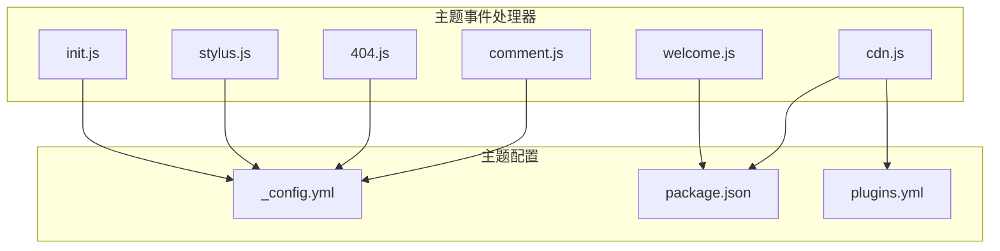
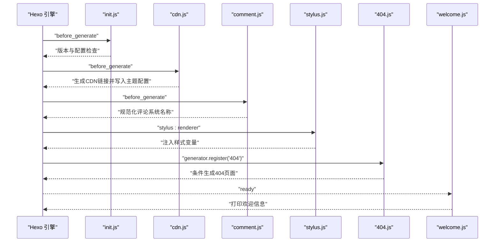
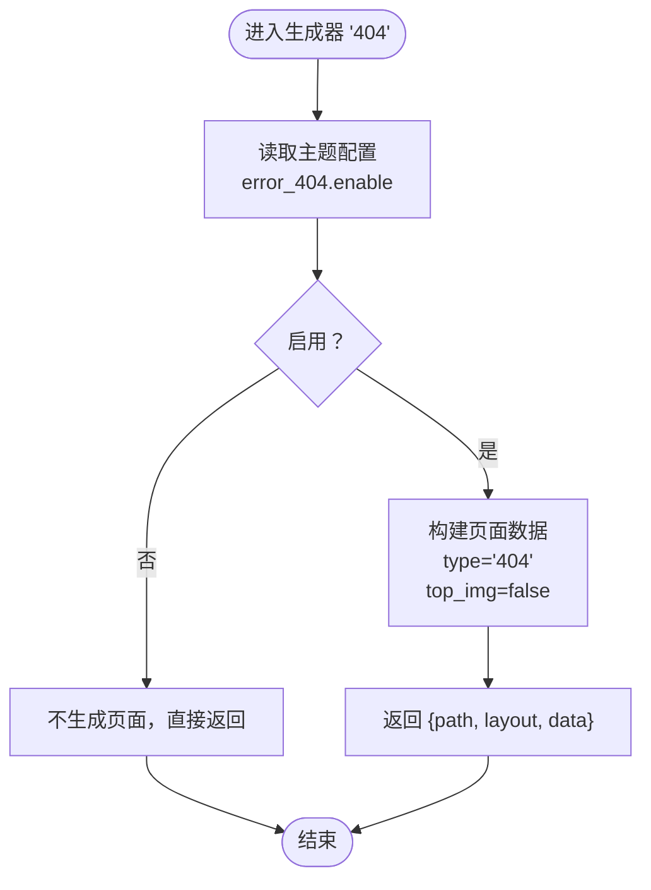
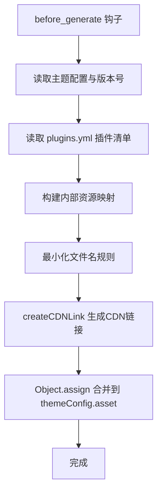
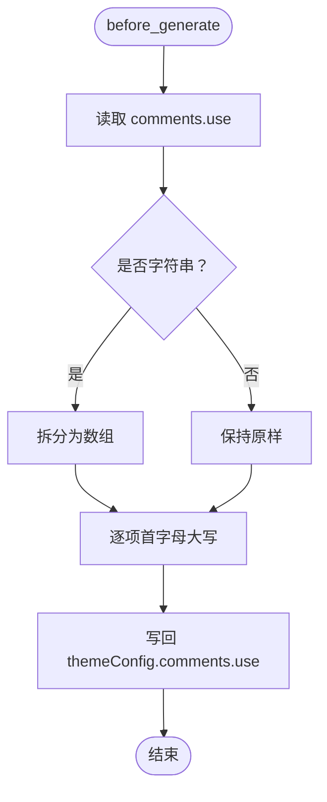
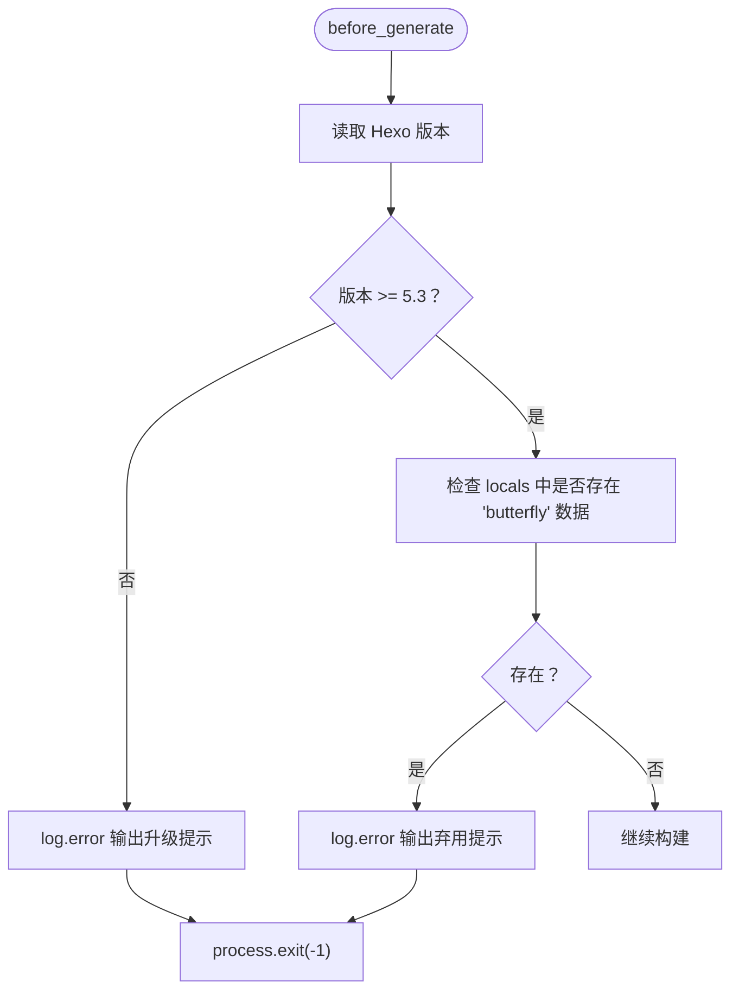
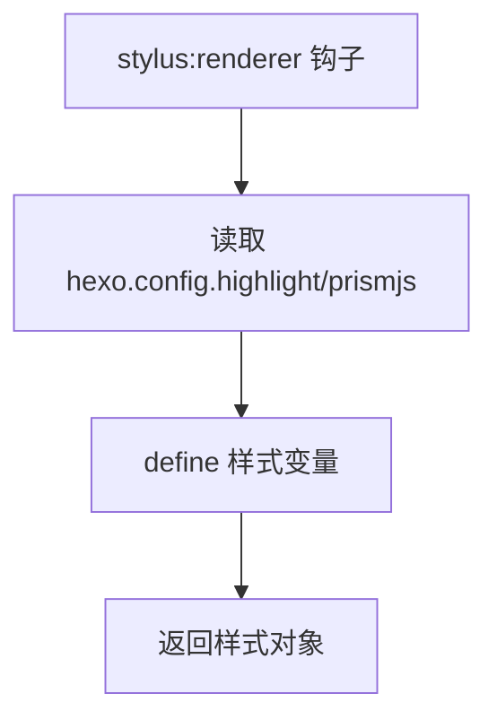
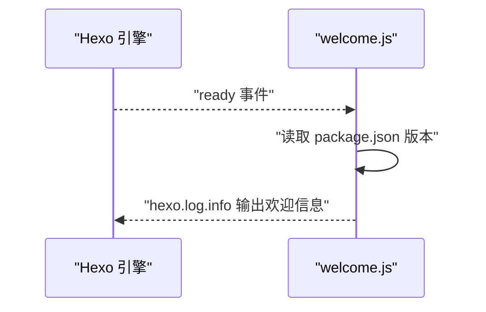
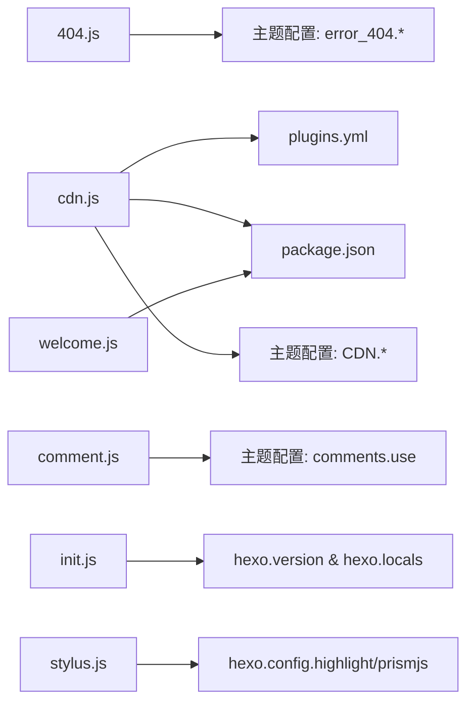

# 事件处理器API

<cite>
**本文引用的文件**
- [themes/butterfly/scripts/events/404.js](file://themes/butterfly/scripts/events/404.js)
- [themes/butterfly/scripts/events/cdn.js](file://themes/butterfly/scripts/events/cdn.js)
- [themes/butterfly/scripts/events/comment.js](file://themes/butterfly/scripts/events/comment.js)
- [themes/butterfly/scripts/events/init.js](file://themes/butterfly/scripts/events/init.js)
- [themes/butterfly/scripts/events/stylus.js](file://themes/butterfly/scripts/events/stylus.js)
- [themes/butterfly/scripts/events/welcome.js](file://themes/butterfly/scripts/events/welcome.js)
- [themes/butterfly/_config.yml](file://themes/butterfly/_config.yml)
- [themes/butterfly/package.json](file://themes/butterfly/package.json)
- [themes/butterfly/plugins.yml](file://themes/butterfly/plugins.yml)
</cite>

## 目录
1. [简介](#简介)
2. [项目结构](#项目结构)
3. [核心组件](#核心组件)
4. [架构总览](#架构总览)
5. [详细组件分析](#详细组件分析)
6. [依赖分析](#依赖分析)
7. [性能考虑](#性能考虑)
8. [故障排查指南](#故障排查指南)
9. [结论](#结论)
10. [附录](#附录)

## 简介
本文件为 H1S97X 博客所采用的 Hexo 主题“butterfly”中的事件处理器API参考文档。重点覆盖以下主题事件处理器的完整规范：404.js、cdn.js、comment.js、init.js、stylus.js、welcome.js。文档将说明各事件处理器的事件类型、回调函数签名、参数传递、生命周期管理与执行时机；提供注册方式、配置选项与自定义扩展方法；并给出最佳实践、错误处理策略与性能优化建议，解释事件处理器与主题渲染流程的集成关系与数据流转机制。

## 项目结构
- 事件处理器位于主题目录下的 scripts/events 目录，每个文件对应一个特定的事件处理职责。
- 主题配置集中于 _config.yml，其中包含 CDN、评论系统、错误页等关键开关与参数。
- 插件清单 plugins.yml 提供第三方资源的名称、版本与文件路径，用于生成CDN链接。
- 包信息 package.json 提供主题版本号，用于CDN链接附加版本参数。

**图表来源**
- [themes/butterfly/scripts/events/404.js](file://themes/butterfly/scripts/events/404.js#L1-L19)
- [themes/butterfly/scripts/events/cdn.js](file://themes/butterfly/scripts/events/cdn.js#L1-L98)
- [themes/butterfly/scripts/events/comment.js](file://themes/butterfly/scripts/events/comment.js#L1-L15)
- [themes/butterfly/scripts/events/init.js](file://themes/butterfly/scripts/events/init.js#L1-L21)
- [themes/butterfly/scripts/events/stylus.js](file://themes/butterfly/scripts/events/stylus.js#L1-L16)
- [themes/butterfly/scripts/events/welcome.js](file://themes/butterfly/scripts/events/welcome.js#L1-L14)
- [themes/butterfly/_config.yml](file://themes/butterfly/_config.yml#L98-L102)
- [themes/butterfly/_config.yml](file://themes/butterfly/_config.yml#L912-L921)
- [themes/butterfly/_config.yml](file://themes/butterfly/_config.yml#L405-L414)
- [themes/butterfly/package.json](file://themes/butterfly/package.json#L1-L33)
- [themes/butterfly/plugins.yml](file://themes/butterfly/plugins.yml#L1-L215)

**章节来源**
- [themes/butterfly/scripts/events/404.js](file://themes/butterfly/scripts/events/404.js#L1-L19)
- [themes/butterfly/scripts/events/cdn.js](file://themes/butterfly/scripts/events/cdn.js#L1-L98)
- [themes/butterfly/scripts/events/comment.js](file://themes/butterfly/scripts/events/comment.js#L1-L15)
- [themes/butterfly/scripts/events/init.js](file://themes/butterfly/scripts/events/init.js#L1-L21)
- [themes/butterfly/scripts/events/stylus.js](file://themes/butterfly/scripts/events/stylus.js#L1-L16)
- [themes/butterfly/scripts/events/welcome.js](file://themes/butterfly/scripts/events/welcome.js#L1-L14)
- [themes/butterfly/_config.yml](file://themes/butterfly/_config.yml#L98-L102)
- [themes/butterfly/_config.yml](file://themes/butterfly/_config.yml#L912-L921)
- [themes/butterfly/_config.yml](file://themes/butterfly/_config.yml#L405-L414)
- [themes/butterfly/package.json](file://themes/butterfly/package.json#L1-L33)
- [themes/butterfly/plugins.yml](file://themes/butterfly/plugins.yml#L1-L215)

## 核心组件
- 404 页面生成器：根据配置决定是否生成 404 页面，并设置页面数据与布局。
- CDN 合并器：在生成前阶段读取主题与第三方插件清单，基于配置选择CDN提供商，生成资源链接并注入主题配置。
- 评论系统初始化：规范化评论系统名称大小写，确保配置一致性。
- 初始化检查：校验 Hexo 版本与配置文件迁移状态，必要时输出错误并终止。
- Stylus 渲染器钩子：向样式渲染器注入主题配置变量，影响高亮与PrismJS等开关。
- 欢迎信息：在 Hexo ready 事件触发时打印主题版本欢迎信息。

**章节来源**
- [themes/butterfly/scripts/events/404.js](file://themes/butterfly/scripts/events/404.js#L8-L18)
- [themes/butterfly/scripts/events/cdn.js](file://themes/butterfly/scripts/events/cdn.js#L11-L97)
- [themes/butterfly/scripts/events/comment.js](file://themes/butterfly/scripts/events/comment.js#L5-L14)
- [themes/butterfly/scripts/events/init.js](file://themes/butterfly/scripts/events/init.js#L1-L21)
- [themes/butterfly/scripts/events/stylus.js](file://themes/butterfly/scripts/events/stylus.js#L7-L15)
- [themes/butterfly/scripts/events/welcome.js](file://themes/butterfly/scripts/events/welcome.js#L1-L14)

## 架构总览
事件处理器通过 Hexo 的事件系统在构建生命周期的关键节点执行，形成“配置预处理—资源链接生成—页面与样式渲染—输出”的流水线。

**图表来源**
- [themes/butterfly/scripts/events/init.js](file://themes/butterfly/scripts/events/init.js#L1-L21)
- [themes/butterfly/scripts/events/cdn.js](file://themes/butterfly/scripts/events/cdn.js#L11-L97)
- [themes/butterfly/scripts/events/comment.js](file://themes/butterfly/scripts/events/comment.js#L5-L14)
- [themes/butterfly/scripts/events/stylus.js](file://themes/butterfly/scripts/events/stylus.js#L7-L15)
- [themes/butterfly/scripts/events/404.js](file://themes/butterfly/scripts/events/404.js#L8-L18)
- [themes/butterfly/scripts/events/welcome.js](file://themes/butterfly/scripts/events/welcome.js#L1-L14)

## 详细组件分析

### 404 页面生成器（404.js）
- 事件类型：生成器注册
- 注册方式：通过 hexo.extend.generator.register 注册名为 “404” 的生成器
- 生命周期与执行时机：在生成阶段由 Hexo 调用，仅当主题配置中 error_404.enable 为真时返回页面数据
- 参数与返回值：
  - 输入：locals（站点集合）
  - 返回：包含路径、布局与数据的对象；数据中 type=‘404’，top_img=false
- 配置项：
  - error_404.enable：是否启用
  - error_404.subtitle：副标题
  - error_404.background：背景图
- 数据流：读取主题配置 → 判断开关 → 返回页面对象给 Hexo 生成器

**图表来源**
- [themes/butterfly/scripts/events/404.js](file://themes/butterfly/scripts/events/404.js#L8-L18)
- [themes/butterfly/_config.yml](file://themes/butterfly/_config.yml#L98-L102)

**章节来源**
- [themes/butterfly/scripts/events/404.js](file://themes/butterfly/scripts/events/404.js#L8-L18)
- [themes/butterfly/_config.yml](file://themes/butterfly/_config.yml#L98-L102)

### CDN 合并器（cdn.js）
- 事件类型：过滤器（before_generate）
- 注册方式：hexo.extend.filter.register('before_generate', ...)
- 生命周期与执行时机：在生成前阶段执行，读取主题与第三方插件清单，生成资源链接并写入 hexo.theme.config.asset
- 关键步骤：
  - 读取主题版本号（package.json）
  - 读取第三方资源清单（plugins.yml）
  - 定义内部资源映射（main、utils、translate、local_search、algolia_js）
  - 生成最小化文件名规则
  - 构造 createCDNLink 函数：根据 provider 生成本地/CDN 链接，支持 jsdelivr、unpkg、cdnjs、custom
  - 删除 null 值并合并结果到 themeConfig.asset
- 配置项（CDN）：
  - internal_provider：内部资源CDN提供商（local/jsdelivr/unpkg/cdnjs/custom）
  - third_party_provider：第三方资源CDN提供商
  - version：是否在URL附加版本号
  - custom_format：自定义CDN格式模板
  - option：可选覆盖单项资源链接
- 数据流：读取配置与清单 → 生成内部与第三方资源链接 → 合并到 themeConfig.asset

**图表来源**
- [themes/butterfly/scripts/events/cdn.js](file://themes/butterfly/scripts/events/cdn.js#L11-L97)
- [themes/butterfly/package.json](file://themes/butterfly/package.json#L1-L33)
- [themes/butterfly/plugins.yml](file://themes/butterfly/plugins.yml#L1-L215)
- [themes/butterfly/_config.yml](file://themes/butterfly/_config.yml#L912-L921)

**章节来源**
- [themes/butterfly/scripts/events/cdn.js](file://themes/butterfly/scripts/events/cdn.js#L11-L97)
- [themes/butterfly/package.json](file://themes/butterfly/package.json#L1-L33)
- [themes/butterfly/plugins.yml](file://themes/butterfly/plugins.yml#L1-L215)
- [themes/butterfly/_config.yml](file://themes/butterfly/_config.yml#L912-L921)

### 评论系统初始化（comment.js）
- 事件类型：过滤器（before_generate）
- 注册方式：hexo.extend.filter.register('before_generate', ...)
- 生命周期与执行时机：在生成前阶段执行，规范化 comments.use 的大小写
- 处理逻辑：
  - 读取 themeConfig.comments.use
  - 若为字符串则拆分为数组
  - 将每个元素首字母大写，其余小写
  - 写回 themeConfig.comments.use
- 数据流：读取配置 → 规范化 → 写回配置

**图表来源**
- [themes/butterfly/scripts/events/comment.js](file://themes/butterfly/scripts/events/comment.js#L5-L14)
- [themes/butterfly/_config.yml](file://themes/butterfly/_config.yml#L405-L414)

**章节来源**
- [themes/butterfly/scripts/events/comment.js](file://themes/butterfly/scripts/events/comment.js#L5-L14)
- [themes/butterfly/_config.yml](file://themes/butterfly/_config.yml#L405-L414)

### 初始化检查（init.js）
- 事件类型：过滤器（before_generate）
- 注册方式：hexo.extend.filter.register('before_generate', ...)
- 生命周期与执行时机：在生成前阶段执行，进行版本与配置迁移检查
- 校验内容：
  - 检查 Hexo 主版本号是否不小于 5.3
  - 检查是否存在已弃用的 butterfly.yml 数据
  - 若不满足要求则输出错误日志并退出进程
- 数据流：读取 hexo 版本与 locals → 校验 → 日志输出 → 退出

**图表来源**
- [themes/butterfly/scripts/events/init.js](file://themes/butterfly/scripts/events/init.js#L1-L21)

**章节来源**
- [themes/butterfly/scripts/events/init.js](file://themes/butterfly/scripts/events/init.js#L1-L21)

### Stylus 渲染器钩子（stylus.js）
- 事件类型：过滤器（stylus:renderer）
- 注册方式：hexo.extend.filter.register('stylus:renderer', ...)
- 生命周期与执行时机：在 Stylus 渲染器初始化时执行，向样式上下文注入变量
- 注入变量：
  - $highlight_enable：基于 hexo.config.highlight.enable
  - $highlight_line_number：基于 hexo.config.highlight.line_number
  - $prismjs_enable：基于 hexo.config.prismjs.enable
  - $prismjs_line_number：基于 hexo.config.prismjs.line_number
- 数据流：读取 hexo.config → define 变量 → 返回样式对象

**图表来源**
- [themes/butterfly/scripts/events/stylus.js](file://themes/butterfly/scripts/events/stylus.js#L7-L15)

**章节来源**
- [themes/butterfly/scripts/events/stylus.js](file://themes/butterfly/scripts/events/stylus.js#L7-L15)

### 欢迎信息（welcome.js）
- 事件类型：事件监听（hexo.on('ready', ...)）
- 注册方式：hexo.on('ready', ...)
- 生命周期与执行时机：在 Hexo 初始化完成后触发，打印主题版本欢迎信息
- 数据流：读取 package.json 版本 → hexo.log.info 输出

**图表来源**
- [themes/butterfly/scripts/events/welcome.js](file://themes/butterfly/scripts/events/welcome.js#L1-L14)
- [themes/butterfly/package.json](file://themes/butterfly/package.json#L1-L33)

**章节来源**
- [themes/butterfly/scripts/events/welcome.js](file://themes/butterfly/scripts/events/welcome.js#L1-L14)
- [themes/butterfly/package.json](file://themes/butterfly/package.json#L1-L33)

## 依赖分析
- 404.js 依赖主题配置中的 error_404.* 字段。
- cdn.js 依赖 plugins.yml 与 package.json，以及主题配置中的 CDN.* 字段。
- comment.js 依赖主题配置中的 comments.use。
- init.js 依赖 hexo.version 与 hexo.locals。
- stylus.js 依赖 hexo.config.highlight 与 hexo.config.prismjs。
- welcome.js 依赖 package.json 的版本字段。

**图表来源**
- [themes/butterfly/scripts/events/404.js](file://themes/butterfly/scripts/events/404.js#L8-L18)
- [themes/butterfly/_config.yml](file://themes/butterfly/_config.yml#L98-L102)
- [themes/butterfly/scripts/events/cdn.js](file://themes/butterfly/scripts/events/cdn.js#L11-L97)
- [themes/butterfly/plugins.yml](file://themes/butterfly/plugins.yml#L1-L215)
- [themes/butterfly/package.json](file://themes/butterfly/package.json#L1-L33)
- [themes/butterfly/_config.yml](file://themes/butterfly/_config.yml#L912-L921)
- [themes/butterfly/scripts/events/comment.js](file://themes/butterfly/scripts/events/comment.js#L5-L14)
- [themes/butterfly/_config.yml](file://themes/butterfly/_config.yml#L405-L414)
- [themes/butterfly/scripts/events/init.js](file://themes/butterfly/scripts/events/init.js#L1-L21)
- [themes/butterfly/scripts/events/stylus.js](file://themes/butterfly/scripts/events/stylus.js#L7-L15)

**章节来源**
- [themes/butterfly/scripts/events/404.js](file://themes/butterfly/scripts/events/404.js#L8-L18)
- [themes/butterfly/_config.yml](file://themes/butterfly/_config.yml#L98-L102)
- [themes/butterfly/scripts/events/cdn.js](file://themes/butterfly/scripts/events/cdn.js#L11-L97)
- [themes/butterfly/plugins.yml](file://themes/butterfly/plugins.yml#L1-L215)
- [themes/butterfly/package.json](file://themes/butterfly/package.json#L1-L33)
- [themes/butterfly/_config.yml](file://themes/butterfly/_config.yml#L912-L921)
- [themes/butterfly/scripts/events/comment.js](file://themes/butterfly/scripts/events/comment.js#L5-L14)
- [themes/butterfly/_config.yml](file://themes/butterfly/_config.yml#L405-L414)
- [themes/butterfly/scripts/events/init.js](file://themes/butterfly/scripts/events/init.js#L1-L21)
- [themes/butterfly/scripts/events/stylus.js](file://themes/butterfly/scripts/events/stylus.js#L7-L15)

## 性能考虑
- CDN 合并器在 before_generate 阶段一次性计算并缓存到 themeConfig.asset，避免后续渲染重复计算，降低运行时开销。
- 404 页面仅在启用时生成，减少不必要的页面输出。
- 评论系统名称规范化在生成前完成，避免渲染阶段的分支判断。
- Stylus 注入变量为常量，不引入额外计算成本。
- 建议：
  - 合理设置 CDN.version，生产环境开启以利用浏览器缓存。
  - 在本地开发时使用 local provider 以提升调试效率。
  - 对于大型站点，优先使用 jsdelivr 或 cdnjs 等成熟CDN，提高加载速度。

[本节为通用建议，无需具体文件分析]

## 故障排查指南
- 版本过低导致构建失败
  - 现象：构建直接退出
  - 排查：确认 Hexo 版本是否不小于 5.3；若低于该版本，请升级 Hexo
  - 参考：init.js 的版本检查逻辑
- 配置弃用警告
  - 现象：输出弃用提示并退出
  - 排查：移除旧的 butterfly.yml 数据，改用新的 _config.butterfly.yml
  - 参考：init.js 的配置检查逻辑
- 404 页面未生成
  - 现象：访问 /404 无页面
  - 排查：确认主题配置中 error_404.enable 是否为真
  - 参考：404.js 的启用判断
- CDN 链接异常
  - 现象：资源加载失败或版本号不匹配
  - 排查：核对 CDN.provider 与 CDN.version 设置；检查 plugins.yml 与 package.json 的版本一致性
  - 参考：cdn.js 的链接生成逻辑
- 评论系统名称大小写问题
  - 现象：评论系统未正确识别
  - 排查：确认 comments.use 的大小写是否符合预期（首字母大写）
  - 参考：comment.js 的规范化逻辑

**章节来源**
- [themes/butterfly/scripts/events/init.js](file://themes/butterfly/scripts/events/init.js#L1-L21)
- [themes/butterfly/scripts/events/404.js](file://themes/butterfly/scripts/events/404.js#L8-L18)
- [themes/butterfly/scripts/events/cdn.js](file://themes/butterfly/scripts/events/cdn.js#L11-L97)
- [themes/butterfly/scripts/events/comment.js](file://themes/butterfly/scripts/events/comment.js#L5-L14)

## 结论
上述事件处理器围绕 Hexo 的生命周期事件，在生成前后对配置、资源与渲染上下文进行必要的预处理与注入，确保主题在构建阶段即具备正确的资源链接、配置状态与渲染变量。通过合理的配置与扩展点，用户可以在不修改主题源码的前提下实现定制化需求，并获得良好的性能与可维护性。

[本节为总结性内容，无需具体文件分析]

## 附录
- 配置项速览（部分）
  - 错误页：error_404.enable、error_404.subtitle、error_404.background
  - CDN：CDN.internal_provider、CDN.third_party_provider、CDN.version、CDN.custom_format、CDN.option
  - 评论系统：comments.use、comments.text、comments.lazyload、comments.count
- 扩展建议
  - 自定义CDN：通过 CDN.custom_format 模板化链接
  - 资源覆盖：在 CDN.option 中单独覆盖某项资源链接
  - 评论系统：在 comments.use 中指定多个评论系统，按顺序生效

**章节来源**
- [themes/butterfly/_config.yml](file://themes/butterfly/_config.yml#L98-L102)
- [themes/butterfly/_config.yml](file://themes/butterfly/_config.yml#L912-L921)
- [themes/butterfly/_config.yml](file://themes/butterfly/_config.yml#L405-L414)
- [themes/butterfly/plugins.yml](file://themes/butterfly/plugins.yml#L1-L215)