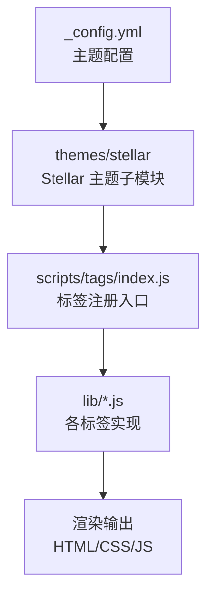
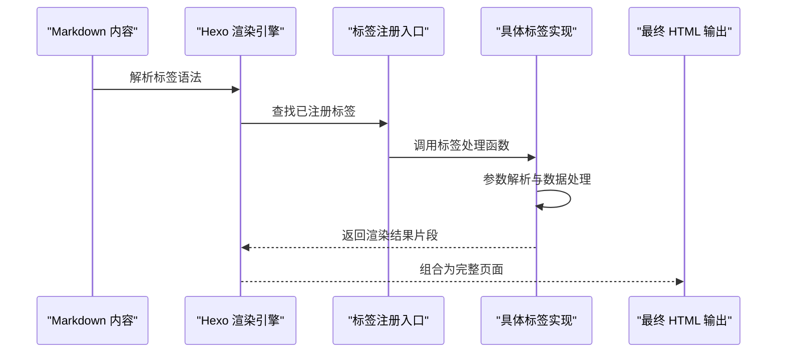
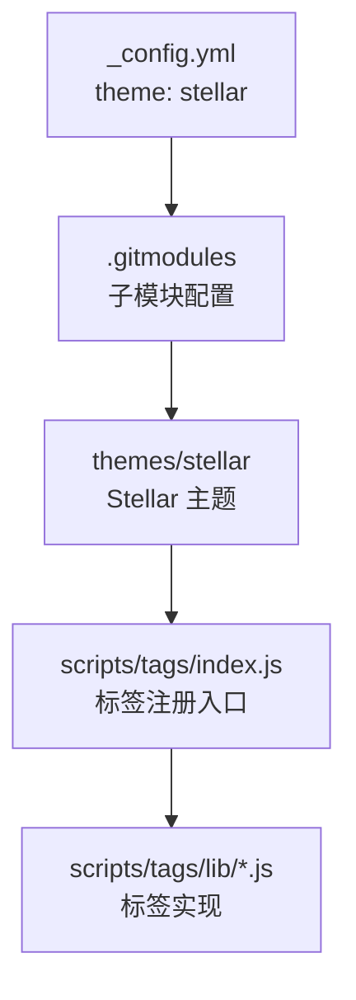

# 标签插件API

<cite>
**本文档引用的文件**
- [themes/stellar/scripts/tags/index.js](file://themes/stellar/scripts/tags/index.js)
- [_config.yml](file://_config.yml)
- [.gitmodules](file://.gitmodules)
</cite>

## 目录
1. [简介](#简介)
2. [项目结构](#项目结构)
3. [核心组件](#核心组件)
4. [架构概览](#架构概览)
5. [详细组件分析](#详细组件分析)
6. [依赖分析](#依赖分析)
7. [性能考虑](#性能考虑)
8. [故障排除指南](#故障排除指南)
9. [结论](#结论)
10. [附录](#附录)

## 简介
本文件为 H1S97X 博客基于 Hexo 的标签插件 API 参考文档。根据当前仓库配置，博客使用的是 Stellar 主题（通过 Git 子模块引入），该主题提供了丰富的自定义标签，用于增强 Markdown 内容的表现力与交互性。

本参考文档将系统性地梳理以下标签族的 API 规范：
- 容器类标签：tabs、box、about、folding、folders、grid、swiper、gallery、banner
- 数据展示类标签：users、friends、albums、posters、sites、ghcard、toc、timeline、md、chat
- 表达类标签：checkbox、radio、copy、emoji、icon、frame、image、link、button、mark、navbar、note、poetry、quot、blockquote、hashtag、okr、audio、video、rating、vote
- 阅读类标签：reel、paper

由于主题通过 Git 子模块管理，且当前工作区未包含子模块内容，本文档以配置与注册入口为依据进行规范性整理，并提供可扩展的使用指南与最佳实践。

## 项目结构
H1S97X 博客采用 Hexo + 主题子模块的结构：
- 主题通过 Git 子模块方式引入，当前配置指向 `themes/stellar`
- 标签插件注册集中在主题的标签入口文件中
- 通过 Hexo 的标签扩展机制完成注册与渲染

**图表来源**
- [_config.yml](file://_config.yml#L104-L104)
- [.gitmodules](file://.gitmodules#L25-L27)
- [themes/stellar/scripts/tags/index.js](file://themes/stellar/scripts/tags/index.js#L1-L56)

**章节来源**
- [_config.yml](file://_config.yml#L104-L104)
- [.gitmodules](file://.gitmodules#L1-L28)

## 核心组件
- 标签注册入口：位于 `themes/stellar/scripts/tags/index.js`，集中注册所有可用标签
- 标签实现：每个标签对应一个独立的实现文件，位于 `themes/stellar/scripts/tags/lib/` 下
- 渲染机制：通过 Hexo 的标签扩展 API 注册，支持单标签与结束标签两种形式
- 结束标签标志：部分标签声明 `{ends: true}`，表示需要闭合语法

**章节来源**
- [themes/stellar/scripts/tags/index.js](file://themes/stellar/scripts/tags/index.js#L1-L56)

## 架构概览
标签插件的整体架构遵循 Hexo 的标签扩展模式：
- 入口文件负责注册所有标签
- 每个标签实现封装自身的参数解析、数据处理与模板渲染
- 支持嵌套与组合使用，满足复杂页面布局需求

**图表来源**
- [themes/stellar/scripts/tags/index.js](file://themes/stellar/scripts/tags/index.js#L5-L56)

## 详细组件分析

### 容器类标签
- tabs
  - 用途：多面板切换容器
  - 注册：`hexo.extend.tag.register('tabs', require('./lib/tabs')(hexo), true)`
  - 说明：支持结束标签，常用于分组内容展示
- box
  - 用途：通用容器
  - 注册：`hexo.extend.tag.register('box', require('./lib/box')(hexo), true)`
- about
  - 用途：个人信息或简介容器
  - 注册：`hexo.extend.tag.register('about', require('./lib/about')(hexo), true)`
- folding
  - 用途：折叠/展开内容容器
  - 注册：`hexo.extend.tag.register('folding', require('./lib/folding')(hexo), true)`
- folders
  - 用途：文件夹式分组容器
  - 注册：`hexo.extend.tag.register('folders', require('./lib/folders')(hexo), true)`
- grid
  - 用途：网格布局容器
  - 注册：`hexo.extend.tag.register('grid', require('./lib/grid')(hexo), true)`
- swiper
  - 用途：轮播/滑动容器
  - 注册：`hexo.extend.tag.register('swiper', require('./lib/swiper')(hexo), true)`
- gallery
  - 用途：相册/画廊展示
  - 注册：`hexo.extend.tag.register('gallery', require('./lib/gallery')(hexo), {ends: true})`
- banner
  - 用途：横幅/广告位容器
  - 注册：`hexo.extend.tag.register('banner', require('./lib/banner')(hexo), true)`

**章节来源**
- [themes/stellar/scripts/tags/index.js](file://themes/stellar/scripts/tags/index.js#L6-L15)

### 数据展示类标签
- users / friends
  - 用途：用户/好友列表展示
  - 注册：`hexo.extend.tag.register('users', require('./lib/friends')(hexo))`；`hexo.extend.tag.register('friends', require('./lib/friends')(hexo))`
- albums
  - 用途：专辑/作品集展示
  - 注册：`hexo.extend.tag.register('albums', require('./lib/albums')(hexo))`
- posters
  - 用途：海报/封面展示
  - 注册：`hexo.extend.tag.register('posters', require('./lib/posters')(hexo))`
- sites
  - 用途：站点/链接集合
  - 注册：`hexo.extend.tag.register('sites', require('./lib/sites')(hexo))`
- ghcard
  - 用途：GitHub 用户卡片
  - 注册：`hexo.extend.tag.register('ghcard', require('./lib/ghcard')(hexo))`
- toc
  - 用途：文章目录
  - 注册：`hexo.extend.tag.register('toc', require('./lib/toc')(hexo))`
- timeline
  - 用途：时间线
  - 注册：`hexo.extend.tag.register('timeline', require('./lib/timeline')(hexo), {ends: true})`
- md
  - 用途：内联 Markdown 渲染
  - 注册：`hexo.extend.tag.register('md', require('./lib/md')(hexo))`
- chat
  - 用途：对话/聊天气泡
  - 注册：`hexo.extend.tag.register('chat', require('./lib/chat')(hexo), {ends: true})`

**章节来源**
- [themes/stellar/scripts/tags/index.js](file://themes/stellar/scripts/tags/index.js#L16-L26)

### 表达类标签
- checkbox / radio
  - 用途：选择控件
  - 注册：`hexo.extend.tag.register('checkbox', require('./lib/checkbox')(hexo, 'checkbox'))`；`hexo.extend.tag.register('radio', require('./lib/checkbox')(hexo, 'radio'))`
- copy
  - 用途：一键复制
  - 注册：`hexo.extend.tag.register('copy', require('./lib/copy')(hexo))`
- emoji
  - 用途：表情符号
  - 注册：`hexo.extend.tag.register('emoji', require('./lib/emoji')(hexo))`
- icon
  - 用途：图标
  - 注册：`hexo.extend.tag.register('icon', require('./lib/icon')(hexo))`
- frame
  - 用途：框架/iframe 容器
  - 注册：`hexo.extend.tag.register('frame', require('./lib/frame')(hexo))`
- image
  - 用途：图片展示
  - 注册：`hexo.extend.tag.register('image', require('./lib/image')(hexo))`
- link
  - 用途：链接按钮
  - 注册：`hexo.extend.tag.register('link', require('./lib/link')(hexo))`
- button
  - 用途：按钮
  - 注册：`hexo.extend.tag.register('button', require('./lib/button')(hexo))`
- mark
  - 用途：高亮文本
  - 注册：`hexo.extend.tag.register('mark', require('./lib/mark')(hexo))`
- navbar
  - 用途：导航栏
  - 注册：`hexo.extend.tag.register('navbar', require('./lib/navbar')(hexo))`
- note
  - 用途：提示/备注
  - 注册：`hexo.extend.tag.register('note', require('./lib/note')(hexo))`
- poetry
  - 用途：诗歌/诗句展示
  - 注册：`hexo.extend.tag.register('poetry', require('./lib/poetry')(hexo), true)`
- quot
  - 用途：引用块
  - 注册：`hexo.extend.tag.register('quot', require('./lib/quot')(hexo))`
- blockquote
  - 用途：块级引用
  - 注册：`hexo.extend.tag.register('blockquote', require('./lib/blockquote')(hexo), true)`
- hashtag
  - 用途：话题标签
  - 注册：`hexo.extend.tag.register('hashtag', require('./lib/hashtag')(hexo))`
- okr
  - 用途：目标与关键成果
  - 注册：`hexo.extend.tag.register('okr', require('./lib/okr')(hexo), {ends: true})`
- audio
  - 用途：音频播放
  - 注册：`hexo.extend.tag.register('audio', require('./lib/audio')(hexo))`
- video
  - 用途：视频播放
  - 注册：`hexo.extend.tag.register('video', require('./lib/video')(hexo))`
- rating
  - 用途：评分
  - 注册：`hexo.extend.tag.register('rating', require('./lib/rating')(hexo))`
- vote
  - 用途：投票
  - 注册：`hexo.extend.tag.register('vote', require('./lib/vote')(hexo))`

**章节来源**
- [themes/stellar/scripts/tags/index.js](file://themes/stellar/scripts/tags/index.js#L28-L49)

### 阅读类标签
- reel
  - 用途：阅读进度条/滚动反馈
  - 注册：`hexo.extend.tag.register('reel', require('./lib/read/reel')(hexo), true)`
- paper
  - 用途：纸质风格阅读容器
  - 注册：`hexo.extend.tag.register('paper', require('./lib/read/paper')(hexo), true)`

**章节来源**
- [themes/stellar/scripts/tags/index.js](file://themes/stellar/scripts/tags/index.js#L51-L53)

## 依赖分析
- 主题来源：通过 Git 子模块引入，路径为 `themes/stellar`
- 主题配置：在根配置文件中设置 `theme: stellar`
- 标签注册：集中于主题的标签入口文件，按类别分组注册

**图表来源**
- [_config.yml](file://_config.yml#L104-L104)
- [.gitmodules](file://.gitmodules#L25-L27)
- [themes/stellar/scripts/tags/index.js](file://themes/stellar/scripts/tags/index.js#L1-L56)

**章节来源**
- [_config.yml](file://_config.yml#L104-L104)
- [.gitmodules](file://.gitmodules#L1-L28)

## 性能考虑
- 合理使用结束标签：对于需要闭合语法的标签（如 `gallery`、`timeline`、`okr` 等），确保正确闭合以避免不必要的 DOM 结构嵌套
- 图片与媒体：优先使用懒加载与响应式尺寸，减少首屏渲染压力
- 交互组件：如 `swiper`、`checkbox`、`radio` 等，建议在移动端启用触摸优化
- 样式与脚本：尽量复用主题提供的样式类名，减少额外的 CSS/JS 注入

## 故障排除指南
- 标签不生效
  - 检查主题是否正确加载：确认 `_config.yml` 中的 `theme` 设置为 `stellar`
  - 确认子模块已初始化：执行 `git submodule update --init --recursive`
- 样式异常
  - 检查标签参数是否符合实现要求，避免传入非法值
  - 确保主题样式文件未被覆盖或删除
- 嵌套问题
  - 对于声明 `{ends: true}` 的标签，务必提供对应的结束标记
- 渲染错误
  - 若出现空指针或类型错误，检查传入的数据结构是否与实现预期一致

**章节来源**
- [_config.yml](file://_config.yml#L104-L104)
- [.gitmodules](file://.gitmodules#L1-L28)

## 结论
本参考文档基于当前仓库的配置与标签注册入口，对 H1S97X 博客所用的标签插件进行了系统性梳理。由于主题通过子模块管理，实际标签实现位于 `themes/stellar/scripts/tags/lib/` 目录下。建议在使用过程中结合主题文档与实现细节，合理组织标签嵌套与参数配置，以获得最佳的渲染效果与用户体验。

## 附录
- 使用建议
  - 优先使用语义明确的标签组合，提升内容可读性
  - 在复杂布局中，建议先用容器类标签组织结构，再在内部插入表达类标签
  - 注意移动端适配，必要时添加响应式样式
- 最佳实践
  - 将重复使用的样式与交互封装为组件，减少重复代码
  - 对外部资源（如视频、音频）做好错误兜底与加载提示
  - 在长文阅读场景中，配合 `reel`、`paper` 等标签提升阅读体验