# 生成器函数API

<cite>
**本文引用的文件**
- [themes/stellar/scripts/generators/404.js](file://themes/stellar/scripts/generators/404.js)
- [themes/stellar/scripts/generators/author.js](file://themes/stellar/scripts/generators/author.js)
- [themes/stellar/scripts/generators/categories.js](file://themes/stellar/scripts/generators/categories.js)
- [themes/stellar/scripts/generators/notebooks.js](file://themes/stellar/scripts/generators/notebooks.js)
- [themes/stellar/scripts/generators/search.js](file://themes/stellar/scripts/generators/search.js)
- [themes/stellar/scripts/generators/tags.js](file://themes/stellar/scripts/generators/tags.js)
- [themes/stellar/scripts/generators/topic.js](file://themes/stellar/scripts/generators/topic.js)
- [themes/stellar/scripts/generators/wiki.js](file://themes/stellar/scripts/generators/wiki.js)
- [themes/stellar/_config.yml](file://themes/stellar/_config.yml)
- [themes/stellar/layout/404.ejs](file://themes/stellar/layout/404.ejs)
- [themes/stellar/layout/categories.ejs](file://themes/stellar/layout/categories.ejs)
- [themes/stellar/layout/tags.ejs](file://themes/stellar/layout/tags.ejs)
- [themes/stellar/layout/index_wiki.ejs](file://themes/stellar/layout/index_wiki.ejs)
- [themes/stellar/layout/index_topic.ejs](file://themes/stellar/layout/index_topic.ejs)
- [themes/stellar/layout/notebooks.ejs](file://themes/stellar/layout/notebooks.ejs)
</cite>

## 目录
1. [简介](#简介)
2. [项目结构](#项目结构)
3. [核心组件](#核心组件)
4. [架构总览](#架构总览)
5. [详细组件分析](#详细组件分析)
6. [依赖分析](#依赖分析)
7. [性能考虑](#性能考虑)
8. [故障排查指南](#故障排查指南)
9. [结论](#结论)
10. [附录](#附录)

## 简介
本文件为 H1S97X 博客基于 Hexo 的主题“Stellar”所实现的页面生成器函数API参考文档。目标是系统化梳理并说明以下生成器的接口规范、路由配置、数据处理逻辑、模板选择与输出格式，并给出配置参数、URL 模式、SEO 优化选项、性能优化与缓存策略、增量更新机制，以及它们与 Hexo 静态站点生成流程的集成关系。

涉及的生成器包括：404、author、categories、notebooks、search、tags、topic、wiki。

## 项目结构
- 生成器集中位于主题目录下的 scripts/generators 目录，每个生成器以独立文件实现，遵循 Hexo generator 注册规范。
- 模板位于主题的 layout 目录，按页面类型命名，如 404.ejs、categories.ejs、tags.ejs、index_wiki.ejs、index_topic.ejs、notebooks.ejs 等。
- 主题配置位于 _config.yml，其中包含 site_tree、search、wiki、topic、notebook 等关键配置项，直接影响生成器的行为与输出路径。

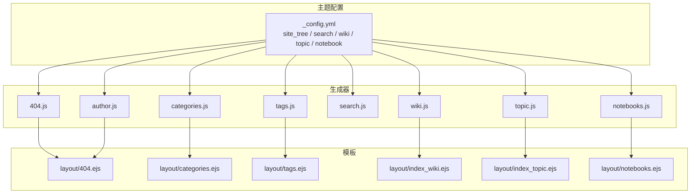

**图表来源**
- [themes/stellar/_config.yml](file://themes/stellar/_config.yml#L73-L152)
- [themes/stellar/scripts/generators/404.js](file://themes/stellar/scripts/generators/404.js#L5-L15)
- [themes/stellar/scripts/generators/author.js](file://themes/stellar/scripts/generators/author.js#L5-L27)
- [themes/stellar/scripts/generators/categories.js](file://themes/stellar/scripts/generators/categories.js#L5-L16)
- [themes/stellar/scripts/generators/notebooks.js](file://themes/stellar/scripts/generators/notebooks.js#L5-L73)
- [themes/stellar/scripts/generators/search.js](file://themes/stellar/scripts/generators/search.js#L6-L101)
- [themes/stellar/scripts/generators/tags.js](file://themes/stellar/scripts/generators/tags.js#L5-L16)
- [themes/stellar/scripts/generators/topic.js](file://themes/stellar/scripts/generators/topic.js#L5-L22)
- [themes/stellar/scripts/generators/wiki.js](file://themes/stellar/scripts/generators/wiki.js#L5-L39)
- [themes/stellar/layout/404.ejs](file://themes/stellar/layout/404.ejs#L1-L20)
- [themes/stellar/layout/categories.ejs](file://themes/stellar/layout/categories.ejs#L1-L24)
- [themes/stellar/layout/tags.ejs](file://themes/stellar/layout/tags.ejs#L1-L21)
- [themes/stellar/layout/index_wiki.ejs](file://themes/stellar/layout/index_wiki.ejs#L1-L44)
- [themes/stellar/layout/index_topic.ejs](file://themes/stellar/layout/index_topic.ejs#L1-L30)
- [themes/stellar/layout/notebooks.ejs](file://themes/stellar/layout/notebooks.ejs#L1-L9)

**章节来源**
- [themes/stellar/_config.yml](file://themes/stellar/_config.yml#L73-L152)
- [themes/stellar/scripts/generators/404.js](file://themes/stellar/scripts/generators/404.js#L5-L15)
- [themes/stellar/scripts/generators/author.js](file://themes/stellar/scripts/generators/author.js#L5-L27)
- [themes/stellar/scripts/generators/categories.js](file://themes/stellar/scripts/generators/categories.js#L5-L16)
- [themes/stellar/scripts/generators/notebooks.js](file://themes/stellar/scripts/generators/notebooks.js#L5-L73)
- [themes/stellar/scripts/generators/search.js](file://themes/stellar/scripts/generators/search.js#L6-L101)
- [themes/stellar/scripts/generators/tags.js](file://themes/stellar/scripts/generators/tags.js#L5-L16)
- [themes/stellar/scripts/generators/topic.js](file://themes/stellar/scripts/generators/topic.js#L5-L22)
- [themes/stellar/scripts/generators/wiki.js](file://themes/stellar/scripts/generators/wiki.js#L5-L39)

## 核心组件
- 404 生成器：注册名为“404”的生成器，输出错误页，使用主题配置中的错误页路径与菜单标识。
- author 生成器：遍历作者配置，为每位非隐藏作者生成归档页，使用 archive 布局。
- categories 生成器：当存在分类时，生成分类列表页；否则返回空。
- notebooks 生成器：生成笔记本列表页与各笔记本内按标签分页的笔记列表页，使用 hexo-pagination 处理分页。
- search 生成器：条件生成本地搜索 JSON，按配置过滤字段与路径，清理 HTML 并序列化输出。
- tags 生成器：当存在标签时，生成标签列表页；否则返回空。
- topic 生成器：生成专栏主页，使用 index_topic 布局。
- wiki 生成器：生成 wiki 主页及按标签筛选的 wiki 列表页，使用 index_wiki 布局。

**章节来源**
- [themes/stellar/scripts/generators/404.js](file://themes/stellar/scripts/generators/404.js#L5-L15)
- [themes/stellar/scripts/generators/author.js](file://themes/stellar/scripts/generators/author.js#L5-L27)
- [themes/stellar/scripts/generators/categories.js](file://themes/stellar/scripts/generators/categories.js#L5-L16)
- [themes/stellar/scripts/generators/notebooks.js](file://themes/stellar/scripts/generators/notebooks.js#L5-L73)
- [themes/stellar/scripts/generators/search.js](file://themes/stellar/scripts/generators/search.js#L6-L101)
- [themes/stellar/scripts/generators/tags.js](file://themes/stellar/scripts/generators/tags.js#L5-L16)
- [themes/stellar/scripts/generators/topic.js](file://themes/stellar/scripts/generators/topic.js#L5-L22)
- [themes/stellar/scripts/generators/wiki.js](file://themes/stellar/scripts/generators/wiki.js#L5-L39)

## 架构总览
生成器在 Hexo 构建阶段被调用，读取主题配置与本地数据，返回页面路由对象数组。每个路由对象包含：
- path：输出路径
- layout：使用的模板布局数组
- data：传递给模板的数据对象

模板通过 EJS 渲染，结合主题配置与页面元数据，最终生成静态 HTML。

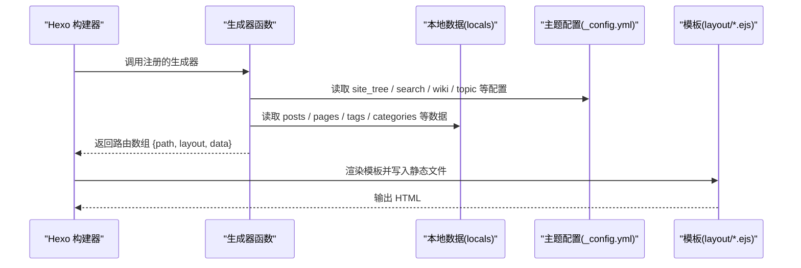

**图表来源**
- [themes/stellar/scripts/generators/404.js](file://themes/stellar/scripts/generators/404.js#L5-L15)
- [themes/stellar/scripts/generators/author.js](file://themes/stellar/scripts/generators/author.js#L5-L27)
- [themes/stellar/scripts/generators/categories.js](file://themes/stellar/scripts/generators/categories.js#L5-L16)
- [themes/stellar/scripts/generators/notebooks.js](file://themes/stellar/scripts/generators/notebooks.js#L5-L73)
- [themes/stellar/scripts/generators/search.js](file://themes/stellar/scripts/generators/search.js#L6-L101)
- [themes/stellar/scripts/generators/tags.js](file://themes/stellar/scripts/generators/tags.js#L5-L16)
- [themes/stellar/scripts/generators/topic.js](file://themes/stellar/scripts/generators/topic.js#L5-L22)
- [themes/stellar/scripts/generators/wiki.js](file://themes/stellar/scripts/generators/wiki.js#L5-L39)
- [themes/stellar/_config.yml](file://themes/stellar/_config.yml#L73-L152)

## 详细组件分析

### 404 生成器
- 注册名：404
- 路由配置：使用主题配置中的 site_tree.error_page['404'] 作为输出路径
- 模板：404.ejs
- 数据：包含 layout 与 menu_id，robots 设置为“none”
- SEO：通过模板设置 robots=noindex,follow，避免搜索引擎索引

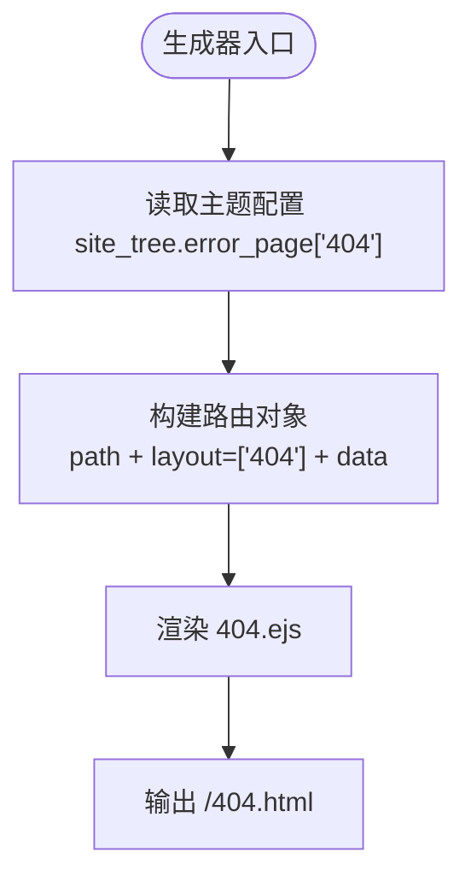

**图表来源**
- [themes/stellar/scripts/generators/404.js](file://themes/stellar/scripts/generators/404.js#L5-L15)
- [themes/stellar/layout/404.ejs](file://themes/stellar/layout/404.ejs#L1-L20)
- [themes/stellar/_config.yml](file://themes/stellar/_config.yml#L143-L147)

**章节来源**
- [themes/stellar/scripts/generators/404.js](file://themes/stellar/scripts/generators/404.js#L5-L15)
- [themes/stellar/layout/404.ejs](file://themes/stellar/layout/404.ejs#L1-L20)
- [themes/stellar/_config.yml](file://themes/stellar/_config.yml#L143-L147)

### author 生成器
- 注册名：author
- 数据来源：主题配置中的 authors
- 逻辑：遍历作者，跳过 hidden=true 的作者，为每位作者生成归档页，使用 archive 布局
- 路由：使用作者配置中的 path 字段
- 模板：archive（对应模板文件未在本节列出）

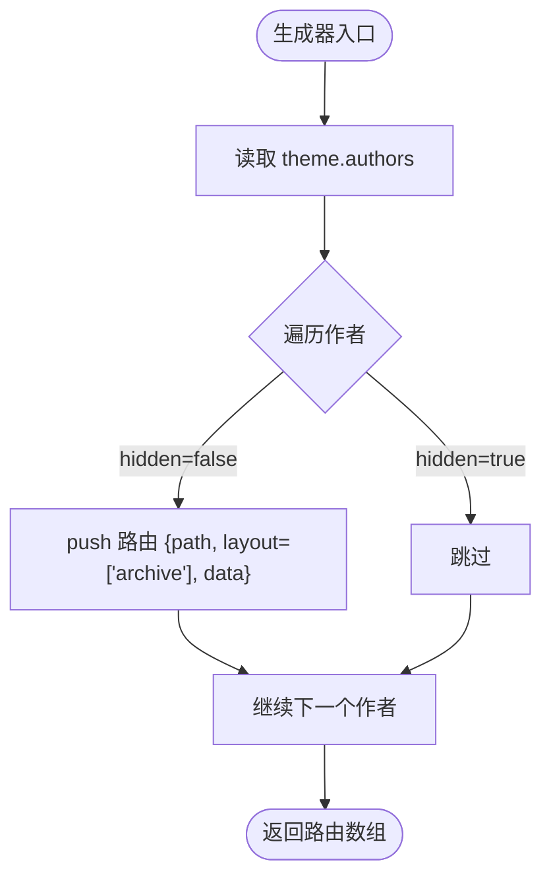

**图表来源**
- [themes/stellar/scripts/generators/author.js](file://themes/stellar/scripts/generators/author.js#L5-L27)

**章节来源**
- [themes/stellar/scripts/generators/author.js](file://themes/stellar/scripts/generators/author.js#L5-L27)

### categories 生成器
- 注册名：categories
- 条件：当 locals.categories 非空时生成
- 路径：使用 hexo.config.category_dir + “/index.html”
- 模板：categories.ejs
- 数据：传递 locals.posts
- SEO：模板设置 robots=noindex,follow

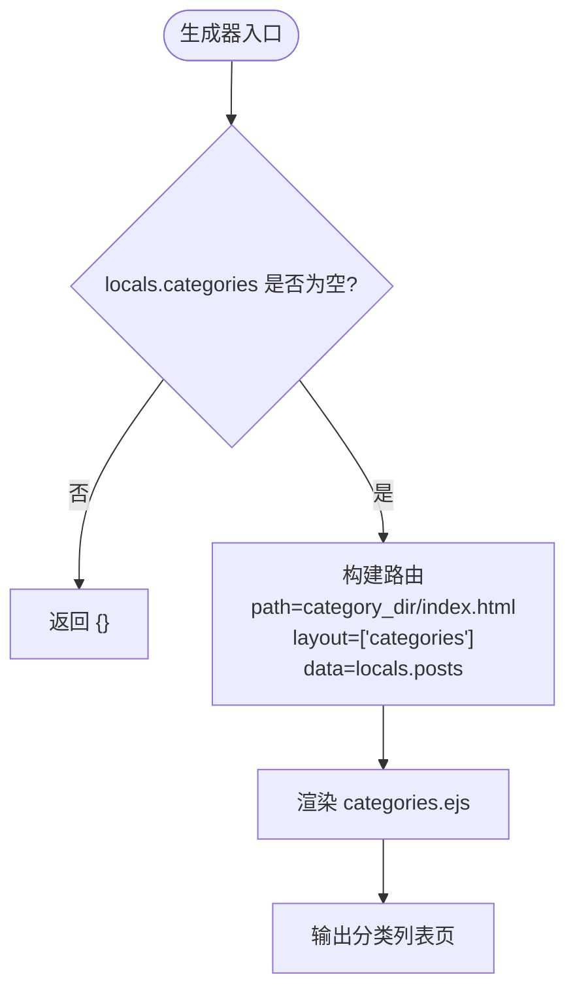

**图表来源**
- [themes/stellar/scripts/generators/categories.js](file://themes/stellar/scripts/generators/categories.js#L5-L16)
- [themes/stellar/layout/categories.ejs](file://themes/stellar/layout/categories.ejs#L1-L24)

**章节来源**
- [themes/stellar/scripts/generators/categories.js](file://themes/stellar/scripts/generators/categories.js#L5-L16)
- [themes/stellar/layout/categories.ejs](file://themes/stellar/layout/categories.ejs#L1-L24)

### notebooks 生成器
- 注册名：notebooks
- 数据来源：主题配置 notebooks.tree 与 locals.pages
- 逻辑要点：
  - 生成笔记本列表页（index.html）
  - 遍历 notebooks.tree，对每个笔记本：
    - 过滤 pages 中属于该笔记本的笔记
    - 按 pinned 优先与 order_by 排序
    - 为每个标签生成分页列表（使用 hexo-pagination）
- 分页：自定义 paginationWithEmpty 处理空集合的分页占位
- 模板：notebooks.ejs（列表页）、notes.ejs（笔记列表，模板文件未在本节列出）

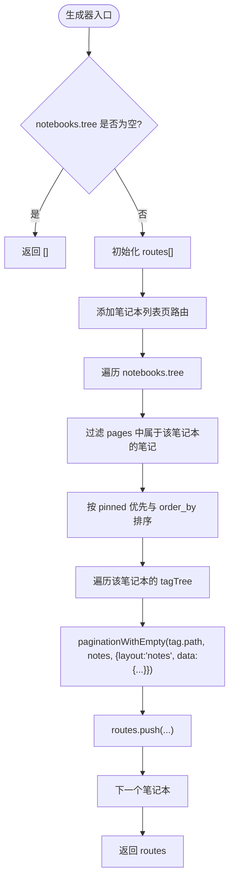

**图表来源**
- [themes/stellar/scripts/generators/notebooks.js](file://themes/stellar/scripts/generators/notebooks.js#L5-L73)
- [themes/stellar/layout/notebooks.ejs](file://themes/stellar/layout/notebooks.ejs#L1-L9)

**章节来源**
- [themes/stellar/scripts/generators/notebooks.js](file://themes/stellar/scripts/generators/notebooks.js#L5-L73)
- [themes/stellar/layout/notebooks.ejs](file://themes/stellar/layout/notebooks.ejs#L1-L9)

### search 生成器
- 注册名：search_json_generator
- 条件：仅当 theme.config.search.service == 'local_search' 时生成
- 字段过滤：支持 field='post'|'page'|'all'
- 内容清洗：stripHTML、去除特定标签与实体、规范化空白
- 跳过规则：可通过 skip_search 模式匹配路径跳过索引
- 输出：JSON 字符串，路径由 theme.config.search.local_search.path 指定

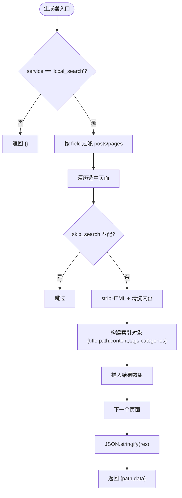

**图表来源**
- [themes/stellar/scripts/generators/search.js](file://themes/stellar/scripts/generators/search.js#L6-L101)
- [themes/stellar/_config.yml](file://themes/stellar/_config.yml#L206-L218)

**章节来源**
- [themes/stellar/scripts/generators/search.js](file://themes/stellar/scripts/generators/search.js#L6-L101)
- [themes/stellar/_config.yml](file://themes/stellar/_config.yml#L206-L218)

### tags 生成器
- 注册名：tags
- 条件：当 locals.tags 非空时生成
- 路径：使用 hexo.config.tag_dir + “/index.html”
- 模板：tags.ejs
- 数据：传递 locals.posts
- SEO：模板设置 robots=noindex,follow

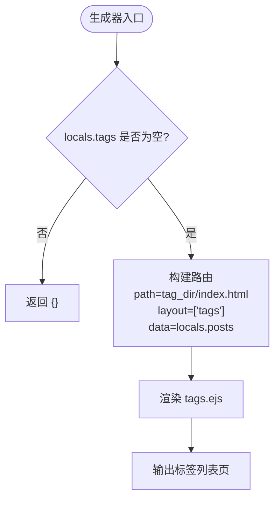

**图表来源**
- [themes/stellar/scripts/generators/tags.js](file://themes/stellar/scripts/generators/tags.js#L5-L16)
- [themes/stellar/layout/tags.ejs](file://themes/stellar/layout/tags.ejs#L1-L21)

**章节来源**
- [themes/stellar/scripts/generators/tags.js](file://themes/stellar/scripts/generators/tags.js#L5-L16)
- [themes/stellar/layout/tags.ejs](file://themes/stellar/layout/tags.ejs#L1-L21)

### topic 生成器
- 注册名：index_topic
- 数据来源：主题配置 topic.tree
- 逻辑：若存在 topicIdList，则生成主页路由（index.html），使用 index_topic 布局
- 模板：index_topic.ejs

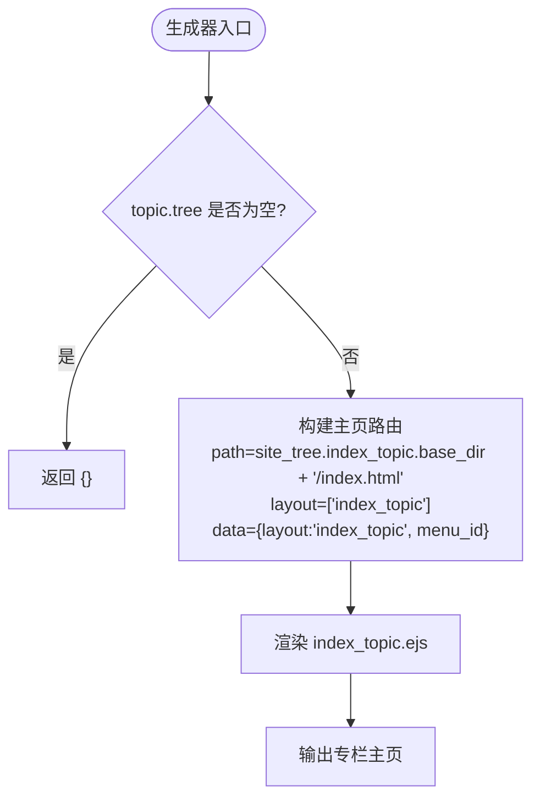

**图表来源**
- [themes/stellar/scripts/generators/topic.js](file://themes/stellar/scripts/generators/topic.js#L5-L22)
- [themes/stellar/layout/index_topic.ejs](file://themes/stellar/layout/index_topic.ejs#L1-L30)
- [themes/stellar/_config.yml](file://themes/stellar/_config.yml#L88-L90)

**章节来源**
- [themes/stellar/scripts/generators/topic.js](file://themes/stellar/scripts/generators/topic.js#L5-L22)
- [themes/stellar/layout/index_topic.ejs](file://themes/stellar/layout/index_topic.ejs#L1-L30)
- [themes/stellar/_config.yml](file://themes/stellar/_config.yml#L88-L90)

### wiki 生成器
- 注册名：wiki
- 数据来源：主题配置 wiki.tree 与 wiki.all_tags
- 逻辑：
  - 生成 wiki 主页（index.html），使用 index_wiki 布局
  - 若开启 all_tags，则为每个标签生成筛选页，传递 filter、tagName、title 等数据
- 模板：index_wiki.ejs

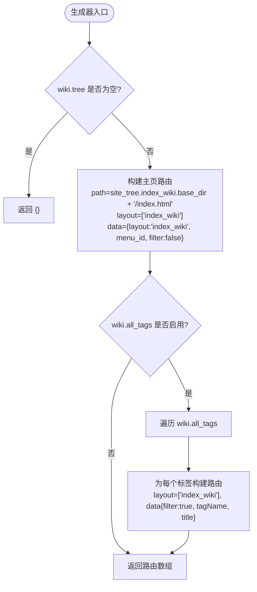

**图表来源**
- [themes/stellar/scripts/generators/wiki.js](file://themes/stellar/scripts/generators/wiki.js#L5-L39)
- [themes/stellar/layout/index_wiki.ejs](file://themes/stellar/layout/index_wiki.ejs#L1-L44)
- [themes/stellar/_config.yml](file://themes/stellar/_config.yml#L92-L96)

**章节来源**
- [themes/stellar/scripts/generators/wiki.js](file://themes/stellar/scripts/generators/wiki.js#L5-L39)
- [themes/stellar/layout/index_wiki.ejs](file://themes/stellar/layout/index_wiki.ejs#L1-L44)
- [themes/stellar/_config.yml](file://themes/stellar/_config.yml#L92-L96)

## 依赖分析
- 生成器与主题配置的耦合：
  - site_tree.*：控制页面路径与菜单标识
  - search.local_search.*：控制搜索字段、路径、内容与跳过规则
  - wiki.topic.notebook.*：控制 wiki、topic、notebook 的树形结构与菜单/侧栏配置
- 生成器与模板的耦合：
  - 每个生成器通过 layout 数组指定模板，模板负责渲染页面结构与 SEO 元数据
- 外部依赖：
  - hexo-pagination：用于 notebooks 的分页
  - hexo-util.stripHTML：用于 search 生成器的内容清洗

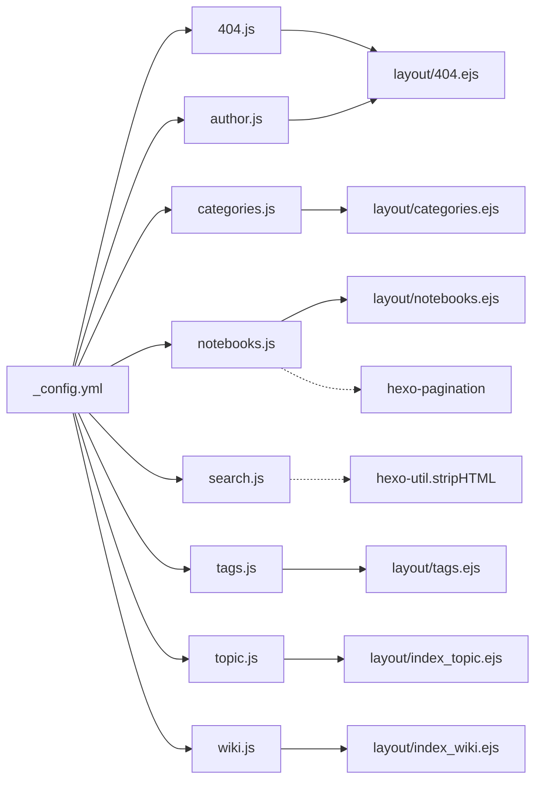

**图表来源**
- [themes/stellar/_config.yml](file://themes/stellar/_config.yml#L73-L152)
- [themes/stellar/scripts/generators/notebooks.js](file://themes/stellar/scripts/generators/notebooks.js#L11-L11)
- [themes/stellar/scripts/generators/search.js](file://themes/stellar/scripts/generators/search.js#L4-L4)

**章节来源**
- [themes/stellar/_config.yml](file://themes/stellar/_config.yml#L73-L152)
- [themes/stellar/scripts/generators/notebooks.js](file://themes/stellar/scripts/generators/notebooks.js#L11-L11)
- [themes/stellar/scripts/generators/search.js](file://themes/stellar/scripts/generators/search.js#L4-L4)

## 性能考虑
- 分页与大数据集
  - notebooks 使用 hexo-pagination，建议合理设置 per_page，避免单页过大导致内存与渲染压力。
  - 对空集合使用 paginationWithEmpty 占位，减少分支判断开销。
- 搜索索引生成
  - search 生成器按字段过滤与正则跳过，建议合理配置 skip_search，减少不必要的索引构建。
  - stripHTML 与内容清洗为 O(n) 操作，建议在内容体量较大时关注构建时间。
- 模板渲染
  - 模板中使用 partial 与 helper，注意避免重复计算与深层循环。
- 路由数量控制
  - author、wiki、notebooks 等生成器会按配置生成多个路由，建议在配置中精简不必要的条目。

[本节为通用性能建议，不直接分析具体文件]

## 故障排查指南
- 生成器未生效
  - 检查生成器是否正确注册（注册名与调用一致）
  - 检查主题配置中相关开关与路径是否正确
- 搜索索引为空
  - 确认 theme.config.search.service 是否为 'local_search'
  - 检查 field 配置与 skip_search 模式是否过于严格
  - 确认页面 front-matter 中 indexing 是否被设为 false
- 分类/标签页不生成
  - 确认 locals.categories/tags 是否存在数据
  - 检查 hexo.config.category_dir/tag_dir 是否正确
- 笔记本分页异常
  - 检查 notebooks.tree 与 notebook.per_page、order_by 配置
  - 确认 hexo-pagination 是否正常安装
- 404 页未生效
  - 检查 site_tree.error_page['404'] 路径与 robots 设置

**章节来源**
- [themes/stellar/scripts/generators/search.js](file://themes/stellar/scripts/generators/search.js#L6-L101)
- [themes/stellar/scripts/generators/categories.js](file://themes/stellar/scripts/generators/categories.js#L5-L16)
- [themes/stellar/scripts/generators/tags.js](file://themes/stellar/scripts/generators/tags.js#L5-L16)
- [themes/stellar/scripts/generators/notebooks.js](file://themes/stellar/scripts/generators/notebooks.js#L5-L73)
- [themes/stellar/scripts/generators/404.js](file://themes/stellar/scripts/generators/404.js#L5-L15)

## 结论
上述生成器围绕主题配置与 Hexo 本地数据，实现了博客、专栏、文档、笔记本、作者、分类、标签与搜索等页面的自动化生成。通过合理的配置与模板配合，可在保证 SEO 与可维护性的前提下，获得良好的构建性能与用户体验。建议在生产环境中：
- 明确各生成器的触发条件与输出路径
- 合理设置分页与搜索索引范围
- 保持配置与模板的一致性与最小化

[本节为总结性内容，不直接分析具体文件]

## 附录

### 生成器与模板映射表
- 404 → layout/404.ejs
- author → archive（模板文件未在本节列出）
- categories → layout/categories.ejs
- notebooks → layout/notebooks.ejs（列表页）、notes.ejs（笔记列表）
- search → JSON 输出（无模板）
- tags → layout/tags.ejs
- topic → layout/index_topic.ejs
- wiki → layout/index_wiki.ejs

**章节来源**
- [themes/stellar/layout/404.ejs](file://themes/stellar/layout/404.ejs#L1-L20)
- [themes/stellar/layout/categories.ejs](file://themes/stellar/layout/categories.ejs#L1-L24)
- [themes/stellar/layout/tags.ejs](file://themes/stellar/layout/tags.ejs#L1-L21)
- [themes/stellar/layout/index_wiki.ejs](file://themes/stellar/layout/index_wiki.ejs#L1-L44)
- [themes/stellar/layout/index_topic.ejs](file://themes/stellar/layout/index_topic.ejs#L1-L30)
- [themes/stellar/layout/notebooks.ejs](file://themes/stellar/layout/notebooks.ejs#L1-L9)