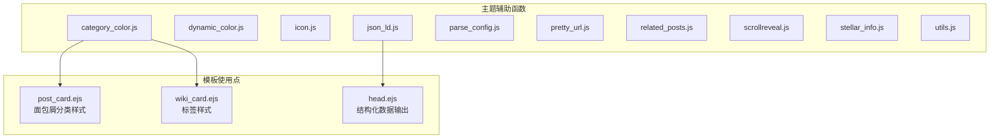
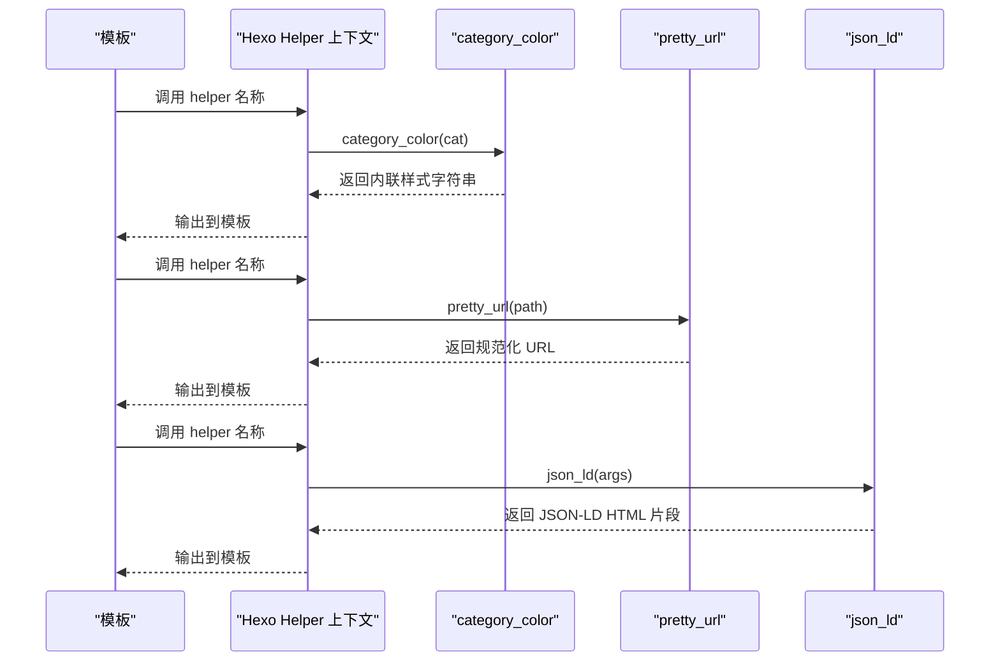
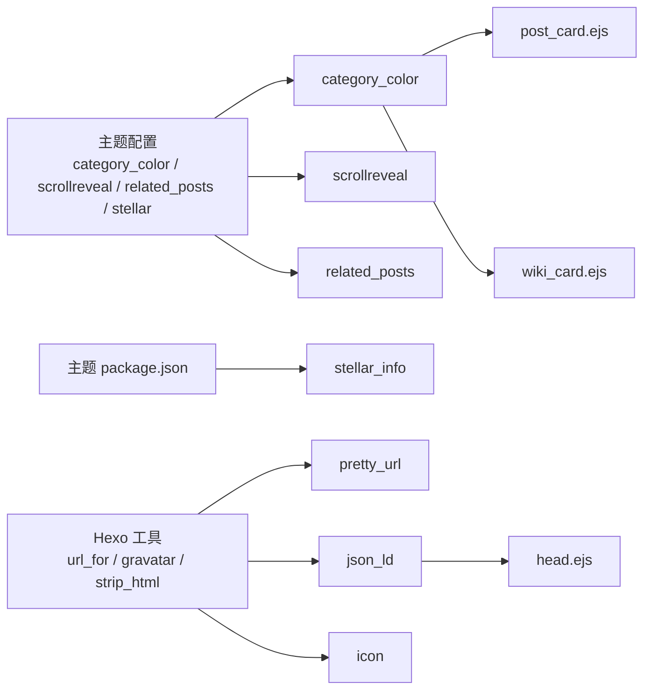

# 辅助函数API

<cite>
**本文引用的文件**
- [category_color.js](file://themes/stellar/scripts/helpers/category_color.js)
- [dynamic_color.js](file://themes/stellar/scripts/helpers/dynamic_color.js)
- [icon.js](file://themes/stellar/scripts/helpers/icon.js)
- [json_ld.js](file://themes/stellar/scripts/helpers/json_ld.js)
- [parse_config.js](file://themes/stellar/scripts/helpers/parse_config.js)
- [pretty_url.js](file://themes/stellar/scripts/helpers/pretty_url.js)
- [related_posts.js](file://themes/stellar/scripts/helpers/related_posts.js)
- [scrollreveal.js](file://themes/stellar/scripts/helpers/scrollreveal.js)
- [stellar_info.js](file://themes/stellar/scripts/helpers/stellar_info.js)
- [utils.js](file://themes/stellar/scripts/helpers/utils.js)
- [post_card.ejs](file://themes/stellar/layout/_partial/main/post_list/post_card.ejs)
- [wiki_card.ejs](file://themes/stellar/layout/_partial/main/post_list/wiki_card.ejs)
- [head.ejs](file://themes/stellar/layout/_partial/head.ejs)
</cite>

## 目录
1. [简介](#简介)
2. [项目结构](#项目结构)
3. [核心组件](#核心组件)
4. [架构概览](#架构概览)
5. [详细组件分析](#详细组件分析)
6. [依赖分析](#依赖分析)
7. [性能考虑](#性能考虑)
8. [故障排除指南](#故障排除指南)
9. [结论](#结论)

## 简介
本文件为 H1S97X 博客所使用的主题辅助函数API参考文档，覆盖以下辅助函数的完整接口定义与使用说明：
- category_color.js
- dynamic_color.js
- icon.js
- json_ld.js
- parse_config.js
- pretty_url.js
- related_posts.js
- scrollreveal.js
- stellar_info.js
- utils.js

文档内容包括：函数签名、参数类型、返回值、调用上下文、使用场景、具体模板调用示例、功能描述、性能考虑与最佳实践，以及与主题其他组件的集成关系。

## 项目结构
这些辅助函数位于主题目录 themes/stellar/scripts/helpers 下，作为 Hexo 主题的 helper 注册到渲染上下文中，供模板（如 EJS/Pug）调用。部分模板文件展示了这些辅助函数的实际使用位置。

**图表来源**
- [category_color.js](file://themes/stellar/scripts/helpers/category_color.js#L1-L23)
- [json_ld.js](file://themes/stellar/scripts/helpers/json_ld.js#L1-L122)
- [post_card.ejs](file://themes/stellar/layout/_partial/main/post_list/post_card.ejs#L87-L87)
- [wiki_card.ejs](file://themes/stellar/layout/_partial/main/post_list/wiki_card.ejs#L9-L9)
- [head.ejs](file://themes/stellar/layout/_partial/head.ejs#L152-L152)

**章节来源**
- [category_color.js](file://themes/stellar/scripts/helpers/category_color.js#L1-L23)
- [json_ld.js](file://themes/stellar/scripts/helpers/json_ld.js#L1-L122)
- [post_card.ejs](file://themes/stellar/layout/_partial/main/post_list/post_card.ejs#L87-L87)
- [wiki_card.ejs](file://themes/stellar/layout/_partial/main/post_list/wiki_card.ejs#L9-L9)
- [head.ejs](file://themes/stellar/layout/_partial/head.ejs#L152-L152)

## 核心组件
本节对每个辅助函数进行接口定义与行为说明，便于快速查阅与集成。

- category_color(cat)
  - 参数
    - cat: 字符串，表示分类名称
  - 返回值
    - 字符串，用于内联样式的 HTML 片段；若无匹配则返回空字符串
  - 上下文
    - 通过 this.theme.config.article.category_color 查找颜色映射
  - 使用场景
    - 在文章列表或详情页为分类标签添加主题色样式
  - 示例调用路径
    - [post_card.ejs](file://themes/stellar/layout/_partial/main/post_list/post_card.ejs#L87-L87)
    - [wiki_card.ejs](file://themes/stellar/layout/_partial/main/post_list/wiki_card.ejs#L9-L9)

- dynamic_color(color, index, mark)
  - 参数
    - color: 字符串，支持 hex、rgb、rgba、hsl、hsla
    - index: 数字或字符串，用于生成 CSS 变量后缀
    - mark: 字符串，CSS 类前缀标识
  - 返回值
    - 对象，包含 style_light、style_dark、style_hover 三个 CSS 片段键
  - 上下文
    - 将输入颜色转换为 HSL，生成亮/暗两套主题色与悬停样式
  - 使用场景
    - 为标签、徽章等元素生成动态主题色系
  - 示例调用路径
    - [dynamic_color.js](file://themes/stellar/scripts/helpers/dynamic_color.js#L109-L136)

- icon(key, args)
  - 参数
    - key: 字符串，图标键名
    - args: 可选对象，传递给底层工具函数的参数
  - 返回值
    - 字符串，通常为图标渲染后的 HTML 片段
  - 上下文
    - 委托给 hexo.utils.icon 实现
  - 使用场景
    - 在导航、侧边栏等位置插入图标
  - 示例调用路径
    - [icon.js](file://themes/stellar/scripts/helpers/icon.js#L1-L6)

- json_ld(args)
  - 参数
    - args: 可选参数，影响关键词输出格式（数组或字符串）
  - 返回值
    - 字符串，包裹在 script 标签中的 JSON-LD 结构化数据
  - 上下文
    - 根据页面类型（文章、页面、首页）生成不同 schema.org 类型
  - 使用场景
    - 提升 SEO，搜索引擎可识别页面内容结构
  - 示例调用路径
    - [head.ejs](file://themes/stellar/layout/_partial/head.ejs#L152-L152)

- md_text(args)
  - 参数
    - args: 字符串，Markdown 链接文本形式（形如 [文本](链接)）
  - 返回值
    - 字符串，提取出的文本内容
  - 上下文
    - 支持替换占位符 {config.title}、{config.subtitle}、{config.avatar}
  - 使用场景
    - 从菜单配置中提取显示文本
  - 示例调用路径
    - [parse_config.js](file://themes/stellar/scripts/helpers/parse_config.js#L8-L26)

- md_link(args)
  - 参数
    - args: 字符串，Markdown 链接文本形式（形如 [文本](链接)）
  - 返回值
    - 字符串，提取出的链接地址
  - 上下文
    - 支持替换占位符 {config.title}、{config.subtitle}、{config.avatar}
  - 使用场景
    - 从菜单配置中提取跳转链接
  - 示例调用路径
    - [parse_config.js](file://themes/stellar/scripts/helpers/parse_config.js#L28-L42)

- pretty_url(path)
  - 参数
    - path: 字符串，相对或绝对路径
  - 返回值
    - 字符串，规范化后的 URL（去除 index.html、.html，补全末尾斜杠等）
  - 上下文
    - 基于 this.url_for 生成并进一步处理
  - 使用场景
    - 生成友好的页面链接，提升 SEO 与可读性
  - 示例调用路径
    - [pretty_url.js](file://themes/stellar/scripts/helpers/pretty_url.js#L1-L27)

- popular_posts_wrapper(args)
  - 参数
    - args: 对象，包含 title、json（含 json 与 class）、以及其他内部参数
  - 返回值
    - 字符串，HTML 片段，包含标题与相关文章列表
  - 上下文
    - 读取主题配置 article.related_posts.enable 控制开关
  - 使用场景
    - 文章详情页展示“相关文章”模块
  - 示例调用路径
    - [related_posts.js](file://themes/stellar/scripts/helpers/related_posts.js#L9-L54)

- scrollreveal(args)
  - 参数
    - args: 可选字符串，附加类名
  - 返回值
    - 字符串，根据主题配置决定是否追加 slide-up 或空字符串
  - 上下文
    - 读取主题配置 plugins.scrollreveal.enable
  - 使用场景
    - 为页面元素启用滚动动画类名
  - 示例调用路径
    - [scrollreveal.js](file://themes/stellar/scripts/helpers/scrollreveal.js#L1-L9)

- stellar_info(args)
  - 参数
    - args: 字符串，可选，支持 name、version、issues、tree 等键
  - 返回值
    - 字符串，对应的信息或默认返回仓库地址
  - 上下文
    - 读取主题 package.json 的版本号与主题配置
  - 使用场景
    - 展示主题信息、版本、问题反馈链接等
  - 示例调用路径
    - [stellar_info.js](file://themes/stellar/scripts/helpers/stellar_info.js#L1-L21)

- get_page(id)
  - 参数
    - id: 字符串或数字，页面或文章的 _id
  - 返回值
    - 对象或 null，匹配到的页面或文章数据
  - 上下文
    - 从 hexo.locals 获取 pages 与 posts 并查找
  - 使用场景
    - 根据 ID 获取页面或文章实体，用于模板逻辑
  - 示例调用路径
    - [utils.js](file://themes/stellar/scripts/helpers/utils.js#L7-L20)

**章节来源**
- [category_color.js](file://themes/stellar/scripts/helpers/category_color.js#L1-L23)
- [dynamic_color.js](file://themes/stellar/scripts/helpers/dynamic_color.js#L109-L136)
- [icon.js](file://themes/stellar/scripts/helpers/icon.js#L1-L6)
- [json_ld.js](file://themes/stellar/scripts/helpers/json_ld.js#L1-L122)
- [parse_config.js](file://themes/stellar/scripts/helpers/parse_config.js#L1-L43)
- [pretty_url.js](file://themes/stellar/scripts/helpers/pretty_url.js#L1-L27)
- [related_posts.js](file://themes/stellar/scripts/helpers/related_posts.js#L1-L55)
- [scrollreveal.js](file://themes/stellar/scripts/helpers/scrollreveal.js#L1-L9)
- [stellar_info.js](file://themes/stellar/scripts/helpers/stellar_info.js#L1-L21)
- [utils.js](file://themes/stellar/scripts/helpers/utils.js#L1-L21)

## 架构概览
辅助函数通过 Hexo 的 helper 注册机制暴露到模板上下文，模板在渲染时按需调用。部分函数之间存在间接依赖：例如 pretty_url 依赖 Hexo 的 url_for；json_ld 依赖 gravatar 与 strip_html 等工具；category_color 依赖主题配置。

**图表来源**
- [category_color.js](file://themes/stellar/scripts/helpers/category_color.js#L3-L22)
- [pretty_url.js](file://themes/stellar/scripts/helpers/pretty_url.js#L3-L27)
- [json_ld.js](file://themes/stellar/scripts/helpers/json_ld.js#L10-L122)

## 详细组件分析

### category_color
- 功能描述
  - 根据分类名称查找主题配置中的颜色映射，生成内联 CSS 变量，用于设置文本与背景色透明度。
- 接口定义
  - 函数名: category_color
  - 参数: cat (字符串)
  - 返回: 字符串（内联 style 片段或空字符串）
- 调用上下文
  - 依赖 this.theme.config.article.category_color
- 使用场景
  - 在文章列表卡片或标签页中为分类/标签添加主题色
- 性能考虑
  - 仅做字符串拼接与长度判断，时间复杂度 O(1)，开销极小
- 最佳实践
  - 确保主题配置中为分类提供有效颜色值；避免在高频循环中重复调用
- 模板调用示例路径
  - [post_card.ejs](file://themes/stellar/layout/_partial/main/post_list/post_card.ejs#L87-L87)
  - [wiki_card.ejs](file://themes/stellar/layout/_partial/main/post_list/wiki_card.ejs#L9-L9)

**章节来源**
- [category_color.js](file://themes/stellar/scripts/helpers/category_color.js#L1-L23)
- [post_card.ejs](file://themes/stellar/layout/_partial/main/post_list/post_card.ejs#L87-L87)
- [wiki_card.ejs](file://themes/stellar/layout/_partial/main/post_list/wiki_card.ejs#L9-L9)

### dynamic_color
- 功能描述
  - 接收任意合法颜色格式，转换为 HSL，生成亮/暗两套主题色与悬停样式，返回 CSS 变量与类选择器片段。
- 接口定义
  - 函数名: dynamic_color
  - 参数: color (字符串), index (数字/字符串), mark (字符串)
  - 返回: 对象 { style_light, style_dark, style_hover }
- 调用上下文
  - 内部包含颜色格式校验、hex/rgb/hsl 转换与 HSL 计算
- 使用场景
  - 为标签、徽章、按钮等 UI 元素生成一致的主题色系
- 性能考虑
  - 包含正则与数值计算，但仅在需要时调用；建议缓存结果
- 最佳实践
  - 传入合法颜色格式；合理命名 mark 与 index，避免冲突
- 模板调用示例路径
  - [dynamic_color.js](file://themes/stellar/scripts/helpers/dynamic_color.js#L109-L136)

**章节来源**
- [dynamic_color.js](file://themes/stellar/scripts/helpers/dynamic_color.js#L1-L138)

### icon
- 功能描述
  - 将图标键名与参数委托给 hexo.utils.icon，返回图标 HTML 片段。
- 接口定义
  - 函数名: icon
  - 参数: key (字符串), args (可选对象)
  - 返回: 字符串（HTML 片段）
- 调用上下文
  - 依赖 hexo.utils.icon
- 使用场景
  - 导航菜单、侧边栏、按钮等位置插入图标
- 性能考虑
  - 仅一次委托调用，开销极小
- 最佳实践
  - 确保图标键名存在于主题图标配置中
- 模板调用示例路径
  - [icon.js](file://themes/stellar/scripts/helpers/icon.js#L1-L6)

**章节来源**
- [icon.js](file://themes/stellar/scripts/helpers/icon.js#L1-L6)

### json_ld
- 功能描述
  - 根据当前页面类型（文章、页面、首页）构建 schema.org 结构化数据，输出 JSON-LD 片段。
- 接口定义
  - 函数名: json_ld
  - 参数: args (可选，影响关键词输出格式)
  - 返回: 字符串（script 标签包裹的 JSON-LD）
- 调用上下文
  - 依赖 this.page、this.config、this.theme.structured_data、this.is_post、this.pretty_url、this.gravatar、this.strip_html 等
- 使用场景
  - 提升 SEO，帮助搜索引擎理解页面内容
- 性能考虑
  - 构造对象与 JSON 序列化，开销较小；建议避免在高频循环中重复调用
- 最佳实践
  - 确保作者头像与邮箱配置正确；合理设置 keywords
- 模板调用示例路径
  - [head.ejs](file://themes/stellar/layout/_partial/head.ejs#L152-L152)

**章节来源**
- [json_ld.js](file://themes/stellar/scripts/helpers/json_ld.js#L1-L122)
- [head.ejs](file://themes/stellar/layout/_partial/head.ejs#L152-L152)

### parse_config
- 功能描述
  - 从 Markdown 形式的菜单配置中提取文本与链接；支持替换占位符。
- 接口定义
  - 函数名: md_text / md_link
  - 参数: args (字符串)
  - 返回: 字符串（文本或链接）
- 调用上下文
  - 依赖 hexo.config 中的 title/subtitle/avatar
- 使用场景
  - 从主题菜单配置中动态生成导航文本与链接
- 性能考虑
  - 字符串分割与替换，时间复杂度 O(n)
- 最佳实践
  - 保持配置格式规范；避免在循环中频繁调用
- 模板调用示例路径
  - [parse_config.js](file://themes/stellar/scripts/helpers/parse_config.js#L8-L42)

**章节来源**
- [parse_config.js](file://themes/stellar/scripts/helpers/parse_config.js#L1-L43)

### pretty_url
- 功能描述
  - 将相对路径规范化为“友好 URL”，去除 index.html、.html，补全末尾斜杠，合并多余斜杠。
- 接口定义
  - 函数名: pretty_url
  - 参数: path (字符串，默认空字符串)
  - 返回: 字符串（规范化 URL）
- 调用上下文
  - 依赖 this.url_for
- 使用场景
  - 生成文章、页面、资源的 SEO 友好链接
- 性能考虑
  - 正则替换与字符串处理，开销很小
- 最佳实践
  - 优先使用该函数生成链接，确保一致性
- 模板调用示例路径
  - [pretty_url.js](file://themes/stellar/scripts/helpers/pretty_url.js#L1-L27)

**章节来源**
- [pretty_url.js](file://themes/stellar/scripts/helpers/pretty_url.js#L1-L27)

### related_posts
- 功能描述
  - 根据外部热门文章数据源生成“相关文章”列表容器与条目，受主题配置控制开关。
- 接口定义
  - 函数名: popular_posts_wrapper
  - 参数: args (对象，包含 title、json、class 等)
  - 返回: 字符串（HTML 片段）
- 调用上下文
  - 读取主题配置 article.related_posts.enable；访问 this.site.posts、this.config.root
- 使用场景
  - 文章详情页展示相关文章模块
- 性能考虑
  - 需要遍历站点文章集合，注意在大数据集下的性能
- 最佳实践
  - 合理限制展示数量；避免在列表页重复加载
- 模板调用示例路径
  - [related_posts.js](file://themes/stellar/scripts/helpers/related_posts.js#L9-L54)

**章节来源**
- [related_posts.js](file://themes/stellar/scripts/helpers/related_posts.js#L1-L55)

### scrollreveal
- 功能描述
  - 根据主题配置决定是否为元素添加滚动动画类名（如 slide-up）。
- 接口定义
  - 函数名: scrollreveal
  - 参数: args (可选字符串)
  - 返回: 字符串（类名或空字符串）
- 调用上下文
  - 读取主题配置 plugins.scrollreveal.enable
- 使用场景
  - 为页面元素启用进入视口时的动画效果
- 性能考虑
  - 仅字符串拼接，开销极小
- 最佳实践
  - 与主题动画脚本配合使用，避免过度动画影响体验
- 模板调用示例路径
  - [scrollreveal.js](file://themes/stellar/scripts/helpers/scrollreveal.js#L1-L9)

**章节来源**
- [scrollreveal.js](file://themes/stellar/scripts/helpers/scrollreveal.js#L1-L9)

### stellar_info
- 功能描述
  - 提供主题相关信息（仓库、版本、问题反馈链接等），支持按键返回特定信息。
- 接口定义
  - 函数名: stellar_info
  - 参数: args (可选字符串，支持 name、version、issues、tree)
  - 返回: 字符串
- 调用上下文
  - 读取主题 package.json 与主题配置
- 使用场景
  - 在页脚或关于页展示主题信息
- 性能考虑
  - 仅字符串拼接与读取配置，开销极小
- 最佳实践
  - 保持版本号同步更新
- 模板调用示例路径
  - [stellar_info.js](file://themes/stellar/scripts/helpers/stellar_info.js#L1-L21)

**章节来源**
- [stellar_info.js](file://themes/stellar/scripts/helpers/stellar_info.js#L1-L21)

### utils
- 功能描述
  - 根据 _id 在站点数据中查找页面或文章实体。
- 接口定义
  - 函数名: get_page
  - 参数: id (字符串/数字)
  - 返回: 对象或 null
- 调用上下文
  - 依赖 hexo.locals 的 pages 与 posts
- 使用场景
  - 模板逻辑中根据 ID 获取页面/文章数据
- 性能考虑
  - 使用数组查找，时间复杂度 O(n)；建议缓存常用 ID
- 最佳实践
  - 避免在高频渲染中重复查找；必要时预取数据
- 模板调用示例路径
  - [utils.js](file://themes/stellar/scripts/helpers/utils.js#L7-L20)

**章节来源**
- [utils.js](file://themes/stellar/scripts/helpers/utils.js#L1-L21)

## 依赖分析
- 主题配置依赖
  - category_color 依赖 theme.config.article.category_color
  - dynamic_color 不直接依赖配置，但常与主题样式变量配合
  - scrollreveal 依赖 theme.config.plugins.scrollreveal.enable
  - related_posts 依赖 theme.config.article.related_posts.enable
  - stellar_info 依赖 theme.config.stellar 与主题 package.json
- Hexo 工具依赖
  - json_ld 依赖 this.gravatar、this.strip_html、this.pretty_url
  - pretty_url 依赖 this.url_for
  - icon 依赖 hexo.utils.icon
- 模板集成点
  - post_card.ejs 与 wiki_card.ejs 使用 category_color
  - head.ejs 使用 json_ld

**图表来源**
- [category_color.js](file://themes/stellar/scripts/helpers/category_color.js#L4-L5)
- [scrollreveal.js](file://themes/stellar/scripts/helpers/scrollreveal.js#L4-L4)
- [related_posts.js](file://themes/stellar/scripts/helpers/related_posts.js#L16-L17)
- [stellar_info.js](file://themes/stellar/scripts/helpers/stellar_info.js#L7-L8)
- [pretty_url.js](file://themes/stellar/scripts/helpers/pretty_url.js#L9-L9)
- [json_ld.js](file://themes/stellar/scripts/helpers/json_ld.js#L14-L14)
- [icon.js](file://themes/stellar/scripts/helpers/icon.js#L4-L4)
- [post_card.ejs](file://themes/stellar/layout/_partial/main/post_list/post_card.ejs#L87-L87)
- [wiki_card.ejs](file://themes/stellar/layout/_partial/main/post_list/wiki_card.ejs#L9-L9)
- [head.ejs](file://themes/stellar/layout/_partial/head.ejs#L152-L152)

**章节来源**
- [category_color.js](file://themes/stellar/scripts/helpers/category_color.js#L1-L23)
- [scrollreveal.js](file://themes/stellar/scripts/helpers/scrollreveal.js#L1-L9)
- [related_posts.js](file://themes/stellar/scripts/helpers/related_posts.js#L1-L55)
- [stellar_info.js](file://themes/stellar/scripts/helpers/stellar_info.js#L1-L21)
- [pretty_url.js](file://themes/stellar/scripts/helpers/pretty_url.js#L1-L27)
- [json_ld.js](file://themes/stellar/scripts/helpers/json_ld.js#L1-L122)
- [icon.js](file://themes/stellar/scripts/helpers/icon.js#L1-L6)
- [post_card.ejs](file://themes/stellar/layout/_partial/main/post_list/post_card.ejs#L87-L87)
- [wiki_card.ejs](file://themes/stellar/layout/_partial/main/post_list/wiki_card.ejs#L9-L9)
- [head.ejs](file://themes/stellar/layout/_partial/head.ejs#L152-L152)

## 性能考虑
- 避免在高频渲染（如列表页）中重复调用 heavy helper（如 related_posts）。
- 对于需要遍历站点数据的函数（如 get_page、related_posts），建议在渲染前预取并缓存结果。
- 使用 pretty_url 统一生成链接，减少模板中重复处理。
- 动态颜色生成（dynamic_color）仅在需要时调用，避免在循环中重复计算。
- 结构化数据（json_ld）在 head 中一次性输出，避免多次调用。

## 故障排除指南
- category_color 无效
  - 检查主题配置中是否存在对应分类的颜色映射；确认传入的分类名与配置一致。
- json_ld 输出为空或报错
  - 确认作者头像路径与邮箱配置；检查页面布局类型是否被正确识别。
- pretty_url 生成异常链接
  - 确认传入路径是否为相对路径；检查站点 root 配置。
- related_posts 未显示
  - 检查主题配置 article.related_posts.enable 是否开启；确认外部数据源正常。
- scrollreveal 无动画
  - 检查主题配置 plugins.scrollreveal.enable 是否开启。
- dynamic_color 返回空
  - 确认传入颜色格式合法（hex/rgb/rgba/hsl/hsla）。
- icon 未显示
  - 确认图标键名存在于主题图标配置中。

**章节来源**
- [category_color.js](file://themes/stellar/scripts/helpers/category_color.js#L1-L23)
- [json_ld.js](file://themes/stellar/scripts/helpers/json_ld.js#L1-L122)
- [pretty_url.js](file://themes/stellar/scripts/helpers/pretty_url.js#L1-L27)
- [related_posts.js](file://themes/stellar/scripts/helpers/related_posts.js#L1-L55)
- [scrollreveal.js](file://themes/stellar/scripts/helpers/scrollreveal.js#L1-L9)
- [dynamic_color.js](file://themes/stellar/scripts/helpers/dynamic_color.js#L1-L138)
- [icon.js](file://themes/stellar/scripts/helpers/icon.js#L1-L6)

## 结论
上述辅助函数为 H1S97X 博客主题提供了强大的模板能力：从颜色主题、SEO 结构化数据、URL 规范化，到导航图标、滚动动画与页面实体查询。遵循本文的接口定义、调用上下文与最佳实践，可在保证性能的前提下高效集成到模板中，提升用户体验与 SEO 表现。