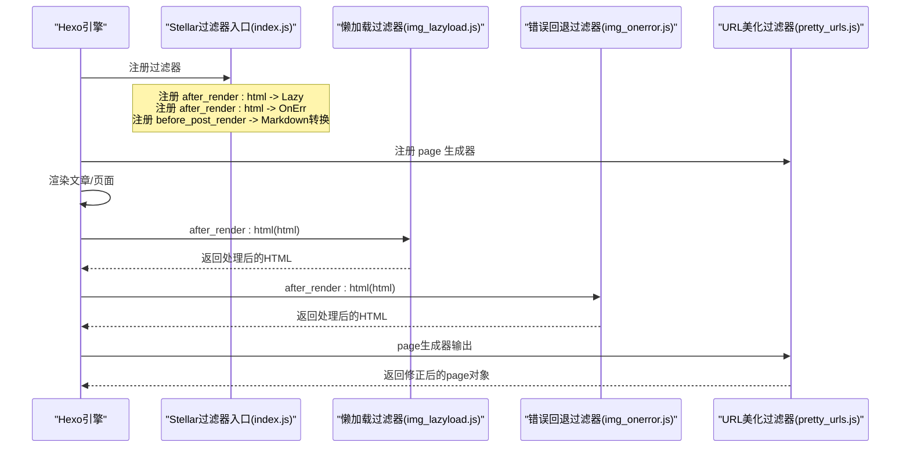
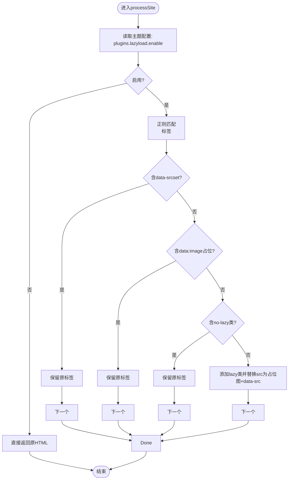
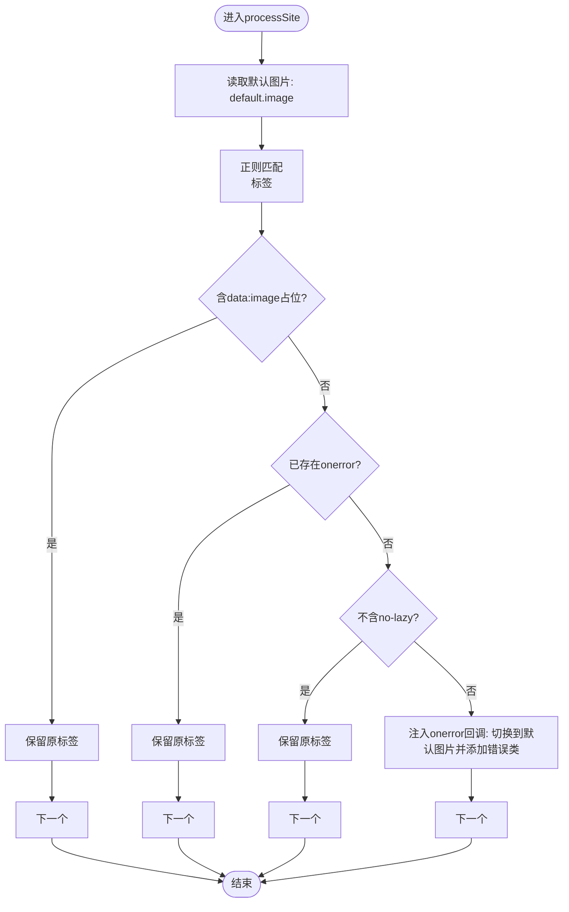
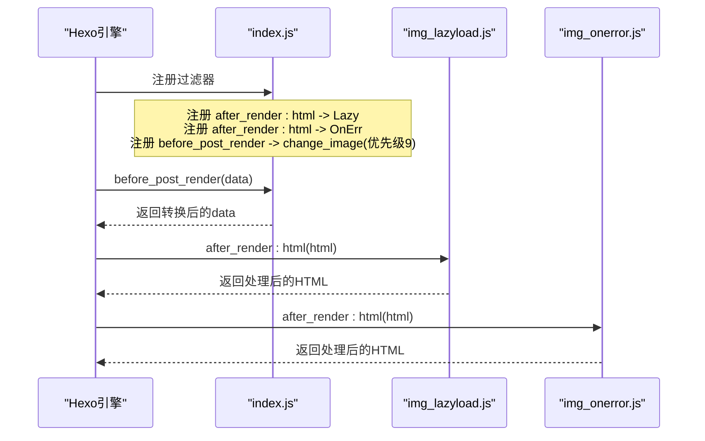
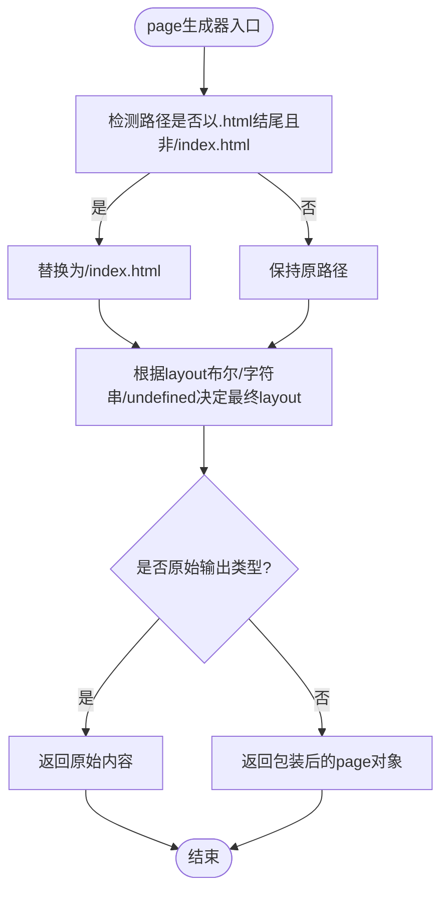
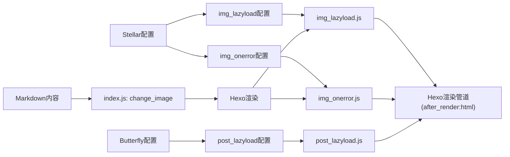

# 过滤器函数API

<cite>
**本文引用的文件**
- [themes/stellar/scripts/filters/index.js](file://themes/stellar/scripts/filters/index.js)
- [themes/stellar/scripts/filters/pretty_urls.js](file://themes/stellar/scripts/filters/pretty_urls.js)
- [themes/stellar/scripts/filters/lib/img_lazyload.js](file://themes/stellar/scripts/filters/lib/img_lazyload.js)
- [themes/stellar/scripts/filters/lib/img_onerror.js](file://themes/stellar/scripts/filters/lib/img_onerror.js)
- [themes/butterfly/scripts/filters/post_lazyload.js](file://themes/butterfly/scripts/filters/post_lazyload.js)
- [themes/butterfly/scripts/filters/random_cover.js](file://themes/butterfly/scripts/filters/random_cover.js)
- [themes/stellar/_config.yml](file://themes/stellar/_config.yml)
- [themes/butterfly/_config.yml](file://themes/butterfly/_config.yml)
</cite>

## 目录
1. [简介](#简介)
2. [项目结构](#项目结构)
3. [核心组件](#核心组件)
4. [架构总览](#架构总览)
5. [详细组件分析](#详细组件分析)
6. [依赖关系分析](#依赖关系分析)
7. [性能考量](#性能考量)
8. [故障排查指南](#故障排查指南)
9. [结论](#结论)
10. [附录](#附录)

## 简介
本文件为 H1S97X 博客所用主题中的过滤器函数API参考文档，聚焦于以下过滤器：
- img_lazyload.js：站点HTML渲染后的图片懒加载处理
- img_onerror.js：站点HTML渲染后的图片错误回退处理
- index.js：主题过滤器入口，注册上述两个过滤器，并对Markdown中的图片语法进行转换
- pretty_urls.js：页面生成器的URL美化逻辑（将.html结尾但非/index.html的路径重写为/index.html）

同时补充说明：
- post_lazyload.js（Butterfly主题）：站点/文章级别的图片懒加载处理
- random_cover.js（Butterfly主题）：文章封面随机化与默认封面注入

本文将从接口定义、输入输出、处理逻辑、应用场景、配置项、注册方式、优先级、链式调用、性能与缓存、错误处理、与Hexo渲染管道的集成等方面进行系统阐述。

## 项目结构
与过滤器相关的文件主要位于主题目录下的 scripts/filters 及其子目录 lib 中；URL美化逻辑位于 scripts/filters/pretty_urls.js；主题配置文件在 themes/*/ _config.yml 中。

```mermaid
graph TB
subgraph "主题: Stellar"
SIndex["scripts/filters/index.js"]
SLazy["scripts/filters/lib/img_lazyload.js"]
SOnErr["scripts/filters/lib/img_onerror.js"]
SPretty["scripts/filters/pretty_urls.js"]
end
subgraph "主题: Butterfly"
BPostLazy["scripts/filters/post_lazyload.js"]
BRandomCover["scripts/filters/random_cover.js"]
end
ConfigS["themes/stellar/_config.yml"]
ConfigB["themes/butterfly/_config.yml"]
SIndex --> SLazy
SIndex --> SOnErr
SIndex -. 注册 .->|"after_render:html"| SLazy
SIndex -. 注册 .->|"after_render:html"| SOnErr
SIndex -. 注册 .->|"before_post_render"| SIndex
SPretty -. 注册 .->|"page generator"| SPretty
BPostLazy -. 注册 .->|"after_render:html / after_post_render"| BPostLazy
BRandomCover -. 注册 .->|"before_post_render"| BRandomCover
SLazy -. 读取 .-> ConfigS
SOnErr -. 读取 .-> ConfigS
SPretty -. 读取 .-> ConfigS
BPostLazy -. 读取 .-> ConfigB
BRandomCover -. 读取 .-> ConfigB
```

**图表来源**
- [themes/stellar/scripts/filters/index.js](file://themes/stellar/scripts/filters/index.js#L1-L31)
- [themes/stellar/scripts/filters/lib/img_lazyload.js](file://themes/stellar/scripts/filters/lib/img_lazyload.js#L1-L53)
- [themes/stellar/scripts/filters/lib/img_onerror.js](file://themes/stellar/scripts/filters/lib/img_onerror.js#L1-L25)
- [themes/stellar/scripts/filters/pretty_urls.js](file://themes/stellar/scripts/filters/pretty_urls.js#L1-L26)
- [themes/butterfly/scripts/filters/post_lazyload.js](file://themes/butterfly/scripts/filters/post_lazyload.js#L1-L30)
- [themes/butterfly/scripts/filters/random_cover.js](file://themes/butterfly/scripts/filters/random_cover.js#L1-L46)
- [themes/stellar/_config.yml](file://themes/stellar/_config.yml#L1-L725)
- [themes/butterfly/_config.yml](file://themes/butterfly/_config.yml#L1-L987)

**章节来源**
- [themes/stellar/scripts/filters/index.js](file://themes/stellar/scripts/filters/index.js#L1-L31)
- [themes/stellar/scripts/filters/pretty_urls.js](file://themes/stellar/scripts/filters/pretty_urls.js#L1-L26)
- [themes/butterfly/scripts/filters/post_lazyload.js](file://themes/butterfly/scripts/filters/post_lazyload.js#L1-L30)
- [themes/butterfly/scripts/filters/random_cover.js](file://themes/butterfly/scripts/filters/random_cover.js#L1-L46)

## 核心组件
本节概述各过滤器的职责与关键行为。

- img_lazyload.js
  - 作用：在HTML渲染完成后，对标签进行懒加载改造，添加必要的类与占位图，以便前端懒加载库执行
  - 关键点：检测配置开关、排除已含data-srcset、data:image占位、带“no-lazy”类的元素；为img添加“lazy”类并替换src为占位图+data-src
- img_onerror.js
  - 作用：为标签注入onerror回调，当图片加载失败时切换到默认占位图并添加错误类
  - 关键点：排除data:image占位、已存在onerror、非no-lazy场景；注入错误处理脚本
- index.js（Stellar）
  - 作用：注册img懒加载与错误处理过滤器；在文章渲染前将Markdown中的语法转换为主题的标签插件语法
  - 关键点：before_post_render钩子，优先级9；对代码块与gallery标记内的图片不做转换
- pretty_urls.js（Stellar）
  - 作用：页面生成器阶段将.html结尾但非/index.html的路径重写为/index.html，同时处理layout与原始输出类型
  - 关键点：基于page.path判断与page.layout的布尔/字符串/undefined处理；对txt/json/xml等原始输出不做包装

**章节来源**
- [themes/stellar/scripts/filters/lib/img_lazyload.js](file://themes/stellar/scripts/filters/lib/img_lazyload.js#L1-L53)
- [themes/stellar/scripts/filters/lib/img_onerror.js](file://themes/stellar/scripts/filters/lib/img_onerror.js#L1-L25)
- [themes/stellar/scripts/filters/index.js](file://themes/stellar/scripts/filters/index.js#L1-L31)
- [themes/stellar/scripts/filters/pretty_urls.js](file://themes/stellar/scripts/filters/pretty_urls.js#L1-L26)

## 架构总览
过滤器在Hexo渲染管道中的注册与调用顺序如下：



**图表来源**
- [themes/stellar/scripts/filters/index.js](file://themes/stellar/scripts/filters/index.js#L1-L31)
- [themes/stellar/scripts/filters/lib/img_lazyload.js](file://themes/stellar/scripts/filters/lib/img_lazyload.js#L1-L53)
- [themes/stellar/scripts/filters/lib/img_onerror.js](file://themes/stellar/scripts/filters/lib/img_onerror.js#L1-L25)
- [themes/stellar/scripts/filters/pretty_urls.js](file://themes/stellar/scripts/filters/pretty_urls.js#L1-L26)

## 详细组件分析

### img_lazyload.js 过滤器
- 接口定义
  - 函数签名：processSite(htmlContent)
  - 输入：HTML字符串
  - 输出：HTML字符串（对进行懒加载改造）
- 处理逻辑
  - 读取主题配置中的plugins.lazyload.enable，若未启用则直接返回
  - 正则匹配标签，跳过已含data-srcset、data:image占位、带“no-lazy”的元素
  - 为img添加“lazy”类；将src替换为占位图并新增data-src指向原地址
- 应用场景
  - 提升页面首屏加载性能，减少首屏图片阻塞
- 配置项（Stellar）
  - plugins.lazyload.enable：是否启用懒加载
  - plugins.lazyload.placeholder：占位图URL（可为空，使用内置Base64占位）
- 性能与缓存
  - 仅做字符串替换，复杂度O(n)，n为HTML长度；无额外缓存
- 错误处理
  - 无显式try/catch；遇到异常将抛出至Hexo
- 与Hexo集成
  - 注册为“after_render:html”过滤器，作用于整体HTML输出



**图表来源**
- [themes/stellar/scripts/filters/lib/img_lazyload.js](file://themes/stellar/scripts/filters/lib/img_lazyload.js#L10-L48)

**章节来源**
- [themes/stellar/scripts/filters/lib/img_lazyload.js](file://themes/stellar/scripts/filters/lib/img_lazyload.js#L1-L53)
- [themes/stellar/_config.yml](file://themes/stellar/_config.yml#L458-L462)

### img_onerror.js 过滤器
- 接口定义
  - 函数签名：processSite(htmlContent)
  - 输入：HTML字符串
  - 输出：HTML字符串（为注入onerror回退）
- 处理逻辑
  - 读取默认图片配置default.image
  - 正则匹配标签，跳过data:image占位与已存在onerror的元素
  - 仅对带“no-lazy”的元素追加onerror回调，切换到默认图片并添加错误类
- 应用场景
  - 提升健壮性：图片加载失败时提供回退占位图
- 配置项（Stellar）
  - default.image：默认图片URL（Base64或外链）
- 性能与缓存
  - 仅做字符串替换，复杂度O(n)；无额外缓存
- 错误处理
  - 无显式try/catch；遇到异常将抛出至Hexo
- 与Hexo集成
  - 注册为“after_render:html”过滤器，作用于整体HTML输出



**图表来源**
- [themes/stellar/scripts/filters/lib/img_onerror.js](file://themes/stellar/scripts/filters/lib/img_onerror.js#L10-L24)

**章节来源**
- [themes/stellar/scripts/filters/lib/img_onerror.js](file://themes/stellar/scripts/filters/lib/img_onerror.js#L1-L25)
- [themes/stellar/_config.yml](file://themes/stellar/_config.yml#L700-L711)

### index.js（Stellar）过滤器入口
- 注册方式
  - 注册“after_render:html”过滤器：img_lazyload.js.processSite
  - 注册“after_render:html”过滤器：img_onerror.js.processSite
  - 注册“before_post_render”过滤器：change_image（优先级9）
- change_image处理逻辑
  - 当主题配置tag_plugins.image.parse_markdown为true时，将Markdown中的转换为主题插件
  - 为避免破坏代码块与gallery标记内的图片，先按代码/gallery标记分割内容，再对非保护片段进行替换
  - 替换后重新拼接内容
- 链式调用
  - before_post_render在文章内容进入渲染前被调用，随后进入渲染流程；after_render:html在渲染完成后被调用，形成两条链路
- 优先级
  - change_image优先级9，确保在默认渲染之前进行图片语法转换



**图表来源**
- [themes/stellar/scripts/filters/index.js](file://themes/stellar/scripts/filters/index.js#L1-L31)
- [themes/stellar/scripts/filters/lib/img_lazyload.js](file://themes/stellar/scripts/filters/lib/img_lazyload.js#L50-L52)
- [themes/stellar/scripts/filters/lib/img_onerror.js](file://themes/stellar/scripts/filters/lib/img_onerror.js#L10-L11)

**章节来源**
- [themes/stellar/scripts/filters/index.js](file://themes/stellar/scripts/filters/index.js#L1-L31)

### pretty_urls.js（Stellar）页面生成器
- 注册方式
  - 注册“page”生成器，对每个页面进行路径与布局处理
- 处理逻辑
  - 若page.path以.html结尾且不是/index.html，则将其替换为/index.html
  - 根据page.layout的布尔/字符串/undefined值决定最终layout
  - 若路径匹配原始输出类型（如.txt、.json、.xml、.js、.css），则直接输出原始内容而非包装为page对象
- 应用场景
  - 统一美化URL，减少.html后缀，提升SEO友好度



**图表来源**
- [themes/stellar/scripts/filters/pretty_urls.js](file://themes/stellar/scripts/filters/pretty_urls.js#L3-L25)

**章节来源**
- [themes/stellar/scripts/filters/pretty_urls.js](file://themes/stellar/scripts/filters/pretty_urls.js#L1-L26)

### Butterfly 主题过滤器（补充）
- post_lazyload.js
  - 注册“after_render:html”与“after_post_render”，根据配置决定作用范围（site或post）
  - 将的src替换为占位图+data-lazy-src，便于前端懒加载库处理
- random_cover.js
  - 注册“before_post_render”，为未设置封面的文章注入默认封面
  - 支持post_asset_folder场景下相对路径补全
  - 根据主题配置的default_cover数组随机选择一张默认封面

**章节来源**
- [themes/butterfly/scripts/filters/post_lazyload.js](file://themes/butterfly/scripts/filters/post_lazyload.js#L1-L30)
- [themes/butterfly/scripts/filters/random_cover.js](file://themes/butterfly/scripts/filters/random_cover.js#L1-L46)

## 依赖关系分析
- 过滤器之间的耦合
  - img_onerror与img_lazyload在HTML层面可能产生交互：前者为带“no-lazy”的元素注入onerror，后者为所有添加懒加载属性。两者共同提升图片加载的健壮性与性能
- 外部依赖
  - img_lazyload依赖主题配置plugins.lazyload.enable与placeholder
  - img_onerror依赖default.image
  - post_lazyload依赖主题配置lazyload.enable与field
- 与Hexo渲染管道
  - before_post_render：在渲染前转换Markdown图片语法
  - after_render:html：在渲染后对HTML进行二次加工
  - page生成器：在页面生成阶段统一URL美化



**图表来源**
- [themes/stellar/scripts/filters/index.js](file://themes/stellar/scripts/filters/index.js#L6-L29)
- [themes/stellar/scripts/filters/lib/img_lazyload.js](file://themes/stellar/scripts/filters/lib/img_lazyload.js#L10-L14)
- [themes/stellar/scripts/filters/lib/img_onerror.js](file://themes/stellar/scripts/filters/lib/img_onerror.js#L10-L11)
- [themes/butterfly/scripts/filters/post_lazyload.js](file://themes/butterfly/scripts/filters/post_lazyload.js#L16-L29)
- [themes/stellar/_config.yml](file://themes/stellar/_config.yml#L458-L462)
- [themes/stellar/_config.yml](file://themes/stellar/_config.yml#L700-L711)
- [themes/butterfly/_config.yml](file://themes/butterfly/_config.yml#L1-L987)

**章节来源**
- [themes/stellar/scripts/filters/index.js](file://themes/stellar/scripts/filters/index.js#L1-L31)
- [themes/stellar/scripts/filters/lib/img_lazyload.js](file://themes/stellar/scripts/filters/lib/img_lazyload.js#L1-L53)
- [themes/stellar/scripts/filters/lib/img_onerror.js](file://themes/stellar/scripts/filters/lib/img_onerror.js#L1-L25)
- [themes/butterfly/scripts/filters/post_lazyload.js](file://themes/butterfly/scripts/filters/post_lazyload.js#L1-L30)

## 性能考量
- 时间复杂度
  - img_lazyload与img_onerror均为单次正则遍历，复杂度O(n)
  - pretty_urls为一次路径与布局判断，复杂度O(1)每页面
- 空间复杂度
  - 过滤器均在内存中进行字符串替换，空间开销与HTML长度线性相关
- 缓存策略
  - 代码未实现缓存；建议在高频页面中结合浏览器端懒加载库与CDN缓存
- 优化建议
  - 控制图片数量与尺寸，合理使用占位图
  - 避免在代码块与gallery标记内出现过多图片，减少不必要的替换
  - 在生产环境启用CDN与Gzip压缩

## 故障排查指南
- 图片未懒加载
  - 检查plugins.lazyload.enable是否为true
  - 确认img标签未包含“no-lazy”类或data-srcset
  - 确认未使用data:image占位图
- 图片加载失败无回退
  - 检查default.image配置是否正确
  - 确认img标签未包含“no-lazy”类
  - 确认未手动添加onerror属性
- Markdown图片未转换为
  - 检查tag_plugins.image.parse_markdown是否为true
  - 确认未处于代码块或gallery标记内
- URL美化未生效
  - 检查page.path是否以.html结尾且非/index.html
  - 确认page.layout的布尔/字符串/undefined值符合预期

**章节来源**
- [themes/stellar/scripts/filters/lib/img_lazyload.js](file://themes/stellar/scripts/filters/lib/img_lazyload.js#L10-L48)
- [themes/stellar/scripts/filters/lib/img_onerror.js](file://themes/stellar/scripts/filters/lib/img_onerror.js#L10-L23)
- [themes/stellar/scripts/filters/index.js](file://themes/stellar/scripts/filters/index.js#L6-L29)
- [themes/stellar/scripts/filters/pretty_urls.js](file://themes/stellar/scripts/filters/pretty_urls.js#L3-L25)

## 结论
本文系统梳理了H1S97X博客主题中的过滤器函数API，明确了各过滤器的职责、接口、处理逻辑、配置项与与Hexo渲染管道的集成方式。通过合理配置与链式调用，可在保证性能的同时提升图片加载的健壮性与URL的可读性。建议在生产环境中结合CDN与前端懒加载库进一步优化用户体验。

## 附录
- 配置项参考（Stellar）
  - plugins.lazyload.enable/placeholder：控制懒加载开关与占位图
  - default.image：默认图片回退地址
  - tag_plugins.image.parse_markdown：是否将Markdown图片语法转换为主题插件
- 配置项参考（Butterfly）
  - lazyload.enable/field：控制懒加载作用范围（site/post）
  - default_cover：默认封面数组，用于随机封面注入

**章节来源**
- [themes/stellar/_config.yml](file://themes/stellar/_config.yml#L458-L462)
- [themes/stellar/_config.yml](file://themes/stellar/_config.yml#L700-L711)
- [themes/butterfly/_config.yml](file://themes/butterfly/_config.yml#L1-L987)