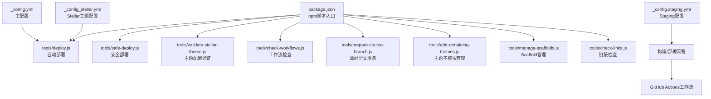
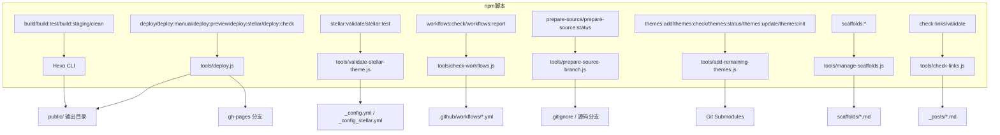
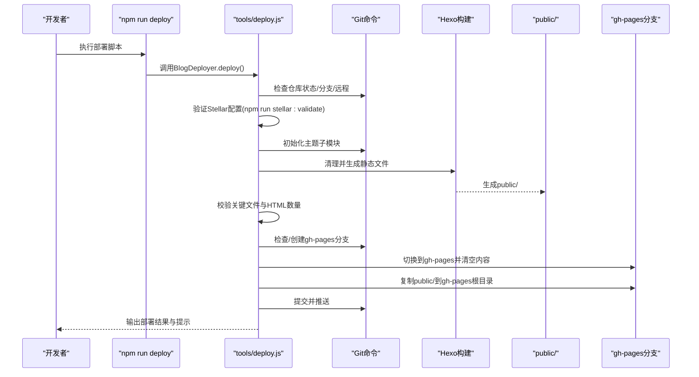
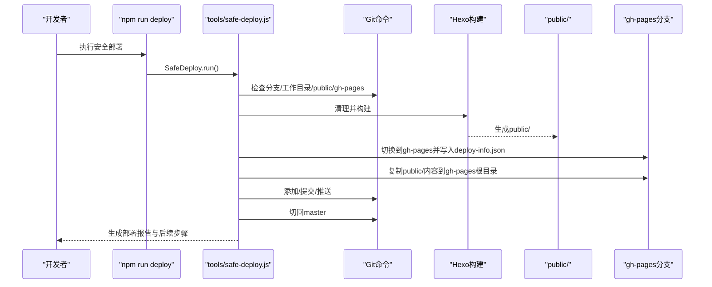
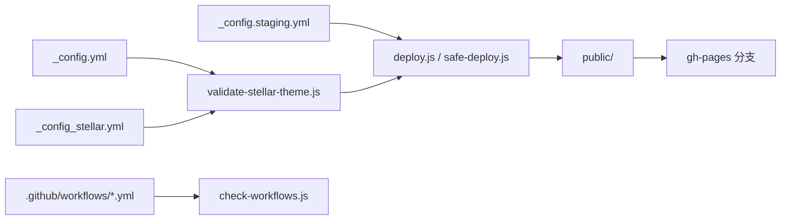

# 命令行接口

<cite>
**本文引用的文件**
- [package.json](file://package.json)
- [tools/deploy.js](file://tools/deploy.js)
- [tools/safe-deploy.js](file://tools/safe-deploy.js)
- [tools/validate-stellar-theme.js](file://tools/validate-stellar-theme.js)
- [tools/check-workflows.js](file://tools/check-workflows.js)
- [_config.yml](file://_config.yml)
- [_config_stellar.yml](file://_config_stellar.yml)
- [_config.staging.yml](file://_config.staging.yml)
- [tools/prepare-source-branch.js](file://tools/prepare-source-branch.js)
- [tools/add-remaining-themes.js](file://tools/add-remaining-themes.js)
- [tools/manage-scaffolds.js](file://tools/manage-scaffolds.js)
- [tools/check-links.js](file://tools/check-links.js)
- [docs/STELLAR_DEPLOYMENT_GUIDE.md](file://docs/STELLAR_DEPLOYMENT_GUIDE.md)
- [docs/WORKFLOW.md](file://docs/WORKFLOW.md)
</cite>

## 目录
1. [简介](#简介)
2. [项目结构](#项目结构)
3. [核心组件](#核心组件)
4. [架构总览](#架构总览)
5. [详细组件分析](#详细组件分析)
6. [依赖关系分析](#依赖关系分析)
7. [性能考虑](#性能考虑)
8. [故障排除指南](#故障排除指南)
9. [结论](#结论)
10. [附录](#附录)

## 简介
本文件为 H1S97X 博客的命令行接口文档，面向开发者与运维人员，系统性梳理 npm 脚本命令、部署工具、验证工具与工作流检查工具的用法、参数、执行流程与最佳实践。文档同时提供常见用法场景、故障排除建议与可视化流程图，帮助快速定位问题并高效完成部署与维护。

## 项目结构
本项目围绕 Hexo + Stellar 主题组织，核心命令集中在 package.json 的 scripts 字段，配套工具位于 tools/ 目录，主题配置位于 _config.yml 与 _config_stellar.yml，部署与工作流相关文档位于 docs/。

图表来源
- [package.json](file://package.json#L5-L41)
- [tools/deploy.js](file://tools/deploy.js#L1-L472)
- [tools/safe-deploy.js](file://tools/safe-deploy.js#L1-L352)
- [tools/validate-stellar-theme.js](file://tools/validate-stellar-theme.js#L1-L313)
- [tools/check-workflows.js](file://tools/check-workflows.js#L1-L315)
- [_config.yml](file://_config.yml#L1-L136)
- [_config_stellar.yml](file://_config_stellar.yml#L1-L699)
- [_config.staging.yml](file://_config.staging.yml#L1-L33)

章节来源
- [package.json](file://package.json#L5-L41)

## 核心组件
- npm 脚本集合：集中定义构建、测试、部署、主题与工作流相关命令，便于统一调用与 CI/CD 集成。
- 部署工具：
  - deploy.js：自动部署到 gh-pages 分支，包含 Git 状态检查、Stellar 配置验证、主题子模块初始化、构建与部署全流程。
  - safe-deploy.js：强调“保护源码、保留历史、支持回滚”的安全部署流程，适合对安全性要求更高的场景。
- 验证工具：
  - validate-stellar-theme.js：验证主配置、Stellar 配置、主题文件存在性与依赖包，输出错误/警告/信息汇总。
- 工作流检查工具：
  - check-workflows.js：检查 .github/workflows 下的 YAML 文件，评估子模块支持、主题初始化、Stellar 验证、GitHub Pages 部署配置与构建步骤。
- 辅助工具：
  - prepare-source-branch.js：清理生成文件、更新 .gitignore、检查源码分支状态。
  - add-remaining-themes.js：批量添加主题子模块并初始化。
  - manage-scaffolds.js：验证、列出、统计 Scaffold 模板。
  - check-links.js：扫描 Markdown 外链，输出失效链接。

章节来源
- [package.json](file://package.json#L5-L41)
- [tools/deploy.js](file://tools/deploy.js#L1-L472)
- [tools/safe-deploy.js](file://tools/safe-deploy.js#L1-L352)
- [tools/validate-stellar-theme.js](file://tools/validate-stellar-theme.js#L1-L313)
- [tools/check-workflows.js](file://tools/check-workflows.js#L1-L315)
- [tools/prepare-source-branch.js](file://tools/prepare-source-branch.js#L1-L347)
- [tools/add-remaining-themes.js](file://tools/add-remaining-themes.js#L1-L306)
- [tools/manage-scaffolds.js](file://tools/manage-scaffolds.js#L1-L517)
- [tools/check-links.js](file://tools/check-links.js#L1-L133)

## 架构总览
下图展示 npm 脚本与工具之间的调用关系与数据流。

图表来源
- [package.json](file://package.json#L5-L41)
- [tools/deploy.js](file://tools/deploy.js#L1-L472)
- [tools/validate-stellar-theme.js](file://tools/validate-stellar-theme.js#L1-L313)
- [tools/check-workflows.js](file://tools/check-workflows.js#L1-L315)
- [tools/prepare-source-branch.js](file://tools/prepare-source-branch.js#L1-L347)
- [tools/add-remaining-themes.js](file://tools/add-remaining-themes.js#L1-L306)
- [tools/manage-scaffolds.js](file://tools/manage-scaffolds.js#L1-L517)
- [tools/check-links.js](file://tools/check-links.js#L1-L133)

## 详细组件分析

### npm 脚本命令总览
- 构建与清理
  - build：执行 hexo generate
  - build:test：先清理再生成
  - build:staging：使用 _config.yml 与 _config.staging.yml 生成
  - clean：清理生成目录
- 部署相关
  - deploy：调用 tools/deploy.js
  - deploy:manual：直接调用 hexo deploy
  - deploy:preview：预览模式运行 tools/deploy.js（--dry-run）
  - deploy:stellar：先验证主题配置，再清理、构建，最后部署
  - deploy:check：先验证主题配置，再测试构建
- 主题与工作流
  - prepare-source / prepare-source:status：准备源码分支
  - themes:add / themes:check / themes:status / themes:update / themes:init：主题子模块管理
  - stellar:validate / stellar:test：Stellar 主题验证与测试
  - workflows:check / workflows:report：工作流检查与报告
- Scaffold 管理
  - scaffolds:validate / scaffolds:list / scaffolds:stats / scaffolds:all
- 开发与测试
  - server / server:staging：启动本地服务器
  - test / test:watch / test:coverage：Jest 测试
  - lint / lint:fix：ESLint 检查与修复
  - check-links：链接检查
  - validate：测试 + 链接检查
  - precommit：提交前验证

章节来源
- [package.json](file://package.json#L5-L41)

### 部署工具：tools/deploy.js
- 功能要点
  - Git 状态检查（当前分支、未提交更改、远程仓库）
  - 构建前验证：运行 npm run stellar:validate；初始化主题子模块；清理旧构建；生成静态文件；校验关键文件
  - gh-pages 分支管理：若不存在则创建孤立分支并推送；若存在则直接部署
  - 部署到 gh-pages：清空分支内容、复制 public/、提交并推送
  - 结果展示：输出部署信息与主题特性提示
- 参数与选项
  - --dry-run：预览模式，不执行实际操作
  - --help/-h：显示帮助
- 执行流程（序列图）

图表来源
- [tools/deploy.js](file://tools/deploy.js#L1-L472)
- [package.json](file://package.json#L10-L14)

章节来源
- [tools/deploy.js](file://tools/deploy.js#L1-L472)

### 安全部署工具：tools/safe-deploy.js
- 安全原则
  - 绝不删除源码文件
  - 只操作 public 目录内容
  - 保留部署历史
  - 支持回滚机制
- 关键步骤
  - 前置条件检查：当前分支（master/master-recovered或强制）、Git 工作目录状态、public 目录存在性、gh-pages 分支存在性
  - 构建网站：清理旧构建、执行构建、验证 index.html
  - 准备部署提交：记录源码提交信息与消息，写入 deploy-info.json
  - 复制构建文件：安全复制 public/ 内容到 gh-pages 根目录
  - 提交并推送：添加、提交、推送
  - 切回源码分支并生成报告
- 参数与选项
  - --dry-run：预览模式
  - --force：强制在非 master 分支执行
  - --help/-h：显示帮助
- 执行流程（序列图）

图表来源
- [tools/safe-deploy.js](file://tools/safe-deploy.js#L1-L352)

章节来源
- [tools/safe-deploy.js](file://tools/safe-deploy.js#L1-L352)

### 验证工具：tools/validate-stellar-theme.js
- 验证内容
  - 主配置文件 _config.yml：主题设置、必填字段、搜索配置
  - Stellar 配置 _config_stellar.yml：导航菜单、站点结构、搜索/评论/插件配置
  - 主题文件存在性：themes/stellar 关键文件
  - 依赖包：hexo 版本与推荐依赖
- 输出格式
  - 错误、警告、信息三类汇总，并在错误时退出进程
- 使用方式
  - npm run stellar:validate
  - npm run stellar:test（包含清理、验证、测试构建）

章节来源
- [tools/validate-stellar-theme.js](file://tools/validate-stellar-theme.js#L1-L313)
- [package.json](file://package.json#L22-L23)

### 工作流检查工具：tools/check-workflows.js
- 检查项目
  - 工作流文件存在性与语法
  - 子模块支持（actions/checkout@v4 的 submodules 配置）
  - 主题初始化步骤（submodule update）
  - Stellar 配置验证步骤（stellar:validate）
  - GitHub Pages 部署配置（publish_dir）
  - 构建步骤（npm run build / hexo generate）
- 输出与报告
  - 控制台输出通过/警告/错误统计
  - --report 生成 workflow-check-report.json
- 使用方式
  - npm run workflows:check
  - npm run workflows:report

章节来源
- [tools/check-workflows.js](file://tools/check-workflows.js#L1-L315)
- [package.json](file://package.json#L24-L25)

### 源码分支准备工具：tools/prepare-source-branch.js
- 功能
  - 清理生成文件（public/、db.json、sitemap.*、css/js/img/assets 等）
  - 更新 .gitignore 规则
  - 检查源码分支状态
- 参数
  - --status：仅检查状态
  - --help/-h：显示帮助
- 使用方式
  - npm run prepare-source
  - npm run prepare-source:status

章节来源
- [tools/prepare-source-branch.js](file://tools/prepare-source-branch.js#L1-L347)
- [package.json](file://package.json#L15-L16)

### 主题子模块管理：tools/add-remaining-themes.js
- 功能
  - 检查网络连接
  - 添加 AnZhiYu 与 Stellar 主题子模块
  - 初始化子模块
  - 更新 .gitmodules 注释
  - 显示使用指南
- 参数
  - --check：检查网络连接
  - --status：查看子模块状态
  - --help/-h：显示帮助
- 使用方式
  - npm run themes:add
  - npm run themes:check
  - npm run themes:status
  - npm run themes:update
  - npm run themes:init

章节来源
- [tools/add-remaining-themes.js](file://tools/add-remaining-themes.js#L1-L306)
- [package.json](file://package.json#L17-L21)

### Scaffold 管理：tools/manage-scaffolds.js
- 功能
  - 扫描 scaffolds 目录
  - 验证模板格式与字段（front-matter、Stellar 特性、内容指导）
  - 生成内容使用统计（按 layout、categories 分类）
  - 列出可用模板与使用说明
- 参数
  - validate/list/stats/all：执行不同组合
  - --help/-h：显示帮助
- 使用方式
  - npm run scaffolds:validate
  - npm run scaffolds:list
  - npm run scaffolds:stats
  - npm run scaffolds:all

章节来源
- [tools/manage-scaffolds.js](file://tools/manage-scaffolds.js#L1-L517)
- [package.json](file://package.json#L26-L29)

### 链接检查：tools/check-links.js
- 功能
  - 扫描 _posts 下的 Markdown 文件，提取外部链接
  - 并发检查 HTTP/HTTPS 链接，记录失效链接
  - 控制台输出，CI/CD 模式不中断构建
- 使用方式
  - npm run check-links
  - npm run validate（包含 check-links）

章节来源
- [tools/check-links.js](file://tools/check-links.js#L1-L133)
- [package.json](file://package.json#L37-L38)

## 依赖关系分析
- npm 脚本与工具的耦合
  - deploy.js 依赖 Hexo CLI 与 Git 命令，依赖 _config.yml 与 _config_stellar.yml
  - safe-deploy.js 依赖 Hexo 构建与 Git，依赖 public/ 输出
  - validate-stellar-theme.js 依赖 YAML 解析与文件系统
  - check-workflows.js 依赖 YAML 解析与文件系统
- 配置文件与工具的契约
  - _config.yml：主题设置、URL、部署配置
  - _config_stellar.yml：Stellar 主题配置、导航、搜索、评论、插件
  - _config.staging.yml：Staging 环境配置与调试开关
- 工具间的协作
  - deploy.js 与 safe-deploy.js：均依赖 Hexo 构建与 Git，前者更自动化，后者更安全
  - validate-stellar-theme.js 与 check-workflows.js：共同保障配置与工作流质量

图表来源
- [_config.yml](file://_config.yml#L1-L136)
- [_config_stellar.yml](file://_config_stellar.yml#L1-L699)
- [_config.staging.yml](file://_config.staging.yml#L1-L33)
- [tools/validate-stellar-theme.js](file://tools/validate-stellar-theme.js#L1-L313)
- [tools/check-workflows.js](file://tools/check-workflows.js#L1-L315)
- [tools/deploy.js](file://tools/deploy.js#L1-L472)
- [tools/safe-deploy.js](file://tools/safe-deploy.js#L1-L352)

章节来源
- [package.json](file://package.json#L5-L41)

## 性能考虑
- 构建阶段
  - 使用 build:test（先 clean 再 generate）确保干净构建，避免缓存污染
  - 使用 build:staging 切换配置文件，减少重复配置
- 部署阶段
  - 预览模式（--dry-run）在 deploy.js 与 safe-deploy.js 中均可用，便于提前发现潜在问题
  - 仅复制 public/ 内容，避免不必要的文件操作
- 工作流
  - 启用子模块支持与 npm 缓存，提升 CI/CD 速度
  - 将验证与测试并行化，缩短流水线时间

## 故障排除指南
- 部署失败
  - 检查 Git 状态：未提交更改会被阻断（除非使用 --dry-run）
  - 确认 gh-pages 分支存在或允许自动创建
  - 核对远程仓库配置
- 构建失败
  - 运行 npm run stellar:validate 与 npm run clean && npm run build
  - 检查主题子模块是否初始化：git submodule update --init --recursive
- 工作流异常
  - 使用 npm run workflows:check 与 npm run workflows:report 生成报告
  - 确认 actions/checkout@v4 启用子模块，包含主题初始化与 Stellar 验证步骤
- 链接失效
  - 运行 npm run check-links 或 npm run validate
  - 检查外部链接超时与错误码
- 配置问题
  - 核对 _config.yml 与 _config_stellar.yml 的主题设置、URL、搜索与评论配置
  - 使用 npm run prepare-source 清理生成文件，更新 .gitignore

章节来源
- [tools/deploy.js](file://tools/deploy.js#L42-L93)
- [tools/safe-deploy.js](file://tools/safe-deploy.js#L62-L116)
- [tools/check-workflows.js](file://tools/check-workflows.js#L195-L232)
- [tools/check-links.js](file://tools/check-links.js#L112-L125)
- [docs/STELLAR_DEPLOYMENT_GUIDE.md](file://docs/STELLAR_DEPLOYMENT_GUIDE.md#L127-L197)

## 结论
本命令行接口文档系统性梳理了 H1S97X 博客的 npm 脚本、部署工具、验证工具与工作流检查工具，明确了各工具的职责、参数与执行流程。通过预览模式、安全部署、配置验证与工作流检查，开发者可以高效、安全地完成构建与部署，并在出现问题时快速定位与修复。

## 附录
- 常用命令示例
  - 预览部署：npm run deploy:preview
  - 执行部署：npm run deploy
  - 验证主题：npm run stellar:validate
  - 测试构建：npm run stellar:test
  - 检查工作流：npm run workflows:check / npm run workflows:report
  - 清理源码分支：npm run prepare-source
  - 添加主题子模块：npm run themes:add
  - 管理 Scaffold：npm run scaffolds:validate / scaffolds:list / scaffolds:stats / scaffolds:all
  - 链接检查：npm run check-links
  - 完整验证：npm run validate
- 相关文档
  - [Stellar 部署指南](file://docs/STELLAR_DEPLOYMENT_GUIDE.md)
  - [工作流文档](file://docs/WORKFLOW.md)