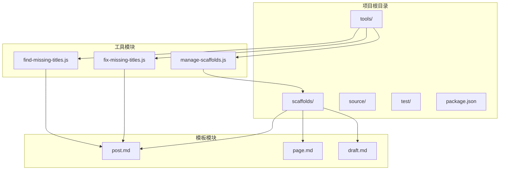
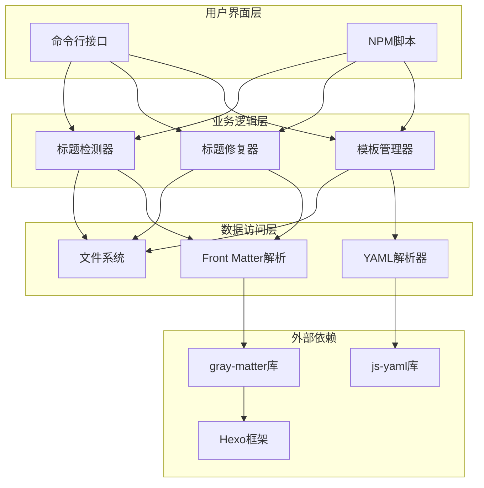
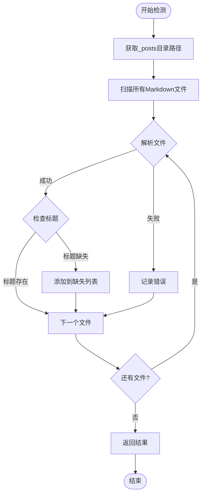
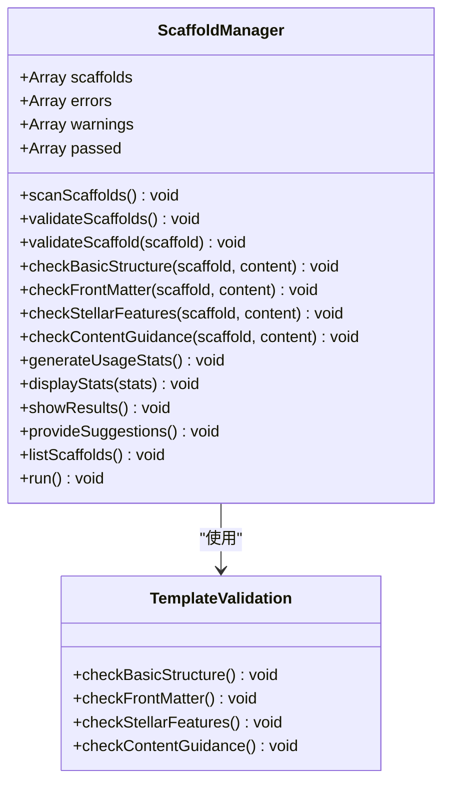
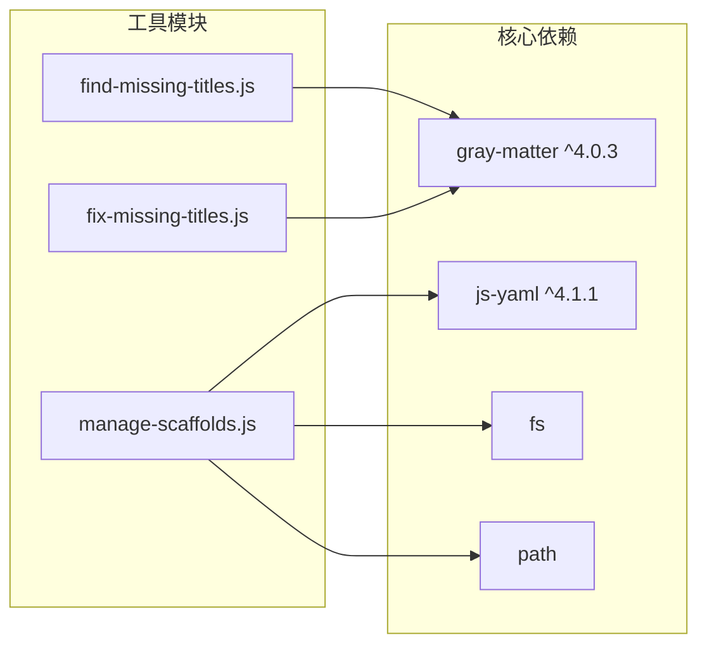
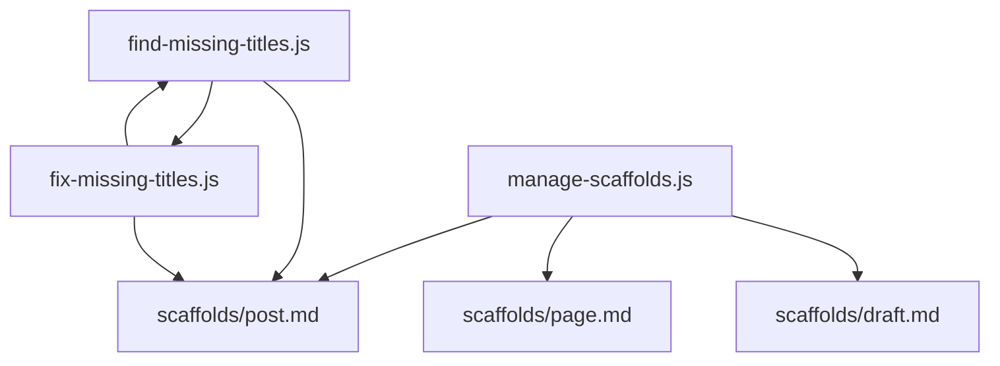

# 内容管理工具API

<cite>
**本文档引用的文件**
- [tools/find-missing-titles.js](file://tools/find-missing-titles.js)
- [tools/fix-missing-titles.js](file://tools/fix-missing-titles.js)
- [tools/manage-scaffolds.js](file://tools/manage-scaffolds.js)
- [scaffolds/post.md](file://scaffolds/post.md)
- [scaffolds/page.md](file://scaffolds/page.md)
- [scaffolds/draft.md](file://scaffolds/draft.md)
- [package.json](file://package.json)
- [test/content.test.js](file://test/content.test.js)
</cite>

## 目录
1. [简介](#简介)
2. [项目结构](#项目结构)
3. [核心组件](#核心组件)
4. [架构概览](#架构概览)
5. [详细组件分析](#详细组件分析)
6. [依赖分析](#依赖分析)
7. [性能考虑](#性能考虑)
8. [故障排除指南](#故障排除指南)
9. [结论](#结论)

## 简介

H1S97X博客的内容管理工具集是一套专为Hexo博客平台设计的自动化工具，主要用于内容质量管理和模板标准化。该工具集包含三个核心模块：

- **find-missing-titles.js**: 标题检测接口，用于扫描博客文章中的标题缺失问题
- **fix-missing-titles.js**: 自动修复功能API，提供标题生成和批量修复能力
- **manage-scaffolds.js**: 模板管理接口，负责Hexo scaffold模板的验证、管理和优化

这些工具通过统一的命令行接口集成到项目的构建流程中，支持从命令行直接调用和通过npm脚本执行。

## 项目结构

项目采用模块化组织结构，核心工具位于`tools/`目录，模板定义位于`scaffolds/`目录，测试文件位于`test/`目录。

**图表来源**
- [tools/find-missing-titles.js](file://tools/find-missing-titles.js#L1-L81)
- [tools/fix-missing-titles.js](file://tools/fix-missing-titles.js#L1-L92)
- [tools/manage-scaffolds.js](file://tools/manage-scaffolds.js#L1-L517)

**章节来源**
- [package.json](file://package.json#L1-L94)

## 核心组件

### 标题检测系统

标题检测系统由两个相互协作的模块组成：
- **find-missing-titles.js**: 负责扫描和检测缺失标题的文章
- **fix-missing-titles.js**: 负责自动修复检测到的标题问题

### 模板管理系统

模板管理系统是一个完整的类实现，提供以下核心功能：
- 模板扫描和验证
- 结构完整性检查
- 内容质量评估
- 使用统计分析
- 优化建议生成

**章节来源**
- [tools/find-missing-titles.js](file://tools/find-missing-titles.js#L31-L75)
- [tools/fix-missing-titles.js](file://tools/fix-missing-titles.js#L29-L86)
- [tools/manage-scaffolds.js](file://tools/manage-scaffolds.js#L12-L517)

## 架构概览

整个内容管理工具集采用分层架构设计，各组件之间通过清晰的接口进行交互。

**图表来源**
- [tools/find-missing-titles.js](file://tools/find-missing-titles.js#L3-L5)
- [tools/fix-missing-titles.js](file://tools/fix-missing-titles.js#L3-L5)
- [tools/manage-scaffolds.js](file://tools/manage-scaffolds.js#L8-L10)

## 详细组件分析

### 标题检测接口 (find-missing-titles.js)

#### 函数定义

**checkMissingTitles()**
- **功能**: 扫描所有Markdown文件，检测缺失标题的文章
- **参数**: 无
- **返回值**: 数组对象，包含以下字段
  - `file`: 文件相对路径
  - `title`: 检测到的标题值或"(未定义)"
  - `date`: 文章日期或"(未定义)"
  - `hasContent`: 布尔值，指示文件是否有内容

#### 核心算法

标题检测算法采用递归文件扫描和Front Matter解析相结合的方式：

**图表来源**
- [tools/find-missing-titles.js](file://tools/find-missing-titles.js#L31-L75)

#### 文件扫描机制

文件扫描采用深度优先搜索策略，遍历整个`source/_posts`目录树：

1. **目录遍历**: 使用递归函数遍历所有子目录
2. **文件过滤**: 仅处理`.md`扩展名的文件
3. **内容解析**: 使用`gray-matter`库解析Front Matter
4. **异常处理**: 捕获文件读取和解析过程中的错误

#### 报告生成格式

检测结果以结构化数组形式返回，每个条目包含：
- **文件路径**: 相对于项目根目录的路径
- **标题状态**: 显示原始标题值或"(未定义)"
- **日期信息**: 显示文章日期或"(未定义)"
- **内容状态**: 标识文件是否包含有效内容

**章节来源**
- [tools/find-missing-titles.js](file://tools/find-missing-titles.js#L7-L29)
- [tools/find-missing-titles.js](file://tools/find-missing-titles.js#L31-L75)

### 自动修复功能API (fix-missing-titles.js)

#### 函数定义

**fixMissingTitles()**
- **功能**: 自动修复检测到的标题缺失问题
- **参数**: 无
- **返回值**: 无（直接输出修复结果）
- **副作用**: 修改目标Markdown文件

#### 标题生成规则

标题生成遵循以下规则：

**图表来源**
- [tools/fix-missing-titles.js](file://tools/fix-missing-titles.js#L7-L21)

#### 批量修复流程

修复流程包含以下步骤：

1. **依赖检测**: 调用`checkMissingTitles()`获取待修复文件列表
2. **空文件检查**: 跳过没有内容的文件
3. **标题生成**: 基于文件名生成合适的标题
4. **Front Matter更新**: 更新`title`和`date`字段
5. **内容重建**: 使用`matter.stringify()`重建文件内容
6. **文件写入**: 将修改后的内容写回原文件

#### 回滚机制

当前版本的修复工具不包含内置的回滚机制。建议在执行批量修复前：

1. **备份文件**: 使用Git或其他版本控制系统
2. **增量修复**: 分批执行修复操作
3. **验证检查**: 修复后手动验证关键文章

**章节来源**
- [tools/fix-missing-titles.js](file://tools/fix-missing-titles.js#L29-L86)

### 模板管理接口 (manage-scaffolds.js)

#### 类定义

**ScaffoldManager**
- **功能**: 完整的Hexo scaffold模板管理解决方案
- **继承关系**: 无继承
- **主要方法**: 
  - `scanScaffolds()`: 扫描模板文件
  - `validateScaffolds()`: 验证模板质量
  - `generateUsageStats()`: 生成使用统计
  - `run()`: 执行主流程

#### 模板验证标准

模板验证涵盖四个维度：

**图表来源**
- [tools/manage-scaffolds.js](file://tools/manage-scaffolds.js#L12-L517)

#### 验证维度详解

**基本结构检查**
- Front Matter起始标记验证
- Front Matter格式完整性检查
- 内容格式正确性确认

**Front Matter检查**
- 必需字段验证（根据模板类型）
- 推荐字段检查
- Stellar主题配置字段识别

**Stellar特性检查**
- 主题特性使用统计
- 特性配置完整性评估
- 最佳实践建议

**内容指导检查**
- 编写指南存在性验证
- 示例内容结构检查
- 模板使用说明完整性

#### 使用统计分析

统计分析功能提供以下信息：

1. **总体统计**: 文章总数、Stellar特性使用率
2. **布局分布**: 不同布局类型的使用频率
3. **分类分布**: 前10个最常用分类的统计
4. **使用趋势**: 基于Front Matter字段的使用情况

**章节来源**
- [tools/manage-scaffolds.js](file://tools/manage-scaffolds.js#L57-L380)

## 依赖分析

### 外部依赖

项目依赖三个核心库：

**图表来源**
- [package.json](file://package.json#L72-L76)

### 内部依赖关系

**图表来源**
- [tools/fix-missing-titles.js](file://tools/fix-missing-titles.js#L30)
- [tools/manage-scaffolds.js](file://tools/manage-scaffolds.js#L152-L162)

**章节来源**
- [package.json](file://package.json#L68-L77)

## 性能考虑

### 文件扫描优化

1. **递归遍历**: 使用深度优先搜索，时间复杂度O(n)，其中n为文件数量
2. **内存管理**: 逐个处理文件，避免一次性加载所有文件到内存
3. **异常容错**: 捕获文件系统访问错误，不影响整体扫描进程

### 处理效率

1. **异步操作**: 当前实现为同步操作，适合中小型项目
2. **缓存策略**: 模板验证结果不进行缓存，确保实时准确性
3. **I/O优化**: 批量读取文件内容，减少文件系统调用次数

### 扩展性建议

对于大型项目，建议考虑：
- 实现异步文件扫描
- 添加进度条和状态反馈
- 增加并发处理能力
- 实现增量扫描功能

## 故障排除指南

### 标题检测问题

**常见问题及解决方案**:

1. **检测不到任何文件**
   - 检查`source/_posts`目录是否存在
   - 确认文件扩展名为`.md`
   - 验证文件权限设置

2. **标题生成不符合预期**
   - 检查文件名格式
   - 确认文件名包含有意义的标题信息
   - 验证文件名字符编码

3. **修复失败**
   - 检查文件写入权限
   - 确认文件内容格式正确
   - 验证磁盘空间充足

### 模板管理问题

**常见问题及解决方案**:

1. **模板验证失败**
   - 检查Front Matter格式
   - 确认必需字段完整
   - 验证Stellar主题配置

2. **统计信息不准确**
   - 检查文章Front Matter格式
   - 确认分类和标签格式正确
   - 验证Stellar特性配置

3. **命令行参数错误**
   - 查看帮助信息：`--help` 或 `-h`
   - 确认命令拼写正确
   - 检查npm脚本配置

**章节来源**
- [tools/find-missing-titles.js](file://tools/find-missing-titles.js#L53-L56)
- [tools/fix-missing-titles.js](file://tools/fix-missing-titles.js#L77-L80)
- [tools/manage-scaffolds.js](file://tools/manage-scaffolds.js#L478-L497)

## 结论

H1S97X博客的内容管理工具集提供了完整的自动化内容质量管理解决方案。通过三个核心模块的协同工作，实现了：

1. **全面的标题管理**: 从检测到修复的完整流程
2. **标准化的模板管理**: 结构化验证和优化建议
3. **智能化的统计分析**: 基于实际使用情况的洞察

### 最佳实践建议

1. **定期执行检查**: 将标题检测集成到CI/CD流程中
2. **模板维护**: 定期验证和更新模板文件
3. **备份策略**: 在执行批量修复前做好文件备份
4. **监控告警**: 设置内容质量监控和告警机制

### 未来发展方向

1. **增强错误恢复**: 实现自动回滚和错误修复
2. **扩展支持范围**: 支持更多Hexo主题和插件
3. **性能优化**: 实现异步处理和增量扫描
4. **可视化界面**: 开发Web界面替代命令行操作

这些工具为H1S97X博客的内容管理提供了坚实的技术基础，有助于维护高质量的内容发布标准。