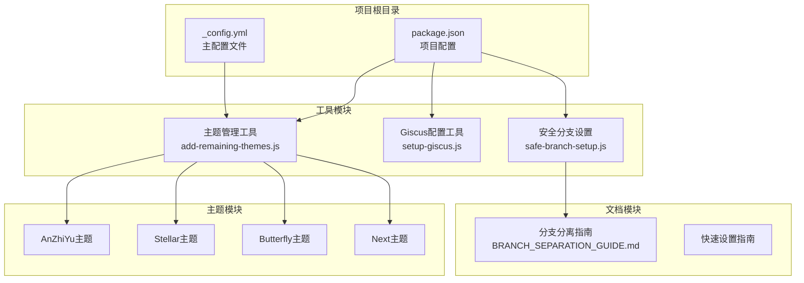
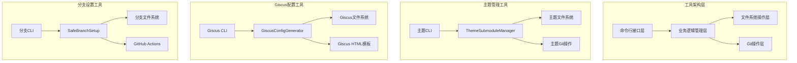
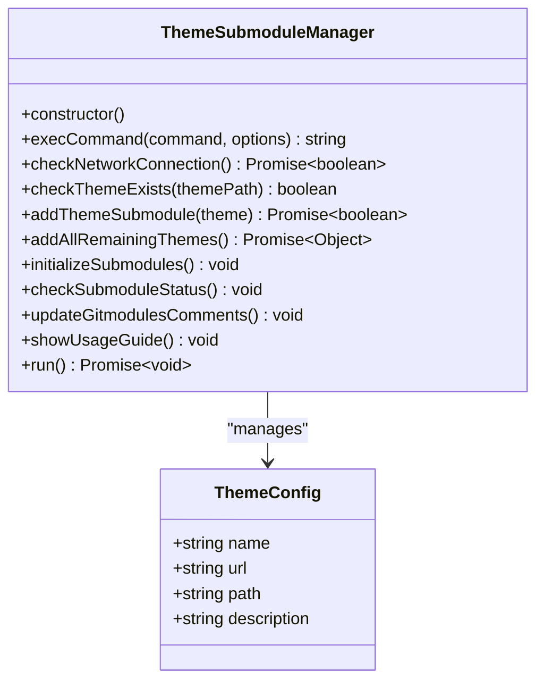
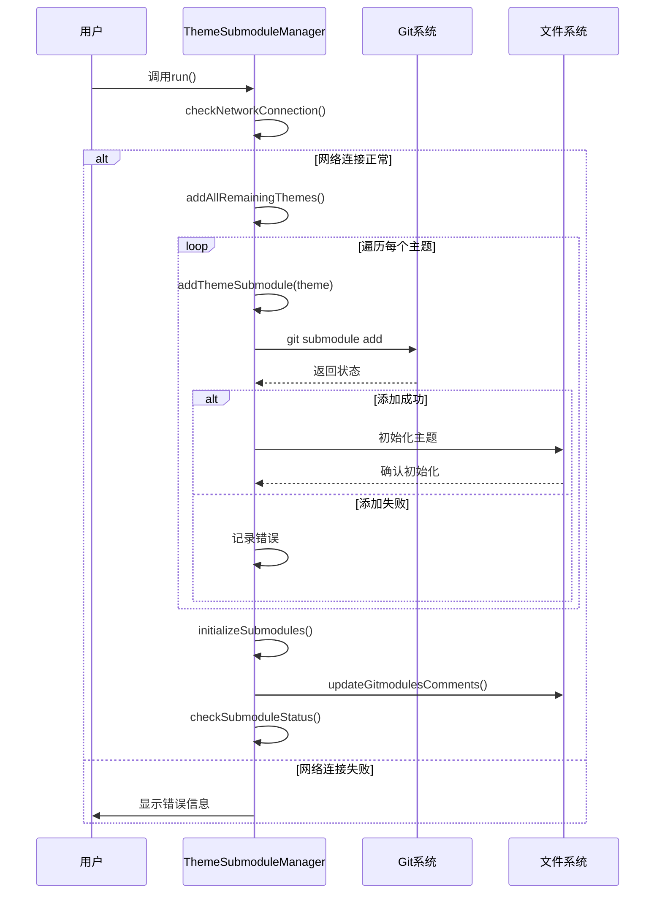
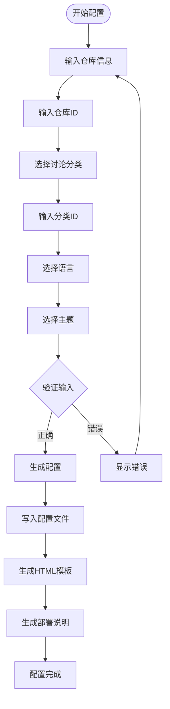
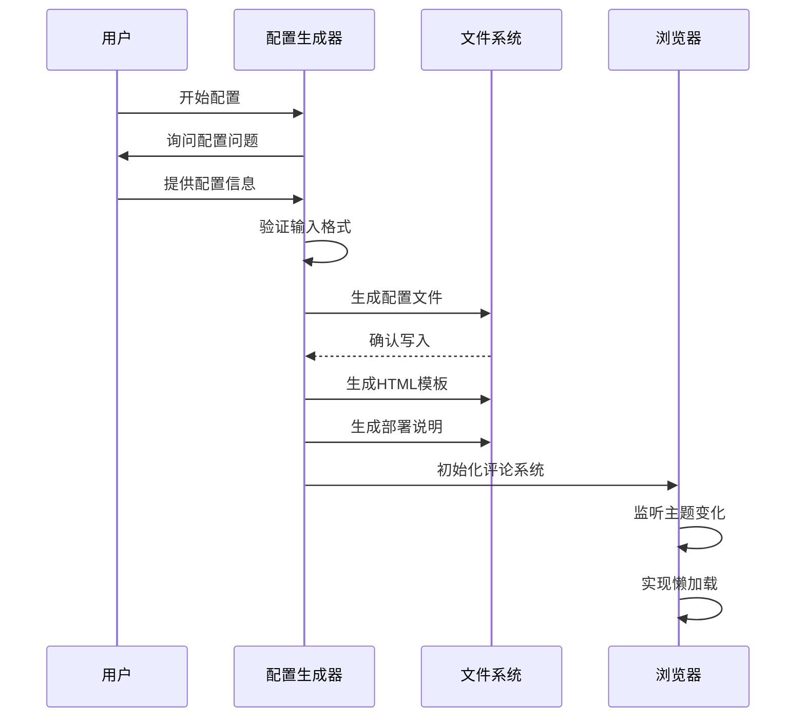
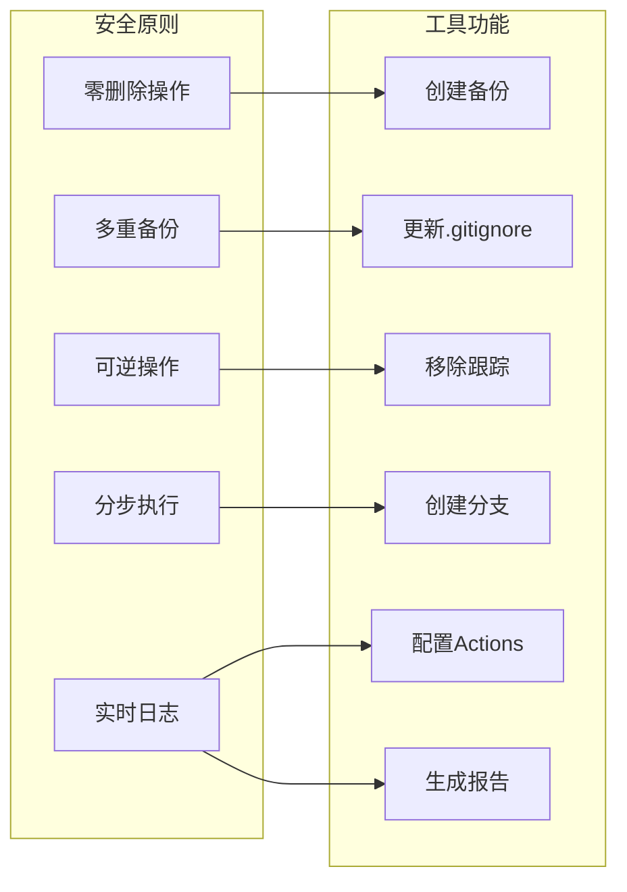
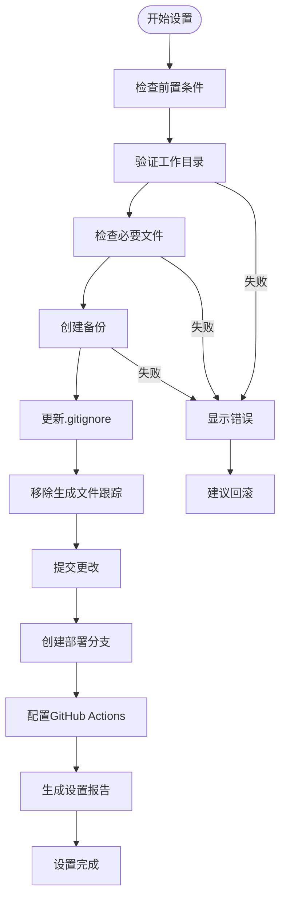
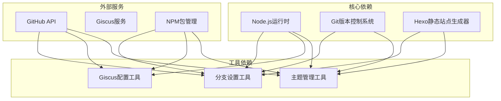
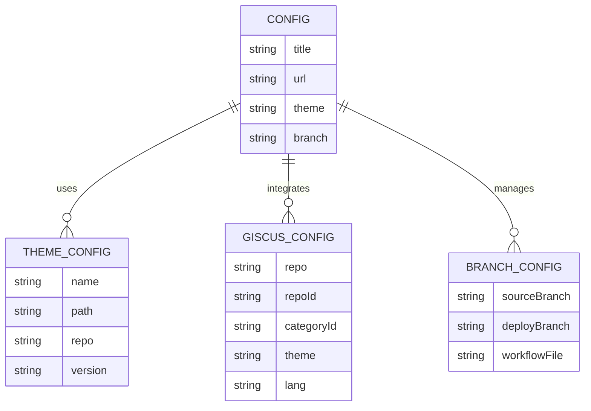

# 实用工具API

<cite>
**本文档引用的文件**
- [add-remaining-themes.js](file://tools/add-remaining-themes.js)
- [setup-giscus.js](file://tools/setup-giscus.js)
- [safe-branch-setup.js](file://tools/safe-branch-setup.js)
- [_config.yml](file://_config.yml)
- [package.json](file://package.json)
- [BRANCH_SEPARATION_GUIDE.md](file://docs/BRANCH_SEPARATION_GUIDE.md)
</cite>

## 目录
1. [简介](#简介)
2. [项目结构](#项目结构)
3. [核心组件](#核心组件)
4. [架构概览](#架构概览)
5. [详细组件分析](#详细组件分析)
6. [依赖关系分析](#依赖关系分析)
7. [性能考虑](#性能考虑)
8. [故障排除指南](#故障排除指南)
9. [结论](#结论)

## 简介

H1S97X博客的实用工具集提供了三个核心功能模块，专门用于博客的日常维护和部署管理。这些工具基于Node.js开发，采用现代化的JavaScript语法和最佳实践，确保了工具的可靠性、可维护性和易用性。

本工具集主要包含三大功能：
- **主题管理工具**：用于添加和管理Hexo主题子模块
- **评论系统配置工具**：用于快速配置Giscus评论系统
- **安全分支设置工具**：用于实现源码与部署内容的分离

每个工具都经过精心设计，提供了完整的API规范、使用场景说明和故障排除指南。

## 项目结构

项目采用模块化的组织结构，核心工具位于`tools/`目录下，每个工具都是独立的可执行脚本。

**图表来源**
- [add-remaining-themes.js](file://tools/add-remaining-themes.js#L1-L306)
- [setup-giscus.js](file://tools/setup-giscus.js#L1-L265)
- [safe-branch-setup.js](file://tools/safe-branch-setup.js#L1-L414)

**章节来源**
- [package.json](file://package.json#L1-L94)
- [BRANCH_SEPARATION_GUIDE.md](file://docs/BRANCH_SEPARATION_GUIDE.md#L1-L283)

## 核心组件

### 主题管理工具 (ThemeSubmoduleManager)

主题管理工具是一个面向对象的设计，提供了完整的主题生命周期管理功能。该工具支持多种Hexo主题的添加、初始化和状态检查。

**核心特性：**
- 自动网络连接检测
- Git子模块管理
- 配置文件更新
- 详细的日志记录
- 错误处理和恢复机制

**主要API接口：**
- `checkNetworkConnection()` - 检查网络连接状态
- `addThemeSubmodule(theme)` - 添加单个主题子模块
- `addAllRemainingThemes()` - 批量添加主题
- `initializeSubmodules()` - 初始化所有子模块
- `checkSubmoduleStatus()` - 检查子模块状态
- `updateGitmodulesComments()` - 更新配置文件注释

### Giscus配置工具 (GiscusConfigGenerator)

Giscus配置工具提供了一个交互式的配置界面，帮助用户快速设置Giscus评论系统。该工具支持多种配置选项和自定义参数。

**核心特性：**
- 交互式配置问答
- 自动配置文件生成
- HTML模板输出
- 部署说明生成
- 验证和错误处理

**主要配置选项：**
- 仓库信息 (repo, repoId)
- 讨论分类 (category, categoryId)
- 语言设置 (lang)
- 主题配置 (theme)
- 元数据选项

### 安全分支设置工具 (SafeBranchSetup)

安全分支设置工具实现了源码与部署内容的完全分离，采用了零删除、可逆操作的安全原则。该工具提供了完整的分支管理解决方案。

**核心特性：**
- 多重备份机制
- 零删除操作原则
- 可逆操作设计
- 分步执行验证
- 详细日志记录

**主要功能：**
- 备份标签创建
- .gitignore更新
- 生成文件清理
- 部署分支创建
- GitHub Actions配置
- 设置报告生成

**章节来源**
- [add-remaining-themes.js](file://tools/add-remaining-themes.js#L12-L280)
- [setup-giscus.js](file://tools/setup-giscus.js#L17-L265)
- [safe-branch-setup.js](file://tools/safe-branch-setup.js#L18-L403)

## 架构概览

三个工具采用独立的架构设计，但共享相似的设计模式和错误处理机制。

**图表来源**
- [add-remaining-themes.js](file://tools/add-remaining-themes.js#L34-L48)
- [setup-giscus.js](file://tools/setup-giscus.js#L57-L80)
- [safe-branch-setup.js](file://tools/safe-branch-setup.js#L42-L60)

## 详细组件分析

### 主题添加接口 (ThemeSubmoduleManager)

#### 类结构设计

**图表来源**
- [add-remaining-themes.js](file://tools/add-remaining-themes.js#L12-L29)
- [add-remaining-themes.js](file://tools/add-remaining-themes.js#L81-L101)

#### 主题发现机制

主题发现机制采用预定义配置的方式，支持以下主题：
- **AnZhiYu主题**：基于Butterfly主题的个人定制版本
- **Stellar主题**：内置文档系统的简约博客主题

每个主题包含完整的元数据信息，包括名称、仓库URL、本地路径和描述。

#### 安装流程

主题安装流程遵循严格的顺序控制：

**图表来源**
- [add-remaining-themes.js](file://tools/add-remaining-themes.js#L240-L279)
- [add-remaining-themes.js](file://tools/add-remaining-themes.js#L106-L136)

#### 配置更新机制

配置更新机制包括多个层面的文件管理：

1. **.gitmodules文件更新**：添加主题注释说明
2. **主题配置文件**：支持多主题配置
3. **Git子模块状态管理**：确保正确的子模块状态

**章节来源**
- [add-remaining-themes.js](file://tools/add-remaining-themes.js#L169-L202)
- [add-remaining-themes.js](file://tools/add-remaining-themes.js#L207-L235)

### 评论系统配置API (GiscusConfigGenerator)

#### 配置问答系统

Giscus配置工具采用交互式问答系统，提供以下配置选项：

**图表来源**
- [setup-giscus.js](file://tools/setup-giscus.js#L21-L52)
- [setup-giscus.js](file://tools/setup-giscus.js#L57-L80)

#### Giscus集成设置

Giscus集成设置包括多个关键配置项：

**核心配置参数：**
- `repo`: GitHub仓库标识 (格式: username/repo-name)
- `repoId`: 仓库ID (从giscus.app获取)
- `category`: 讨论分类 (默认: Announcements)
- `categoryId`: 分类ID (从giscus.app获取)
- `mapping`: 标识映射策略 (默认: pathname)
- `theme`: 主题设置 (light/dark/preferred_color_scheme)
- `lang`: 语言设置 (zh-CN/en/ja等)

**高级配置选项：**
- `reactionsEnabled`: 启用反应功能
- `emitMetadata`: 发送元数据
- `inputPosition`: 输入位置 (顶部/底部)
- `loading`: 加载策略 (懒加载)

#### 评论配置管理

评论配置管理提供了完整的生命周期支持：

**图表来源**
- [setup-giscus.js](file://tools/setup-giscus.js#L82-L261)

#### 自定义选项支持

自定义选项支持允许用户根据需要调整各种行为：

**主题切换机制：**
- 自动监听系统主题变化
- 支持手动主题切换
- 实时更新评论主题

**性能优化：**
- IntersectionObserver实现懒加载
- 条件初始化避免不必要的加载
- 缓存机制提升响应速度

**章节来源**
- [setup-giscus.js](file://tools/setup-giscus.js#L86-L198)
- [setup-giscus.js](file://tools/setup-giscus.js#L206-L247)

### 安全分支设置工具 (SafeBranchSetup)

#### 安全原则架构

安全分支设置工具严格遵循五个安全原则：

**图表来源**
- [safe-branch-setup.js](file://tools/safe-branch-setup.js#L7-L12)
- [safe-branch-setup.js](file://tools/safe-branch-setup.js#L361-L402)

#### 分支保护规则

分支保护规则确保了操作的安全性和可恢复性：

**前置条件检查：**
- Git工作目录状态验证
- 必要文件完整性检查
- 当前分支有效性验证

**备份机制：**
- 自动创建Git标签备份
- 远程推送备份标签
- 时间戳命名规范

**文件管理：**
- .gitignore模式更新
- 生成文件跟踪移除
- 本地文件保留策略

#### 权限管理

权限管理确保了工具的正确执行和安全性：

**执行权限：**
- 预览模式 (--dry-run)
- 详细日志记录
- 错误处理和恢复

**Git权限：**
- 子模块操作权限
- 分支切换权限
- 推送权限验证

#### 安全检查机制

安全检查机制提供了多层次的验证：

**图表来源**
- [safe-branch-setup.js](file://tools/safe-branch-setup.js#L62-L100)
- [safe-branch-setup.js](file://tools/safe-branch-setup.js#L361-L402)

**章节来源**
- [safe-branch-setup.js](file://tools/safe-branch-setup.js#L18-L41)
- [safe-branch-setup.js](file://tools/safe-branch-setup.js#L102-L192)
- [safe-branch-setup.js](file://tools/safe-branch-setup.js#L208-L272)

## 依赖关系分析

### 工具间依赖关系

**图表来源**
- [package.json](file://package.json#L45-L66)
- [add-remaining-themes.js](file://tools/add-remaining-themes.js#L8-L10)
- [setup-giscus.js](file://tools/setup-giscus.js#L8-L10)

### 配置文件依赖

配置文件之间存在复杂的依赖关系：

**图表来源**
- [_config.yml](file://_config.yml#L104-L136)
- [themes/butterfly/_config.yml](file://themes/butterfly/_config.yml#L491-L501)
- [themes/stellar/_config.yml](file://themes/stellar/_config.yml#L1-L8)

**章节来源**
- [package.json](file://package.json#L5-L41)
- [_config.yml](file://_config.yml#L1-L136)

## 性能考虑

### 主题管理性能优化

主题管理工具采用了多项性能优化策略：

**网络连接优化：**
- 并行网络检查减少等待时间
- 缓存网络状态避免重复检查
- 失败重试机制提高成功率

**Git操作优化：**
- 批量Git命令减少进程启动开销
- 子模块操作的并发处理
- 文件系统操作的最小化

### Giscus配置性能特性

Giscus配置工具注重用户体验和性能：

**懒加载机制：**
- IntersectionObserver实现智能懒加载
- 条件初始化避免不必要的资源消耗
- 主题切换的高效响应

**内存管理：**
- 配置对象的合理缓存
- DOM操作的最小化
- 事件监听器的及时清理

### 分支设置性能考量

分支设置工具在保证安全性的前提下优化性能：

**预览模式：**
- --dry-run模式避免实际Git操作
- 日志记录不影响性能
- 文件系统操作的延迟执行

**增量更新：**
- 只更新必要的文件和配置
- 避免重复的Git操作
- 智能的状态检查

## 故障排除指南

### 主题管理工具故障排除

**常见问题及解决方案：**

1. **网络连接失败**
   - 检查网络连接状态
   - 验证Git仓库URL可用性
   - 使用VPN或代理服务器

2. **Git子模块添加失败**
   - 确认Git权限设置
   - 检查仓库访问权限
   - 验证子模块URL格式

3. **主题初始化失败**
   - 检查主题依赖安装
   - 验证配置文件格式
   - 清理缓存后重试

### Giscus配置工具故障排除

**常见问题及解决方案：**

1. **配置文件生成失败**
   - 检查文件写入权限
   - 验证Node.js版本兼容性
   - 确认工作目录可写

2. **评论系统不显示**
   - 检查GitHub仓库的Discussions功能
   - 验证Giscus应用安装状态
   - 确认配置参数正确性

3. **主题切换失效**
   - 检查浏览器跨域限制
   - 验证postMessage API可用性
   - 确认主题配置格式

### 分支设置工具故障排除

**常见问题及解决方案：**

1. **备份创建失败**
   - 检查Git标签权限
   - 验证远程仓库推送权限
   - 确认网络连接稳定性

2. **分支创建失败**
   - 检查分支名称合法性
   - 验证Git权限设置
   - 确认工作目录状态

3. **GitHub Actions配置失败**
   - 检查仓库Actions权限
   - 验证GITHUB_TOKEN配置
   - 确认工作流文件格式

**章节来源**
- [BRANCH_SEPARATION_GUIDE.md](file://docs/BRANCH_SEPARATION_GUIDE.md#L196-L242)

## 结论

H1S97X博客的实用工具集展现了现代Web开发的最佳实践，通过精心设计的架构和完善的错误处理机制，为博客的日常维护提供了强大而可靠的工具支持。

**主要优势：**
- **安全性优先**：严格的安全原则确保操作的可逆性和可恢复性
- **用户友好**：直观的命令行界面和详细的帮助信息
- **功能完整**：覆盖博客管理的各个方面，从主题管理到部署配置
- **可扩展性**：模块化设计便于功能扩展和维护

**未来发展方向：**
- 增强自动化程度，减少手动干预
- 扩展更多主题和配置选项的支持
- 提供图形化界面选项
- 集成更多第三方服务

这些工具不仅提高了博客管理的效率，也为其他Hexo项目提供了宝贵的参考和借鉴价值。