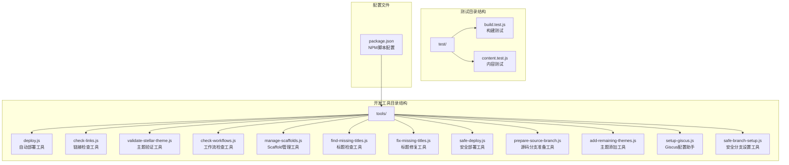
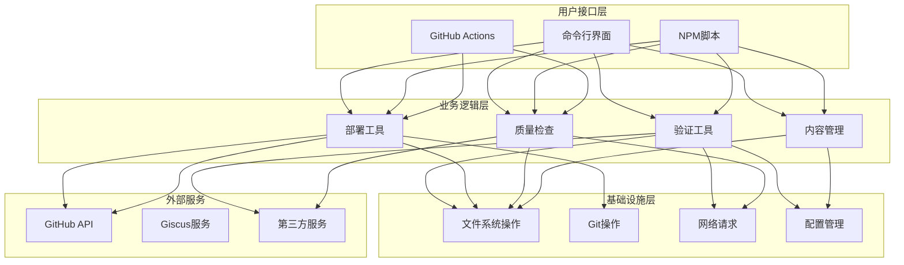
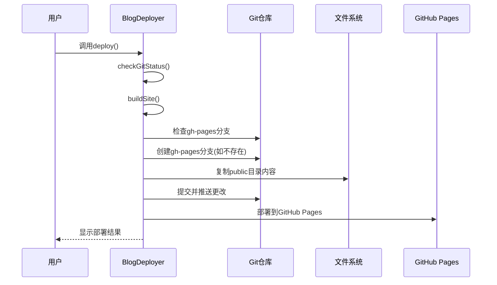
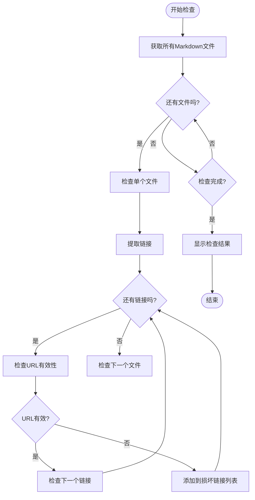
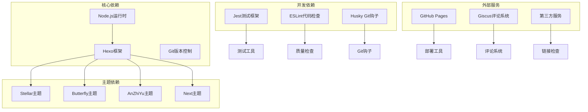

# 开发工具API

<cite>
**本文档引用的文件**
- [tools/deploy.js](file://tools/deploy.js)
- [tools/check-links.js](file://tools/check-links.js)
- [tools/validate-stellar-theme.js](file://tools/validate-stellar-theme.js)
- [tools/find-missing-titles.js](file://tools/find-missing-titles.js)
- [tools/fix-missing-titles.js](file://tools/fix-missing-titles.js)
- [tools/check-workflows.js](file://tools/check-workflows.js)
- [tools/manage-scaffolds.js](file://tools/manage-scaffolds.js)
- [tools/safe-deploy.js](file://tools/safe-deploy.js)
- [tools/prepare-source-branch.js](file://tools/prepare-source-branch.js)
- [tools/add-remaining-themes.js](file://tools/add-remaining-themes.js)
- [tools/setup-giscus.js](file://tools/setup-giscus.js)
- [tools/safe-branch-setup.js](file://tools/safe-branch-setup.js)
- [package.json](file://package.json)
- [test/build.test.js](file://test/build.test.js)
- [test/content.test.js](file://test/content.test.js)
</cite>

## 目录
1. [简介](#简介)
2. [项目结构](#项目结构)
3. [核心组件](#核心组件)
4. [架构概览](#架构概览)
5. [详细组件分析](#详细组件分析)
6. [依赖关系分析](#依赖关系分析)
7. [性能考虑](#性能考虑)
8. [故障排除指南](#故障排除指南)
9. [结论](#结论)
10. [附录](#附录)

## 简介

H1S97X博客开发工具集是一套完整的自动化工具链，专为Hexo博客平台设计，提供了从内容管理到部署发布的全流程解决方案。该工具集包含了质量检查、测试验证、主题管理、工作流检查等多个方面的功能模块。

本API参考文档详细记录了所有开发工具函数的接口规范，包括工具函数的参数定义、返回值类型和调用方式。文档特别关注测试工具的API接口、质量检查工具的API规范，以及工具链集成的API接口，为开发者提供了完整的使用示例和集成指南。

## 项目结构

项目采用模块化设计，所有开发工具都位于`tools`目录下，每个工具都是独立的Node.js脚本，具有明确的职责分工：



**图表来源**
- [tools/deploy.js](file://tools/deploy.js#L1-L472)
- [tools/check-links.js](file://tools/check-links.js#L1-L133)
- [tools/validate-stellar-theme.js](file://tools/validate-stellar-theme.js#L1-L313)

**章节来源**
- [package.json](file://package.json#L1-L94)

## 核心组件

开发工具集包含以下核心组件，每个组件都实现了特定的功能领域：

### 部署工具组件
- **BlogDeployer**: 主要的部署控制器，负责完整的部署流程
- **SafeDeploy**: 安全部署工具，提供额外的安全保障
- **SafeBranchSetup**: 安全分支设置工具，用于初始化项目结构

### 质量检查组件
- **LinkChecker**: 链接有效性检查器
- **StellarThemeValidator**: Stellar主题配置验证器
- **WorkflowChecker**: GitHub Actions工作流检查器

### 内容管理组件
- **ScaffoldManager**: Scaffold模板管理器
- **ThemeSubmoduleManager**: 主题子模块管理器
- **SourceBranchPreparer**: 源码分支准备器

### 辅助工具组件
- **TitleChecker**: 标题检查器
- **GiscusSetup**: Giscus评论系统配置助手

**章节来源**
- [tools/deploy.js](file://tools/deploy.js#L12-L472)
- [tools/validate-stellar-theme.js](file://tools/validate-stellar-theme.js#L12-L313)
- [tools/check-links.js](file://tools/check-links.js#L8-L133)

## 架构概览

开发工具集采用了分层架构设计，每个工具都遵循单一职责原则：



**图表来源**
- [tools/deploy.js](file://tools/deploy.js#L1-L472)
- [tools/validate-stellar-theme.js](file://tools/validate-stellar-theme.js#L1-L313)
- [tools/check-links.js](file://tools/check-links.js#L1-L133)

## 详细组件分析

### 部署工具API

#### BlogDeployer 类

BlogDeployer 是主要的部署控制器，提供了完整的部署生命周期管理：

**构造函数**
```javascript
constructor()
```
- 初始化部署器实例
- 设置根目录和public目录路径
- 检测干运行模式

**主要方法**

1. **execCommand(command, options)** - 执行系统命令
   - 参数: `command` (字符串) - 要执行的命令
   - 参数: `options` (对象) - 命令执行选项
   - 返回: `string` - 命令执行结果
   - 异常: `Error` - 命令执行失败时抛出

2. **checkGitStatus()** - 检查Git仓库状态
   - 返回: `Promise<void>`
   - 功能: 验证Git仓库完整性、检查工作目录状态、验证远程仓库配置

3. **buildSite()** - 构建静态网站
   - 返回: `void`
   - 功能: 执行Stellar主题验证、初始化主题子模块、清理和生成静态文件

4. **deploy()** - 执行完整部署流程
   - 返回: `Promise<void>`
   - 功能: 按顺序执行检查Git状态、构建网站、创建/更新gh-pages分支、部署到GitHub Pages

**部署流程序列图**



**图表来源**
- [tools/deploy.js](file://tools/deploy.js#L383-L418)

**章节来源**
- [tools/deploy.js](file://tools/deploy.js#L12-L472)

#### SafeDeploy 类

SafeDeploy 提供了额外的安全保障机制：

**构造函数**
```javascript
constructor()
```
- 初始化安全部署器
- 设置日志文件和运行模式

**主要方法**

1. **checkPrerequisites()** - 检查部署前置条件
   - 返回: `void`
   - 功能: 验证当前分支、Git状态、public目录存在性、gh-pages分支状态

2. **executeCommand(command, description)** - 安全执行命令
   - 参数: `command` (字符串) - 要执行的命令
   - 参数: `description` (字符串) - 命令描述
   - 返回: `string` - 命令执行结果
   - 异常: `Error` - 命令执行失败时抛出

3. **run()** - 执行安全部署
   - 返回: `Promise<void>`
   - 功能: 完整的安全部署流程，包含日志记录和错误处理

**章节来源**
- [tools/safe-deploy.js](file://tools/safe-deploy.js#L18-L352)

### 质量检查工具API

#### LinkChecker 类

LinkChecker 专门用于检查Markdown文件中的外部链接有效性：

**构造函数**
```javascript
constructor()
```
- 初始化链接检查器
- 设置错误数组和URL缓存

**主要方法**

1. **checkUrl(url)** - 异步检查单个URL
   - 参数: `url` (字符串) - 要检查的URL
   - 返回: `Promise<boolean>` - URL有效性
   - 功能: 支持HTTP和HTTPS协议，包含超时处理

2. **checkMarkdownFile(filePath)** - 检查单个Markdown文件
   - 参数: `filePath` (字符串) - Markdown文件路径
   - 返回: `Promise<void>`
   - 功能: 提取所有链接并进行验证

3. **checkAllFiles()** - 检查所有Markdown文件
   - 返回: `Promise<void>`
   - 功能: 遍历source/_posts目录下的所有Markdown文件

**链接检查流程图**



**图表来源**
- [tools/check-links.js](file://tools/check-links.js#L78-L125)

**章节来源**
- [tools/check-links.js](file://tools/check-links.js#L8-L133)

#### StellarThemeValidator 类

StellarThemeValidator 用于验证Stellar主题配置的正确性和完整性：

**构造函数**
```javascript
constructor()
```
- 初始化验证器
- 设置错误、警告和信息数组

**主要验证方法**

1. **validateMainConfig()** - 验证主配置文件
   - 返回: `Promise<void>`
   - 功能: 检查主题设置、必需字段、搜索配置

2. **validateStellarConfig()** - 验证Stellar主题配置
   - 返回: `Promise<void>`
   - 功能: 检查导航菜单、站点结构、搜索和评论配置

3. **validateThemeFiles()** - 验证主题文件存在性
   - 返回: `Promise<void>`
   - 功能: 检查关键主题文件和版本信息

4. **validateDependencies()** - 验证依赖包
   - 返回: `Promise<void>`
   - 功能: 检查Hexo版本和推荐依赖

**章节来源**
- [tools/validate-stellar-theme.js](file://tools/validate-stellar-theme.js#L12-L313)

#### WorkflowChecker 类

WorkflowChecker 用于检查GitHub Actions工作流配置：

**构造函数**
```javascript
constructor()
```
- 初始化工作流检查器
- 设置错误、警告和通过数组

**主要检查方法**

1. **checkAllWorkflows()** - 检查所有工作流文件
   - 返回: `void`
   - 功能: 遍历.github/workflows目录

2. **checkWorkflowFile(filename)** - 检查单个工作流文件
   - 参数: `filename` (字符串) - 工作流文件名
   - 返回: `void`

3. **checkStellarSupport(filename, workflow)** - 检查Stellar主题支持
   - 参数: `filename` (字符串) - 工作流文件名
   - 参数: `workflow` (对象) - 工作流配置
   - 返回: `void`

**章节来源**
- [tools/check-workflows.js](file://tools/check-workflows.js#L12-L315)

### 内容管理工具API

#### ScaffoldManager 类

ScaffoldManager 用于管理和验证Hexo scaffold模板：

**构造函数**
```javascript
constructor()
```
- 初始化Scaffold管理器
- 设置根目录和scaffolds目录

**主要方法**

1. **scanScaffolds()** - 扫描所有scaffold文件
   - 返回: `void`
   - 功能: 发现和记录所有scaffold模板

2. **validateScaffolds()** - 验证所有scaffold模板
   - 返回: `void`
   - 功能: 执行完整的模板验证流程

3. **generateUsageStats()** - 生成使用统计
   - 返回: `void`
   - 功能: 分析内容使用情况和Stellar特性使用统计

4. **run()** - 执行主要功能
   - 返回: `void`
   - 功能: 根据命令参数执行相应操作

**章节来源**
- [tools/manage-scaffolds.js](file://tools/manage-scaffolds.js#L12-L517)

#### ThemeSubmoduleManager 类

ThemeSubmoduleManager 用于管理Hexo主题子模块：

**构造函数**
```javascript
constructor()
```
- 初始化主题子模块管理器
- 设置剩余主题数组

**主要方法**

1. **checkNetworkConnection()** - 检查网络连接
   - 返回: `Promise<boolean>`
   - 功能: 验证主题仓库的网络可达性

2. **addAllRemainingThemes()** - 添加所有剩余主题
   - 返回: `Promise<object>`
   - 功能: 批量添加AnZhiYu和Stellar主题

3. **initializeSubmodules()** - 初始化所有子模块
   - 返回: `void`
   - 功能: 执行git submodule update --init --recursive

**章节来源**
- [tools/add-remaining-themes.js](file://tools/add-remaining-themes.js#L12-L306)

### 标题管理工具API

#### TitleChecker 工具

TitleChecker 提供了标题检查和修复功能：

**checkMissingTitles()** - 检查缺失标题
- 返回: `Array<Object>`
- 功能: 扫描所有Markdown文件，识别缺少标题的文件
- 返回值: 包含文件路径、标题、日期和内容状态的对象数组

**章节来源**
- [tools/find-missing-titles.js](file://tools/find-missing-titles.js#L31-L75)

#### TitleFixer 工具

**fixMissingTitles()** - 修复缺失标题
- 返回: `void`
- 功能: 自动修复缺少标题的文件，从文件名生成标题并更新front matter

**章节来源**
- [tools/fix-missing-titles.js](file://tools/fix-missing-titles.js#L29-L86)

### 辅助工具API

#### SourceBranchPreparer 类

SourceBranchPreparer 用于准备纯净的源码分支：

**构造函数**
```javascript
constructor()
```
- 初始化源码分支准备器
- 设置生成文件和源码文件模式数组

**主要方法**

1. **cleanGeneratedFiles()** - 清理生成文件
   - 返回: `Object`
   - 功能: 删除所有生成的静态文件和目录

2. **checkStatus()** - 检查源码分支状态
   - 返回: `Object`
   - 功能: 分析当前分支的生成文件和源码文件状态

3. **prepare()** - 执行完整的源码分支准备
   - 返回: `void`
   - 功能: 清理生成文件、更新.gitignore、最终状态检查

**章节来源**
- [tools/prepare-source-branch.js](file://tools/prepare-source-branch.js#L11-L347)

#### GiscusSetup 工具

GiscusSetup 提供了Giscus评论系统的配置向导：

**主要功能**
- 交互式配置问答
- 自动生成配置文件
- 生成部署说明文档
- 支持多种主题和语言配置

**章节来源**
- [tools/setup-giscus.js](file://tools/setup-giscus.js#L1-L265)

## 依赖关系分析

开发工具集之间的依赖关系如下：



**图表来源**
- [package.json](file://package.json#L45-L77)

**章节来源**
- [package.json](file://package.json#L1-L94)

## 性能考虑

开发工具集在设计时充分考虑了性能优化：

### 并行处理
- 链接检查工具使用异步处理，支持并发检查多个URL
- 工作流检查工具并行处理多个工作流文件
- Scaffold管理工具批量处理多个模板文件

### 缓存机制
- 链接检查器使用Set缓存已检查的URL，避免重复请求
- 部署工具支持干运行模式，减少不必要的文件操作

### 内存优化
- 使用流式处理大文件
- 及时释放不再使用的资源
- 限制递归深度防止栈溢出

### I/O优化
- 批量文件操作减少磁盘I/O次数
- 智能的文件过滤和匹配算法
- 合理的文件遍历策略

## 故障排除指南

### 常见问题及解决方案

#### 部署相关问题

**问题**: 部署失败，提示gh-pages分支不存在
- **解决方案**: 使用`safe-branch-setup.js`工具创建部署分支
- **预防措施**: 在部署前检查分支状态

**问题**: 部署后网站无法访问
- **解决方案**: 检查GitHub Pages设置中的分支配置
- **预防措施**: 使用`--dry-run`模式预览部署过程

#### 配置相关问题

**问题**: Stellar主题验证失败
- **解决方案**: 检查_config_stellar.yml配置文件
- **预防措施**: 使用`validate-stellar-theme.js`定期验证配置

**问题**: 链接检查工具报错
- **解决方案**: 检查网络连接和目标网站状态
- **预防措施**: 使用超时和重试机制

#### 性能相关问题

**问题**: 工具运行缓慢
- **解决方案**: 检查磁盘空间和内存使用情况
- **预防措施**: 使用干运行模式进行性能测试

**章节来源**
- [tools/deploy.js](file://tools/deploy.js#L413-L418)
- [tools/validate-stellar-theme.js](file://tools/validate-stellar-theme.js#L287-L296)

## 结论

H1S97X博客开发工具集提供了一套完整、可靠的自动化解决方案，涵盖了现代博客开发的各个方面。工具集的设计遵循了模块化、可扩展和用户友好的原则，为开发者提供了强大的开发体验。

主要优势包括：
- **全面的功能覆盖**: 从内容管理到部署发布的完整工具链
- **强大的质量保证**: 多层次的质量检查和验证机制
- **灵活的集成方式**: 支持命令行、NPM脚本和GitHub Actions
- **完善的错误处理**: 详细的错误报告和恢复机制
- **优秀的用户体验**: 清晰的输出信息和交互式配置

建议开发者根据项目需求选择合适的工具组合，并建立相应的CI/CD流程来确保持续集成和部署的质量。

## 附录

### 使用示例

#### 基本部署流程
```bash
# 预览部署过程
node tools/deploy.js --dry-run

# 执行实际部署
node tools/deploy.js

# 使用NPM脚本
npm run deploy
```

#### 质量检查
```bash
# 检查链接有效性
node tools/check-links.js

# 验证Stellar主题配置
node tools/validate-stellar-theme.js

# 检查工作流配置
node tools/check-workflows.js --report
```

#### 内容管理
```bash
# 验证Scaffold模板
node tools/manage-scaffolds.js validate

# 列出可用模板
node tools/manage-scaffolds.js list

# 生成使用统计
node tools/manage-scaffolds.js stats
```

### 集成指南

#### GitHub Actions集成
```yaml
name: 博客构建和部署
on:
  push:
    branches: [ master ]
jobs:
  build-and-deploy:
    runs-on: ubuntu-latest
    steps:
    - uses: actions/checkout@v4
    - name: 设置Node.js
      uses: actions/setup-node@v4
      with:
        node-version: '18'
    - run: npm ci
    - run: npm run validate
    - run: npm run deploy
```

#### 测试集成
```javascript
// 在Jest测试中使用
const { execSync } = require('child_process');

describe('博客构建测试', () => {
  test('应该成功构建博客', () => {
    expect(() => {
      execSync('npx hexo clean', { stdio: 'inherit' });
      execSync('npx hexo generate', { stdio: 'inherit' });
    }).not.toThrow();
  });
});
```

**章节来源**
- [package.json](file://package.json#L5-L41)
- [test/build.test.js](file://test/build.test.js#L1-L71)
- [test/content.test.js](file://test/content.test.js#L1-L109)