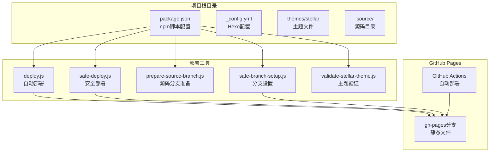
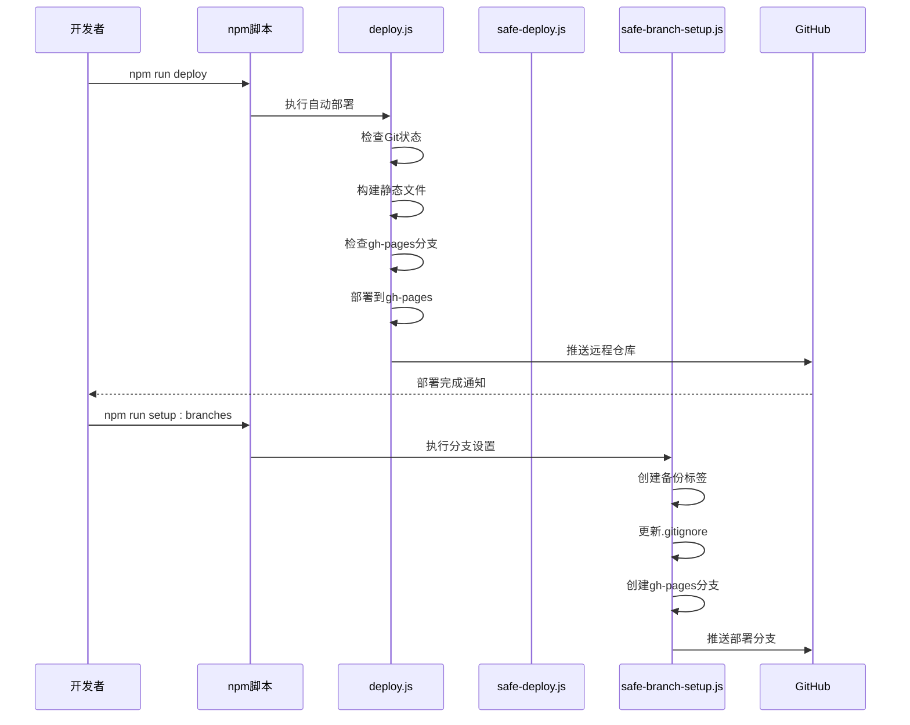
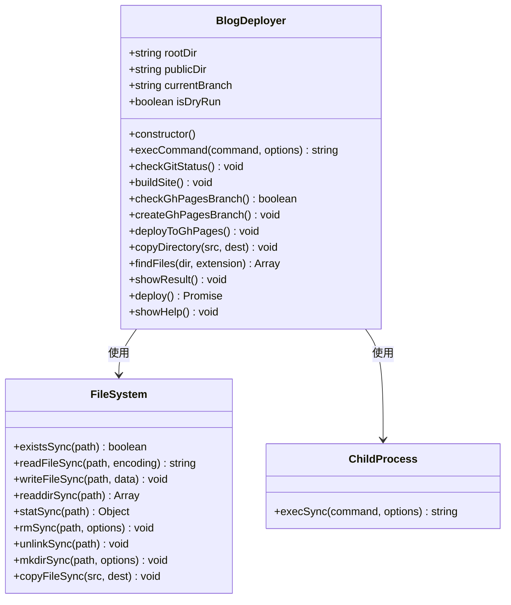
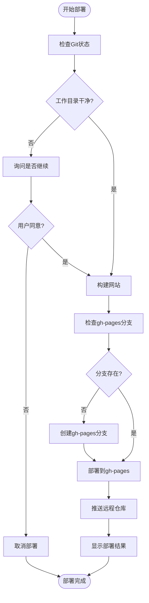
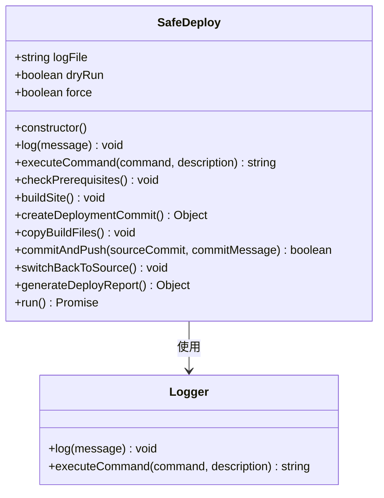
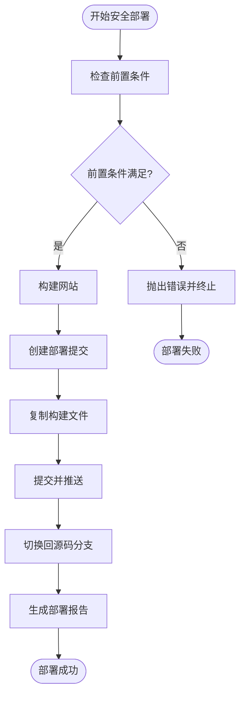
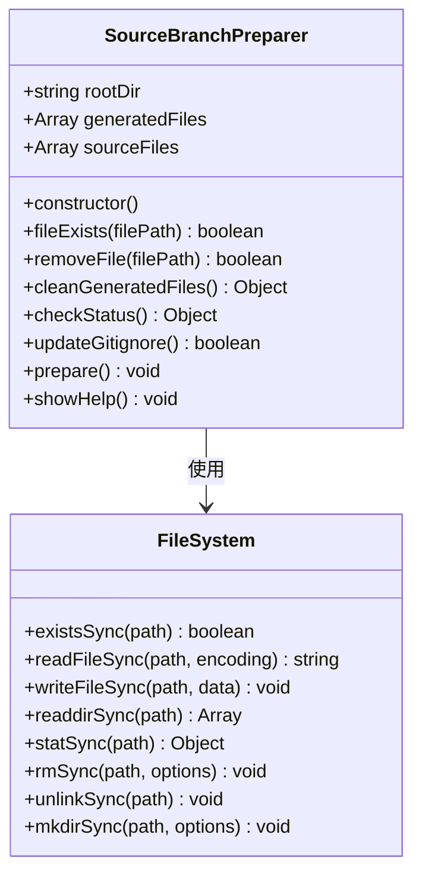
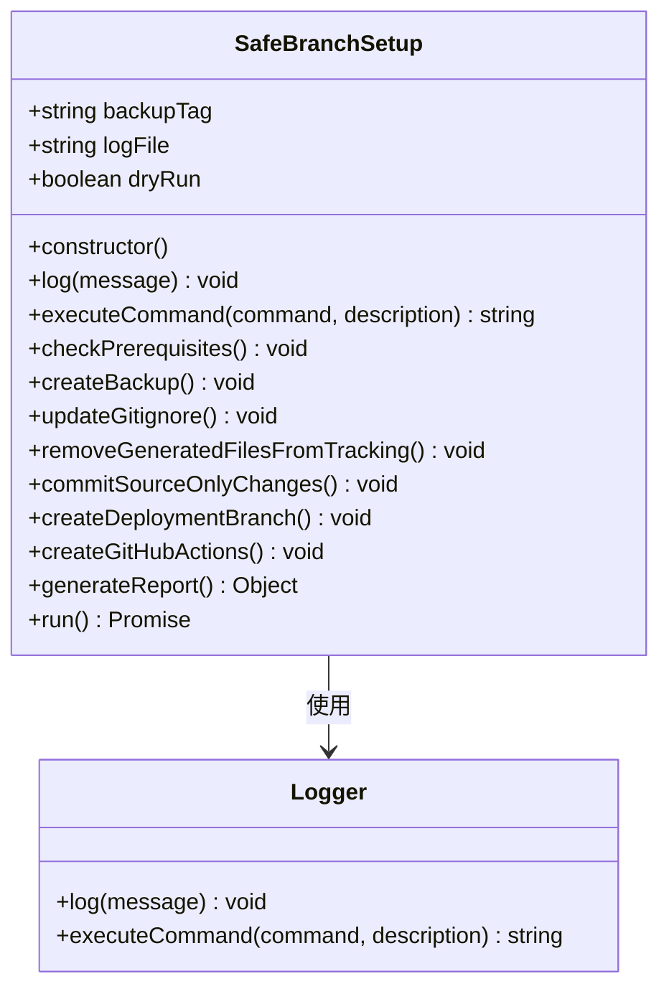
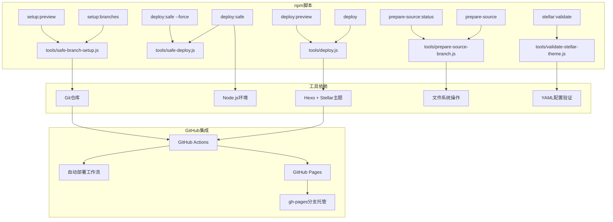

# 部署工具API

<cite>
**本文引用的文件**
- [tools/deploy.js](file://tools/deploy.js)
- [tools/safe-deploy.js](file://tools/safe-deploy.js)
- [tools/prepare-source-branch.js](file://tools/prepare-source-branch.js)
- [tools/safe-branch-setup.js](file://tools/safe-branch-setup.js)
- [tools/validate-stellar-theme.js](file://tools/validate-stellar-theme.js)
- [package.json](file://package.json)
- [_config.yml](file://_config.yml)
- [docs/BRANCH_SEPARATION_GUIDE.md](file://docs/BRANCH_SEPARATION_GUIDE.md)
- [docs/STELLAR_DEPLOYMENT_GUIDE.md](file://docs/STELLAR_DEPLOYMENT_GUIDE.md)
</cite>

## 目录
1. [简介](#简介)
2. [项目结构](#项目结构)
3. [核心组件](#核心组件)
4. [架构概览](#架构概览)
5. [详细组件分析](#详细组件分析)
6. [依赖关系分析](#依赖关系分析)
7. [性能考虑](#性能考虑)
8. [故障排除指南](#故障排除指南)
9. [结论](#结论)
10. [附录](#附录)

## 简介
本文档为H1S97X博客的部署工具提供详细的API参考文档，重点覆盖以下核心工具：
- deploy.js：自动部署脚本，负责将博客部署到GitHub Pages的gh-pages分支
- safe-deploy.js：安全部署工具，提供安全的部署流程和回滚机制
- prepare-source-branch.js：源码分支准备工具，用于清理生成文件并准备纯净的源码分支
- safe-branch-setup.js：安全的分支设置工具，实现源码与部署分支的分离

文档详细说明了各工具的函数接口、参数配置、Git操作流程、GitHub Pages部署过程，以及分支管理功能，包括分支创建、合并策略和冲突处理。同时提供完整的函数签名、参数说明、返回值类型和异常处理机制，并包含实际的调用示例和最佳实践指南。

## 项目结构
H1S97X博客采用Hexo + Stellar主题的静态网站架构，部署工具位于tools目录中，配合package.json中的npm脚本实现自动化部署。



**图表来源**
- [package.json](file://package.json#L5-L40)
- [tools/deploy.js](file://tools/deploy.js#L1-L50)
- [tools/safe-deploy.js](file://tools/safe-deploy.js#L1-L50)

**章节来源**
- [package.json](file://package.json#L1-L94)
- [docs/BRANCH_SEPARATION_GUIDE.md](file://docs/BRANCH_SEPARATION_GUIDE.md#L1-L100)

## 核心组件
本节详细介绍四个核心部署工具的功能特性和使用场景。

### deploy.js - 自动部署工具
自动部署工具是主要的部署入口，提供完整的部署流程自动化，包括Git状态检查、静态文件构建、gh-pages分支管理和部署推送。

**核心特性：**
- Git仓库状态验证和分支检查
- Stellar主题配置验证和子模块初始化
- 静态文件构建和关键文件验证
- gh-pages分支的创建和管理
- GitHub Pages部署和结果展示

**主要部署流程：**
1. 检查Git仓库状态和当前分支
2. 验证Stellar主题配置并初始化子模块
3. 清理旧文件并生成静态网站
4. 检查gh-pages分支是否存在
5. 部署到gh-pages分支并推送远程
6. 显示部署结果和相关信息

**章节来源**
- [tools/deploy.js](file://tools/deploy.js#L12-L472)

### safe-deploy.js - 安全部署工具
安全部署工具提供更加严格的安全检查和日志记录，确保部署过程的可追溯性和可回滚性。

**核心特性：**
- 严格的前置条件检查（分支状态、工作目录状态）
- 详细的日志记录和错误追踪
- 安全的文件复制和部署流程
- 部署信息文件生成和部署报告
- 强制模式支持（--force参数）

**安全原则：**
- 绝不删除源码文件
- 只操作public目录内容
- 保留部署历史
- 支持回滚机制

**章节来源**
- [tools/safe-deploy.js](file://tools/safe-deploy.js#L18-L352)

### prepare-source-branch.js - 源码分支准备工具
源码分支准备工具专门用于清理生成文件，保持源码分支的纯净性。

**核心功能：**
- 清理Hexo生成的静态文件和临时文件
- 更新.gitignore规则以忽略生成文件
- 检查源码分支状态并提供清理建议
- 保留所有源码文件（source、themes、tools等）

**清理范围：**
- 生成的HTML文件和目录（public/、年份目录等）
- RSS和sitemap文件
- 样式、脚本、图片等静态资源目录
- 临时文件和日志文件

**章节来源**
- [tools/prepare-source-branch.js](file://tools/prepare-source-branch.js#L11-L347)

### safe-branch-setup.js - 安全分支设置工具
安全分支设置工具实现源码与部署分支的完全分离，提供零删除操作的安全机制。

**核心功能：**
- 创建Git标签备份确保可回滚
- 配置.gitignore忽略生成文件
- 移除生成文件的Git跟踪（保留本地文件）
- 创建孤立的gh-pages部署分支
- 设置GitHub Actions工作流

**安全原则：**
- 绝不使用删除命令
- 所有操作可逆
- 多重备份验证
- 分步骤执行和验证

**章节来源**
- [tools/safe-branch-setup.js](file://tools/safe-branch-setup.js#L18-L414)

## 架构概览
部署工具的整体架构采用模块化设计，每个工具都有明确的职责分工，通过npm脚本协调工作。



**图表来源**
- [package.json](file://package.json#L5-L40)
- [tools/deploy.js](file://tools/deploy.js#L383-L418)
- [tools/safe-branch-setup.js](file://tools/safe-branch-setup.js#L361-L402)

## 详细组件分析

### deploy.js - 自动部署工具详细分析

#### 类结构和核心方法



**图表来源**
- [tools/deploy.js](file://tools/deploy.js#L12-L472)

#### 核心API接口

**构造函数**
- 函数签名：`BlogDeployer()`
- 参数：无
- 返回值：BlogDeployer实例
- 功能：初始化部署器，设置根目录、public目录和dry-run模式

**execCommand方法**
- 函数签名：`execCommand(command, options)`
- 参数：
  - command: string - 要执行的命令
  - options: Object - 可选参数对象
- 返回值：string - 命令执行结果
- 功能：执行系统命令并返回结果，支持dry-run模式

**checkGitStatus方法**
- 函数签名：`checkGitStatus()`
- 参数：无
- 返回值：Promise
- 功能：检查Git仓库状态，包括仓库有效性、当前分支、未提交更改等

**buildSite方法**
- 函数签名：`buildSite()`
- 参数：无
- 返回值：void
- 功能：构建静态网站，包括配置验证、子模块初始化、清理旧文件、生成新文件等

**deploy方法**
- 函数签名：`deploy()`
- 参数：无
- 返回值：Promise
- 功能：执行完整的部署流程，按顺序调用上述方法

#### Git操作流程



**图表来源**
- [tools/deploy.js](file://tools/deploy.js#L383-L418)

#### GitHub Pages部署过程

**分支管理策略：**
- 自动检测gh-pages分支是否存在
- 如果不存在，创建孤立分支并初始化
- 使用--orphan选项创建干净的部署分支
- 清空分支内容但保留.git目录

**部署流程：**
1. 切换到gh-pages分支
2. 清空分支内容（保留.git目录）
3. 复制public目录内容到根目录
4. 添加所有文件到Git
5. 创建带日期戳的提交
6. 推送到origin gh-pages

**异常处理机制：**
- 捕获所有Git命令执行异常
- 提供详细的错误信息和建议
- 确保在finally块中切回原分支
- 支持dry-run模式预览操作

**章节来源**
- [tools/deploy.js](file://tools/deploy.js#L224-L303)

### safe-deploy.js - 安全部署工具详细分析

#### 类结构和核心方法



**图表来源**
- [tools/safe-deploy.js](file://tools/safe-deploy.js#L18-L352)

#### 核心API接口

**构造函数**
- 函数签名：`SafeDeploy()`
- 参数：无
- 返回值：SafeDeploy实例
- 功能：初始化安全部署器，设置日志文件和运行模式

**checkPrerequisites方法**
- 函数签名：`checkPrerequisites()`
- 参数：无
- 返回值：void
- 功能：执行严格的前置条件检查，包括分支状态、工作目录状态、public目录存在性等

**createDeploymentCommit方法**
- 函数签名：`createDeploymentCommit()`
- 参数：无
- 返回值：Object - 包含sourceCommit和commitMessage的对象
- 功能：获取当前源码提交信息并创建部署信息文件

**commitAndPush方法**
- 函数签名：`commitAndPush(sourceCommit, commitMessage)`
- 参数：
  - sourceCommit: string - 源码提交哈希
  - commitMessage: string - 源码提交信息
- 返回值：boolean - 是否有新的更改需要部署
- 功能：创建部署提交并推送远程仓库

**run方法**
- 函数签名：`run()`
- 参数：无
- 返回值：Promise
- 功能：执行完整的安全部署流程，包含所有前置检查、构建、部署、报告生成等步骤

#### 安全部署流程



**图表来源**
- [tools/safe-deploy.js](file://tools/safe-deploy.js#L291-L340)

#### 安全机制和回滚支持

**备份机制：**
- 自动创建时间戳格式的备份标签
- 推送备份标签到远程仓库
- 提供详细的回滚命令

**日志系统：**
- 生成详细的JSON格式日志文件
- 记录所有命令执行和结果
- 支持预览模式（--dry-run）不执行实际操作

**强制模式：**
- 支持--force参数跳过某些检查
- 在非master分支上执行部署
- 警告用户潜在风险

**章节来源**
- [tools/safe-deploy.js](file://tools/safe-deploy.js#L118-L340)

### prepare-source-branch.js - 源码分支准备工具详细分析

#### 类结构和核心方法



**图表来源**
- [tools/prepare-source-branch.js](file://tools/prepare-source-branch.js#L11-L347)

#### 核心API接口

**构造函数**
- 函数签名：`SourceBranchPreparer()`
- 参数：无
- 返回值：SourceBranchPreparer实例
- 功能：初始化源码分支准备器，设置生成文件和源码文件的匹配模式

**cleanGeneratedFiles方法**
- 函数签名：`cleanGeneratedFiles()`
- 参数：无
- 返回值：Object - 包含deleted和skipped属性的对象
- 功能：扫描并删除生成的文件和目录，支持通配符模式

**checkStatus方法**
- 函数签名：`checkStatus()`
- 参数：无
- 返回值：Object - 包含generatedExists和sourceExists属性的对象
- 功能：检查源码分支的状态，统计存在的生成文件和源码文件数量

**updateGitignore方法**
- 函数签名：`updateGitignore()`
- 参数：无
- 返回值：boolean - 是否更新了.gitignore文件
- 功能：更新.gitignore文件，添加必要的忽略规则

**prepare方法**
- 函数签名：`prepare()`
- 参数：无
- 返回值：void
- 功能：执行完整的源码分支准备流程，包括状态检查、文件清理、.gitignore更新等

#### 分支管理功能

**生成文件识别：**
- 静态HTML文件和目录（public/、年份目录等）
- RSS和sitemap文件
- 样式、脚本、图片等静态资源
- 临时文件和日志文件

**源码文件保护：**
- source/目录（文章源文件）
- themes/目录（主题文件）
- tools/目录（开发工具）
- 配置文件（_config.yml、package.json等）
- 文档和GitHub配置

**清理策略：**
- 支持通配符模式匹配文件
- 逐个检查文件存在性
- 提供详细的清理统计信息
- 跳过不存在的文件而不报错

**章节来源**
- [tools/prepare-source-branch.js](file://tools/prepare-source-branch.js#L107-L304)

### safe-branch-setup.js - 安全分支设置工具详细分析

#### 类结构和核心方法



**图表来源**
- [tools/safe-branch-setup.js](file://tools/safe-branch-setup.js#L18-L414)

#### 核心API接口

**构造函数**
- 函数签名：`SafeBranchSetup()`
- 参数：无
- 返回值：SafeBranchSetup实例
- 功能：初始化安全分支设置器，生成备份标签和日志文件

**createBackup方法**
- 函数签名：`createBackup()`
- 参数：无
- 返回值：void
- 功能：创建Git标签备份，确保操作可回滚

**removeGeneratedFilesFromTracking方法**
- 函数签名：`removeGeneratedFilesFromTracking()`
- 参数：无
- 返回值：void
- 功能：从Git跟踪中移除生成文件（保留本地文件），实现源码与部署文件分离

**createDeploymentBranch方法**
- 函数签名：`createDeploymentBranch()`
- 参数：无
- 返回值：void
-功能：创建孤立的gh-pages部署分支，包含初始化说明文件

**run方法**
- 函数签名：`run()`
- 参数：无
- 返回值：Promise
- 功能：执行完整的安全分支设置流程

#### 分支分离策略

**零删除原则：**
- 不使用任何删除命令
- 所有操作都是可逆的
- 通过移除Git跟踪而非删除文件实现分离

**分支分离流程：**
1. 创建Git标签备份
2. 更新.gitignore规则
3. 移除生成文件的Git跟踪
4. 提交源码分支更改
5. 创建孤立的gh-pages分支
6. 设置GitHub Actions工作流

**回滚机制：**
- 提供详细的回滚命令
- 支持使用备份标签快速恢复
- 确保所有操作都有对应的回滚步骤

**章节来源**
- [tools/safe-branch-setup.js](file://tools/safe-branch-setup.js#L102-L382)

## 依赖关系分析

### npm脚本依赖关系



**图表来源**
- [package.json](file://package.json#L5-L40)
- [tools/deploy.js](file://tools/deploy.js#L1-L50)
- [tools/safe-deploy.js](file://tools/safe-deploy.js#L1-L50)

### 配置文件依赖

**核心配置文件：**
- _config.yml：Hexo主配置文件，包含站点信息、URL设置、部署配置等
- _config_stellar.yml：Stellar主题专用配置文件
- package.json：项目依赖和npm脚本配置
- .github/workflows/deploy.yml：GitHub Actions工作流配置

**配置验证：**
- validate-stellar-theme.js：验证Stellar主题配置的正确性和完整性
- 支持YAML格式解析和配置字段验证
- 提供详细的配置建议和错误提示

**章节来源**
- [package.json](file://package.json#L1-L94)
- [_config.yml](file://_config.yml#L1-L136)
- [tools/validate-stellar-theme.js](file://tools/validate-stellar-theme.js#L12-L313)

## 性能考虑

### 构建性能优化

**增量构建：**
- 使用npm run clean清理旧文件，避免缓存问题
- 支持增量构建减少重复工作
- 避免不必要的文件复制操作

**并行处理：**
- 配置验证和构建可以并行执行
- 多个工具支持预览模式，便于快速验证
- GitHub Actions工作流支持并行任务

**资源管理：**
- 合理的内存使用，避免大文件处理导致内存溢出
- 文件系统操作的错误处理和重试机制
- 日志文件的大小控制和轮转

### 部署性能优化

**分支管理优化：**
- 使用--orphan创建孤立分支，避免历史数据影响
- 清空分支内容时保留.git目录，确保Git功能正常
- 部署后自动切回原分支，减少切换开销

**网络优化：**
- GitHub Actions使用官方缓存机制
- 依赖安装使用npm ci确保一致性
- 部署过程中的网络重试机制

## 故障排除指南

### 常见部署问题

**1. Git状态检查失败**
- 检查工作目录是否干净
- 确认当前在master分支
- 使用--force参数强制执行（谨慎使用）

**2. 构建失败**
- 运行npm run stellar:validate验证配置
- 检查Stellar主题子模块是否正确初始化
- 确认所有必需的npm包已安装

**3. gh-pages分支创建失败**
- 检查远程仓库权限
- 确认网络连接正常
- 查看详细的错误日志

**4. GitHub Pages部署失败**
- 检查GitHub Actions权限设置
- 验证GITHUB_TOKEN权限范围
- 查看Actions运行日志获取详细错误信息

### 回滚和恢复

**使用备份标签回滚：**
```bash
# 查看备份标签
git tag | grep backup

# 回滚到指定备份
git reset --hard backup-YYYY-MM-DDTHH-mm-ss-sssZ
```

**删除错误的分支：**
```bash
# 删除本地gh-pages分支
git branch -D gh-pages

# 删除远程gh-pages分支
git push origin --delete gh-pages
```

**章节来源**
- [docs/BRANCH_SEPARATION_GUIDE.md](file://docs/BRANCH_SEPARATION_GUIDE.md#L174-L242)

## 结论
H1S97X博客的部署工具体系提供了完整的自动化部署解决方案，具有以下特点：

**安全性优先：**
- 所有工具都支持预览模式（--dry-run）
- 安全分支设置工具实现零删除操作
- 完善的备份和回滚机制

**功能完整性：**
- 覆盖从源码准备到部署完成的全流程
- 支持多种部署方式（自动部署、安全部署、手动部署）
- 提供详细的日志和报告

**易用性：**
- 清晰的API接口和参数说明
- 详细的帮助信息和使用示例
- 完善的错误处理和故障排除指南

这些工具为Hexo + Stellar主题的博客项目提供了可靠的部署基础设施，支持个人开发者和团队协作的多种使用场景。

## 附录

### 命令行参数参考

**deploy.js参数：**
- --dry-run：预览模式，不执行实际操作
- --help/-h：显示帮助信息

**safe-deploy.js参数：**
- --dry-run：预览模式，不执行实际操作
- --force：强制模式，跳过某些检查

**prepare-source-branch.js参数：**
- --status：仅检查当前源码分支状态
- --help/-h：显示帮助信息

**safe-branch-setup.js参数：**
- --dry-run：预览模式，不执行实际操作
- --help/-h：显示帮助信息

### 调用示例

**预览部署流程：**
```bash
# 预览自动部署
npm run deploy:preview

# 预览安全部署
npm run deploy:preview

# 预览分支设置
npm run setup:preview
```

**执行实际部署：**
```bash
# 执行自动部署
npm run deploy

# 执行安全部署
npm run deploy:safe

# 执行分支设置
npm run setup:branches

# 准备源码分支
npm run prepare-source
```

**章节来源**
- [tools/deploy.js](file://tools/deploy.js#L423-L449)
- [tools/safe-deploy.js](file://tools/safe-deploy.js#L308-L325)
- [tools/prepare-source-branch.js](file://tools/prepare-source-branch.js#L309-L325)
- [tools/safe-branch-setup.js](file://tools/safe-branch-setup.js#L361-L402)