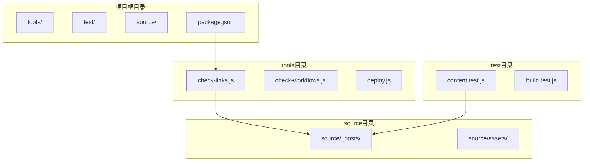
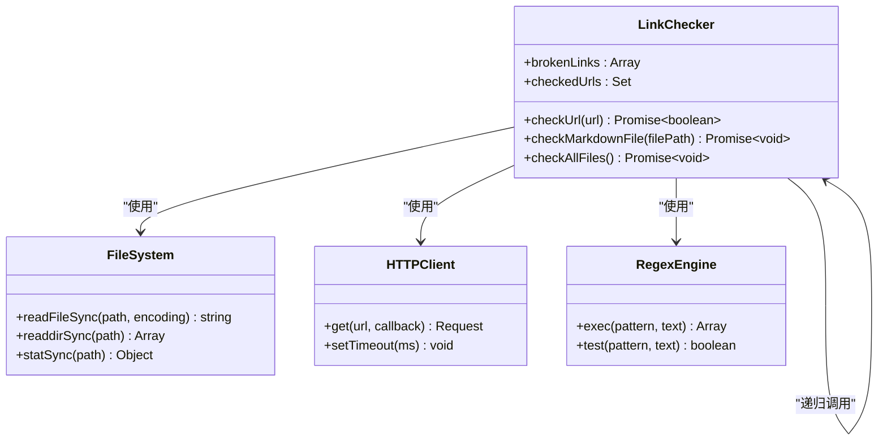
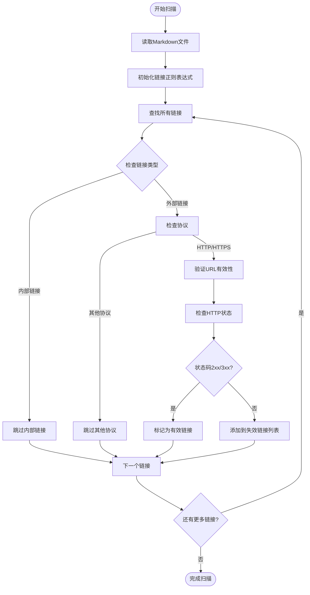
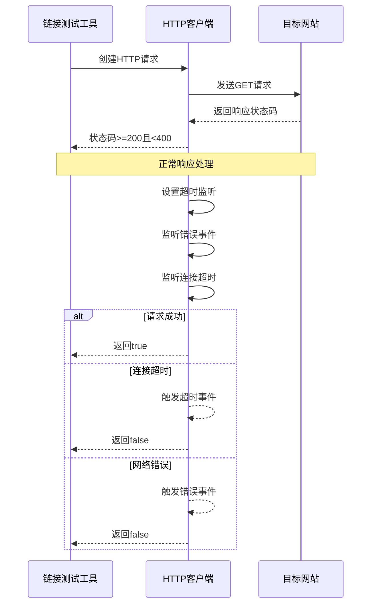
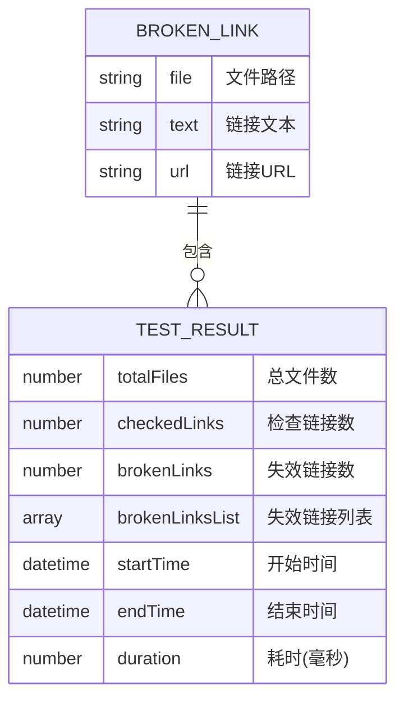
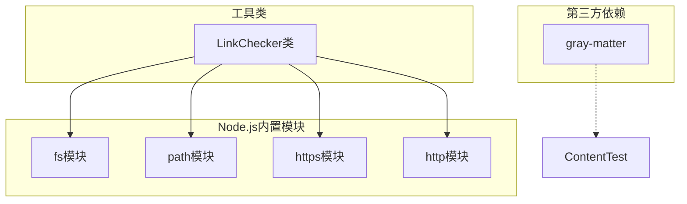

# 链接测试工具API

<cite>
**本文档引用的文件**
- [check-links.js](file://tools/check-links.js)
- [package.json](file://package.json)
- [content.test.js](file://test/content.test.js)
- [_config.yml](file://_config.yml)
</cite>

## 目录
1. [简介](#简介)
2. [项目结构](#项目结构)
3. [核心组件](#核心组件)
4. [架构概览](#架构概览)
5. [详细组件分析](#详细组件分析)
6. [依赖关系分析](#依赖关系分析)
7. [性能考虑](#性能考虑)
8. [故障排除指南](#故障排除指南)
9. [结论](#结论)

## 简介

H1S97X博客的链接测试工具是一个专门用于验证博客文章中外部链接有效性的自动化工具。该工具基于Node.js开发，采用异步HTTP/HTTPS请求来检查链接状态，能够识别失效链接并提供详细的错误报告。

该工具的主要特点包括：
- 自动扫描所有Markdown文章中的外部链接
- 支持HTTP和HTTPS协议
- 具备超时处理机制
- 提供详细的链接状态报告
- 可集成到CI/CD流程中

## 项目结构

链接测试工具位于项目的`tools`目录下，与主应用代码分离，便于独立维护和测试。

**图表来源**
- [check-links.js](file://tools/check-links.js#L1-L133)
- [package.json](file://package.json#L1-L94)

**章节来源**
- [check-links.js](file://tools/check-links.js#L1-L133)
- [package.json](file://package.json#L1-L94)

## 核心组件

### LinkChecker类

LinkChecker是链接测试工具的核心类，负责执行所有链接验证操作。该类包含以下主要方法：

- `constructor()`: 初始化链接检查器，创建空的失效链接数组和已检查URL集合
- `checkUrl(url)`: 异步检查单个URL的有效性
- `checkMarkdownFile(filePath)`: 检查指定Markdown文件中的所有外部链接
- `checkAllFiles()`: 检查所有博客文章中的链接

### 配置选项

工具提供了以下配置选项：

- **超时设置**: 默认5000毫秒（5秒）连接超时
- **重试机制**: 当前版本不包含内置重试逻辑
- **忽略规则**: 自动跳过锚点链接（以#开头）和相对路径链接（以./或../开头）

**章节来源**
- [check-links.js](file://tools/check-links.js#L8-L126)

## 架构概览

链接测试工具采用模块化设计，具有清晰的职责分离：

**图表来源**
- [check-links.js](file://tools/check-links.js#L8-L126)

## 详细组件分析

### 链接扫描算法

链接扫描算法采用正则表达式匹配Markdown格式的链接：

**图表来源**
- [check-links.js](file://tools/check-links.js#L48-L76)

### HTTP状态检查机制

HTTP状态检查采用异步请求方式，具备完善的错误处理：

**图表来源**
- [check-links.js](file://tools/check-links.js#L14-L46)

### 链接测试配置选项

| 配置项 | 默认值 | 描述 | 类型 |
|--------|--------|------|------|
| 超时时间 | 5000毫秒 | HTTP请求超时限制 | Number |
| 协议支持 | HTTP/HTTPS | 支持的协议类型 | String[] |
| 忽略规则 | #锚点, ./相对路径, ../相对路径 | 自动跳过的链接类型 | RegExp[] |
| 并发处理 | 串行处理 | 请求发送方式 | String |

**章节来源**
- [check-links.js](file://tools/check-links.js#L14-L46)

### 测试结果数据格式

链接测试工具返回结构化的失效链接信息：

**图表来源**
- [check-links.js](file://tools/check-links.js#L68-L74)

**章节来源**
- [check-links.js](file://tools/check-links.js#L68-L125)

### 错误分类和修复建议

| 错误类型 | 状态码范围 | 可能原因 | 修复建议 |
|----------|------------|----------|----------|
| 404错误 | 404 | 页面不存在或URL错误 | 检查链接拼写，更新到正确URL |
| 403错误 | 403 | 访问被拒绝 | 联系网站管理员，检查权限 |
| 401错误 | 401 | 需要认证 | 添加必要的认证信息 |
| 5xx服务器错误 | 500-599 | 服务器故障 | 稍后重试，检查服务器状态 |
| 超时错误 | - | 网络连接问题 | 检查网络连接，增加超时时间 |
| DNS解析错误 | - | 域名解析失败 | 检查域名拼写，确认DNS配置 |

**章节来源**
- [check-links.js](file://tools/check-links.js#L28-L44)

## 依赖关系分析

链接测试工具的依赖关系相对简单，主要依赖Node.js内置模块：

**图表来源**
- [check-links.js](file://tools/check-links.js#L3-L6)
- [content.test.js](file://test/content.test.js#L3-L4)

**章节来源**
- [check-links.js](file://tools/check-links.js#L3-L6)
- [content.test.js](file://test/content.test.js#L3-L4)

## 性能考虑

### 并发处理策略

当前版本采用串行处理方式，避免对目标服务器造成过大压力：

- **优点**: 降低服务器负载，减少被封禁风险
- **缺点**: 处理速度较慢，大型博客可能需要较长时间

### 优化建议

1. **并发控制**: 实现可配置的并发数量限制
2. **缓存机制**: 缓存已检查的URL结果
3. **智能重试**: 实现指数退避重试策略
4. **进度报告**: 提供实时处理进度显示

## 故障排除指南

### 常见问题及解决方案

| 问题描述 | 可能原因 | 解决方案 |
|----------|----------|----------|
| 链接测试卡住 | 网络连接问题 | 检查网络连接，增加超时时间 |
| 大量超时错误 | 目标服务器响应慢 | 减少并发数，增加超时时间 |
| 权限不足 | 无访问权限 | 检查文件权限，使用管理员账户 |
| 正则表达式匹配失败 | Markdown格式变化 | 更新正则表达式模式 |
| 内存使用过高 | 大量文件同时处理 | 实现分批处理机制 |

### 调试方法

1. **启用详细日志**: 在开发环境中添加更多调试信息
2. **分步测试**: 将测试范围缩小到特定文件
3. **网络诊断**: 使用浏览器开发者工具检查网络请求
4. **服务器状态检查**: 验证目标服务器可用性

**章节来源**
- [check-links.js](file://tools/check-links.js#L28-L44)

## 结论

H1S97X博客的链接测试工具是一个功能完善、易于使用的自动化链接验证工具。其设计简洁明了，能够有效识别失效链接并提供详细的错误报告。

### 主要优势

- **简单易用**: 仅需一个命令即可执行完整的链接检查
- **准确性高**: 使用正则表达式精确匹配Markdown链接格式
- **错误处理完善**: 具备全面的异常处理和超时机制
- **可扩展性强**: 模块化设计便于功能扩展

### 改进建议

1. **增强配置选项**: 添加更多自定义配置参数
2. **提升性能**: 实现并发处理和缓存机制
3. **丰富报告格式**: 支持多种输出格式（JSON、XML等）
4. **集成CI/CD**: 更好地集成到持续集成流程中

该工具为维护博客内容质量提供了重要保障，建议在日常维护和发布流程中定期使用。