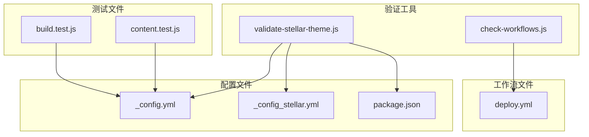
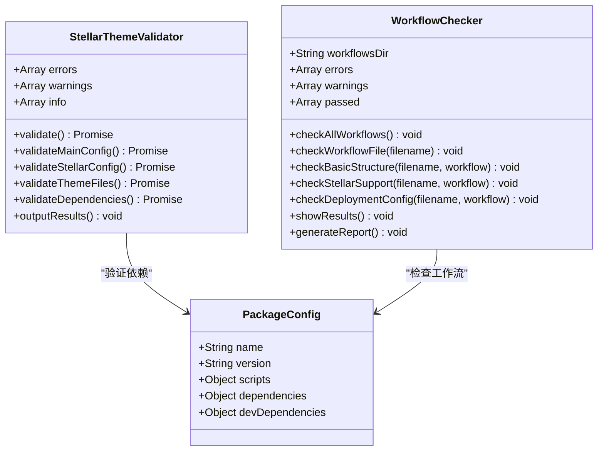
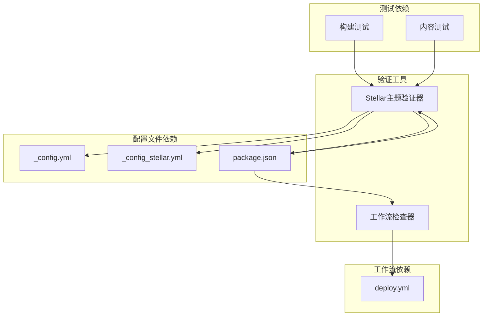

# 验证工具API

<cite>
**本文档引用的文件**
- [validate-stellar-theme.js](file://tools/validate-stellar-theme.js)
- [check-workflows.js](file://tools/check-workflows.js)
- [package.json](file://package.json)
- [_config.yml](file://_config.yml)
- [_config_stellar.yml](file://_config_stellar.yml)
- [deploy.yml](file://.github/workflows/deploy.yml)
- [WORKFLOW.md](file://docs/WORKFLOW.md)
- [STELLAR_DEPLOYMENT_GUIDE.md](file://docs/STELLAR_DEPLOYMENT_GUIDE.md)
- [build.test.js](file://test/build.test.js)
- [content.test.js](file://test/content.test.js)
</cite>

## 目录
1. [简介](#简介)
2. [项目结构](#项目结构)
3. [核心组件](#核心组件)
4. [架构概览](#架构概览)
5. [详细组件分析](#详细组件分析)
6. [依赖关系分析](#依赖关系分析)
7. [性能考虑](#性能考虑)
8. [故障排除指南](#故障排除指南)
9. [结论](#结论)
10. [附录](#附录)

## 简介

本文档为H1S97X博客的验证工具提供了完整的API参考文档。该工具集包含两个主要组件：Stellar主题配置验证工具和GitHub Actions工作流检查工具。这些工具旨在确保博客项目的配置正确性、主题完整性以及CI/CD流程的有效性。

验证工具的主要目标：
- 验证Stellar主题配置文件的完整性和正确性
- 检查GitHub Actions工作流的配置和执行状态
- 提供详细的错误报告和修复建议
- 支持自动化质量检查和持续集成流程

## 项目结构

项目采用模块化的组织结构，验证工具位于`tools/`目录下，每个工具都是独立的Node.js脚本。



**图表来源**
- [validate-stellar-theme.js](file://tools/validate-stellar-theme.js#L1-L313)
- [check-workflows.js](file://tools/check-workflows.js#L1-L315)
- [deploy.yml](file://.github/workflows/deploy.yml#L1-L87)

**章节来源**
- [validate-stellar-theme.js](file://tools/validate-stellar-theme.js#L1-L313)
- [check-workflows.js](file://tools/check-workflows.js#L1-L315)

## 核心组件

### Stellar主题验证工具

Stellar主题验证工具是一个专门用于验证Hexo博客Stellar主题配置完整性的Node.js类。该工具提供了全面的配置检查功能，包括主配置文件验证、主题配置验证、文件完整性检查和依赖包验证。

### GitHub Actions工作流检查工具

工作流检查工具负责验证所有GitHub Actions工作流文件的配置正确性。该工具能够检查工作流的基本结构、Stellar主题支持、子模块配置、部署配置等关键要素。

**章节来源**
- [validate-stellar-theme.js](file://tools/validate-stellar-theme.js#L12-L297)
- [check-workflows.js](file://tools/check-workflows.js#L12-L280)

## 架构概览

验证工具采用模块化设计，每个工具都是独立的类，具有清晰的职责分离和良好的扩展性。



**图表来源**
- [validate-stellar-theme.js](file://tools/validate-stellar-theme.js#L12-L297)
- [check-workflows.js](file://tools/check-workflows.js#L12-L280)

## 详细组件分析

### Stellar主题验证工具API

#### 类定义和构造函数

Stellar主题验证工具的核心类`StellarThemeValidator`提供了完整的主题配置验证功能。

**方法签名**
```javascript
constructor()
```

构造函数初始化验证器的状态，包括错误数组、警告数组和信息数组。

#### 主要验证方法

##### validate() 方法

执行完整的主题验证流程，包括所有验证步骤的顺序执行。

**方法签名**
```javascript
async validate(): Promise<void>
```

验证流程包括：
1. 验证主配置文件
2. 验证Stellar主题配置文件
3. 验证主题文件存在性
4. 验证依赖包
5. 输出验证结果

##### validateMainConfig() 方法

验证主配置文件`_config.yml`的正确性。

**方法签名**
```javascript
async validateMainConfig(): Promise<void>
```

验证内容包括：
- 主题设置检查（必须为'steallar'）
- 基本配置字段验证（title、author、language、url）
- 搜索功能配置检查
- 配置文件语法验证

##### validateStellarConfig() 方法

验证Stellar主题专用配置文件`_config_stellar.yml`。

**方法签名**
```javascript
async validateStellarConfig(): Promise<void>
```

验证内容包括：
- 基本信息验证（版本、标题等）
- 导航菜单配置检查
- 站点结构配置验证
- 搜索服务配置
- 评论系统配置
- 插件启用状态检查

##### validateThemeFiles() 方法

检查Stellar主题文件的完整性。

**方法签名**
```javascript
async validateThemeFiles(): Promise<void>
```

检查的关键文件：
- `package.json` - 主题包信息
- `layout/index.ejs` - 主布局文件
- `source/css/main.styl` - 主样式文件
- `source/js/main.js` - 主JavaScript文件

##### validateDependencies() 方法

验证项目依赖包的正确性。

**方法签名**
```javascript
async validateDependencies(): Promise<void>
```

验证的依赖包：
- Hexo核心依赖
- 推荐的搜索功能依赖
- RSS订阅依赖
- 站点地图依赖
- Mermaid图表依赖

#### 输出和报告

##### outputResults() 方法

格式化输出验证结果。

**方法签名**
```javascript
outputResults(): void
```

输出格式：
- 错误信息（红色）
- 警告信息（黄色）
- 信息提示（蓝色）
- 总结统计

**章节来源**
- [validate-stellar-theme.js](file://tools/validate-stellar-theme.js#L12-L297)

### GitHub Actions工作流检查工具API

#### 类定义和构造函数

工作流检查工具的核心类`WorkflowChecker`提供了全面的工作流验证功能。

**方法签名**
```javascript
constructor()
```

构造函数初始化工作流检查器的状态，包括工作流目录路径、错误数组、警告数组和通过数组。

#### 主要检查方法

##### checkAllWorkflows() 方法

检查所有工作流文件的配置正确性。

**方法签名**
```javascript
checkAllWorkflows(): void
```

检查流程：
1. 检查工作流目录是否存在
2. 读取所有YAML文件
3. 对每个工作流文件执行验证
4. 输出总体检查结果

##### checkWorkflowFile() 方法

检查单个工作流文件的配置。

**方法签名**
```javascript
checkWorkflowFile(filename: string): void
```

检查内容：
- 基础结构验证（name、on、jobs）
- Stellar主题支持检查
- 部署配置验证

##### checkBasicStructure() 方法

验证工作流的基础结构。

**方法签名**
```javascript
checkBasicStructure(filename: string, workflow: object): void
```

验证的必需字段：
- `name` - 工作流名称
- `on` - 触发条件
- `jobs` - 作业定义

##### checkStellarSupport() 方法

检查Stellar主题支持配置。

**方法签名**
```javascript
checkStellarSupport(filename: string, workflow: object): void
```

检查的Stellar特定配置：
- Git子模块支持
- 主题初始化步骤
- Stellar配置验证步骤

##### checkDeploymentConfig() 方法

验证部署配置。

**方法签名**
```javascript
checkDeploymentConfig(filename: string, workflow: object): void
```

验证的部署配置：
- GitHub Pages部署
- 构建步骤验证
- 发布目录配置

#### 报告生成功能

##### generateReport() 方法

生成详细的工作流状态报告。

**方法签名**
```javascript
generateReport(): void
```

报告内容：
- 时间戳
- 总体统计
- 详细检查项
- 优化建议

**章节来源**
- [check-workflows.js](file://tools/check-workflows.js#L12-L280)

## 依赖关系分析

验证工具之间的依赖关系和相互作用如下：



**图表来源**
- [validate-stellar-theme.js](file://tools/validate-stellar-theme.js#L8-L10)
- [check-workflows.js](file://tools/check-workflows.js#L8-L10)
- [package.json](file://package.json#L45-L77)

**章节来源**
- [package.json](file://package.json#L45-L77)

## 性能考虑

验证工具在设计时充分考虑了性能优化：

### 验证工具性能优化

1. **异步操作**：所有文件读取和配置检查都使用异步操作，避免阻塞主线程
2. **错误处理**：完善的错误处理机制，快速失败和优雅降级
3. **内存管理**：及时释放文件内容和中间结果
4. **并发处理**：支持并行执行多个验证任务

### 工作流检查性能优化

1. **文件系统缓存**：避免重复读取相同的文件内容
2. **早期退出**：发现严重错误时立即停止进一步检查
3. **增量检查**：只检查发生变化的文件
4. **进度报告**：提供实时的检查进度反馈

## 故障排除指南

### 常见问题和解决方案

#### 主题配置问题

**问题1：主题设置错误**
- 症状：`主题设置错误: 期望 'stellar', 实际 '其他主题'`
- 解决方案：在`_config.yml`中将`theme`设置为`'stellar'`

**问题2：配置文件缺失**
- 症状：`主配置文件 _config.yml 不存在`
- 解决方案：确保`_config.yml`和`_config_stellar.yml`文件存在

**问题3：主题文件缺失**
- 症状：`主题文件缺失: package.json`
- 解决方案：初始化Git子模块：`git submodule update --init --recursive`

#### 工作流配置问题

**问题1：工作流目录不存在**
- 症状：`GitHub Actions工作流目录不存在`
- 解决方案：检查`.github/workflows/`目录结构

**问题2：子模块支持缺失**
- 症状：`未启用Git子模块支持`
- 解决方案：在工作流中添加`submodules: true`

**问题3：部署配置错误**
- 症状：`GitHub Pages部署目录可能不正确`
- 解决方案：确保`publish_dir: ./public`

#### 依赖包问题

**问题1：Hexo依赖缺失**
- 症状：`Hexo依赖未找到`
- 解决方案：运行`npm install`安装依赖

**问题2：推荐依赖未安装**
- 症状：`可选依赖 hexo-generator-searchdb 未安装`
- 解决方案：安装推荐的依赖包

**章节来源**
- [STELLAR_DEPLOYMENT_GUIDE.md](file://docs/STELLAR_DEPLOYMENT_GUIDE.md#L127-L256)

## 结论

H1S97X博客的验证工具提供了一套完整的质量保证解决方案。通过Stellar主题验证工具和GitHub Actions工作流检查工具，开发者可以确保：

1. **配置完整性**：所有必要的配置文件和设置都已正确配置
2. **主题一致性**：Stellar主题的所有要求都得到满足
3. **CI/CD可靠性**：GitHub Actions工作流配置正确无误
4. **自动化质量**：持续集成流程中的质量检查自动化

这些工具不仅提高了开发效率，还确保了博客项目的稳定性和可靠性。建议在每次代码变更时运行这些验证工具，以确保项目的质量标准得到持续维护。

## 附录

### API调用示例

#### 基本使用

```bash
# 运行Stellar主题验证
npm run stellar:validate

# 检查工作流配置
npm run workflows:check

# 生成工作流报告
npm run workflows:report
```

#### 高级使用

```bash
# 预览部署过程
npm run deploy:preview

# 执行完整测试
npm run stellar:test

# 检查主题状态
npm run themes:status
```

### 集成指南

#### 在CI/CD中集成

1. **GitHub Actions集成**：在`.github/workflows/`目录中添加工作流文件
2. **本地集成**：通过npm脚本集成到开发流程中
3. **手动集成**：直接运行验证工具进行检查

#### 自定义配置

1. **验证规则定制**：根据项目需求修改验证规则
2. **报告格式定制**：调整输出格式和报告内容
3. **错误处理定制**：配置不同的错误处理策略

**章节来源**
- [WORKFLOW.md](file://docs/WORKFLOW.md#L67-L163)
- [STELLAR_DEPLOYMENT_GUIDE.md](file://docs/STELLAR_DEPLOYMENT_GUIDE.md#L1-L256)