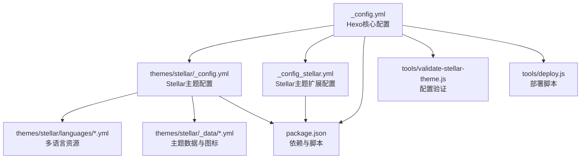
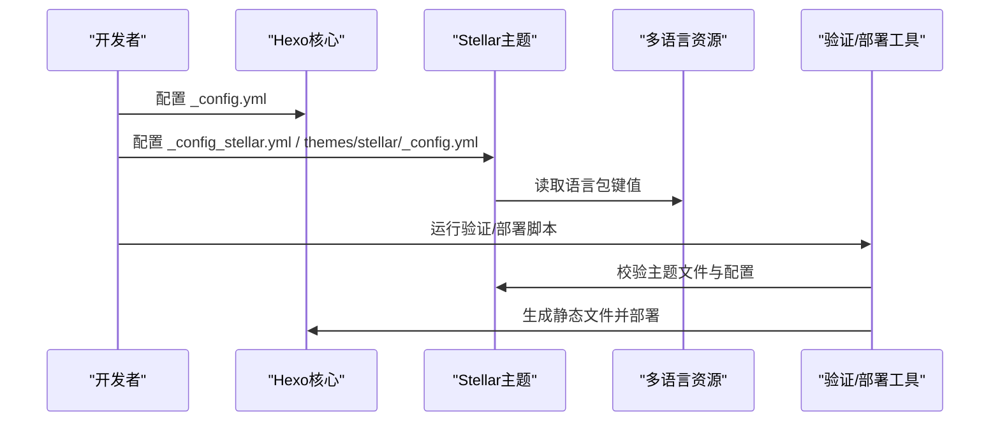
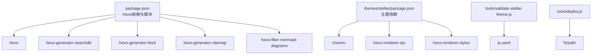

# 配置API

<cite>
**本文引用的文件**
- [_config.yml](file://_config.yml)
- [_config_stellar.yml](file://_config_stellar.yml)
- [themes/stellar/_config.yml](file://themes/stellar/_config.yml)
- [themes/stellar/languages/zh-CN.yml](file://themes/stellar/languages/zh-CN.yml)
- [themes/stellar/languages/en.yml](file://themes/stellar/languages/en.yml)
- [themes/stellar/_data/widgets.yml](file://themes/stellar/_data/widgets.yml)
- [themes/stellar/_data/icons.yml](file://themes/stellar/_data/icons.yml)
- [themes/stellar/package.json](file://themes/stellar/package.json)
- [package.json](file://package.json)
- [_config.staging.yml](file://_config.staging.yml)
- [tools/validate-stellar-theme.js](file://tools/validate-stellar-theme.js)
- [tools/deploy.js](file://tools/deploy.js)
</cite>

## 目录
1. [简介](#简介)
2. [项目结构](#项目结构)
3. [核心组件](#核心组件)
4. [架构总览](#架构总览)
5. [详细组件分析](#详细组件分析)
6. [依赖关系分析](#依赖关系分析)
7. [性能考虑](#性能考虑)
8. [故障排查指南](#故障排查指南)
9. [结论](#结论)
10. [附录](#附录)

## 简介
本文件为 H1S97X 博客的配置API完整参考文档，涵盖 Hexo 核心配置、Stellar 主题配置、多语言本地化接口、配置验证规则与默认值说明，并提供常见配置场景的最佳实践与完整示例路径，帮助开发者正确配置站点的站点信息、URL、部署、国际化与主题样式。

## 项目结构
本项目采用 Hexo + Stellar 主题的典型结构，核心配置位于根目录的 _config.yml 与 _config_stellar.yml，主题配置位于 themes/stellar/_config.yml，多语言资源位于 themes/stellar/languages，主题数据与图标位于 _data 目录，部署与验证工具位于 tools 目录。

**图表来源**
- [_config.yml](file://_config.yml#L1-L136)
- [themes/stellar/_config.yml](file://themes/stellar/_config.yml#L1-L725)
- [_config_stellar.yml](file://_config_stellar.yml#L1-L699)
- [themes/stellar/languages/zh-CN.yml](file://themes/stellar/languages/zh-CN.yml#L1-L71)
- [themes/stellar/languages/en.yml](file://themes/stellar/languages/en.yml#L1-L71)
- [themes/stellar/_data/widgets.yml](file://themes/stellar/_data/widgets.yml#L1-L85)
- [themes/stellar/_data/icons.yml](file://themes/stellar/_data/icons.yml#L1-L59)
- [package.json](file://package.json#L1-L94)
- [tools/validate-stellar-theme.js](file://tools/validate-stellar-theme.js#L1-L313)
- [tools/deploy.js](file://tools/deploy.js#L1-L472)

**章节来源**
- [_config.yml](file://_config.yml#L1-L136)
- [_config_stellar.yml](file://_config_stellar.yml#L1-L699)
- [themes/stellar/_config.yml](file://themes/stellar/_config.yml#L1-L725)
- [themes/stellar/languages/zh-CN.yml](file://themes/stellar/languages/zh-CN.yml#L1-L71)
- [themes/stellar/languages/en.yml](file://themes/stellar/languages/en.yml#L1-L71)
- [themes/stellar/_data/widgets.yml](file://themes/stellar/_data/widgets.yml#L1-L85)
- [themes/stellar/_data/icons.yml](file://themes/stellar/_data/icons.yml#L1-L59)
- [package.json](file://package.json#L1-L94)
- [tools/validate-stellar-theme.js](file://tools/validate-stellar-theme.js#L1-L313)
- [tools/deploy.js](file://tools/deploy.js#L1-L472)

## 核心组件
- Hexo 核心配置（站点信息、URL、目录、写作、分页、RSS、部署）
- Stellar 主题配置（侧边栏、主结构树、笔记本与文章、评论、插件、样式、默认资源、API主机）
- 多语言本地化（中英语言包键值）
- 配置验证与部署工具（验证Stellar配置、自动部署到gh-pages）

**章节来源**
- [_config.yml](file://_config.yml#L5-L136)
- [_config_stellar.yml](file://_config_stellar.yml#L1-L699)
- [themes/stellar/_config.yml](file://themes/stellar/_config.yml#L1-L725)
- [themes/stellar/languages/zh-CN.yml](file://themes/stellar/languages/zh-CN.yml#L1-L71)
- [themes/stellar/languages/en.yml](file://themes/stellar/languages/en.yml#L1-L71)
- [tools/validate-stellar-theme.js](file://tools/validate-stellar-theme.js#L1-L313)
- [tools/deploy.js](file://tools/deploy.js#L1-L472)

## 架构总览
Hexo 核心配置驱动站点生成，Stellar 主题配置决定页面结构与样式，多语言资源提供界面文案，工具链负责验证与部署。

**图表来源**
- [_config.yml](file://_config.yml#L1-L136)
- [_config_stellar.yml](file://_config_stellar.yml#L1-L699)
- [themes/stellar/_config.yml](file://themes/stellar/_config.yml#L1-L725)
- [themes/stellar/languages/zh-CN.yml](file://themes/stellar/languages/zh-CN.yml#L1-L71)
- [themes/stellar/languages/en.yml](file://themes/stellar/languages/en.yml#L1-L71)
- [tools/validate-stellar-theme.js](file://tools/validate-stellar-theme.js#L1-L313)
- [tools/deploy.js](file://tools/deploy.js#L1-L472)

## 详细组件分析

### Hexo 核心配置 API
- 站点信息
  - title、subtitle、description、keywords、author、avatar、favicon
  - language（多语言）、timezone
- URL 与链接
  - url、permalink、permalink_defaults、pretty_urls（trailing_index、trailing_html）
- 目录与渲染
  - source_dir、public_dir、tag_dir、archive_dir、category_dir、code_dir、i18n_dir、skip_render
- 写作与高亮
  - new_post_name、default_layout、titlecase、filename_case、render_drafts、post_asset_folder、relative_link、future
  - highlight（enable、line_number、auto_detect、tab_replace、wrap、hljs）、prismjs（enable、preprocess、line_number、tab_replace）
- 首页与分页
  - index_generator（path、per_page、order_by）
  - per_page、pagination_dir
- 分类与标签
  - default_category、category_map、tag_map
- 元数据与时间格式
  - meta_generator、date_format、time_format、updated_option（mtime/date/empty）
- 包含/排除与扩展
  - include、exclude、ignore
  - theme、aplayer（meting、asset_inject）、search（path、field、format、limit）
  - feed（enable、type、path、limit、hub、content、content_limit、content_limit_delim、order_by、icon、autodiscovery）
- 部署
  - deploy（type、repo、branch）

配置验证要点
- 必填项：theme 应为 'stellar'
- 建议项：title、author、language、url、search.path
- 搜索与RSS：建议启用 search 与 feed

**章节来源**
- [_config.yml](file://_config.yml#L5-L136)
- [tools/validate-stellar-theme.js](file://tools/validate-stellar-theme.js#L50-L89)

### Stellar 主题配置 API
- 基本信息与SEO
  - stellar（version、homepage、repo、main_css、main_js）
  - canonical（closeEnable、closeText、originalHost、officialHosts）
  - open_graph（enable、twitter_id）、structured_data（links）
- 侧边栏与导航
  - logo（avatar、title、subtitle）
  - menubar（columns、items[id、theme、icon、title、url]）
- 主结构树 site_tree
  - home、index_blog、index_topic、index_wiki、post、topic、wiki、notebooks、notes、note、author、error_page、page
  - 每类页面可配置 leftbar、rightbar、nav_tabs、base_dir、menu_id 等
- 笔记本与文章
  - notebook（auto_excerpt、tagcons、per_page、order_by、license、share）
  - article（type、indent、cover_ratio、banner_ratio、auto_banner、auto_excerpt、category_color、license、share、related_posts）
- 搜索与评论
  - search（service、local_search、algolia_search）
  - comments（service、comment_title、lazyload、custom_css、beaudar、utterances、giscus、twikoo、waline、artalk）
- 页脚与社交
  - footer（social、sitemap、content）
- 标签插件与内置服务
  - tag_plugins（note、checkbox、quot、emoji、icon、button、image、copy、timeline、mark、hashtag、okr、gallery、chat）
  - data_services（mdrender、siteinfo、ghinfo、rating、vote、sites、friends、friends_and_posts、timeline、fcircle、weibo、memos、voice、video、download-file、twikoo_latest_comment、waline_latest_comment、artalk_latest_comment、giscus_latest_comment、contributors）
- 插件系统
  - plugins（preload、fancybox、swiper、scrollreveal、tianli_gpt、katex、mathjax、mermaid、copycode、heti）
- 样式与主题
  - style（prefers_theme、smooth_scroll、font-size、font-family、text-align、prefix、border-radius、color、animated_avatar、codeblock、loading、gradient、leftbar、paginator、error_page、site、header_prefix）
  - default（avatar、link、cover、image、project、banner、loading、image_onerror）
  - api_host（ghapi、ghraw、gist、ghcard）
- 系统行为
  - system（override_pretty_urls）

配置验证要点
- menubar.items 至少包含常用页面标识（如 post、categories、tags、archives）
- site_tree 建议配置 home、index_blog、post 等核心页面
- search.service 与 comments.service 建议明确配置
- plugins 中启用的插件需确保外部资源可用

**章节来源**
- [themes/stellar/_config.yml](file://themes/stellar/_config.yml#L1-L725)
- [_config_stellar.yml](file://_config_stellar.yml#L1-L699)
- [tools/validate-stellar-theme.js](file://tools/validate-stellar-theme.js#L94-L173)

### 多语言配置 API
- 语言包结构
  - zh-CN.yml、en.yml
  - 键空间：btn、meta、page、search、message、symbol
- 翻译键值
  - 导航按钮、元信息、分页、搜索、消息提示、标点符号等
- 本地化规则
  - language 字段在 Hexo 核心配置中定义（如 zh-CN、en）
  - Stellar 主题通过语言包键值渲染界面文案

**章节来源**
- [_config.yml](file://_config.yml#L13-L15)
- [themes/stellar/languages/zh-CN.yml](file://themes/stellar/languages/zh-CN.yml#L1-L71)
- [themes/stellar/languages/en.yml](file://themes/stellar/languages/en.yml#L1-L71)

### 配置验证与默认值
- 验证工具
  - validate-stellar-theme.js：校验主配置、Stellar配置、主题文件、依赖包，输出错误/警告/信息
- 默认值与建议
  - Hexo：highlight.enable=true、prismjs.enable=false、per_page=10、feed.enable=true、deploy.type=git
  - Stellar：menubar.columns=4、site_tree 多页面默认值、style.prefers_theme=auto、plugins 多数 enable=false 或未启用
  - 建议：配置 search、comments、sitemap、feed 等增强体验

**章节来源**
- [tools/validate-stellar-theme.js](file://tools/validate-stellar-theme.js#L1-L313)
- [_config.yml](file://_config.yml#L50-L136)
- [_config_stellar.yml](file://_config_stellar.yml#L1-L699)
- [themes/stellar/_config.yml](file://themes/stellar/_config.yml#L1-L725)

### 配置示例与最佳实践
- 示例路径
  - 站点信息与URL：[_config.yml](file://_config.yml#L5-L25)
  - RSS与搜索：[_config.yml](file://_config.yml#L108-L128)
  - Stellar侧边栏与导航：[_config_stellar.yml](file://_config_stellar.yml#L3-L32)
  - 主结构树与页面配置：[_config_stellar.yml](file://_config_stellar.yml#L36-L121)
  - 评论系统配置：[_config_stellar.yml](file://_config_stellar.yml#L192-L330)
  - 插件启用示例：[_config_stellar.yml](file://_config_stellar.yml#L504-L599)
  - 样式与主题：[_config_stellar.yml](file://_config_stellar.yml#L609-L698)
  - 多语言键值：[zh-CN.yml](file://themes/stellar/languages/zh-CN.yml#L1-L71)、[en.yml](file://themes/stellar/languages/en.yml#L1-L71)
- 最佳实践
  - 明确配置 menubar 与 site_tree 的关键页面
  - 启用 search 与 feed 并配置 path 与字段
  - 为 comments 选择稳定的服务并配置 data-* 属性
  - 合理设置 style 与 plugins，避免过度加载
  - 使用 validate-stellar-theme.js 与 deploy.js 确保一致性与可部署性

**章节来源**
- [_config.yml](file://_config.yml#L5-L136)
- [_config_stellar.yml](file://_config_stellar.yml#L1-L699)
- [themes/stellar/languages/zh-CN.yml](file://themes/stellar/languages/zh-CN.yml#L1-L71)
- [themes/stellar/languages/en.yml](file://themes/stellar/languages/en.yml#L1-L71)
- [tools/validate-stellar-theme.js](file://tools/validate-stellar-theme.js#L1-L313)
- [tools/deploy.js](file://tools/deploy.js#L1-L472)

## 依赖关系分析
- Hexo 与主题
  - Hexo 核心配置决定站点生成行为，Stellar 主题配置决定页面结构与样式
- 依赖包
  - package.json 中声明 hexo 版本与常用插件（如 hexo-generator-searchdb、hexo-generator-feed、hexo-generator-sitemap、hexo-filter-mermaid-diagrams）
  - themes/stellar/package.json 声明主题依赖（如 cheerio、hexo-renderer-ejs、hexo-renderer-stylus）
- 工具链
  - validate-stellar-theme.js 与 deploy.js 依赖 js-yaml、fs、path 等模块

**图表来源**
- [package.json](file://package.json#L45-L77)
- [themes/stellar/package.json](file://themes/stellar/package.json#L23-L32)
- [tools/validate-stellar-theme.js](file://tools/validate-stellar-theme.js#L8-L10)
- [tools/deploy.js](file://tools/deploy.js#L8-L10)

**章节来源**
- [package.json](file://package.json#L45-L77)
- [themes/stellar/package.json](file://themes/stellar/package.json#L23-L32)
- [tools/validate-stellar-theme.js](file://tools/validate-stellar-theme.js#L8-L10)
- [tools/deploy.js](file://tools/deploy.js#L8-L10)

## 性能考虑
- 合理设置 per_page 与分页，避免首页渲染压力过大
- 适度启用 plugins，避免过多外部资源加载
- 使用 style.smooth_scroll 与 plugins.scrollreveal 时注意长目录定位性能
- 搜索与RSS建议启用并合理配置字段与限制，提升用户体验

## 故障排查指南
- 配置验证失败
  - 使用 npm run stellar:validate 或 node tools/validate-stellar-theme.js 检查错误与警告
  - 关注主题文件存在性、依赖包安装状态、关键配置项是否缺失
- 部署失败
  - 使用 npm run deploy 或 node tools/deploy.js 执行部署
  - 检查 gh-pages 分支状态、远程仓库配置、构建产物 public 目录
- 常见问题
  - menubar 未配置导致导航缺失
  - search 未配置导致站内搜索不可用
  - comments 未配置或 data-* 属性错误导致评论加载失败
  - 样式与插件冲突导致页面空白（谨慎启用 scrollreveal）

**章节来源**
- [tools/validate-stellar-theme.js](file://tools/validate-stellar-theme.js#L262-L296)
- [tools/deploy.js](file://tools/deploy.js#L383-L418)

## 结论
通过本配置API参考文档，开发者可以系统性地理解 Hexo 核心配置与 Stellar 主题配置的结构与职责，结合多语言资源与工具链，实现稳定、可维护且具备良好用户体验的博客站点。建议在开发与部署流程中持续使用验证与部署脚本，确保配置一致性与可重复性。

## 附录
- 环境配置示例
  - Staging 环境配置：[_config.staging.yml](file://_config.staging.yml#L1-L33)
- 主题数据与图标
  - 侧边栏组件：[_data/widgets.yml](file://themes/stellar/_data/widgets.yml#L1-L85)
  - 图标资源：[_data/icons.yml](file://themes/stellar/_data/icons.yml#L1-L59)
- 脚本与工具
  - 验证：npm run stellar:validate
  - 部署：npm run deploy 或 node tools/deploy.js
  - 测试：npm run stellar:test

**章节来源**
- [_config.staging.yml](file://_config.staging.yml#L1-L33)
- [themes/stellar/_data/widgets.yml](file://themes/stellar/_data/widgets.yml#L1-L85)
- [themes/stellar/_data/icons.yml](file://themes/stellar/_data/icons.yml#L1-L59)
- [tools/deploy.js](file://tools/deploy.js#L1-L472)
- [tools/validate-stellar-theme.js](file://tools/validate-stellar-theme.js#L1-L313)