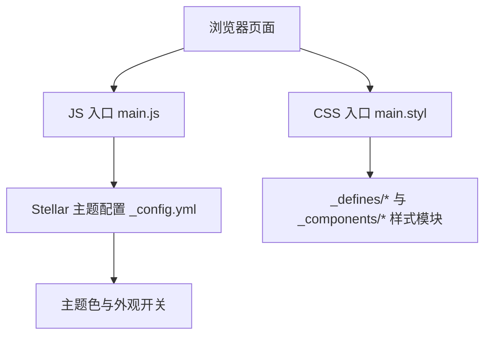
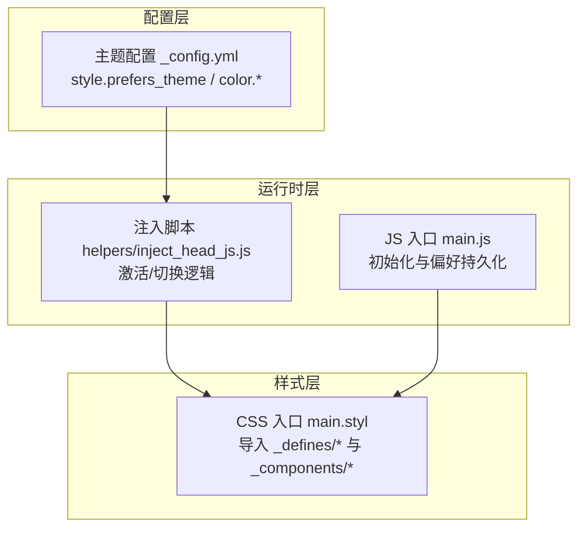
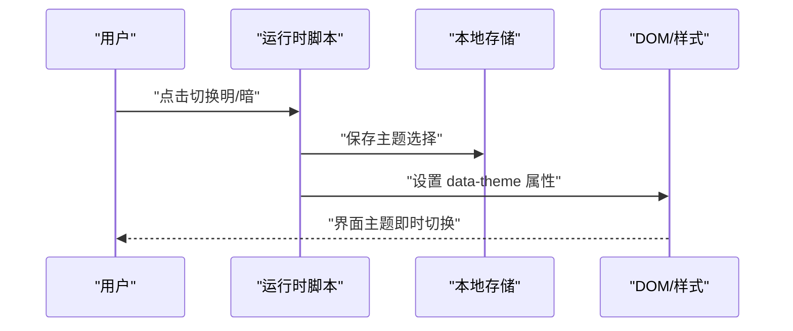
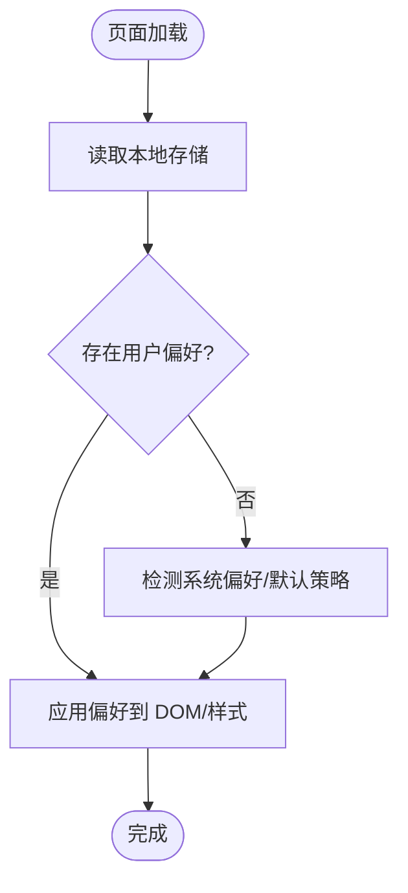
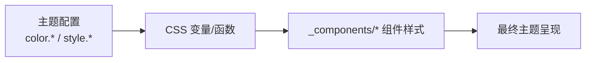
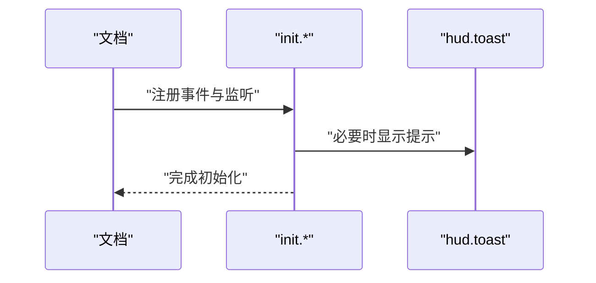
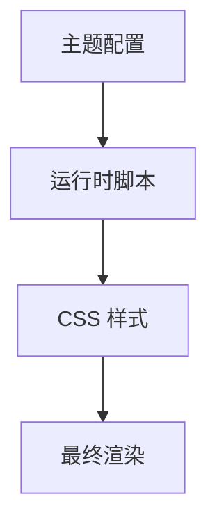

# 主题切换

<cite>
**本文引用的文件**
- [themes/stellar/_config.yml](file://themes/stellar/_config.yml)
- [themes/stellar/source/js/main.js](file://themes/stellar/source/js/main.js)
- [themes/stellar/source/css/main.styl](file://themes/stellar/source/css/main.styl)
- [themes/butterfly/scripts/helpers/inject_head_js.js](file://themes/butterfly/scripts/helpers/inject_head_js.js)
</cite>

## 目录
1. [简介](#简介)
2. [项目结构](#项目结构)
3. [核心组件](#核心组件)
4. [架构总览](#架构总览)
5. [组件详解](#组件详解)
6. [依赖关系分析](#依赖关系分析)
7. [性能考量](#性能考量)
8. [故障排查指南](#故障排查指南)
9. [结论](#结论)
10. [附录](#附录)

## 简介
本指南围绕 H1S97X 博客基于 Hexo 的 Stellar 主题所实现的主题切换功能展开，目标是帮助读者理解并正确配置与使用明暗模式、颜色主题切换与用户偏好持久化。文档将从实现原理、配置方法、开发实践、用户体验与兼容性等方面进行系统阐述，并提供可视化图示与实操建议。

## 项目结构
Stellar 主题的前端资源主要位于 themes/stellar/source 下，其中：
- JS 入口文件负责初始化与运行时行为（如 TOC、侧栏、Toast、canonical 校验等）
- CSS 入口文件负责样式组织与模块导入
- 主题配置文件提供主题色、字体、圆角、滚动等外观与行为开关

**图示来源**
- [themes/stellar/source/js/main.js](file://themes/stellar/source/js/main.js#L1-L295)
- [themes/stellar/source/css/main.styl](file://themes/stellar/source/css/main.styl#L1-L19)
- [themes/stellar/_config.yml](file://themes/stellar/_config.yml#L635-L725)

**章节来源**
- [themes/stellar/source/js/main.js](file://themes/stellar/source/js/main.js#L1-L295)
- [themes/stellar/source/css/main.styl](file://themes/stellar/source/css/main.styl#L1-L19)
- [themes/stellar/_config.yml](file://themes/stellar/_config.yml#L635-L725)

## 核心组件
- 明暗模式与主题色切换
  - 通过配置项控制“首选主题”策略（自动/浅色/深色）
  - 通过 CSS 变量与数据属性驱动主题切换
  - 通过本地存储持久化用户选择
- 用户偏好持久化
  - 使用 localStorage 存储主题选择与侧栏状态等
  - 提供跨会话恢复机制
- 运行时行为
  - 初始化 TOC、侧栏、相对时间、标签页、canonical 校验等

**章节来源**
- [themes/stellar/_config.yml](file://themes/stellar/_config.yml#L635-L725)
- [themes/stellar/source/js/main.js](file://themes/stellar/source/js/main.js#L77-L90)
- [themes/stellar/source/js/main.js](file://themes/stellar/source/js/main.js#L203-L285)

## 架构总览
Stellar 主题的主题切换由“配置层 → 运行时层 → 样式层”三层协作完成：
- 配置层：在主题配置中声明“首选主题”策略与主题色
- 运行时层：在 JS 中读取配置、注入切换逻辑、持久化用户选择
- 样式层：通过 CSS 变量与媒体查询实现明暗模式与颜色主题切换

**图示来源**
- [themes/stellar/_config.yml](file://themes/stellar/_config.yml#L635-L725)
- [themes/stellar/source/js/main.js](file://themes/stellar/source/js/main.js#L1-L295)
- [themes/butterfly/scripts/helpers/inject_head_js.js](file://themes/butterfly/scripts/helpers/inject_head_js.js#L1-L166)
- [themes/stellar/source/css/main.styl](file://themes/stellar/source/css/main.styl#L1-L19)

## 组件详解

### 明暗模式与主题色切换
- 配置入口
  - 在主题配置中设置首选主题策略与主题色，例如：
    - style.prefers_theme：auto / light / dark
    - color.theme / color.accent / color.link：HSL/HSLA/HEX 等
- 运行时注入
  - 通过注入脚本提供激活/切换函数与自动判断逻辑（参考 Butterfly 注入脚本的思路）
  - 读取本地存储的用户选择，优先于系统偏好
- 样式应用
  - 通过 CSS 变量与媒体查询实现明暗模式与颜色主题切换
  - 在样式模块中按需导入主题常量与组件样式

**图示来源**
- [themes/butterfly/scripts/helpers/inject_head_js.js](file://themes/butterfly/scripts/helpers/inject_head_js.js#L82-L140)
- [themes/stellar/_config.yml](file://themes/stellar/_config.yml#L635-L725)

**章节来源**
- [themes/stellar/_config.yml](file://themes/stellar/_config.yml#L635-L725)
- [themes/butterfly/scripts/helpers/inject_head_js.js](file://themes/butterfly/scripts/helpers/inject_head_js.js#L1-L166)

### 用户偏好持久化
- 本地存储键值
  - 主题选择：theme
  - 侧栏状态：aside-status
  - canonical 提示关闭状态：Stellar.canonical.closeEnable / closeTime
- 读取与恢复
  - 页面加载时读取本地存储，恢复用户偏好
  - 未设置时回退到系统偏好或默认策略

**图示来源**
- [themes/stellar/source/js/main.js](file://themes/stellar/source/js/main.js#L229-L257)
- [themes/stellar/source/js/main.js](file://themes/stellar/source/js/main.js#L77-L90)

**章节来源**
- [themes/stellar/source/js/main.js](file://themes/stellar/source/js/main.js#L77-L90)
- [themes/stellar/source/js/main.js](file://themes/stellar/source/js/main.js#L203-L285)

### 样式组织与主题变量
- CSS 入口
  - main.styl 导入常量、函数、通用组件与插件模块
- 主题变量
  - 在配置中集中定义主题色与外观参数
  - 在样式模块中通过变量与媒体查询实现响应式主题

**图示来源**
- [themes/stellar/source/css/main.styl](file://themes/stellar/source/css/main.styl#L1-L19)
- [themes/stellar/_config.yml](file://themes/stellar/_config.yml#L658-L668)

**章节来源**
- [themes/stellar/source/css/main.styl](file://themes/stellar/source/css/main.styl#L1-L19)
- [themes/stellar/_config.yml](file://themes/stellar/_config.yml#L658-L668)

### 运行时初始化与交互
- 初始化任务
  - TOC 高亮与滚动
  - 侧栏交互
  - 相对时间显示
  - 标签页切换
  - canonical 校验与提示
- 交互组件
  - Toast 提示
  - 侧栏显隐切换
  - 顶部回到顶部

**图示来源**
- [themes/stellar/source/js/main.js](file://themes/stellar/source/js/main.js#L97-L295)

**章节来源**
- [themes/stellar/source/js/main.js](file://themes/stellar/source/js/main.js#L97-L295)

## 依赖关系分析
- 配置依赖
  - 主题配置决定首选主题策略与主题色
- 运行时依赖
  - JS 初始化依赖 jQuery（在 init.* 中使用）
  - 本地存储用于偏好持久化
- 样式依赖
  - main.styl 导入主题常量与组件样式
  - 样式模块之间存在层次依赖（常量 → 函数 → 组件）

**图示来源**
- [themes/stellar/_config.yml](file://themes/stellar/_config.yml#L635-L725)
- [themes/stellar/source/js/main.js](file://themes/stellar/source/js/main.js#L97-L295)
- [themes/stellar/source/css/main.styl](file://themes/stellar/source/css/main.styl#L1-L19)

**章节来源**
- [themes/stellar/_config.yml](file://themes/stellar/_config.yml#L635-L725)
- [themes/stellar/source/js/main.js](file://themes/stellar/source/js/main.js#L97-L295)
- [themes/stellar/source/css/main.styl](file://themes/stellar/source/css/main.styl#L1-L19)

## 性能考量
- 交叉观察器懒加载
  - 在视口进入时再执行懒加载，降低首屏压力
- 平滑滚动
  - 在样式层开启平滑滚动，提升阅读体验
- 资源按需加载
  - 插件与服务按需加载，避免不必要的网络请求

**章节来源**
- [themes/stellar/source/js/main.js](file://themes/stellar/source/js/main.js#L62-L75)
- [themes/stellar/_config.yml](file://themes/stellar/_config.yml#L637-L637)

## 故障排查指南
- 明暗模式未生效
  - 检查首选主题策略与系统偏好是否冲突
  - 确认本地存储中是否存在主题键值
- 主题色不正确
  - 核对主题配置中的 color.* 设置
  - 确认样式模块已正确导入与编译
- canonical 提示频繁出现
  - 检查本地存储中关闭提示的键值
  - 确认源站校验接口可用性

**章节来源**
- [themes/stellar/source/js/main.js](file://themes/stellar/source/js/main.js#L229-L257)
- [themes/stellar/source/js/main.js](file://themes/stellar/source/js/main.js#L203-L285)

## 结论
Stellar 主题的主题切换功能通过“配置层 + 运行时层 + 样式层”的协同，实现了灵活的明暗模式与主题色切换，并结合本地存储实现用户偏好的持久化。遵循本文的配置与开发建议，可在保证兼容性的前提下，进一步优化用户体验与性能表现。

## 附录
- 配置要点
  - 首选主题策略：style.prefers_theme
  - 主题色：color.theme / color.accent / color.link
  - 字体与圆角：font-size / font-family / border-radius
- 开发建议
  - 使用 CSS 变量集中管理主题色
  - 在运行时脚本中统一注入切换逻辑
  - 通过 IntersectionObserver 优化懒加载
  - 在样式模块中按需导入组件，避免冗余