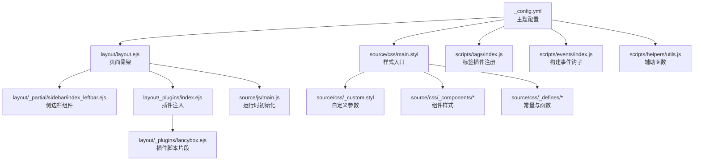
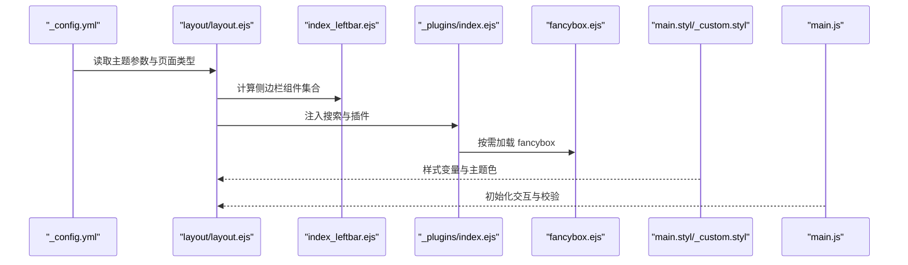
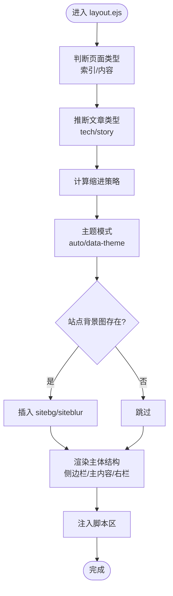
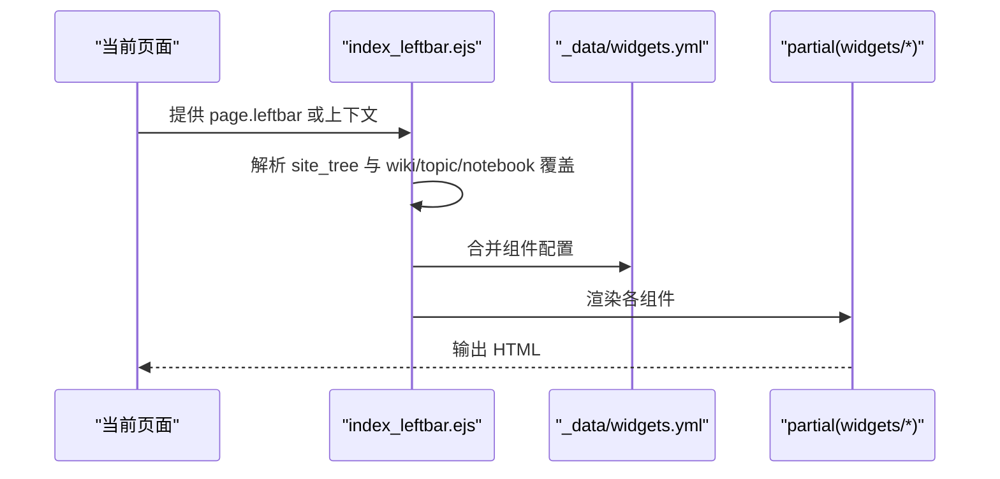
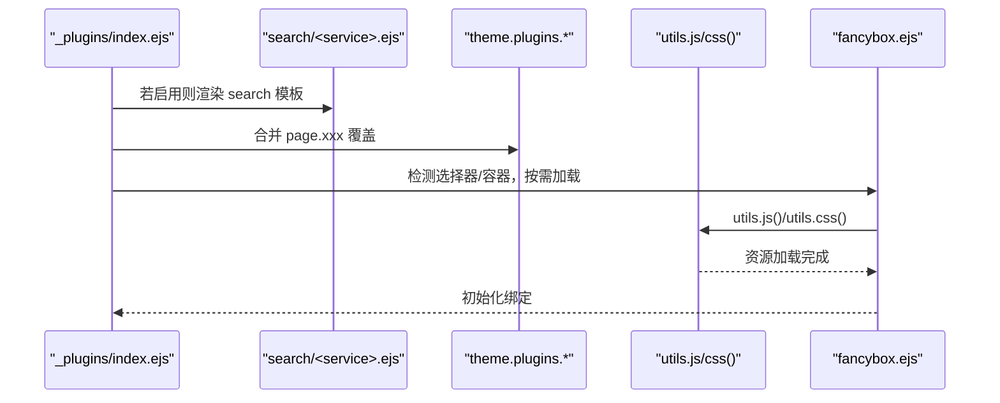
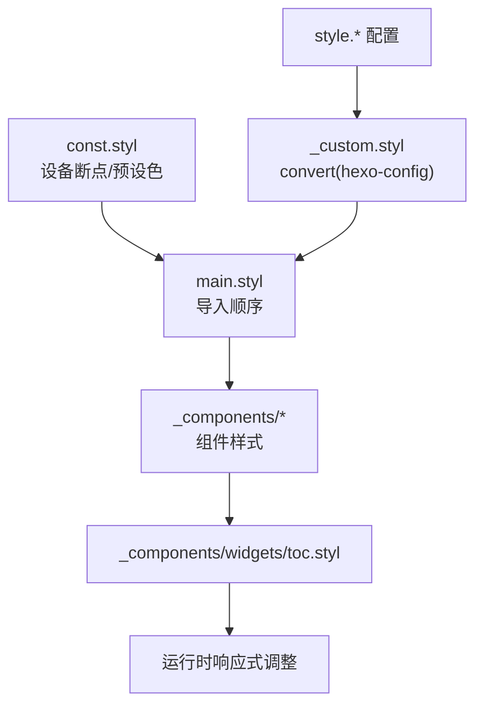
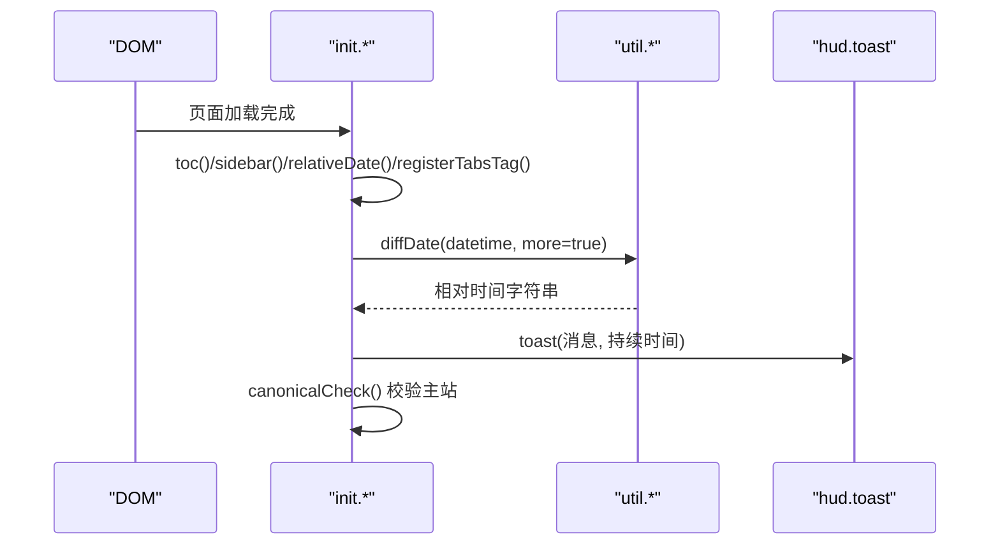
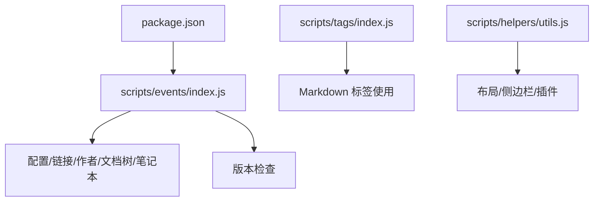

# 主题定制

<cite>
**本文引用的文件**
- [themes/stellar/_config.yml](file://themes/stellar/_config.yml)
- [themes/stellar/package.json](file://themes/stellar/package.json)
- [themes/stellar/layout/layout.ejs](file://themes/stellar/layout/layout.ejs)
- [themes/stellar/layout/_partial/sidebar/index_leftbar.ejs](file://themes/stellar/layout/_partial/sidebar/index_leftbar.ejs)
- [themes/stellar/layout/_plugins/index.ejs](file://themes/stellar/layout/_plugins/index.ejs)
- [themes/stellar/layout/_plugins/fancybox.ejs](file://themes/stellar/layout/_plugins/fancybox.ejs)
- [themes/stellar/_data/widgets.yml](file://themes/stellar/_data/widgets.yml)
- [themes/stellar/scripts/events/index.js](file://themes/stellar/scripts/events/index.js)
- [themes/stellar/scripts/helpers/utils.js](file://themes/stellar/scripts/helpers/utils.js)
- [themes/stellar/scripts/tags/index.js](file://themes/stellar/scripts/tags/index.js)
- [themes/stellar/source/css/main.styl](file://themes/stellar/source/css/main.styl)
- [themes/stellar/source/css/_custom.styl](file://themes/stellar/source/css/_custom.styl)
- [themes/stellar/source/css/_defines/const.styl](file://themes/stellar/source/css/_defines/const.styl)
- [themes/stellar/source/css/_components/widgets/toc.styl](file://themes/stellar/source/css/_components/widgets/toc.styl)
- [themes/stellar/source/js/main.js](file://themes/stellar/source/js/main.js)
</cite>

## 目录
1. [简介](#简介)
2. [项目结构](#项目结构)
3. [核心组件](#核心组件)
4. [架构总览](#架构总览)
5. [详细组件分析](#详细组件分析)
6. [依赖关系分析](#依赖关系分析)
7. [性能考量](#性能考量)
8. [故障排查指南](#故障排查指南)
9. [结论](#结论)
10. [附录](#附录)

## 简介
本指南面向希望对 H1S97X 博客中的 Stellar 主题进行深度定制的用户，围绕主题配置、外观与功能开关、第三方集成、CSS 样式系统、脚本扩展机制、主题切换与版本管理等方面提供系统化说明，并辅以可视化图示与实践建议，帮助你实现个性化视觉与功能增强。

## 项目结构
Stellar 主题位于 themes/stellar 目录，采用“主题配置 + EJS 布局 + Stylus 样式 + JS 脚本 + 标签插件”的分层组织方式：
- 配置层：_config.yml 提供主题参数与功能开关
- 布局层：layout/*.ejs 组织页面骨架、侧边栏、插件注入
- 样式层：source/css 下的 Stylus 文件，通过 main.styl 汇总导入
- 脚本层：source/js/main.js 与 scripts/ 下的事件与辅助函数
- 标签插件：scripts/tags/ 注册各类 Markdown 容器与组件标签

**图示来源**
- [themes/stellar/_config.yml](file://themes/stellar/_config.yml#L1-L725)
- [themes/stellar/layout/layout.ejs](file://themes/stellar/layout/layout.ejs#L1-L76)
- [themes/stellar/layout/_partial/sidebar/index_leftbar.ejs](file://themes/stellar/layout/_partial/sidebar/index_leftbar.ejs#L1-L167)
- [themes/stellar/layout/_plugins/index.ejs](file://themes/stellar/layout/_plugins/index.ejs#L1-L25)
- [themes/stellar/layout/_plugins/fancybox.ejs](file://themes/stellar/layout/_plugins/fancybox.ejs#L1-L37)
- [themes/stellar/source/css/main.styl](file://themes/stellar/source/css/main.styl#L1-L19)
- [themes/stellar/source/css/_custom.styl](file://themes/stellar/source/css/_custom.styl#L1-L105)
- [themes/stellar/scripts/tags/index.js](file://themes/stellar/scripts/tags/index.js#L1-L56)
- [themes/stellar/scripts/events/index.js](file://themes/stellar/scripts/events/index.js#L1-L69)
- [themes/stellar/scripts/helpers/utils.js](file://themes/stellar/scripts/helpers/utils.js#L1-L21)
- [themes/stellar/source/js/main.js](file://themes/stellar/source/js/main.js#L1-L295)

**章节来源**
- [themes/stellar/_config.yml](file://themes/stellar/_config.yml#L1-L725)
- [themes/stellar/layout/layout.ejs](file://themes/stellar/layout/layout.ejs#L1-L76)
- [themes/stellar/source/css/main.styl](file://themes/stellar/source/css/main.styl#L1-L19)

## 核心组件
- 主题配置中心：_config.yml 提供主题信息、SEO、侧边栏、站点树、文章与笔记规则、搜索、评论、页脚、标签插件、依赖、内置服务、插件、样式与默认资源等配置项
- 页面骨架与布局：layout/layout.ejs 根据页面类型与文章类型动态渲染主体结构，支持技术/故事类文章差异
- 侧边栏组件系统：_data/widgets.yml 定义组件清单，index_leftbar.ejs 根据页面上下文动态装配组件
- 插件注入机制：_plugins/index.ejs 统一加载搜索与第三方插件，fancybox.ejs 展示如何按需加载并绑定
- 样式系统：main.styl 汇总导入，_custom.styl 从配置读取字体、字号、颜色、圆角、背景等参数，const.styl 提供设备断点与预设色彩
- 标签插件体系：scripts/tags/index.js 注册容器型、数据型、表达型等标签，便于在 Markdown 中直接使用
- 运行时脚本：source/js/main.js 初始化目录高亮、侧边栏交互、相对时间、标签页切换、主站校验提示等

**章节来源**
- [themes/stellar/_config.yml](file://themes/stellar/_config.yml#L1-L725)
- [themes/stellar/layout/layout.ejs](file://themes/stellar/layout/layout.ejs#L1-L76)
- [themes/stellar/_data/widgets.yml](file://themes/stellar/_data/widgets.yml#L1-L85)
- [themes/stellar/layout/_partial/sidebar/index_leftbar.ejs](file://themes/stellar/layout/_partial/sidebar/index_leftbar.ejs#L1-L167)
- [themes/stellar/layout/_plugins/index.ejs](file://themes/stellar/layout/_plugins/index.ejs#L1-L25)
- [themes/stellar/layout/_plugins/fancybox.ejs](file://themes/stellar/layout/_plugins/fancybox.ejs#L1-L37)
- [themes/stellar/source/css/main.styl](file://themes/stellar/source/css/main.styl#L1-L19)
- [themes/stellar/source/css/_custom.styl](file://themes/stellar/source/css/_custom.styl#L1-L105)
- [themes/stellar/source/css/_defines/const.styl](file://themes/stellar/source/css/_defines/const.styl#L1-L54)
- [themes/stellar/scripts/tags/index.js](file://themes/stellar/scripts/tags/index.js#L1-L56)
- [themes/stellar/source/js/main.js](file://themes/stellar/source/js/main.js#L1-L295)

## 架构总览
下图展示从配置到页面渲染的关键路径：配置驱动布局与样式，布局装配侧边栏与插件，插件按需加载外部资源，运行时脚本负责交互与初始化。

**图示来源**
- [themes/stellar/_config.yml](file://themes/stellar/_config.yml#L1-L725)
- [themes/stellar/layout/layout.ejs](file://themes/stellar/layout/layout.ejs#L1-L76)
- [themes/stellar/layout/_partial/sidebar/index_leftbar.ejs](file://themes/stellar/layout/_partial/sidebar/index_leftbar.ejs#L1-L167)
- [themes/stellar/layout/_plugins/index.ejs](file://themes/stellar/layout/_plugins/index.ejs#L1-L25)
- [themes/stellar/layout/_plugins/fancybox.ejs](file://themes/stellar/layout/_plugins/fancybox.ejs#L1-L37)
- [themes/stellar/source/css/main.styl](file://themes/stellar/source/css/main.styl#L1-L19)
- [themes/stellar/source/css/_custom.styl](file://themes/stellar/source/css/_custom.styl#L1-L105)
- [themes/stellar/source/js/main.js](file://themes/stellar/source/js/main.js#L1-L295)

## 详细组件分析

### 主题配置参数详解
- 主题信息与资源：版本、主页、仓库、主 CSS/JS 路径
- SEO 与结构化数据：canonical 提示策略、Open Graph、结构化链接
- 侧边栏与导航：logo、menubar 列数与菜单项
- 站点树与页面布局：home、index_blog、index_wiki、post、wiki、notebooks、notes、author、error_page、page 的左右栏组件
- 文章与笔记：文章类型、缩进、封面/横幅比例、自动横幅、摘要长度、分类颜色、许可协议、分享、相关文章
- 搜索：local_search、algolia_search
- 评论：beaudar、utterances、giscus、twikoo、waline、artalk
- 页脚：社交链接、站点地图、版权与主题信息
- 标签插件：note、checkbox、quot、emoji、icon、button、image、copy、timeline、mark、hashtag、okr、gallery 等
- 依赖与内置服务：jquery、marked、lazyload、mdrender、siteinfo、ghinfo、rating、vote、sites、friends、timeline、fcircle、weibo、memos、twikoo、waline、artalk、giscus、contributors
- 插件：preload、fancybox、swiper、scrollreveal、tianli_gpt、katex、mathjax、mermaid、copycode、heti
- 样式：prefers_theme、滚动、字体、字号、字体族、对齐、前缀、圆角、主题色、强调色、链接色、头像动画、代码块滚动条、加载文案、渐变、侧边栏背景、分页器、错误页、站点背景、标题前缀
- 默认资源：头像、链接、封面、图片、项目、横幅、话题、加载图标、图片错误占位
- API 主机：GitHub API/RAW/Gist/README 卡片
- 系统：pretty_urls 覆盖策略

**章节来源**
- [themes/stellar/_config.yml](file://themes/stellar/_config.yml#L1-L725)

### 页面骨架与布局
- 页面类型判断：根据 page.layout 与 nav_tabs 判断索引页或内容页
- 文章类型：根据 theme.article.type、page.type、topic/wiki 类型推断
- 缩进策略：根据 story 类型或显式配置
- 主题模式：根据 prefers_theme 自动或固定
- 背景站点模糊：当配置了站点背景图时插入 sitebg/siteblur
- 侧边栏容器：leftbar-container 支持模糊效果
- 脚本区：partials/_partial/scripts 注入

**图示来源**
- [themes/stellar/layout/layout.ejs](file://themes/stellar/layout/layout.ejs#L1-L76)

**章节来源**
- [themes/stellar/layout/layout.ejs](file://themes/stellar/layout/layout.ejs#L1-L76)

### 侧边栏组件系统
- 组件来源：_data/widgets.yml 定义组件布局与参数
- 组件装配：index_leftbar.ejs 根据页面上下文选择组件集，支持 wiki/topic/notebook 的覆盖
- 组件渲染：partial('../widgets/<layout>', {item}) 渲染对应组件
- 搜索组件：优先使用页面传入的 search 配置，否则回退到 wiki/topic 的 search

**图示来源**
- [themes/stellar/layout/_partial/sidebar/index_leftbar.ejs](file://themes/stellar/layout/_partial/sidebar/index_leftbar.ejs#L1-L167)
- [themes/stellar/_data/widgets.yml](file://themes/stellar/_data/widgets.yml#L1-L85)

**章节来源**
- [themes/stellar/layout/_partial/sidebar/index_leftbar.ejs](file://themes/stellar/layout/_partial/sidebar/index_leftbar.ejs#L1-L167)
- [themes/stellar/_data/widgets.yml](file://themes/stellar/_data/widgets.yml#L1-L85)

### 插件注入与按需加载
- 插件入口：_plugins/index.ejs 遍历 theme.plugins，合并 page.xxx 覆盖
- 搜索插件：根据 theme.search.service 选择 search/* 实现
- 注入策略：支持 inject 字段直接注入 HTML/CSS，或通过 partial 加载
- fancybox 示例：检测是否存在匹配选择器或特殊容器，按需加载 CSS/JS 并初始化

**图示来源**
- [themes/stellar/layout/_plugins/index.ejs](file://themes/stellar/layout/_plugins/index.ejs#L1-L25)
- [themes/stellar/layout/_plugins/fancybox.ejs](file://themes/stellar/layout/_plugins/fancybox.ejs#L1-L37)

**章节来源**
- [themes/stellar/layout/_plugins/index.ejs](file://themes/stellar/layout/_plugins/index.ejs#L1-L25)
- [themes/stellar/layout/_plugins/fancybox.ejs](file://themes/stellar/layout/_plugins/fancybox.ejs#L1-L37)

### 样式系统与定制方法
- 样式入口：main.styl 按顺序导入常量、自定义参数、主题色系、通用组件与插件
- 自定义参数：_custom.styl 从 hexo-config 读取 style.*，转换为 Stylus 变量
- 设备断点：const.styl 定义移动端到 4K 的断点，适配不同屏幕
- 目录组件：toc.styl 提供目录样式、粘性定位、折叠/展开行为、编辑按钮样式
- 动态变量：_custom.styl 使用 :root CSS 变量，结合媒体查询实现响应式宽度与间距

**图示来源**
- [themes/stellar/source/css/main.styl](file://themes/stellar/source/css/main.styl#L1-L19)
- [themes/stellar/source/css/_custom.styl](file://themes/stellar/source/css/_custom.styl#L1-L105)
- [themes/stellar/source/css/_defines/const.styl](file://themes/stellar/source/css/_defines/const.styl#L1-L54)
- [themes/stellar/source/css/_components/widgets/toc.styl](file://themes/stellar/source/css/_components/widgets/toc.styl#L1-L191)

**章节来源**
- [themes/stellar/source/css/main.styl](file://themes/stellar/source/css/main.styl#L1-L19)
- [themes/stellar/source/css/_custom.styl](file://themes/stellar/source/css/_custom.styl#L1-L105)
- [themes/stellar/source/css/_defines/const.styl](file://themes/stellar/source/css/_defines/const.styl#L1-L54)
- [themes/stellar/source/css/_components/widgets/toc.styl](file://themes/stellar/source/css/_components/widgets/toc.styl#L1-L191)

### 标签插件与页面模板扩展
- 标签注册：scripts/tags/index.js 统一注册容器型、数据型、表达型与阅读类标签
- 扩展机制：在 layout/_plugins/<name>.ejs 中编写加载逻辑，使用 utils.css/js 引入资源
- 本地资源：将 JS 放入 source/js/plugins，通过 utils.js('/js/plugins/xxx.js') 引入
- 无需创建 EJS：若仅需注入外部资源，可在 _config.yml 的 plugins.<name>.inject 中直接写入 HTML/CSS

**章节来源**
- [themes/stellar/scripts/tags/index.js](file://themes/stellar/scripts/tags/index.js#L1-L56)
- [themes/stellar/layout/_plugins/index.ejs](file://themes/stellar/layout/_plugins/index.ejs#L1-L25)

### 运行时脚本与交互
- 目录高亮：监听滚动，计算当前标题并激活 TOC 项，平滑滚动到可视区域
- 侧边栏交互：点击 TOC 项时关闭侧边栏
- 相对时间：遍历 #post-meta 时间元素，显示相对时间
- 标签页切换：无 Bootstrap 的 Tabs 切换逻辑
- 主站校验：根据 canonical 配置与编码校验，显示官方/非法提示，支持关闭提示

**图示来源**
- [themes/stellar/source/js/main.js](file://themes/stellar/source/js/main.js#L1-L295)

**章节来源**
- [themes/stellar/source/js/main.js](file://themes/stellar/source/js/main.js#L1-L295)

## 依赖关系分析
- 主题元信息：package.json 提供版本、仓库与渲染依赖
- 构建事件：scripts/events/index.js 在 generateBefore/After 与 ready 阶段执行配置合并、链接、作者、文档树、笔记本等处理，并进行版本检查
- 辅助函数：scripts/helpers/utils.js 提供页面检索等工具
- 标签插件：scripts/tags/index.js 注册各类标签，供 Markdown 使用

**图示来源**
- [themes/stellar/package.json](file://themes/stellar/package.json#L1-L33)
- [themes/stellar/scripts/events/index.js](file://themes/stellar/scripts/events/index.js#L1-L69)
- [themes/stellar/scripts/tags/index.js](file://themes/stellar/scripts/tags/index.js#L1-L56)
- [themes/stellar/scripts/helpers/utils.js](file://themes/stellar/scripts/helpers/utils.js#L1-L21)

**章节来源**
- [themes/stellar/package.json](file://themes/stellar/package.json#L1-L33)
- [themes/stellar/scripts/events/index.js](file://themes/stellar/scripts/events/index.js#L1-L69)
- [themes/stellar/scripts/helpers/utils.js](file://themes/stellar/scripts/helpers/utils.js#L1-L21)
- [themes/stellar/scripts/tags/index.js](file://themes/stellar/scripts/tags/index.js#L1-L56)

## 性能考量
- 懒加载与图片比例：构建前生成图片比例缓存并修复 Markdown 图片标签，提升首屏性能
- 按需加载插件：插件仅在命中选择器或容器时加载，避免不必要的资源消耗
- 目录粘性定位：右侧目录使用 sticky，配合最大高度与滚动条优化长文档体验
- 主题模式与模糊：自动模式减少强制渲染，侧边栏模糊在支持的浏览器上降低绘制压力

**章节来源**
- [themes/stellar/scripts/events/index.js](file://themes/stellar/scripts/events/index.js#L46-L66)
- [themes/stellar/layout/_plugins/fancybox.ejs](file://themes/stellar/layout/_plugins/fancybox.ejs#L1-L37)
- [themes/stellar/source/css/_components/widgets/toc.styl](file://themes/stellar/source/css/_components/widgets/toc.styl#L57-L74)

## 故障排查指南
- canonical 提示异常
  - 现象：出现非法克隆或官方备用站提示
  - 排查：确认 _config.yml 中 canonical.originalHost、officialHosts、编码参数；检查页面 <link rel="canonical"> 是否正确
  - 参考：source/js/main.js 中 canonicalCheck 的逻辑与提示元素
- fancybox 未生效
  - 现象：图片未放大或报错
  - 排查：确认 _config.yml 中 fancybox.enable 与 selector；检查是否存在匹配的选择器或含特定类的容器；确认 utils.js/css() 是否正确注入
- 目录不更新/不滚动
  - 现象：滚动时目录高亮不动或不居中
  - 排查：确认文章标题是否带有 id；检查 TOC 容器与链接是否正确；查看滚动节流与偏移设置
- 标签页切换无效
  - 现象：点击标签页无反应
  - 排查：确认标签页结构与 href 指向；检查 tabs:register/tabs:click 事件是否触发
- 相对时间不显示
  - 现象：时间元素未替换为相对时间
  - 排查：确认 #post-meta time 元素存在；检查 datetime 属性是否可解析

**章节来源**
- [themes/stellar/source/js/main.js](file://themes/stellar/source/js/main.js#L203-L285)
- [themes/stellar/layout/_plugins/fancybox.ejs](file://themes/stellar/layout/_plugins/fancybox.ejs#L1-L37)
- [themes/stellar/source/css/_components/widgets/toc.styl](file://themes/stellar/source/css/_components/widgets/toc.styl#L98-L143)

## 结论
通过配置驱动、布局装配、样式变量与按需插件加载，Stellar 主题提供了强大的可定制性。建议从配置与样式变量入手，逐步扩展标签插件与侧边栏组件，确保在不同设备上的响应式表现与性能稳定。

## 附录

### 主题切换与版本管理
- 版本信息：package.json 与 _config.yml 中的版本号保持一致，便于识别与升级
- 升级建议：升级前备份 _config.yml 与自定义样式；对比新版本变更，逐步迁移配置项
- 兼容性处理：关注 scripts/events/index.js 中的版本检查与构建钩子，避免破坏性改动

**章节来源**
- [themes/stellar/package.json](file://themes/stellar/package.json#L1-L33)
- [themes/stellar/_config.yml](file://themes/stellar/_config.yml#L1-L725)
- [themes/stellar/scripts/events/index.js](file://themes/stellar/scripts/events/index.js#L20-L40)