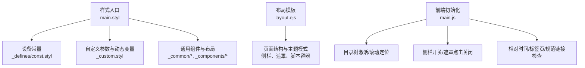
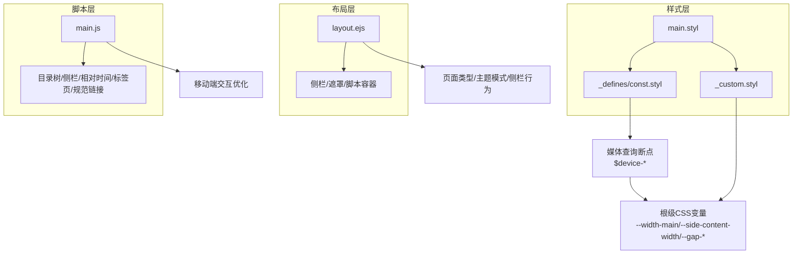
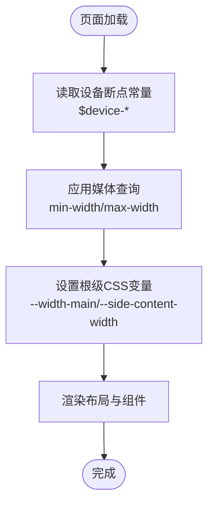
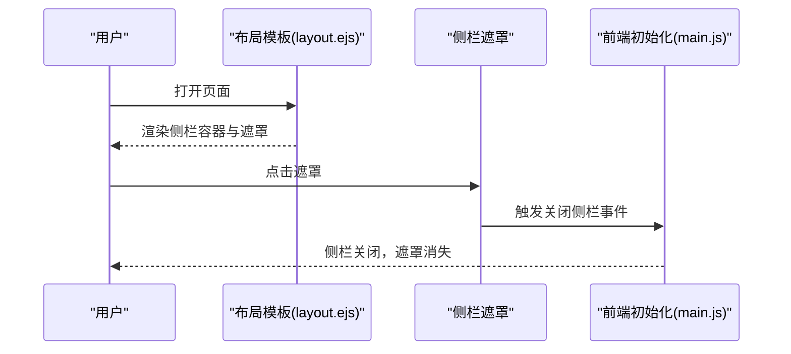
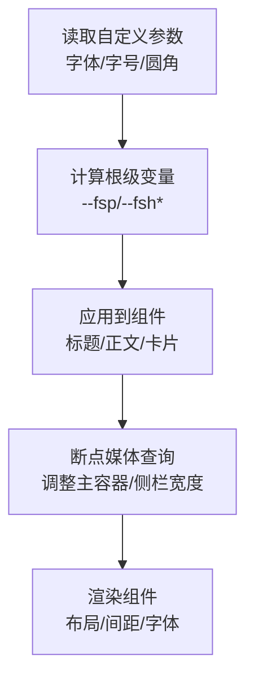
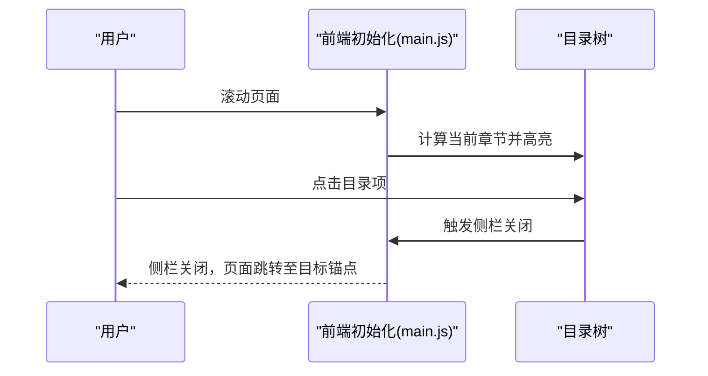
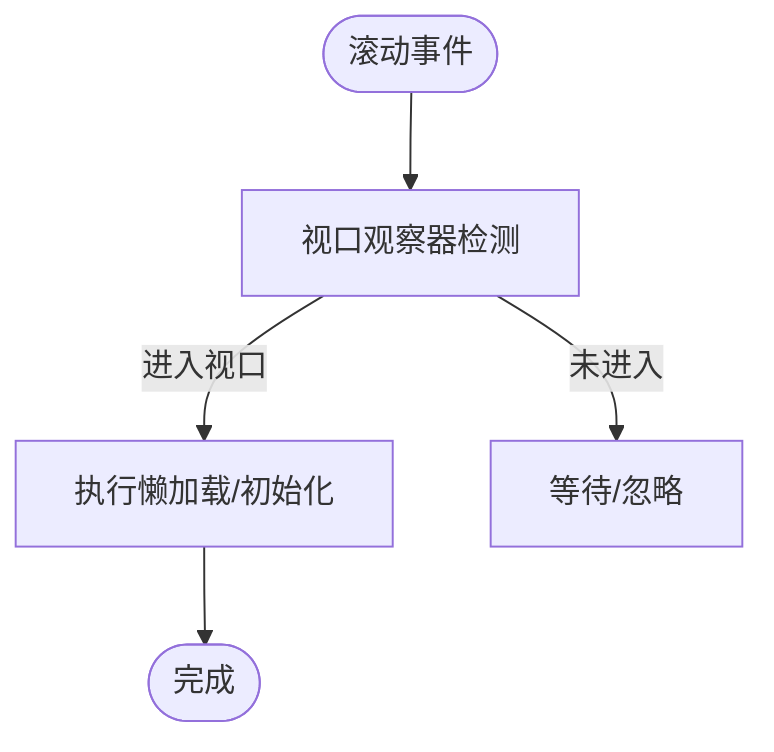
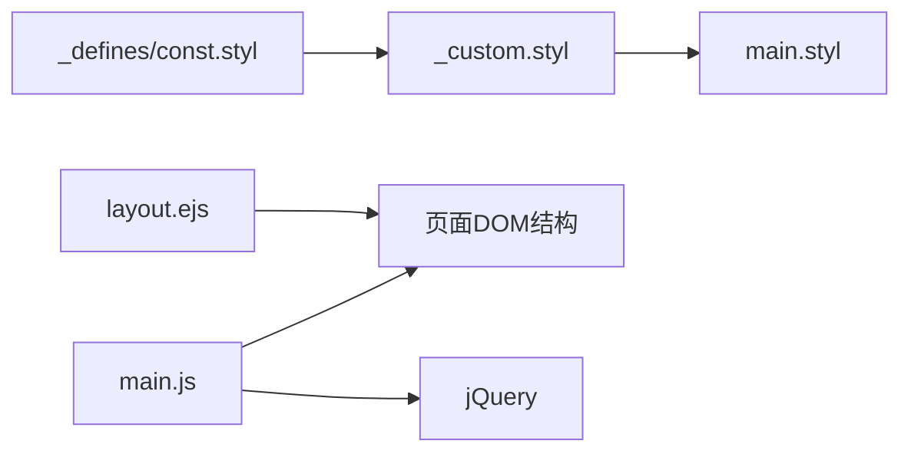

# 响应式设计

<cite>
**本文引用的文件**
- [themes/stellar/source/css/main.styl](file://themes/stellar/source/css/main.styl)
- [themes/stellar/source/css/_defines/const.styl](file://themes/stellar/source/css/_defines/const.styl)
- [themes/stellar/source/css/_custom.styl](file://themes/stellar/source/css/_custom.styl)
- [themes/stellar/layout/layout.ejs](file://themes/stellar/layout/layout.ejs)
- [themes/stellar/source/js/main.js](file://themes/stellar/source/js/main.js)
- [themes/stellar/_config.yml](file://themes/stellar/_config.yml)
</cite>

## 目录
1. [简介](#简介)
2. [项目结构](#项目结构)
3. [核心组件](#核心组件)
4. [架构总览](#架构总览)
5. [详细组件分析](#详细组件分析)
6. [依赖关系分析](#依赖关系分析)
7. [性能考量](#性能考量)
8. [故障排查指南](#故障排查指南)
9. [结论](#结论)
10. [附录](#附录)

## 简介
本指南面向H1S97X博客Stellar主题的响应式设计定制，聚焦断点系统、移动端适配策略、不同屏幕尺寸下的布局与字体缩放、组件重排、触摸友好交互、性能优化、图片与媒体查询优化、跨设备一致性保障，以及最佳实践与常见问题解决方案。读者可据此为不同设备类型定制样式规则与体验。

## 项目结构
Stellar主题的响应式设计主要由以下层次构成：
- 样式入口与模块组织：通过样式入口文件导入常量、自定义参数、通用组件与插件，形成统一的样式体系。
- 断点与设备常量：集中定义移动端、平板、桌面等断点阈值，作为媒体查询与动态变量的基础。
- 自定义参数与动态变量：通过自定义样式文件注入根级CSS变量，随屏幕尺寸动态调整主容器宽度、侧栏宽度、间距等。
- 布局模板：通过EJS模板拼装页面结构，结合主题配置与运行时逻辑，控制页面类型、主题模式与侧栏行为。
- 前端初始化：JavaScript负责目录树激活、侧栏交互、相对时间、标签页切换、规范链接检查等，提升移动端可用性。

**图表来源**
- [themes/stellar/source/css/main.styl](file://themes/stellar/source/css/main.styl#L1-L19)
- [themes/stellar/source/css/_defines/const.styl](file://themes/stellar/source/css/_defines/const.styl#L1-L54)
- [themes/stellar/source/css/_custom.styl](file://themes/stellar/source/css/_custom.styl#L66-L93)
- [themes/stellar/layout/layout.ejs](file://themes/stellar/layout/layout.ejs#L41-L76)
- [themes/stellar/source/js/main.js](file://themes/stellar/source/js/main.js#L97-L287)

**章节来源**
- [themes/stellar/source/css/main.styl](file://themes/stellar/source/css/main.styl#L1-L19)
- [themes/stellar/layout/layout.ejs](file://themes/stellar/layout/layout.ejs#L1-L76)

## 核心组件
- 断点与设备常量：集中定义移动端、平板、桌面、2K/4K等断点阈值，供媒体查询与动态变量使用。
- 自定义参数与动态变量：基于根级CSS变量，按设备尺寸动态调整主容器宽度、侧栏内容宽度、内外边距与段落间距等。
- 布局模板：根据页面类型与主题配置，拼装主体结构、侧栏、遮罩与脚本容器，确保移动端抽屉式侧栏与遮罩交互。
- 前端初始化：负责目录树高亮与滚动对齐、侧栏开关、相对时间、标签页切换、规范链接提示等，提升移动端可用性与一致性。

**章节来源**
- [themes/stellar/source/css/_defines/const.styl](file://themes/stellar/source/css/_defines/const.styl#L1-L54)
- [themes/stellar/source/css/_custom.styl](file://themes/stellar/source/css/_custom.styl#L66-L93)
- [themes/stellar/layout/layout.ejs](file://themes/stellar/layout/layout.ejs#L41-L76)
- [themes/stellar/source/js/main.js](file://themes/stellar/source/js/main.js#L97-L287)

## 架构总览
Stellar主题的响应式架构围绕“样式常量—动态变量—布局模板—前端初始化”展开，形成从断点到交互的一体化响应式体系。

**图表来源**
- [themes/stellar/source/css/main.styl](file://themes/stellar/source/css/main.styl#L1-L19)
- [themes/stellar/source/css/_defines/const.styl](file://themes/stellar/source/css/_defines/const.styl#L1-L54)
- [themes/stellar/source/css/_custom.styl](file://themes/stellar/source/css/_custom.styl#L66-L93)
- [themes/stellar/layout/layout.ejs](file://themes/stellar/layout/layout.ejs#L41-L76)
- [themes/stellar/source/js/main.js](file://themes/stellar/source/js/main.js#L97-L287)

## 详细组件分析

### 断点系统与媒体查询
- 设备断点常量：定义移动端、平板、桌面、2K/4K等断点阈值，作为媒体查询与动态变量的基础。
- 媒体查询应用：在自定义样式中针对不同断点调整主容器宽度与侧栏内容宽度，确保在大屏与小屏下均有合适的阅读与浏览体验。
- 动态变量联动：根级CSS变量随断点变化，驱动布局与间距的自适应调整。

**图表来源**
- [themes/stellar/source/css/_defines/const.styl](file://themes/stellar/source/css/_defines/const.styl#L1-L54)
- [themes/stellar/source/css/_custom.styl](file://themes/stellar/source/css/_custom.styl#L80-L93)

**章节来源**
- [themes/stellar/source/css/_defines/const.styl](file://themes/stellar/source/css/_defines/const.styl#L1-L54)
- [themes/stellar/source/css/_custom.styl](file://themes/stellar/source/css/_custom.styl#L80-L93)

### 移动端适配策略
- 侧栏抽屉与遮罩：布局模板提供侧栏容器与遮罩，移动端通过遮罩点击关闭侧栏，提升交互一致性。
- 主容器宽度：在大屏（2K/4K）下扩大主容器宽度，确保内容在大屏下不过度压缩；在平板与小屏下保持紧凑。
- 侧栏内容宽度：在平板竖屏与更小屏下调整侧栏内容宽度，避免内容拥挤与溢出。
- 主题模式：根据配置自动/手动选择主题模式，配合根级HTML属性实现一致的主题切换。

**图表来源**
- [themes/stellar/layout/layout.ejs](file://themes/stellar/layout/layout.ejs#L58-L67)
- [themes/stellar/source/js/main.js](file://themes/stellar/source/js/main.js#L157-L163)

**章节来源**
- [themes/stellar/layout/layout.ejs](file://themes/stellar/layout/layout.ejs#L41-L76)
- [themes/stellar/source/js/main.js](file://themes/stellar/source/js/main.js#L157-L163)

### 布局调整、字体缩放与组件重排
- 主容器宽度：在不同断点下调整主容器宽度，确保内容在各设备上的可读性与视觉平衡。
- 侧栏宽度：在平板与小屏下缩小侧栏内容宽度，避免内容拥挤。
- 间距与段落：通过根级CSS变量统一管理内外边距与段落间距，保证在不同断点下的一致性。
- 字体缩放：通过自定义参数与根级变量，结合主题配置的字体大小，实现全局与局部的字体缩放。

**图表来源**
- [themes/stellar/source/css/_custom.styl](file://themes/stellar/source/css/_custom.styl#L66-L93)
- [themes/stellar/_config.yml](file://themes/stellar/_config.yml#L635-L698)

**章节来源**
- [themes/stellar/source/css/_custom.styl](file://themes/stellar/source/css/_custom.styl#L66-L93)
- [themes/stellar/_config.yml](file://themes/stellar/_config.yml#L635-L698)

### 触摸友好交互设计
- 目录树激活与滚动：在滚动过程中高亮当前章节，并平滑滚动至可视区域，提升移动端阅读体验。
- 侧栏开关：通过遮罩点击关闭侧栏，避免误触，提高交互效率。
- 相对时间：将发布时间转换为“刚刚/分钟/小时/天”等人性化表达，便于移动端快速理解。
- 标签页切换：无依赖第三方库的标签页切换逻辑，保证移动端点击与触摸的流畅性。

**图表来源**
- [themes/stellar/source/js/main.js](file://themes/stellar/source/js/main.js#L97-L156)
- [themes/stellar/source/js/main.js](file://themes/stellar/source/js/main.js#L157-L163)

**章节来源**
- [themes/stellar/source/js/main.js](file://themes/stellar/source/js/main.js#L97-L156)
- [themes/stellar/source/js/main.js](file://themes/stellar/source/js/main.js#L157-L163)

### 性能优化
- 懒加载与视口观察：使用视口观察器在元素进入视口时再执行加载逻辑，减少初始渲染压力。
- 平滑滚动：在支持的浏览器中启用平滑滚动，提升滚动体验。
- 资源按需加载：前端初始化仅在需要时触发相应逻辑，避免不必要的DOM操作。

**图表来源**
- [themes/stellar/source/js/main.js](file://themes/stellar/source/js/main.js#L62-L74)

**章节来源**
- [themes/stellar/source/js/main.js](file://themes/stellar/source/js/main.js#L62-L74)

### 响应式图片处理与媒体查询优化
- 图片懒加载：通过配置与脚本实现图片懒加载，结合过渡效果提升加载体验。
- 媒体查询断点：基于设备常量与自定义变量，针对不同断点设置合适的图片尺寸与布局，避免在小屏下加载过大资源。
- 媒体选择器：在需要时为图片选择器设置媒体查询，确保在不同设备上加载合适尺寸的图片。

**章节来源**
- [themes/stellar/_config.yml](file://themes/stellar/_config.yml#L458-L461)
- [themes/stellar/source/css/_defines/const.styl](file://themes/stellar/source/css/_defines/const.styl#L1-L54)
- [themes/stellar/source/css/_custom.styl](file://themes/stellar/source/css/_custom.styl#L80-L93)

### 跨设备一致性保障
- 根级CSS变量：通过根级变量统一管理主容器宽度、侧栏宽度、间距等，确保在不同断点下的一致性。
- 主题模式：支持自动/手动主题模式，配合根级HTML属性实现一致的主题切换。
- 布局模板：统一的侧栏、遮罩与脚本容器结构，保证在不同设备上的交互一致性。

**章节来源**
- [themes/stellar/source/css/_custom.styl](file://themes/stellar/source/css/_custom.styl#L66-L93)
- [themes/stellar/layout/layout.ejs](file://themes/stellar/layout/layout.ejs#L42-L46)

## 依赖关系分析
- 样式入口依赖设备常量与自定义参数，自定义参数进一步依赖根级CSS变量与媒体查询。
- 布局模板依赖主题配置与运行时逻辑，控制页面类型、主题模式与侧栏行为。
- 前端初始化依赖jQuery与DOM结构，负责目录树、侧栏、相对时间、标签页与规范链接检查。

**图表来源**
- [themes/stellar/source/css/main.styl](file://themes/stellar/source/css/main.styl#L1-L19)
- [themes/stellar/source/css/_defines/const.styl](file://themes/stellar/source/css/_defines/const.styl#L1-L54)
- [themes/stellar/source/css/_custom.styl](file://themes/stellar/source/css/_custom.styl#L66-L93)
- [themes/stellar/layout/layout.ejs](file://themes/stellar/layout/layout.ejs#L41-L76)
- [themes/stellar/source/js/main.js](file://themes/stellar/source/js/main.js#L1-L295)

**章节来源**
- [themes/stellar/source/css/main.styl](file://themes/stellar/source/css/main.styl#L1-L19)
- [themes/stellar/layout/layout.ejs](file://themes/stellar/layout/layout.ejs#L41-L76)
- [themes/stellar/source/js/main.js](file://themes/stellar/source/js/main.js#L1-L295)

## 性能考量
- 懒加载与视口观察：在滚动时仅加载可见区域内容，减少初始渲染负担。
- 平滑滚动：在支持的浏览器中启用平滑滚动，提升滚动体验。
- 资源按需加载：前端初始化仅在需要时触发相应逻辑，避免不必要的DOM操作。
- 图片懒加载：通过配置与脚本实现图片懒加载，结合过渡效果提升加载体验。

**章节来源**
- [themes/stellar/source/js/main.js](file://themes/stellar/source/js/main.js#L62-L74)
- [themes/stellar/_config.yml](file://themes/stellar/_config.yml#L458-L461)

## 故障排查指南
- 规范链接提示：当检测到非官方或非法克隆站点时，会在页面显示提示并阻止搜索引擎收录，可通过配置关闭提示或设置官方主机列表。
- 相对时间显示异常：检查相对时间初始化逻辑与上下文语言配置，确保时间戳正确传递。
- 侧栏无法关闭：检查遮罩点击事件绑定与侧栏开关逻辑，确认DOM结构与事件监听正常。
- 目录树高亮失效：检查滚动事件与目录树节点计算逻辑，确保在滚动时正确识别当前章节。

**章节来源**
- [themes/stellar/source/js/main.js](file://themes/stellar/source/js/main.js#L203-L287)
- [themes/stellar/source/js/main.js](file://themes/stellar/source/js/main.js#L164-L173)
- [themes/stellar/source/js/main.js](file://themes/stellar/source/js/main.js#L157-L163)
- [themes/stellar/source/js/main.js](file://themes/stellar/source/js/main.js#L97-L156)

## 结论
通过设备断点常量、根级CSS变量与布局模板的协同，Stellar主题实现了从移动端到大屏的完整响应式覆盖。结合前端初始化的目录树、侧栏、相对时间与规范链接检查，进一步提升了移动端的交互体验与一致性。遵循本文的最佳实践与故障排查建议，可高效定制不同设备类型的样式规则与用户体验。

## 附录
- 断点与设备常量：集中定义移动端、平板、桌面、2K/4K等断点阈值。
- 自定义参数与动态变量：基于根级CSS变量，按设备尺寸动态调整主容器宽度、侧栏宽度、间距等。
- 布局模板：根据页面类型与主题配置，拼装主体结构、侧栏、遮罩与脚本容器。
- 前端初始化：负责目录树高亮与滚动对齐、侧栏开关、相对时间、标签页切换、规范链接提示等。

**章节来源**
- [themes/stellar/source/css/_defines/const.styl](file://themes/stellar/source/css/_defines/const.styl#L1-L54)
- [themes/stellar/source/css/_custom.styl](file://themes/stellar/source/css/_custom.styl#L66-L93)
- [themes/stellar/layout/layout.ejs](file://themes/stellar/layout/layout.ejs#L41-L76)
- [themes/stellar/source/js/main.js](file://themes/stellar/source/js/main.js#L97-L287)