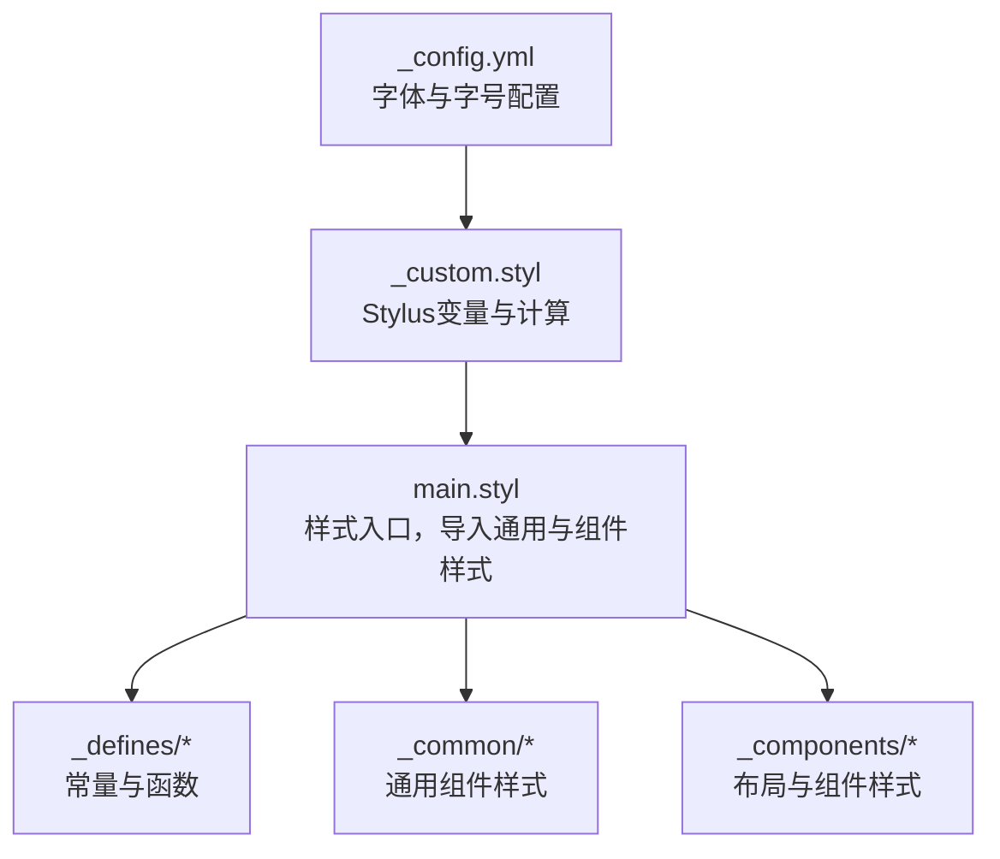
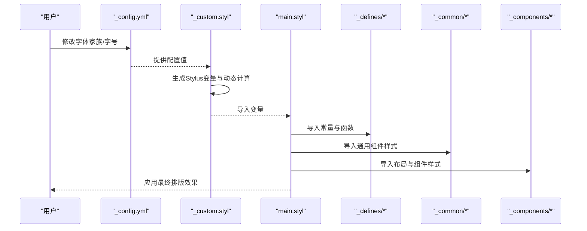
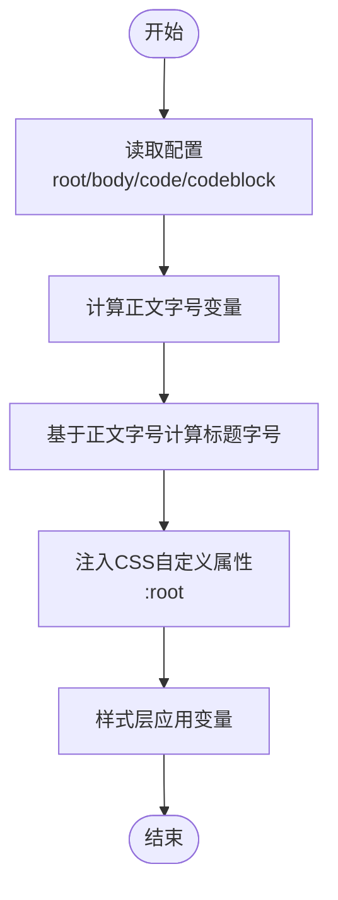
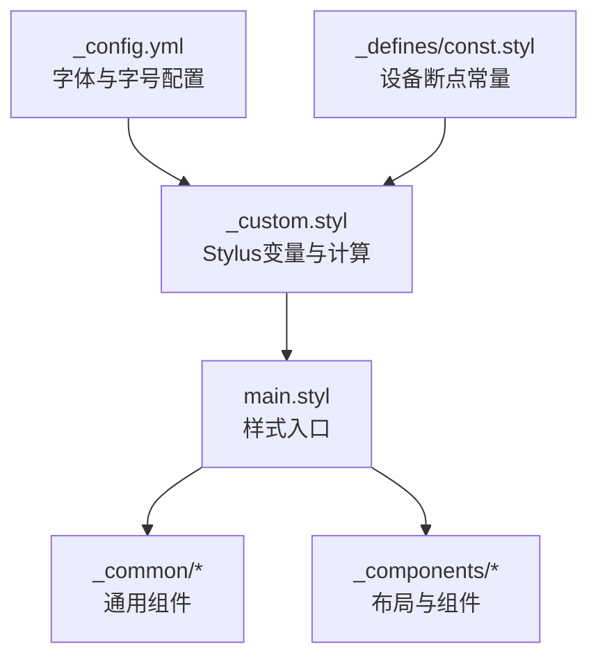

# 字体系统

<cite>
**本文引用的文件**
- [themes/stellar/_config.yml](file://themes/stellar/_config.yml)
- [themes/stellar/source/css/_custom.styl](file://themes/stellar/source/css/_custom.styl)
- [themes/stellar/source/css/main.styl](file://themes/stellar/source/css/main.styl)
- [themes/stellar/source/css/_defines/const.styl](file://themes/stellar/source/css/_defines/const.styl)
</cite>

## 目录
1. [引言](#引言)
2. [项目结构](#项目结构)
3. [核心组件](#核心组件)
4. [架构总览](#架构总览)
5. [详细组件分析](#详细组件分析)
6. [依赖关系分析](#依赖关系分析)
7. [性能考量](#性能考量)
8. [故障排查指南](#故障排查指南)
9. [结论](#结论)
10. [附录](#附录)

## 引言
本指南面向H1S97X博客Stellar主题的字体系统定制，聚焦以下目标：
- 字体家族：中文字体、英文字体、等宽字体的配置与回退策略
- 字号层级：根字号、正文字号、代码与代码块字号、标题字号的计算与映射
- 行高与字重：如何通过变量与CSS自定义属性实现一致的行高与字重控制
- 样式定制：标题层级、正文排版、代码字体与特殊文本样式的样式要点
- 字体加载优化：Web字体配置、预连接、回退策略与跨平台兼容
- 可读性与对比度：对比度优化与可读性提升建议
- 实战案例与最佳实践：基于主题现有变量与导入体系的实际落地方法

## 项目结构
Stellar主题的字体系统主要由两层构成：
- 配置层：在主题配置中声明字体家族、字号、对齐等基础参数
- 样式层：通过Stylus变量与CSS自定义属性，将配置转换为最终的排版表现

**图表来源**
- [themes/stellar/_config.yml](file://themes/stellar/_config.yml#L635-L698)
- [themes/stellar/source/css/_custom.styl](file://themes/stellar/source/css/_custom.styl#L1-L105)
- [themes/stellar/source/css/main.styl](file://themes/stellar/source/css/main.styl#L1-L19)

**章节来源**
- [themes/stellar/_config.yml](file://themes/stellar/_config.yml#L635-L698)
- [themes/stellar/source/css/_custom.styl](file://themes/stellar/source/css/_custom.styl#L1-L105)
- [themes/stellar/source/css/main.styl](file://themes/stellar/source/css/main.styl#L1-L19)

## 核心组件
- 字体家族配置
  - 正文字体：body
  - 代码字体：code
  - 代码块字体：codeblock
- 字号配置
  - 根字号：root
  - 正文字号：body
  - 代码字号：code
  - 代码块字号：codeblock
- 标题字号映射
  - 基于正文字号动态计算的标题字号变量
- CSS自定义属性
  - 通过:root注入动态变量，支撑响应式与主题切换

**章节来源**
- [themes/stellar/_config.yml](file://themes/stellar/_config.yml#L635-L698)
- [themes/stellar/source/css/_custom.styl](file://themes/stellar/source/css/_custom.styl#L4-L30)
- [themes/stellar/source/css/_custom.styl](file://themes/stellar/source/css/_custom.styl#L66-L93)

## 架构总览
Stellar主题的字体系统遵循“配置 → 变量 → 样式”的链路：
- 配置层：在主题配置中设置字体家族与字号
- 变量层：Stylus读取配置，生成变量与动态计算（如标题字号）
- 样式层：通过main.styl统一导入，结合通用与组件样式生效

**图表来源**
- [themes/stellar/_config.yml](file://themes/stellar/_config.yml#L635-L698)
- [themes/stellar/source/css/_custom.styl](file://themes/stellar/source/css/_custom.styl#L1-L105)
- [themes/stellar/source/css/main.styl](file://themes/stellar/source/css/main.styl#L1-L19)

## 详细组件分析

### 字体家族与回退策略
- 正文字体（body）
  - 默认包含系统UI字体与中文字体备选，确保跨平台一致性
  - 建议在保持系统UI优先的前提下，保留中文字体作为首选
- 代码字体（code）
  - 默认包含等宽字体与系统UI备选，保证代码可读性
- 代码块字体（codeblock）
  - 与代码字体一致，便于统一视觉节奏

回退策略建议：
- 优先使用系统字体，降低首屏加载压力
- 为关键字体添加预连接（见“性能考量”）
- 在生产环境引入Web字体时，注意字体文件体积与加载时机

**章节来源**
- [themes/stellar/_config.yml](file://themes/stellar/_config.yml#L643-L646)

### 字号层级系统与动态计算
- 根字号（root）
  - 作为全局缩放基准，影响所有使用rem的字号
- 正文字号（body）
  - 影响正文行高与标题字号的动态计算
- 代码字号（code）
  - 相对于父级行高的百分比，建议保持在80%-90%
- 代码块字号（codeblock）
  - 使用固定rem值，便于与编辑器/终端体验一致

标题字号映射：
- 基于正文字号计算的标题字号变量，确保层级递减与可读性
- 通过CSS自定义属性在:root注入，支持响应式与主题切换

**图表来源**
- [themes/stellar/source/css/_custom.styl](file://themes/stellar/source/css/_custom.styl#L9-L30)
- [themes/stellar/source/css/_custom.styl](file://themes/stellar/source/css/_custom.styl#L66-L93)

**章节来源**
- [themes/stellar/source/css/_custom.styl](file://themes/stellar/source/css/_custom.styl#L9-L30)
- [themes/stellar/source/css/_custom.styl](file://themes/stellar/source/css/_custom.styl#L66-L93)

### 行高与字重配置
- 行高
  - 通过段落间距与字号的合理搭配实现稳定行高
  - 建议在通用组件样式中统一设置行高，避免重复计算
- 字重
  - 通过主题配置中的颜色与强调色，配合字体权重实现层次感
  - 代码与代码块建议使用中等或常规字重，避免过粗影响可读性

**章节来源**
- [themes/stellar/_config.yml](file://themes/stellar/_config.yml#L658-L662)
- [themes/stellar/source/css/_custom.styl](file://themes/stellar/source/css/_custom.styl#L80-L81)

### 标题层级、正文排版与代码样式
- 标题层级
  - 使用动态计算的标题字号变量，确保层级递减与视觉平衡
  - 可结合前缀图标或装饰，增强可读性
- 正文排版
  - 通过段落间距与行高控制阅读节奏
  - 在通用组件样式中集中定义，避免分散配置
- 代码与代码块
  - 代码块使用固定字号与等宽字体，确保对齐与可读性
  - 代码片段建议使用相对字号，避免破坏上下文行高

**章节来源**
- [themes/stellar/source/css/_custom.styl](file://themes/stellar/source/css/_custom.styl#L20-L30)
- [themes/stellar/source/css/_custom.styl](file://themes/stellar/source/css/_custom.styl#L66-L93)

### 字体加载优化与Web字体配置
- 预连接
  - 在配置中预留预连接节点，加速字体资源加载
- Web字体引入
  - 建议在页面head中按需引入，避免阻塞渲染
  - 使用字体子集与缓存策略，减少体积与请求次数
- 回退策略
  - 优先使用系统字体，Web字体作为渐进增强
  - 通过font-display与字体加载事件，优化闪烁与抖动

**章节来源**
- [themes/stellar/_config.yml](file://themes/stellar/_config.yml#L11-L15)

### 跨平台兼容性与对比度优化
- 跨平台
  - 保持系统UI字体优先，确保在不同操作系统与浏览器中的一致体验
- 对比度
  - 通过主题配置中的强调色与链接色，提升文本对比度
  - 在深色/浅色模式下，确保正文与背景的对比度满足可读性要求

**章节来源**
- [themes/stellar/_config.yml](file://themes/stellar/_config.yml#L658-L662)

### 实际定制案例与最佳实践
- 案例一：将正文字体从系统UI替换为某中文字体
  - 在配置中修改body字体家族，确保保留系统UI作为回退
  - 通过预连接加速字体加载
- 案例二：统一代码块字号与行高
  - 在配置中设定codeblock字号，确保与正文行高协调
  - 在通用组件样式中统一设置行高与内边距
- 案例三：标题层级与段落间距的统一
  - 使用动态计算的标题字号变量，集中定义段落间距
  - 在组件样式中复用变量，避免重复计算

**章节来源**
- [themes/stellar/_config.yml](file://themes/stellar/_config.yml#L635-L698)
- [themes/stellar/source/css/_custom.styl](file://themes/stellar/source/css/_custom.styl#L9-L30)

## 依赖关系分析
字体系统依赖关系如下：
- 配置层依赖Stylus变量解析
- Stylus变量依赖设备断点常量
- 样式层统一导入变量与组件样式

**图表来源**
- [themes/stellar/_config.yml](file://themes/stellar/_config.yml#L635-L698)
- [themes/stellar/source/css/_custom.styl](file://themes/stellar/source/css/_custom.styl#L1-L105)
- [themes/stellar/source/css/_defines/const.styl](file://themes/stellar/source/css/_defines/const.styl#L1-L54)
- [themes/stellar/source/css/main.styl](file://themes/stellar/source/css/main.styl#L1-L19)

**章节来源**
- [themes/stellar/source/css/_defines/const.styl](file://themes/stellar/source/css/_defines/const.styl#L1-L54)
- [themes/stellar/source/css/_custom.styl](file://themes/stellar/source/css/_custom.styl#L1-L105)
- [themes/stellar/source/css/main.styl](file://themes/stellar/source/css/main.styl#L1-L19)

## 性能考量
- 字体加载
  - 使用预连接与字体子集，减少首次渲染时间
  - 避免在首屏强制加载大体量字体
- 渲染优化
  - 通过CSS自定义属性与Stylus变量，减少重复计算
  - 在通用组件样式中集中定义字体相关规则，避免样式碎片化
- 可访问性
  - 保证最小对比度与可读性阈值
  - 提供深色/浅色模式下的字体对比度保障

[本节为通用指导，无需列出章节来源]

## 故障排查指南
- 字号异常
  - 检查根字号与正文字号的相对关系，确认标题字号计算逻辑
- 字体不生效
  - 确认字体家族顺序与回退策略
  - 检查预连接与字体文件可用性
- 样式冲突
  - 在通用组件样式中统一字体规则，避免局部覆盖导致的不一致

**章节来源**
- [themes/stellar/source/css/_custom.styl](file://themes/stellar/source/css/_custom.styl#L9-L30)
- [themes/stellar/_config.yml](file://themes/stellar/_config.yml#L11-L15)

## 结论
Stellar主题的字体系统通过“配置 → 变量 → 样式”的清晰分层，提供了灵活且可扩展的定制能力。通过合理的字体家族与回退策略、动态字号计算与CSS自定义属性，能够在不同平台与设备上实现一致的可读性与视觉节奏。建议在生产环境中结合预连接、字体子集与缓存策略，进一步优化加载性能与用户体验。

[本节为总结性内容，无需列出章节来源]

## 附录
- 配置项参考
  - 字体家族：body、code、codeblock
  - 字号：root、body、code、codeblock
  - 标题字号：基于正文字号的动态计算
- 变量与导入
  - Stylus变量在_custom.styl中定义
  - main.styl统一导入通用与组件样式

**章节来源**
- [themes/stellar/_config.yml](file://themes/stellar/_config.yml#L635-L698)
- [themes/stellar/source/css/_custom.styl](file://themes/stellar/source/css/_custom.styl#L1-L105)
- [themes/stellar/source/css/main.styl](file://themes/stellar/source/css/main.styl#L1-L19)