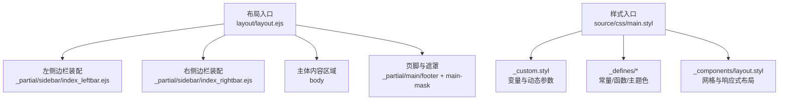
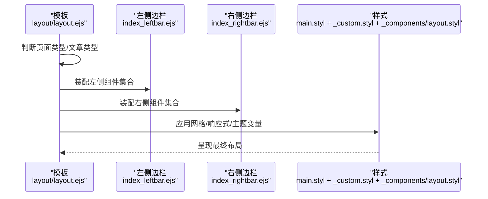
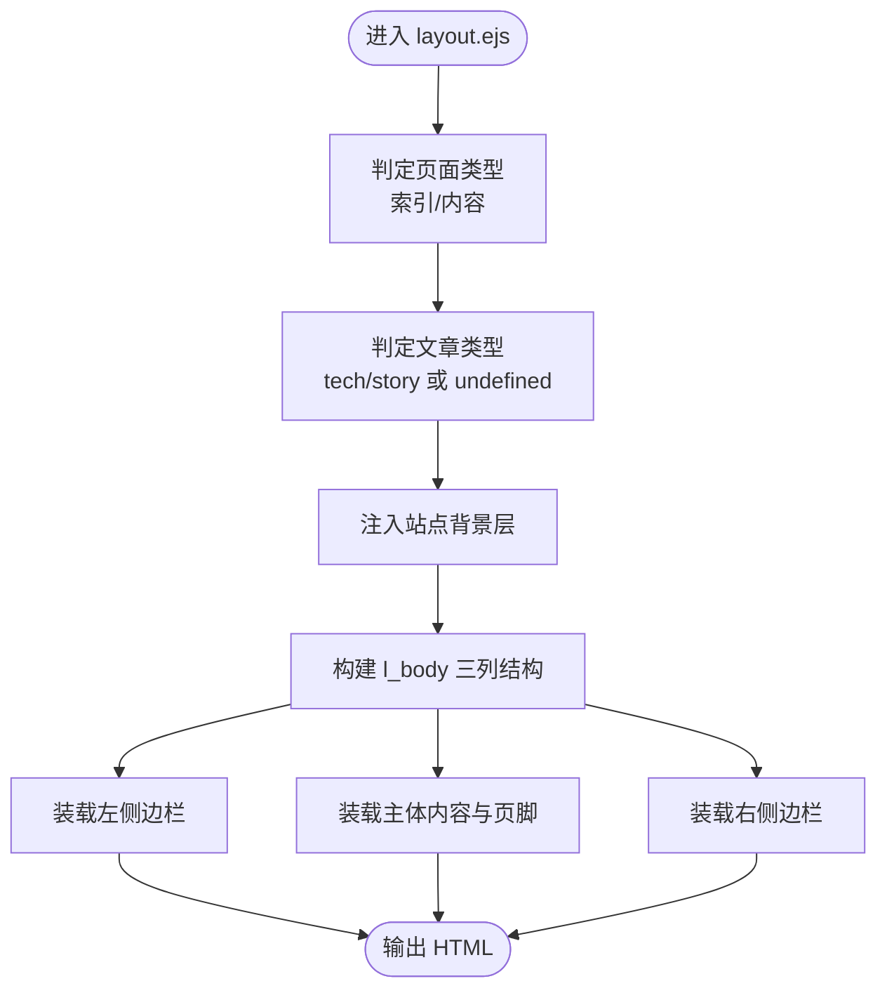
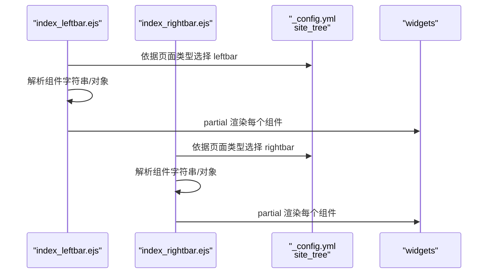
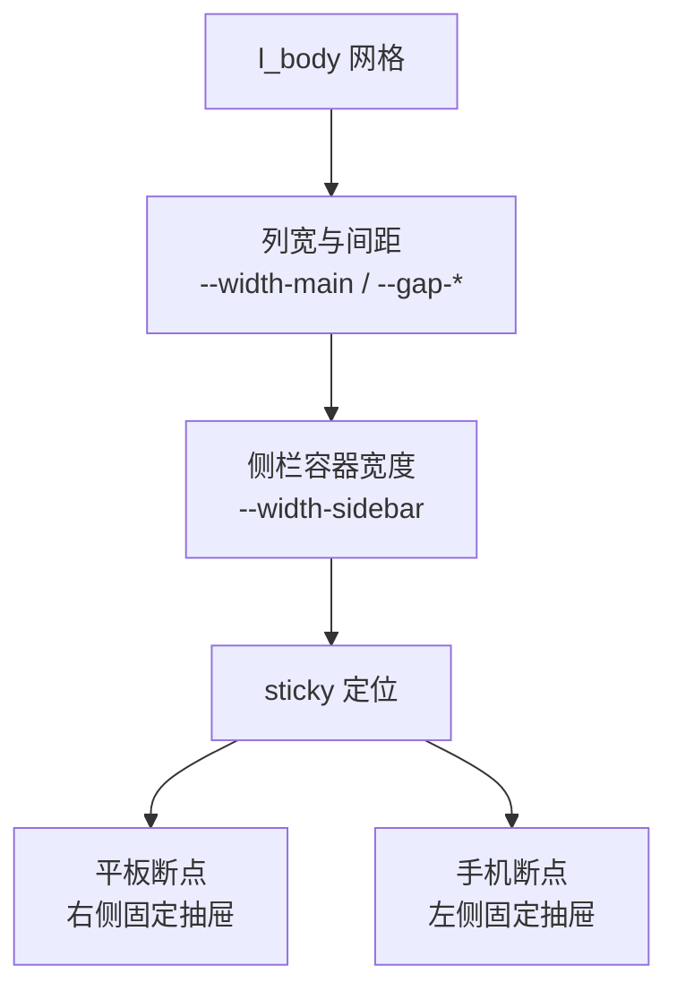
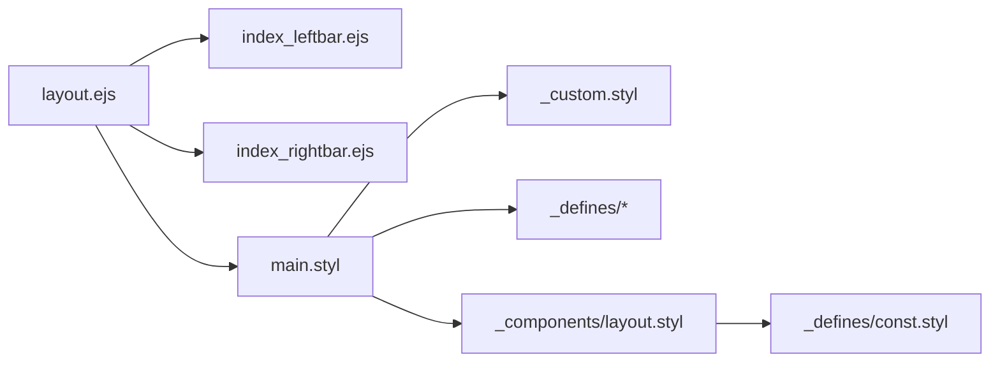

# 布局系统

<cite>
**本文引用的文件**
- [themes/stellar/_config.yml](file://themes/stellar/_config.yml)
- [themes/stellar/layout/layout.ejs](file://themes/stellar/layout/layout.ejs)
- [themes/stellar/layout/_partial/sidebar/index_leftbar.ejs](file://themes/stellar/layout/_partial/sidebar/index_leftbar.ejs)
- [themes/stellar/layout/_partial/sidebar/index_rightbar.ejs](file://themes/stellar/layout/_partial/sidebar/index_rightbar.ejs)
- [themes/stellar/source/css/main.styl](file://themes/stellar/source/css/main.styl)
- [themes/stellar/source/css/_custom.styl](file://themes/stellar/source/css/_custom.styl)
- [themes/stellar/source/css/_defines/const.styl](file://themes/stellar/source/css/_defines/const.styl)
- [themes/stellar/source/css/_defines/theme_base.styl](file://themes/stellar/source/css/_defines/theme_base.styl)
- [themes/stellar/source/css/_defines/func.styl](file://themes/stellar/source/css/_defines/func.styl)
- [themes/stellar/source/css/_components/layout.styl](file://themes/stellar/source/css/_components/layout.styl)
</cite>

## 目录
1. [简介](#简介)
2. [项目结构](#项目结构)
3. [核心组件](#核心组件)
4. [架构总览](#架构总览)
5. [详细组件分析](#详细组件分析)
6. [依赖关系分析](#依赖关系分析)
7. [性能考量](#性能考量)
8. [故障排查指南](#故障排查指南)
9. [结论](#结论)
10. [附录](#附录)

## 简介
本指南面向希望深度定制 H1S97X 博客中 Stellar 主题布局系统的读者。内容涵盖页面布局结构（容器宽度、边距、网格与弹性布局）、侧边栏与导航、内容区域与页脚的定制方法；提供响应式断点与移动端适配策略；说明布局组件的排列组合、间距控制与对齐方式；给出自定义布局模式、多栏布局与特殊页面布局的实现思路；最后总结布局优化技巧与性能注意事项。

## 项目结构
Stellar 主题的布局系统由 EJS 模板驱动的页面骨架与 Stylus 样式层共同构成。模板负责页面类型判断、侧边栏装配与主体结构拼装；样式层通过变量、函数与媒体查询实现响应式网格与交互行为。

**图表来源**
- [themes/stellar/layout/layout.ejs](file://themes/stellar/layout/layout.ejs#L1-L76)
- [themes/stellar/layout/_partial/sidebar/index_leftbar.ejs](file://themes/stellar/layout/_partial/sidebar/index_leftbar.ejs#L1-L167)
- [themes/stellar/layout/_partial/sidebar/index_rightbar.ejs](file://themes/stellar/layout/_partial/sidebar/index_rightbar.ejs#L1-L94)
- [themes/stellar/source/css/main.styl](file://themes/stellar/source/css/main.styl#L1-L19)
- [themes/stellar/source/css/_custom.styl](file://themes/stellar/source/css/_custom.styl#L1-L105)
- [themes/stellar/source/css/_defines/const.styl](file://themes/stellar/source/css/_defines/const.styl#L1-L54)
- [themes/stellar/source/css/_components/layout.styl](file://themes/stellar/source/css/_components/layout.styl#L1-L101)

**章节来源**
- [themes/stellar/layout/layout.ejs](file://themes/stellar/layout/layout.ejs#L1-L76)
- [themes/stellar/source/css/main.styl](file://themes/stellar/source/css/main.styl#L1-L19)

## 核心组件
- 页面骨架与类型判定：根据页面布局类型与文章类型，决定主体结构与样式开关。
- 侧边栏系统：左侧（左栏）与右侧（右栏）通过统一装配逻辑注入组件集合。
- 内容区域：主体内容与页脚区域，配合遮罩实现移动端侧栏交互。
- 样式变量与函数：通过 Stylus 变量与函数统一控制字体、间距、圆角、阴影与主题色。
- 响应式网格：基于 CSS Grid 的三列布局，结合媒体查询在平板与手机端切换为固定/抽屉式侧栏。

**章节来源**
- [themes/stellar/layout/layout.ejs](file://themes/stellar/layout/layout.ejs#L1-L76)
- [themes/stellar/layout/_partial/sidebar/index_leftbar.ejs](file://themes/stellar/layout/_partial/sidebar/index_leftbar.ejs#L1-L167)
- [themes/stellar/layout/_partial/sidebar/index_rightbar.ejs](file://themes/stellar/layout/_partial/sidebar/index_rightbar.ejs#L1-L94)
- [themes/stellar/source/css/_custom.styl](file://themes/stellar/source/css/_custom.styl#L66-L98)
- [themes/stellar/source/css/_components/layout.styl](file://themes/stellar/source/css/_components/layout.styl#L1-L101)

## 架构总览
Stellar 布局系统采用“模板驱动 + 样式变量”的双层架构：
- 模板层：layout.ejs 决定页面类型、文章类型与主体结构；两侧边栏通过 partial 注入组件集合。
- 样式层：main.styl 统一导入变量、函数与组件样式；_custom.styl 将主题配置映射为 CSS 变量；_components/layout.styl 提供网格与响应式规则。

**图表来源**
- [themes/stellar/layout/layout.ejs](file://themes/stellar/layout/layout.ejs#L1-L76)
- [themes/stellar/layout/_partial/sidebar/index_leftbar.ejs](file://themes/stellar/layout/_partial/sidebar/index_leftbar.ejs#L1-L167)
- [themes/stellar/layout/_partial/sidebar/index_rightbar.ejs](file://themes/stellar/layout/_partial/sidebar/index_rightbar.ejs#L1-L94)
- [themes/stellar/source/css/main.styl](file://themes/stellar/source/css/main.styl#L1-L19)
- [themes/stellar/source/css/_custom.styl](file://themes/stellar/source/css/_custom.styl#L66-L98)
- [themes/stellar/source/css/_components/layout.styl](file://themes/stellar/source/css/_components/layout.styl#L1-L101)

## 详细组件分析

### 页面骨架与主体结构
- 页面类型判定：根据布局类型与是否存在导航标签，区分“索引页面”与“内容页面”，从而影响文章类型与样式开关。
- 文章类型：优先使用页面 front-matter 指定，其次回退到专题/维基树配置，再回退到全局配置。
- 主体结构：包含站点背景层、封面占位、三列主体（左侧边栏、内容区、右侧边栏）、菜单按钮与脚本容器。

**图表来源**
- [themes/stellar/layout/layout.ejs](file://themes/stellar/layout/layout.ejs#L1-L76)

**章节来源**
- [themes/stellar/layout/layout.ejs](file://themes/stellar/layout/layout.ejs#L1-L76)

### 侧边栏布局与组件装配
- 左侧边栏：根据当前页面类型与专题/维基/笔记本上下文，从配置的 site_tree 中选择 leftbar 组件集合；支持字符串或对象形式的组件覆盖。
- 右侧边栏：逻辑与左侧一致，但默认为空集合时直接不渲染。
- 组件装配：遍历组件数组，合并主题内置组件与页面覆盖项，按 layout 属性动态 partial 渲染。

**图表来源**
- [themes/stellar/layout/_partial/sidebar/index_leftbar.ejs](file://themes/stellar/layout/_partial/sidebar/index_leftbar.ejs#L1-L167)
- [themes/stellar/layout/_partial/sidebar/index_rightbar.ejs](file://themes/stellar/layout/_partial/sidebar/index_rightbar.ejs#L1-L94)
- [themes/stellar/_config.yml](file://themes/stellar/_config.yml#L72-L152)

**章节来源**
- [themes/stellar/layout/_partial/sidebar/index_leftbar.ejs](file://themes/stellar/layout/_partial/sidebar/index_leftbar.ejs#L1-L167)
- [themes/stellar/layout/_partial/sidebar/index_rightbar.ejs](file://themes/stellar/layout/_partial/sidebar/index_rightbar.ejs#L1-L94)
- [themes/stellar/_config.yml](file://themes/stellar/_config.yml#L72-L152)

### 内容区域与页脚
- 主体内容区：承载页面 body 内容与页脚。
- 页脚与社交：左侧边栏底部可渲染社交链接与页脚信息。
- 遮罩层：用于移动端侧栏抽屉交互，点击遮罩收起侧栏。

**章节来源**
- [themes/stellar/layout/layout.ejs](file://themes/stellar/layout/layout.ejs#L58-L68)
- [themes/stellar/layout/_partial/sidebar/index_leftbar.ejs](file://themes/stellar/layout/_partial/sidebar/index_leftbar.ejs#L113-L146)

### 样式变量与主题色
- 变量来源：_custom.styl 将主题配置映射为 CSS 变量，如字体家族、字号、圆角半径、主题色、强调色、链接色等。
- 主题色函数：_defines/theme_base.styl 提供动态主题色与文本色计算，支持浅色/深色/自动模式。
- 设备断点：_defines/const.styl 定义移动、平板、桌面、2K/4K 等断点，用于媒体查询。

**章节来源**
- [themes/stellar/source/css/_custom.styl](file://themes/stellar/source/css/_custom.styl#L1-L105)
- [themes/stellar/source/css/_defines/theme_base.styl](file://themes/stellar/source/css/_defines/theme_base.styl#L1-L107)
- [themes/stellar/source/css/_defines/const.styl](file://themes/stellar/source/css/_defines/const.styl#L1-L54)

### 网格系统与弹性布局
- 网格布局：l_body 使用 CSS Grid，三列结构为“左侧边栏 / 主体内容 / 右侧边栏”，列宽由变量控制，间距随断点变化。
- 侧栏容器：侧栏宽度由内容宽度与内外边距计算得到，使用 sticky 定位实现滚动粘滞。
- 响应式行为：
  - 平板：右侧边栏变为固定定位，抽屉式滑出；左侧边栏在更大屏幕下恢复为固定定位。
  - 手机：左侧边栏抽屉式滑出，主体内容最大宽度为 100%；右侧边栏在平板断点以上出现。

**图表来源**
- [themes/stellar/source/css/_components/layout.styl](file://themes/stellar/source/css/_components/layout.styl#L1-L101)
- [themes/stellar/source/css/_custom.styl](file://themes/stellar/source/css/_custom.styl#L66-L98)

**章节来源**
- [themes/stellar/source/css/_components/layout.styl](file://themes/stellar/source/css/_components/layout.styl#L1-L101)
- [themes/stellar/source/css/_custom.styl](file://themes/stellar/source/css/_custom.styl#L66-L98)

### 响应式断点与移动端适配
- 断点定义：移动（含 iPhone Max）、平板、笔记本、桌面、2K、4K 等断点，用于控制侧栏宽度、内容主宽与间距。
- 移动端策略：
  - 侧栏抽屉：通过 transform 与过渡实现滑入滑出，配合遮罩层。
  - 固定定位：侧栏在抽屉状态下使用 fixed 定位，确保在滚动时保持可见。
  - 主体内容：在手机端限制最大宽度，避免过宽阅读体验。

**章节来源**
- [themes/stellar/source/css/_defines/const.styl](file://themes/stellar/source/css/_defines/const.styl#L1-L11)
- [themes/stellar/source/css/_components/layout.styl](file://themes/stellar/source/css/_components/layout.styl#L30-L89)

### 间距控制与对齐方式
- 间距变量：--gap-margin（元素到容器边缘）、--gap-padding（元素文本到自身轮廓）、--gap-max（两者之和）。
- 段落间距：--gap-p 与 --gap-p-compact 用于正文段落间距控制。
- 对齐与排版：通过 CSS Grid 的 justify-self 与 align-self 控制侧栏对齐；文本对齐由全局配置控制。

**章节来源**
- [themes/stellar/source/css/_custom.styl](file://themes/stellar/source/css/_custom.styl#L76-L82)
- [themes/stellar/source/css/_components/layout.styl](file://themes/stellar/source/css/_components/layout.styl#L19-L28)

### 导航栏与菜单
- 导航区域：侧边栏顶部可渲染主导航菜单，支持在侧边栏中展示。
- 菜单高亮：通过主题配置中的菜单项与当前页面 menu_id 对应实现高亮。

**章节来源**
- [themes/stellar/layout/_partial/sidebar/index_leftbar.ejs](file://themes/stellar/layout/_partial/sidebar/index_leftbar.ejs#L152-L161)
- [themes/stellar/_config.yml](file://themes/stellar/_config.yml#L41-L69)

### 自定义布局模式与多栏布局
- 自定义页面：通过在页面 front-matter 中设置 layout 与 leftbar/rightbar，可为特定页面指定侧边栏组件集合。
- 多栏布局：通过调整 site_tree 中的 leftbar/rightbar 组件数量与顺序，实现不同组合的多栏布局。
- 特殊页面：如 404 页面、作者页、笔记本/笔记页等，均有独立的 site_tree 配置，可分别定制左右栏。

**章节来源**
- [themes/stellar/_config.yml](file://themes/stellar/_config.yml#L72-L152)
- [themes/stellar/layout/_partial/sidebar/index_leftbar.ejs](file://themes/stellar/layout/_partial/sidebar/index_leftbar.ejs#L7-L53)
- [themes/stellar/layout/_partial/sidebar/index_rightbar.ejs](file://themes/stellar/layout/_partial/sidebar/index_rightbar.ejs#L7-L53)

## 依赖关系分析
- 模板依赖：layout.ejs 依赖两侧边栏 partial 与页脚 partial；两侧边栏又依赖 widgets 配置与主题数据。
- 样式依赖：main.styl 作为入口，依赖 _custom.styl（变量）、_defines/*（常量/函数/主题色）、_components/layout.styl（布局）。
- 响应式依赖：_components/layout.styl 依赖 _defines/const.styl 的断点常量。

**图表来源**
- [themes/stellar/layout/layout.ejs](file://themes/stellar/layout/layout.ejs#L1-L76)
- [themes/stellar/layout/_partial/sidebar/index_leftbar.ejs](file://themes/stellar/layout/_partial/sidebar/index_leftbar.ejs#L1-L167)
- [themes/stellar/layout/_partial/sidebar/index_rightbar.ejs](file://themes/stellar/layout/_partial/sidebar/index_rightbar.ejs#L1-L94)
- [themes/stellar/source/css/main.styl](file://themes/stellar/source/css/main.styl#L1-L19)
- [themes/stellar/source/css/_custom.styl](file://themes/stellar/source/css/_custom.styl#L1-L105)
- [themes/stellar/source/css/_defines/const.styl](file://themes/stellar/source/css/_defines/const.styl#L1-L54)
- [themes/stellar/source/css/_components/layout.styl](file://themes/stellar/source/css/_components/layout.styl#L1-L101)

**章节来源**
- [themes/stellar/source/css/main.styl](file://themes/stellar/source/css/main.styl#L1-L19)
- [themes/stellar/source/css/_components/layout.styl](file://themes/stellar/source/css/_components/layout.styl#L1-L101)

## 性能考量
- 样式加载：main.styl 作为单一入口，按需导入模块，避免重复打包；建议在生产环境合并压缩。
- 响应式渲染：侧栏抽屉与固定定位在移动端可能触发重排，建议减少复杂阴影与滤镜；必要时使用 transform3d 以启用硬件加速。
- 图片与资源：主题配置中提供懒加载与过渡选项，合理使用可降低首屏压力。
- 主题切换：动态主题色通过 CSS 变量与媒体查询实现，避免频繁重绘。

[本节为通用指导，不直接分析具体文件]

## 故障排查指南
- 侧边栏不显示或组件缺失：检查页面 front-matter 中的 leftbar/rightbar 设置，确认组件名称与 widgets 配置一致。
- 移动端侧栏无法滑出：确认 l_body 上是否存在 leftbar/rightbar 属性，以及 main-mask 的点击事件绑定。
- 字体/字号异常：检查 _config.yml 中 style.font-family 与 style.font-size 的配置，确认已正确映射到 CSS 变量。
- 主题色不生效：确认 _config.yml 中 style.color.* 配置，以及 _custom.styl 是否正确读取；检查浏览器 CSS 变量覆盖情况。

**章节来源**
- [themes/stellar/layout/_partial/sidebar/index_leftbar.ejs](file://themes/stellar/layout/_partial/sidebar/index_leftbar.ejs#L7-L53)
- [themes/stellar/layout/_partial/sidebar/index_rightbar.ejs](file://themes/stellar/layout/_partial/sidebar/index_rightbar.ejs#L7-L53)
- [themes/stellar/_config.yml](file://themes/stellar/_config.yml#L635-L725)
- [themes/stellar/source/css/_custom.styl](file://themes/stellar/source/css/_custom.styl#L38-L43)

## 结论
Stellar 主题的布局系统以模板与样式的清晰分离为核心：模板负责页面类型与侧边栏装配，样式层通过变量与媒体查询实现响应式网格与主题切换。通过合理配置 _config.yml 的 site_tree、style 与 widgets，即可实现多样化的布局模式与良好的移动端体验。建议在定制过程中优先调整变量与断点，再扩展组件与交互细节，以获得更优的可维护性与性能表现。

[本节为总结性内容，不直接分析具体文件]

## 附录
- 常用变量与断点参考：
  - 容器主宽：--width-main（随断点变化）
  - 间距：--gap-margin / --gap-padding / --gap-max
  - 侧栏内容宽度：--side-content-width（随断点变化）
  - 断点：$device-mobile / $device-tablet / $device-laptop / $device-desktop / $device-2k / $device-4k

**章节来源**
- [themes/stellar/source/css/_custom.styl](file://themes/stellar/source/css/_custom.styl#L66-L98)
- [themes/stellar/source/css/_defines/const.styl](file://themes/stellar/source/css/_defines/const.styl#L1-L11)