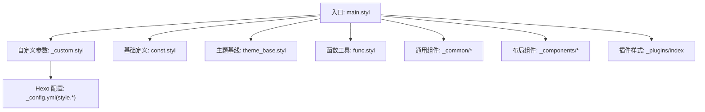
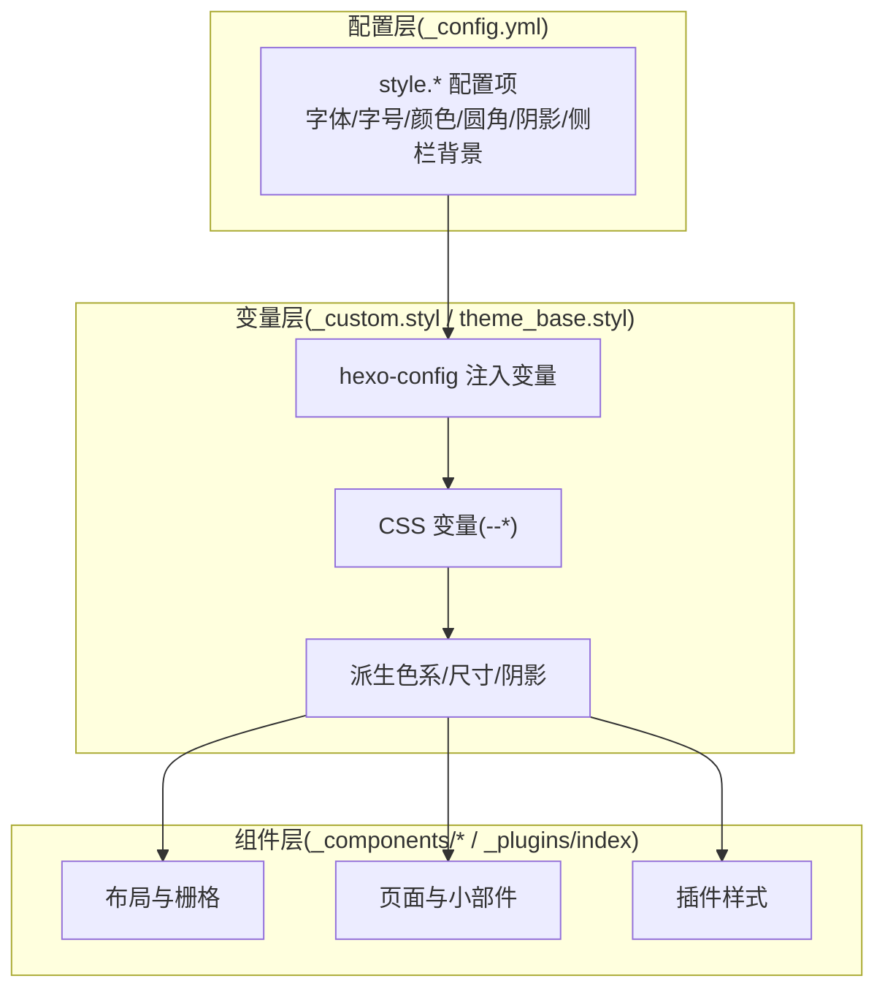
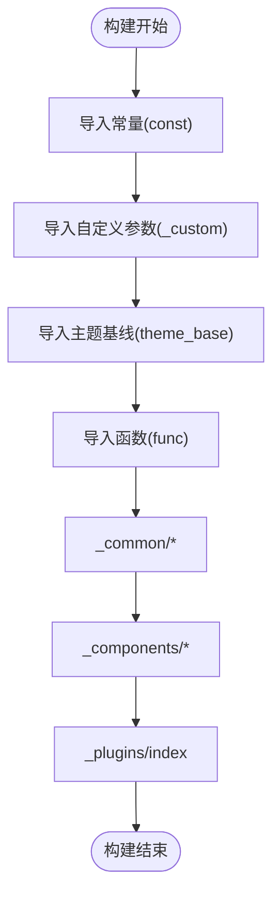
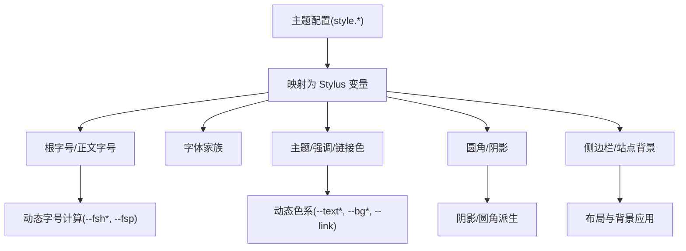
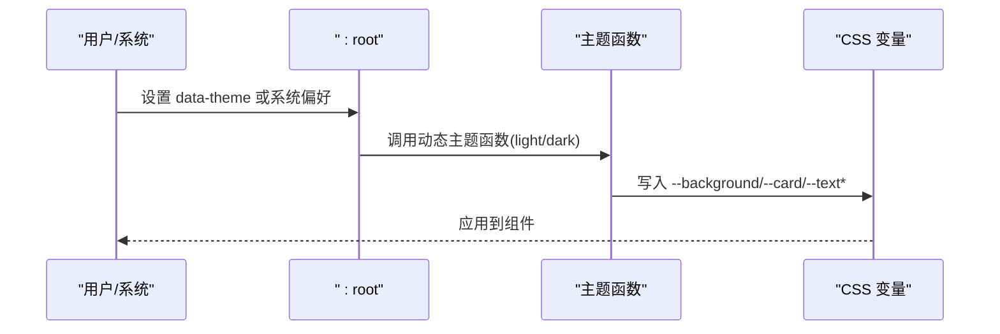
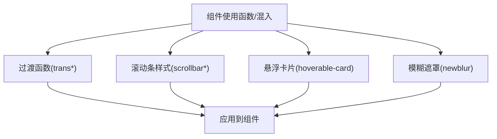
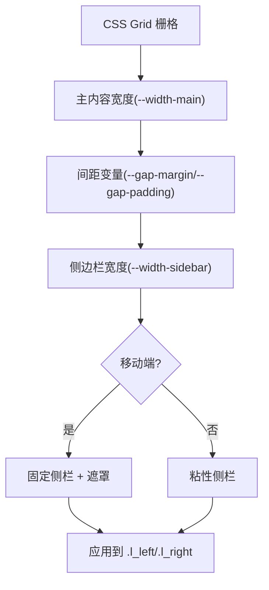
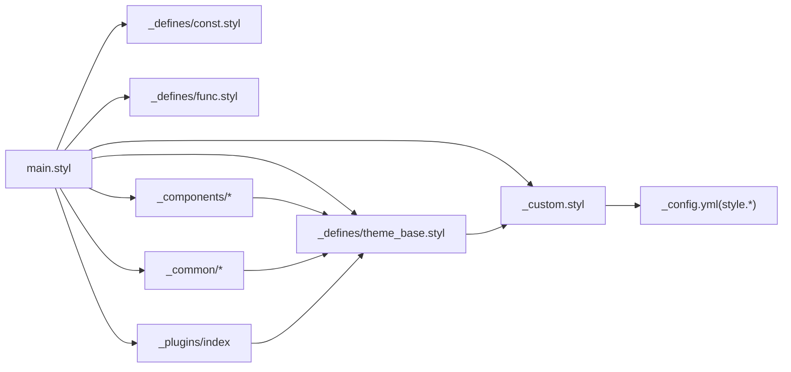

# 样式定制

<cite>
**本文引用的文件**   
- [themes/stellar/source/css/main.styl](file://themes/stellar/source/css/main.styl)
- [themes/stellar/source/css/_custom.styl](file://themes/stellar/source/css/_custom.styl)
- [themes/stellar/source/css/_defines/const.styl](file://themes/stellar/source/css/_defines/const.styl)
- [themes/stellar/source/css/_defines/theme_base.styl](file://themes/stellar/source/css/_defines/theme_base.styl)
- [themes/stellar/source/css/_defines/func.styl](file://themes/stellar/source/css/_defines/func.styl)
- [themes/stellar/source/css/_components/layout.styl](file://themes/stellar/source/css/_components/layout.styl)
- [themes/stellar/_config.yml](file://themes/stellar/_config.yml)
</cite>

## 目录
1. [简介](#简介)
2. [项目结构](#项目结构)
3. [核心组件](#核心组件)
4. [架构总览](#架构总览)
5. [详细组件分析](#详细组件分析)
6. [依赖关系分析](#依赖关系分析)
7. [性能考量](#性能考量)
8. [故障排查指南](#故障排查指南)
9. [结论](#结论)
10. [附录](#附录)

## 简介
本指南面向希望对 H1S97X 博客所使用的 Stellar 主题进行样式定制的读者，聚焦于 CSS 样式系统的架构与变量体系，涵盖样式文件组织、变量系统、组件化设计、主题色系、字体与字号、间距与布局、响应式策略，以及样式覆盖的最佳实践。文中提供可操作的定制路径与示例思路，帮助你安全地实现主题切换、暗黑模式、自定义配色等目标。

## 项目结构
Stellar 主题的样式系统以 Stylus 为主，采用“入口聚合 + 分层定义 + 组件拆分”的组织方式：
- 入口聚合：通过主入口文件集中导入各模块，确保构建顺序与作用域可控
- 分层定义：常量、主题色与函数等基础层，提供跨组件复用的能力
- 自定义参数：基于 Hexo 配置注入的可配置项，形成“配置即样式”的扩展点
- 组件化：布局、页面、插件等按功能拆分，便于按需覆盖与组合

**图示来源**
- [themes/stellar/source/css/main.styl](file://themes/stellar/source/css/main.styl#L1-L19)
- [themes/stellar/source/css/_custom.styl](file://themes/stellar/source/css/_custom.styl#L1-L105)
- [themes/stellar/source/css/_defines/const.styl](file://themes/stellar/source/css/_defines/const.styl#L1-L54)
- [themes/stellar/source/css/_defines/theme_base.styl](file://themes/stellar/source/css/_defines/theme_base.styl#L1-L107)
- [themes/stellar/source/css/_defines/func.styl](file://themes/stellar/source/css/_defines/func.styl#L1-L181)
- [themes/stellar/_config.yml](file://themes/stellar/_config.yml#L635-L698)

**章节来源**
- [themes/stellar/source/css/main.styl](file://themes/stellar/source/css/main.styl#L1-L19)
- [themes/stellar/source/css/_custom.styl](file://themes/stellar/source/css/_custom.styl#L1-L105)
- [themes/stellar/source/css/_defines/const.styl](file://themes/stellar/source/css/_defines/const.styl#L1-L54)
- [themes/stellar/source/css/_defines/theme_base.styl](file://themes/stellar/source/css/_defines/theme_base.styl#L1-L107)
- [themes/stellar/source/css/_defines/func.styl](file://themes/stellar/source/css/_defines/func.styl#L1-L181)
- [themes/stellar/_config.yml](file://themes/stellar/_config.yml#L635-L698)

## 核心组件
- 主入口与导入链：通过主入口集中导入常量、自定义参数、主题基线、函数、通用组件、布局组件与插件，保证构建顺序与作用域一致
- 自定义参数层：将 Hexo 配置映射为 Stylus 变量，形成“配置即样式”的可定制点，覆盖字体、字号、颜色、圆角、阴影等
- 主题色与动态色：通过主题色、强调色、链接色与动态色函数，生成透明度递减、背景与文本色系，支持明/暗与系统偏好联动
- 函数与混入：提供过渡、滚动条、悬浮卡片、模糊遮罩等通用样式行为，提升组件一致性
- 布局与响应式：基于 CSS Grid 与媒体查询，实现桌面、平板、手机的差异化布局与侧栏交互

**章节来源**
- [themes/stellar/source/css/main.styl](file://themes/stellar/source/css/main.styl#L1-L19)
- [themes/stellar/source/css/_custom.styl](file://themes/stellar/source/css/_custom.styl#L1-L105)
- [themes/stellar/source/css/_defines/theme_base.styl](file://themes/stellar/source/css/_defines/theme_base.styl#L1-L107)
- [themes/stellar/source/css/_defines/func.styl](file://themes/stellar/source/css/_defines/func.styl#L1-L181)
- [themes/stellar/source/css/_components/layout.styl](file://themes/stellar/source/css/_components/layout.styl#L1-L101)

## 架构总览
Stellar 样式系统采用“配置驱动 + 变量派生 + 组件化”的三层架构：
- 配置驱动：在主题配置中声明字体、字号、颜色、圆角、阴影、侧边栏背景等，Stylus 通过 hexo-config 注入变量
- 变量派生：在自定义参数层与主题基线层，将配置转换为 CSS 变量与派生色值，形成统一的视觉语义
- 组件化：布局、页面、插件样式按功能拆分，通过入口统一导入，便于覆盖与扩展

**图示来源**
- [themes/stellar/_config.yml](file://themes/stellar/_config.yml#L635-L698)
- [themes/stellar/source/css/_custom.styl](file://themes/stellar/source/css/_custom.styl#L1-L105)
- [themes/stellar/source/css/_defines/theme_base.styl](file://themes/stellar/source/css/_defines/theme_base.styl#L1-L107)
- [themes/stellar/source/css/_components/layout.styl](file://themes/stellar/source/css/_components/layout.styl#L1-L101)

## 详细组件分析

### 样式入口与导入链
- 入口文件负责导入常量、自定义参数、主题基线、函数、通用组件、布局组件与插件，确保变量与函数先于组件可用
- 自定义参数层在导入主题基线之前，使配置能够驱动主题色与动态色的生成

**图示来源**
- [themes/stellar/source/css/main.styl](file://themes/stellar/source/css/main.styl#L1-L19)

**章节来源**
- [themes/stellar/source/css/main.styl](file://themes/stellar/source/css/main.styl#L1-L19)

### 自定义参数与变量系统
- 字体与字号：通过 hexo-config 注入字体家族与字号，支持根字号、正文、代码、代码块的独立配置；同时提供标题与段落的动态字号计算
- 颜色体系：主题色、强调色、链接色通过配置注入，配合动态色函数生成透明度递减与文本/背景色系
- 圆角与阴影：卡片、条形、图片等圆角与多种阴影预设，统一组件外观
- 侧边栏与站点背景：支持纯色/渐变/图片背景，移动端与桌面端的宽度与间距通过 CSS 变量动态计算

**图示来源**
- [themes/stellar/source/css/_custom.styl](file://themes/stellar/source/css/_custom.styl#L1-L105)
- [themes/stellar/_config.yml](file://themes/stellar/_config.yml#L635-L698)

**章节来源**
- [themes/stellar/source/css/_custom.styl](file://themes/stellar/source/css/_custom.styl#L1-L105)
- [themes/stellar/_config.yml](file://themes/stellar/_config.yml#L635-L698)

### 主题色与动态色
- 主题色与强调色：通过函数将颜色转换为 HSLA，并生成带透明度的派生色
- 链接色：基于链接色生成不同透明度的链接样式
- 背景色与文本色：根据明/暗模式与系统偏好，生成背景、卡片、文本与元信息色
- 明/暗与系统偏好：支持 data-theme 属性与 prefers-color-scheme，实现主题切换与自动适配

**图示来源**
- [themes/stellar/source/css/_defines/theme_base.styl](file://themes/stellar/source/css/_defines/theme_base.styl#L66-L107)

**章节来源**
- [themes/stellar/source/css/_defines/theme_base.styl](file://themes/stellar/source/css/_defines/theme_base.styl#L1-L107)

### 函数与混入
- 过渡与动画：提供单/双/三/四属性过渡的便捷函数，统一动画时长与缓动
- 滚动条：提供通用滚动条样式与代码块专用滚动条样式，支持悬停高亮
- 悬浮卡片：在明/暗模式下分别提供悬浮与阴影效果，增强交互反馈
- 模糊遮罩：提供模糊与遮罩混合效果，用于卡片与导航等场景

**图示来源**
- [themes/stellar/source/css/_defines/func.styl](file://themes/stellar/source/css/_defines/func.styl#L1-L181)

**章节来源**
- [themes/stellar/source/css/_defines/func.styl](file://themes/stellar/source/css/_defines/func.styl#L1-L181)

### 布局与响应式
- 栅格与主容器：基于 CSS Grid 的三列布局，主内容宽度通过 CSS 变量控制，支持桌面、2K、4K 的宽度自适应
- 侧边栏与遮罩：在平板与手机端，侧边栏改为固定定位与滑入遮罩，提升移动端体验
- 间距系统：通过 --gap-margin 与 --gap-padding 动态计算最大间距，保证内容与元素的内外边距一致性

**图示来源**
- [themes/stellar/source/css/_components/layout.styl](file://themes/stellar/source/css/_components/layout.styl#L1-L101)

**章节来源**
- [themes/stellar/source/css/_components/layout.styl](file://themes/stellar/source/css/_components/layout.styl#L1-L101)

### 常量与设备断点
- 设备断点：内置移动、平板、桌面、2K、4K 等断点，用于媒体查询与响应式布局
- 预设色彩：提供多套品牌色与 Google 风格色板，便于快速选择与组合

**章节来源**
- [themes/stellar/source/css/_defines/const.styl](file://themes/stellar/source/css/_defines/const.styl#L1-L54)

## 依赖关系分析
- 入口依赖：主入口依赖常量、自定义参数、主题基线、函数，再依赖通用与布局组件、插件
- 自定义参数依赖：自定义参数依赖常量与 Hexo 配置，生成 CSS 变量与派生色
- 主题基线依赖：主题基线依赖自定义参数中的主题色与链接色，生成动态色系
- 组件依赖：布局组件依赖 CSS 变量与动态色，插件样式依赖组件与函数

**图示来源**
- [themes/stellar/source/css/main.styl](file://themes/stellar/source/css/main.styl#L1-L19)
- [themes/stellar/source/css/_custom.styl](file://themes/stellar/source/css/_custom.styl#L1-L105)
- [themes/stellar/source/css/_defines/theme_base.styl](file://themes/stellar/source/css/_defines/theme_base.styl#L1-L107)
- [themes/stellar/_config.yml](file://themes/stellar/_config.yml#L635-L698)

**章节来源**
- [themes/stellar/source/css/main.styl](file://themes/stellar/source/css/main.styl#L1-L19)
- [themes/stellar/source/css/_custom.styl](file://themes/stellar/source/css/_custom.styl#L1-L105)
- [themes/stellar/source/css/_defines/theme_base.styl](file://themes/stellar/source/css/_defines/theme_base.styl#L1-L107)
- [themes/stellar/_config.yml](file://themes/stellar/_config.yml#L635-L698)

## 性能考量
- 变量与函数复用：通过统一变量与函数减少重复计算与冗余样式
- 响应式断点：合理使用断点与媒体查询，避免过度嵌套与频繁重排
- 滚动条与模糊：滚动条与模糊遮罩在 hover 或交互时生效，降低常态下的渲染压力
- CSS 变量：优先使用 CSS 变量驱动布局与颜色，减少重绘与回流

## 故障排查指南
- 样式未生效
  - 检查自定义参数是否正确映射到 CSS 变量，确认入口导入顺序
  - 确认 data-theme 与系统偏好是否与预期一致
- 字体或字号异常
  - 检查主题配置中的字体与字号设置，确认 hexo-config 注入是否正确
- 移动端布局错乱
  - 检查断点与 CSS 变量，确认侧边栏固定定位与遮罩逻辑
- 颜色不随主题切换
  - 检查动态色函数与 data-theme 属性，确认明/暗模式分支

**章节来源**
- [themes/stellar/source/css/_custom.styl](file://themes/stellar/source/css/_custom.styl#L1-L105)
- [themes/stellar/source/css/_defines/theme_base.styl](file://themes/stellar/source/css/_defines/theme_base.styl#L66-L107)
- [themes/stellar/source/css/_components/layout.styl](file://themes/stellar/source/css/_components/layout.styl#L1-L101)

## 结论
Stellar 的样式系统以“配置驱动 + 变量派生 + 组件化”为核心，通过清晰的层次与可覆盖的变量体系，为主题定制提供了稳定而灵活的基础。遵循本文的定制路径与最佳实践，你可以安全地实现主题切换、暗黑模式、自定义配色与响应式优化，获得一致且可维护的视觉体验。

## 附录

### 样式定制最佳实践
- 使用 CSS 变量与 Stylus 变量：优先通过 CSS 变量驱动布局与颜色，减少硬编码
- 控制选择器优先级：避免深层嵌套，使用语义化类名，必要时通过局部作用域隔离
- 保持样式继承：利用主题色与动态色函数，确保组件在明/暗模式下的一致性
- 响应式优先：以断点与 CSS 变量为基础，逐步增强移动端体验
- 插件与组件分离：插件样式与组件样式分开维护，便于升级与覆盖

### 实际定制案例思路
- 主题切换
  - 在页面初始化时设置 data-theme，监听系统偏好变化并同步
  - 通过动态色函数生成明/暗模式的派生色，确保组件一致
- 暗黑模式
  - 使用 prefers-color-scheme 自动适配，或提供手动开关
  - 调整背景与文本色的亮度与饱和度，保证可读性
- 自定义配色方案
  - 在主题配置中设置主题色、强调色与链接色
  - 通过动态色函数生成透明度递减与文本/背景色系，统一组件外观