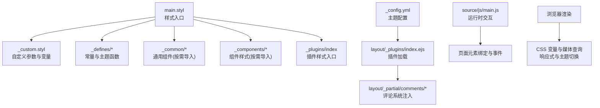
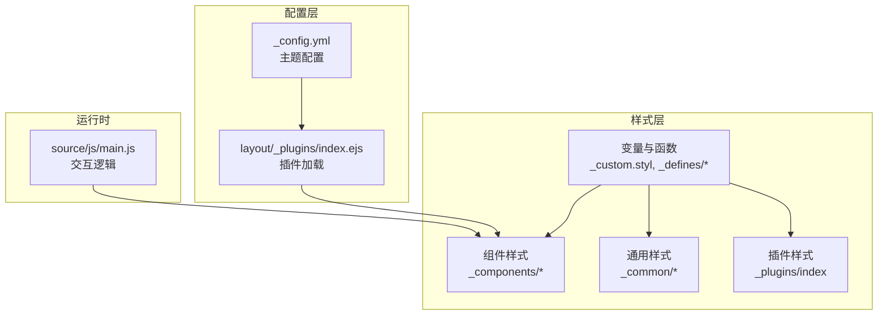
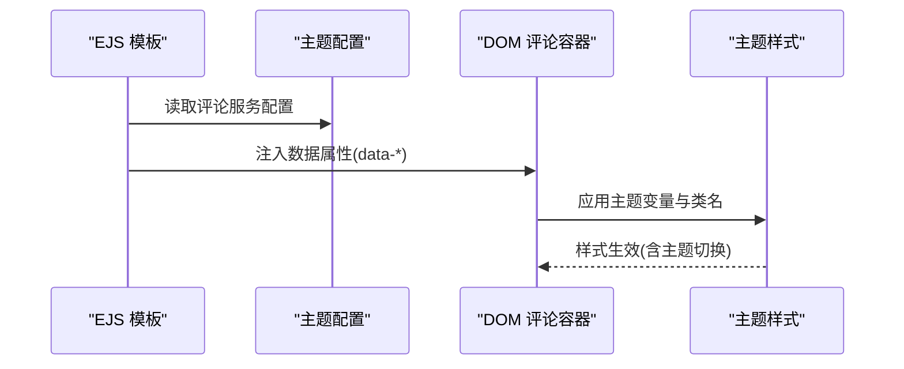
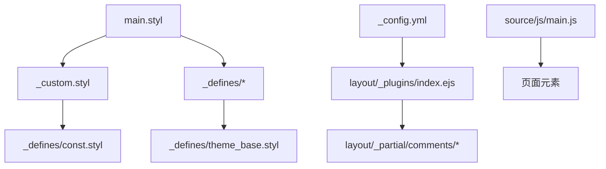

# 组件样式

<cite>
**本文引用的文件**
- [themes/stellar/source/css/main.styl](file://themes/stellar/source/css/main.styl)
- [themes/stellar/source/css/_custom.styl](file://themes/stellar/source/css/_custom.styl)
- [themes/stellar/source/css/_defines/const.styl](file://themes/stellar/source/css/_defines/const.styl)
- [themes/stellar/source/css/_defines/theme_base.styl](file://themes/stellar/source/css/_defines/theme_base.styl)
- [themes/stellar/_config.yml](file://themes/stellar/_config.yml)
- [themes/stellar/layout/_plugins/index.ejs](file://themes/stellar/layout/_plugins/index.ejs)
- [themes/stellar/layout/_partial/comments/giscus/layout.ejs](file://themes/stellar/layout/_partial/comments/giscus/layout.ejs)
- [themes/stellar/layout/_partial/comments/beaudar/layout.ejs](file://themes/stellar/layout/_partial/comments/beaudar/layout.ejs)
- [themes/stellar/layout/_partial/comments/utterances/layout.ejs](file://themes/stellar/layout/_partial/comments/utterances/layout.ejs)
- [themes/stellar/source/js/main.js](file://themes/stellar/source/js/main.js)
</cite>

## 目录
1. [简介](#简介)
2. [项目结构](#项目结构)
3. [核心组件](#核心组件)
4. [架构总览](#架构总览)
5. [详细组件分析](#详细组件分析)
6. [依赖关系分析](#依赖关系分析)
7. [性能考量](#性能考量)
8. [故障排查指南](#故障排查指南)
9. [结论](#结论)
10. [附录](#附录)

## 简介
本指南面向使用 H1S97X 博客中的 Stellar 主题的用户与开发者，聚焦“组件样式”的定制与扩展。内容涵盖标签插件、小部件、页眉页脚、文章组件等内置组件的样式覆盖机制、选择器优先级与样式继承规则，并提供按钮、卡片、导航菜单、评论系统、搜索框等常见组件的定制案例与调试方法。同时给出创建自定义组件样式与扩展现有组件功能的最佳实践。

## 项目结构
Stellar 主题的样式体系基于 Stylus 构建，入口样式文件负责组织常量、自定义参数、主题色系、通用组件与插件样式；配置文件集中管理主题行为与组件开关；评论与插件通过 EJS 模板注入；运行时 JS 提供交互与动态行为。

**图表来源**
- [themes/stellar/source/css/main.styl](file://themes/stellar/source/css/main.styl#L1-L19)
- [themes/stellar/source/css/_custom.styl](file://themes/stellar/source/css/_custom.styl#L1-L105)
- [themes/stellar/source/css/_defines/theme_base.styl](file://themes/stellar/source/css/_defines/theme_base.styl#L1-L107)
- [themes/stellar/_config.yml](file://themes/stellar/_config.yml#L523-L530)
- [themes/stellar/layout/_plugins/index.ejs](file://themes/stellar/layout/_plugins/index.ejs#L1-L25)
- [themes/stellar/layout/_partial/comments/giscus/layout.ejs](file://themes/stellar/layout/_partial/comments/giscus/layout.ejs#L1-L25)
- [themes/stellar/source/js/main.js](file://themes/stellar/source/js/main.js#L1-L200)

**章节来源**
- [themes/stellar/source/css/main.styl](file://themes/stellar/source/css/main.styl#L1-L19)
- [themes/stellar/source/css/_custom.styl](file://themes/stellar/source/css/_custom.styl#L1-L105)
- [themes/stellar/source/css/_defines/const.styl](file://themes/stellar/source/css/_defines/const.styl#L1-L54)
- [themes/stellar/source/css/_defines/theme_base.styl](file://themes/stellar/source/css/_defines/theme_base.styl#L1-L107)
- [themes/stellar/_config.yml](file://themes/stellar/_config.yml#L523-L530)
- [themes/stellar/layout/_plugins/index.ejs](file://themes/stellar/layout/_plugins/index.ejs#L1-L25)
- [themes/stellar/layout/_partial/comments/giscus/layout.ejs](file://themes/stellar/layout/_partial/comments/giscus/layout.ejs#L1-L25)
- [themes/stellar/layout/_partial/comments/beaudar/layout.ejs](file://themes/stellar/layout/_partial/comments/beaudar/layout.ejs#L1-L22)
- [themes/stellar/layout/_partial/comments/utterances/layout.ejs](file://themes/stellar/layout/_partial/comments/utterances/layout.ejs#L1-L22)
- [themes/stellar/source/js/main.js](file://themes/stellar/source/js/main.js#L1-L200)

## 核心组件
- 样式入口与组织
  - 入口文件按顺序导入常量、自定义参数、主题色系函数、通用组件、组件样式与插件样式，确保变量与函数先定义再使用。
  - 自定义参数文件集中定义字体、字号、颜色、圆角、阴影、CSS 变量等，便于全局覆盖。
  - 主题色系文件提供动态主题色、链接色、背景与文本色的生成函数，支持浅色/深色/自动模式。
- 配置驱动的组件与插件
  - 主题配置文件集中管理标签插件、评论系统、插件开关与资源注入，通过 EJS 模板按需加载。
  - 评论系统通过 EJS 注入 HTML 属性，结合 CSS 变量与主题模式实现一致的外观。
- 运行时交互
  - JS 提供 TOC 高亮、滚动定位、相对时间、标签页切换等交互，配合样式实现流畅体验。

**章节来源**
- [themes/stellar/source/css/main.styl](file://themes/stellar/source/css/main.styl#L1-L19)
- [themes/stellar/source/css/_custom.styl](file://themes/stellar/source/css/_custom.styl#L1-L105)
- [themes/stellar/source/css/_defines/theme_base.styl](file://themes/stellar/source/css/_defines/theme_base.styl#L1-L107)
- [themes/stellar/_config.yml](file://themes/stellar/_config.yml#L377-L452)
- [themes/stellar/layout/_plugins/index.ejs](file://themes/stellar/layout/_plugins/index.ejs#L1-L25)
- [themes/stellar/layout/_partial/comments/giscus/layout.ejs](file://themes/stellar/layout/_partial/comments/giscus/layout.ejs#L1-L25)
- [themes/stellar/source/js/main.js](file://themes/stellar/source/js/main.js#L97-L200)

## 架构总览
Stellar 的样式架构遵循“变量先行、函数派生、组件按需”的原则。变量与函数位于 _custom.styl 与 _defines 下，组件样式通过 main.styl 统一导入，插件样式通过 _plugins/index 组织。评论系统与插件通过 EJS 注入，运行时 JS 提供交互。

**图表来源**
- [themes/stellar/source/css/main.styl](file://themes/stellar/source/css/main.styl#L12-L18)
- [themes/stellar/source/css/_custom.styl](file://themes/stellar/source/css/_custom.styl#L1-L105)
- [themes/stellar/_config.yml](file://themes/stellar/_config.yml#L523-L530)
- [themes/stellar/layout/_plugins/index.ejs](file://themes/stellar/layout/_plugins/index.ejs#L1-L25)
- [themes/stellar/source/js/main.js](file://themes/stellar/source/js/main.js#L1-L200)

## 详细组件分析

### 标签插件（Note/Box/Button/Timeline 等）
- 覆盖机制
  - 通过主题配置文件中的标签插件段落设置默认颜色、边框、布局、尺寸等参数，这些参数最终映射到组件的 CSS 类与内联样式。
  - 自定义样式可通过在站点的自定义样式文件中覆盖对应类名与变量，实现插件外观的统一定制。
- 选择器优先级
  - 标签插件通常生成语义化的 HTML 结构与类名，优先使用类选择器进行覆盖；必要时可提升选择器权重或使用 !important（谨慎）。
- 样式继承
  - 插件样式继承自主题的字体、字号、颜色与圆角等变量，确保与整体风格一致。
- 常见定制案例
  - 按钮：在配置中设置默认颜色，或在自定义样式中针对按钮类名调整背景、边框、阴影与悬停效果。
  - 卡片：针对 note/timeline 等容器类名调整圆角、阴影、内边距与边框。
  - 时间线：通过配置项设置最大高度与布局，必要时在自定义样式中微调间距与对齐。
- 调试方法
  - 使用浏览器开发者工具检查生成的 HTML 结构与类名，确认选择器命中与变量生效。
  - 临时添加边框或背景色以快速定位覆盖范围。

**章节来源**
- [themes/stellar/_config.yml](file://themes/stellar/_config.yml#L377-L452)
- [themes/stellar/source/css/_custom.styl](file://themes/stellar/source/css/_custom.styl#L1-L105)

### 小部件（Widgets）
- 覆盖机制
  - 小部件的布局与样式由主题配置与组件样式共同决定。通过配置文件控制左右侧栏的组件排列与展示，样式层面通过通用与组件样式文件组织。
- 选择器优先级
  - 小部件通常具有明确的容器类名，优先使用容器类名限定作用域，避免全局污染。
- 样式继承
  - 小部件继承主题的字体、字号、颜色与圆角等变量，保持一致性。
- 常见定制案例
  - 侧栏宽度：通过 CSS 变量调整侧栏内容宽度，适配不同屏幕尺寸。
  - 卡片圆角与阴影：针对小部件容器类名调整圆角与阴影，突出层次感。
- 调试方法
  - 检查侧栏容器类名与组件类名，确认变量与媒体查询生效。

**章节来源**
- [themes/stellar/_config.yml](file://themes/stellar/_config.yml#L72-L152)
- [themes/stellar/source/css/_custom.styl](file://themes/stellar/source/css/_custom.styl#L66-L98)

### 页眉与页脚（Header/Footer）
- 覆盖机制
  - 页眉与页脚的结构由模板与配置共同决定。页眉包含菜单、Logo、搜索等，页脚包含社交链接与版权信息。
  - 通过配置文件设置 Logo、菜单项、社交链接与页脚内容，样式层面通过组件样式文件组织。
- 选择器优先级
  - 页眉与页脚通常具有独立的容器类名，优先使用容器类名限定作用域。
- 样式继承
  - 页眉与页脚继承主题的整体配色与字体，确保视觉统一。
- 常见定制案例
  - 菜单高亮色：通过配置项设置菜单高亮色，结合组件样式调整悬停与激活态。
  - 社交图标：通过配置项设置图标与链接，必要时在自定义样式中调整尺寸与间距。
- 调试方法
  - 使用浏览器开发者工具检查页眉与页脚的容器类名与菜单项类名，确认样式覆盖生效。

**章节来源**
- [themes/stellar/_config.yml](file://themes/stellar/_config.yml#L34-L69)
- [themes/stellar/_config.yml](file://themes/stellar/_config.yml#L331-L371)

### 文章组件（文章内页、目录、封面、横幅等）
- 覆盖机制
  - 文章组件的布局与样式由主题配置与组件样式共同决定。通过配置文件设置文章类型、缩进、封面与横幅比例、自动横幅等。
  - 运行时 JS 提供目录高亮与滚动定位、相对时间等功能，配合样式实现流畅体验。
- 选择器优先级
  - 文章容器与目录容器通常具有明确的类名，优先使用类名限定作用域。
- 样式继承
  - 文章组件继承主题的字体、字号、颜色与圆角等变量，确保阅读体验一致。
- 常见定制案例
  - 目录高亮：针对目录链接类名调整激活态颜色与滚动行为。
  - 封面与横幅：通过配置项设置比例与自动横幅，必要时在自定义样式中调整尺寸与对齐。
- 调试方法
  - 使用浏览器开发者工具检查文章容器类名与目录类名，确认 JS 事件绑定与样式覆盖生效。

**章节来源**
- [themes/stellar/_config.yml](file://themes/stellar/_config.yml#L179-L205)
- [themes/stellar/source/js/main.js](file://themes/stellar/source/js/main.js#L97-L173)

### 评论系统（Giscus/Beaudar/Utterances 等）
- 覆盖机制
  - 评论系统通过 EJS 模板注入 HTML 属性，结合主题配置与 CSS 变量实现一致外观。当主题设置为非自动模式时，评论系统会强制使用指定主题。
- 选择器优先级
  - 评论容器具有独立的 ID 与类名，优先使用 ID 与类名限定作用域。
- 样式继承
  - 评论系统继承主题的整体配色与字体，确保与页面风格一致。
- 常见定制案例
  - 主题切换：通过配置项设置评论系统的主题，必要时在自定义样式中调整容器背景与边框。
  - 输入位置：通过配置项设置评论框位置，必要时在自定义样式中微调布局。
- 调试方法
  - 使用浏览器开发者工具检查评论容器的属性与类名，确认主题与布局生效。

**图表来源**
- [themes/stellar/layout/_partial/comments/giscus/layout.ejs](file://themes/stellar/layout/_partial/comments/giscus/layout.ejs#L1-L25)
- [themes/stellar/layout/_partial/comments/beaudar/layout.ejs](file://themes/stellar/layout/_partial/comments/beaudar/layout.ejs#L1-L22)
- [themes/stellar/layout/_partial/comments/utterances/layout.ejs](file://themes/stellar/layout/_partial/comments/utterances/layout.ejs#L1-L22)
- [themes/stellar/_config.yml](file://themes/stellar/_config.yml#L220-L264)

**章节来源**
- [themes/stellar/layout/_partial/comments/giscus/layout.ejs](file://themes/stellar/layout/_partial/comments/giscus/layout.ejs#L1-L25)
- [themes/stellar/layout/_partial/comments/beaudar/layout.ejs](file://themes/stellar/layout/_partial/comments/beaudar/layout.ejs#L1-L22)
- [themes/stellar/layout/_partial/comments/utterances/layout.ejs](file://themes/stellar/layout/_partial/comments/utterances/layout.ejs#L1-L22)
- [themes/stellar/_config.yml](file://themes/stellar/_config.yml#L220-L264)

### 搜索框（Search）
- 覆盖机制
  - 搜索服务通过配置文件选择本地搜索或其他服务，插件加载逻辑在 EJS 中根据配置动态注入。
- 选择器优先级
  - 搜索容器具有独立的类名，优先使用类名限定作用域。
- 样式继承
  - 搜索框继承主题的整体配色与字体，确保与页面风格一致。
- 常见定制案例
  - 搜索结果样式：针对搜索结果列表类名调整列表项、高亮与交互效果。
  - 搜索输入框：通过配置项设置占位符与样式，必要时在自定义样式中调整边框与阴影。
- 调试方法
  - 使用浏览器开发者工具检查搜索容器类名与输入框属性，确认样式覆盖生效。

**章节来源**
- [themes/stellar/_config.yml](file://themes/stellar/_config.yml#L206-L218)
- [themes/stellar/layout/_plugins/index.ejs](file://themes/stellar/layout/_plugins/index.ejs#L1-L25)

### 创建自定义组件样式与扩展现有组件
- 自定义组件样式
  - 在站点的自定义样式文件中新增组件类名与变量，确保在 main.styl 导入顺序中位于变量与函数之后，避免被覆盖。
  - 使用 CSS 变量与媒体查询实现响应式与主题切换，避免硬编码。
- 扩展现有组件功能
  - 通过配置文件扩展插件与组件行为，必要时在 EJS 中增加注入逻辑或在 JS 中扩展交互。
  - 保持最小改动原则，优先使用现有类名与变量，减少选择器复杂度。

**章节来源**
- [themes/stellar/source/css/main.styl](file://themes/stellar/source/css/main.styl#L1-L19)
- [themes/stellar/source/css/_custom.styl](file://themes/stellar/source/css/_custom.styl#L1-L105)
- [themes/stellar/_config.yml](file://themes/stellar/_config.yml#L523-L530)
- [themes/stellar/layout/_plugins/index.ejs](file://themes/stellar/layout/_plugins/index.ejs#L1-L25)

## 依赖关系分析
- 样式依赖
  - main.styl 依赖 _custom.styl 与 _defines 下的常量与函数，再导入通用与组件样式，最后导入插件样式。
  - _custom.styl 依赖 _defines/const.styl 的设备断点与预设颜色。
  - _defines/theme_base.styl 提供动态主题色与文本色函数，供全局使用。
- 配置依赖
  - _config.yml 的各段落控制标签插件、评论系统、插件开关与资源注入，EJS 模板按需加载。
- 运行时依赖
  - JS 依赖 jQuery 与主题提供的工具函数，负责交互与动态行为。

**图表来源**
- [themes/stellar/source/css/main.styl](file://themes/stellar/source/css/main.styl#L1-L19)
- [themes/stellar/source/css/_custom.styl](file://themes/stellar/source/css/_custom.styl#L1-L105)
- [themes/stellar/source/css/_defines/const.styl](file://themes/stellar/source/css/_defines/const.styl#L1-L54)
- [themes/stellar/source/css/_defines/theme_base.styl](file://themes/stellar/source/css/_defines/theme_base.styl#L1-L107)
- [themes/stellar/_config.yml](file://themes/stellar/_config.yml#L523-L530)
- [themes/stellar/layout/_plugins/index.ejs](file://themes/stellar/layout/_plugins/index.ejs#L1-L25)
- [themes/stellar/layout/_partial/comments/giscus/layout.ejs](file://themes/stellar/layout/_partial/comments/giscus/layout.ejs#L1-L25)
- [themes/stellar/source/js/main.js](file://themes/stellar/source/js/main.js#L1-L200)

**章节来源**
- [themes/stellar/source/css/main.styl](file://themes/stellar/source/css/main.styl#L1-L19)
- [themes/stellar/source/css/_custom.styl](file://themes/stellar/source/css/_custom.styl#L1-L105)
- [themes/stellar/source/css/_defines/const.styl](file://themes/stellar/source/css/_defines/const.styl#L1-L54)
- [themes/stellar/source/css/_defines/theme_base.styl](file://themes/stellar/source/css/_defines/theme_base.styl#L1-L107)
- [themes/stellar/_config.yml](file://themes/stellar/_config.yml#L523-L530)
- [themes/stellar/layout/_plugins/index.ejs](file://themes/stellar/layout/_plugins/index.ejs#L1-L25)
- [themes/stellar/layout/_partial/comments/giscus/layout.ejs](file://themes/stellar/layout/_partial/comments/giscus/layout.ejs#L1-L25)
- [themes/stellar/source/js/main.js](file://themes/stellar/source/js/main.js#L1-L200)

## 性能考量
- 样式加载
  - 通过 main.styl 统一导入，避免重复加载与顺序问题；按需导入通用与组件样式，减少无关样式体积。
- 响应式与主题切换
  - 使用 CSS 变量与媒体查询，减少重复声明；动态主题色与文本色函数集中管理，降低维护成本。
- 交互性能
  - JS 交互采用节流与观察者模式，避免频繁重排与重绘；滚动定位与相对时间计算尽量轻量化。

[本节为通用指导，无需列出章节来源]

## 故障排查指南
- 样式未生效
  - 检查自定义样式文件是否在 main.styl 中正确导入，确认导入顺序在变量与函数之后。
  - 使用浏览器开发者工具检查选择器权重与 !important 使用，避免被默认样式覆盖。
- 主题切换异常
  - 确认 CSS 变量与动态主题色函数已正确应用；检查 data-theme 属性与 prefers-color-scheme。
- 评论系统主题不一致
  - 检查评论容器的数据属性是否正确注入；确认非自动模式下的主题强制设置。
- 目录高亮与滚动异常
  - 检查目录容器类名与标题层级；确认 JS 事件绑定与滚动偏移设置。

**章节来源**
- [themes/stellar/source/css/main.styl](file://themes/stellar/source/css/main.styl#L1-L19)
- [themes/stellar/source/css/_custom.styl](file://themes/stellar/source/css/_custom.styl#L66-L105)
- [themes/stellar/layout/_partial/comments/giscus/layout.ejs](file://themes/stellar/layout/_partial/comments/giscus/layout.ejs#L8-L10)
- [themes/stellar/source/js/main.js](file://themes/stellar/source/js/main.js#L97-L173)

## 结论
通过变量先行、函数派生与组件按需导入的样式架构，Stellar 主题提供了清晰的定制路径。遵循选择器优先级与样式继承规则，结合配置驱动与 EJS 注入，可高效完成标签插件、小部件、页眉页脚、文章组件与评论系统的样式定制。配合调试方法与最佳实践，可在保证性能与一致性的前提下实现丰富的个性化效果。

[本节为总结性内容，无需列出章节来源]

## 附录
- 常用变量与类名定位
  - 变量：字体、字号、颜色、圆角、阴影、CSS 变量等集中在自定义样式文件中。
  - 类名：标签插件、小部件、页眉页脚、文章组件与评论系统均具有明确的类名，便于覆盖。
- 配置项速览
  - 标签插件：note、checkbox、quot、emoji、icon、button、image、copy、timeline、mark、hashtag、okr、gallery 等。
  - 评论系统：beaudar、utterances、giscus、twikoo、waline、artalk 等。
  - 插件：preload、fancybox、swiper、scrollreveal、katex、mathjax、mermaid、copycode、heti 等。

**章节来源**
- [themes/stellar/_config.yml](file://themes/stellar/_config.yml#L377-L452)
- [themes/stellar/_config.yml](file://themes/stellar/_config.yml#L220-L330)
- [themes/stellar/_config.yml](file://themes/stellar/_config.yml#L523-L632)