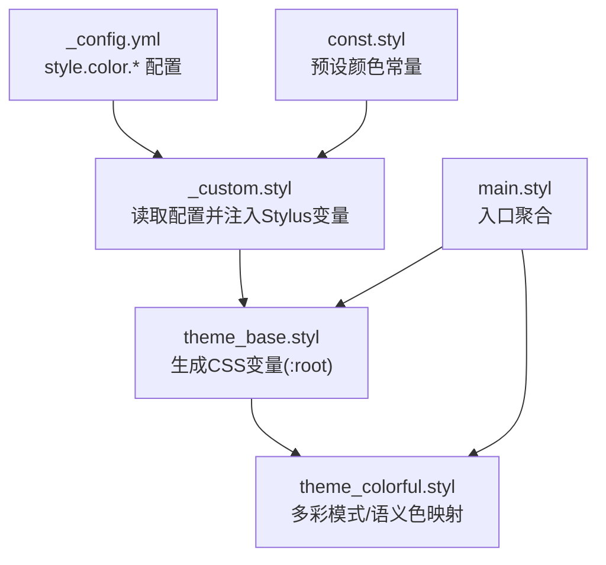
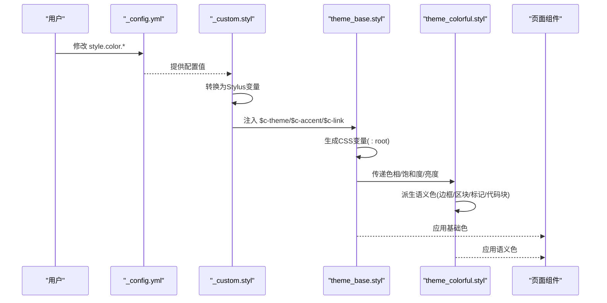
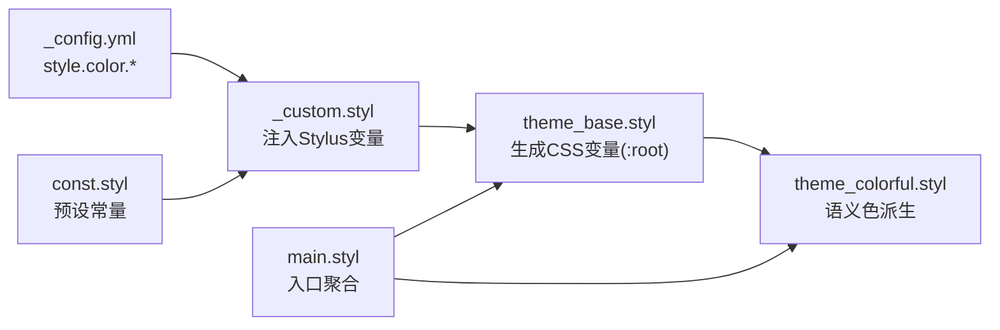

# 颜色系统

<cite>
**本文引用的文件**
- [_config.yml](file://themes/stellar/_config.yml)
- [main.styl](file://themes/stellar/source/css/main.styl)
- [const.styl](file://themes/stellar/source/css/_defines/const.styl)
- [theme_base.styl](file://themes/stellar/source/css/_defines/theme_base.styl)
- [theme_colorful.styl](file://themes/stellar/source/css/_defines/theme_colorful.styl)
- [_custom.styl](file://themes/stellar/source/css/_custom.styl)
</cite>

## 目录
1. [简介](#简介)
2. [项目结构](#项目结构)
3. [核心组件](#核心组件)
4. [架构总览](#架构总览)
5. [详细组件分析](#详细组件分析)
6. [依赖关系分析](#依赖关系分析)
7. [性能考量](#性能考量)
8. [故障排查指南](#故障排查指南)
9. [结论](#结论)
10. [附录](#附录)

## 简介
本指南面向H1S97X博客Stellar主题的颜色系统定制，聚焦CSS变量驱动的颜色定义体系，涵盖基础色、主题色、语义色与背景色的配置方法；详解如何修改主色调、强调色、文字色、边框色与阴影色；给出颜色变量命名规范与在组件中的引用方式；并提供颜色对比度检查、可访问性与跨设备兼容性建议，以及品牌色彩适配与节日主题变体的实际案例。

## 项目结构
Stellar主题的颜色系统由配置层与样式层协同构成：
- 配置层：通过主题配置文件读取用户设定的颜色值
- 样式层：通过Stylus变量与函数计算生成CSS变量，再由组件引用

**图表来源**
- [_config.yml](file://themes/stellar/_config.yml#L635-L698)
- [_custom.styl](file://themes/stellar/source/css/_custom.styl#L38-L44)
- [theme_base.styl](file://themes/stellar/source/css/_defines/theme_base.styl#L88-L106)
- [theme_colorful.styl](file://themes/stellar/source/css/_defines/theme_colorful.styl#L1-L118)
- [const.styl](file://themes/stellar/source/css/_defines/const.styl#L13-L52)
- [main.styl](file://themes/stellar/source/css/main.styl#L1-L19)

**章节来源**
- [main.styl](file://themes/stellar/source/css/main.styl#L1-L19)
- [_config.yml](file://themes/stellar/_config.yml#L635-L698)

## 核心组件
- 颜色配置入口：在主题配置中设置主色、强调色、链接色
- Stylus变量注入：将配置转换为Stylus变量，供样式层使用
- CSS变量生成：在根节点生成主题色、强调色、链接色及动态背景/文本色
- 多彩模式：按色相派生边框、区块、标记、代码块等语义色
- 预设常量：提供常用品牌色与Material Design色板，便于复用

关键路径参考：
- 配置项位置：[style.color.*](file://themes/stellar/_config.yml#L658-L662)
- 注入与计算：[_custom.styl](file://themes/stellar/source/css/_custom.styl#L38-L44)、[theme_base.styl](file://themes/stellar/source/css/_defines/theme_base.styl#L88-L106)
- 多彩映射：[theme_colorful.styl](file://themes/stellar/source/css/_defines/theme_colorful.styl#L1-L118)
- 预设常量：[const.styl](file://themes/stellar/source/css/_defines/const.styl#L13-L52)

**章节来源**
- [_config.yml](file://themes/stellar/_config.yml#L658-L662)
- [_custom.styl](file://themes/stellar/source/css/_custom.styl#L38-L44)
- [theme_base.styl](file://themes/stellar/source/css/_defines/theme_base.styl#L88-L106)
- [theme_colorful.styl](file://themes/stellar/source/css/_defines/theme_colorful.styl#L1-L118)
- [const.styl](file://themes/stellar/source/css/_defines/const.styl#L13-L52)

## 架构总览
Stellar颜色系统采用“配置→变量→CSS变量→组件”的链路，确保主题色与语义色在明/暗模式下保持一致的视觉节奏。

**图表来源**
- [_config.yml](file://themes/stellar/_config.yml#L658-L662)
- [_custom.styl](file://themes/stellar/source/css/_custom.styl#L38-L44)
- [theme_base.styl](file://themes/stellar/source/css/_defines/theme_base.styl#L88-L106)
- [theme_colorful.styl](file://themes/stellar/source/css/_defines/theme_colorful.styl#L1-L118)

## 详细组件分析

### 配置层：style.color.*
- 主题色：用于主导航、按钮、高亮等
- 强调色：用于装饰、图标、次要交互
- 链接色：用于超链接与可点击元素

配置项位置与含义：
- 主题色：[style.color.theme](file://themes/stellar/_config.yml#L660)
- 强调色：[style.color.accent](file://themes/stellar/_config.yml#L661)
- 链接色：[style.color.link](file://themes/stellar/_config.yml#L662)

建议：
- 使用HSL/HSLA值以获得更好的明暗一致性
- 与无障碍对比度要求匹配（见后文）

**章节来源**
- [_config.yml](file://themes/stellar/_config.yml#L658-L662)

### 样式层：_custom.styl
- 将配置转换为Stylus变量，供后续计算使用
- 定义基础色变量：$c-theme、$c-accent、$c-link
- 定义基础色调：$c-base-hue（影响背景/文本色主基调）

关键路径：
- 变量注入：[_custom.styl](file://themes/stellar/source/css/_custom.styl#L38-L44)
- 基础色调：[_custom.styl](file://themes/stellar/source/css/_custom.styl#L43)

**章节来源**
- [_custom.styl](file://themes/stellar/source/css/_custom.styl#L38-L44)

### 核心：theme_base.styl
- 生成CSS变量：主题色、强调色、链接色
- 动态生成背景色与文本色：浅色/深色模式
- 生成透明度递减的背景与文本色系

关键函数与作用：
- 通用hsla函数：[x-hsla](file://themes/stellar/source/css/_defines/theme_base.styl#L1-L4)
- 主题色透明度系：[x-theme-alpha](file://themes/stellar/source/css/_defines/theme_base.styl#L5-L8)
- 主题色设定：[x-set-theme-with-color](file://themes/stellar/source/css/_defines/theme_base.styl#L9-L19)
- 链接色设定：[x-set-link-with-color](file://themes/stellar/source/css/_defines/theme_base.styl#L20-L27)
- 背景色系：[x-set-bg-colors](file://themes/stellar/source/css/_defines/theme_base.styl#L28-L38)
- 文本色系：[x-set-text-colors](file://themes/stellar/source/css/_defines/theme_base.styl#L39-L63)
- 明/暗模式应用：[dynamic-theme-light/dynamic-theme-dark](file://themes/stellar/source/css/_defines/theme_base.styl#L66-L86)
- 根节点变量生成：[:root规则](file://themes/stellar/source/css/_defines/theme_base.styl#L88-L106)

**章节来源**
- [theme_base.styl](file://themes/stellar/source/css/_defines/theme_base.styl#L1-L106)

### 多彩模式：theme_colorful.styl
- 按色相派生语义色：边框、区块、标记、代码块
- 支持light/dark两种派生策略
- 提供常用语义色别名：warning/error
- 支持在组件上添加colorful属性以切换主题色

关键路径：
- 多彩派生：[x-set-theme-colorful](file://themes/stellar/source/css/_defines/theme_colorful.styl#L2-L32)
- 语义色映射：[标签与colorful类](file://themes/stellar/source/css/_defines/theme_colorful.styl#L33-L117)

**章节来源**
- [theme_colorful.styl](file://themes/stellar/source/css/_defines/theme_colorful.styl#L1-L118)

### 预设常量：const.styl
- 提供常用品牌色与Material Design色板
- 便于在配置或组件中直接引用

关键路径：
- 预设色常量：[const.styl](file://themes/stellar/source/css/_defines/const.styl#L13-L52)

**章节来源**
- [const.styl](file://themes/stellar/source/css/_defines/const.styl#L13-L52)

### 入口聚合：main.styl
- 聚合常量、自定义参数、主题基线与组件样式
- 保证颜色系统在各模块中生效

关键路径：
- 样式导入顺序：[main.styl](file://themes/stellar/source/css/main.styl#L1-L19)

**章节来源**
- [main.styl](file://themes/stellar/source/css/main.styl#L1-L19)

## 依赖关系分析
颜色系统内部依赖关系如下：

**图表来源**
- [_config.yml](file://themes/stellar/_config.yml#L658-L662)
- [_custom.styl](file://themes/stellar/source/css/_custom.styl#L38-L44)
- [const.styl](file://themes/stellar/source/css/_defines/const.styl#L13-L52)
- [theme_base.styl](file://themes/stellar/source/css/_defines/theme_base.styl#L88-L106)
- [theme_colorful.styl](file://themes/stellar/source/css/_defines/theme_colorful.styl#L1-L118)
- [main.styl](file://themes/stellar/source/css/main.styl#L1-L19)

**章节来源**
- [main.styl](file://themes/stellar/source/css/main.styl#L1-L19)
- [theme_base.styl](file://themes/stellar/source/css/_defines/theme_base.styl#L88-L106)
- [theme_colorful.styl](file://themes/stellar/source/css/_defines/theme_colorful.styl#L1-L118)
- [_custom.styl](file://themes/stellar/source/css/_custom.styl#L38-L44)
- [const.styl](file://themes/stellar/source/css/_defines/const.styl#L13-L52)

## 性能考量
- CSS变量计算在构建阶段完成，运行时仅读取，性能开销极低
- 多彩模式通过色相派生，避免重复定义，降低样式体积
- 建议优先使用HSL/HSLA值，减少颜色空间转换带来的计算成本

## 故障排查指南
常见问题与定位要点：
- 主题色未生效
  - 检查配置项是否存在且值合法：[style.color.*](file://themes/stellar/_config.yml#L658-L662)
  - 确认Stylus变量已注入：[_custom.styl](file://themes/stellar/source/css/_custom.styl#L38-L44)
  - 检查根节点变量生成：[:root规则](file://themes/stellar/source/css/_defines/theme_base.styl#L88-L106)
- 明/暗模式颜色异常
  - 检查明/暗模式函数应用：[dynamic-theme-light/dynamic-theme-dark](file://themes/stellar/source/css/_defines/theme_base.styl#L66-L86)
  - 检查系统偏好与data-theme属性是否正确：[:root[data-theme]](file://themes/stellar/source/css/_defines/theme_base.styl#L102-L105)
- 语义色不符合预期
  - 检查多彩模式映射：[theme_colorful.styl](file://themes/stellar/source/css/_defines/theme_colorful.styl#L1-L118)
  - 确认组件是否正确引用CSS变量

**章节来源**
- [_config.yml](file://themes/stellar/_config.yml#L658-L662)
- [_custom.styl](file://themes/stellar/source/css/_custom.styl#L38-L44)
- [theme_base.styl](file://themes/stellar/source/css/_defines/theme_base.styl#L66-L106)
- [theme_colorful.styl](file://themes/stellar/source/css/_defines/theme_colorful.styl#L1-L118)

## 结论
Stellar主题的颜色系统以CSS变量为核心，结合Stylus配置注入与色相派生机制，实现了主题色、语义色与明/暗模式的一致性与可扩展性。通过合理配置style.color.*与遵循命名规范，即可快速完成品牌适配与节日主题变体等定制需求。

## 附录

### 颜色变量命名规范
- 基础色
  - 主题色：--theme
  - 强调色：--accent
  - 链接色：--link
- 背景色系：--bg-a20/50/60/75/100
- 文本色系：--text、--text-reverse、--text-p1/p2/p3/p4、--text-meta、--text-code、--text-a10/20
- 语义色系：--theme-border、--theme-block、--theme-mark、--theme-codeblock
- 组件引用示例（路径）
  - 基础色引用：[theme_base.styl](file://themes/stellar/source/css/_defines/theme_base.styl#L88-L106)
  - 语义色引用：[theme_colorful.styl](file://themes/stellar/source/css/_defines/theme_colorful.styl#L33-L37)

### 修改主色调、强调色、文字色、边框色与阴影色
- 主色调/强调色/链接色
  - 在配置中设置：[style.color.*](file://themes/stellar/_config.yml#L658-L662)
  - 注入与生成：[_custom.styl](file://themes/stellar/source/css/_custom.styl#L38-L44)、[theme_base.styl](file://themes/stellar/source/css/_defines/theme_base.styl#L88-L106)
- 文字色
  - 由明/暗模式函数生成：[x-set-text-colors](file://themes/stellar/source/css/_defines/theme_base.styl#L39-L63)
- 边框色
  - 由多彩模式派生：[x-set-theme-colorful](file://themes/stellar/source/css/_defines/theme_colorful.styl#L2-L32)
- 阴影色
  - 在样式中使用rgba值定义：[_custom.styl](file://themes/stellar/source/css/_custom.styl#L100-L105)

### 可访问性与对比度建议
- 对比度
  - 文本与背景：建议不低于4.5:1（AA标准），重要文本建议达到7:1（AAA）
  - 图标与按钮：建议与背景对比度≥3:1
- 色盲友好
  - 避免仅用红/绿区分信息
  - 使用形状、纹理或标签补充语义
- 明/暗模式
  - 确保在两种模式下均满足对比度要求
  - 深色模式下适当提高文本饱和度与亮度

### 跨设备兼容性建议
- 移动端
  - 优先使用相对单位与CSS变量，避免固定像素导致的缩放问题
  - 在小屏设备上适度降低阴影强度，提升滚动性能
- 高分辨率屏幕
  - 适当增大主内容宽度变量，提升阅读舒适度
- 系统偏好
  - 通过data-theme与prefers-color-scheme实现自动切换

### 实际定制案例
- 品牌色彩适配
  - 使用品牌色作为主题色，强调色用于次要交互，链接色用于可点击元素
  - 参考路径：[style.color.*](file://themes/stellar/_config.yml#L658-L662)、[theme_base.styl](file://themes/stellar/source/css/_defines/theme_base.styl#L88-L106)
- 节日主题变体
  - 通过多彩模式快速切换语义色（如红色/绿色主题）
  - 参考路径：[theme_colorful.styl](file://themes/stellar/source/css/_defines/theme_colorful.styl#L39-L58)