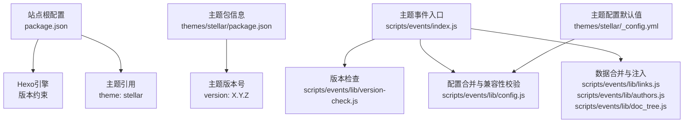
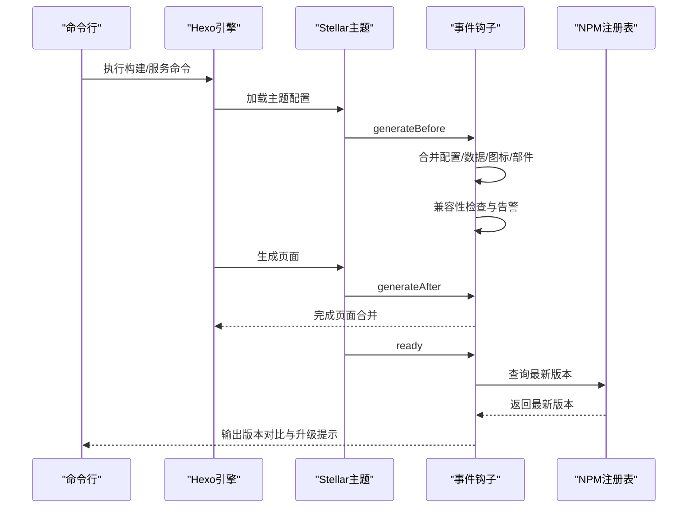
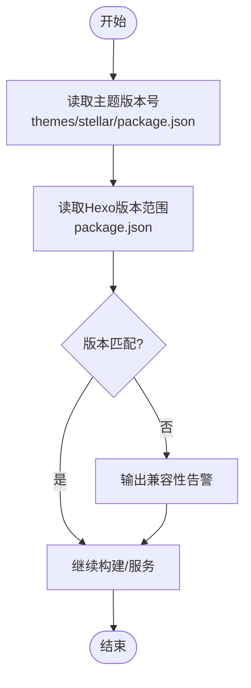
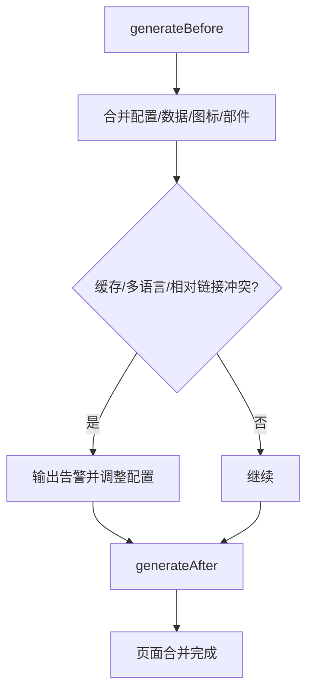
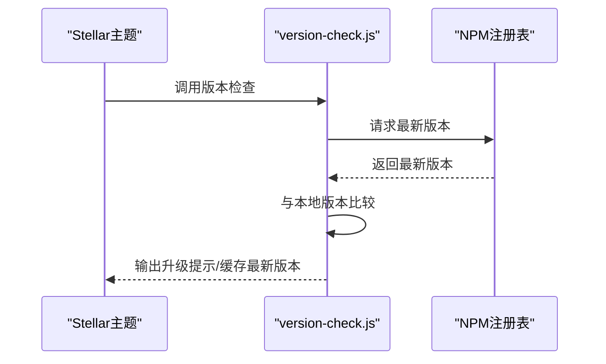
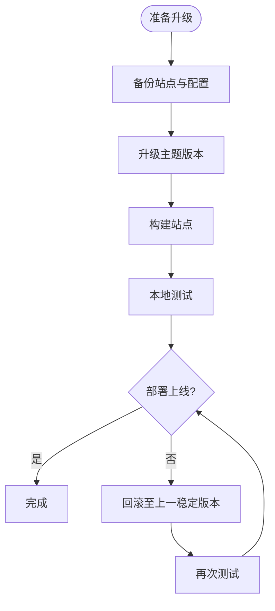
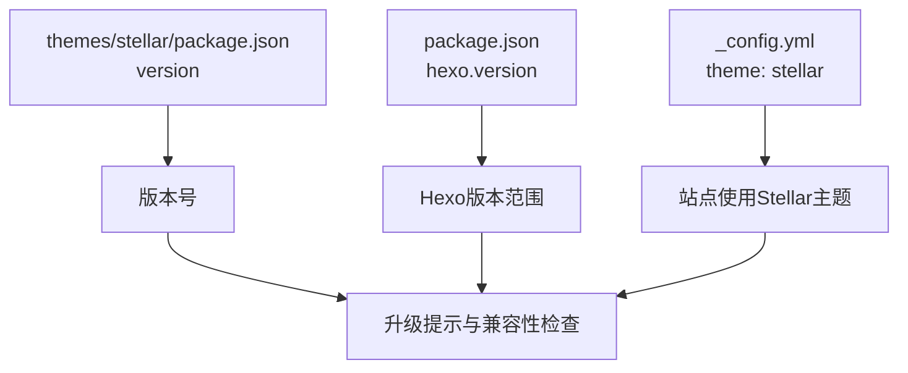

# 版本管理

<cite>
**本文引用的文件**   
- [themes/stellar/package.json](file://themes/stellar/package.json)
- [themes/stellar/_config.yml](file://themes/stellar/_config.yml)
- [themes/stellar/scripts/events/index.js](file://themes/stellar/scripts/events/index.js)
- [themes/stellar/scripts/events/lib/version-check.js](file://themes/stellar/scripts/events/lib/version-check.js)
- [themes/stellar/scripts/events/lib/config.js](file://themes/stellar/scripts/events/lib/config.js)
- [themes/stellar/scripts/events/lib/links.js](file://themes/stellar/scripts/events/lib/links.js)
- [themes/stellar/scripts/events/lib/authors.js](file://themes/stellar/scripts/events/lib/authors.js)
- [themes/stellar/scripts/events/lib/doc_tree.js](file://themes/stellar/scripts/events/lib/doc_tree.js)
- [themes/stellar/scripts/helpers/utils.js](file://themes/stellar/scripts/helpers/utils.js)
- [package.json](file://package.json)
- [_config.yml](file://_config.yml)
- [docs/UPGRADE_GUIDE.md](file://docs/UPGRADE_GUIDE.md)
</cite>

## 目录
1. [简介](#简介)
2. [项目结构](#项目结构)
3. [核心组件](#核心组件)
4. [架构总览](#架构总览)
5. [详细组件分析](#详细组件分析)
6. [依赖关系分析](#依赖关系分析)
7. [性能考量](#性能考量)
8. [故障排查指南](#故障排查指南)
9. [结论](#结论)
10. [附录](#附录)

## 简介
本指南面向H1S97X博客中Stellar主题的版本管理与升级实践，聚焦以下目标：
- 明确版本号规则与来源，建立统一的版本标识与发布节奏
- 建立兼容性检查机制，确保主题升级对站点配置与页面结构的影响可控
- 规范升级路径与回滚策略，降低升级风险
- 管理主题依赖与第三方插件版本，保障样式与功能兼容
- 提供兼容性测试与质量保证最佳实践，确保升级后稳定运行

## 项目结构
围绕Stellar主题的版本管理，涉及如下关键文件与职责：
- 主题版本与依赖：themes/stellar/package.json
- 主题配置与默认行为：themes/stellar/_config.yml
- 主题事件钩子与版本检查：themes/stellar/scripts/events/*
- 站点根配置与Hexo版本约束：package.json、_config.yml
- 升级与兼容性参考文档：docs/UPGRADE_GUIDE.md

**图表来源**
- [package.json](file://package.json#L42-L44)
- [_config.yml](file://_config.yml#L104-L104)
- [themes/stellar/package.json](file://themes/stellar/package.json#L3-L3)
- [themes/stellar/scripts/events/index.js](file://themes/stellar/scripts/events/index.js#L5-L18)
- [themes/stellar/scripts/events/lib/version-check.js](file://themes/stellar/scripts/events/lib/version-check.js#L62-L84)
- [themes/stellar/scripts/events/lib/config.js](file://themes/stellar/scripts/events/lib/config.js#L19-L34)
- [themes/stellar/_config.yml](file://themes/stellar/_config.yml#L1-L10)

**章节来源**
- [themes/stellar/package.json](file://themes/stellar/package.json#L1-L33)
- [themes/stellar/_config.yml](file://themes/stellar/_config.yml#L1-L725)
- [themes/stellar/scripts/events/index.js](file://themes/stellar/scripts/events/index.js#L1-L69)
- [package.json](file://package.json#L1-L94)
- [_config.yml](file://_config.yml#L104-L104)

## 核心组件
- 版本号来源与规则
  - 主题版本号来自主题包文件，遵循语义化版本规范（主.次.修订），便于升级路径识别与兼容性判断。
  - 站点根配置中声明Hexo版本范围，确保主题与Hexo运行时兼容。

- 兼容性检查与配置合并
  - 生成前事件：合并用户数据、图标、侧边栏部件等，同时对缓存与多语言切换、相对链接等潜在冲突项进行兼容性提示与修正。
  - 生成后事件：执行必要的页面合并逻辑，保证生成结果一致性。

- 版本检查与升级提示
  - 启动阶段通过网络查询最新版本并与本地版本对比，若存在差异则输出升级提示，避免长期停留在过旧版本。

- 第三方插件与CDN资源
  - 主题配置中集中管理依赖与内置服务的CDN版本，便于统一升级与回滚；插件启用/禁用通过配置开关控制，避免冲突。

**章节来源**
- [themes/stellar/package.json](file://themes/stellar/package.json#L3-L3)
- [package.json](file://package.json#L42-L44)
- [themes/stellar/scripts/events/index.js](file://themes/stellar/scripts/events/index.js#L5-L18)
- [themes/stellar/scripts/events/lib/config.js](file://themes/stellar/scripts/events/lib/config.js#L19-L34)
- [themes/stellar/scripts/events/lib/version-check.js](file://themes/stellar/scripts/events/lib/version-check.js#L62-L84)
- [themes/stellar/_config.yml](file://themes/stellar/_config.yml#L455-L521)

## 架构总览
Stellar主题的版本管理贯穿“生成前配置校验—生成中数据合并—生成后页面处理—启动时版本检查”的全链路。

**图表来源**
- [themes/stellar/scripts/events/index.js](file://themes/stellar/scripts/events/index.js#L5-L18)
- [themes/stellar/scripts/events/lib/version-check.js](file://themes/stellar/scripts/events/lib/version-check.js#L62-L84)
- [themes/stellar/scripts/events/lib/config.js](file://themes/stellar/scripts/events/lib/config.js#L19-L34)

## 详细组件分析

### 版本号规则与来源
- 主题版本号
  - 来源于主题包文件，作为主题的唯一版本标识，用于升级提示与发布追踪。
- 站点Hexo版本
  - 根配置中声明Hexo版本范围，确保主题与Hexo运行时兼容。

**图表来源**
- [themes/stellar/package.json](file://themes/stellar/package.json#L3-L3)
- [package.json](file://package.json#L42-L44)

**章节来源**
- [themes/stellar/package.json](file://themes/stellar/package.json#L3-L3)
- [package.json](file://package.json#L42-L44)

### 兼容性检查与配置合并
- 生成前事件
  - 合并用户数据、图标、侧边栏部件等，避免与默认配置冲突。
  - 当启用缓存与多语言切换或相对链接时，自动给出兼容性告警并调整配置，防止潜在问题。
- 生成后事件
  - 执行页面合并逻辑，确保生成结果一致。

**图表来源**
- [themes/stellar/scripts/events/index.js](file://themes/stellar/scripts/events/index.js#L5-L18)
- [themes/stellar/scripts/events/lib/config.js](file://themes/stellar/scripts/events/lib/config.js#L19-L34)

**章节来源**
- [themes/stellar/scripts/events/index.js](file://themes/stellar/scripts/events/index.js#L5-L18)
- [themes/stellar/scripts/events/lib/config.js](file://themes/stellar/scripts/events/lib/config.js#L19-L34)

### 版本检查与升级提示
- 启动阶段通过网络请求查询主题最新版本，与本地版本比较，若不同则输出升级提示与建议命令。
- 使用缓存避免频繁请求，按分钟粒度刷新缓存时间戳。

**图表来源**
- [themes/stellar/scripts/events/index.js](file://themes/stellar/scripts/events/index.js#L37-L40)
- [themes/stellar/scripts/events/lib/version-check.js](file://themes/stellar/scripts/events/lib/version-check.js#L62-L84)

**章节来源**
- [themes/stellar/scripts/events/index.js](file://themes/stellar/scripts/events/index.js#L37-L40)
- [themes/stellar/scripts/events/lib/version-check.js](file://themes/stellar/scripts/events/lib/version-check.js#L62-L84)

### 主题升级路径与回滚策略
- 升级路径
  - 通过包管理器升级主题版本，随后执行构建与部署。
  - 在升级前备份站点与主题配置，确保可回滚。
- 回滚策略
  - 降级到上一个稳定版本，重新构建与部署。
  - 若升级导致样式或功能异常，优先检查主题配置与第三方插件启用状态。

**图表来源**
- [themes/stellar/package.json](file://themes/stellar/package.json#L3-L3)
- [docs/UPGRADE_GUIDE.md](file://docs/UPGRADE_GUIDE.md#L131-L157)

**章节来源**
- [docs/UPGRADE_GUIDE.md](file://docs/UPGRADE_GUIDE.md#L1-L219)

### 主题依赖与第三方插件版本管理
- 依赖管理
  - 主题依赖集中在主题包文件中，升级时应关注依赖版本变化与兼容性。
- 插件与CDN资源
  - 主题配置中集中管理依赖与内置服务的CDN版本，便于统一升级与回滚。
  - 插件启用/禁用通过配置开关控制，避免冲突。

**章节来源**
- [themes/stellar/package.json](file://themes/stellar/package.json#L23-L28)
- [themes/stellar/_config.yml](file://themes/stellar/_config.yml#L455-L521)

### 兼容性测试与质量保证
- 构建前校验
  - 使用主题提供的校验脚本，确保配置与数据结构符合预期。
- 本地测试
  - 在本地服务模式下验证页面渲染、样式与交互。
- 质量门禁
  - 通过脚本统一执行测试与链接检查，确保升级后无明显回归。

**章节来源**
- [package.json](file://package.json#L22-L23)
- [package.json](file://package.json#L37-L38)

## 依赖关系分析
Stellar主题的版本管理依赖于主题包版本、Hexo运行时版本与主题配置的协同。

**图表来源**
- [themes/stellar/package.json](file://themes/stellar/package.json#L3-L3)
- [package.json](file://package.json#L42-L44)
- [_config.yml](file://_config.yml#L104-L104)

**章节来源**
- [themes/stellar/package.json](file://themes/stellar/package.json#L1-L33)
- [package.json](file://package.json#L42-L44)
- [_config.yml](file://_config.yml#L104-L104)

## 性能考量
- 版本检查缓存
  - 通过缓存最新版本与时间戳，避免频繁网络请求，降低启动时延。
- 构建阶段优化
  - 合并配置与数据在生成前完成，减少生成时重复计算。
- 插件按需加载
  - 主题配置中的插件按需加载，未使用时不引入资源，降低首屏负担。

**章节来源**
- [themes/stellar/scripts/events/lib/version-check.js](file://themes/stellar/scripts/events/lib/version-check.js#L40-L60)
- [themes/stellar/scripts/events/lib/config.js](file://themes/stellar/scripts/events/lib/config.js#L19-L34)
- [themes/stellar/_config.yml](file://themes/stellar/_config.yml#L523-L583)

## 故障排查指南
- 版本提示与升级
  - 若出现版本提示，按提示命令升级主题版本，并重新构建。
- 配置冲突
  - 当启用缓存与多语言切换或相对链接时，注意兼容性告警，必要时关闭冲突项或调整配置。
- 插件与CDN异常
  - 检查插件启用状态与CDN地址可用性，必要时回退到稳定版本或更换镜像。
- 本地测试与回滚
  - 升级后先本地测试，发现问题立即回滚至上一稳定版本，再逐步定位原因。

**章节来源**
- [themes/stellar/scripts/events/lib/version-check.js](file://themes/stellar/scripts/events/lib/version-check.js#L71-L82)
- [themes/stellar/scripts/events/lib/config.js](file://themes/stellar/scripts/events/lib/config.js#L25-L33)
- [docs/UPGRADE_GUIDE.md](file://docs/UPGRADE_GUIDE.md#L178-L208)

## 结论
通过统一的版本号来源、严格的兼容性检查与配置合并、完善的升级提示与回滚策略，以及对依赖与插件版本的集中管理，H1S97X博客的Stellar主题版本管理能够有效降低升级风险，提升稳定性与可维护性。建议在每次升级前执行备份与本地测试，并结合质量门禁脚本确保回归可控。

## 附录
- 升级与回滚流程参考：docs/UPGRADE_GUIDE.md
- 主题包版本与依赖：themes/stellar/package.json
- 主题配置默认值与插件开关：themes/stellar/_config.yml
- 事件钩子与版本检查：themes/stellar/scripts/events/*