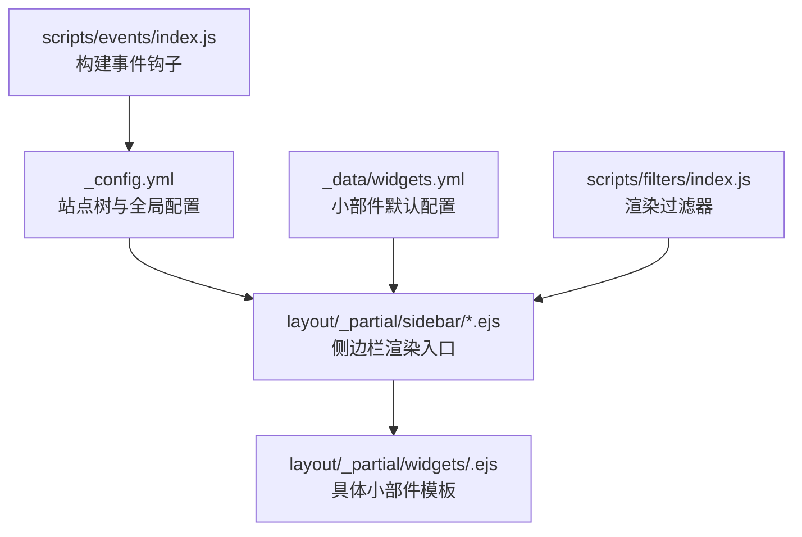
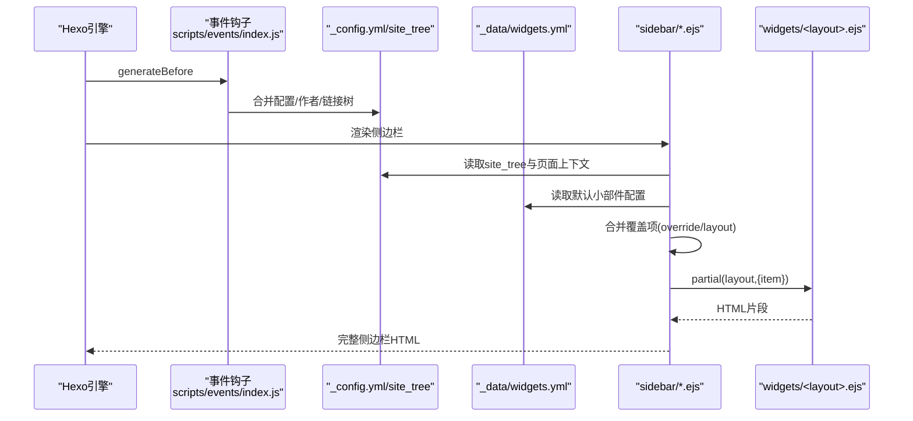
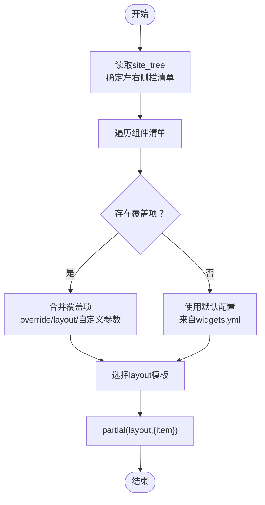
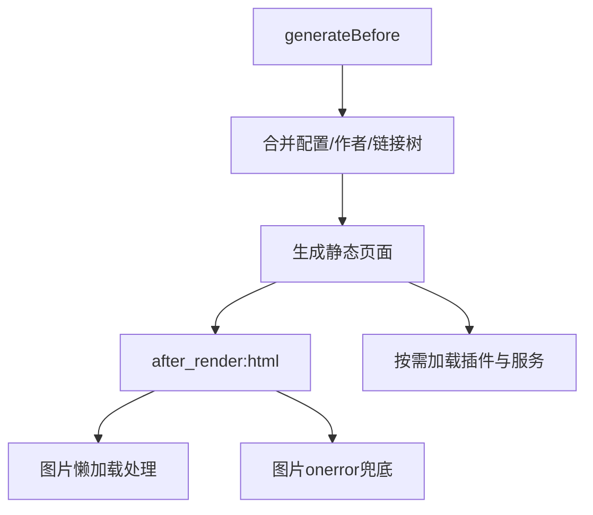
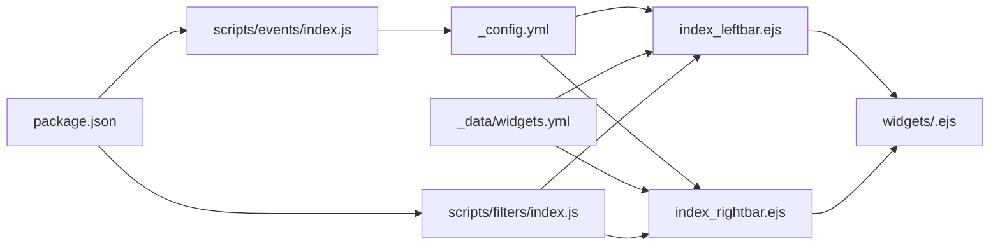

# 小部件系统

<cite>
**本文引用的文件**
- [themes/stellar/_config.yml](file://themes/stellar/_config.yml)
- [themes/stellar/_data/widgets.yml](file://themes/stellar/_data/widgets.yml)
- [themes/stellar/layout/_partial/sidebar/index_leftbar.ejs](file://themes/stellar/layout/_partial/sidebar/index_leftbar.ejs)
- [themes/stellar/layout/_partial/sidebar/index_rightbar.ejs](file://themes/stellar/layout/_partial/sidebar/index_rightbar.ejs)
- [themes/stellar/scripts/events/index.js](file://themes/stellar/scripts/events/index.js)
- [themes/stellar/scripts/filters/index.js](file://themes/stellar/scripts/filters/index.js)
- [themes/stellar/package.json](file://themes/stellar/package.json)
</cite>

## 目录
1. [简介](#简介)
2. [项目结构](#项目结构)
3. [核心组件](#核心组件)
4. [架构总览](#架构总览)
5. [详细组件分析](#详细组件分析)
6. [依赖关系分析](#依赖关系分析)
7. [性能考量](#性能考量)
8. [故障排查指南](#故障排查指南)
9. [结论](#结论)
10. [附录](#附录)

## 简介
本指南面向希望在Stellar主题中开发与扩展侧边栏小部件的开发者。内容涵盖：
- 小部件的架构设计与注册机制
- widgets.yml配置文件的使用方法
- 侧边栏小部件的开发流程（组件创建、配置管理、动态加载）
- 多种小部件类型的开发示例（作者信息卡、标签云、最近文章、社交链接等）
- 数据获取、缓存机制与性能优化
- 样式定制、交互功能与响应式适配

## 项目结构
Stellar主题的小部件系统围绕“配置驱动 + EJS模板渲染”的模式组织：
- 配置层：通过主题配置与数据文件定义小部件布局与行为
- 渲染层：通过EJS模板在页面渲染阶段动态拼装侧边栏小部件
- 扩展层：通过事件钩子与过滤器在构建前后注入逻辑



**图表来源**
- [themes/stellar/_config.yml](file://themes/stellar/_config.yml#L72-L152)
- [themes/stellar/layout/_partial/sidebar/index_leftbar.ejs](file://themes/stellar/layout/_partial/sidebar/index_leftbar.ejs#L34-L166)
- [themes/stellar/layout/_partial/sidebar/index_rightbar.ejs](file://themes/stellar/layout/_partial/sidebar/index_rightbar.ejs#L34-L94)
- [themes/stellar/_data/widgets.yml](file://themes/stellar/_data/widgets.yml#L1-L85)
- [themes/stellar/scripts/events/index.js](file://themes/stellar/scripts/events/index.js#L5-L18)
- [themes/stellar/scripts/filters/index.js](file://themes/stellar/scripts/filters/index.js#L3-L4)

**章节来源**
- [themes/stellar/_config.yml](file://themes/stellar/_config.yml#L72-L152)
- [themes/stellar/layout/_partial/sidebar/index_leftbar.ejs](file://themes/stellar/layout/_partial/sidebar/index_leftbar.ejs#L34-L166)
- [themes/stellar/layout/_partial/sidebar/index_rightbar.ejs](file://themes/stellar/layout/_partial/sidebar/index_rightbar.ejs#L34-L94)
- [themes/stellar/_data/widgets.yml](file://themes/stellar/_data/widgets.yml#L1-L85)

## 核心组件
- 站点树与侧边栏布局：通过主题配置中的site_tree定义不同页面类型的左右侧栏组件清单
- 小部件注册与覆盖：通过widgets.yml声明默认小部件，EJS渲染时可按需覆盖或合并
- 动态渲染：EJS模板在运行时根据页面上下文选择对应小部件模板并传入配置项
- 构建期扩展：事件钩子负责合并配置、作者、链接树等数据；过滤器负责图片懒加载与错误兜底

**章节来源**
- [themes/stellar/_config.yml](file://themes/stellar/_config.yml#L72-L152)
- [themes/stellar/_data/widgets.yml](file://themes/stellar/_data/widgets.yml#L1-L85)
- [themes/stellar/layout/_partial/sidebar/index_leftbar.ejs](file://themes/stellar/layout/_partial/sidebar/index_leftbar.ejs#L78-L112)
- [themes/stellar/layout/_partial/sidebar/index_rightbar.ejs](file://themes/stellar/layout/_partial/sidebar/index_rightbar.ejs#L61-L91)
- [themes/stellar/scripts/events/index.js](file://themes/stellar/scripts/events/index.js#L5-L18)
- [themes/stellar/scripts/filters/index.js](file://themes/stellar/scripts/filters/index.js#L3-L4)

## 架构总览
Stellar小部件系统的关键流程如下：
- 页面渲染前：事件钩子合并配置与数据，准备全局可用的主题数据
- 页面渲染时：根据当前页面类型与主题配置，定位左右侧栏组件清单
- 动态组装：遍历组件清单，优先使用widgets.yml中的默认配置，再叠加页面级覆盖项
- 模板渲染：将配置对象传入对应layout模板，生成最终HTML



**图表来源**
- [themes/stellar/scripts/events/index.js](file://themes/stellar/scripts/events/index.js#L5-L18)
- [themes/stellar/_config.yml](file://themes/stellar/_config.yml#L72-L152)
- [themes/stellar/_data/widgets.yml](file://themes/stellar/_data/widgets.yml#L1-L85)
- [themes/stellar/layout/_partial/sidebar/index_leftbar.ejs](file://themes/stellar/layout/_partial/sidebar/index_leftbar.ejs#L78-L112)
- [themes/stellar/layout/_partial/sidebar/index_rightbar.ejs](file://themes/stellar/layout/_partial/sidebar/index_rightbar.ejs#L61-L91)

## 详细组件分析

### 配置与注册机制
- widgets.yml：定义默认小部件及其布局与参数，支持覆盖字段（如limit、color、title等）
- _config.yml.site_tree：定义不同页面类型（home/post/wiki等）的左右侧栏组件清单
- EJS渲染：在sidebar模板中读取site_tree，结合widgets.yml与页面覆盖项，动态拼装widgets目录下的具体模板



**图表来源**
- [themes/stellar/_config.yml](file://themes/stellar/_config.yml#L72-L152)
- [themes/stellar/_data/widgets.yml](file://themes/stellar/_data/widgets.yml#L1-L85)
- [themes/stellar/layout/_partial/sidebar/index_leftbar.ejs](file://themes/stellar/layout/_partial/sidebar/index_leftbar.ejs#L78-L112)
- [themes/stellar/layout/_partial/sidebar/index_rightbar.ejs](file://themes/stellar/layout/_partial/sidebar/index_rightbar.ejs#L61-L91)

**章节来源**
- [themes/stellar/_data/widgets.yml](file://themes/stellar/_data/widgets.yml#L1-L85)
- [themes/stellar/_config.yml](file://themes/stellar/_config.yml#L72-L152)
- [themes/stellar/layout/_partial/sidebar/index_leftbar.ejs](file://themes/stellar/layout/_partial/sidebar/index_leftbar.ejs#L78-L112)
- [themes/stellar/layout/_partial/sidebar/index_rightbar.ejs](file://themes/stellar/layout/_partial/sidebar/index_rightbar.ejs#L61-L91)

### 侧边栏开发流程
- 创建小部件模板：在widgets目录新增layout.ejs模板，接收item参数并渲染UI
- 注册默认配置：在widgets.yml中定义默认布局与参数
- 配置页面清单：在_config.yml.site_tree中为目标页面类型添加组件名或覆盖项
- 覆盖与优先级：页面级覆盖项可指定override或直接传入layout与参数，优先级高于默认配置
- 动态加载：EJS在渲染时自动加载对应layout模板并传参

```mermaid
classDiagram
class SiteTree {
+home.leftbar/rightbar
+post.leftbar/rightbar
+wiki.leftbar/rightbar
...
}
class WidgetsYml {
+layout : string
+title? : string
+limit? : number
+color? : boolean
+...
}
class SidebarEJS {
+layoutWidgets()
+partial("../widgets/"+layout,{item})
}
class WidgetLayout {
+接收item参数
+渲染UI
}
SiteTree --> SidebarEJS : "提供组件清单"
WidgetsYml --> SidebarEJS : "提供默认配置"
SidebarEJS --> WidgetLayout : "动态加载并传参"
```

**图表来源**
- [themes/stellar/_config.yml](file://themes/stellar/_config.yml#L72-L152)
- [themes/stellar/_data/widgets.yml](file://themes/stellar/_data/widgets.yml#L1-L85)
- [themes/stellar/layout/_partial/sidebar/index_leftbar.ejs](file://themes/stellar/layout/_partial/sidebar/index_leftbar.ejs#L78-L112)
- [themes/stellar/layout/_partial/sidebar/index_rightbar.ejs](file://themes/stellar/layout/_partial/sidebar/index_rightbar.ejs#L61-L91)

**章节来源**
- [themes/stellar/layout/_partial/sidebar/index_leftbar.ejs](file://themes/stellar/layout/_partial/sidebar/index_leftbar.ejs#L78-L112)
- [themes/stellar/layout/_partial/sidebar/index_rightbar.ejs](file://themes/stellar/layout/_partial/sidebar/index_rightbar.ejs#L61-L91)

### 小部件类型与示例
以下为常见小部件类型的开发要点（不展示具体代码，仅说明配置与模板对接方式）：
- 作者信息卡（author）
  - 配置：在_config.yml中启用author小部件，控制头像显示等
  - 数据：依赖authors.yml作者信息
  - 模板：widgets/author.ejs接收item并渲染作者卡片
- 标签云（tagcloud）
  - 配置：min_font/max_font/amount/orderby/order/color等
  - 数据：站点标签集合与计数
  - 模板：widgets/tagcloud.ejs渲染标签云并可选显示计数
- 最近文章（recent）
  - 配置：limit、rss等
  - 数据：文章列表（可选RSS）
  - 模板：widgets/recent.ejs渲染最近文章列表
- 社交链接（footer.social）
  - 配置：footer.social中定义图标与链接
  - 数据：主题配置
  - 模板：sidebar模板中渲染社交链接区域

**章节来源**
- [themes/stellar/_config.yml](file://themes/stellar/_config.yml#L33-L152)
- [themes/stellar/_data/widgets.yml](file://themes/stellar/_data/widgets.yml#L46-L85)
- [themes/stellar/layout/_partial/sidebar/index_leftbar.ejs](file://themes/stellar/layout/_partial/sidebar/index_leftbar.ejs#L113-L146)

### 数据获取、缓存与性能优化
- 构建期数据合并：事件钩子在generateBefore阶段合并配置、作者、链接树等，减少运行时开销
- 图片懒加载与错误兜底：过滤器在HTML渲染后对图片进行懒加载与错误占位处理
- 依赖与CDN：通过package.json声明渲染器与探测库，降低运行时体积
- 按需加载：data_services与plugins按需加载，避免无用资源



**图表来源**
- [themes/stellar/scripts/events/index.js](file://themes/stellar/scripts/events/index.js#L5-L18)
- [themes/stellar/scripts/filters/index.js](file://themes/stellar/scripts/filters/index.js#L3-L4)
- [themes/stellar/package.json](file://themes/stellar/package.json#L23-L28)

**章节来源**
- [themes/stellar/scripts/events/index.js](file://themes/stellar/scripts/events/index.js#L5-L18)
- [themes/stellar/scripts/filters/index.js](file://themes/stellar/scripts/filters/index.js#L3-L4)
- [themes/stellar/package.json](file://themes/stellar/package.json#L23-L28)

### 样式定制、交互与响应式适配
- 样式定制：通过_config.yml.style与_config.yml.default字段设置主题色、字体、圆角、背景等
- 交互功能：sidebar.ejs提供侧边栏开关与目录折叠等交互逻辑
- 响应式适配：结合CSS变量与容器断点，确保小部件在移动端与桌面端一致可用

**章节来源**
- [themes/stellar/_config.yml](file://themes/stellar/_config.yml#L635-L725)
- [themes/stellar/layout/_partial/scripts/sidebar.ejs](file://themes/stellar/layout/_partial/scripts/sidebar.ejs#L1-L25)

## 依赖关系分析
- 配置依赖：sidebar模板依赖_config.yml.site_tree与_widgets.yml
- 渲染依赖：EJS模板依赖partial机制加载widgets目录下的具体模板
- 构建依赖：事件钩子与过滤器在构建生命周期中注入逻辑
- 外部依赖：渲染器与图像探测库由package.json声明



**图表来源**
- [themes/stellar/_config.yml](file://themes/stellar/_config.yml#L72-L152)
- [themes/stellar/_data/widgets.yml](file://themes/stellar/_data/widgets.yml#L1-L85)
- [themes/stellar/layout/_partial/sidebar/index_leftbar.ejs](file://themes/stellar/layout/_partial/sidebar/index_leftbar.ejs#L78-L112)
- [themes/stellar/layout/_partial/sidebar/index_rightbar.ejs](file://themes/stellar/layout/_partial/sidebar/index_rightbar.ejs#L61-L91)
- [themes/stellar/scripts/events/index.js](file://themes/stellar/scripts/events/index.js#L5-L18)
- [themes/stellar/scripts/filters/index.js](file://themes/stellar/scripts/filters/index.js#L3-L4)
- [themes/stellar/package.json](file://themes/stellar/package.json#L23-L28)

**章节来源**
- [themes/stellar/_config.yml](file://themes/stellar/_config.yml#L72-L152)
- [themes/stellar/_data/widgets.yml](file://themes/stellar/_data/widgets.yml#L1-L85)
- [themes/stellar/layout/_partial/sidebar/index_leftbar.ejs](file://themes/stellar/layout/_partial/sidebar/index_leftbar.ejs#L78-L112)
- [themes/stellar/layout/_partial/sidebar/index_rightbar.ejs](file://themes/stellar/layout/_partial/sidebar/index_rightbar.ejs#L61-L91)
- [themes/stellar/scripts/events/index.js](file://themes/stellar/scripts/events/index.js#L5-L18)
- [themes/stellar/scripts/filters/index.js](file://themes/stellar/scripts/filters/index.js#L3-L4)
- [themes/stellar/package.json](file://themes/stellar/package.json#L23-L28)

## 性能考量
- 减少运行时计算：在generateBefore阶段完成数据合并与预处理
- 懒加载策略：对图片与第三方资源采用懒加载与错误兜底
- 按需加载：仅在页面实际使用时加载对应服务与插件
- 静态资源优化：通过CDN与最小化依赖降低首屏时间

[本节为通用指导，无需列出具体文件来源]

## 故障排查指南
- 小部件未显示
  - 检查_config.yml.site_tree中是否正确配置左右侧栏组件清单
  - 确认widgets.yml中是否存在对应layout的默认配置
- 覆盖无效
  - 确认页面级覆盖项是否包含override或layout字段
  - 检查EJS渲染逻辑是否正确合并覆盖项
- 图片加载异常
  - 检查过滤器是否生效（after_render:html）
  - 确认图片路径与懒加载配置

**章节来源**
- [themes/stellar/layout/_partial/sidebar/index_leftbar.ejs](file://themes/stellar/layout/_partial/sidebar/index_leftbar.ejs#L78-L112)
- [themes/stellar/layout/_partial/sidebar/index_rightbar.ejs](file://themes/stellar/layout/_partial/sidebar/index_rightbar.ejs#L61-L91)
- [themes/stellar/scripts/filters/index.js](file://themes/stellar/scripts/filters/index.js#L3-L4)

## 结论
Stellar主题的小部件系统通过“配置驱动 + EJS动态渲染 + 构建期扩展”的组合，实现了高度灵活的侧边栏扩展能力。开发者只需在widgets.yml中定义默认配置，在_config.yml.site_tree中声明组件清单，并在widgets目录中实现对应模板，即可快速扩展多种类型的小部件。配合事件钩子与过滤器，可在保证性能的同时提升用户体验。

[本节为总结性内容，无需列出具体文件来源]

## 附录
- 示例清单（按需实现）：作者信息卡、标签云、最近文章、社交链接、GitHub仓库、最近议题、页面树、目录、时间线、最新评论、标签树等
- 开发建议：保持小部件模板的轻量与可复用；合理拆分配置项；为复杂小部件提供可选参数与默认值

[本节为补充说明，无需列出具体文件来源]