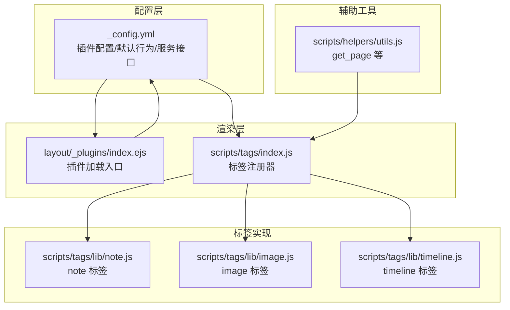
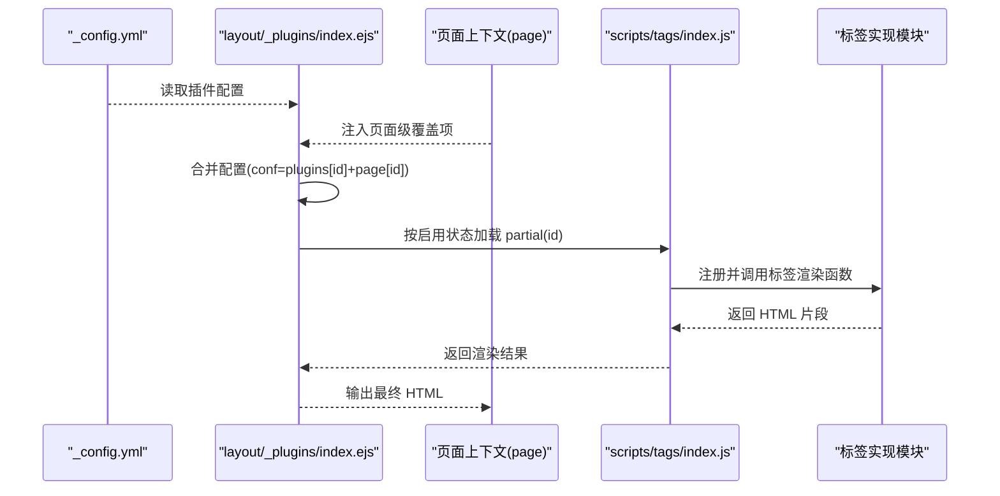
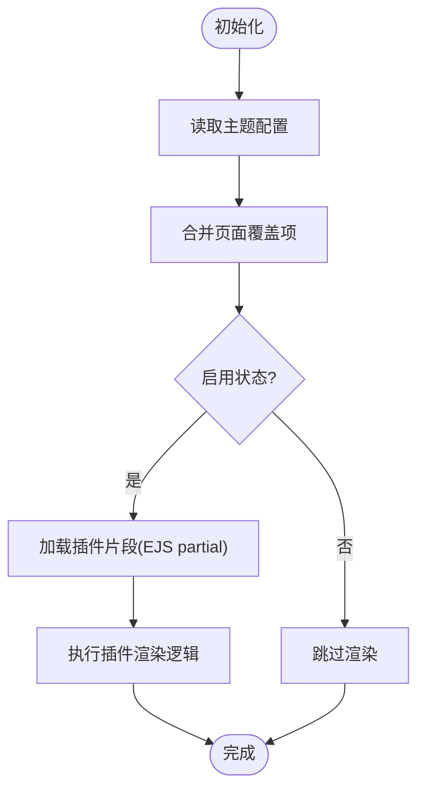
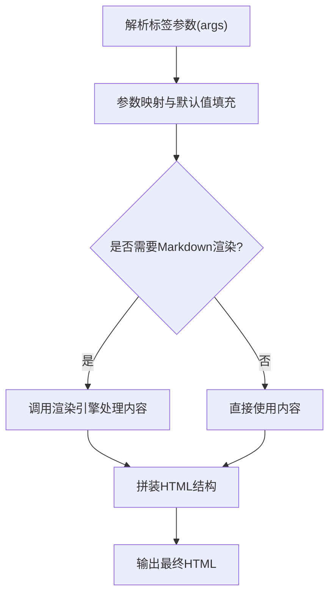
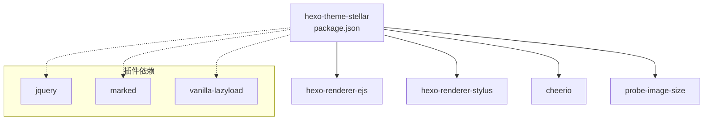

# 插件机制

<cite>
**本文引用的文件**
- [themes/stellar/_config.yml](file://themes/stellar/_config.yml)
- [themes/stellar/package.json](file://themes/stellar/package.json)
- [themes/stellar/layout/_plugins/index.ejs](file://themes/stellar/layout/_plugins/index.ejs)
- [themes/stellar/scripts/tags/index.js](file://themes/stellar/scripts/tags/index.js)
- [themes/stellar/scripts/tags/lib/note.js](file://themes/stellar/scripts/tags/lib/note.js)
- [themes/stellar/scripts/tags/lib/image.js](file://themes/stellar/scripts/tags/lib/image.js)
- [themes/stellar/scripts/tags/lib/timeline.js](file://themes/stellar/scripts/tags/lib/timeline.js)
- [themes/stellar/scripts/helpers/utils.js](file://themes/stellar/scripts/helpers/utils.js)
</cite>

## 目录
1. [引言](#引言)
2. [项目结构](#项目结构)
3. [核心组件](#核心组件)
4. [架构总览](#架构总览)
5. [详细组件分析](#详细组件分析)
6. [依赖分析](#依赖分析)
7. [性能考虑](#性能考虑)
8. [故障排查指南](#故障排查指南)
9. [结论](#结论)
10. [附录](#附录)

## 引言
本文件面向希望基于 Stellar 主题进行插件扩展与二次开发的工程师与内容创作者，系统阐述主题插件机制的设计与实现，涵盖插件注册、生命周期管理、依赖注入、自定义标签语法与渲染、配置管理、错误处理与调试、性能优化、兼容性与版本管理等关键主题。文中结合实际源码路径与片段位置，帮助读者快速定位实现细节并开展定制化开发。

## 项目结构
Stellar 主题的插件体系主要由以下几部分构成：
- 配置层：主题配置文件集中声明插件开关、资源注入、默认行为与服务接口。
- 渲染层：EJS 插件入口负责按需加载插件片段；标签插件注册器负责将自定义标签语法映射到渲染函数。
- 标签实现：每个标签对应一个独立模块，负责解析参数、拼装 HTML 并调用 Markdown 渲染引擎。
- 辅助工具：提供通用的辅助函数与数据查询能力，支撑标签与插件的运行。

**图表来源**
- [themes/stellar/_config.yml](file://themes/stellar/_config.yml#L523-L632)
- [themes/stellar/layout/_plugins/index.ejs](file://themes/stellar/layout/_plugins/index.ejs#L1-L25)
- [themes/stellar/scripts/tags/index.js](file://themes/stellar/scripts/tags/index.js#L1-L56)
- [themes/stellar/scripts/tags/lib/note.js](file://themes/stellar/scripts/tags/lib/note.js#L1-L36)
- [themes/stellar/scripts/tags/lib/image.js](file://themes/stellar/scripts/tags/lib/image.js#L1-L113)
- [themes/stellar/scripts/tags/lib/timeline.js](file://themes/stellar/scripts/tags/lib/timeline.js#L1-L80)
- [themes/stellar/scripts/helpers/utils.js](file://themes/stellar/scripts/helpers/utils.js#L1-L21)

**章节来源**
- [themes/stellar/_config.yml](file://themes/stellar/_config.yml#L523-L632)
- [themes/stellar/layout/_plugins/index.ejs](file://themes/stellar/layout/_plugins/index.ejs#L1-L25)
- [themes/stellar/scripts/tags/index.js](file://themes/stellar/scripts/tags/index.js#L1-L56)
- [themes/stellar/scripts/tags/lib/note.js](file://themes/stellar/scripts/tags/lib/note.js#L1-L36)
- [themes/stellar/scripts/tags/lib/image.js](file://themes/stellar/scripts/tags/lib/image.js#L1-L113)
- [themes/stellar/scripts/tags/lib/timeline.js](file://themes/stellar/scripts/tags/lib/timeline.js#L1-L80)
- [themes/stellar/scripts/helpers/utils.js](file://themes/stellar/scripts/helpers/utils.js#L1-L21)

## 核心组件
- 插件配置与注入
  - 主题配置集中声明插件开关、资源注入与默认行为，支持按需启用与覆盖。
  - 插件加载入口根据配置与页面上下文动态拼装插件片段。
- 标签插件注册与渲染
  - 标签注册器统一注册各类标签，标签实现负责参数解析、HTML 构造与 Markdown 渲染。
- 辅助工具
  - 提供页面/文章查询等通用能力，便于标签与服务集成。

**章节来源**
- [themes/stellar/_config.yml](file://themes/stellar/_config.yml#L523-L632)
- [themes/stellar/layout/_plugins/index.ejs](file://themes/stellar/layout/_plugins/index.ejs#L1-L25)
- [themes/stellar/scripts/tags/index.js](file://themes/stellar/scripts/tags/index.js#L1-L56)
- [themes/stellar/scripts/helpers/utils.js](file://themes/stellar/scripts/helpers/utils.js#L1-L21)

## 架构总览
Stellar 插件机制遵循“配置驱动 + 按需加载”的设计原则：
- 配置驱动：在主题配置中声明插件启用状态、资源注入与默认参数。
- 按需加载：插件入口根据页面上下文与配置合并结果，动态加载所需插件片段。
- 标签渲染：标签实现解析参数、拼装 DOM，并在需要时调用 Markdown 渲染引擎。

**图表来源**
- [themes/stellar/_config.yml](file://themes/stellar/_config.yml#L523-L632)
- [themes/stellar/layout/_plugins/index.ejs](file://themes/stellar/layout/_plugins/index.ejs#L10-L22)
- [themes/stellar/scripts/tags/index.js](file://themes/stellar/scripts/tags/index.js#L6-L14)

**章节来源**
- [themes/stellar/_config.yml](file://themes/stellar/_config.yml#L523-L632)
- [themes/stellar/layout/_plugins/index.ejs](file://themes/stellar/layout/_plugins/index.ejs#L1-L25)
- [themes/stellar/scripts/tags/index.js](file://themes/stellar/scripts/tags/index.js#L1-L56)

## 详细组件分析

### 插件注册与生命周期管理
- 插件注册
  - 在主题配置中声明插件启用状态与资源注入（如外部 JS/CSS 或内联注入）。
  - 插件加载入口会合并页面级覆盖项与全局配置，再决定是否渲染对应插件片段。
- 生命周期
  - 初始化阶段：读取配置与页面上下文，准备渲染参数。
  - 渲染阶段：按需输出插件所需的 HTML/CSS/JS。
  - 销毁/清理：由具体插件自身负责（如事件解绑、定时器清理等，视插件实现而定）。

**图表来源**
- [themes/stellar/layout/_plugins/index.ejs](file://themes/stellar/layout/_plugins/index.ejs#L10-L22)
- [themes/stellar/_config.yml](file://themes/stellar/_config.yml#L523-L632)

**章节来源**
- [themes/stellar/layout/_plugins/index.ejs](file://themes/stellar/layout/_plugins/index.ejs#L1-L25)
- [themes/stellar/_config.yml](file://themes/stellar/_config.yml#L523-L632)

### 依赖注入与资源管理
- 外部资源注入
  - 支持通过配置项注入 CSS/JS 或内联 HTML 片段，插件入口可直接输出注入内容。
- 内部资源注入
  - 通过工具函数输出相对路径资源，确保在本地与 CDN 环境下的兼容性。
- 服务接口
  - 配置中提供多个内置服务接口（如站点信息、GitHub 信息、评分投票等），插件可通过这些接口扩展功能。

**章节来源**
- [themes/stellar/_config.yml](file://themes/stellar/_config.yml#L464-L521)
- [themes/stellar/_config.yml](file://themes/stellar/_config.yml#L523-L632)

### 自定义标签插件开发方法
- 标签语法定义
  - 采用 Hexo 标签语法，参数以空格分隔，中括号表示可选参数。
- 参数处理
  - 使用参数映射函数解析命名参数与位置参数，支持默认值与覆盖。
- 渲染逻辑
  - 构造 HTML 结构，必要时调用 Markdown 渲染引擎处理内容。
  - 支持与插件配置联动（如图片标签对 Fancybox 的支持）。

**图表来源**
- [themes/stellar/scripts/tags/lib/note.js](file://themes/stellar/scripts/tags/lib/note.js#L10-L35)
- [themes/stellar/scripts/tags/lib/image.js](file://themes/stellar/scripts/tags/lib/image.js#L10-L112)
- [themes/stellar/scripts/tags/lib/timeline.js](file://themes/stellar/scripts/tags/lib/timeline.js#L37-L79)

**章节来源**
- [themes/stellar/scripts/tags/lib/note.js](file://themes/stellar/scripts/tags/lib/note.js#L1-L36)
- [themes/stellar/scripts/tags/lib/image.js](file://themes/stellar/scripts/tags/lib/image.js#L1-L113)
- [themes/stellar/scripts/tags/lib/timeline.js](file://themes/stellar/scripts/tags/lib/timeline.js#L1-L80)

### 标签实现示例

#### note 标签
- 作用：渲染带标题与内容的提示块，支持颜色与边框配置。
- 关键点：
  - 参数映射：解析 color、title、content。
  - 默认值：从主题配置读取默认颜色。
  - 渲染：先输出标题区，再输出 Markdown 渲染后的内容区。

**章节来源**
- [themes/stellar/scripts/tags/lib/note.js](file://themes/stellar/scripts/tags/lib/note.js#L1-L36)
- [themes/stellar/_config.yml](file://themes/stellar/_config.yml#L378-L452)

#### image 标签
- 作用：渲染带懒加载、占位动画、可选下载与 Fancybox 放大的图片容器。
- 关键点：
  - 参数映射：支持 width、height、bg、padding、download、fancybox、ratio 等。
  - FancyBox 支持：优先读取主题配置中的默认开关与覆盖项，支持自定义 href。
  - 懒加载与错误回退：内置懒加载与错误占位图。
  - 下载按钮：根据 alt 与 download 参数生成下载链接。

**章节来源**
- [themes/stellar/scripts/tags/lib/image.js](file://themes/stellar/scripts/tags/lib/image.js#L1-L113)
- [themes/stellar/_config.yml](file://themes/stellar/_config.yml#L409-L411)
- [themes/stellar/_config.yml](file://themes/stellar/_config.yml#L539-L548)

#### timeline 标签
- 作用：渲染时间轴节点，支持数据服务模式与手动节点模式。
- 关键点：
  - 节点解析：通过注释标记分割 header 与 body。
  - 渲染：为每个节点输出标题与内容区块。
  - 数据服务：支持通过 API 与用户标识加载远端数据。

**章节来源**
- [themes/stellar/scripts/tags/lib/timeline.js](file://themes/stellar/scripts/tags/lib/timeline.js#L1-L80)
- [themes/stellar/_config.yml](file://themes/stellar/_config.yml#L415-L417)

### 插件开发完整案例

#### 数学公式插件（KaTeX/MathJax）
- 启用方式
  - 在主题配置中启用 KaTeX 或 MathJax，并按需注入 CSS/JS。
  - 支持在文章 Front Matter 中按需开启。
- 集成要点
  - 通过配置项注入样式与脚本。
  - 在渲染层按需加载，避免全局负担。

**章节来源**
- [themes/stellar/_config.yml](file://themes/stellar/_config.yml#L585-L601)
- [themes/stellar/_config.yml](file://themes/stellar/_config.yml#L602-L618)

#### 流程图插件（Mermaid）
- 启用方式
  - 在主题配置中启用 Mermaid，并设置主题与脚本地址。
  - 在文章 Front Matter 中开启 mermaid 标志。
- 集成要点
  - 通过配置项注入脚本，按需渲染图表。

**章节来源**
- [themes/stellar/_config.yml](file://themes/stellar/_config.yml#L602-L618)

#### 图片灯箱插件（Fancybox）
- 启用方式
  - 在主题配置中启用 Fancybox，并设置选择器以匹配目标图片。
- 集成要点
  - 图片标签内部读取配置并决定是否包裹为可放大的链接。
  - 支持自定义 href 以覆盖默认图片地址。

**章节来源**
- [themes/stellar/_config.yml](file://themes/stellar/_config.yml#L539-L548)
- [themes/stellar/scripts/tags/lib/image.js](file://themes/stellar/scripts/tags/lib/image.js#L19-L38)

### 配置管理
- 插件开关与覆盖
  - 全局配置：在主题配置中统一启用/禁用插件。
  - 页面覆盖：在页面 Front Matter 中以同名键覆盖全局配置。
- 资源注入
  - 外部资源：通过 JS/CSS 链接注入。
  - 内联注入：通过 inject 字段直接注入 HTML 片段。
- 默认行为
  - 标签与插件提供默认参数，可在配置中统一调整。

**章节来源**
- [themes/stellar/_config.yml](file://themes/stellar/_config.yml#L523-L632)
- [themes/stellar/layout/_plugins/index.ejs](file://themes/stellar/layout/_plugins/index.ejs#L10-L22)

### 错误处理与调试
- 常见问题
  - 插件未生效：检查全局开关与页面覆盖项，确认 partial 名称与配置键一致。
  - 资源加载失败：核对资源 URL 与网络连通性，必要时使用本地资源。
  - 标签渲染异常：检查参数格式与 Markdown 渲染引擎可用性。
- 调试建议
  - 在 EJS 插件入口输出合并后的配置对象，确认启用状态与注入内容。
  - 在标签实现中输出关键参数与中间结构，定位解析问题。
  - 使用浏览器开发者工具检查资源请求与脚本执行。

**章节来源**
- [themes/stellar/layout/_plugins/index.ejs](file://themes/stellar/layout/_plugins/index.ejs#L10-L22)
- [themes/stellar/scripts/tags/lib/image.js](file://themes/stellar/scripts/tags/lib/image.js#L54-L57)

## 依赖分析
- 主题依赖
  - 渲染器与样式处理器：EJS、Stylus。
  - 工具库：Cheerio、probe-image-size。
- 插件依赖
  - 外部库：jQuery、marked、lazyload 等（通过配置注入）。
  - 内置服务：站点信息、GitHub 信息、评分投票等服务接口。

**图表来源**
- [themes/stellar/package.json](file://themes/stellar/package.json#L23-L28)
- [themes/stellar/_config.yml](file://themes/stellar/_config.yml#L455-L462)

**章节来源**
- [themes/stellar/package.json](file://themes/stellar/package.json#L1-L33)
- [themes/stellar/_config.yml](file://themes/stellar/_config.yml#L455-L462)

## 性能考虑
- 按需加载
  - 仅在启用插件或页面使用标签时加载资源，避免全局负担。
- 资源优化
  - 使用 CDN 与缓存策略，合理设置过渡动画与懒加载参数。
- 渲染优化
  - 减少不必要的 Markdown 渲染层级，避免重复解析。
- 事件与内存
  - 插件内部注意事件解绑与定时器清理，防止内存泄漏。

[本节为通用指导，无需列出具体文件来源]

## 故障排查指南
- 插件未生效
  - 检查主题配置中的 enable 字段与页面覆盖项。
  - 确认 partial 名称与配置键一致。
- 资源加载失败
  - 核对 JS/CSS 链接与网络连通性。
  - 尝试使用本地资源或镜像地址。
- 标签渲染异常
  - 检查参数格式与命名参数映射。
  - 确认 Markdown 渲染引擎可用并正确配置。

**章节来源**
- [themes/stellar/layout/_plugins/index.ejs](file://themes/stellar/layout/_plugins/index.ejs#L10-L22)
- [themes/stellar/scripts/tags/lib/image.js](file://themes/stellar/scripts/tags/lib/image.js#L54-L57)

## 结论
Stellar 主题通过“配置驱动 + 按需加载 + 标签渲染”的插件机制，实现了高度可扩展的内容表达与交互能力。开发者只需在配置中声明插件、在标签实现中处理参数与渲染，即可快速构建如数学公式、流程图、图片灯箱等丰富插件。配合完善的默认行为与服务接口，Stellar 为内容创作与主题扩展提供了稳定而灵活的基础设施。

[本节为总结性内容，无需列出具体文件来源]

## 附录

### 标签插件清单与用途
- 容器类：tabs、box、about、folding、folders、grid、swiper、gallery、banner
- 数据类：users/friends、albums、posters、sites、ghcard、toc、timeline、md、chat
- 表达类：checkbox/radio、copy、emoji、icon、frame、image、link、button、mark、navbar、note、poetry、quot/blockquote、hashtag、okr、audio、video、rating、vote
- 阅读类：reel、paper

**章节来源**
- [themes/stellar/scripts/tags/index.js](file://themes/stellar/scripts/tags/index.js#L6-L54)

### 辅助函数示例
- get_page：根据 ID 查询页面或文章，便于标签与服务集成。

**章节来源**
- [themes/stellar/scripts/helpers/utils.js](file://themes/stellar/scripts/helpers/utils.js#L7-L20)