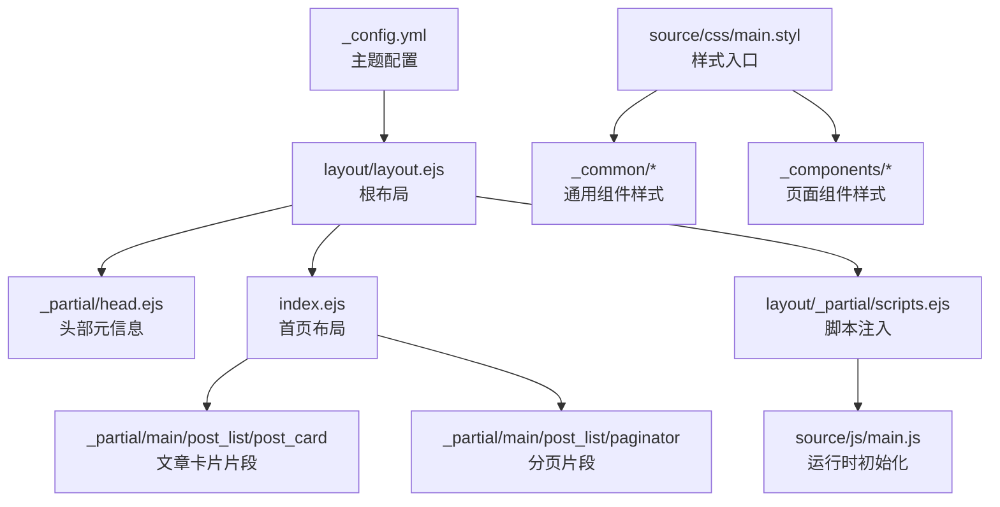
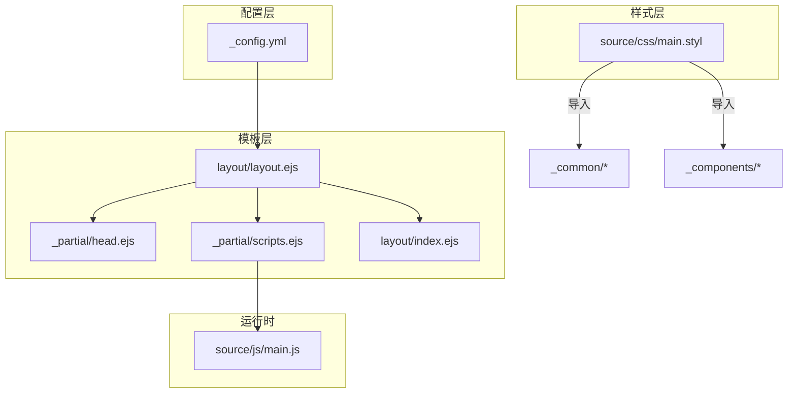
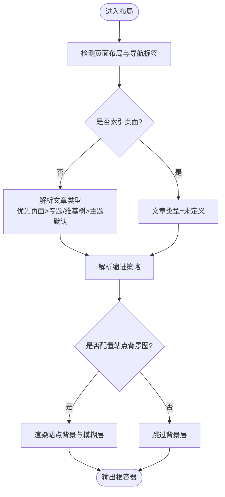
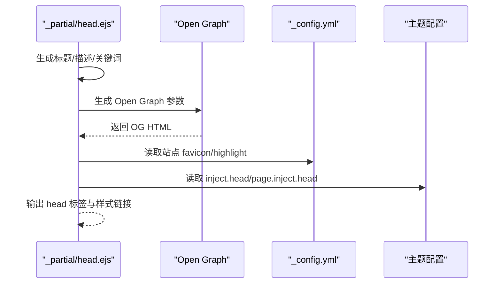
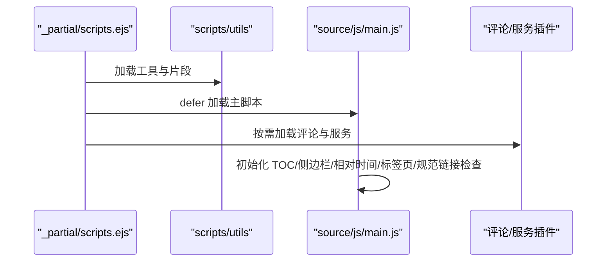
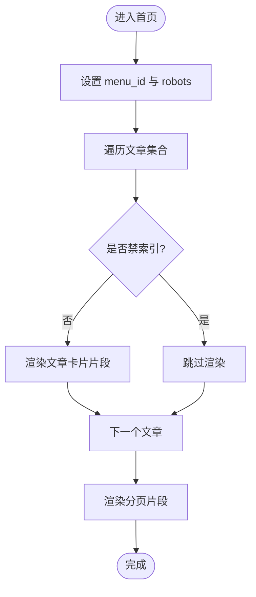
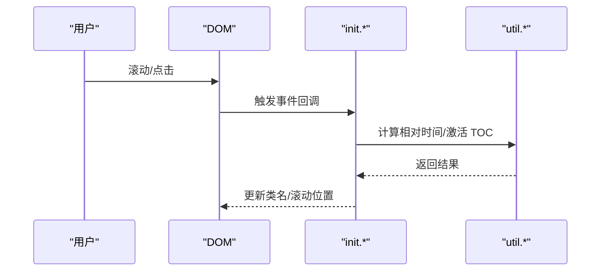
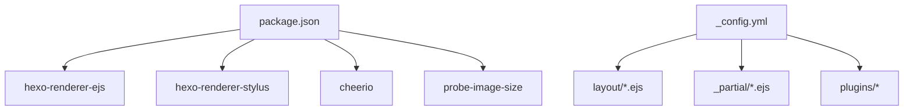

# 模板开发

<cite>
**本文引用的文件**
- [themes/stellar/_config.yml](file://themes/stellar/_config.yml)
- [themes/stellar/package.json](file://themes/stellar/package.json)
- [themes/stellar/layout/layout.ejs](file://themes/stellar/layout/layout.ejs)
- [themes/stellar/layout/_partial/head.ejs](file://themes/stellar/layout/_partial/head.ejs)
- [themes/stellar/layout/_partial/scripts.ejs](file://themes/stellar/layout/_partial/scripts.ejs)
- [themes/stellar/layout/index.ejs](file://themes/stellar/layout/index.ejs)
- [themes/stellar/scripts/helpers/utils.js](file://themes/stellar/scripts/helpers/utils.js)
- [themes/stellar/source/js/main.js](file://themes/stellar/source/js/main.js)
- [themes/stellar/source/css/main.styl](file://themes/stellar/source/css/main.styl)
</cite>

## 目录
1. [简介](#简介)
2. [项目结构](#项目结构)
3. [核心组件](#核心组件)
4. [架构总览](#架构总览)
5. [详细组件分析](#详细组件分析)
6. [依赖关系分析](#依赖关系分析)
7. [性能考量](#性能考量)
8. [故障排查指南](#故障排查指南)
9. [结论](#结论)
10. [附录](#附录)

## 简介
本指南面向使用 Hexo 的开发者，系统讲解如何基于 Stellar 主题模板进行模板组件的设计与开发，涵盖可复用组件的创建与管理、头部/底部/导航等通用组件的开发流程、分页组件、面包屑导航、文章列表等完整示例，以及数据传递、事件处理与状态管理、样式封装与交互增强、测试与调试方法。内容以实际源码为依据，帮助你在保持主题一致性的同时，扩展与定制个性化功能。

## 项目结构
Stellar 主题采用 EJS 模板与 Stylus 样式组织页面结构与视觉表现，核心入口为布局模板与局部片段，配合前端 JS 初始化与插件注入机制，形成“配置驱动 + 组件化 + 插件化”的开发范式。

**图表来源**
- [themes/stellar/_config.yml](file://themes/stellar/_config.yml#L1-L725)
- [themes/stellar/layout/layout.ejs](file://themes/stellar/layout/layout.ejs#L1-L76)
- [themes/stellar/layout/_partial/head.ejs](file://themes/stellar/layout/_partial/head.ejs#L1-L156)
- [themes/stellar/layout/index.ejs](file://themes/stellar/layout/index.ejs#L1-L41)
- [themes/stellar/layout/_partial/scripts.ejs](file://themes/stellar/layout/_partial/scripts.ejs#L1-L37)
- [themes/stellar/source/js/main.js](file://themes/stellar/source/js/main.js#L1-L295)
- [themes/stellar/source/css/main.styl](file://themes/stellar/source/css/main.styl#L1-L19)

**章节来源**
- [themes/stellar/_config.yml](file://themes/stellar/_config.yml#L1-L725)
- [themes/stellar/layout/layout.ejs](file://themes/stellar/layout/layout.ejs#L1-L76)
- [themes/stellar/layout/_partial/head.ejs](file://themes/stellar/layout/_partial/head.ejs#L1-L156)
- [themes/stellar/layout/_partial/scripts.ejs](file://themes/stellar/layout/_partial/scripts.ejs#L1-L37)
- [themes/stellar/layout/index.ejs](file://themes/stellar/layout/index.ejs#L1-L41)
- [themes/stellar/source/js/main.js](file://themes/stellar/source/js/main.js#L1-L295)
- [themes/stellar/source/css/main.styl](file://themes/stellar/source/css/main.styl#L1-L19)

## 核心组件
- 布局与页面类型判定：根布局根据页面布局类型与导航标签决定“索引/内容”两类页面，进而影响文章类型与缩进策略。
- 头部元信息：统一生成标题、描述、关键词、Open Graph、预连接、JSON-LD、Feed 等。
- 脚本注入：按需加载运行时初始化脚本、评论与服务插件、自定义注入脚本。
- 首页与文章列表：提供文章卡片与分页片段，支持多种布局与滚动展示。
- 样式入口：集中导入常量、主题变量、通用组件与页面组件样式，并可选加载插件样式。

**章节来源**
- [themes/stellar/layout/layout.ejs](file://themes/stellar/layout/layout.ejs#L1-L76)
- [themes/stellar/layout/_partial/head.ejs](file://themes/stellar/layout/_partial/head.ejs#L1-L156)
- [themes/stellar/layout/_partial/scripts.ejs](file://themes/stellar/layout/_partial/scripts.ejs#L1-L37)
- [themes/stellar/layout/index.ejs](file://themes/stellar/layout/index.ejs#L1-L41)
- [themes/stellar/source/css/main.styl](file://themes/stellar/source/css/main.styl#L1-L19)

## 架构总览
Stellar 的模板架构遵循“配置驱动 + 局部片段 + 运行时初始化”的模式。配置文件决定页面结构树、侧边栏、文章样式、评论与插件等；布局与局部片段负责拼装页面；运行时 JS 负责交互与状态管理；样式通过 Stylus 组织模块化。

**图表来源**
- [themes/stellar/_config.yml](file://themes/stellar/_config.yml#L1-L725)
- [themes/stellar/layout/layout.ejs](file://themes/stellar/layout/layout.ejs#L1-L76)
- [themes/stellar/layout/_partial/head.ejs](file://themes/stellar/layout/_partial/head.ejs#L1-L156)
- [themes/stellar/layout/_partial/scripts.ejs](file://themes/stellar/layout/_partial/scripts.ejs#L1-L37)
- [themes/stellar/layout/index.ejs](file://themes/stellar/layout/index.ejs#L1-L41)
- [themes/stellar/source/js/main.js](file://themes/stellar/source/js/main.js#L1-L295)
- [themes/stellar/source/css/main.styl](file://themes/stellar/source/css/main.styl#L1-L19)

## 详细组件分析

### 布局与页面类型判定
- 页面类型：根据页面布局与是否存在导航标签，判定为“索引页面”或“内容页面”，从而影响文章类型与缩进策略。
- 文章类型：优先使用页面 front-matter 指定，其次使用专题/维基树配置，最后回退到主题默认。
- 缩进策略：根据文章类型或显式开关决定是否启用段落缩进。
- 站点背景：若配置了站点背景图，将在主体外层插入模糊背景层。

**图表来源**
- [themes/stellar/layout/layout.ejs](file://themes/stellar/layout/layout.ejs#L1-L76)

**章节来源**
- [themes/stellar/layout/layout.ejs](file://themes/stellar/layout/layout.ejs#L1-L76)

### 头部元信息生成
- 标题：根据 wiki 项目名、页面标题、分类/标签等组合生成，最终追加站点标题。
- 描述：优先使用 wiki 项目描述，其次使用页面 excerpt/description/content 截断，最后回退到站点描述。
- 关键词：优先使用页面 keywords，其次使用标签集合，再其次使用站点关键字。
- Open Graph：按需注入 Twitter ID、封面图卡片类型、图像等。
- 预连接与注入：支持预连接外部资源与自定义 head 注入。
- 规范链接：在配置了主站域名时，生成 canonical 链接并进行合法性校验。

**图表来源**
- [themes/stellar/layout/_partial/head.ejs](file://themes/stellar/layout/_partial/head.ejs#L1-L156)
- [themes/stellar/_config.yml](file://themes/stellar/_config.yml#L1-L725)

**章节来源**
- [themes/stellar/layout/_partial/head.ejs](file://themes/stellar/layout/_partial/head.ejs#L1-L156)
- [themes/stellar/_config.yml](file://themes/stellar/_config.yml#L1-L725)

### 脚本注入与运行时初始化
- 注入顺序：先定义与工具，再加载侧边栏、标签树、懒加载等片段，随后加载主运行时脚本，再按需加载评论与服务插件，最后注入自定义脚本。
- 运行时初始化：在主脚本中注册目录导航、侧边栏交互、相对时间、标签页切换、规范链接提示等行为。

**图表来源**
- [themes/stellar/layout/_partial/scripts.ejs](file://themes/stellar/layout/_partial/scripts.ejs#L1-L37)
- [themes/stellar/source/js/main.js](file://themes/stellar/source/js/main.js#L1-L295)

**章节来源**
- [themes/stellar/layout/_partial/scripts.ejs](file://themes/stellar/layout/_partial/scripts.ejs#L1-L37)
- [themes/stellar/source/js/main.js](file://themes/stellar/source/js/main.js#L1-L295)

### 首页与文章列表
- 首页布局：根据菜单标识与 robots 策略设置页面属性，提供文章卡片与分页片段。
- 文章卡片：支持带封面/海报的“photo”布局，统一包裹为卡片容器。
- 列表渲染：遍历文章集合，过滤掉禁索引项，逐个渲染卡片片段。

**图表来源**
- [themes/stellar/layout/index.ejs](file://themes/stellar/layout/index.ejs#L1-L41)

**章节来源**
- [themes/stellar/layout/index.ejs](file://themes/stellar/layout/index.ejs#L1-L41)

### 分页组件
- 分页片段：在首页布局末尾引入分页片段，用于渲染上一页/下一页与页码导航。
- 与列表协作：分页组件依赖 Hexo 提供的分页上下文，Stellar 仅负责渲染与交互。

**章节来源**
- [themes/stellar/layout/index.ejs](file://themes/stellar/layout/index.ejs#L1-L41)

### 面包屑导航
- 结构树：站点主结构树在主题配置中定义，包含主页、博客、维基、笔记本、笔记、作者、错误页等页面的菜单高亮与左右侧栏配置。
- 导航生成：结合结构树与当前页面，可按需在模板中生成面包屑或导航条目。

**章节来源**
- [themes/stellar/_config.yml](file://themes/stellar/_config.yml#L72-L152)

### 文章列表与卡片
- 卡片布局：支持“post”与“post photo”两种布局，根据封面/海报存在与否自动切换。
- 渲染逻辑：通过局部片段传入文章对象，统一输出卡片链接与内容占位。

**章节来源**
- [themes/stellar/layout/index.ejs](file://themes/stellar/layout/index.ejs#L1-L41)

### 数据传递、事件处理与状态管理
- 数据传递：模板通过 page、theme、config 等上下文对象传递数据；helpers 提供额外查询能力。
- 事件处理：运行时脚本注册滚动、点击、标签页切换等事件，更新激活状态与滚动位置。
- 状态管理：使用 DOM 状态类名与本地存储（如规范链接提示的关闭状态）维持轻量状态。

**图表来源**
- [themes/stellar/source/js/main.js](file://themes/stellar/source/js/main.js#L1-L295)

**章节来源**
- [themes/stellar/scripts/helpers/utils.js](file://themes/stellar/scripts/helpers/utils.js#L1-L21)
- [themes/stellar/source/js/main.js](file://themes/stellar/source/js/main.js#L1-L295)

### 样式封装、动画效果与交互增强
- 样式入口：集中导入常量、主题变量、通用组件与页面组件样式，并可选加载插件样式。
- 通用组件：通过 _common/* 组织通用 UI 组件样式，便于复用与维护。
- 页面组件：通过 _components/* 组织页面级组件样式，按需加载。
- 交互增强：运行时脚本负责滚动定位、激活高亮、平滑滚动等交互。

**章节来源**
- [themes/stellar/source/css/main.styl](file://themes/stellar/source/css/main.styl#L1-L19)
- [themes/stellar/source/js/main.js](file://themes/stellar/source/js/main.js#L1-L295)

## 依赖关系分析
- 主题依赖：依赖 cheerio、hexo-renderer-ejs、hexo-renderer-stylus、probe-image-size 等渲染与样式处理工具。
- 配置驱动：主题配置文件集中定义页面结构树、侧边栏、文章样式、评论与插件等，模板通过读取配置决定渲染行为。
- 插件化：通过 _plugins 目录与配置中的 plugins 字段实现按需加载与注入。

**图表来源**
- [themes/stellar/package.json](file://themes/stellar/package.json#L1-L33)
- [themes/stellar/_config.yml](file://themes/stellar/_config.yml#L1-L725)

**章节来源**
- [themes/stellar/package.json](file://themes/stellar/package.json#L1-L33)
- [themes/stellar/_config.yml](file://themes/stellar/_config.yml#L1-L725)

## 性能考量
- 懒加载：通过视口观察器在可见时触发加载，减少首屏压力。
- 平滑滚动：对目录与滚动行为进行节流优化，避免频繁重排。
- 资源预连接：在 head 中声明预连接，降低第三方资源延迟。
- 样式模块化：按需导入样式，避免冗余样式影响渲染性能。

**章节来源**
- [themes/stellar/source/js/main.js](file://themes/stellar/source/js/main.js#L1-L295)
- [themes/stellar/layout/_partial/head.ejs](file://themes/stellar/layout/_partial/head.ejs#L1-L156)

## 故障排查指南
- 规范链接提示：当检测到非主站或非官方备用站时，会在页面顶部显示提示，支持本地存储关闭今日提示。
- 评论与服务：确认评论与服务插件的 JS/CSS 注入是否正确，检查配置中的服务地址与令牌。
- 样式异常：检查样式入口导入顺序与变量覆盖，确保自定义样式在正确位置生效。
- 辅助函数：使用 helpers 查询页面或文章对象时，注意 ID 匹配与数据存在性。

**章节来源**
- [themes/stellar/source/js/main.js](file://themes/stellar/source/js/main.js#L203-L285)
- [themes/stellar/scripts/helpers/utils.js](file://themes/stellar/scripts/helpers/utils.js#L1-L21)

## 结论
Stellar 主题通过配置驱动与组件化模板，提供了清晰的开发边界与扩展点。围绕布局、头部、脚本注入、样式入口与运行时初始化，开发者可以高效构建可复用的通用组件，并在首页、文章列表、分页、导航等场景中落地。借助插件化机制与按需加载策略，既能保证性能，又能灵活集成第三方能力。

## 附录
- 开发建议
  - 使用配置文件集中管理页面结构树与组件开关，避免硬编码。
  - 将通用 UI 组件沉淀到 _common，页面组件沉淀到 _components，保持样式层次清晰。
  - 通过 helpers 扩展数据查询能力，统一数据来源与接口。
  - 在运行时脚本中集中处理事件与状态，避免在模板中混入复杂逻辑。
- 测试与调试
  - 使用浏览器开发者工具检查 head 注入与样式加载链路。
  - 在运行时脚本中添加最小可复现步骤，逐步缩小问题范围。
  - 对插件注入与懒加载进行边界测试，确保在无 JS 环境下的可用性。