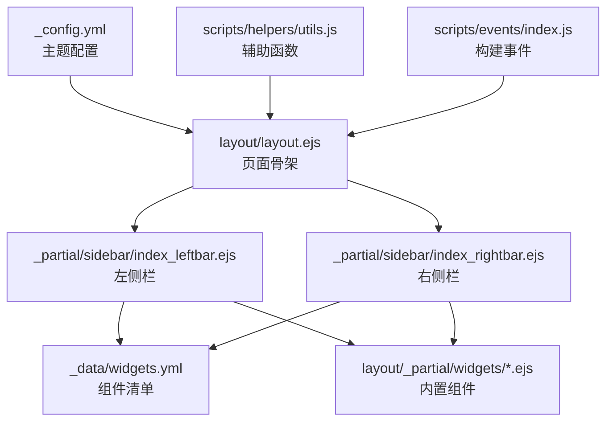
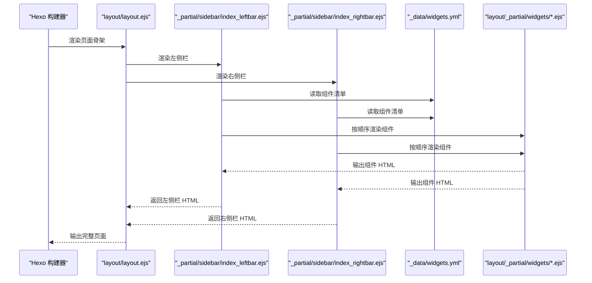
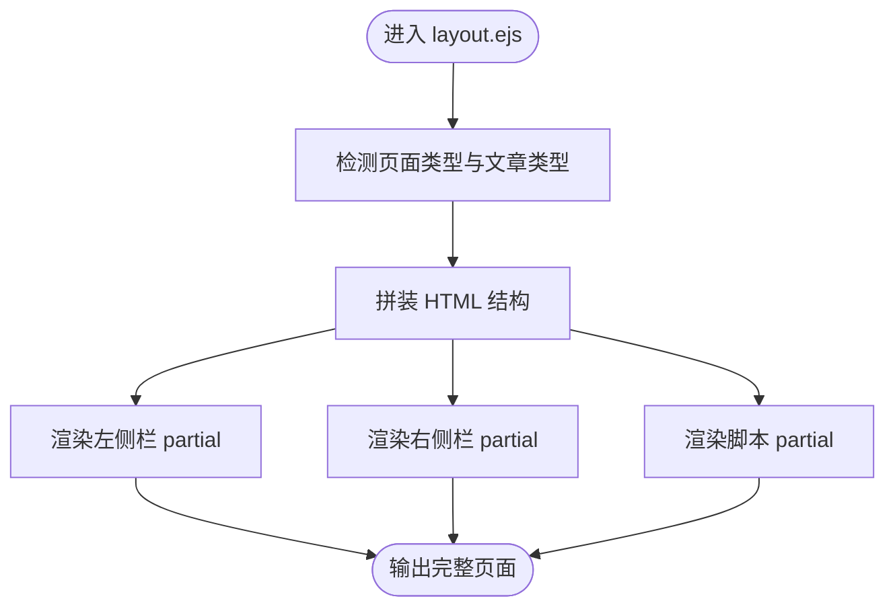
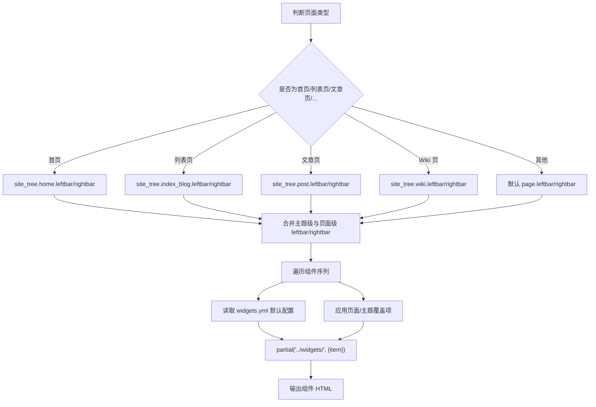
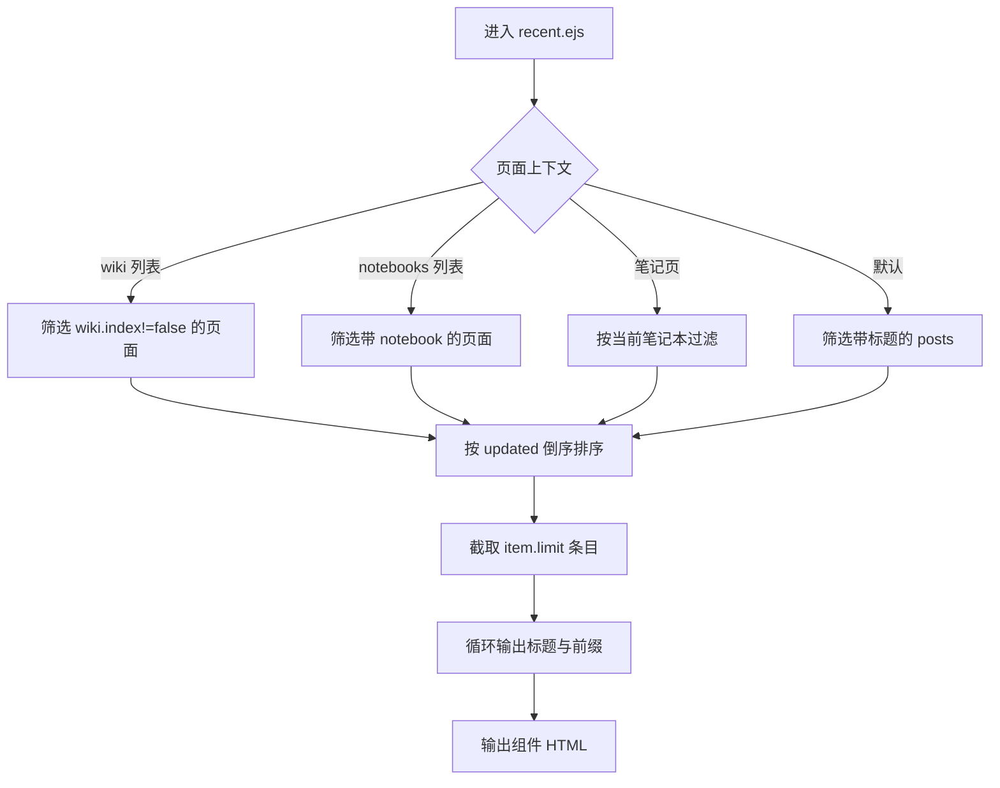
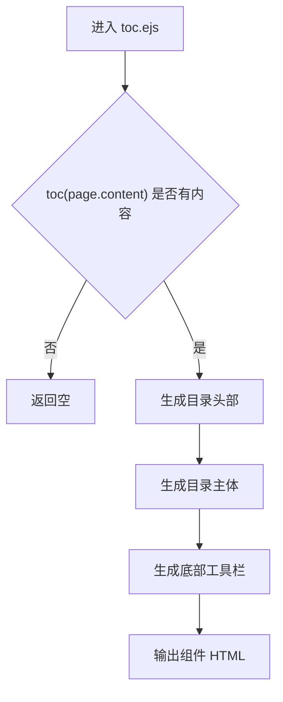
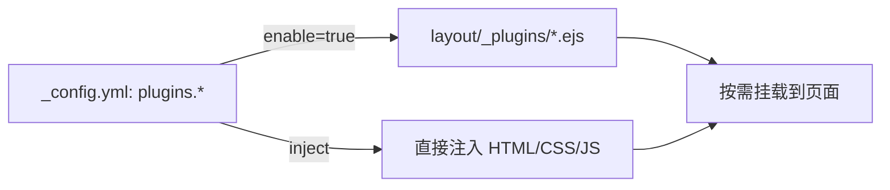
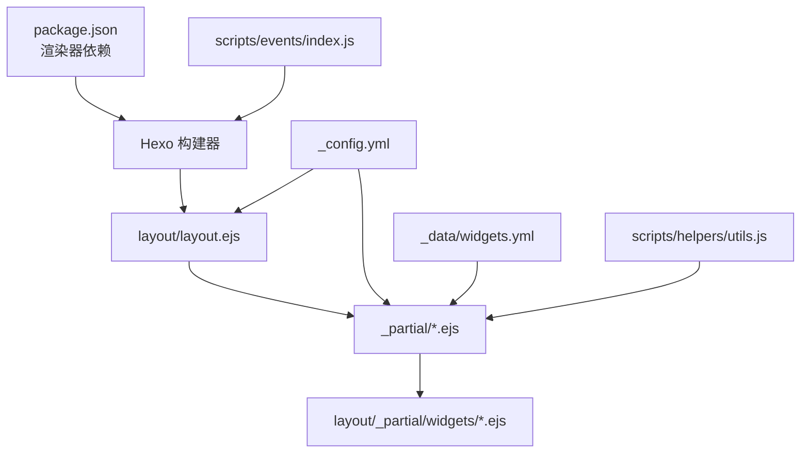

# 组件开发

<cite>
**本文引用的文件**
- [themes/stellar/_config.yml](file://themes/stellar/_config.yml)
- [themes/stellar/package.json](file://themes/stellar/package.json)
- [themes/stellar/layout/layout.ejs](file://themes/stellar/layout/layout.ejs)
- [themes/stellar/layout/_partial/sidebar/index_leftbar.ejs](file://themes/stellar/layout/_partial/sidebar/index_leftbar.ejs)
- [themes/stellar/layout/_partial/sidebar/index_rightbar.ejs](file://themes/stellar/layout/_partial/sidebar/index_rightbar.ejs)
- [themes/stellar/layout/_partial/sidebar/logo.ejs](file://themes/stellar/layout/_partial/sidebar/logo.ejs)
- [themes/stellar/layout/_partial/menubtn.ejs](file://themes/stellar/layout/_partial/menubtn.ejs)
- [themes/stellar/_data/widgets.yml](file://themes/stellar/_data/widgets.yml)
- [themes/stellar/layout/_partial/widgets/recent.ejs](file://themes/stellar/layout/_partial/widgets/recent.ejs)
- [themes/stellar/layout/_partial/widgets/toc.ejs](file://themes/stellar/layout/_partial/widgets/toc.ejs)
- [themes/stellar/layout/_partial/widgets/tagcloud.ejs](file://themes/stellar/layout/_partial/widgets/tagcloud.ejs)
- [themes/stellar/scripts/helpers/utils.js](file://themes/stellar/scripts/helpers/utils.js)
- [themes/stellar/scripts/events/index.js](file://themes/stellar/scripts/events/index.js)
</cite>

## 目录
1. [引言](#引言)
2. [项目结构](#项目结构)
3. [核心组件](#核心组件)
4. [架构总览](#架构总览)
5. [详细组件分析](#详细组件分析)
6. [依赖关系分析](#依赖关系分析)
7. [性能考量](#性能考量)
8. [故障排查指南](#故障排查指南)
9. [结论](#结论)
10. [附录](#附录)

## 引言
本指南面向希望在 H1S97X 博客的 Stellar 主题中进行组件开发的工程师与内容创作者。文档围绕主题模板系统（页面布局、小部件系统、插件机制）展开，详解如何开发自定义页面组件（EJS 模板语法、数据绑定、条件渲染）、侧边栏组件（注册、配置管理、动态加载），并提供可复用的组件开发范式、性能优化与兼容性最佳实践。读者无需深入掌握底层实现细节，也能通过本文快速上手。

## 项目结构
Stellar 主题采用 Hexo EJS 模板引擎与模块化布局组织，核心结构如下：
- 配置层：主题配置集中于 _config.yml，涵盖站点树、侧边栏、文章样式、插件与依赖等。
- 布局层：layout/*.ejs 定义页面骨架与容器，_partial 下的子布局负责局部结构（侧边栏、头部、脚本等）。
- 数据层：_data/*.yml 提供组件与主题数据（如 widgets.yml）。
- 脚本层：scripts/helpers 与 scripts/events 提供辅助函数与构建事件钩子。
- 插件层：layout/_plugins 下的 EJS 插件按需注入资源与行为。

**图表来源**
- [themes/stellar/_config.yml](file://themes/stellar/_config.yml#L72-L152)
- [themes/stellar/layout/layout.ejs](file://themes/stellar/layout/layout.ejs#L41-L76)
- [themes/stellar/layout/_partial/sidebar/index_leftbar.ejs](file://themes/stellar/layout/_partial/sidebar/index_leftbar.ejs#L1-L167)
- [themes/stellar/layout/_partial/sidebar/index_rightbar.ejs](file://themes/stellar/layout/_partial/sidebar/index_rightbar.ejs#L1-L94)
- [themes/stellar/_data/widgets.yml](file://themes/stellar/_data/widgets.yml#L1-L85)

**章节来源**
- [themes/stellar/_config.yml](file://themes/stellar/_config.yml#L1-L725)
- [themes/stellar/layout/layout.ejs](file://themes/stellar/layout/layout.ejs#L1-L76)

## 核心组件
- 页面布局系统：通过 layout.ejs 统一输出 HTML 结构，按页面类型与文章类型动态注入侧边栏、封面、脚本等。
- 侧边栏组件系统：index_leftbar.ejs 与 index_rightbar.ejs 根据站点树与页面上下文动态装配组件，组件清单来自 widgets.yml。
- 插件机制：通过 _config.yml 的 plugins 段落声明插件，配合 layout/_plugins 下的 EJS 文件按需注入资源与行为。
- 辅助与事件：helpers 提供数据查询与工具方法，events 在构建前后执行预处理与版本检查。

**章节来源**
- [themes/stellar/layout/layout.ejs](file://themes/stellar/layout/layout.ejs#L1-L76)
- [themes/stellar/layout/_partial/sidebar/index_leftbar.ejs](file://themes/stellar/layout/_partial/sidebar/index_leftbar.ejs#L1-L167)
- [themes/stellar/layout/_partial/sidebar/index_rightbar.ejs](file://themes/stellar/layout/_partial/sidebar/index_rightbar.ejs#L1-L94)
- [themes/stellar/_data/widgets.yml](file://themes/stellar/_data/widgets.yml#L1-L85)
- [themes/stellar/scripts/helpers/utils.js](file://themes/stellar/scripts/helpers/utils.js#L1-L21)
- [themes/stellar/scripts/events/index.js](file://themes/stellar/scripts/events/index.js#L1-L69)

## 架构总览
Stellar 的组件化架构以“配置驱动 + 模板渲染 + 动态装配”为核心：
- 配置驱动：_config.yml 的 site_tree、widgets、plugins 等决定页面布局与组件装配。
- 模板渲染：EJS 模板在渲染阶段解析变量、调用 helper、拼装 HTML。
- 动态装配：根据页面上下文（首页、文章页、wiki 页等）选择侧边栏组件集合，并逐个渲染。

**图表来源**
- [themes/stellar/layout/layout.ejs](file://themes/stellar/layout/layout.ejs#L41-L76)
- [themes/stellar/layout/_partial/sidebar/index_leftbar.ejs](file://themes/stellar/layout/_partial/sidebar/index_leftbar.ejs#L7-L53)
- [themes/stellar/layout/_partial/sidebar/index_rightbar.ejs](file://themes/stellar/layout/_partial/sidebar/index_rightbar.ejs#L7-L53)
- [themes/stellar/_data/widgets.yml](file://themes/stellar/_data/widgets.yml#L1-L85)

## 详细组件分析

### 页面布局与容器
- 页面骨架：layout.ejs 负责输出<html>/<body>、站点背景、主体容器与脚本区，并按页面类型与文章类型注入侧边栏与封面。
- 主体容器：l_body 根据 page_type、article_type、indent 等属性附加类名，影响样式与排版。
- 侧边栏与菜单按钮：左侧栏、右侧栏与浮动菜单按钮通过 partial 调用子布局渲染。

**图表来源**
- [themes/stellar/layout/layout.ejs](file://themes/stellar/layout/layout.ejs#L1-L76)

**章节来源**
- [themes/stellar/layout/layout.ejs](file://themes/stellar/layout/layout.ejs#L1-L76)

### 侧边栏组件系统
- 组件装配逻辑：index_leftbar.ejs 与 index_rightbar.ejs 根据站点树与页面上下文（首页、列表页、文章页、wiki 页等）确定组件序列，再逐个渲染。
- 组件配置来源：_data/widgets.yml 定义组件布局与默认参数；页面可通过 front-matter 或主题配置覆盖组件行为。
- 组件渲染：每个组件以 partial('../widgets/<layout>') 方式渲染，传入 item 作为组件配置对象。

**图表来源**
- [themes/stellar/layout/_partial/sidebar/index_leftbar.ejs](file://themes/stellar/layout/_partial/sidebar/index_leftbar.ejs#L7-L53)
- [themes/stellar/layout/_partial/sidebar/index_rightbar.ejs](file://themes/stellar/layout/_partial/sidebar/index_rightbar.ejs#L7-L53)
- [themes/stellar/_data/widgets.yml](file://themes/stellar/_data/widgets.yml#L1-L85)

**章节来源**
- [themes/stellar/layout/_partial/sidebar/index_leftbar.ejs](file://themes/stellar/layout/_partial/sidebar/index_leftbar.ejs#L1-L167)
- [themes/stellar/layout/_partial/sidebar/index_rightbar.ejs](file://themes/stellar/layout/_partial/sidebar/index_rightbar.ejs#L1-L94)
- [themes/stellar/_data/widgets.yml](file://themes/stellar/_data/widgets.yml#L1-L85)

### 内置组件示例

#### 最近更新组件（recent）
- 功能：按更新时间倒序展示最近文章或笔记，支持 RSS 订阅入口。
- 数据来源：根据页面上下文筛选 site.posts、site.pages 或 wiki 页面集合。
- 渲染要点：组件头部包含标题与 RSS 链接；主体循环输出文章标题与可选的项目/笔记本前缀。

**图表来源**
- [themes/stellar/layout/_partial/widgets/recent.ejs](file://themes/stellar/layout/_partial/widgets/recent.ejs#L14-L35)

**章节来源**
- [themes/stellar/layout/_partial/widgets/recent.ejs](file://themes/stellar/layout/_partial/widgets/recent.ejs#L1-L62)

#### 目录组件（toc）
- 功能：基于页面内容生成目录，支持最小/最大层级、折叠策略、跳转顶部与评论锚点。
- 渲染要点：当 toc(page.content) 有内容时渲染；头部包含“目录”标题与右栏切换按钮；底部提供回到顶部与评论锚点跳转。

**图表来源**
- [themes/stellar/layout/_partial/widgets/toc.ejs](file://themes/stellar/layout/_partial/widgets/toc.ejs#L3-L36)

**章节来源**
- [themes/stellar/layout/_partial/widgets/toc.ejs](file://themes/stellar/layout/_partial/widgets/toc.ejs#L1-L72)

#### 标签云组件（tagcloud）
- 功能：渲染站点标签云，支持字体范围、排序、颜色与计数显示。
- 渲染要点：将 item 中除保留字段外的键值传递给 tagcloud helper，生成带样式的标签列表。

**章节来源**
- [themes/stellar/layout/_partial/widgets/tagcloud.ejs](file://themes/stellar/layout/_partial/widgets/tagcloud.ejs#L1-L25)

### 插件机制
- 配置入口：_config.yml 的 plugins 段落声明插件开关与参数。
- 注入方式：若插件仅需引入外部资源，可在配置中使用 inject 字段；若需复杂逻辑，可在 layout/_plugins 下创建对应 EJS 文件，使用 utils.css/js 注入本地/外部资源。
- 常见插件：fancybox、swiper、scrollreveal、katex、mermaid、copycode、tianli_gpt 等。

**图表来源**
- [themes/stellar/_config.yml](file://themes/stellar/_config.yml#L523-L632)

**章节来源**
- [themes/stellar/_config.yml](file://themes/stellar/_config.yml#L523-L632)

### 自定义页面组件开发指南
- EJS 模板语法与数据绑定
  - 使用变量：如 page、theme、site、item 等，通过 EJS 输出标签与属性。
  - 条件渲染：根据页面类型、front-matter 或配置分支渲染不同内容。
  - 循环渲染：遍历 posts/pages/tags 等集合，输出列表项。
- 组件注册与装配
  - 在 _data/widgets.yml 中定义组件布局与默认参数。
  - 在页面或主题配置中通过 site_tree 的 leftbar/rightbar 指定组件序列。
  - 组件渲染时通过 partial('../widgets/<layout>') 传入 item 配置对象。
- 动态加载与按需渲染
  - 通过 helpers 与 filters 在构建期或运行期准备数据。
  - 使用 utils.css/utils.js 注入资源，避免全局加载。

**章节来源**
- [themes/stellar/layout/_partial/sidebar/index_leftbar.ejs](file://themes/stellar/layout/_partial/sidebar/index_leftbar.ejs#L78-L112)
- [themes/stellar/layout/_partial/sidebar/index_rightbar.ejs](file://themes/stellar/layout/_partial/sidebar/index_rightbar.ejs#L61-L91)
- [themes/stellar/_data/widgets.yml](file://themes/stellar/_data/widgets.yml#L1-L85)

### 组件开发案例

#### 自定义导航栏
- 思路：在侧边栏中插入自定义组件，使用 theme.menubar 配置项渲染菜单项；或在主内容区插入 logo.ejs 以适配不同场景。
- 关键点：结合 where 参数（sidebar/main）与页面 header 控制显示；使用 icon helper 输出图标。

**章节来源**
- [themes/stellar/layout/_partial/sidebar/logo.ejs](file://themes/stellar/layout/_partial/sidebar/logo.ejs#L40-L75)
- [themes/stellar/layout/_partial/menubtn.ejs](file://themes/stellar/layout/_partial/menubtn.ejs#L1-L9)

#### 搜索组件
- 思路：在 index_leftbar.ejs 中优先渲染 search 组件，再渲染其余组件；search 配置可来自页面或主题 wiki/topic 的 search 字段。
- 关键点：search 组件通过 partial('search', {item}) 渲染，确保与主题搜索服务一致。

**章节来源**
- [themes/stellar/layout/_partial/sidebar/index_leftbar.ejs](file://themes/stellar/layout/_partial/sidebar/index_leftbar.ejs#L82-L90)

#### 社交分享组件
- 思路：在侧边栏底部使用 layoutFooterDiv 渲染社交链接；或在内容页通过插件注入分享按钮。
- 关键点：icon 支持 SVG 与图片；外链自动添加安全属性与新窗口打开。

**章节来源**
- [themes/stellar/layout/_partial/sidebar/index_leftbar.ejs](file://themes/stellar/layout/_partial/sidebar/index_leftbar.ejs#L113-L146)

## 依赖关系分析
- 渲染依赖：layout.ejs 依赖 _partial 下的子布局；子布局依赖 widgets/*.ejs 与 helpers。
- 配置依赖：widgets.yml 与 _config.yml 的 plugins、site_tree、style 等共同决定组件装配与样式。
- 构建事件：events/index.js 在 generateBefore/generateAfter/ready 阶段执行配置合并、版本检查与开发期修复。

**图表来源**
- [themes/stellar/package.json](file://themes/stellar/package.json#L23-L28)
- [themes/stellar/layout/layout.ejs](file://themes/stellar/layout/layout.ejs#L41-L76)
- [themes/stellar/_config.yml](file://themes/stellar/_config.yml#L72-L152)
- [themes/stellar/_data/widgets.yml](file://themes/stellar/_data/widgets.yml#L1-L85)
- [themes/stellar/scripts/events/index.js](file://themes/stellar/scripts/events/index.js#L5-L18)
- [themes/stellar/scripts/helpers/utils.js](file://themes/stellar/scripts/helpers/utils.js#L7-L20)

**章节来源**
- [themes/stellar/package.json](file://themes/stellar/package.json#L1-L33)
- [themes/stellar/scripts/events/index.js](file://themes/stellar/scripts/events/index.js#L1-L69)
- [themes/stellar/scripts/helpers/utils.js](file://themes/stellar/scripts/helpers/utils.js#L1-L21)

## 性能考量
- 按需加载：插件与服务通过 data_services 与 plugins 按需加载，未使用则不引入。
- 图片懒加载：依赖配置中的 lazyload 与 ratio 修正，开发期自动处理 Markdown 图片标签。
- 目录与滚动：toc 组件支持折叠与滚动定位；scrollreveal 需谨慎开启以免影响首屏渲染。
- 资源注入：使用 utils.css/utils.js 注入本地资源，避免重复请求与阻塞。

**章节来源**
- [themes/stellar/_config.yml](file://themes/stellar/_config.yml#L464-L521)
- [themes/stellar/scripts/events/index.js](file://themes/stellar/scripts/events/index.js#L46-L66)

## 故障排查指南
- 组件未显示
  - 检查 site_tree 中对应页面的 leftbar/rightbar 是否为空或被覆盖。
  - 确认 widgets.yml 中组件 layout 是否存在，且组件未被禁用。
- 图片比例异常
  - 开发期启用 lazyload.fix_ratio 后，构建前会生成比例缓存并修正 Markdown 图片标签。
- 插件未生效
  - 确认 _config.yml 中 plugins.enable 已开启；若为外部资源注入，检查 inject 字段是否正确。
- 评论与目录跳转无效
  - 确认 toc 组件内容是否生成；检查 page.comments 配置与评论服务是否启用。

**章节来源**
- [themes/stellar/layout/_partial/sidebar/index_leftbar.ejs](file://themes/stellar/layout/_partial/sidebar/index_leftbar.ejs#L7-L53)
- [themes/stellar/layout/_partial/widgets/toc.ejs](file://themes/stellar/layout/_partial/widgets/toc.ejs#L38-L67)
- [themes/stellar/scripts/events/index.js](file://themes/stellar/scripts/events/index.js#L46-L66)

## 结论
Stellar 主题通过“配置驱动 + EJS 模板 + 动态装配”的方式实现了高度可扩展的组件化体系。开发者只需在 _data/widgets.yml 中注册组件、在 _config.yml 中配置插件与站点树，即可在任意页面灵活组合侧边栏组件。借助 helpers 与 events，主题在构建期完成数据准备与资源注入，兼顾易用性与性能。遵循本文提供的开发范式与最佳实践，可高效实现自定义导航栏、搜索、社交分享等组件，并确保跨页面的一致体验与良好性能。

## 附录
- 常用 helper 与工具
  - get_page：根据 _id 获取页面或文章对象。
  - icon：输出图标（SVG/图片）。
  - url_for：生成绝对/相对链接。
  - pretty_url：美化链接。
  - toc：从页面内容生成目录。
- 常用配置键
  - site_tree：页面类型与侧边栏组件序列。
  - widgets：组件布局与默认参数。
  - plugins：插件开关与资源注入。
  - style：主题样式与动画配置。

**章节来源**
- [themes/stellar/scripts/helpers/utils.js](file://themes/stellar/scripts/helpers/utils.js#L7-L20)
- [themes/stellar/layout/_partial/widgets/toc.ejs](file://themes/stellar/layout/_partial/widgets/toc.ejs#L5-L12)