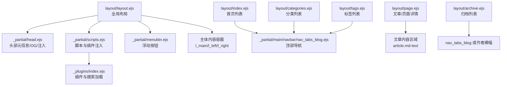
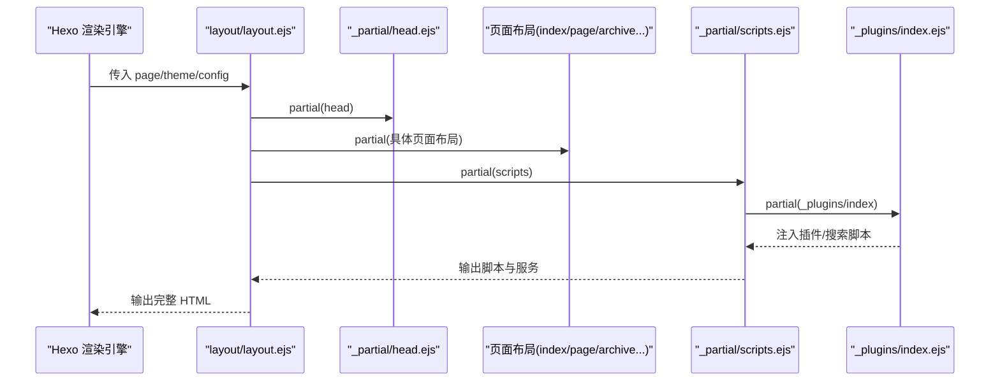
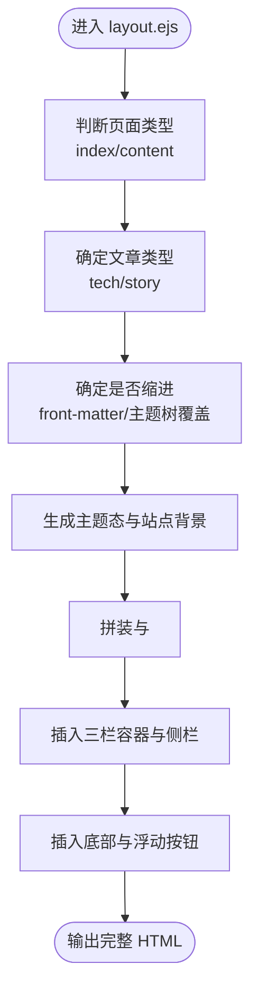
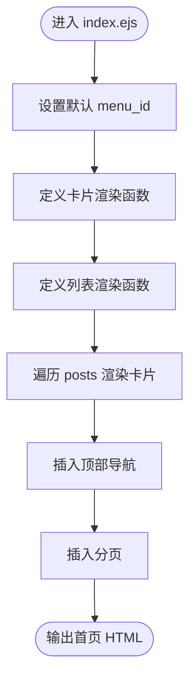
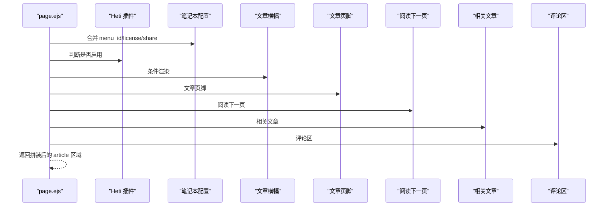
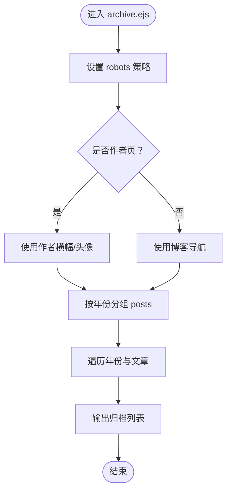
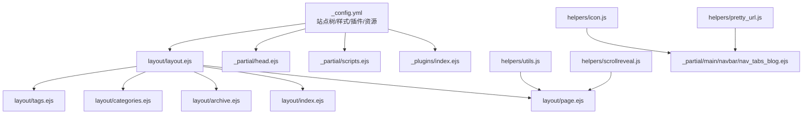

# 页面布局系统

<cite>
**本文引用的文件**
- [themes/stellar/layout/layout.ejs](file://themes/stellar/layout/layout.ejs)
- [themes/stellar/layout/index.ejs](file://themes/stellar/layout/index.ejs)
- [themes/stellar/layout/page.ejs](file://themes/stellar/layout/page.ejs)
- [themes/stellar/layout/archive.ejs](file://themes/stellar/layout/archive.ejs)
- [themes/stellar/layout/categories.ejs](file://themes/stellar/layout/categories.ejs)
- [themes/stellar/layout/tags.ejs](file://themes/stellar/layout/tags.ejs)
- [themes/stellar/layout/_partial/head.ejs](file://themes/stellar/layout/_partial/head.ejs)
- [themes/stellar/layout/_partial/scripts.ejs](file://themes/stellar/layout/_partial/scripts.ejs)
- [themes/stellar/layout/_partial/menubtn.ejs](file://themes/stellar/layout/_partial/menubtn.ejs)
- [themes/stellar/layout/_partial/main/navbar/nav_tabs_blog.ejs](file://themes/stellar/layout/_partial/main/navbar/nav_tabs_blog.ejs)
- [themes/stellar/layout/_plugins/index.ejs](file://themes/stellar/layout/_plugins/index.ejs)
- [themes/stellar/_config.yml](file://themes/stellar/_config.yml)
- [themes/stellar/scripts/helpers/utils.js](file://themes/stellar/scripts/helpers/utils.js)
- [themes/stellar/scripts/helpers/scrollreveal.js](file://themes/stellar/scripts/helpers/scrollreveal.js)
- [themes/stellar/scripts/helpers/icon.js](file://themes/stellar/scripts/helpers/icon.js)
- [themes/stellar/scripts/helpers/pretty_url.js](file://themes/stellar/scripts/helpers/pretty_url.js)
</cite>

## 目录
1. [简介](#简介)
2. [项目结构](#项目结构)
3. [核心组件](#核心组件)
4. [架构总览](#架构总览)
5. [详细组件分析](#详细组件分析)
6. [依赖关系分析](#依赖关系分析)
7. [性能考虑](#性能考虑)
8. [故障排查指南](#故障排查指南)
9. [结论](#结论)
10. [附录](#附录)

## 简介
本指南面向使用 Hexo + Stellar 主题的开发者与内容运营人员，系统讲解页面布局系统的开发方法，重点涵盖：
- EJS 模板引擎在 Stellar 中的使用方式：模板语法、数据绑定、条件渲染与函数封装
- 各类页面布局结构：首页、文章页、页面页、归档页、分类/标签页等
- 自定义页面布局、响应式与移动端适配实践
- 布局继承、块定义与内容替换的高级用法
- 性能优化策略与最佳实践

## 项目结构
Stellar 主题的布局层位于 themes/stellar/layout 及其子目录，采用 EJS 模板组织页面骨架与内容区块。关键目录与文件如下：
- 布局根：layout.ejs 作为全局布局模板，负责 HTML 结构、主题态、背景、左右栏与主体内容容器
- 页面布局：index.ejs（首页）、page.ejs（文章/页面）、archive.ejs（归档）、categories.ejs（分类）、tags.ejs（标签）
- 局部组件：_partial 下的 head.ejs、scripts.ejs、menubtn.ejs、navbar 子目录等
- 插件接入：_plugins/index.ejs 统一加载主题插件与搜索服务
- 主题配置：_config.yml 提供站点树、文章样式、插件开关、样式与资源路径等

**图表来源**
- [themes/stellar/layout/layout.ejs](file://themes/stellar/layout/layout.ejs#L1-L76)
- [themes/stellar/layout/_partial/head.ejs](file://themes/stellar/layout/_partial/head.ejs#L1-L156)
- [themes/stellar/layout/_partial/scripts.ejs](file://themes/stellar/layout/_partial/scripts.ejs#L1-L37)
- [themes/stellar/layout/_partial/menubtn.ejs](file://themes/stellar/layout/_partial/menubtn.ejs#L1-L9)
- [themes/stellar/layout/_partial/main/navbar/nav_tabs_blog.ejs](file://themes/stellar/layout/_partial/main/navbar/nav_tabs_blog.ejs#L1-L71)
- [themes/stellar/layout/index.ejs](file://themes/stellar/layout/index.ejs#L1-L41)
- [themes/stellar/layout/page.ejs](file://themes/stellar/layout/page.ejs#L1-L69)
- [themes/stellar/layout/archive.ejs](file://themes/stellar/layout/archive.ejs#L1-L68)
- [themes/stellar/layout/categories.ejs](file://themes/stellar/layout/categories.ejs#L1-L24)
- [themes/stellar/layout/tags.ejs](file://themes/stellar/layout/tags.ejs#L1-L21)
- [themes/stellar/layout/_plugins/index.ejs](file://themes/stellar/layout/_plugins/index.ejs#L1-L25)

**章节来源**
- [themes/stellar/layout/layout.ejs](file://themes/stellar/layout/layout.ejs#L1-L76)
- [themes/stellar/layout/_partial/head.ejs](file://themes/stellar/layout/_partial/head.ejs#L1-L156)
- [themes/stellar/layout/_partial/scripts.ejs](file://themes/stellar/layout/_partial/scripts.ejs#L1-L37)
- [themes/stellar/layout/_partial/menubtn.ejs](file://themes/stellar/layout/_partial/menubtn.ejs#L1-L9)
- [themes/stellar/layout/_partial/main/navbar/nav_tabs_blog.ejs](file://themes/stellar/layout/_partial/main/navbar/nav_tabs_blog.ejs#L1-L71)
- [themes/stellar/layout/index.ejs](file://themes/stellar/layout/index.ejs#L1-L41)
- [themes/stellar/layout/page.ejs](file://themes/stellar/layout/page.ejs#L1-L69)
- [themes/stellar/layout/archive.ejs](file://themes/stellar/layout/archive.ejs#L1-L68)
- [themes/stellar/layout/categories.ejs](file://themes/stellar/layout/categories.ejs#L1-L24)
- [themes/stellar/layout/tags.ejs](file://themes/stellar/layout/tags.ejs#L1-L21)
- [themes/stellar/layout/_plugins/index.ejs](file://themes/stellar/layout/_plugins/index.ejs#L1-L25)

## 核心组件
- 全局布局 layout.ejs：决定页面类型（首页/内容页）、文章类型（tech/story）、是否缩进、主题态、背景与三栏结构；通过 partial 注入头部、封面、左右栏、主体、浮动按钮与脚本
- 页面布局：
  - index.ejs：首页卡片列表与分页，支持 nav_tabs 与 post_card 布局函数
  - page.ejs：文章/页面详情，支持 Heti 排版、横幅、面包屑、相关文章、评论区等模块拼装
  - archive.ejs：按年份归档列表，支持作者页横幅与导航切换
  - categories.ejs/tags.ejs：分类/标签聚合页
- 局部组件：
  - head.ejs：标题、描述、关键词、robots、Open Graph、预连接、JSON-LD、自定义注入
  - scripts.ejs：脚本加载顺序、评论脚本、服务脚本与插件注入
  - menubtn.ejs：移动端左右栏切换按钮
  - nav_tabs_blog.ejs：博客页顶部导航（近期/分类/标签/专题/归档/自定义）
- 插件系统：_plugins/index.ejs 统一加载搜索与主题插件（如 mermaid、katex、swiper、fancybox、tianli_gpt 等）

**章节来源**
- [themes/stellar/layout/layout.ejs](file://themes/stellar/layout/layout.ejs#L1-L76)
- [themes/stellar/layout/index.ejs](file://themes/stellar/layout/index.ejs#L1-L41)
- [themes/stellar/layout/page.ejs](file://themes/stellar/layout/page.ejs#L1-L69)
- [themes/stellar/layout/archive.ejs](file://themes/stellar/layout/archive.ejs#L1-L68)
- [themes/stellar/layout/categories.ejs](file://themes/stellar/layout/categories.ejs#L1-L24)
- [themes/stellar/layout/tags.ejs](file://themes/stellar/layout/tags.ejs#L1-L21)
- [themes/stellar/layout/_partial/head.ejs](file://themes/stellar/layout/_partial/head.ejs#L1-L156)
- [themes/stellar/layout/_partial/scripts.ejs](file://themes/stellar/layout/_partial/scripts.ejs#L1-L37)
- [themes/stellar/layout/_partial/menubtn.ejs](file://themes/stellar/layout/_partial/menubtn.ejs#L1-L9)
- [themes/stellar/layout/_partial/main/navbar/nav_tabs_blog.ejs](file://themes/stellar/layout/_partial/main/navbar/nav_tabs_blog.ejs#L1-L71)
- [themes/stellar/layout/_plugins/index.ejs](file://themes/stellar/layout/_plugins/index.ejs#L1-L25)

## 架构总览
Stellar 的页面渲染遵循“全局布局 + 页面布局 + 局部组件 + 插件”的分层架构。EJS 通过 page、theme、config、helpers 等上下文对象访问数据与工具函数。

**图表来源**
- [themes/stellar/layout/layout.ejs](file://themes/stellar/layout/layout.ejs#L41-L76)
- [themes/stellar/layout/_partial/head.ejs](file://themes/stellar/layout/_partial/head.ejs#L112-L156)
- [themes/stellar/layout/_partial/scripts.ejs](file://themes/stellar/layout/_partial/scripts.ejs#L18-L37)
- [themes/stellar/layout/_plugins/index.ejs](file://themes/stellar/layout/_plugins/index.ejs#L2-L25)

## 详细组件分析

### 全局布局：layout.ejs
- 页面类型判断：根据 page.layout 与 nav_tabs 等标志决定首页或内容页
- 文章类型与缩进：依据 theme.article.type 与 front-matter/主题树覆盖，控制 story 类型段距
- 主题态与背景：根据 theme.style.prefers_theme 与 site 背景配置生成 html 属性与背景层
- 三栏结构：左侧栏（左栏）、主体（主内容）、右侧栏（右栏），通过 partial 注入各模块
- 浮动按钮：移动端左右栏切换入口

**图表来源**
- [themes/stellar/layout/layout.ejs](file://themes/stellar/layout/layout.ejs#L1-L76)

**章节来源**
- [themes/stellar/layout/layout.ejs](file://themes/stellar/layout/layout.ejs#L1-L76)

### 首页布局：index.ejs
- 默认 menu_id：若未设置则回退为 post
- 卡片渲染：layout_post_card 根据封面/海报决定卡片样式
- 列表渲染：layout_post_list 遍历 page.posts，过滤 indexing=false 的条目
- 导航与分页：顶部 nav_tabs 与分页组件

**图表来源**
- [themes/stellar/layout/index.ejs](file://themes/stellar/layout/index.ejs#L1-L41)

**章节来源**
- [themes/stellar/layout/index.ejs](file://themes/stellar/layout/index.ejs#L1-L41)

### 文章/页面布局：page.ejs
- 插件开关：根据 theme.plugins.heti 切换 Heti 排版
- 笔记本覆盖：根据 page.notebook 合并 menu_id、license、share
- 默认 menu_id：优先 wiki/topic，其次 post
- 文章类 class：根据是否启用 Heti 动态拼接
- 内容拼装：根据 layout 与 page.wiki/notebook 条件渲染横幅、标签、相关文章、评论区等

**图表来源**
- [themes/stellar/layout/page.ejs](file://themes/stellar/layout/page.ejs#L1-L69)

**章节来源**
- [themes/stellar/layout/page.ejs](file://themes/stellar/layout/page.ejs#L1-L69)

### 归档布局：archive.ejs
- robots 策略：默认 noindex,follow
- 作者页支持：当 page.author 存在时，使用作者横幅与头像信息
- 年份分组：按年份排序并分组输出归档列表
- 导航切换：作者页使用 nav_tabs_blog，普通归档页使用 nav_tabs

**图表来源**
- [themes/stellar/layout/archive.ejs](file://themes/stellar/layout/archive.ejs#L1-L68)

**章节来源**
- [themes/stellar/layout/archive.ejs](file://themes/stellar/layout/archive.ejs#L1-L68)

### 分类/标签布局：categories.ejs、tags.ejs
- robots 策略：默认 noindex,follow
- 标题与布局：根据站点分类/标签集合渲染
- 导航：统一插入博客导航 nav_tabs_blog
- 排序：分类按路径排序，标签按数量降序

**章节来源**
- [themes/stellar/layout/categories.ejs](file://themes/stellar/layout/categories.ejs#L1-L24)
- [themes/stellar/layout/tags.ejs](file://themes/stellar/layout/tags.ejs#L1-L21)

### 头部与脚本：head.ejs、scripts.ejs
- head.ejs：
  - 标题生成：优先 wiki 项目名 + 页面标题，其次按类别/标签生成
  - 描述与关键词：支持 page.description/excerpt/content 与 tags
  - robots：备份站点禁索引，首页默认允许，其他页面可按需 noindex
  - Open Graph：根据 page.layout 与 cover 设置 Twitter Card
  - 预连接与 JSON-LD：按配置注入
- scripts.ejs：
  - 自定义注入：config/theme/page 的 inject.script 合并
  - 加载顺序：utils → sidebar → tagtree → lazyload → main.js → theme → comments → services → _plugins → 自定义注入

**章节来源**
- [themes/stellar/layout/_partial/head.ejs](file://themes/stellar/layout/_partial/head.ejs#L1-L156)
- [themes/stellar/layout/_partial/scripts.ejs](file://themes/stellar/layout/_partial/scripts.ejs#L1-L37)

### 插件系统：_plugins/index.ejs
- 搜索服务：根据 theme.search.service 动态加载对应 partial
- 主题插件：遍历 theme.plugins，合并 page.xxx 与 conf.enable，支持 inject 直接注入或 partial 加载
- 典型插件：mermaid、katex、swiper、fancybox、tianli_gpt、copycode、preload 等

**章节来源**
- [themes/stellar/layout/_plugins/index.ejs](file://themes/stellar/layout/_plugins/index.ejs#L1-L25)

### 辅助函数与工具
- utils.get_page：在 pages/posts 中按 _id 查找页面或文章
- scrollreveal：根据 theme.plugins.scrollreveal.enable 返回 slide-up 类名
- icon：统一图标渲染
- pretty_url：统一美化 URL，去除 index.html、.html，补全斜杠，去重斜杠

**章节来源**
- [themes/stellar/scripts/helpers/utils.js](file://themes/stellar/scripts/helpers/utils.js#L1-L21)
- [themes/stellar/scripts/helpers/scrollreveal.js](file://themes/stellar/scripts/helpers/scrollreveal.js#L1-L10)
- [themes/stellar/scripts/helpers/icon.js](file://themes/stellar/scripts/helpers/icon.js#L1-L6)
- [themes/stellar/scripts/helpers/pretty_url.js](file://themes/stellar/scripts/helpers/pretty_url.js#L1-L28)

## 依赖关系分析
- 布局耦合：layout.ejs 作为根布局，依赖 head.ejs、scripts.ejs、menubtn.ejs 与各页面布局
- 页面布局：index/page/archive/categories/tags 依赖 nav_tabs_blog 与各自局部模块
- 插件依赖：_plugins/index.ejs 依赖 theme.plugins 与 page.xxx 覆盖项
- 主题配置：_config.yml 提供站点树、文章样式、插件开关、样式与资源路径，被各布局与 helpers 读取

**图表来源**
- [themes/stellar/_config.yml](file://themes/stellar/_config.yml#L72-L152)
- [themes/stellar/layout/layout.ejs](file://themes/stellar/layout/layout.ejs#L1-L76)
- [themes/stellar/layout/_partial/head.ejs](file://themes/stellar/layout/_partial/head.ejs#L1-L156)
- [themes/stellar/layout/_partial/scripts.ejs](file://themes/stellar/layout/_partial/scripts.ejs#L1-L37)
- [themes/stellar/layout/_plugins/index.ejs](file://themes/stellar/layout/_plugins/index.ejs#L1-L25)
- [themes/stellar/layout/index.ejs](file://themes/stellar/layout/index.ejs#L1-L41)
- [themes/stellar/layout/page.ejs](file://themes/stellar/layout/page.ejs#L1-L69)
- [themes/stellar/layout/archive.ejs](file://themes/stellar/layout/archive.ejs#L1-L68)
- [themes/stellar/layout/categories.ejs](file://themes/stellar/layout/categories.ejs#L1-L24)
- [themes/stellar/layout/tags.ejs](file://themes/stellar/layout/tags.ejs#L1-L21)
- [themes/stellar/layout/_partial/main/navbar/nav_tabs_blog.ejs](file://themes/stellar/layout/_partial/main/navbar/nav_tabs_blog.ejs#L1-L71)
- [themes/stellar/scripts/helpers/utils.js](file://themes/stellar/scripts/helpers/utils.js#L1-L21)
- [themes/stellar/scripts/helpers/scrollreveal.js](file://themes/stellar/scripts/helpers/scrollreveal.js#L1-L10)
- [themes/stellar/scripts/helpers/icon.js](file://themes/stellar/scripts/helpers/icon.js#L1-L6)
- [themes/stellar/scripts/helpers/pretty_url.js](file://themes/stellar/scripts/helpers/pretty_url.js#L1-L28)

**章节来源**
- [themes/stellar/_config.yml](file://themes/stellar/_config.yml#L72-L152)
- [themes/stellar/layout/layout.ejs](file://themes/stellar/layout/layout.ejs#L1-L76)

## 性能考虑
- 资源加载
  - 使用 theme.stellar.main_css/main_js 并带版本号缓存，减少重复加载
  - 仅在需要时加载插件与服务脚本，避免不必要的请求
- 图片与媒体
  - 合理设置懒加载与过渡效果，减少首屏阻塞
  - 使用预连接与 CDN，降低外部资源延迟
- SEO 与索引
  - 通过 robots 策略与 canonical 链接控制索引范围，避免重复内容
- 渲染优化
  - 使用 helpers.pretty_url 统一 URL，减少无效重定向
  - 控制文章类型与缩进，避免过度复杂排版导致渲染抖动

[本节为通用指导，无需列出章节来源]

## 故障排查指南
- 页面未正确渲染
  - 检查 layout.ejs 是否正确拼装三栏结构与 body
  - 确认 page.layout 与 nav_tabs 标志是否正确传递
- 标题/描述异常
  - 检查 head.ejs 的 generate_title/generate_description 逻辑与 page.wiki/page.title 等字段
- 插件未生效
  - 确认 _plugins/index.ejs 中 theme.plugins 对应项 enable=true，且 partial 存在
  - 检查 page.xxx 覆盖项是否与插件配置键一致
- 移动端交互异常
  - 检查 menubtn.ejs 的按钮事件与 sidebar.toggle 方法是否正确绑定
- URL 不规范
  - 使用 helpers.pretty_url 统一生成 URL，避免 index.html 与 .html 混用

**章节来源**
- [themes/stellar/layout/layout.ejs](file://themes/stellar/layout/layout.ejs#L41-L76)
- [themes/stellar/layout/_partial/head.ejs](file://themes/stellar/layout/_partial/head.ejs#L1-L156)
- [themes/stellar/layout/_plugins/index.ejs](file://themes/stellar/layout/_plugins/index.ejs#L1-L25)
- [themes/stellar/layout/_partial/menubtn.ejs](file://themes/stellar/layout/_partial/menubtn.ejs#L1-L9)
- [themes/stellar/scripts/helpers/pretty_url.js](file://themes/stellar/scripts/helpers/pretty_url.js#L1-L28)

## 结论
Stellar 的页面布局系统以 EJS 为核心，通过全局布局与局部组件的清晰分层，实现了高度可配置与可扩展的主题体验。开发者可通过主题配置、front-matter 覆盖与插件系统快速定制页面布局、提升性能与用户体验。建议在新增页面类型时，遵循现有布局结构与 helpers 约定，确保一致性与可维护性。

[本节为总结，无需列出章节来源]

## 附录

### EJS 模板语法与数据绑定要点
- 上下文对象
  - page：当前页面数据（如 layout、title、content、tags、category 等）
  - theme：主题配置（如 style、plugins、site_tree、article 等）
  - config：站点配置（如 title、description、feed、highlight 等）
  - helpers：内置与自定义 helper（如 icon、pretty_url、scrollreveal、utils）
- 常用语法
  - 输出：EJS 输出标签用于渲染 HTML 片段
  - 控制流：条件判断与循环，用于根据数据动态渲染
  - 函数：在模板中定义函数（如 layout_post_card、layoutDiv）复用渲染逻辑
- 数据绑定
  - 通过 page.xxx、theme.xxx、config.xxx 直接访问数据
  - 使用 helpers 对数据进行格式化与转换

**章节来源**
- [themes/stellar/layout/layout.ejs](file://themes/stellar/layout/layout.ejs#L1-L76)
- [themes/stellar/layout/index.ejs](file://themes/stellar/layout/index.ejs#L9-L33)
- [themes/stellar/layout/page.ejs](file://themes/stellar/layout/page.ejs#L30-L65)
- [themes/stellar/layout/_partial/head.ejs](file://themes/stellar/layout/_partial/head.ejs#L2-L47)
- [themes/stellar/scripts/helpers/pretty_url.js](file://themes/stellar/scripts/helpers/pretty_url.js#L1-L28)

### 页面类型与布局映射
- 首页：layout/index.ejs
- 文章页：layout/page.ejs（layout: post）
- 页面页：layout/page.ejs（layout: page）
- 归档页：layout/archive.ejs
- 分类页：layout/categories.ejs
- 标签页：layout/tags.ejs

**章节来源**
- [themes/stellar/layout/index.ejs](file://themes/stellar/layout/index.ejs#L1-L41)
- [themes/stellar/layout/page.ejs](file://themes/stellar/layout/page.ejs#L1-L69)
- [themes/stellar/layout/archive.ejs](file://themes/stellar/layout/archive.ejs#L1-L68)
- [themes/stellar/layout/categories.ejs](file://themes/stellar/layout/categories.ejs#L1-L24)
- [themes/stellar/layout/tags.ejs](file://themes/stellar/layout/tags.ejs#L1-L21)

### 响应式与移动端适配
- viewport 与主题色：head.ejs 设置 viewport、prefers-color-scheme 主题色
- 移动端按钮：menubtn.ejs 提供左右栏切换按钮
- 插件支持：swiper、fancybox、mermaid 等插件在移动端需注意尺寸与交互
- URL 规范：helpers.pretty_url 统一 URL，减少移动端跳转问题

**章节来源**
- [themes/stellar/layout/_partial/head.ejs](file://themes/stellar/layout/_partial/head.ejs#L125-L127)
- [themes/stellar/layout/_partial/menubtn.ejs](file://themes/stellar/layout/_partial/menubtn.ejs#L1-L9)
- [themes/stellar/scripts/helpers/pretty_url.js](file://themes/stellar/scripts/helpers/pretty_url.js#L1-L28)

### 布局继承与块替换（高级用法）
- 布局继承：通过 partial 机制在 layout.ejs 中引入 head、scripts、menubtn、sidebar 等模块，形成“根布局 + 局部模块”的继承关系
- 块定义与替换：在具体页面布局中，使用函数封装渲染逻辑（如 layout_post_card、layoutDiv），实现“块”级别的可替换
- 覆盖策略：通过 page.xxx 与 theme.site_tree 的配置，对默认行为进行覆盖（如 menu_id、leftbar/rightbar、nav_tabs）

**章节来源**
- [themes/stellar/layout/layout.ejs](file://themes/stellar/layout/layout.ejs#L41-L76)
- [themes/stellar/layout/index.ejs](file://themes/stellar/layout/index.ejs#L9-L33)
- [themes/stellar/layout/page.ejs](file://themes/stellar/layout/page.ejs#L30-L65)
- [themes/stellar/_config.yml](file://themes/stellar/_config.yml#L72-L152)