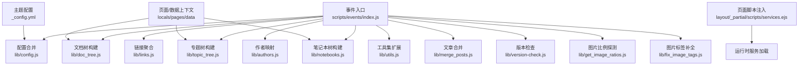
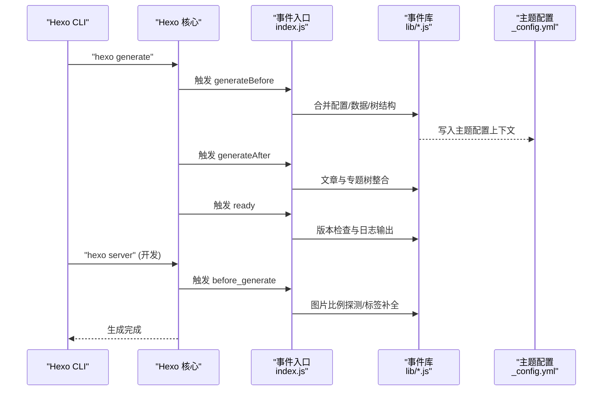
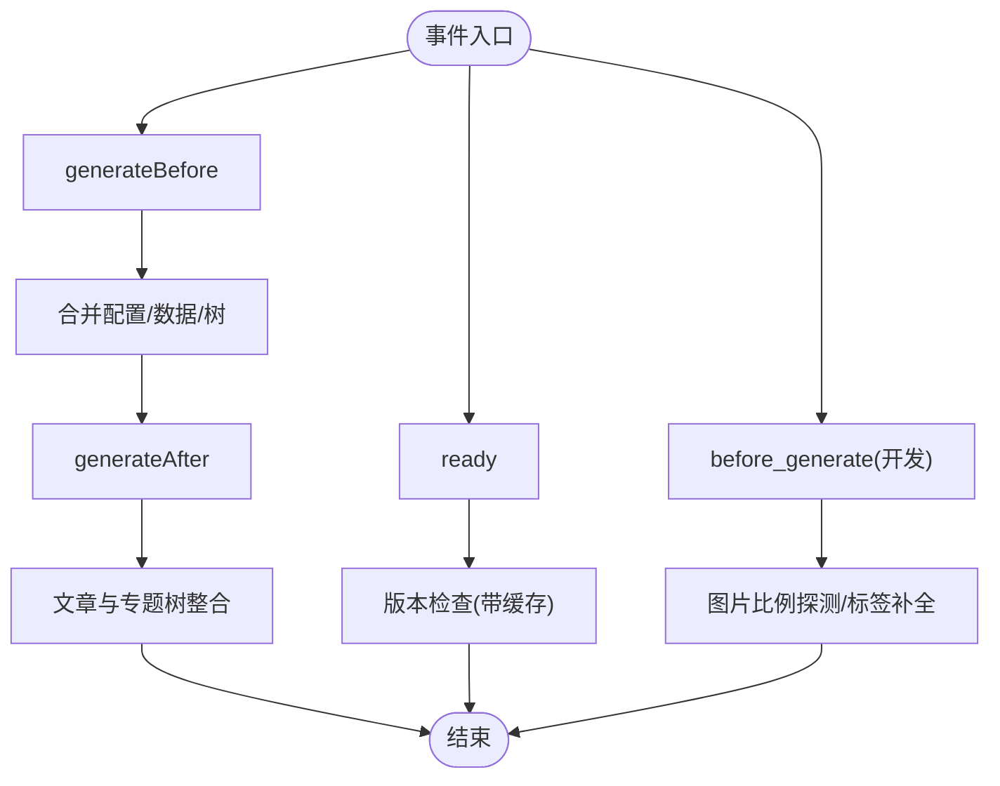
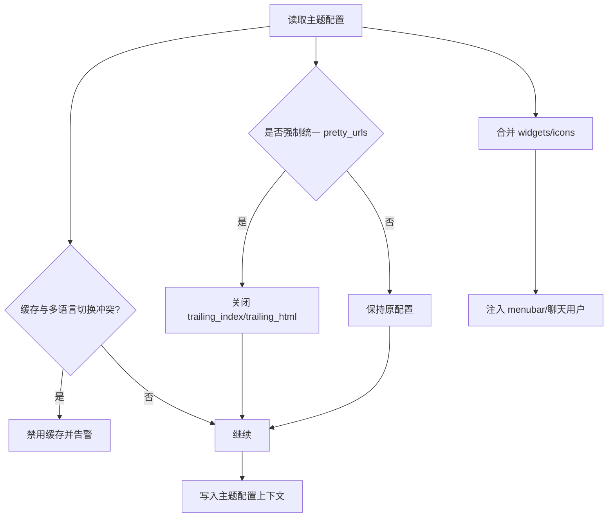
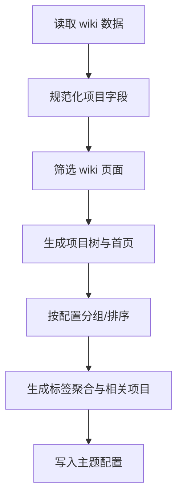
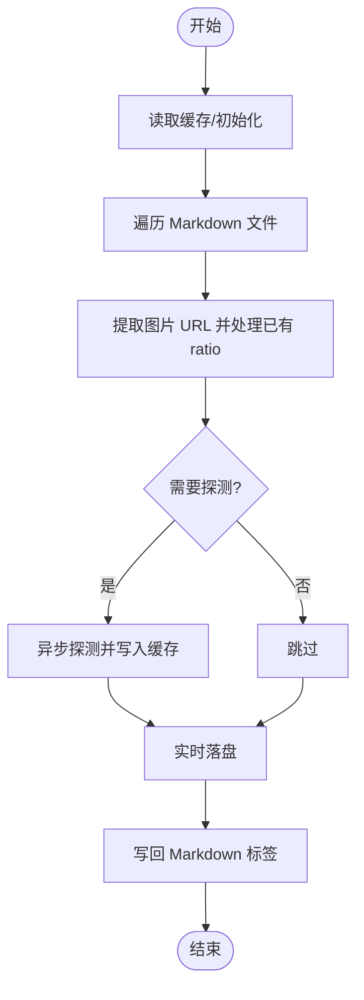
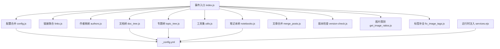

# 事件处理器

<cite>
**本文引用的文件**
- [themes/stellar/scripts/events/index.js](file://themes/stellar/scripts/events/index.js)
- [themes/stellar/scripts/events/lib/config.js](file://themes/stellar/scripts/events/lib/config.js)
- [themes/stellar/scripts/events/lib/links.js](file://themes/stellar/scripts/events/lib/links.js)
- [themes/stellar/scripts/events/lib/authors.js](file://themes/stellar/scripts/events/lib/authors.js)
- [themes/stellar/scripts/events/lib/doc_tree.js](file://themes/stellar/scripts/events/lib/doc_tree.js)
- [themes/stellar/scripts/events/lib/topic_tree.js](file://themes/stellar/scripts/events/lib/topic_tree.js)
- [themes/stellar/scripts/events/lib/utils.js](file://themes/stellar/scripts/events/lib/utils.js)
- [themes/stellar/scripts/events/lib/notebooks.js](file://themes/stellar/scripts/events/lib/notebooks.js)
- [themes/stellar/scripts/events/lib/merge_posts.js](file://themes/stellar/scripts/events/lib/merge_posts.js)
- [themes/stellar/scripts/events/lib/version-check.js](file://themes/stellar/scripts/events/lib/version-check.js)
- [themes/stellar/scripts/events/lib/get_image_ratios.js](file://themes/stellar/scripts/events/lib/get_image_ratios.js)
- [themes/stellar/scripts/events/lib/fix_image_tags.js](file://themes/stellar/scripts/events/lib/fix_image_tags.js)
- [themes/stellar/_config.yml](file://themes/stellar/_config.yml)
- [themes/stellar/layout/_partial/scripts/services.ejs](file://themes/stellar/layout/_partial/scripts/services.ejs)
</cite>

## 目录
1. [简介](#简介)
2. [项目结构](#项目结构)
3. [核心组件](#核心组件)
4. [架构总览](#架构总览)
5. [组件详解](#组件详解)
6. [依赖关系分析](#依赖关系分析)
7. [性能考量](#性能考量)
8. [故障排查指南](#故障排查指南)
9. [结论](#结论)
10. [附录](#附录)

## 简介
本文件系统性梳理 Stellar 主题的事件处理器体系，涵盖事件注册、触发机制与处理流程，重点解析内置事件处理器在构建阶段对配置、数据树、资源注入与版本检查等方面的处理逻辑。同时提供自定义事件处理器的开发指南、调试方法与性能优化建议，并结合实际开发场景给出落地案例。

## 项目结构
Stellar 主题的事件处理集中在 scripts/events 目录，入口文件负责注册 Hexo 生命周期事件与过滤器，各 lib 子模块按职责拆分，分别处理配置合并、数据树构建、资源注入、版本检查与图片比例修复等任务。

**图表来源**
- [themes/stellar/scripts/events/index.js](file://themes/stellar/scripts/events/index.js#L1-L69)
- [themes/stellar/scripts/events/lib/config.js](file://themes/stellar/scripts/events/lib/config.js#L1-L77)
- [themes/stellar/scripts/events/lib/links.js](file://themes/stellar/scripts/events/lib/links.js#L1-L17)
- [themes/stellar/scripts/events/lib/authors.js](file://themes/stellar/scripts/events/lib/authors.js#L1-L21)
- [themes/stellar/scripts/events/lib/doc_tree.js](file://themes/stellar/scripts/events/lib/doc_tree.js#L1-L214)
- [themes/stellar/scripts/events/lib/topic_tree.js](file://themes/stellar/scripts/events/lib/topic_tree.js#L1-L49)
- [themes/stellar/scripts/events/lib/utils.js](file://themes/stellar/scripts/events/lib/utils.js#L1-L90)
- [themes/stellar/scripts/events/lib/notebooks.js](file://themes/stellar/scripts/events/lib/notebooks.js#L1-L154)
- [themes/stellar/scripts/events/lib/merge_posts.js](file://themes/stellar/scripts/events/lib/merge_posts.js#L1-L47)
- [themes/stellar/scripts/events/lib/version-check.js](file://themes/stellar/scripts/events/lib/version-check.js#L1-L87)
- [themes/stellar/scripts/events/lib/get_image_ratios.js](file://themes/stellar/scripts/events/lib/get_image_ratios.js#L1-L110)
- [themes/stellar/scripts/events/lib/fix_image_tags.js](file://themes/stellar/scripts/events/lib/fix_image_tags.js#L1-L45)
- [themes/stellar/_config.yml](file://themes/stellar/_config.yml#L1-L725)
- [themes/stellar/layout/_partial/scripts/services.ejs](file://themes/stellar/layout/_partial/scripts/services.ejs#L1-L34)

**章节来源**
- [themes/stellar/scripts/events/index.js](file://themes/stellar/scripts/events/index.js#L1-L69)

## 核心组件
- 事件入口与生命周期
  - generateBefore：在生成前合并配置、数据与树结构，准备运行时所需上下文。
  - generateAfter：在生成后执行文章与专题树的二次整合。
  - ready：主题就绪时打印欢迎信息与版本检查。
  - before_generate 过滤器：开发模式下按配置开关执行图片比例探测与 Markdown 标签补全。
- 配置与数据合并
  - 合并 widgets、icons、默认菜单、作者与链接等主题数据。
  - 强制统一 pretty_urls 输出格式，避免潜在问题。
- 数据树构建
  - 文档树（wiki）、专题树（topic）、笔记本树（notebooks）。
  - 自动生成主页、分组、标签聚合与相关项目。
- 资源注入与版本检查
  - 注入运行时服务（如站点信息、语音、视频、文件下载等）。
  - 版本检查与缓存策略，避免频繁请求。
- 图片比例处理
  - 首次探测远程图片尺寸并缓存，增量更新；构建前写回 Markdown 标签，构建后清理。

**章节来源**
- [themes/stellar/scripts/events/index.js](file://themes/stellar/scripts/events/index.js#L5-L18)
- [themes/stellar/scripts/events/index.js](file://themes/stellar/scripts/events/index.js#L20-L40)
- [themes/stellar/scripts/events/index.js](file://themes/stellar/scripts/events/index.js#L46-L66)
- [themes/stellar/scripts/events/lib/config.js](file://themes/stellar/scripts/events/lib/config.js#L19-L34)
- [themes/stellar/scripts/events/lib/doc_tree.js](file://themes/stellar/scripts/events/lib/doc_tree.js#L60-L214)
- [themes/stellar/scripts/events/lib/topic_tree.js](file://themes/stellar/scripts/events/lib/topic_tree.js#L39-L49)
- [themes/stellar/scripts/events/lib/notebooks.js](file://themes/stellar/scripts/events/lib/notebooks.js#L150-L154)
- [themes/stellar/scripts/events/lib/version-check.js](file://themes/stellar/scripts/events/lib/version-check.js#L62-L87)
- [themes/stellar/scripts/events/lib/get_image_ratios.js](file://themes/stellar/scripts/events/lib/get_image_ratios.js#L61-L110)
- [themes/stellar/scripts/events/lib/fix_image_tags.js](file://themes/stellar/scripts/events/lib/fix_image_tags.js#L5-L45)
- [themes/stellar/layout/_partial/scripts/services.ejs](file://themes/stellar/layout/_partial/scripts/services.ejs#L1-L34)

## 架构总览
事件处理器围绕 Hexo 生命周期事件与过滤器展开，形成“构建前准备—生成—构建后整合—运行时注入”的完整链路。配置与数据树在 generateBefore 阶段完成，版本检查与图片处理在 ready 与 before_generate 阶段协同，最终在页面模板中按需注入服务脚本。

**图表来源**
- [themes/stellar/scripts/events/index.js](file://themes/stellar/scripts/events/index.js#L5-L18)
- [themes/stellar/scripts/events/index.js](file://themes/stellar/scripts/events/index.js#L20-L40)
- [themes/stellar/scripts/events/index.js](file://themes/stellar/scripts/events/index.js#L46-L66)
- [themes/stellar/scripts/events/lib/version-check.js](file://themes/stellar/scripts/events/lib/version-check.js#L62-L87)
- [themes/stellar/scripts/events/lib/get_image_ratios.js](file://themes/stellar/scripts/events/lib/get_image_ratios.js#L61-L110)
- [themes/stellar/scripts/events/lib/fix_image_tags.js](file://themes/stellar/scripts/events/lib/fix_image_tags.js#L5-L45)

## 组件详解

### 事件入口与生命周期
- generateBefore：合并配置、链接、作者、文档树、专题树、工具集、笔记本树与通用工具，确保后续生成阶段具备完整的上下文。
- generateAfter：将具有共同专题的文章归并到专题树，补充专题首页。
- ready：打印主题信息与仓库链接，执行版本检查（带缓存）。
- before_generate（开发模式）：根据配置开关执行图片比例探测与 Markdown 标签补全，防止重复执行。

**图表来源**
- [themes/stellar/scripts/events/index.js](file://themes/stellar/scripts/events/index.js#L5-L18)
- [themes/stellar/scripts/events/index.js](file://themes/stellar/scripts/events/index.js#L20-L40)
- [themes/stellar/scripts/events/index.js](file://themes/stellar/scripts/events/index.js#L46-L66)
- [themes/stellar/scripts/events/lib/merge_posts.js](file://themes/stellar/scripts/events/lib/merge_posts.js#L22-L47)
- [themes/stellar/scripts/events/lib/version-check.js](file://themes/stellar/scripts/events/lib/version-check.js#L62-L87)
- [themes/stellar/scripts/events/lib/get_image_ratios.js](file://themes/stellar/scripts/events/lib/get_image_ratios.js#L61-L110)
- [themes/stellar/scripts/events/lib/fix_image_tags.js](file://themes/stellar/scripts/events/lib/fix_image_tags.js#L5-L45)

**章节来源**
- [themes/stellar/scripts/events/index.js](file://themes/stellar/scripts/events/index.js#L5-L18)
- [themes/stellar/scripts/events/index.js](file://themes/stellar/scripts/events/index.js#L20-L40)
- [themes/stellar/scripts/events/index.js](file://themes/stellar/scripts/events/index.js#L46-L66)

### 配置合并与数据注入（lib/config.js）
- 强制统一 pretty_urls 输出格式，避免 trailing_index/trailing_html。
- 当启用缓存与多语言切换时，警告并禁用缓存，避免潜在冲突。
- 合并 widgets 与 icons，支持用户覆盖删除与简单合并。
- 注入 menubar 默认值、聊天用户列表等主题数据。

**图表来源**
- [themes/stellar/scripts/events/lib/config.js](file://themes/stellar/scripts/events/lib/config.js#L19-L34)
- [themes/stellar/scripts/events/lib/config.js](file://themes/stellar/scripts/events/lib/config.js#L36-L76)

**章节来源**
- [themes/stellar/scripts/events/lib/config.js](file://themes/stellar/scripts/events/lib/config.js#L19-L34)
- [themes/stellar/scripts/events/lib/config.js](file://themes/stellar/scripts/events/lib/config.js#L36-L76)

### 链接聚合（lib/links.js）
- 遍历本地数据，筛选以 links/ 开头的键，去除前缀并写入主题配置，便于模板中统一访问。

**章节来源**
- [themes/stellar/scripts/events/lib/links.js](file://themes/stellar/scripts/events/lib/links.js#L7-L17)

### 作者映射（lib/authors.js）
- 为作者数据生成路径，设置默认作者，并写入主题配置，供页面与导航使用。

**章节来源**
- [themes/stellar/scripts/events/lib/authors.js](file://themes/stellar/scripts/events/lib/authors.js#L7-L21)

### 文档树构建（lib/doc_tree.js）
- 解析 wiki 数据，构建项目树、首页、分组与标签聚合，生成相关项目列表，补充页面编号与顺序。
- 依据站点树配置生成标签页路径，支持自动首页选择与 TOC 首页推导。

**图表来源**
- [themes/stellar/scripts/events/lib/doc_tree.js](file://themes/stellar/scripts/events/lib/doc_tree.js#L19-L58)
- [themes/stellar/scripts/events/lib/doc_tree.js](file://themes/stellar/scripts/events/lib/doc_tree.js#L60-L214)

**章节来源**
- [themes/stellar/scripts/events/lib/doc_tree.js](file://themes/stellar/scripts/events/lib/doc_tree.js#L60-L214)

### 专题树构建（lib/topic_tree.js）
- 解析专题数据，生成专题树与发布列表，设置默认排序与路径，供专题列表页使用。

**章节来源**
- [themes/stellar/scripts/events/lib/topic_tree.js](file://themes/stellar/scripts/events/lib/topic_tree.js#L39-L49)

### 工具集扩展（lib/utils.js）
- 提供参数映射、标签拼接与 URL 参数拼接等工具方法，扩展 hexo.args 与 hexo.utils.icon 能力，便于模板与标签插件使用。

**章节来源**
- [themes/stellar/scripts/events/lib/utils.js](file://themes/stellar/scripts/events/lib/utils.js#L7-L90)

### 笔记本树构建（lib/notebooks.js）
- 解析笔记本数据，构建笔记本树、标签树与笔记映射，支持层级标签、分页、排序与侧栏配置继承。

**章节来源**
- [themes/stellar/scripts/events/lib/notebooks.js](file://themes/stellar/scripts/events/lib/notebooks.js#L150-L154)

### 文章与专题合并（lib/merge_posts.js）
- 将属于同一专题的文章归并到专题树，补充页面编号与首页，按排序规则处理。

**章节来源**
- [themes/stellar/scripts/events/lib/merge_posts.js](file://themes/stellar/scripts/events/lib/merge_posts.js#L22-L47)

### 版本检查（lib/version-check.js）
- 通过 npm registry 查询最新版本，与本地版本比较，若不同则输出升级提示；支持按分钟级缓存避免频繁请求。

**章节来源**
- [themes/stellar/scripts/events/lib/version-check.js](file://themes/stellar/scripts/events/lib/version-check.js#L62-L87)

### 图片比例探测与标签补全
- 探测远程图片尺寸并缓存，支持增量更新；构建前写回 Markdown 标签，构建后清理，保证首屏布局稳定。

**图表来源**
- [themes/stellar/scripts/events/lib/get_image_ratios.js](file://themes/stellar/scripts/events/lib/get_image_ratios.js#L61-L110)
- [themes/stellar/scripts/events/lib/fix_image_tags.js](file://themes/stellar/scripts/events/lib/fix_image_tags.js#L5-L45)

**章节来源**
- [themes/stellar/scripts/events/lib/get_image_ratios.js](file://themes/stellar/scripts/events/lib/get_image_ratios.js#L61-L110)
- [themes/stellar/scripts/events/lib/fix_image_tags.js](file://themes/stellar/scripts/events/lib/fix_image_tags.js#L5-L45)

### 运行时服务注入（layout/_partial/scripts/services.ejs）
- DOMContentLoaded 时读取主题配置中的 data_services，按需加载对应 JS 并绑定事件（如链接卡片、语音、视频、文件下载等）。

**章节来源**
- [themes/stellar/layout/_partial/scripts/services.ejs](file://themes/stellar/layout/_partial/scripts/services.ejs#L1-L34)

## 依赖关系分析
- 事件入口对各 lib 模块存在直接依赖，形成“配置—数据—树—整合—检查—图片处理”的流水线。
- 主题配置（_config.yml）为事件处理器提供开关与默认值，如 pretty_urls、依赖项、服务注入等。
- 运行时服务注入依赖页面模板中的上下文与配置，按需加载。

**图表来源**
- [themes/stellar/scripts/events/index.js](file://themes/stellar/scripts/events/index.js#L5-L18)
- [themes/stellar/scripts/events/lib/config.js](file://themes/stellar/scripts/events/lib/config.js#L19-L34)
- [themes/stellar/_config.yml](file://themes/stellar/_config.yml#L1-L725)
- [themes/stellar/layout/_partial/scripts/services.ejs](file://themes/stellar/layout/_partial/scripts/services.ejs#L1-L34)

**章节来源**
- [themes/stellar/scripts/events/index.js](file://themes/stellar/scripts/events/index.js#L5-L18)
- [themes/stellar/_config.yml](file://themes/stellar/_config.yml#L1-L725)

## 性能考量
- 版本检查缓存：按分钟级缓存避免频繁请求 npm registry。
- 图片比例探测缓存：本地 JSON 缓存，支持增量更新与实时落盘，减少重复探测。
- 开发模式限制：仅在开发命令行参数存在时执行图片处理，避免生产构建负担。
- 配置合并与数据树构建：在 generateBefore 阶段集中完成，避免重复计算。
- 运行时按需注入：只在页面包含对应内容时加载服务脚本，降低首屏负载。

**章节来源**
- [themes/stellar/scripts/events/lib/version-check.js](file://themes/stellar/scripts/events/lib/version-check.js#L39-L60)
- [themes/stellar/scripts/events/lib/get_image_ratios.js](file://themes/stellar/scripts/events/lib/get_image_ratios.js#L61-L110)
- [themes/stellar/scripts/events/index.js](file://themes/stellar/scripts/events/index.js#L46-L66)
- [themes/stellar/layout/_partial/scripts/services.ejs](file://themes/stellar/layout/_partial/scripts/services.ejs#L1-L34)

## 故障排查指南
- 版本检查无输出
  - 确认未设置禁用缓存的环境变量，检查缓存文件是否存在与格式正确。
  - 参考：[版本检查实现](file://themes/stellar/scripts/events/lib/version-check.js#L62-L87)
- 图片比例探测未生效
  - 确认开发模式下已触发 before_generate，依赖项开关已启用。
  - 检查缓存文件是否存在与内容是否包含目标图片 URL。
  - 参考：[图片探测](file://themes/stellar/scripts/events/lib/get_image_ratios.js#L61-L110)、[标签补全](file://themes/stellar/scripts/events/lib/fix_image_tags.js#L5-L45)
- 链接/作者/文档树未显示
  - 检查主题配置与数据文件命名规范，确认 generateBefore 已执行。
  - 参考：[链接聚合](file://themes/stellar/scripts/events/lib/links.js#L7-L17)、[作者映射](file://themes/stellar/scripts/events/lib/authors.js#L7-L21)、[文档树](file://themes/stellar/scripts/events/lib/doc_tree.js#L60-L214)
- 运行时服务未加载
  - 确认页面包含对应 DOM 节点，检查 data_services 配置与 utils.js 引用。
  - 参考：[服务注入](file://themes/stellar/layout/_partial/scripts/services.ejs#L1-L34)

**章节来源**
- [themes/stellar/scripts/events/lib/version-check.js](file://themes/stellar/scripts/events/lib/version-check.js#L62-L87)
- [themes/stellar/scripts/events/lib/get_image_ratios.js](file://themes/stellar/scripts/events/lib/get_image_ratios.js#L61-L110)
- [themes/stellar/scripts/events/lib/fix_image_tags.js](file://themes/stellar/scripts/events/lib/fix_image_tags.js#L5-L45)
- [themes/stellar/scripts/events/lib/links.js](file://themes/stellar/scripts/events/lib/links.js#L7-L17)
- [themes/stellar/scripts/events/lib/authors.js](file://themes/stellar/scripts/events/lib/authors.js#L7-L21)
- [themes/stellar/scripts/events/lib/doc_tree.js](file://themes/stellar/scripts/events/lib/doc_tree.js#L60-L214)
- [themes/stellar/layout/_partial/scripts/services.ejs](file://themes/stellar/layout/_partial/scripts/services.ejs#L1-L34)

## 结论
Stellar 主题的事件处理器以 Hexo 生命周期事件为核心，通过模块化的 lib 子模块在构建前后完成配置合并、数据树构建、资源注入与版本检查等关键任务。配合开发模式下的图片处理与运行时按需注入，既保证了构建效率，又提升了页面体验。遵循本文的开发指南与优化建议，可快速扩展自定义事件处理器并稳定集成到主题工作流中。

## 附录
- 自定义事件处理器开发要点
  - 事件注册：在入口文件中使用 hexo.on 注册生命周期事件，或使用 hexo.extend.filter.register 注册过滤器。
  - 数据访问：通过 ctx.locals 获取 pages/data，通过 ctx.theme.config 读取/写入主题配置。
  - 异步处理：合理使用 async/await，注意避免在生产构建中引入耗时操作。
  - 错误处理：捕获异常并记录日志，必要时提供降级方案。
  - 调试：结合日志输出与缓存文件定位问题，参考现有实现的缓存与增量更新策略。
- 实战案例
  - 页面加载：在 ready 中进行版本检查与欢迎信息输出。
  - 导航切换：在 generateBefore 中完成站点树与菜单数据的预处理。
  - 用户交互：在运行时注入阶段按需加载服务脚本，避免阻塞首屏。
- 参考文件
  - [事件入口](file://themes/stellar/scripts/events/index.js#L5-L18)
  - [主题配置](file://themes/stellar/_config.yml#L1-L725)
  - [运行时注入](file://themes/stellar/layout/_partial/scripts/services.ejs#L1-L34)