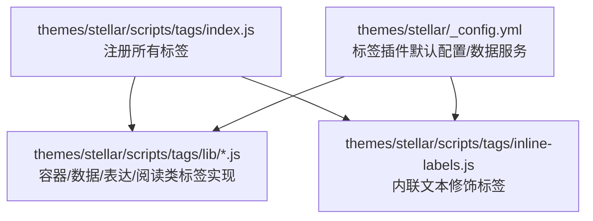
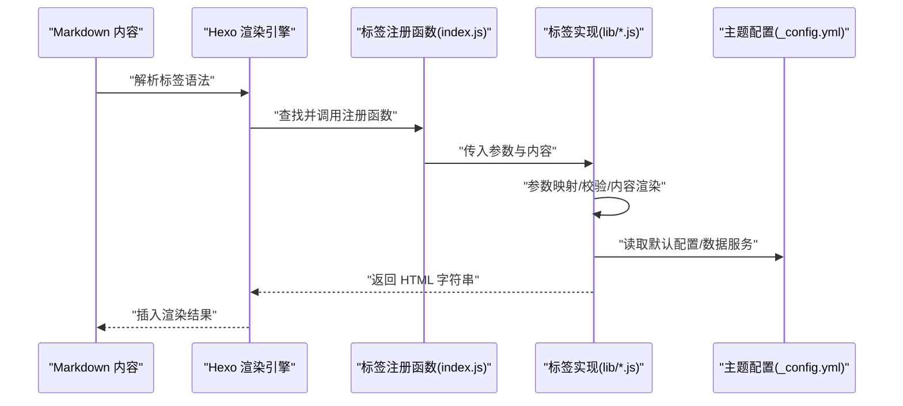
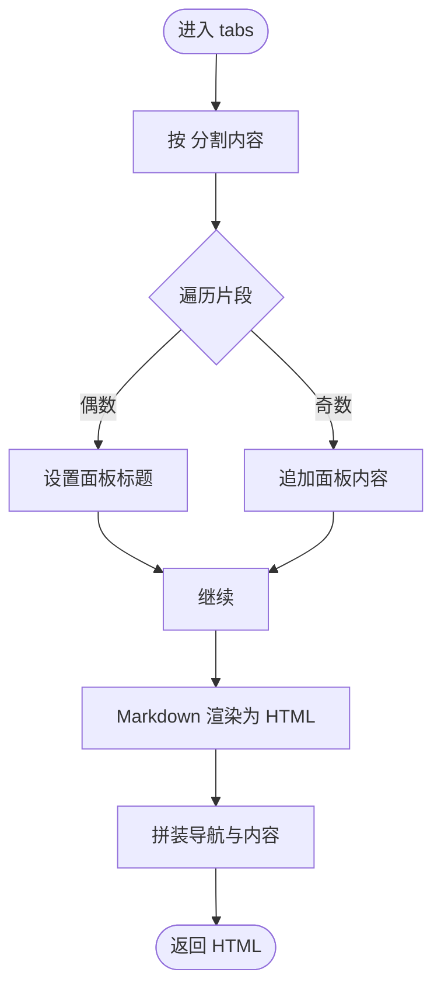
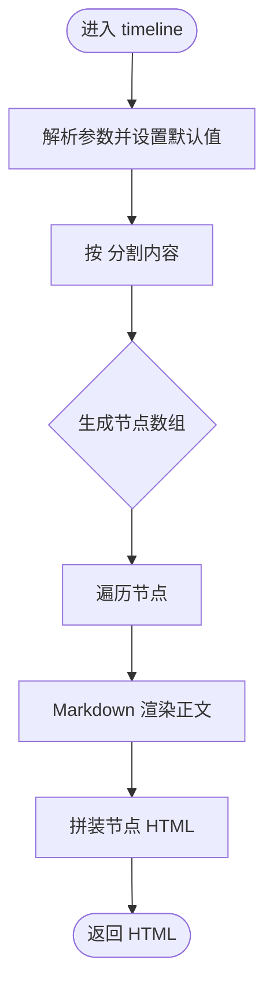
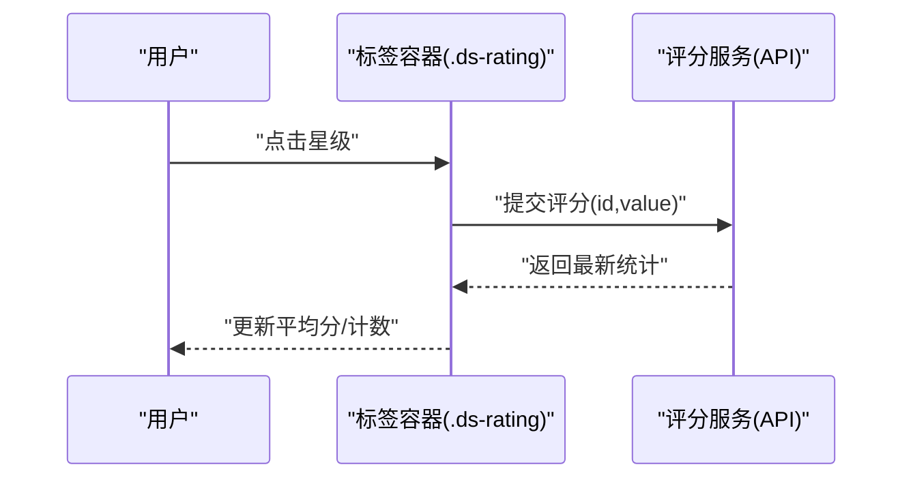
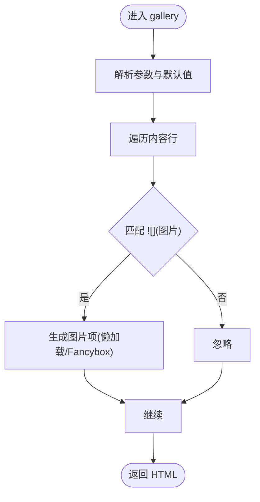
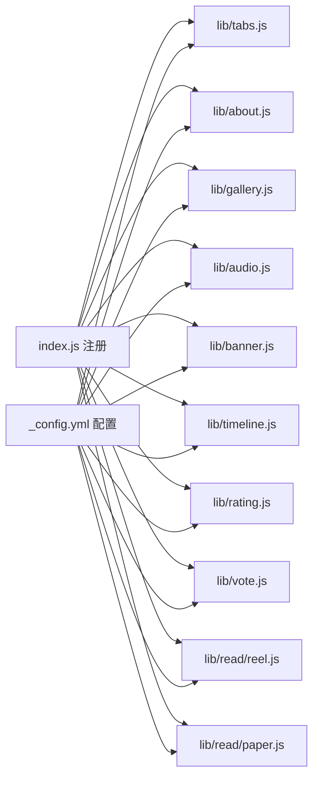

# 标签插件开发

<cite>
**本文引用的文件**
- [themes/stellar/scripts/tags/index.js](file://themes/stellar/scripts/tags/index.js)
- [themes/stellar/scripts/tags/inline-labels.js](file://themes/stellar/scripts/tags/inline-labels.js)
- [themes/stellar/_config.yml](file://themes/stellar/_config.yml)
- [themes/stellar/scripts/tags/lib/tabs.js](file://themes/stellar/scripts/tags/lib/tabs.js)
- [themes/stellar/scripts/tags/lib/about.js](file://themes/stellar/scripts/tags/lib/about.js)
- [themes/stellar/scripts/tags/lib/gallery.js](file://themes/stellar/scripts/tags/lib/gallery.js)
- [themes/stellar/scripts/tags/lib/audio.js](file://themes/stellar/scripts/tags/lib/audio.js)
- [themes/stellar/scripts/tags/lib/banner.js](file://themes/stellar/scripts/tags/lib/banner.js)
- [themes/stellar/scripts/tags/lib/timeline.js](file://themes/stellar/scripts/tags/lib/timeline.js)
- [themes/stellar/scripts/tags/lib/rating.js](file://themes/stellar/scripts/tags/lib/rating.js)
- [themes/stellar/scripts/tags/lib/vote.js](file://themes/stellar/scripts/tags/lib/vote.js)
- [themes/stellar/scripts/tags/lib/read/reel.js](file://themes/stellar/scripts/tags/lib/read/reel.js)
- [themes/stellar/scripts/tags/lib/read/paper.js](file://themes/stellar/scripts/tags/lib/read/paper.js)
</cite>

## 目录
1. [简介](#简介)
2. [项目结构](#项目结构)
3. [核心组件](#核心组件)
4. [架构总览](#架构总览)
5. [组件详解](#组件详解)
6. [依赖关系分析](#依赖关系分析)
7. [性能考量](#性能考量)
8. [故障排查指南](#故障排查指南)
9. [结论](#结论)
10. [附录](#附录)

## 简介
本指南面向希望基于 Stellar 主题开发 Hexo 标签插件的开发者，系统讲解插件注册机制、参数解析与渲染流程；深入剖析内置标签插件（如 tabs、about、gallery、audio、banner、timeline、rating、vote、read 系列等）的工作原理与实现要点；提供自定义标签插件的开发步骤、参数校验、模板渲染与样式集成的最佳实践；并通过投票、评分、时间轴、图库等复杂交互组件的实际案例，帮助你构建高性能、可维护的标签插件。

## 项目结构
Stellar 主题的标签插件集中位于 themes/stellar/scripts/tags 目录，入口文件负责注册所有内置标签，各标签的具体实现位于 scripts/tags/lib 下，另有少量内联文本修饰标签位于 scripts/tags/inline-labels.js。主题配置文件 themes/stellar/_config.yml 提供标签插件的默认行为与数据服务接口配置。

**图表来源**
- [themes/stellar/scripts/tags/index.js](file://themes/stellar/scripts/tags/index.js#L1-L56)
- [themes/stellar/scripts/tags/inline-labels.js](file://themes/stellar/scripts/tags/inline-labels.js#L1-L48)
- [themes/stellar/_config.yml](file://themes/stellar/_config.yml#L377-L521)

**章节来源**
- [themes/stellar/scripts/tags/index.js](file://themes/stellar/scripts/tags/index.js#L1-L56)
- [themes/stellar/scripts/tags/inline-labels.js](file://themes/stellar/scripts/tags/inline-labels.js#L1-L48)
- [themes/stellar/_config.yml](file://themes/stellar/_config.yml#L377-L521)

## 核心组件
- 标签注册入口：通过 hexo.extend.tag.register 注册标签，支持单体标签与容器标签（带结束标记）。
- 参数映射与校验：使用 ctx.args.map 与 ctx.args.joinTags 对传入参数进行规范化与 HTML 属性拼接。
- 内容渲染：对标签内部 Markdown 内容使用 ctx.render.renderSync 渲染为 HTML。
- 数据服务集成：通过主题配置中的 data_services 字段注入外部 API 与 JS 资源，标签内部以 data-* 属性传递配置。
- 样式与类名：标签输出统一添加 tag-plugin 前缀与语义化类名，便于 CSS 控制与主题一致性。

**章节来源**
- [themes/stellar/scripts/tags/index.js](file://themes/stellar/scripts/tags/index.js#L6-L54)
- [themes/stellar/scripts/tags/lib/tabs.js](file://themes/stellar/scripts/tags/lib/tabs.js#L30-L44)
- [themes/stellar/scripts/tags/lib/gallery.js](file://themes/stellar/scripts/tags/lib/gallery.js#L37-L62)
- [themes/stellar/_config.yml](file://themes/stellar/_config.yml#L464-L521)

## 架构总览
标签插件的运行时流程如下：Hexo 渲染引擎遇到标签语法时，调用对应注册函数；插件函数解析参数、渲染内部内容、拼装 HTML 并返回；最终由主题 CSS 控制样式与交互。

**图表来源**
- [themes/stellar/scripts/tags/index.js](file://themes/stellar/scripts/tags/index.js#L6-L54)
- [themes/stellar/scripts/tags/lib/tabs.js](file://themes/stellar/scripts/tags/lib/tabs.js#L9-L58)
- [themes/stellar/_config.yml](file://themes/stellar/_config.yml#L464-L521)

## 组件详解

### 容器标签：tabs
- 功能：将多个带标题的面板内容组合为可切换的标签页。
- 参数：active（默认激活面板索引）、align（对齐方式）。
- 渲染：解析内部内容，按 <!-- tab 标题 --> 分割，逐个渲染为面板，支持 Markdown 内容。
- 输出：包含导航与内容区的完整容器，带唯一 id 与激活状态类名。

**图表来源**
- [themes/stellar/scripts/tags/lib/tabs.js](file://themes/stellar/scripts/tags/lib/tabs.js#L9-L58)

**章节来源**
- [themes/stellar/scripts/tags/lib/tabs.js](file://themes/stellar/scripts/tags/lib/tabs.js#L1-L60)

### 容器标签：timeline
- 功能：按时间线节点组织内容，支持外部数据服务。
- 参数：api、user、type、limit、hide、avatar；默认 type 为 timeline。
- 渲染：按 <!-- node 标题 --> 分割内容，逐个渲染为 timenode，支持 Markdown 内容。
- 输出：容器 + 多个节点，节点含标题与正文。

**图表来源**
- [themes/stellar/scripts/tags/lib/timeline.js](file://themes/stellar/scripts/tags/lib/timeline.js#L37-L78)

**章节来源**
- [themes/stellar/scripts/tags/lib/timeline.js](file://themes/stellar/scripts/tags/lib/timeline.js#L1-L80)

### 数据标签：rating（评分）
- 功能：提供 5 星评分交互，绑定数据服务 API。
- 参数：id（标识）、icon（评分图标）、title（标题）。
- 输出：包含 5 个可点击按钮与平均分、计数信息的数据服务容器。

**图表来源**
- [themes/stellar/scripts/tags/lib/rating.js](file://themes/stellar/scripts/tags/lib/rating.js#L12-L31)
- [themes/stellar/_config.yml](file://themes/stellar/_config.yml#L476-L479)

**章节来源**
- [themes/stellar/scripts/tags/lib/rating.js](file://themes/stellar/scripts/tags/lib/rating.js#L1-L32)
- [themes/stellar/_config.yml](file://themes/stellar/_config.yml#L476-L479)

### 数据标签：vote（投票）
- 功能：提供“赞成/反对”投票，绑定数据服务 API。
- 参数：id（标识）、yes（赞成图标）、no（反对图标）、title（标题）。
- 输出：包含两个按钮与计数的数据服务容器。

**章节来源**
- [themes/stellar/scripts/tags/lib/vote.js](file://themes/stellar/scripts/tags/lib/vote.js#L1-L28)
- [themes/stellar/_config.yml](file://themes/stellar/_config.yml#L480-L483)

### 数据标签：gallery（图库）
- 功能：将多张图片按网格或瀑布流布局展示，支持懒加载与 Fancybox 放大。
- 参数：layout（grid/flow）、size（s/m/l/xl/mix）、ratio（origin/square）。
- 渲染：解析每行 Markdown 图片语法，抽取 alt 与 src，生成带 data-fancybox 的图片项。

**图表来源**
- [themes/stellar/scripts/tags/lib/gallery.js](file://themes/stellar/scripts/tags/lib/gallery.js#L37-L62)

**章节来源**
- [themes/stellar/scripts/tags/lib/gallery.js](file://themes/stellar/scripts/tags/lib/gallery.js#L1-L64)
- [themes/stellar/_config.yml](file://themes/stellar/_config.yml#L445-L452)

### 数据标签：audio（音频）
- 功能：播放本地音频或网易云外链。
- 参数：type（MIME 类型）、netease（网易云歌单/歌曲 ID）、autoplay（自动播放）、src（本地资源）。
- 渲染：若提供 netease，输出嵌入播放器；否则输出原生 audio 控件。

**章节来源**
- [themes/stellar/scripts/tags/lib/audio.js](file://themes/stellar/scripts/tags/lib/audio.js#L1-L28)

### 容器标签：banner（横幅）
- 功能：文章/页面横幅区域，支持背景图、头像、标题/副标题与返回/跳转。
- 参数：bg（背景图）、avatar（头像）、link（跳转链接）、title/subtitle（标题/副标题）。
- 渲染：解析内容，寻找 navbar 插件片段并内嵌，支持历史返回或跳转链接。

**章节来源**
- [themes/stellar/scripts/tags/lib/banner.js](file://themes/stellar/scripts/tags/lib/banner.js#L1-L68)

### 容器标签：about（关于）
- 功能：展示作者/角色信息，支持返回按钮、头像、高度与边框。
- 参数：avatar（头像）、height（头像高度）、border（边框半径）、back（是否显示返回按钮）。
- 渲染：根据参数拼装头像与正文，正文使用 Markdown 渲染。

**章节来源**
- [themes/stellar/scripts/tags/lib/about.js](file://themes/stellar/scripts/tags/lib/about.js#L1-L48)

### 阅读类标签：reel（卷轴）
- 功能：类似卷轴的阅读容器，支持标题、作者、日期、底部信息。
- 参数：author、date、footer、title。
- 渲染：将内部 Markdown 渲染为主体内容，按布局插入元信息与底部。

**章节来源**
- [themes/stellar/scripts/tags/lib/read/reel.js](file://themes/stellar/scripts/tags/lib/read/reel.js#L1-L43)

### 阅读类标签：paper（论文风）
- 功能：论文风格的分节/段落/分隔线布局。
- 参数：style（underline 等样式）、title、author、date、footer。
- 渲染：按 <!-- section/paragraph/line --> 标记分割内容，分别渲染为 section、paragraph、line（支持左右对齐）。

**章节来源**
- [themes/stellar/scripts/tags/lib/read/paper.js](file://themes/stellar/scripts/tags/lib/read/paper.js#L1-L90)

### 内联文本标签：inline-labels
- 功能：对文本进行简单装饰，如下划线、删除线、键盘键、上标/下标等。
- 示例：、、、、 等。
- 渲染：将参数连接为字符串后包裹目标标签，支持 color 等属性。

**章节来源**
- [themes/stellar/scripts/tags/inline-labels.js](file://themes/stellar/scripts/tags/inline-labels.js#L1-L48)

## 依赖关系分析
- 注册入口与实现：index.js 统一注册，lib/*.js 提供具体实现；inline-labels.js 提供内联文本修饰。
- 配置依赖：_config.yml 的 tag_plugins 与 data_services 为标签提供默认配置与数据服务地址。
- 渲染依赖：各标签使用 ctx.args、ctx.render、ctx.utils、ctx.theme、ctx.config 等上下文能力。
- 外部依赖：Swiper、Fancybox、Mermaid 等第三方库通过主题配置按需注入。

**图表来源**
- [themes/stellar/scripts/tags/index.js](file://themes/stellar/scripts/tags/index.js#L6-L54)
- [themes/stellar/_config.yml](file://themes/stellar/_config.yml#L377-L521)

**章节来源**
- [themes/stellar/scripts/tags/index.js](file://themes/stellar/scripts/tags/index.js#L1-L56)
- [themes/stellar/_config.yml](file://themes/stellar/_config.yml#L377-L521)

## 性能考量
- 懒加载与占位：图库使用懒加载与占位图标，降低首屏压力。
- 按需加载：主题配置中 data_services 与插件资源仅在页面使用时加载，避免全局负担。
- 内容渲染：优先使用 ctx.render.renderSync 渲染内部 Markdown，确保标签内嵌内容正确解析。
- 参数映射：使用 ctx.args.map 与 joinTags 统一参数处理，减少字符串拼接错误与重复逻辑。
- CSS 优先：通过语义化类名与主题样式配合，尽量减少 JS 交互带来的性能损耗。

[本节为通用指导，无需列出具体文件来源]

## 故障排查指南
- 标签不生效
  - 检查是否在 index.js 中正确注册，确认标签名与实现文件一致。
  - 确认 Markdown 语法是否正确，容器标签需包含结束标记。
- 参数无效
  - 使用 ctx.args.map 映射参数，检查键名是否与实现一致。
  - 对于数据服务标签，确认 _config.yml 中 data_services 的 API 地址与 JS 资源可用。
- 内容渲染异常
  - 确保内部 Markdown 使用 ctx.render.renderSync 渲染，避免直接拼接原始文本。
- 样式错乱
  - 确认输出 HTML 包含 tag-plugin 前缀类名与语义化类名，检查主题 CSS 是否覆盖。
- 图库/视频等外部库
  - 确认主题配置中对应插件（如 swiper、fancybox、mermaid）已启用并正确注入资源。

**章节来源**
- [themes/stellar/scripts/tags/index.js](file://themes/stellar/scripts/tags/index.js#L6-L54)
- [themes/stellar/_config.yml](file://themes/stellar/_config.yml#L530-L632)

## 结论
Stellar 主题的标签插件体系通过统一的注册入口、参数映射与渲染机制，实现了从简单内联文本修饰到复杂交互组件（评分、投票、时间轴、图库）的一致开发体验。遵循本文的开发步骤与最佳实践，你可以快速扩展更多标签插件，并在保证性能与可维护性的前提下，为内容创作提供强大的可视化与交互能力。

[本节为总结性内容，无需列出具体文件来源]

## 附录

### 自定义标签插件开发步骤
- 目录结构
  - 在 themes/stellar/scripts/tags/lib 下新增实现文件，如 mytag.js。
  - 在 themes/stellar/scripts/tags/index.js 中注册标签：hexo.extend.tag.register('mytag', require('./lib/mytag')(hexo), { ends: true|false })。
- 参数解析
  - 使用 ctx.args.map(args, ['可选参数'], ['必填参数']) 规范化参数。
  - 使用 ctx.args.joinTags(args, ['键名'])) 生成 HTML 属性字符串。
- 内容渲染
  - 对内部 Markdown 使用 ctx.render.renderSync({ text, engine: 'markdown' }) 渲染。
- 样式与类名
  - 输出统一添加 class="tag-plugin" 与语义化类名，便于主题样式控制。
- 数据服务集成
  - 通过主题配置 data_services 获取 API 地址与 JS 资源，使用 data-* 属性传递配置。
- 生命周期与性能
  - 在标签内避免复杂 DOM 操作，优先使用惰性初始化与事件委托。
  - 对图片/视频等资源使用懒加载与占位，减少首屏压力。

[本节为通用指导，无需列出具体文件来源]