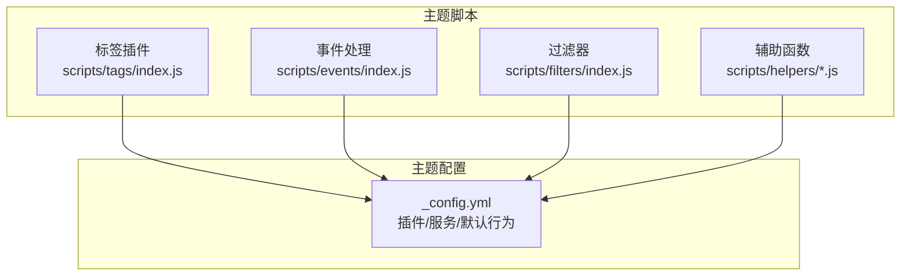
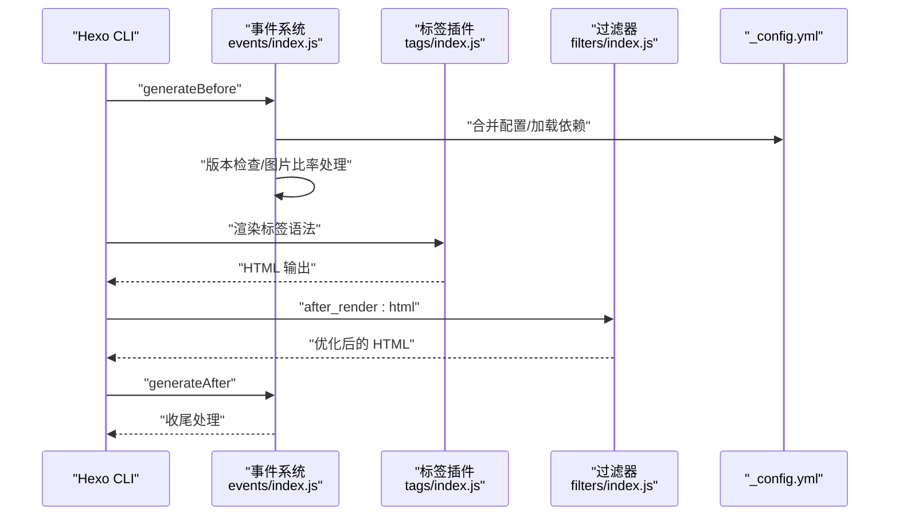
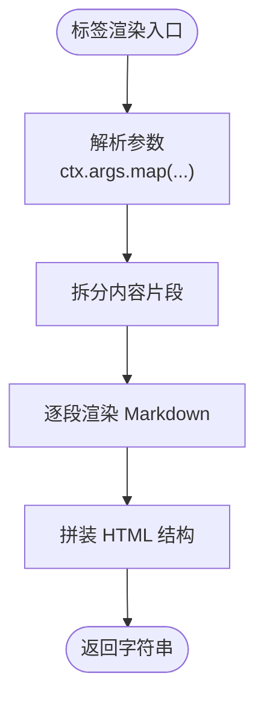
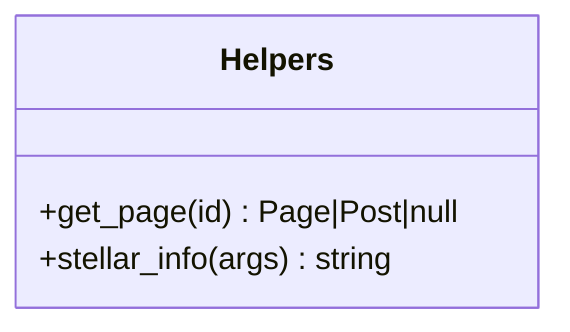
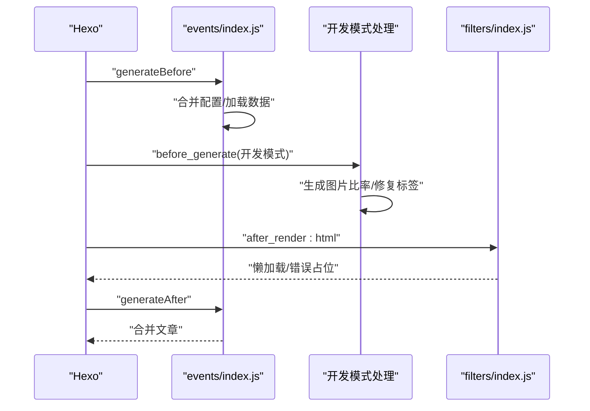
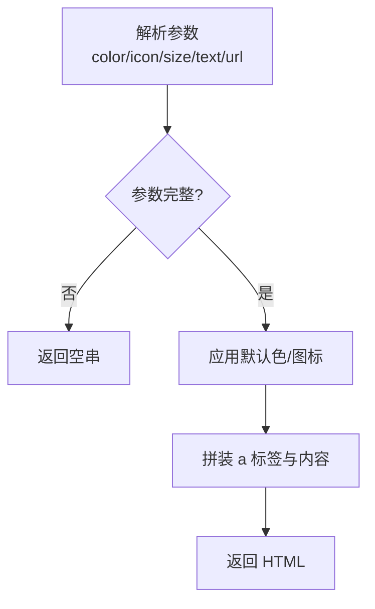
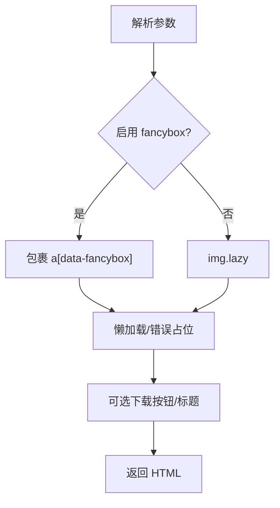
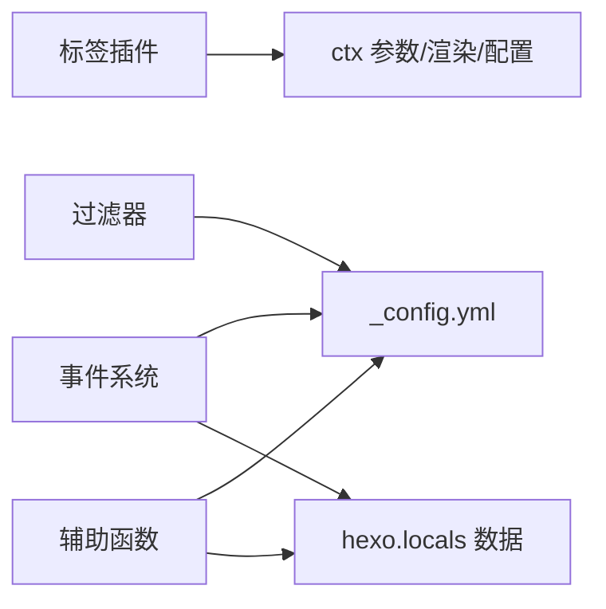

# 脚本扩展

<cite>
**本文引用的文件**
- [themes/stellar/scripts/tags/index.js](file://themes/stellar/scripts/tags/index.js)
- [themes/stellar/scripts/events/index.js](file://themes/stellar/scripts/events/index.js)
- [themes/stellar/scripts/filters/index.js](file://themes/stellar/scripts/filters/index.js)
- [themes/stellar/_config.yml](file://themes/stellar/_config.yml)
- [themes/stellar/scripts/tags/lib/tabs.js](file://themes/stellar/scripts/tags/lib/tabs.js)
- [themes/stellar/scripts/tags/lib/note.js](file://themes/stellar/scripts/tags/lib/note.js)
- [themes/stellar/scripts/tags/lib/button.js](file://themes/stellar/scripts/tags/lib/button.js)
- [themes/stellar/scripts/tags/lib/image.js](file://themes/stellar/scripts/tags/lib/image.js)
- [themes/stellar/scripts/helpers/utils.js](file://themes/stellar/scripts/helpers/utils.js)
- [themes/stellar/scripts/helpers/stellar_info.js](file://themes/stellar/scripts/helpers/stellar_info.js)
</cite>

## 目录
1. [简介](#简介)
2. [项目结构](#项目结构)
3. [核心组件](#核心组件)
4. [架构总览](#架构总览)
5. [组件详解](#组件详解)
6. [依赖关系分析](#依赖关系分析)
7. [性能考量](#性能考量)
8. [故障排查指南](#故障排查指南)
9. [结论](#结论)
10. [附录](#附录)

## 简介
本指南聚焦于 H1S97X 博客所使用的 Stellar 主题的脚本扩展体系，系统讲解标签插件、辅助函数与事件/过滤器机制的工作原理与扩展方法。内容涵盖：
- 标签插件的注册与渲染流程、参数映射与渲染逻辑
- 辅助函数的数据处理、页面逻辑与工具能力
- 事件与过滤器在构建前后阶段的作用与集成点
- 自定义标签插件的开发范式、参数传递与渲染策略
- 实战案例：自定义 UI 组件、交互增强与页面逻辑扩展
- 调试与性能优化建议

## 项目结构
Stellar 主题的脚本扩展主要位于 themes/stellar/scripts 目录，分为三类：
- 标签插件：themes/stellar/scripts/tags 下的入口与各插件实现
- 事件处理：themes/stellar/scripts/events 下的生命周期钩子
- 过滤器：themes/stellar/scripts/filters 下的渲染前后处理
- 辅助函数：themes/stellar/scripts/helpers 下的模板辅助能力
- 主题配置：themes/stellar/_config.yml 提供插件与服务开关、默认行为与资源注入

**图示来源**
- [themes/stellar/scripts/tags/index.js](file://themes/stellar/scripts/tags/index.js#L1-L56)
- [themes/stellar/scripts/events/index.js](file://themes/stellar/scripts/events/index.js#L1-L69)
- [themes/stellar/scripts/filters/index.js](file://themes/stellar/scripts/filters/index.js#L1-L31)
- [themes/stellar/_config.yml](file://themes/stellar/_config.yml#L377-L725)

**章节来源**
- [themes/stellar/scripts/tags/index.js](file://themes/stellar/scripts/tags/index.js#L1-L56)
- [themes/stellar/scripts/events/index.js](file://themes/stellar/scripts/events/index.js#L1-L69)
- [themes/stellar/scripts/filters/index.js](file://themes/stellar/scripts/filters/index.js#L1-L31)
- [themes/stellar/_config.yml](file://themes/stellar/_config.yml#L377-L725)

## 核心组件
- 标签插件系统：集中注册大量内置标签，支持参数映射、Markdown 内容渲染与 DOM 结构拼装
- 事件系统：在 generateBefore/generateAfter/ready 等阶段执行配置合并、版本检查、图片比例预计算与修复等任务
- 过滤器系统：对 HTML 输出进行懒加载与错误占位处理；对 Markdown 内容进行图片标签转换
- 辅助函数：提供页面对象查询、主题信息获取等工具能力

**章节来源**
- [themes/stellar/scripts/tags/index.js](file://themes/stellar/scripts/tags/index.js#L1-L56)
- [themes/stellar/scripts/events/index.js](file://themes/stellar/scripts/events/index.js#L1-L69)
- [themes/stellar/scripts/filters/index.js](file://themes/stellar/scripts/filters/index.js#L1-L31)
- [themes/stellar/scripts/helpers/utils.js](file://themes/stellar/scripts/helpers/utils.js#L1-L21)
- [themes/stellar/scripts/helpers/stellar_info.js](file://themes/stellar/scripts/helpers/stellar_info.js#L1-L22)

## 架构总览
Stellar 的脚本扩展围绕 Hexo 生命周期展开：在生成前合并配置、在生成后进行收尾处理，在开发模式下进行图片比率与标签修复；同时通过标签插件将 Markdown 中的自定义语法转换为 HTML，并通过过滤器对最终 HTML 进行优化。

**图示来源**
- [themes/stellar/scripts/events/index.js](file://themes/stellar/scripts/events/index.js#L5-L18)
- [themes/stellar/scripts/tags/index.js](file://themes/stellar/scripts/tags/index.js#L1-L56)
- [themes/stellar/scripts/filters/index.js](file://themes/stellar/scripts/filters/index.js#L3-L4)
- [themes/stellar/_config.yml](file://themes/stellar/_config.yml#L377-L725)

## 组件详解

### 标签插件系统
- 注册入口：scripts/tags/index.js 统一注册所有内置标签，涵盖容器类、数据类、表达类、阅读类与其它标签
- 参数映射：各插件通过 ctx.args.map 进行参数解析，支持键值对与位置参数混合
- 渲染逻辑：多数插件内部将内容按分隔符切分，逐段渲染为 Markdown，再拼装为最终 HTML
- 事件与结束标记：部分插件声明 { ends: true }，允许在模板中使用 ...

**图示来源**
- [themes/stellar/scripts/tags/lib/tabs.js](file://themes/stellar/scripts/tags/lib/tabs.js#L9-L59)
- [themes/stellar/scripts/tags/lib/note.js](file://themes/stellar/scripts/tags/lib/note.js#L10-L35)

**章节来源**
- [themes/stellar/scripts/tags/index.js](file://themes/stellar/scripts/tags/index.js#L1-L56)
- [themes/stellar/scripts/tags/lib/tabs.js](file://themes/stellar/scripts/tags/lib/tabs.js#L1-L60)
- [themes/stellar/scripts/tags/lib/note.js](file://themes/stellar/scripts/tags/lib/note.js#L1-L36)

### 辅助函数
- 页面查询：get_page(id) 在 pages/posts 中查找指定 _id 的页面或文章
- 主题信息：stellar_info(args) 返回仓库、文档、版本、树链接等信息

**图示来源**
- [themes/stellar/scripts/helpers/utils.js](file://themes/stellar/scripts/helpers/utils.js#L7-L20)
- [themes/stellar/scripts/helpers/stellar_info.js](file://themes/stellar/scripts/helpers/stellar_info.js#L3-L21)

**章节来源**
- [themes/stellar/scripts/helpers/utils.js](file://themes/stellar/scripts/helpers/utils.js#L1-L21)
- [themes/stellar/scripts/helpers/stellar_info.js](file://themes/stellar/scripts/helpers/stellar_info.js#L1-L22)

### 事件与过滤器
- 事件：generateBefore 合并配置、加载链接/作者/文档树/笔记本等；generateAfter 合并文章；ready 阶段打印欢迎信息并进行版本检查；开发模式下按配置开关生成图片比率并修复 Markdown 图片标签
- 过滤器：对 HTML 进行懒加载与 onerror 占位处理；在 before_post_render 阶段将 Markdown 中的图片语法转换为 image 标签插件

**图示来源**
- [themes/stellar/scripts/events/index.js](file://themes/stellar/scripts/events/index.js#L5-L66)
- [themes/stellar/scripts/filters/index.js](file://themes/stellar/scripts/filters/index.js#L3-L29)

**章节来源**
- [themes/stellar/scripts/events/index.js](file://themes/stellar/scripts/events/index.js#L1-L69)
- [themes/stellar/scripts/filters/index.js](file://themes/stellar/scripts/filters/index.js#L1-L31)

### 实战案例

#### 自定义 UI 组件：按钮
- 参数映射：支持 color、icon、size、text、url 等参数
- 渲染策略：根据配置默认色与图标工具生成 a 标签，支持 title 与 href
- 适用场景：导航按钮、资源下载、外部链接引导

**图示来源**
- [themes/stellar/scripts/tags/lib/button.js](file://themes/stellar/scripts/tags/lib/button.js#L11-L39)

**章节来源**
- [themes/stellar/scripts/tags/lib/button.js](file://themes/stellar/scripts/tags/lib/button.js#L1-L40)

#### 自定义 UI 组件：图片
- 参数映射：支持 width/height/bg/padding/download/fancybox/ratio 等
- 渲染策略：根据主题配置与参数决定是否启用 fancybox；支持懒加载与错误占位；可选下载按钮与标题
- 适用场景：文章配图、画廊、封面图

**图示来源**
- [themes/stellar/scripts/tags/lib/image.js](file://themes/stellar/scripts/tags/lib/image.js#L10-L112)

**章节来源**
- [themes/stellar/scripts/tags/lib/image.js](file://themes/stellar/scripts/tags/lib/image.js#L1-L113)

#### 页面逻辑增强：标签自动转换
- 过滤器在 before_post_render 阶段扫描 Markdown 内容，将图片语法转换为 image 标签插件，便于统一处理懒加载与 fancybox
- 适用场景：批量迁移图片语法、统一图片展示体验

**章节来源**
- [themes/stellar/scripts/filters/index.js](file://themes/stellar/scripts/filters/index.js#L6-L29)

## 依赖关系分析
- 标签插件依赖 ctx 上下文（参数映射、渲染引擎、主题配置）
- 事件系统依赖主题配置与本地数据（页面/文章/链接/作者/笔记本等）
- 过滤器依赖主题配置（如懒加载过渡、fancybox 开关）
- 辅助函数依赖 hexo.locals 与主题配置

**图示来源**
- [themes/stellar/scripts/tags/index.js](file://themes/stellar/scripts/tags/index.js#L1-L56)
- [themes/stellar/scripts/events/index.js](file://themes/stellar/scripts/events/index.js#L5-L18)
- [themes/stellar/scripts/filters/index.js](file://themes/stellar/scripts/filters/index.js#L3-L4)
- [themes/stellar/scripts/helpers/utils.js](file://themes/stellar/scripts/helpers/utils.js#L7-L20)

**章节来源**
- [themes/stellar/scripts/tags/index.js](file://themes/stellar/scripts/tags/index.js#L1-L56)
- [themes/stellar/scripts/events/index.js](file://themes/stellar/scripts/events/index.js#L1-L69)
- [themes/stellar/scripts/filters/index.js](file://themes/stellar/scripts/filters/index.js#L1-L31)
- [themes/stellar/scripts/helpers/utils.js](file://themes/stellar/scripts/helpers/utils.js#L1-L21)

## 性能考量
- 懒加载与过渡：通过配置项控制懒加载过渡效果，降低首屏压力
- 图片比率预计算：开发模式下生成图片比率并写回 Markdown，有助于稳定布局与减少重排
- 过滤器优化：对 HTML 进行懒加载与错误占位处理，减少无效请求与闪烁
- 服务按需加载：data_services 与 plugins 仅在页面实际使用时加载，避免不必要的资源消耗

**章节来源**
- [themes/stellar/_config.yml](file://themes/stellar/_config.yml#L455-L521)
- [themes/stellar/scripts/events/index.js](file://themes/stellar/scripts/events/index.js#L46-L66)
- [themes/stellar/scripts/filters/index.js](file://themes/stellar/scripts/filters/index.js#L3-L4)

## 故障排查指南
- 标签无输出或空白：检查标签参数是否完整、是否正确使用结束标记（如 { ends: true } 的标签）
- 图片未懒加载或无错误占位：确认主题配置中的懒加载与默认错误图路径
- fancybox 未生效：检查主题配置中 fancybox 的启用与选择器设置
- 开发模式下图片比率未更新：确认配置开关与执行条件（非 clean 命令）

**章节来源**
- [themes/stellar/scripts/tags/lib/image.js](file://themes/stellar/scripts/tags/lib/image.js#L19-L38)
- [themes/stellar/_config.yml](file://themes/stellar/_config.yml#L455-L521)
- [themes/stellar/scripts/events/index.js](file://themes/stellar/scripts/events/index.js#L23-L26)

## 结论
Stellar 的脚本扩展体系以标签插件为核心，辅以事件与过滤器在生成周期的关键节点进行配置合并、数据加载与输出优化，配合辅助函数提供页面与主题信息的便捷访问。通过理解参数映射、渲染流程与配置开关，开发者可以快速扩展自定义标签与 UI 组件，提升博客的交互性与一致性。

## 附录

### 开发自定义标签插件清单
- 创建文件：在 scripts/tags/lib 下新增插件文件
- 导出函数：接收 ctx，返回渲染函数
- 参数映射：使用 ctx.args.map 解析键值与位置参数
- 内容渲染：必要时使用 ctx.render.renderSync 将 Markdown 渲染为 HTML
- DOM 拼装：遵循主题约定的 class 与结构
- 注册入口：在 scripts/tags/index.js 中注册标签

**章节来源**
- [themes/stellar/scripts/tags/index.js](file://themes/stellar/scripts/tags/index.js#L1-L56)
- [themes/stellar/scripts/tags/lib/tabs.js](file://themes/stellar/scripts/tags/lib/tabs.js#L9-L59)
- [themes/stellar/scripts/tags/lib/note.js](file://themes/stellar/scripts/tags/lib/note.js#L10-L35)