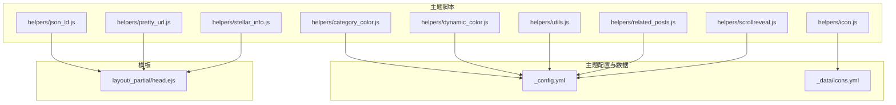
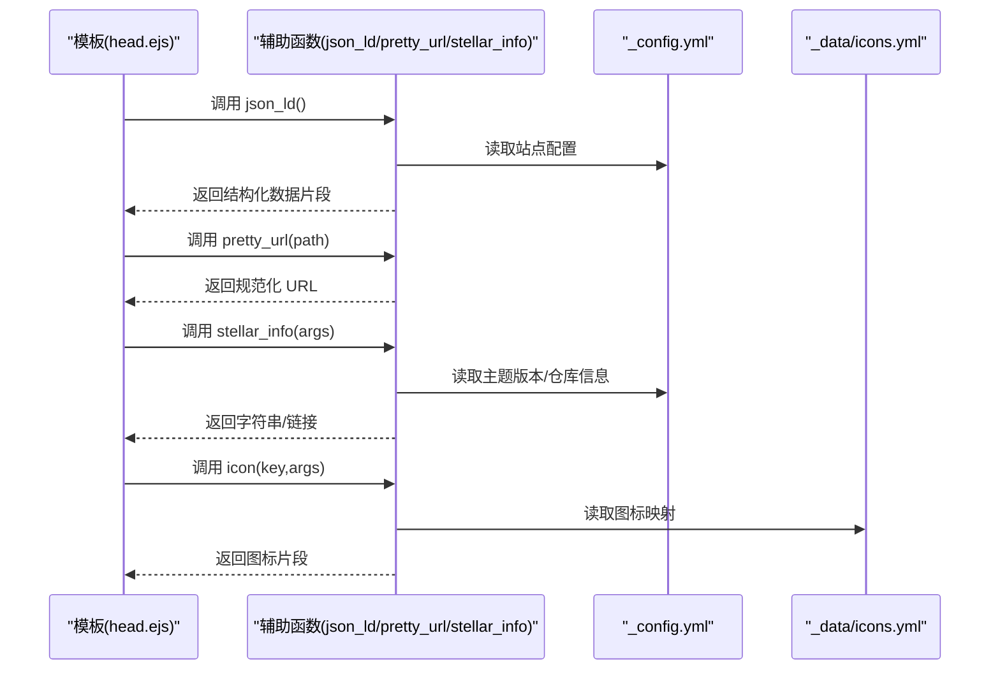
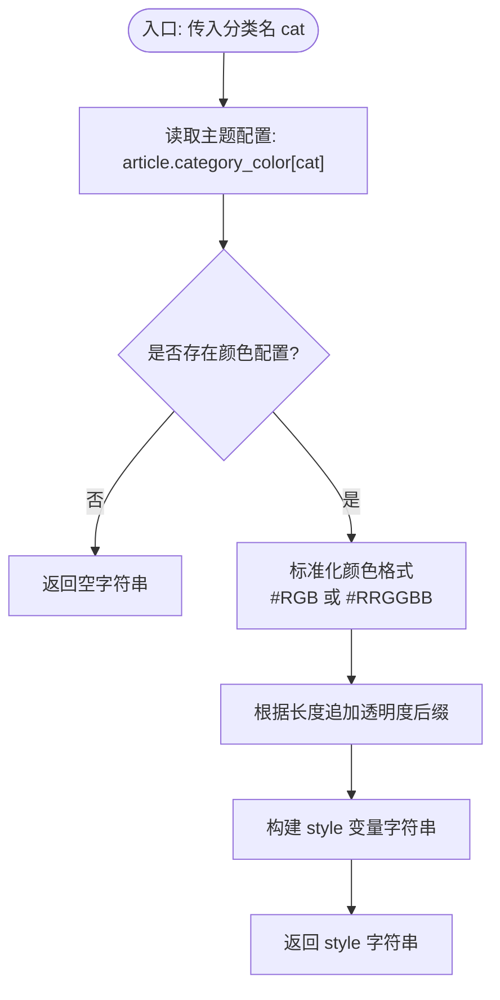
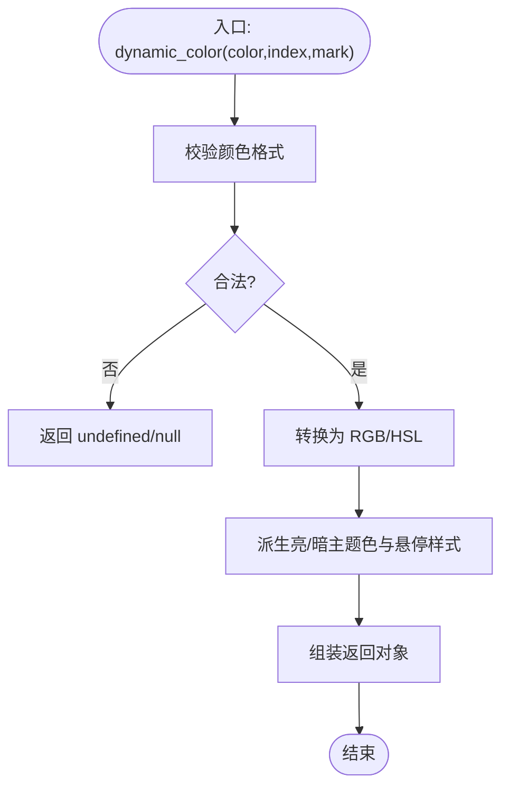
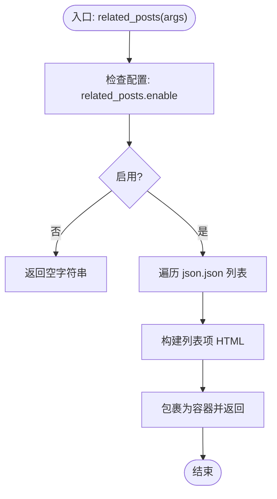
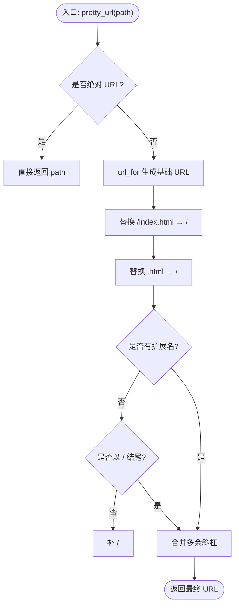
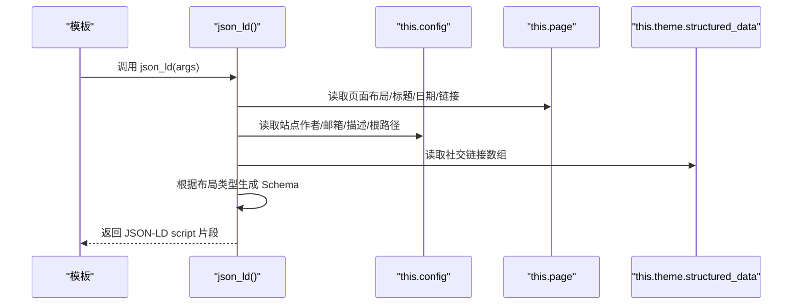
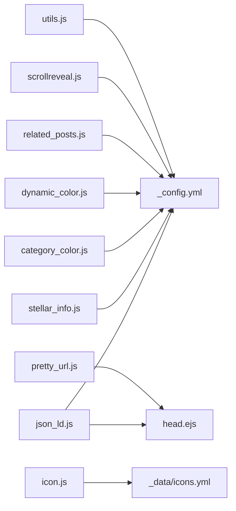

# 辅助函数使用

<cite>
**本文引用的文件**
- [category_color.js](file://themes/stellar/scripts/helpers/category_color.js)
- [dynamic_color.js](file://themes/stellar/scripts/helpers/dynamic_color.js)
- [icon.js](file://themes/stellar/scripts/helpers/icon.js)
- [json_ld.js](file://themes/stellar/scripts/helpers/json_ld.js)
- [utils.js](file://themes/stellar/scripts/helpers/utils.js)
- [pretty_url.js](file://themes/stellar/scripts/helpers/pretty_url.js)
- [related_posts.js](file://themes/stellar/scripts/helpers/related_posts.js)
- [scrollreveal.js](file://themes/stellar/scripts/helpers/scrollreveal.js)
- [stellar_info.js](file://themes/stellar/scripts/helpers/stellar_info.js)
- [_config.yml](file://themes/stellar/_config.yml)
- [icons.yml](file://themes/stellar/_data/icons.yml)
- [head.ejs](file://themes/stellar/layout/_partial/head.ejs)
</cite>

## 目录
1. [简介](#简介)
2. [项目结构](#项目结构)
3. [核心组件](#核心组件)
4. [架构概览](#架构概览)
5. [详细组件分析](#详细组件分析)
6. [依赖关系分析](#依赖关系分析)
7. [性能考量](#性能考量)
8. [故障排查指南](#故障排查指南)
9. [结论](#结论)
10. [附录](#附录)

## 简介
本指南面向使用 Stellar 主题的开发者与内容作者，系统讲解主题中的“辅助函数”（Helpers）。这些辅助函数贯穿数据处理、格式化、页面逻辑与工具能力，帮助在模板中更简洁、一致地生成 HTML、结构化数据与交互行为。本文将：
- 明确辅助函数的分类与职责
- 详解内置辅助函数的用途、参数与返回值
- 提供开发与扩展指导（设计原则、参数传递、返回值与错误处理）
- 给出在主题模板中的实际调用范式与最佳实践
- 总结性能优化与常见问题排查

## 项目结构
Stellar 主题的辅助函数集中于 scripts/helpers 目录，配合主题配置文件与模板共同工作。

**图表来源**
- [category_color.js](file://themes/stellar/scripts/helpers/category_color.js#L1-L23)
- [dynamic_color.js](file://themes/stellar/scripts/helpers/dynamic_color.js#L1-L138)
- [icon.js](file://themes/stellar/scripts/helpers/icon.js#L1-L6)
- [json_ld.js](file://themes/stellar/scripts/helpers/json_ld.js#L1-L122)
- [utils.js](file://themes/stellar/scripts/helpers/utils.js#L1-L21)
- [pretty_url.js](file://themes/stellar/scripts/helpers/pretty_url.js#L1-L28)
- [related_posts.js](file://themes/stellar/scripts/helpers/related_posts.js#L1-L55)
- [scrollreveal.js](file://themes/stellar/scripts/helpers/scrollreveal.js#L1-L10)
- [stellar_info.js](file://themes/stellar/scripts/helpers/stellar_info.js#L1-L22)
- [_config.yml](file://themes/stellar/_config.yml#L1-L725)
- [icons.yml](file://themes/stellar/_data/icons.yml#L1-L59)
- [head.ejs](file://themes/stellar/layout/_partial/head.ejs#L1-L156)

**章节来源**
- [category_color.js](file://themes/stellar/scripts/helpers/category_color.js#L1-L23)
- [dynamic_color.js](file://themes/stellar/scripts/helpers/dynamic_color.js#L1-L138)
- [icon.js](file://themes/stellar/scripts/helpers/icon.js#L1-L6)
- [json_ld.js](file://themes/stellar/scripts/helpers/json_ld.js#L1-L122)
- [utils.js](file://themes/stellar/scripts/helpers/utils.js#L1-L21)
- [pretty_url.js](file://themes/stellar/scripts/helpers/pretty_url.js#L1-L28)
- [related_posts.js](file://themes/stellar/scripts/helpers/related_posts.js#L1-L55)
- [scrollreveal.js](file://themes/stellar/scripts/helpers/scrollreveal.js#L1-L10)
- [stellar_info.js](file://themes/stellar/scripts/helpers/stellar_info.js#L1-L22)
- [_config.yml](file://themes/stellar/_config.yml#L1-L725)
- [icons.yml](file://themes/stellar/_data/icons.yml#L1-L59)
- [head.ejs](file://themes/stellar/layout/_partial/head.ejs#L1-L156)

## 核心组件
- 数据处理类：category_color、dynamic_color、related_posts、utils
- 格式化类：pretty_url、json_ld
- 页面逻辑类：scrollreveal、stellar_info
- 工具类：icon

这些辅助函数通过 hexo.extend.helper.register 注册，可在 EJS 模板中以 this.<函数名>(...) 的形式调用。

**章节来源**
- [category_color.js](file://themes/stellar/scripts/helpers/category_color.js#L3-L22)
- [dynamic_color.js](file://themes/stellar/scripts/helpers/dynamic_color.js#L109-L136)
- [icon.js](file://themes/stellar/scripts/helpers/icon.js#L3-L5)
- [json_ld.js](file://themes/stellar/scripts/helpers/json_ld.js#L10-L121)
- [utils.js](file://themes/stellar/scripts/helpers/utils.js#L7-L20)
- [pretty_url.js](file://themes/stellar/scripts/helpers/pretty_url.js#L3-L27)
- [related_posts.js](file://themes/stellar/scripts/helpers/related_posts.js#L9-L54)
- [scrollreveal.js](file://themes/stellar/scripts/helpers/scrollreveal.js#L3-L9)
- [stellar_info.js](file://themes/stellar/scripts/helpers/stellar_info.js#L3-L21)

## 架构概览
辅助函数与模板、配置的协作关系如下：

**图表来源**
- [head.ejs](file://themes/stellar/layout/_partial/head.ejs#L153-L154)
- [json_ld.js](file://themes/stellar/scripts/helpers/json_ld.js#L10-L121)
- [pretty_url.js](file://themes/stellar/scripts/helpers/pretty_url.js#L3-L27)
- [stellar_info.js](file://themes/stellar/scripts/helpers/stellar_info.js#L3-L21)
- [icon.js](file://themes/stellar/scripts/helpers/icon.js#L3-L5)
- [_config.yml](file://themes/stellar/_config.yml#L1-L725)
- [icons.yml](file://themes/stellar/_data/icons.yml#L1-L59)

## 详细组件分析

### 数据处理类

#### category_color
- 作用：根据分类名返回内联样式，用于主题色与半透明背景的组合，便于在页面中快速为分类标签注入主题色。
- 参数：cat（分类名）
- 返回：内联 style 字符串，包含文本色与块级背景色变量；若无配置则返回空字符串。
- 使用场景：在分类标签或分类页中为分类区块注入主题色。
- 配置来源：主题配置 article.category_color 中的分类到颜色映射。

**图表来源**
- [category_color.js](file://themes/stellar/scripts/helpers/category_color.js#L3-L22)
- [_config.yml](file://themes/stellar/_config.yml#L194-L196)

**章节来源**
- [category_color.js](file://themes/stellar/scripts/helpers/category_color.js#L1-L23)
- [_config.yml](file://themes/stellar/_config.yml#L194-L196)

#### dynamic_color
- 作用：将输入的颜色值（支持 hex、rgb、rgba、hsl、hsla）转换为一组 HSL 变体，生成亮/暗两套主题色与悬停样式，便于在标签、徽标等组件中按主题色动态派生。
- 参数：color（颜色值）、index（样式后缀索引）、mark（样式标记前缀）
- 返回：对象，包含 style_light、style_dark、style_hover 三个 CSS 片段。
- 校验与转换：内部包含颜色合法性校验与格式转换函数，确保输入合法。
- 使用场景：为动态标签、彩色徽标等组件生成一致的主题色系。

**图表来源**
- [dynamic_color.js](file://themes/stellar/scripts/helpers/dynamic_color.js#L109-L136)

**章节来源**
- [dynamic_color.js](file://themes/stellar/scripts/helpers/dynamic_color.js#L1-L138)

#### related_posts
- 作用：将“相关文章”数据包装为 HTML 结构，支持标题、列表项与摘要截断。
- 参数：args（包含 title、json.json、json.class）
- 返回：HTML 字符串；当禁用或无数据时返回空字符串。
- 依赖：主题配置 article.related_posts.enable 控制开关；依赖 hexo 的站点 posts 数据。

**图表来源**
- [related_posts.js](file://themes/stellar/scripts/helpers/related_posts.js#L9-L54)

**章节来源**
- [related_posts.js](file://themes/stellar/scripts/helpers/related_posts.js#L1-L55)
- [_config.yml](file://themes/stellar/_config.yml#L202-L204)

#### utils
- 作用：根据 _id 查找页面或文章，返回对应对象或 null。
- 参数：id（页面或文章的 _id）
- 返回：页面/文章对象或 null。

**章节来源**
- [utils.js](file://themes/stellar/scripts/helpers/utils.js#L7-L20)

### 格式化类

#### pretty_url
- 作用：将路径转换为“友好 URL”，去除 index.html、将 .html 转为目录末尾斜杠、补全末尾斜杠、合并多余斜杠。
- 参数：path（可选，默认空字符串）
- 返回：规范化后的 URL 字符串。

**图表来源**
- [pretty_url.js](file://themes/stellar/scripts/helpers/pretty_url.js#L3-L27)

**章节来源**
- [pretty_url.js](file://themes/stellar/scripts/helpers/pretty_url.js#L1-L28)

#### json_ld
- 作用：根据当前页面类型（文章、页面、首页等）生成结构化数据（JSON-LD），包含作者、发布者、缩略图、关键词等。
- 参数：args（可选，用于首页关键词拼接）
- 返回：包含 JSON-LD 的 script 片段字符串。
- 依赖：this.is_post()/is_home()、this.page、this.config、this.theme.structured_data、this.gravatar()、this.pretty_url()、this.strip_html()、hexo-util.truncate 等。

**图表来源**
- [json_ld.js](file://themes/stellar/scripts/helpers/json_ld.js#L10-L121)
- [head.ejs](file://themes/stellar/layout/_partial/head.ejs#L153-L154)

**章节来源**
- [json_ld.js](file://themes/stellar/scripts/helpers/json_ld.js#L1-L122)
- [head.ejs](file://themes/stellar/layout/_partial/head.ejs#L153-L154)

### 页面逻辑类

#### scrollreveal
- 作用：根据主题配置决定是否为元素添加滚动动画类名（如 slide-up）。
- 参数：args（可选，传入已有类名）
- 返回：带或不带滚动动画类名的字符串。

**章节来源**
- [scrollreveal.js](file://themes/stellar/scripts/helpers/scrollreveal.js#L1-L10)
- [_config.yml](file://themes/stellar/_config.yml#L557-L563)

#### stellar_info
- 作用：提供主题仓库、版本、树形链接等信息。
- 参数：args（可选，name/version/tree/issues）
- 返回：对应信息字符串或空字符串。

**章节来源**
- [stellar_info.js](file://themes/stellar/scripts/helpers/stellar_info.js#L1-L22)

### 工具类

#### icon
- 作用：委托 hexo.utils.icon 生成图标片段，通常结合 _data/icons.yml 中的键值使用。
- 参数：key、args
- 返回：图标 HTML 片段。

**章节来源**
- [icon.js](file://themes/stellar/scripts/helpers/icon.js#L1-L6)
- [icons.yml](file://themes/stellar/_data/icons.yml#L1-L59)

## 依赖关系分析

**图表来源**
- [json_ld.js](file://themes/stellar/scripts/helpers/json_ld.js#L10-L121)
- [pretty_url.js](file://themes/stellar/scripts/helpers/pretty_url.js#L3-L27)
- [stellar_info.js](file://themes/stellar/scripts/helpers/stellar_info.js#L3-L21)
- [icon.js](file://themes/stellar/scripts/helpers/icon.js#L3-L5)
- [category_color.js](file://themes/stellar/scripts/helpers/category_color.js#L3-L22)
- [dynamic_color.js](file://themes/stellar/scripts/helpers/dynamic_color.js#L109-L136)
- [related_posts.js](file://themes/stellar/scripts/helpers/related_posts.js#L9-L54)
- [scrollreveal.js](file://themes/stellar/scripts/helpers/scrollreveal.js#L3-L9)
- [utils.js](file://themes/stellar/scripts/helpers/utils.js#L7-L20)
- [_config.yml](file://themes/stellar/_config.yml#L1-L725)
- [icons.yml](file://themes/stellar/_data/icons.yml#L1-L59)
- [head.ejs](file://themes/stellar/layout/_partial/head.ejs#L153-L154)

**章节来源**
- [json_ld.js](file://themes/stellar/scripts/helpers/json_ld.js#L1-L122)
- [pretty_url.js](file://themes/stellar/scripts/helpers/pretty_url.js#L1-L28)
- [stellar_info.js](file://themes/stellar/scripts/helpers/stellar_info.js#L1-L22)
- [icon.js](file://themes/stellar/scripts/helpers/icon.js#L1-L6)
- [category_color.js](file://themes/stellar/scripts/helpers/category_color.js#L1-L23)
- [dynamic_color.js](file://themes/stellar/scripts/helpers/dynamic_color.js#L1-L138)
- [related_posts.js](file://themes/stellar/scripts/helpers/related_posts.js#L1-L55)
- [scrollreveal.js](file://themes/stellar/scripts/helpers/scrollreveal.js#L1-L10)
- [utils.js](file://themes/stellar/scripts/helpers/utils.js#L1-L21)
- [_config.yml](file://themes/stellar/_config.yml#L1-L725)
- [icons.yml](file://themes/stellar/_data/icons.yml#L1-L59)
- [head.ejs](file://themes/stellar/layout/_partial/head.ejs#L1-L156)

## 性能考量
- 避免在循环中重复调用 heavy 辅助函数：如 related_posts、json_ld 应在必要时调用，避免在高频渲染路径中重复计算。
- 使用配置缓存：如 category_color、dynamic_color 的颜色解析结果可复用，减少重复正则与转换。
- URL 规范化：pretty_url 在 head 中一次性生成，避免在多个模板中重复执行。
- 按需加载：scrollreveal 与其它插件样式/脚本通过主题配置开关控制，避免不必要的资源加载。
- 结构化数据：json_ld 仅在 head 中注入一次，避免重复生成。

[本节为通用指导，无需列出章节来源]

## 故障排查指南
- 分类颜色无效
  - 检查主题配置 article.category_color 中是否为该分类设置了颜色。
  - 确认传入的分类名与配置键一致。
  - 参考：[_config.yml](file://themes/stellar/_config.yml#L194-L196)、[category_color.js](file://themes/stellar/scripts/helpers/category_color.js#L3-L22)
- 动态颜色样式未生效
  - 确认传入的颜色值格式合法（hex、rgb、rgba、hsl、hsla）。
  - 确认 index 与 mark 参数正确，以便样式变量名匹配。
  - 参考：[dynamic_color.js](file://themes/stellar/scripts/helpers/dynamic_color.js#L109-L136)
- 相关文章不显示
  - 检查 article.related_posts.enable 是否为 true。
  - 确认已安装相关插件并提供 json.json 数据。
  - 参考：[_config.yml](file://themes/stellar/_config.yml#L202-L204)、[related_posts.js](file://themes/stellar/scripts/helpers/related_posts.js#L9-L54)
- URL 不规范
  - 检查 pretty_url 的输入路径是否为绝对 URL；确认模板中传参正确。
  - 参考：[pretty_url.js](file://themes/stellar/scripts/helpers/pretty_url.js#L3-L27)
- 结构化数据缺失
  - 确认当前页面布局类型与 json_ld 的分支逻辑匹配。
  - 检查主题配置 author/email/avatar/keywords 等字段。
  - 参考：[json_ld.js](file://themes/stellar/scripts/helpers/json_ld.js#L10-L121)
- 图标不显示
  - 检查 _data/icons.yml 中是否存在对应 key。
  - 确认 icon 辅助函数调用参数正确。
  - 参考：[icon.js](file://themes/stellar/scripts/helpers/icon.js#L3-L5)、[icons.yml](file://themes/stellar/_data/icons.yml#L1-L59)

**章节来源**
- [category_color.js](file://themes/stellar/scripts/helpers/category_color.js#L1-L23)
- [dynamic_color.js](file://themes/stellar/scripts/helpers/dynamic_color.js#L1-L138)
- [related_posts.js](file://themes/stellar/scripts/helpers/related_posts.js#L1-L55)
- [pretty_url.js](file://themes/stellar/scripts/helpers/pretty_url.js#L1-L28)
- [json_ld.js](file://themes/stellar/scripts/helpers/json_ld.js#L1-L122)
- [icon.js](file://themes/stellar/scripts/helpers/icon.js#L1-L6)
- [_config.yml](file://themes/stellar/_config.yml#L1-L725)
- [icons.yml](file://themes/stellar/_data/icons.yml#L1-L59)

## 结论
Stellar 主题的辅助函数体系覆盖了数据处理、格式化、页面逻辑与工具四大类，既保证了模板层的简洁，又提供了强大的可配置能力。通过合理使用与扩展这些辅助函数，可以显著提升主题的一致性、可维护性与 SEO 表现。

[本节为总结性内容，无需列出章节来源]

## 附录

### 辅助函数清单与调用范式
- 数据处理
  - category_color(cat)：返回内联样式字符串，用于分类标签主题色注入。
  - dynamic_color(color, index, mark)：返回亮/暗主题色与悬停样式的对象。
  - related_posts(args)：返回相关文章 HTML 片段。
  - utils(id)：返回页面/文章对象或 null。
- 格式化
  - pretty_url(path)：返回规范化 URL。
  - json_ld(args)：返回 JSON-LD 结构化数据片段。
- 页面逻辑
  - scrollreveal(args)：返回滚动动画类名字符串。
  - stellar_info(args)：返回主题仓库/版本/树形链接等信息。
- 工具
  - icon(key, args)：返回图标 HTML 片段。

**章节来源**
- [category_color.js](file://themes/stellar/scripts/helpers/category_color.js#L1-L23)
- [dynamic_color.js](file://themes/stellar/scripts/helpers/dynamic_color.js#L1-L138)
- [related_posts.js](file://themes/stellar/scripts/helpers/related_posts.js#L1-L55)
- [utils.js](file://themes/stellar/scripts/helpers/utils.js#L1-L21)
- [pretty_url.js](file://themes/stellar/scripts/helpers/pretty_url.js#L1-L28)
- [json_ld.js](file://themes/stellar/scripts/helpers/json_ld.js#L1-L122)
- [scrollreveal.js](file://themes/stellar/scripts/helpers/scrollreveal.js#L1-L10)
- [stellar_info.js](file://themes/stellar/scripts/helpers/stellar_info.js#L1-L22)
- [icon.js](file://themes/stellar/scripts/helpers/icon.js#L1-L6)

### 开发指导与最佳实践
- 设计原则
  - 单一职责：每个辅助函数聚焦一类任务。
  - 可配置：优先从主题配置读取，避免硬编码。
  - 可复用：对输入进行健壮性校验，返回稳定格式。
- 参数传递
  - 明确必填/可选参数，提供默认值或空值安全处理。
  - 对复杂对象参数，建议在调用前做浅拷贝，避免副作用。
- 返回值处理
  - HTML 片段：确保闭合标签与属性引号正确。
  - 结构化数据：遵循 schema.org 规范，避免冗余字段。
- 错误处理
  - 对外部依赖（如 gravatar、站点数据）进行兜底处理。
  - 对不可用配置返回空字符串或默认值，避免抛错中断渲染。
- 性能优化
  - 缓存昂贵计算结果（如颜色转换）。
  - 在模板中按需调用，避免重复生成。
  - 使用主题配置开关控制可选功能。

[本节为通用指导，无需列出章节来源]