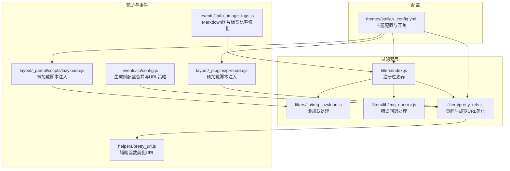
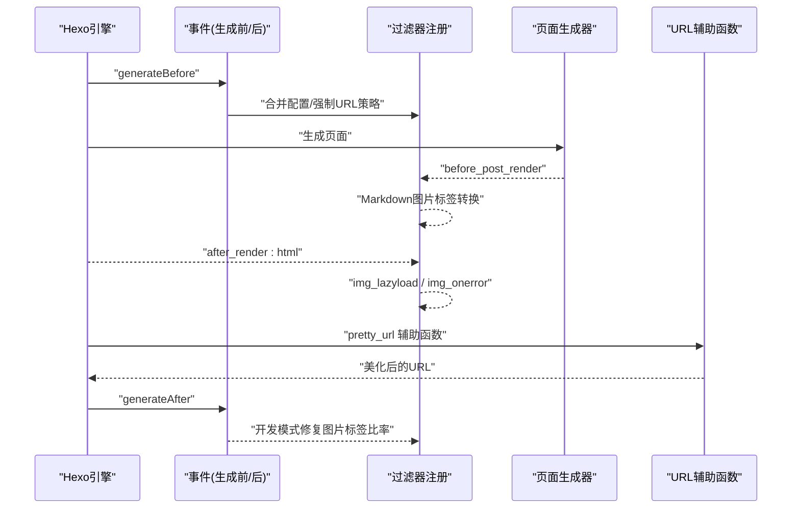
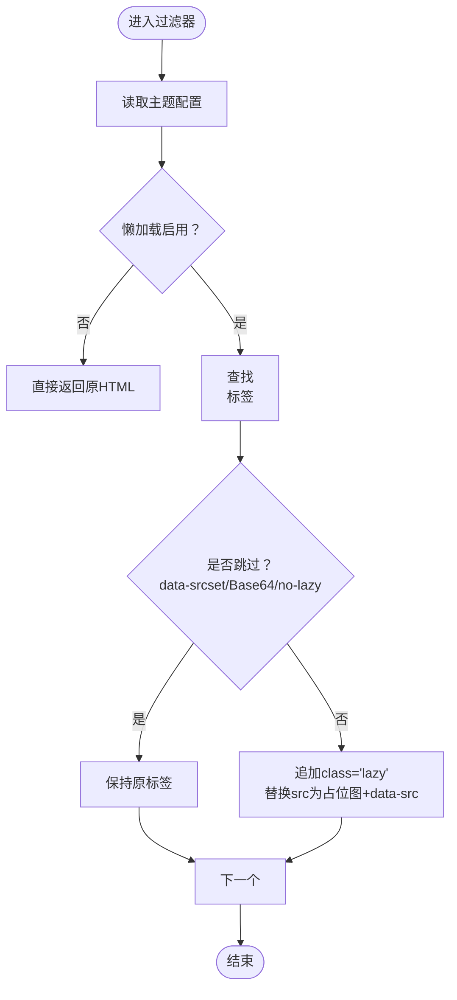
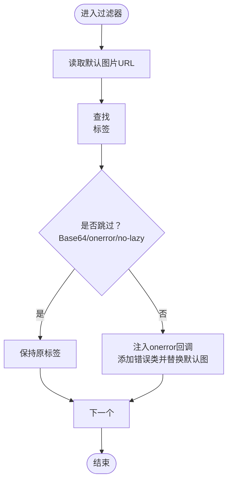
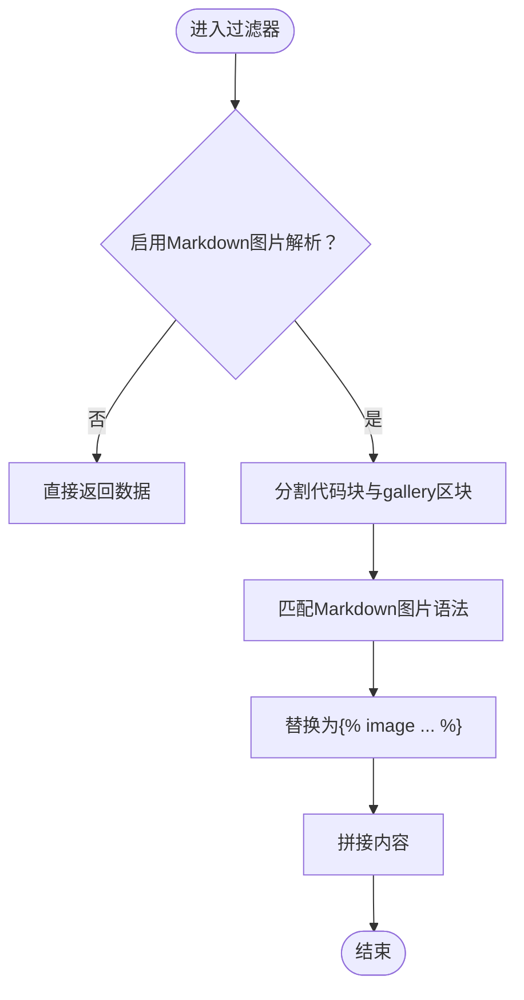
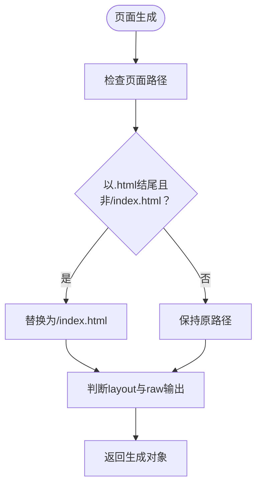
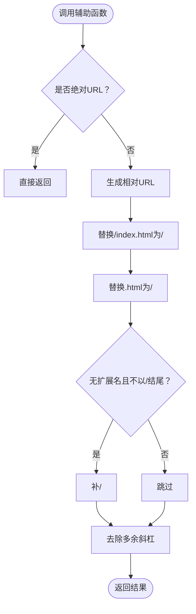
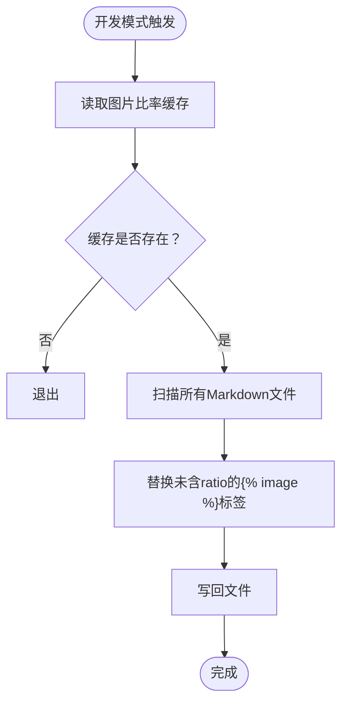
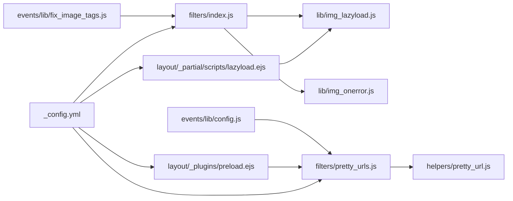

# 过滤器系统

<cite>
**本文引用的文件**
- [themes/stellar/scripts/filters/index.js](file://themes/stellar/scripts/filters/index.js)
- [themes/stellar/scripts/filters/lib/img_lazyload.js](file://themes/stellar/scripts/filters/lib/img_lazyload.js)
- [themes/stellar/scripts/filters/lib/img_onerror.js](file://themes/stellar/scripts/filters/lib/img_onerror.js)
- [themes/stellar/scripts/filters/pretty_urls.js](file://themes/stellar/scripts/filters/pretty_urls.js)
- [themes/stellar/scripts/helpers/pretty_url.js](file://themes/stellar/scripts/helpers/pretty_url.js)
- [themes/stellar/_config.yml](file://themes/stellar/_config.yml)
- [themes/stellar/layout/_partial/scripts/lazyload.ejs](file://themes/stellar/layout/_partial/scripts/lazyload.ejs)
- [themes/stellar/layout/_plugins/preload.ejs](file://themes/stellar/layout/_plugins/preload.ejs)
- [themes/stellar/scripts/events/lib/fix_image_tags.js](file://themes/stellar/scripts/events/lib/fix_image_tags.js)
- [themes/stellar/scripts/events/lib/config.js](file://themes/stellar/scripts/events/lib/config.js)
</cite>

## 目录
1. [简介](#简介)
2. [项目结构](#项目结构)
3. [核心组件](#核心组件)
4. [架构总览](#架构总览)
5. [详细组件分析](#详细组件分析)
6. [依赖关系分析](#依赖关系分析)
7. [性能考量](#性能考量)
8. [故障排查指南](#故障排查指南)
9. [结论](#结论)
10. [附录](#附录)

## 简介
本指南聚焦于Stellar主题的“过滤器系统”，系统性讲解过滤器在内容渲染过程中的工作原理与应用场景，涵盖：
- 内容过滤：在渲染前后对HTML与Markdown内容进行处理
- URL处理与美化：生成更友好的URL路径
- 链接转换与页面优化：通过过滤器与辅助函数提升页面性能与体验
- 内置过滤器详解：img_lazyload、img_onerror、pretty_urls等的实现机制与配置要点
- 自定义过滤器开发：注册、链式调用、数据处理与性能优化
- 实际使用示例与调试技巧、最佳实践

## 项目结构
Stellar主题的过滤器系统主要位于 themes/stellar/scripts/filters 目录，配合 helpers、事件与配置文件共同完成内容与URL层面的处理。

**图表来源**
- [themes/stellar/scripts/filters/index.js](file://themes/stellar/scripts/filters/index.js#L1-L31)
- [themes/stellar/scripts/filters/lib/img_lazyload.js](file://themes/stellar/scripts/filters/lib/img_lazyload.js#L1-L53)
- [themes/stellar/scripts/filters/lib/img_onerror.js](file://themes/stellar/scripts/filters/lib/img_onerror.js#L1-L25)
- [themes/stellar/scripts/filters/pretty_urls.js](file://themes/stellar/scripts/filters/pretty_urls.js#L1-L26)
- [themes/stellar/scripts/helpers/pretty_url.js](file://themes/stellar/scripts/helpers/pretty_url.js#L1-L28)
- [themes/stellar/scripts/events/lib/config.js](file://themes/stellar/scripts/events/lib/config.js#L1-L42)
- [themes/stellar/scripts/events/lib/fix_image_tags.js](file://themes/stellar/scripts/events/lib/fix_image_tags.js#L1-L44)
- [themes/stellar/layout/_partial/scripts/lazyload.ejs](file://themes/stellar/layout/_partial/scripts/lazyload.ejs#L1-L44)
- [themes/stellar/layout/_plugins/preload.ejs](file://themes/stellar/layout/_plugins/preload.ejs#L1-L9)
- [themes/stellar/_config.yml](file://themes/stellar/_config.yml#L720-L725)

**章节来源**
- [themes/stellar/scripts/filters/index.js](file://themes/stellar/scripts/filters/index.js#L1-L31)
- [themes/stellar/_config.yml](file://themes/stellar/_config.yml#L720-L725)

## 核心组件
- 过滤器注册入口：在过滤器入口文件中注册HTML渲染后与文章渲染前的过滤器钩子，形成“渲染链”。
- 图片懒加载过滤器：在HTML渲染后阶段，对标签进行class与src改写，配合前端懒加载库实现延迟加载。
- 图片错误回退过滤器：在HTML渲染后阶段，为图片添加错误回退逻辑，使用默认占位图。
- Markdown图片标签转换：在文章渲染前，将Markdown中的语法转换为标签，便于后续处理与主题插件渲染。
- URL美化过滤器：在页面生成阶段，将.html结尾的路径转换为/index.html或带/的友好路径，结合Hexo配置实现“伪静态”友好URL。
- URL辅助函数：在模板中提供辅助函数，对传入路径进行美化处理，统一输出格式。
- 事件与配置：在生成前合并配置、强制pretty_urls策略；在开发模式下修复Markdown图片标签的比率参数；懒加载脚本与预加载脚本注入页面。

**章节来源**
- [themes/stellar/scripts/filters/index.js](file://themes/stellar/scripts/filters/index.js#L3-L29)
- [themes/stellar/scripts/filters/lib/img_lazyload.js](file://themes/stellar/scripts/filters/lib/img_lazyload.js#L10-L52)
- [themes/stellar/scripts/filters/lib/img_onerror.js](file://themes/stellar/scripts/filters/lib/img_onerror.js#L10-L24)
- [themes/stellar/scripts/filters/pretty_urls.js](file://themes/stellar/scripts/filters/pretty_urls.js#L3-L25)
- [themes/stellar/scripts/helpers/pretty_url.js](file://themes/stellar/scripts/helpers/pretty_url.js#L3-L27)
- [themes/stellar/scripts/events/lib/config.js](file://themes/stellar/scripts/events/lib/config.js#L19-L23)
- [themes/stellar/scripts/events/lib/fix_image_tags.js](file://themes/stellar/scripts/events/lib/fix_image_tags.js#L22-L36)
- [themes/stellar/layout/_partial/scripts/lazyload.ejs](file://themes/stellar/layout/_partial/scripts/lazyload.ejs#L1-L44)
- [themes/stellar/layout/_plugins/preload.ejs](file://themes/stellar/layout/_plugins/preload.ejs#L1-L9)

## 架构总览
过滤器系统贯穿“生成前—渲染前—渲染后—生成后”的生命周期，形成如下处理链：

**图表来源**
- [themes/stellar/scripts/filters/index.js](file://themes/stellar/scripts/filters/index.js#L3-L29)
- [themes/stellar/scripts/filters/pretty_urls.js](file://themes/stellar/scripts/filters/pretty_urls.js#L3-L25)
- [themes/stellar/scripts/helpers/pretty_url.js](file://themes/stellar/scripts/helpers/pretty_url.js#L3-L27)
- [themes/stellar/scripts/events/lib/config.js](file://themes/stellar/scripts/events/lib/config.js#L19-L23)
- [themes/stellar/scripts/events/lib/fix_image_tags.js](file://themes/stellar/scripts/events/lib/fix_image_tags.js#L22-L36)

## 详细组件分析

### 组件A：图片懒加载过滤器（img_lazyload）
- 作用：在HTML渲染完成后，遍历标签，为每个图片添加懒加载class与data-src属性，配合前端懒加载库实现延迟加载。
- 关键逻辑：
  - 读取主题配置中的懒加载开关与过渡效果
  - 跳过已存在data-srcset、Base64占位图、或带有“no-lazy”类的图片
  - 为图片class追加“lazy”，并将真实src替换为占位图与data-src
- 性能与兼容性：
  - 通过占位图与data-src分离，避免首屏阻塞
  - 与前端懒加载库联动，支持回调与容器更新
- 配置要点：
  - 主题配置中启用懒加载与过渡方式
  - 前端懒加载脚本注入与初始化

**图表来源**
- [themes/stellar/scripts/filters/lib/img_lazyload.js](file://themes/stellar/scripts/filters/lib/img_lazyload.js#L10-L48)
- [themes/stellar/layout/_partial/scripts/lazyload.ejs](file://themes/stellar/layout/_partial/scripts/lazyload.ejs#L1-L44)

**章节来源**
- [themes/stellar/scripts/filters/lib/img_lazyload.js](file://themes/stellar/scripts/filters/lib/img_lazyload.js#L10-L52)
- [themes/stellar/layout/_partial/scripts/lazyload.ejs](file://themes/stellar/layout/_partial/scripts/lazyload.ejs#L1-L44)

### 组件B：图片错误回退过滤器（img_onerror）
- 作用：在HTML渲染完成后，为图片添加onerror回退逻辑，当图片加载失败时，替换为默认占位图并标记错误状态。
- 关键逻辑：
  - 跳过Base64占位图与已有onerror的图片
  - 仅对带有“no-lazy”类的图片生效（与懒加载策略协同）
  - 注入onerror回调，添加错误类并替换为默认图
- 注意事项：
  - 与懒加载过滤器存在潜在冲突，需注意执行顺序与条件判断

**图表来源**
- [themes/stellar/scripts/filters/lib/img_onerror.js](file://themes/stellar/scripts/filters/lib/img_onerror.js#L10-L24)

**章节来源**
- [themes/stellar/scripts/filters/lib/img_onerror.js](file://themes/stellar/scripts/filters/lib/img_onerror.js#L10-L24)

### 组件C：Markdown图片标签转换（before_post_render）
- 作用：在文章渲染前，将Markdown中的语法转换为标签，便于主题插件统一处理与渲染。
- 关键逻辑：
  - 分割代码块与gallery区块，避免误伤
  - 匹配Markdown图片语法并替换为主题标签
  - 保留原有title参数
- 应用场景：
  - 与主题图片插件配合，实现统一的图片处理与展示

**图表来源**
- [themes/stellar/scripts/filters/index.js](file://themes/stellar/scripts/filters/index.js#L6-L27)

**章节来源**
- [themes/stellar/scripts/filters/index.js](file://themes/stellar/scripts/filters/index.js#L6-L29)

### 组件D：页面生成期URL美化（page generator）
- 作用：在页面生成阶段，将.html结尾的路径转换为/index.html或带/的友好路径，避免冗余.html后缀。
- 关键逻辑：
  - 判断页面layout是否为false或raw输出类型（如.txt/json/xml）
  - 对普通页面路径进行美化，保留原始布局
- 与配置的关系：
  - 通过事件在生成前强制pretty_urls策略，确保一致性

**图表来源**
- [themes/stellar/scripts/filters/pretty_urls.js](file://themes/stellar/scripts/filters/pretty_urls.js#L3-L25)
- [themes/stellar/scripts/events/lib/config.js](file://themes/stellar/scripts/events/lib/config.js#L19-L23)

**章节来源**
- [themes/stellar/scripts/filters/pretty_urls.js](file://themes/stellar/scripts/filters/pretty_urls.js#L3-L25)
- [themes/stellar/scripts/events/lib/config.js](file://themes/stellar/scripts/events/lib/config.js#L19-L23)

### 组件E：模板辅助函数URL美化（pretty_url helper）
- 作用：在模板中对传入路径进行美化，统一输出为“/path/”或绝对URL。
- 关键逻辑：
  - 绝对URL直接返回
  - 使用url_for生成相对路径后进行替换与规范化
  - 无扩展名且不以/结尾时补/

**图表来源**
- [themes/stellar/scripts/helpers/pretty_url.js](file://themes/stellar/scripts/helpers/pretty_url.js#L3-L27)

**章节来源**
- [themes/stellar/scripts/helpers/pretty_url.js](file://themes/stellar/scripts/helpers/pretty_url.js#L3-L27)

### 组件F：开发模式图片标签比率修复
- 作用：在开发模式下，自动为标签补齐ratio参数，保证图片展示比例一致。
- 关键逻辑：
  - 读取缓存的图片比率映射
  - 遍历Markdown文件，替换未包含ratio的标签
  - 修改后写回文件

**图表来源**
- [themes/stellar/scripts/events/lib/fix_image_tags.js](file://themes/stellar/scripts/events/lib/fix_image_tags.js#L5-L44)

**章节来源**
- [themes/stellar/scripts/events/lib/fix_image_tags.js](file://themes/stellar/scripts/events/lib/fix_image_tags.js#L5-L44)

## 依赖关系分析
- 过滤器注册与执行顺序：
  - before_post_render：先于HTML渲染，负责Markdown图片标签转换
  - after_render:html：在HTML渲染后，负责img_lazyload与img_onerror
- 与配置的耦合：
  - 主题配置控制懒加载、默认图、URL美化策略
  - 生成前事件强制pretty_urls策略，避免冲突
- 与前端脚本的协作：
  - 懒加载过滤器与前端懒加载库联动
  - 预加载脚本注入提升首屏性能

**图表来源**
- [themes/stellar/scripts/filters/index.js](file://themes/stellar/scripts/filters/index.js#L3-L29)
- [themes/stellar/scripts/filters/lib/img_lazyload.js](file://themes/stellar/scripts/filters/lib/img_lazyload.js#L10-L52)
- [themes/stellar/scripts/filters/lib/img_onerror.js](file://themes/stellar/scripts/filters/lib/img_onerror.js#L10-L24)
- [themes/stellar/scripts/filters/pretty_urls.js](file://themes/stellar/scripts/filters/pretty_urls.js#L3-L25)
- [themes/stellar/scripts/helpers/pretty_url.js](file://themes/stellar/scripts/helpers/pretty_url.js#L3-L27)
- [themes/stellar/scripts/events/lib/config.js](file://themes/stellar/scripts/events/lib/config.js#L19-L23)
- [themes/stellar/scripts/events/lib/fix_image_tags.js](file://themes/stellar/scripts/events/lib/fix_image_tags.js#L5-L44)
- [themes/stellar/layout/_partial/scripts/lazyload.ejs](file://themes/stellar/layout/_partial/scripts/lazyload.ejs#L1-L44)
- [themes/stellar/layout/_plugins/preload.ejs](file://themes/stellar/layout/_plugins/preload.ejs#L1-L9)
- [themes/stellar/_config.yml](file://themes/stellar/_config.yml#L720-L725)

**章节来源**
- [themes/stellar/scripts/filters/index.js](file://themes/stellar/scripts/filters/index.js#L3-L29)
- [themes/stellar/_config.yml](file://themes/stellar/_config.yml#L720-L725)

## 性能考量
- 懒加载策略
  - 使用占位图与data-src分离，避免首屏阻塞
  - 前端懒加载库支持回调与容器更新，减少不必要的重绘
- URL美化
  - 生成期与模板期双重美化，减少无效请求与重定向
  - 避免.html后缀与多余斜杠，降低服务器压力
- 预加载与资源优化
  - 预加载脚本注入，提升首屏加载速度
  - 在开发模式下自动补齐图片比率，减少布局抖动

[本节为通用性能建议，不直接分析具体文件]

## 故障排查指南
- 图片未懒加载
  - 检查主题配置中懒加载开关与过渡方式
  - 确认图片未包含“no-lazy”类或为Base64占位图
  - 核对前端懒加载脚本是否正确注入
- 图片加载失败未回退
  - 确认错误回退过滤器已注册且生效
  - 检查默认图配置是否正确
- URL异常
  - 检查生成前配置是否强制了pretty_urls策略
  - 使用pretty_url辅助函数统一输出路径
- Markdown图片未转换为主题标签
  - 确认Markdown图片解析开关已启用
  - 检查代码块与gallery区块是否被正确排除

**章节来源**
- [themes/stellar/scripts/filters/lib/img_lazyload.js](file://themes/stellar/scripts/filters/lib/img_lazyload.js#L10-L52)
- [themes/stellar/scripts/filters/lib/img_onerror.js](file://themes/stellar/scripts/filters/lib/img_onerror.js#L10-L24)
- [themes/stellar/scripts/helpers/pretty_url.js](file://themes/stellar/scripts/helpers/pretty_url.js#L3-L27)
- [themes/stellar/scripts/events/lib/config.js](file://themes/stellar/scripts/events/lib/config.js#L19-L23)
- [themes/stellar/scripts/filters/index.js](file://themes/stellar/scripts/filters/index.js#L6-L29)

## 结论
Stellar主题的过滤器系统通过“生成前—渲染前—渲染后—生成后”的多阶段处理，实现了对内容与URL的精细化控制。内置的图片懒加载与错误回退、Markdown图片标签转换、页面生成期URL美化与模板辅助函数美化，共同构成了高效、可维护且高性能的内容渲染链。结合事件与配置的协同，系统在开发与生产环境下均能稳定运行，并为自定义扩展提供了清晰的接口与最佳实践。

[本节为总结性内容，不直接分析具体文件]

## 附录
- 自定义过滤器开发清单
  - 明确过滤器钩子：before_post_render、after_render:html等
  - 读取主题配置，避免硬编码
  - 保持幂等与可逆，避免重复处理
  - 与前端脚本解耦，通过辅助函数或模板注入衔接
  - 提供最小可复现示例与测试用例
- 链式调用与优先级
  - 使用过滤器注册时的优先级参数控制执行顺序
  - 避免相互覆盖，必要时在条件判断中协调
- 调试与监控
  - 在开发模式下逐步启用与禁用过滤器，定位问题
  - 使用日志与断点观察中间产物，确保预期行为

[本节为通用指导，不直接分析具体文件]