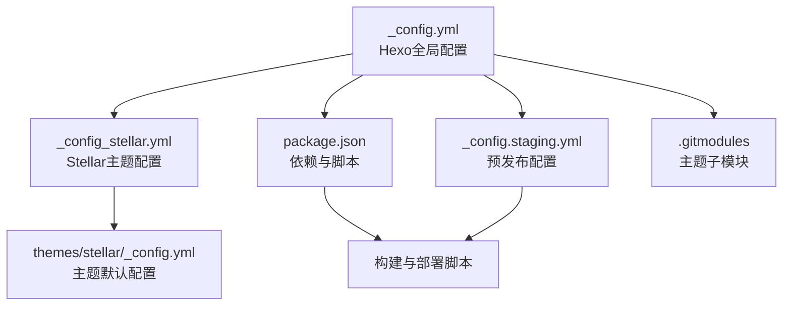
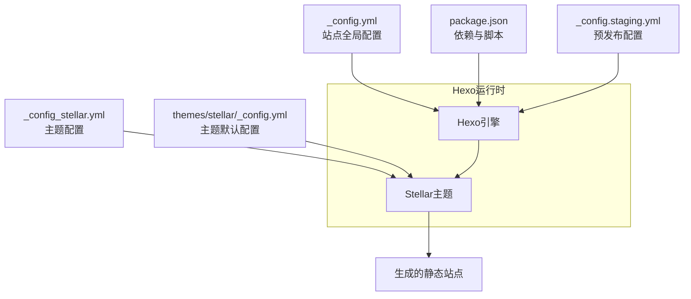
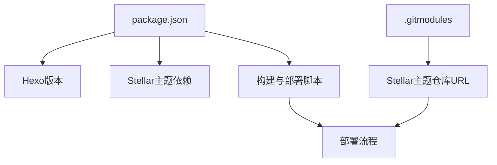

# 基础配置

<cite>
**本文引用的文件**
- [_config.yml](file://_config.yml)
- [_config_stellar.yml](file://_config_stellar.yml)
- [themes/stellar/_config.yml](file://themes/stellar/_config.yml)
- [package.json](file://package.json)
- [_config.staging.yml](file://_config.staging.yml)
- [docs/STELLAR_DEPLOYMENT_GUIDE.md](file://docs/STELLAR_DEPLOYMENT_GUIDE.md)
- [.gitmodules](file://.gitmodules)
</cite>

## 目录
1. [简介](#简介)
2. [项目结构与配置层次](#项目结构与配置层次)
3. [核心配置组件](#核心配置组件)
4. [架构概览](#架构概览)
5. [详细组件分析](#详细组件分析)
6. [依赖关系分析](#依赖关系分析)
7. [性能考量](#性能考量)
8. [故障排除指南](#故障排除指南)
9. [结论](#结论)

## 简介
本指南面向H1S97X博客的Stellar主题基础配置，重点解释Hexo全局配置文件(_config.yml)与Stellar主题配置文件(_config_stellar.yml)的基本结构、作用与优先级关系。文档将帮助你正确设置站点基本信息（标题、副标题、描述、作者、社交媒体链接等）、URL与根路径、语言与时区、RSS与部署等关键参数，并提供配置示例与最佳实践，确保博客稳定运行与良好体验。

## 项目结构与配置层次
- Hexo全局配置位于仓库根目录的_config.yml，定义站点整体行为、URL、目录结构、写作偏好、分页、RSS、部署等。
- Stellar主题配置位于仓库根目录的_config_stellar.yml，定义主题层面的界面布局、导航、评论、搜索、样式、插件等。
- 主题自身的默认配置位于themes/stellar/_config.yml，作为Stellar主题的内置默认值，通常不建议直接修改，除非需要覆盖主题默认行为。
- package.json声明了Hexo版本、主题与插件依赖，以及构建与部署脚本。
- _config.staging.yml提供预发布环境的扩展配置，便于本地或CI中进行调试与验证。
- .gitmodules定义了主题子模块的来源与路径，确保Stellar主题文件在仓库中可用。

**图表来源**
- [_config.yml](file://_config.yml#L1-L136)
- [_config_stellar.yml](file://_config_stellar.yml#L1-L699)
- [themes/stellar/_config.yml](file://themes/stellar/_config.yml#L1-L725)
- [package.json](file://package.json#L1-L94)
- [_config.staging.yml](file://_config.staging.yml#L1-L33)
- [.gitmodules](file://.gitmodules#L1-L27)

**章节来源**
- [_config.yml](file://_config.yml#L1-L136)
- [_config_stellar.yml](file://_config_stellar.yml#L1-L699)
- [themes/stellar/_config.yml](file://themes/stellar/_config.yml#L1-L725)
- [package.json](file://package.json#L1-L94)
- [_config.staging.yml](file://_config.staging.yml#L1-L33)
- [.gitmodules](file://.gitmodules#L1-L27)

## 核心配置组件
- 站点基本信息：站点标题、副标题、描述、关键词、作者、语言、时区等。
- URL与路径：站点URL、永久链接格式、美化URL、目录结构等。
- 写作与渲染：新文章命名、默认布局、外链打开方式、代码高亮、PrismJS等。
- 分页与索引：首页分页数量、分页目录、索引生成等。
- 扩展与主题：主题选择、APlayer、搜索、RSS等。
- 部署：部署类型、仓库地址、分支等。

**章节来源**
- [_config.yml](file://_config.yml#L5-L136)

## 架构概览
下图展示了配置文件之间的关系与职责分工，以及它们如何共同驱动Hexo与Stellar主题的行为。

**图表来源**
- [_config.yml](file://_config.yml#L1-L136)
- [_config_stellar.yml](file://_config_stellar.yml#L1-L699)
- [themes/stellar/_config.yml](file://themes/stellar/_config.yml#L1-L725)
- [package.json](file://package.json#L1-L94)
- [_config.staging.yml](file://_config.staging.yml#L1-L33)

## 详细组件分析

### 站点基本信息配置
- 站点标题(title)、副标题(subtitle)、描述(description)、关键词(keywords)、作者(author)、语言(language)、时区(timezone)。
- 头像与favicon：avatar、favicon。
- 语言数组支持多语言，时区设置影响日期时间显示。

最佳实践：
- 标题与副标题简洁明确，描述不超过150字符，关键词控制在3-5个。
- 语言数组按优先级排列，确保国际化展示顺序合理。
- 时区设置为Asia/Shanghai，避免跨时区显示偏差。

**章节来源**
- [_config.yml](file://_config.yml#L6-L16)

### URL与路径配置
- 站点URL(url)：GitHub Pages示例为https://用户名.github.io。
- 永久链接(permalink)与默认参数(permalink_defaults)。
- 美化URL(pretty_urls)：控制是否移除末尾index.html或.html。
- 目录结构(source_dir、public_dir、tag_dir、archive_dir、category_dir、code_dir、i18n_dir)。
- 跳过渲染(ignore)与跳过渲染列表(skip_render)。

最佳实践：
- GitHub Pages根路径为“/”，若使用子目录则设置root。
- 美化URL建议保留.trail_index但移除.trail_html，保持链接简洁。
- 目录结构保持默认，除非有特殊需求。

**章节来源**
- [_config.yml](file://_config.yml#L18-L35)

### 写作与渲染配置
- 新文章命名(new_post_name)、默认布局(default_layout)、标题大小写(titlecase)。
- 外链处理(external_link)：在新标签打开、应用范围、排除规则。
- 文件名大小写(filename_case)、草稿渲染(render_drafts)、资源文件夹(post_asset_folder)、相对链接(relative_link)、未来时间(future)。
- 代码高亮(highlight)与PrismJS(prismjs)：行号、自动检测、换行替换、包裹、hljs开关。

最佳实践：
- 外链统一在新窗口打开，提高安全性。
- highlight开启行号，便于阅读；prismjs按需启用。
- 草稿与未来文章在发布前关闭，避免生成无效页面。

**章节来源**
- [_config.yml](file://_config.yml#L37-L62)

### 首页与分页配置
- 首页生成(index_generator)：路径、每页数量、排序。
- 分页(per_page)、分页目录(pagination_dir)。

最佳实践：
- 首页每页10-20篇，兼顾加载速度与信息密度。
- 分页目录使用page，保持URL简洁。

**章节来源**
- [_config.yml](file://_config.yml#L63-L93)

### 元数据与日期时间
- 元数据生成(meta_generator)。
- 日期格式(date_format)、时间格式(time_format)、更新策略(updated_option)。

最佳实践：
- 日期时间格式遵循ISO标准，更新策略使用mtime保证时效性。

**章节来源**
- [_config.yml](file://_config.yml#L77-L88)

### 扩展与主题
- 主题(theme)：设置为stellar。
- APlayer配置(aplayer)：meting开关、资源注入。
- 搜索(search)：路径、字段、格式、限制。
- RSS(feed)：类型、路径、限制、内容长度、排序、图标、自动发现。

最佳实践：
- RSS开启并设置合理限制，确保内容摘要长度适中。
- 搜索字段按需选择post或page，限制10000以内。

**章节来源**
- [_config.yml](file://_config.yml#L101-L127)

### 部署配置
- 部署类型(deploy)：git。
- 仓库(repo)与分支(branch)。

最佳实践：
- 分支区分master与staging，避免误部署。
- 使用GitHub Actions自动化部署，确保子模块初始化与配置验证。

**章节来源**
- [_config.yml](file://_config.yml#L130-L136)

### Stellar主题配置要点
- 侧边栏与导航(menubar)：列数、菜单项(id、主题色、图标、标题、URL)。
- 站点主结构(site_tree)：主页、博客列表、文档列表、文章内页、笔记本、笔记、作者页、错误页、自定义页面。
- 笔记本(notebook)：自动摘要长度、每页数量、排序、许可协议、分享。
- 文章(article)：类型、缩进、封面与横幅比例、自动横幅、自动摘要、分类颜色、许可协议、分享、相关文章。
- 搜索(search)：服务(local_search、algolia_search)、字段、路径、内容、跳过搜索列表。
- 评论(comments)：服务(giscus、utterances、twikoo、waline、artalk)、懒加载、自定义CSS、仓库配置、主题映射、语言、加载策略。
- 页脚(footer)：社交链接、站点地图、内容(支持Markdown)。
- 标签插件(tag_plugins)：note、checkbox、quot、emoji、icon、button、image、copy、timeline、mark、hashtag、okr、gallery、chat。
- 依赖与服务(dependencies、data_services)：jQuery、marked、lazyload、站点信息、GitHub信息、评分、投票、网格布局、好友、时间线、微博、Memo、语音、视频、下载、最新评论、贡献者。
- 插件(plugins)：preload、fancybox、swiper、scrollreveal、AI摘要(tianli_gpt)、KaTeX、MathJax、Mermaid、复制代码、赫蹏(heti)。
- 样式(style)：主题首选、平滑滚动、字体大小与家族、对齐、标题前缀、圆角、颜色、动画头像、代码块滚动条、加载文案、渐变、侧边栏背景、分页器、错误页、站点背景、标题前缀。
- 默认资源(default)：头像、链接、封面、图片、项目、横幅、加载、图片错误占位。
- API主机(api_host)：GitHub API、Raw、Gist、GitHub Card。
- 系统(system)：美化URL覆盖。

最佳实践：
- 评论系统选择giscus并配置仓库与分类，确保主题与仓库一致。
- 搜索服务选择local_search，路径与字段按需调整。
- 插件按需启用，避免过度加载影响性能。
- 样式与颜色遵循主题默认，避免破坏整体视觉一致性。

**章节来源**
- [_config_stellar.yml](file://_config_stellar.yml#L1-L699)

### 配置优先级与层次关系
- Hexo全局配置(_config.yml)定义站点总体行为，Stellar主题配置(_config_stellar.yml)覆盖主题层面的布局与功能。
- 主题默认配置(themes/stellar/_config.yml)提供主题内置默认值，通常不建议直接修改。
- 预发布配置(_config.staging.yml)通过命令行合并配置，用于开发与测试环境。
- package.json声明依赖与脚本，确保构建与部署流程稳定。

优先级原则：
- 运行时配置合并顺序：_config.yml → _config_stellar.yml → themes/stellar/_config.yml → _config.staging.yml（可选）
- 一般情况下，_config_stellar.yml覆盖主题默认配置；_config.yml覆盖主题配置的非主题相关项（如URL、部署、RSS等）。

**章节来源**
- [_config.yml](file://_config.yml#L1-L136)
- [_config_stellar.yml](file://_config_stellar.yml#L1-L699)
- [themes/stellar/_config.yml](file://themes/stellar/_config.yml#L1-L725)
- [_config.staging.yml](file://_config.staging.yml#L1-L33)

### 配置示例与最佳实践
- 站点基本信息：title、subtitle、description、keywords、author、language、timezone。
- URL与路径：url、permalink、pretty_urls、root、source_dir、public_dir。
- 写作与渲染：new_post_name、default_layout、external_link、highlight、prismjs。
- 首页与分页：index_generator、per_page、pagination_dir。
- 扩展与主题：theme、aplayer、search、feed。
- 部署：deploy.type、deploy.repo、deploy.branch。

最佳实践清单：
- 使用GitHub Pages时，url与root保持一致，避免相对路径问题。
- RSS开启并设置合理限制，确保内容质量。
- 评论系统选择giscus并配置仓库与分类，确保主题与仓库一致。
- 搜索服务选择local_search，路径与字段按需调整。
- 插件按需启用，避免过度加载影响性能。
- 样式与颜色遵循主题默认，避免破坏整体视觉一致性。

**章节来源**
- [_config.yml](file://_config.yml#L18-L136)
- [_config_stellar.yml](file://_config_stellar.yml#L175-L350)

## 依赖关系分析
- Hexo版本与主题版本：package.json声明Hexo版本与Stellar主题依赖，确保兼容性。
- 主题子模块：.gitmodules定义Stellar主题来源，确保构建时主题文件可用。
- 部署脚本：package.json中的脚本支持本地与CI部署，结合_staging.yml进行预发布验证。

**图表来源**
- [package.json](file://package.json#L1-L94)
- [.gitmodules](file://.gitmodules#L1-L27)

**章节来源**
- [package.json](file://package.json#L1-L94)
- [.gitmodules](file://.gitmodules#L1-L27)

## 性能考量
- 插件启用：按需启用fancybox、swiper、mermaid、katex等，避免不必要的资源加载。
- 搜索优化：local_search路径与字段合理配置，避免索引过大。
- 样式与资源：使用CDN加速静态资源，减少本地带宽压力。
- 构建优化：使用GitHub Actions缓存npm依赖，缩短构建时间。

[本节为通用指导，无需特定文件引用]

## 故障排除指南
常见问题与解决思路：
- 主题文件缺失：执行git submodule更新初始化，确保Stellar主题文件可用。
- 构建失败：运行配置验证脚本，清理并重新构建。
- 部署权限：检查GitHub Actions token权限与仓库Settings > Actions配置。
- 页面显示异常：检查URL与路径设置，确认资源文件生成。

调试命令：
- 验证配置：npm run stellar:validate
- 测试构建：npm run stellar:test
- 检查主题状态：npm run themes:status
- 预览部署：npm run deploy:preview
- 本地服务器：npm run server

**章节来源**
- [docs/STELLAR_DEPLOYMENT_GUIDE.md](file://docs/STELLAR_DEPLOYMENT_GUIDE.md#L127-L178)

## 结论
通过正确理解与配置_hexo.yml与_config_stellar.yml，你可以高效搭建并维护基于Stellar主题的Hexo博客。遵循本文提供的配置要点与最佳实践，结合package.json与_gitmodules的依赖管理，能够确保站点在GitHub Pages上的稳定部署与良好性能表现。遇到问题时，可借助部署指南中的调试命令与故障排除清单快速定位并解决问题。