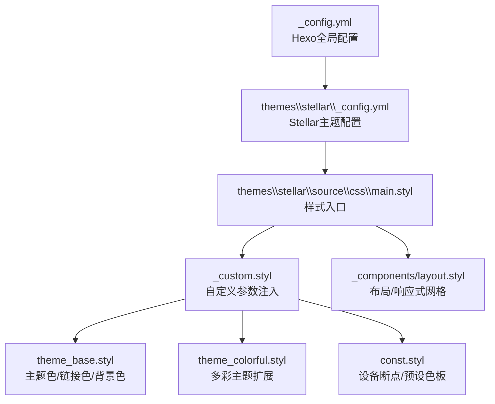
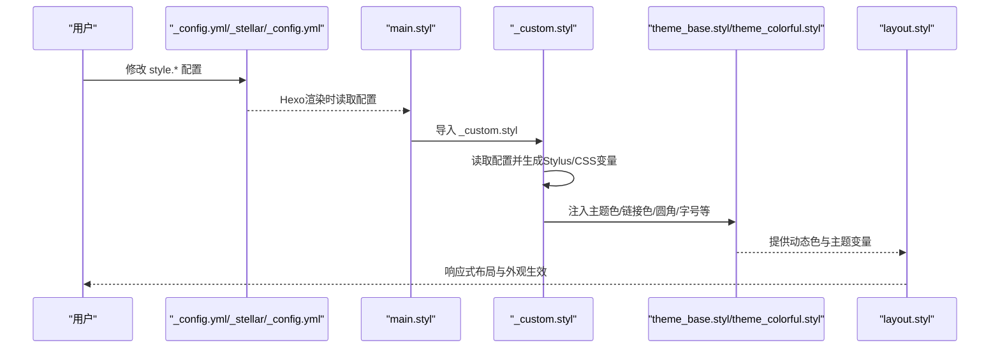
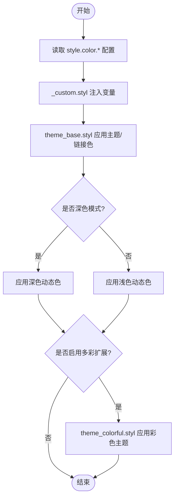
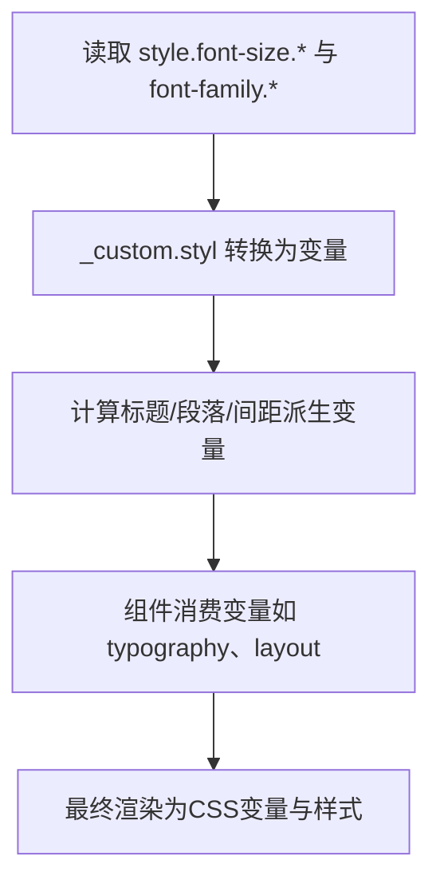
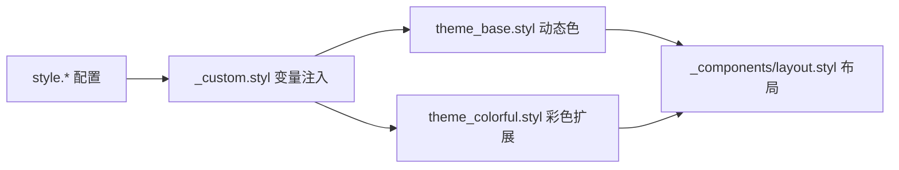

# 外观配置

<cite>
**本文引用的文件**
- [themes\stellar\_config.yml](file://themes\stellar\_config.yml)
- [themes\stellar\source\css\main.styl](file://themes\stellar\source\css\main.styl)
- [themes\stellar\source\css\_custom.styl](file://themes\stellar\source\css\_custom.styl)
- [themes\stellar\source\css\_defines\const.styl](file://themes\stellar\source\css\_defines\const.styl)
- [themes\stellar\source\css\_defines\theme_base.styl](file://themes\stellar\source\css\_defines\theme_base.styl)
- [themes\stellar\source\css\_defines\theme_colorful.styl](file://themes\stellar\source\css\_defines\theme_colorful.styl)
- [themes\stellar\source\css\_components\layout.styl](file://themes\stellar\source\css\_components\layout.styl)
</cite>

## 目录
1. [简介](#简介)
2. [项目结构](#项目结构)
3. [核心组件](#核心组件)
4. [架构总览](#架构总览)
5. [详细组件分析](#详细组件分析)
6. [依赖关系分析](#依赖关系分析)
7. [性能考量](#性能考量)
8. [故障排查指南](#故障排查指南)
9. [结论](#结论)
10. [附录](#附录)

## 简介
本指南面向H1S97X博客的Stellar主题外观配置，聚焦于主题色、强调色、链接色、字体与字号、圆角等外观系统的关键配置项。通过解析Stellar主题的配置入口与样式构建管线，帮助你基于现有配置项进行安全、可维护的个性化定制，获得符合个人审美的整体视觉效果。

## 项目结构
Stellar主题的外观配置主要集中在主题配置文件与样式构建系统中：
- 主题配置入口：themes\stellar\_config.yml
- 样式入口：themes\stellar\source\css\main.styl
- 自定义参数注入：themes\stellar\source\css\_custom.styl
- 主题色与动态色彩：themes\stellar\source\css\_defines\theme_base.styl、themes\stellar\source\css\_defines\theme_colorful.styl
- 设备断点与常量：themes\stellar\source\css\_defines\const.styl
- 布局与响应式：themes\stellar\source\css\_components\layout.styl

**图表来源**
- [themes\stellar\_config.yml](file://themes\stellar\_config.yml#L635-L698)
- [themes\stellar\source\css\main.styl](file://themes\stellar\source\css\main.styl#L1-L19)
- [themes\stellar\source\css\_custom.styl](file://themes\stellar\source\css\_custom.styl#L1-L105)
- [themes\stellar\source\css\_defines\theme_base.styl](file://themes\stellar\source\css\_defines\theme_base.styl#L1-L107)
- [themes\stellar\source\css\_defines\theme_colorful.styl](file://themes\stellar\source\css\_defines\theme_colorful.styl#L1-L118)
- [themes\stellar\source\css\_defines\const.styl](file://themes\stellar\source\css\_defines\const.styl#L1-L54)
- [themes\stellar\source\css\_components\layout.styl](file://themes\stellar\source\css\_components\layout.styl#L1-L101)

**章节来源**
- [themes\stellar\_config.yml](file://themes\stellar\_config.yml#L635-L698)
- [themes\stellar\source\css\main.styl](file://themes\stellar\source\css\main.styl#L1-L19)

## 核心组件
- 主题配置（themes\stellar\_config.yml）
  - style.font-family：正文、代码、代码块字体族
  - style.font-size：根字号、正文字号、代码字号、代码块字号
  - style.border-radius：卡片、条形、图片等圆角半径
  - style.color：主题色、强调色、链接色
  - style.leftbar/site：侧边栏/站点背景、模糊与透明度
  - style.prefers_theme/smooth_scroll：明暗偏好与滚动行为
- 样式构建（themes\stellar\source\css）
  - main.styl：导入常量、自定义参数、主题色系、通用组件与插件
  - _custom.styl：从配置读取并转换为Stylus变量，驱动CSS变量与圆角、字号等
  - _defines：主题色与动态色、设备断点、预设色板
  - _components：布局网格与响应式行为

**章节来源**
- [themes\stellar\_config.yml](file://themes\stellar\_config.yml#L635-L698)
- [themes\stellar\source\css\main.styl](file://themes\stellar\source\css\main.styl#L1-L19)
- [themes\stellar\source\css\_custom.styl](file://themes\stellar\source\css\_custom.styl#L1-L105)

## 架构总览
Stellar外观配置遵循“配置→变量→主题色系→组件”的链路：
- 配置层：_config.yml与_stellar/_config.yml中的style.*键
- 变量层：_custom.styl将配置转换为Stylus变量与CSS变量
- 主题层：theme_base.styl与theme_colorful.styl定义主题色、链接色、背景与文本色
- 组件层：layout.styl等组件消费变量，实现布局与响应式

**图表来源**
- [themes\stellar\_config.yml](file://themes\stellar\_config.yml#L635-L698)
- [themes\stellar\source\css\main.styl](file://themes\stellar\source\css\main.styl#L1-L19)
- [themes\stellar\source\css\_custom.styl](file://themes\stellar\source\css\_custom.styl#L1-L105)
- [themes\stellar\source\css\_defines\theme_base.styl](file://themes\stellar\source\css\_defines\theme_base.styl#L1-L107)
- [themes\stellar\source\css\_defines\theme_colorful.styl](file://themes\stellar\source\css\_defines\theme_colorful.styl#L1-L118)
- [themes\stellar\source\css\_components\layout.styl](file://themes\stellar\source\css\_components\layout.styl#L1-L101)

## 详细组件分析

### 颜色系统配置
- 主题色（brand/accent/link）
  - 配置键：style.color.theme、style.color.accent、style.color.link
  - 生效机制：_custom.styl读取配置并注入变量；theme_base.styl设置主题色与链接色；theme_colorful.styl提供多彩扩展
- 明暗模式与动态色
  - prefers_theme：auto/light/dark
  - 动态色：背景、卡片、文本、块级元素等随明暗模式变化
- 预设色板与标签插件
  - const.styl内置多组预设色，便于在插件或标签中使用

**图表来源**
- [themes\stellar\_config.yml](file://themes\stellar\_config.yml#L658-L662)
- [themes\stellar\source\css\_custom.styl](file://themes\stellar\source\css\_custom.styl#L38-L42)
- [themes\stellar\source\css\_defines\theme_base.styl](file://themes\stellar\source\css\_defines\theme_base.styl#L88-L106)
- [themes\stellar\source\css\_defines\theme_colorful.styl](file://themes\stellar\source\css\_defines\theme_colorful.styl#L1-L118)

**章节来源**
- [themes\stellar\_config.yml](file://themes\stellar\_config.yml#L658-L662)
- [themes\stellar\source\css\_custom.styl](file://themes\stellar\source\css\_custom.styl#L38-L42)
- [themes\stellar\source\css\_defines\theme_base.styl](file://themes\stellar\source\css\_defines\theme_base.styl#L1-L107)
- [themes\stellar\source\css\_defines\const.styl](file://themes\stellar\source\css\_defines\const.styl#L13-L52)

### 字体与字号配置
- 字体族
  - style.font-family.body、style.font-family.code、style.font-family.codeblock
  - _custom.styl将其转换为Stylus变量，供组件使用
- 字号体系
  - style.font-size.root：全局根字号
  - style.font-size.body：正文字号（可受root影响）
  - style.font-size.code：行内代码字号（百分比）
  - style.font-size.codeblock：代码块字号（相对单位）
  - _custom.styl还计算了标题与段落间距等派生变量

**图表来源**
- [themes\stellar\_config.yml](file://themes\stellar\_config.yml#L638-L646)
- [themes\stellar\source\css\_custom.styl](file://themes\stellar\source\css\_custom.styl#L4-L18)

**章节来源**
- [themes\stellar\_config.yml](file://themes\stellar\_config.yml#L638-L646)
- [themes\stellar\source\css\_custom.styl](file://themes\stellar\source\css\_custom.styl#L4-L30)

### 圆角与边界半径
- 配置键：style.border-radius.*
  - card-l、card、card-s、bar、image-l、image、image-s
- 生效机制：_custom.styl读取并转换为Stylus变量，供组件样式使用

**章节来源**
- [themes\stellar\_config.yml](file://themes\stellar\_config.yml#L650-L657)
- [themes\stellar\source\css\_custom.styl](file://themes\stellar\source\css\_custom.styl#L56-L63)

### 侧边栏与站点背景
- 配置键：style.leftbar.*、style.site.*
  - 背景色/背景图、模糊像素与透明度等
- 生效机制：_custom.styl注入变量，配合布局组件实现背景与遮罩效果

**章节来源**
- [themes\stellar\_config.yml](file://themes\stellar\_config.yml#L674-L691)
- [themes\stellar\source\css\_custom.styl](file://themes\stellar\source\css\_custom.styl#L32-L36)

### 响应式与布局
- 设备断点：const.styl定义移动端、平板、桌面等断点
- 布局网格：layout.styl使用CSS Grid与Stylus变量控制主内容宽度、侧栏宽度与间距
- 动态宽度：_custom.styl根据屏幕尺寸设置主内容最大宽度

**章节来源**
- [themes\stellar\source\css\_defines\const.styl](file://themes\stellar\source\css\_defines\const.styl#L1-L11)
- [themes\stellar\source\css\_components\layout.styl](file://themes\stellar\source\css\_components\layout.styl#L1-L101)
- [themes\stellar\source\css\_custom.styl](file://themes\stellar\source\css\_custom.styl#L66-L92)

## 依赖关系分析
- 配置到变量
  - _config.yml中的style.*键经由_hexo-config_读取，注入到_custom.styl
- 变量到主题色系
  - _custom.styl将颜色、字号、圆角等转换为CSS变量与Stylus变量，供theme_base与theme_colorful使用
- 主题色系到组件
  - theme_base与theme_colorful定义动态色与主题扩展，layout等组件消费这些变量

**图表来源**
- [themes\stellar\_config.yml](file://themes\stellar\_config.yml#L635-L698)
- [themes\stellar\source\css\_custom.styl](file://themes\stellar\source\css\_custom.styl#L1-L105)
- [themes\stellar\source\css\_defines\theme_base.styl](file://themes\stellar\source\css\_defines\theme_base.styl#L1-L107)
- [themes\stellar\source\css\_defines\theme_colorful.styl](file://themes\stellar\source\css\_defines\theme_colorful.styl#L1-L118)
- [themes\stellar\source\css\_components\layout.styl](file://themes\stellar\source\css\_components\layout.styl#L1-L101)

**章节来源**
- [themes\stellar\source\css\main.styl](file://themes\stellar\source\css\main.styl#L1-L19)
- [themes\stellar\source\css\_custom.styl](file://themes\stellar\source\css\_custom.styl#L1-L105)

## 性能考量
- 字号与圆角使用相对单位与CSS变量，有利于减少重复计算与提升渲染效率
- 明暗模式通过CSS变量与媒体查询切换，避免频繁重排
- 响应式断点集中定义，降低样式体积与匹配复杂度

[本节为通用指导，无需列出具体文件来源]

## 故障排查指南
- 配置未生效
  - 检查配置键是否位于正确层级（style.*）
  - 确认配置文件保存并重新构建
- 字体显示异常
  - 检查font-family是否包含可用字体栈
  - 确认网络可访问字体资源
- 圆角或字号不一致
  - 检查是否混用百分比与相对单位
  - 确认组件是否正确消费CSS变量
- 明暗模式切换无效
  - 检查prefers_theme设置与浏览器系统偏好
  - 确认未手动覆盖关键CSS变量

**章节来源**
- [themes\stellar\_config.yml](file://themes\stellar\_config.yml#L635-L698)
- [themes\stellar\source\css\_custom.styl](file://themes\stellar\source\css\_custom.styl#L1-L105)

## 结论
通过将配置项映射到Stylus变量与CSS变量，并由主题色系与组件共同消费，Stellar实现了清晰、可维护的外观定制能力。建议优先使用style.*配置项进行外观调整，避免直接修改底层样式文件，以确保升级与维护的便利性。

[本节为总结性内容，无需列出具体文件来源]

## 附录

### 实战示例（步骤说明）
- 调整主题色
  - 在配置中设置style.color.theme为主题色值
  - 保存后重新构建，观察链接色与动态色联动变化
- 更换正文字体
  - 在配置中设置style.font-family.body为期望字体栈
  - 保存后重新构建，确认正文排版变化
- 调整字号
  - 在配置中设置style.font-size.root与style.font-size.body
  - 保存后重新构建，检查标题与段落间距是否按预期缩放
- 设置圆角
  - 在配置中设置style.border-radius.card等键值
  - 保存后重新构建，观察卡片与图片圆角变化
- 侧边栏背景
  - 在配置中设置style.leftbar.background-image或背景色
  - 保存后重新构建，确认背景与模糊效果

**章节来源**
- [themes\stellar\_config.yml](file://themes\stellar\_config.yml#L635-L698)
- [themes\stellar\source\css\_custom.styl](file://themes\stellar\source\css\_custom.styl#L1-L105)