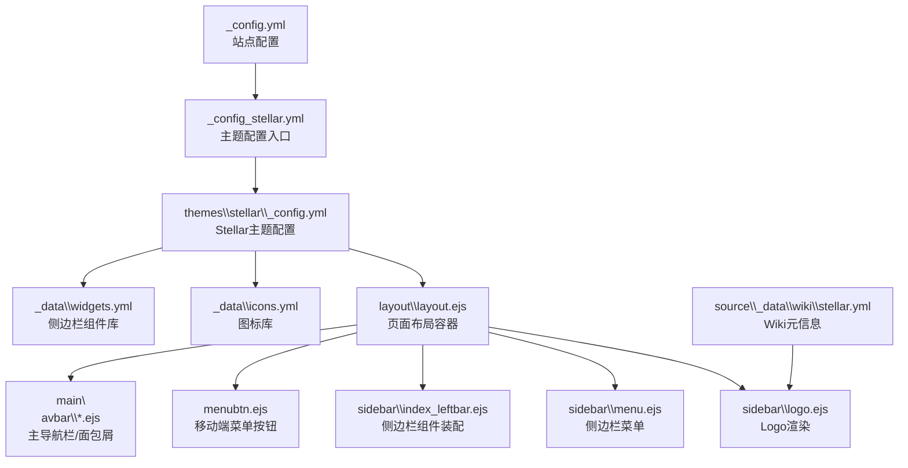
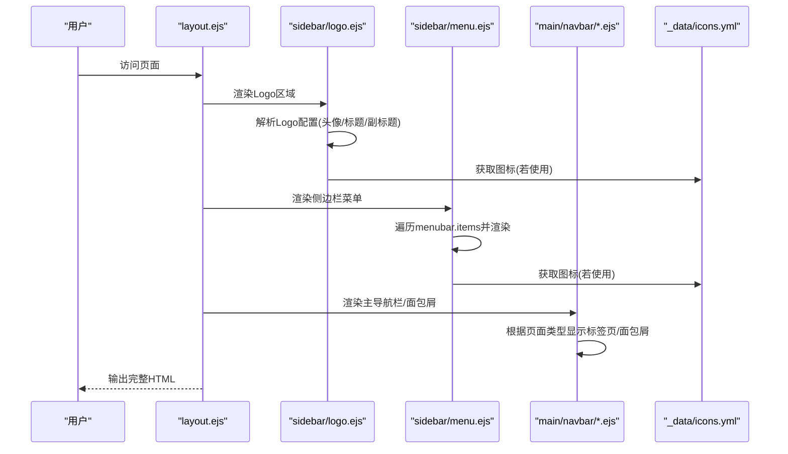
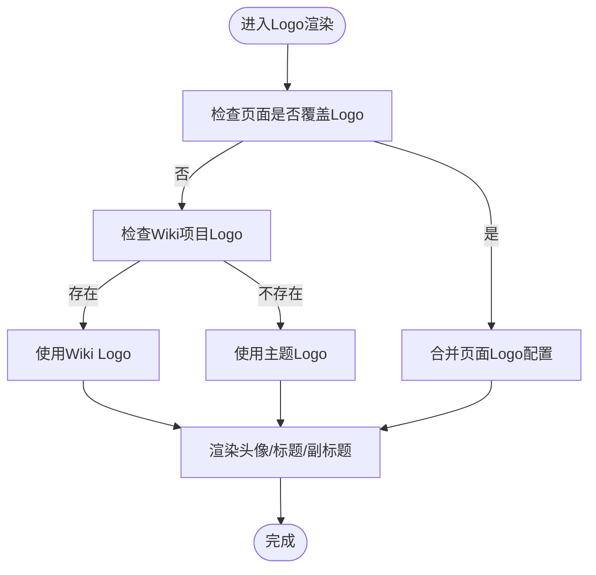
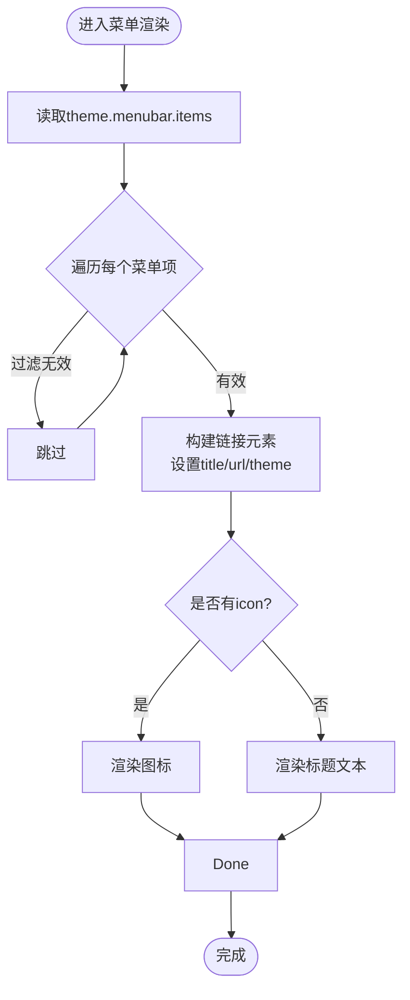
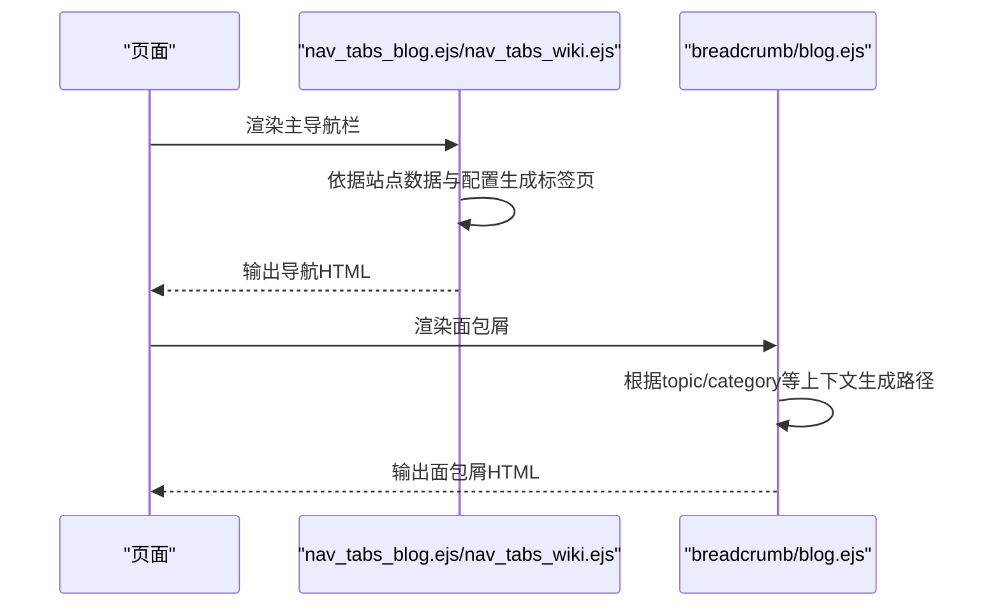
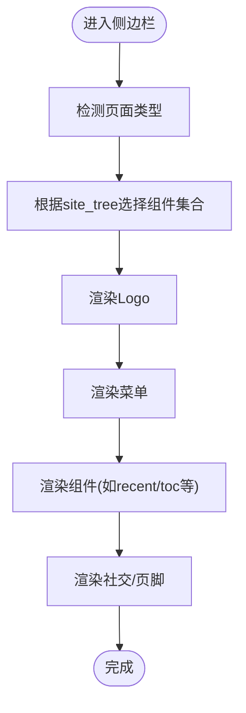
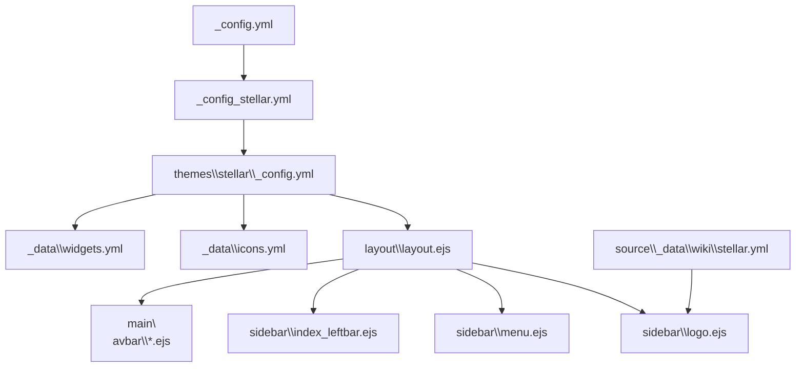

# 导航配置

<cite>
**本文引用的文件**
- [themes\stellar\_config.yml](file://themes\stellar\_config.yml)
- [themes\stellar\layout\_partial\sidebar\logo.ejs](file://themes\stellar\layout\_partial\sidebar\logo.ejs)
- [themes\stellar\layout\_partial\sidebar\menu.ejs](file://themes\stellar\layout\_partial\sidebar\menu.ejs)
- [themes\stellar\layout\_partial\sidebar\index_leftbar.ejs](file://themes\stellar\layout\_partial\sidebar\index_leftbar.ejs)
- [themes\stellar\layout\layout.ejs](file://themes\stellar\layout\layout.ejs)
- [themes\stellar\layout\_partial\menubtn.ejs](file://themes\stellar\layout\_partial\menubtn.ejs)
- [themes\stellar\layout\_partial\main\navbar\nav_tabs_blog.ejs](file://themes\stellar\layout\_partial\main\navbar\nav_tabs_blog.ejs)
- [themes\stellar\layout\_partial\main\navbar\nav_tabs_wiki.ejs](file://themes\stellar\layout\_partial\main\navbar\nav_tabs_wiki.ejs)
- [themes\stellar\layout\_partial\main\navbar\breadcrumb\blog.ejs](file://themes\stellar\layout\_partial\main\navbar\breadcrumb\blog.ejs)
- [themes\stellar\_data\icons.yml](file://themes\stellar\_data\icons.yml)
- [themes\stellar\_data\widgets.yml](file://themes\stellar\_data\widgets.yml)
- [source\_data\wiki\stellar.yml](file://source\_data\wiki\stellar\stellar.yml)
</cite>

## 目录
1. [简介](#简介)
2. [项目结构](#项目结构)
3. [核心组件](#核心组件)
4. [架构总览](#架构总览)
5. [详细组件分析](#详细组件分析)
6. [依赖关系分析](#依赖关系分析)
7. [性能考虑](#性能考虑)
8. [故障排除指南](#故障排除指南)
9. [结论](#结论)

## 简介
本指南面向H1S97X博客的Stellar主题导航配置，聚焦于三大部分：Logo区域设置、侧边栏菜单配置、主导航栏设置。文档将结合主题配置文件与模板文件，逐项解释Logo的头像、标题、副标题配置；侧边栏菜单的结构与参数；以及主导航栏（含面包屑与标签页）的联动机制。同时提供可操作的自定义示例，帮助你快速添加或修改导航项，打造个性化导航体验。

## 项目结构
与导航相关的核心位置如下：
- 主题配置：themes\stellar\_config.yml
- Logo与侧边栏菜单模板：themes\stellar\layout\_partial\sidebar\*.ejs
- 页面布局与容器：themes\stellar\layout\layout.ejs
- 移动端菜单按钮：themes\stellar\layout\_partial\menubtn.ejs
- 主导航栏与面包屑：themes\stellar\layout\_partial\main\navbar\*.ejs
- 图标与侧边栏组件：themes\stellar\_data\icons.yml、themes\stellar\_data\widgets.yml
- Wiki元信息：source\_data\wiki\stellar.yml

**图表来源**
- [themes\stellar\_config.yml](file://themes\stellar\_config.yml#L1-L725)
- [themes\stellar\layout\layout.ejs](file://themes\stellar\layout\layout.ejs#L1-L76)
- [themes\stellar\layout\_partial\sidebar\logo.ejs](file://themes\stellar\layout\_partial\sidebar\logo.ejs#L1-L79)
- [themes\stellar\layout\_partial\sidebar\menu.ejs](file://themes\stellar\layout\_partial\sidebar\menu.ejs#L1-L27)
- [themes\stellar\layout\_partial\sidebar\index_leftbar.ejs](file://themes\stellar\layout\_partial\sidebar\index_leftbar.ejs#L1-L167)
- [themes\stellar\layout\_partial\menubtn.ejs](file://themes\stellar\layout\_partial\menubtn.ejs#L1-L9)
- [themes\stellar\layout\_partial\main\navbar\nav_tabs_blog.ejs](file://themes\stellar\layout\_partial\main\navbar\nav_tabs_blog.ejs#L1-L71)
- [themes\stellar\layout\_partial\main\navbar\nav_tabs_wiki.ejs](file://themes\stellar\layout\_partial\main\navbar\nav_tabs_wiki.ejs#L1-L52)
- [themes\stellar\_data\icons.yml](file://themes\stellar\_data\icons.yml#L1-L59)
- [themes\stellar\_data\widgets.yml](file://themes\stellar\_data\widgets.yml#L1-L85)
- [source\_data\wiki\stellar.yml](file://source\_data\wiki\stellar.yml#L1-L10)

**章节来源**
- [themes\stellar\_config.yml](file://themes\stellar\_config.yml#L35-L69)
- [themes\stellar\layout\layout.ejs](file://themes\stellar\layout\layout.ejs#L1-L76)

## 核心组件
- Logo区域：负责展示站点或项目的图标、标题与副标题，支持头像与标题链接、副标题轮换提示。
- 侧边栏菜单：基于主题配置中的menubar.items，渲染主导航按钮，支持图标、主题色、标题与链接。
- 主导航栏：在内容页顶部展示“近期发布/分类/标签/专题/归档”等标签页，支持自定义扩展。
- 面包屑：在文章/专题/分类等页面展示层级路径，便于快速回溯。
- 侧边栏组件：如最近更新、目录树、标签云等，通过widgets.yml配置与装配。

**章节来源**
- [themes\stellar\layout\_partial\sidebar\logo.ejs](file://themes\stellar\layout\_partial\sidebar\logo.ejs#L1-L79)
- [themes\stellar\layout\_partial\sidebar\menu.ejs](file://themes\stellar\layout\_partial\sidebar\menu.ejs#L1-L27)
- [themes\stellar\layout\_partial\main\navbar\nav_tabs_blog.ejs](file://themes\stellar\layout\_partial\main\navbar\nav_tabs_blog.ejs#L1-L71)
- [themes\stellar\layout\_partial\main\navbar\nav_tabs_wiki.ejs](file://themes\stellar\layout\_partial\main\navbar\nav_tabs_wiki.ejs#L1-L52)
- [themes\stellar\layout\_partial\main\navbar\breadcrumb\blog.ejs](file://themes\stellar\layout\_partial\main\navbar\breadcrumb\blog.ejs#L1-L34)
- [themes\stellar\_data\widgets.yml](file://themes\stellar\_data\widgets.yml#L1-L85)

## 架构总览
Stellar主题的导航体系由“配置驱动 + 模板渲染”构成。主题配置文件定义Logo、菜单、站点树、插件等，模板文件根据页面类型与上下文动态渲染对应UI。

**图表来源**
- [themes\stellar\layout\layout.ejs](file://themes\stellar\layout\layout.ejs#L51-L67)
- [themes\stellar\layout\_partial\sidebar\logo.ejs](file://themes\stellar\layout\_partial\sidebar\logo.ejs#L40-L75)
- [themes\stellar\layout\_partial\sidebar\menu.ejs](file://themes\stellar\layout\_partial\sidebar\menu.ejs#L4-L20)
- [themes\stellar\layout\_partial\main\navbar\nav_tabs_blog.ejs](file://themes\stellar\layout\_partial\main\navbar\nav_tabs_blog.ejs#L7-L61)
- [themes\stellar\layout\_partial\main\navbar\nav_tabs_wiki.ejs](file://themes\stellar\layout\_partial\main\navbar\nav_tabs_wiki.ejs#L7-L41)
- [themes\stellar\_data\icons.yml](file://themes\stellar\_data\icons.yml#L1-L59)

## 详细组件分析

### Logo区域配置与渲染
- 配置位置：themes\stellar\_config.yml 的 logo 段落，支持 avatar、title、subtitle。
- 渲染逻辑：
  - 支持使用头像图片或Markdown链接形式的头像。
  - 标题支持Markdown链接，可指向首页或其他页面。
  - 副标题支持多文案轮换（以“|”分隔），鼠标悬停时切换显示。
  - Wiki项目可覆盖Logo，优先使用项目Logo，否则回退到默认配置。
- 常见用途：首页/内容页顶部、侧边栏Logo区域均可显示。

**图表来源**
- [themes\stellar\layout\_partial\sidebar\logo.ejs](file://themes\stellar\layout\_partial\sidebar\logo.ejs#L2-L20)
- [themes\stellar\layout\_partial\sidebar\logo.ejs](file://themes\stellar\layout\_partial\sidebar\logo.ejs#L40-L75)
- [source\_data\wiki\stellar.yml](file://source\_data\wiki\stellar.yml#L1-L10)

**章节来源**
- [themes\stellar\_config.yml](file://themes\stellar\_config.yml#L35-L38)
- [themes\stellar\layout\_partial\sidebar\logo.ejs](file://themes\stellar\layout\_partial\sidebar\logo.ejs#L40-L75)
- [source\_data\wiki\stellar.yml](file://source\_data\wiki\stellar.yml#L1-L10)

### 侧边栏菜单配置与渲染
- 配置位置：themes\stellar\_config.yml 的 menubar 段落，items数组定义菜单项。
- 菜单项参数：
  - id：页面高亮标识，用于匹配当前页面的menu_id。
  - theme：高亮时的主题色（仅当图标SVG使用currentColor时生效）。
  - icon：支持icons.yml中的键名或外部图片URL。
  - title：菜单标题（支持国际化）。
  - url：点击跳转链接，支持相对/绝对路径。
- 渲染逻辑：
  - 遍历items，过滤无效项，渲染为导航链接。
  - 当item.theme存在时，注入内联样式颜色。
  - 当item.icon存在则渲染图标，否则显示标题文本。
  - 根据page.menu_id与item.id匹配，为当前项添加active类。

**图表来源**
- [themes\stellar\layout\_partial\sidebar\menu.ejs](file://themes\stellar\layout\_partial\sidebar\menu.ejs#L4-L20)
- [themes\stellar\_data\icons.yml](file://themes\stellar\_data\icons.yml#L1-L59)

**章节来源**
- [themes\stellar\_config.yml](file://themes\stellar\_config.yml#L41-L69)
- [themes\stellar\layout\_partial\sidebar\menu.ejs](file://themes\stellar\layout\_partial\sidebar\menu.ejs#L4-L20)

### 主导航栏与面包屑
- 主导航栏（内容页顶部）：
  - 博客页：近期发布、分类、标签、专题、归档等标签页。
  - Wiki页：全部Wiki、项目分类标签页，支持自定义nav_tabs扩展。
  - 标签页根据当前页面路径高亮，支持前缀匹配。
- 面包屑：
  - 文章/专题：显示“专题列表/专题主页”或“博客/分类”等层级。
  - 支持根据page.topic/page.category等上下文动态拼接。

**图表来源**
- [themes\stellar\layout\_partial\main\navbar\nav_tabs_blog.ejs](file://themes\stellar\layout\_partial\main\navbar\nav_tabs_blog.ejs#L7-L61)
- [themes\stellar\layout\_partial\main\navbar\nav_tabs_wiki.ejs](file://themes\stellar\layout\_partial\main\navbar\nav_tabs_wiki.ejs#L7-L41)
- [themes\stellar\layout\_partial\main\navbar\breadcrumb\blog.ejs](file://themes\stellar\layout\_partial\main\navbar\breadcrumb\blog.ejs#L5-L30)

**章节来源**
- [themes\stellar\layout\_partial\main\navbar\nav_tabs_blog.ejs](file://themes\stellar\layout\_partial\main\navbar\nav_tabs_blog.ejs#L1-L71)
- [themes\stellar\layout\_partial\main\navbar\nav_tabs_wiki.ejs](file://themes\stellar\layout\_partial\main\navbar\nav_tabs_wiki.ejs#L1-L52)
- [themes\stellar\layout\_partial\main\navbar\breadcrumb\blog.ejs](file://themes\stellar\layout\_partial\main\navbar\breadcrumb\blog.ejs#L1-L34)

### 侧边栏组件与Logo/菜单装配
- 侧边栏组件装配：
  - 根据页面类型与site_tree配置，决定加载哪些组件（如recent、toc、tree等）。
  - 支持在页面front-matter或项目配置中覆盖组件集合。
- Logo与菜单：
  - Logo与菜单在侧边栏容器中按顺序渲染，Logo位于上方，菜单紧随其后。
  - 菜单渲染依赖menubar.items，Logo渲染依赖logo配置。

**图表来源**
- [themes\stellar\layout\_partial\sidebar\index_leftbar.ejs](file://themes\stellar\layout\_partial\sidebar\index_leftbar.ejs#L7-L53)
- [themes\stellar\layout\_partial\sidebar\logo.ejs](file://themes\stellar\layout\_partial\sidebar\logo.ejs#L40-L75)
- [themes\stellar\layout\_partial\sidebar\menu.ejs](file://themes\stellar\layout\_partial\sidebar\menu.ejs#L4-L20)
- [themes\stellar\_data\widgets.yml](file://themes\stellar\_data\widgets.yml#L1-L85)

**章节来源**
- [themes\stellar\layout\_partial\sidebar\index_leftbar.ejs](file://themes\stellar\layout\_partial\sidebar\index_leftbar.ejs#L7-L53)
- [themes\stellar\_data\widgets.yml](file://themes\stellar\_data\widgets.yml#L1-L85)

### 移动端菜单按钮
- 在移动端显示左右侧栏切换按钮，分别绑定sidebar.leftbar()/sidebar.rightbar()。
- 按钮图标来自icons.yml，支持自定义替换。

**章节来源**
- [themes\stellar\layout\_partial\menubtn.ejs](file://themes\stellar\layout\_partial\menubtn.ejs#L1-L9)
- [themes\stellar\_data\icons.yml](file://themes\stellar\_data\icons.yml#L24-L26)

## 依赖关系分析
- 配置依赖：
  - _config.yml与_config_stellar.yml共同决定主题加载与渲染行为。
  - _config_stellar.yml中引用Stellar主题配置文件。
- 模板依赖：
  - layout.ejs依赖sidebar/*与main/navbar/*模板。
  - sidebar/menu.ejs依赖icons.yml中的图标资源。
  - sidebar/logo.ejs依赖logo配置与wiki元信息。
- 组件依赖：
  - widgets.yml定义侧边栏组件布局与参数，index_leftbar.ejs按需装配。

**图表来源**
- [themes\stellar\_config.yml](file://themes\stellar\_config.yml#L1-L725)
- [themes\stellar\layout\layout.ejs](file://themes\stellar\layout\layout.ejs#L1-L76)
- [themes\stellar\layout\_partial\sidebar\logo.ejs](file://themes\stellar\layout\_partial\sidebar\logo.ejs#L1-L79)
- [themes\stellar\layout\_partial\sidebar\menu.ejs](file://themes\stellar\layout\_partial\sidebar\menu.ejs#L1-L27)
- [themes\stellar\layout\_partial\sidebar\index_leftbar.ejs](file://themes\stellar\layout\_partial\sidebar\index_leftbar.ejs#L1-L167)
- [themes\stellar\_data\icons.yml](file://themes\stellar\_data\icons.yml#L1-L59)
- [themes\stellar\_data\widgets.yml](file://themes\stellar\_data\widgets.yml#L1-L85)
- [source\_data\wiki\stellar.yml](file://source\_data\wiki\stellar.yml#L1-L10)

**章节来源**
- [themes\stellar\_config.yml](file://themes\stellar\_config.yml#L1-L725)
- [themes\stellar\layout\layout.ejs](file://themes\stellar\layout\layout.ejs#L1-L76)

## 性能考虑
- 图标与资源：
  - icons.yml中的图标建议使用矢量SVG，减少体积与失真风险。
  - 头像与封面图建议使用CDN或优化后的尺寸，避免阻塞渲染。
- 渲染策略：
  - 侧边栏组件按页面类型动态装配，避免不必要的组件加载。
  - 主导航栏与面包屑仅在内容页显示，首页可减少DOM节点。
- 主题色与动画：
  - 主题色与动画头像在低端设备上可能带来额外开销，可根据需要关闭或延迟加载。

[本节为通用指导，无需特定文件引用]

## 故障排除指南
- 菜单项不显示或无链接：
  - 检查menubar.items中是否遗漏id、url或存在undefined项。
  - 确认page.menu_id与item.id一致，以便正确高亮。
- Logo不显示头像或标题：
  - 确认logo.avatar或logo.title已正确配置，Markdown链接格式正确。
  - 若使用Wiki覆盖Logo，确认wiki项目配置存在且路径有效。
- 副标题不轮换：
  - 副标题需使用“|”分隔多个文案，确保渲染逻辑识别到多段文本。
- 图标不显示：
  - 确认icons.yml中存在对应键名，或使用有效的外部图片URL。
- 移动端菜单按钮无效：
  - 检查menubtn.ejs绑定的sidebar方法是否存在，确认JS已加载。

**章节来源**
- [themes\stellar\layout\_partial\sidebar\menu.ejs](file://themes\stellar\layout\_partial\sidebar\menu.ejs#L5-L8)
- [themes\stellar\layout\_partial\sidebar\logo.ejs](file://themes\stellar\layout\_partial\sidebar\logo.ejs#L57-L71)
- [themes\stellar\_data\icons.yml](file://themes\stellar\_data\icons.yml#L1-L59)
- [themes\stellar\layout\_partial\menubtn.ejs](file://themes\stellar\layout\_partial\menubtn.ejs#L1-L9)

## 结论
通过Stellar主题的配置与模板，你可以灵活定制Logo、侧边栏菜单与主导航栏。建议遵循以下实践：
- 在_config_stellar.yml中集中管理Stellar主题配置。
- 使用icons.yml统一管理图标，使用widgets.yml组织侧边栏组件。
- 通过menubar.items定义清晰的导航结构，配合page.menu_id实现高亮联动。
- 利用site_tree与nav_tabs扩展主导航栏，提升内容分类与检索效率。
- 在Wiki项目中覆盖Logo与导航，实现多项目空间的差异化导航体验。

[本节为总结性内容，无需特定文件引用]