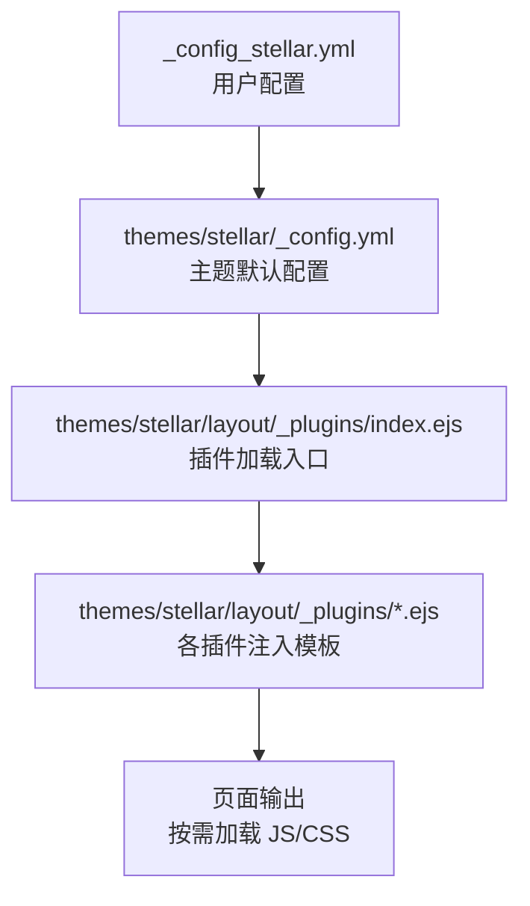
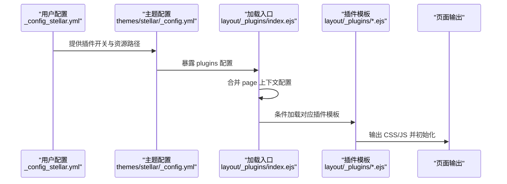
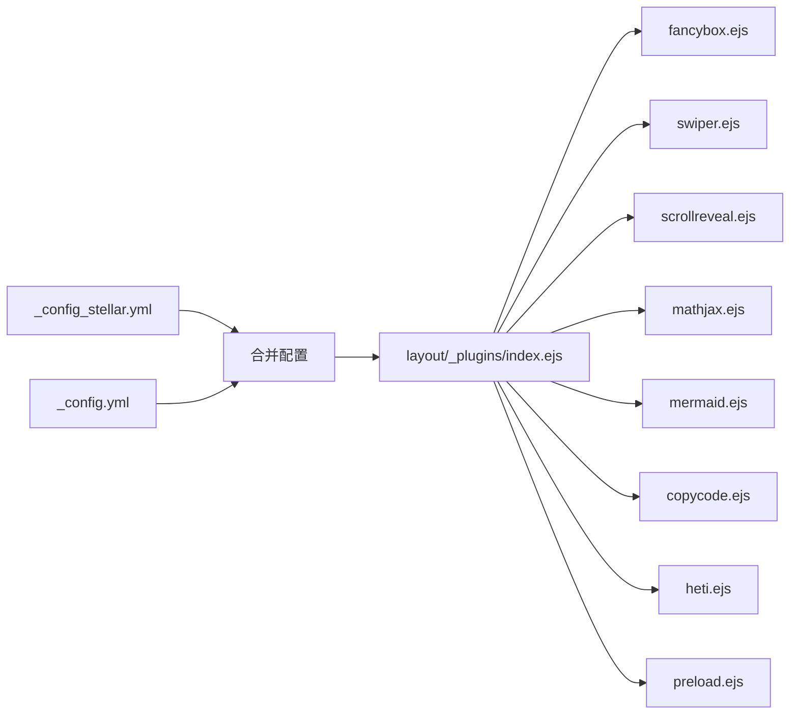

# 插件配置

<cite>
**本文引用的文件**
- [_config_stellar.yml](file://_config_stellar.yml)
- [themes/stellar/_config.yml](file://themes/stellar/_config.yml)
- [themes/stellar/layout/_plugins/index.ejs](file://themes/stellar/layout/_plugins/index.ejs)
- [themes/stellar/layout/_plugins/preload.ejs](file://themes/stellar/layout/_plugins/preload.ejs)
- [themes/stellar/layout/_plugins/fancybox.ejs](file://themes/stellar/layout/_plugins/fancybox.ejs)
- [themes/stellar/layout/_plugins/swiper.ejs](file://themes/stellar/layout/_plugins/swiper.ejs)
- [themes/stellar/layout/_plugins/scrollreveal.ejs](file://themes/stellar/layout/_plugins/scrollreveal.ejs)
- [themes/stellar/layout/_plugins/mathjax.ejs](file://themes/stellar/layout/_plugins/mathjax.ejs)
- [themes/stellar/layout/_plugins/mermaid.ejs](file://themes/stellar/layout/_plugins/mermaid.ejs)
- [themes/stellar/layout/_plugins/copycode.ejs](file://themes/stellar/layout/_plugins/copycode.ejs)
- [themes/stellar/layout/_plugins/heti.ejs](file://themes/stellar/layout/_plugins/heti.ejs)
- [themes/stellar/source/js/plugins/copycode.js](file://themes/stellar/source/js/plugins/copycode.js)
</cite>

## 目录
1. [简介](#简介)
2. [项目结构](#项目结构)
3. [核心组件](#核心组件)
4. [架构总览](#架构总览)
5. [详细组件分析](#详细组件分析)
6. [依赖关系分析](#依赖关系分析)
7. [性能考量](#性能考量)
8. [故障排查指南](#故障排查指南)
9. [结论](#结论)
10. [附录](#附录)

## 简介
本指南面向使用 Stellar 主题的 Hexo 博客作者，聚焦于主题内置插件的配置与按需加载机制。内容涵盖 Preload、Fancybox、Swiper、ScrollReveal、KaTeX、MathJax、Mermaid、CopyCode、Heti 等插件的启用方式、关键参数、资源路径与使用场景，并提供扩展插件接入方法与常见问题排查建议。

## 项目结构
Stellar 主题通过配置文件集中管理插件开关与资源路径，页面渲染时由模板引擎按需注入对应脚本与样式。插件配置位于主题根配置文件中，模板层通过统一入口按需加载。

**图表来源**
- [_config_stellar.yml](file://_config_stellar.yml#L504-L606)
- [themes/stellar/_config.yml](file://themes/stellar/_config.yml#L530-L632)
- [themes/stellar/layout/_plugins/index.ejs](file://themes/stellar/layout/_plugins/index.ejs#L1-L24)

**章节来源**
- [themes/stellar/_config.yml](file://themes/stellar/_config.yml#L530-L632)
- [themes/stellar/layout/_plugins/index.ejs](file://themes/stellar/layout/_plugins/index.ejs#L1-L24)

## 核心组件
- 插件总控与按需加载
  - 加载入口：通过统一入口模板遍历配置中的插件项，结合页面上下文合并配置，决定是否注入资源或执行初始化逻辑。
  - 注入策略：若插件配置包含注入片段则直接输出；否则加载对应插件模板，模板内部负责资源加载与初始化。
- 资源加载工具
  - 模板中通过工具方法加载 CSS/JS，支持 defer 等属性，确保在 DOMContentLoaded 或异步时机加载，避免阻塞渲染。
- 配置优先级
  - 主题默认配置与用户配置合并，页面上下文可覆盖同名字段，实现“按需启用、按需定制”。

**章节来源**
- [themes/stellar/layout/_plugins/index.ejs](file://themes/stellar/layout/_plugins/index.ejs#L1-L24)

## 架构总览
下图展示插件从配置到页面注入的整体流程：

**图表来源**
- [_config_stellar.yml](file://_config_stellar.yml#L504-L606)
- [themes/stellar/_config.yml](file://themes/stellar/_config.yml#L530-L632)
- [themes/stellar/layout/_plugins/index.ejs](file://themes/stellar/layout/_plugins/index.ejs#L1-L24)

## 详细组件分析

### Preload（预加载）
- 启用方式
  - 在插件配置中开启并选择服务（如 flying_pages）。
- 关键参数
  - enable：布尔，控制是否启用。
  - service：字符串，当前支持 flying_pages。
  - flying_pages：CDN 资源路径。
- 资源与行为
  - 模板中注入配置对象与脚本，实现页面资源的预取与延迟加载优化。
- 使用场景
  - 首屏资源加速、提升交互感知速度。

**章节来源**
- [themes/stellar/_config.yml](file://themes/stellar/_config.yml#L532-L536)
- [themes/stellar/layout/_plugins/preload.ejs](file://themes/stellar/layout/_plugins/preload.ejs#L1-L9)

### Fancybox（相册/图片灯箱）
- 启用方式
  - 在插件配置中开启 enable。
- 关键参数
  - enable：布尔。
  - js/css：外部 CDN 资源路径。
  - selector：选择器字符串，用于声明哪些图片需要绑定灯箱行为。
- 资源与行为
  - 模板检测目标元素是否存在，存在时加载 CSS/JS 并初始化，绑定选择器范围内的图片点击事件。
- 使用场景
  - Markdown 图片、评论区图片等需要放大浏览。

**章节来源**
- [themes/stellar/_config.yml](file://themes/stellar/_config.yml#L540-L548)
- [themes/stellar/layout/_plugins/fancybox.ejs](file://themes/stellar/layout/_plugins/fancybox.ejs#L1-L37)

### Swiper（轮播）
- 启用方式
  - 在插件配置中开启 enable。
- 关键参数
  - enable：布尔。
  - css/js：外部 CDN 资源路径。
- 资源与行为
  - 模板在 DOM 就绪后加载 CSS/JS，并基于特定容器与效果属性初始化轮播实例。
- 使用场景
  - 展示性内容（如作品集、横幅轮播）。

**章节来源**
- [themes/stellar/_config.yml](file://themes/stellar/_config.yml#L550-L554)
- [themes/stellar/layout/_plugins/swiper.ejs](file://themes/stellar/layout/_plugins/swiper.ejs#L1-L27)

### ScrollReveal（滚动动画）
- 启用方式
  - 在插件配置中开启 enable。
- 关键参数
  - enable：布尔。
  - js：外部 CDN 资源路径。
  - distance/duration/interval/scale：动画参数。
- 资源与行为
  - 模板异步加载脚本并在 DOM 就绪后对指定类名元素应用动画配置。
- 使用场景
  - 为段落、卡片等添加进入视口时的淡入/位移动画。

**章节来源**
- [themes/stellar/_config.yml](file://themes/stellar/_config.yml#L556-L563)
- [themes/stellar/layout/_plugins/scrollreveal.ejs](file://themes/stellar/layout/_plugins/scrollreveal.ejs#L1-L15)

### KaTeX（数学公式渲染）
- 启用方式
  - 在插件配置中开启 enable。
- 关键参数
  - enable：布尔（仅引入样式，渲染器由主题渲染器决定）。
  - inject：注入一段样式标签（CDN 路径）。
- 资源与行为
  - 通过注入样式保证公式渲染的视觉一致性；实际渲染通常由 Hexo 渲染器负责。
- 使用场景
  - 数理公式展示，配合合适的渲染器使用更佳。

**章节来源**
- [themes/stellar/_config.yml](file://themes/stellar/_config.yml#L589-L592)

### MathJax（数学公式渲染）
- 启用方式
  - 在插件配置中开启 enable；或在文章 Front Matter 中设置启用标志。
- 关键参数
  - v3：布尔，是否使用 v3。
  - enable：布尔。
  - js：外部 CDN 资源路径（v2 或 v3）。
- 资源与行为
  - 模板根据版本注入配置与脚本，v3 使用启动回调与 Promise，v2 使用配置队列。
- 使用场景
  - 复杂 LaTeX 公式渲染，需注意渲染器与配置的一致性。

**章节来源**
- [themes/stellar/_config.yml](file://themes/stellar/_config.yml#L597-L600)
- [themes/stellar/layout/_plugins/mathjax.ejs](file://themes/stellar/layout/_plugins/mathjax.ejs#L1-L50)

### Mermaid（流程图/时序图等）
- 启用方式
  - 在插件配置中开启 enable；或在文章 Front Matter 中设置启用标志。
- 关键参数
  - enable：布尔。
  - js：外部 CDN 资源路径。
  - style_optimization：布尔，是否使用主题自定义样式。
  - theme：主题风格（default/dark/forest/neutral）。
- 资源与行为
  - 模板在 DOM 就绪后初始化，根据系统主题自动选择深色/浅色风格，并设置流程图、甘特图、时序图等参数。
- 使用场景
  - 技术文档中的流程图、时序图、类图等可视化表达。

**章节来源**
- [themes/stellar/_config.yml](file://themes/stellar/_config.yml#L611-L617)
- [themes/stellar/layout/_plugins/mermaid.ejs](file://themes/stellar/layout/_plugins/mermaid.ejs#L1-L29)

### CopyCode（代码块复制）
- 启用方式
  - 在插件配置中开启 enable。
- 关键参数
  - enable：布尔。
  - default_text/success_text：按钮文案。
  - toast：成功提示文本。
- 资源与行为
  - 模板在 DOM 就绪后检测代码块元素，注入本地脚本；脚本创建复制按钮并处理剪贴板 API 调用与提示反馈。
- 使用场景
  - 提升读者复制代码的便捷性。

**章节来源**
- [themes/stellar/_config.yml](file://themes/stellar/_config.yml#L620-L624)
- [themes/stellar/layout/_plugins/copycode.ejs](file://themes/stellar/layout/_plugins/copycode.ejs#L1-L13)
- [themes/stellar/source/js/plugins/copycode.js](file://themes/stellar/source/js/plugins/copycode.js#L1-L32)

### Heti（中文排版增强）
- 启用方式
  - 在插件配置中开启 enable。
- 关键参数
  - enable：布尔（谨慎启用，可能与代码块样式冲突）。
  - css/js：外部 CDN 资源路径。
- 资源与行为
  - 模板加载样式与脚本后，对指定容器执行排版增强逻辑。
- 使用场景
  - 纯中文内容站点的排版优化。

**章节来源**
- [themes/stellar/_config.yml](file://themes/stellar/_config.yml#L628-L631)
- [themes/stellar/layout/_plugins/heti.ejs](file://themes/stellar/layout/_plugins/heti.ejs#L1-L21)

### 扩展插件接入方法
- 接入步骤
  - 在插件配置中新增插件项并设置 enable 字段。
  - 在模板目录新建对应插件名的 EJS 文件，使用工具方法加载 CSS/JS，并在模板中编写初始化逻辑。
  - 若仅需引入外部资源，可在配置中增加注入片段，无需创建 EJS 文件。
- 参考
  - 主题提供了扩展插件接入的说明与示例路径。

**章节来源**
- [_config_stellar.yml](file://_config_stellar.yml#L497-L503)
- [themes/stellar/_config.yml](file://themes/stellar/_config.yml#L523-L530)

## 依赖关系分析
- 配置层
  - 用户配置与主题默认配置合并，形成最终生效的插件清单。
- 模板层
  - 加载入口统一调度，按需渲染各插件模板。
- 资源层
  - 外部 CDN 与本地资源（如 copycode 的本地脚本）协同工作，避免重复加载与命名冲突。

**图表来源**
- [_config_stellar.yml](file://_config_stellar.yml#L504-L606)
- [themes/stellar/_config.yml](file://themes/stellar/_config.yml#L530-L632)
- [themes/stellar/layout/_plugins/index.ejs](file://themes/stellar/layout/_plugins/index.ejs#L1-L24)

**章节来源**
- [themes/stellar/layout/_plugins/index.ejs](file://themes/stellar/layout/_plugins/index.ejs#L1-L24)

## 性能考量
- 按需加载
  - 插件仅在启用或页面存在目标元素时加载，避免不必要的资源消耗。
- 资源优化
  - 使用 defer 异步加载与 CDN 资源，降低首屏阻塞。
- 动画与交互
  - ScrollReveal 等插件需谨慎使用，避免在低端设备上造成卡顿。
- 代码复制
  - 本地脚本仅在存在代码块时加载，减少全局负担。

[本节为通用指导，不直接分析具体文件]

## 故障排查指南
- 插件未生效
  - 检查插件配置的 enable 字段是否正确设置。
  - 确认页面上下文未覆盖为禁用状态。
- 资源加载失败
  - 核对 CDN 资源路径是否可用，必要时更换镜像或使用本地资源。
- 样式冲突
  - 如启用 Heti，注意与代码块样式的潜在冲突；可尝试关闭或调整顺序。
- 功能异常
  - CopyCode：检查剪贴板 API 权限与 HTTPS 环境要求；查看提示文案与按钮状态。
  - Mermaid：确认文章 Front Matter 中已启用并正确书写图表语法。
  - MathJax：确保渲染器与配置一致，避免版本混用导致的兼容问题。

**章节来源**
- [themes/stellar/layout/_plugins/copycode.ejs](file://themes/stellar/layout/_plugins/copycode.ejs#L1-L13)
- [themes/stellar/source/js/plugins/copycode.js](file://themes/stellar/source/js/plugins/copycode.js#L1-L32)
- [themes/stellar/layout/_plugins/mermaid.ejs](file://themes/stellar/layout/_plugins/mermaid.ejs#L1-L29)
- [themes/stellar/layout/_plugins/mathjax.ejs](file://themes/stellar/layout/_plugins/mathjax.ejs#L1-L50)

## 结论
Stellar 主题通过集中配置与模板按需加载机制，实现了对多种前端插件的灵活集成。合理启用与配置插件，可在不牺牲性能的前提下显著提升内容表现力与用户体验。建议根据站点定位与受众特征选择合适的功能组合，并在上线前进行充分测试与资源校验。

[本节为总结性内容，不直接分析具体文件]

## 附录
- 常用配置要点速查
  - 启用/禁用：enable 字段。
  - 资源路径：js/css/inject。
  - 选择器/参数：如 Fancybox 的 selector、ScrollReveal 的动画参数。
- 建议实践
  - 逐步启用插件，观察首屏性能变化。
  - 使用 CDN 时关注可用性与回退策略。
  - 对于复杂交互（如 Mermaid、MathJax），提前准备渲染器与语法规范。

[本节为补充性内容，不直接分析具体文件]