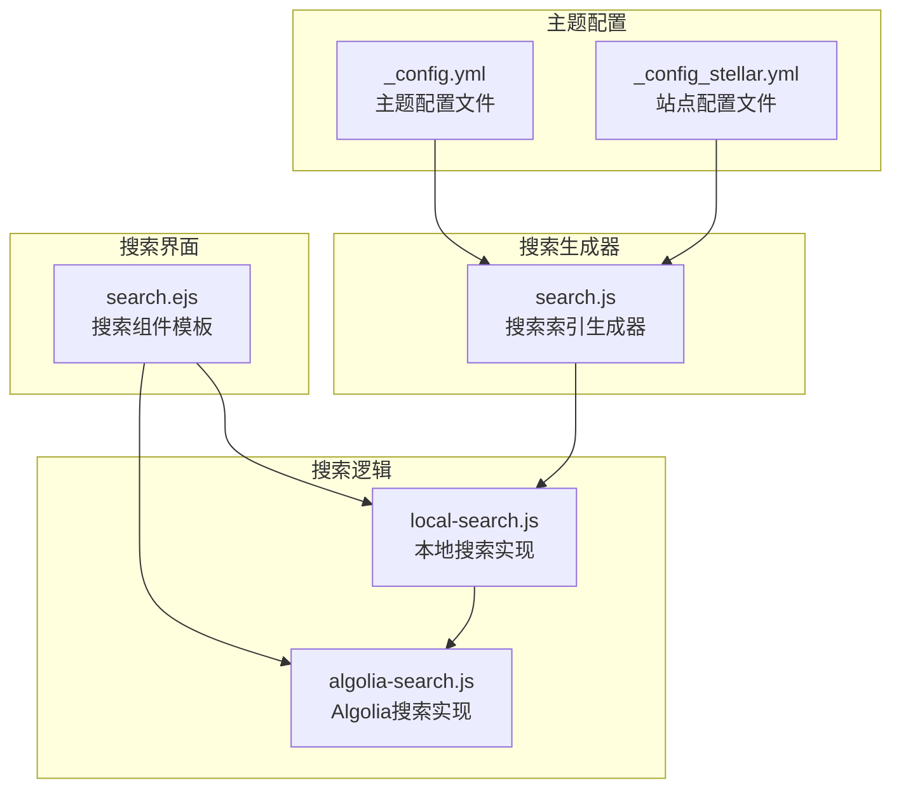
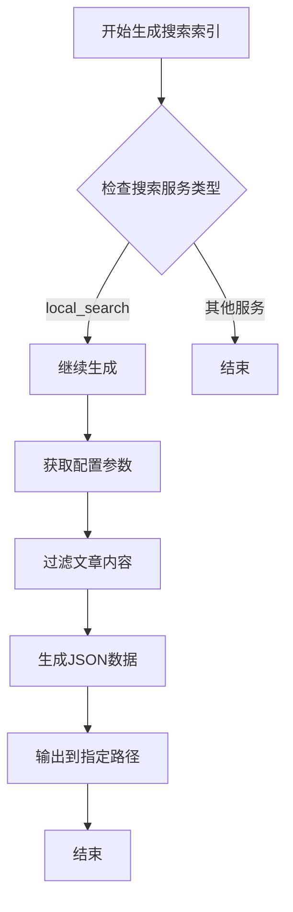
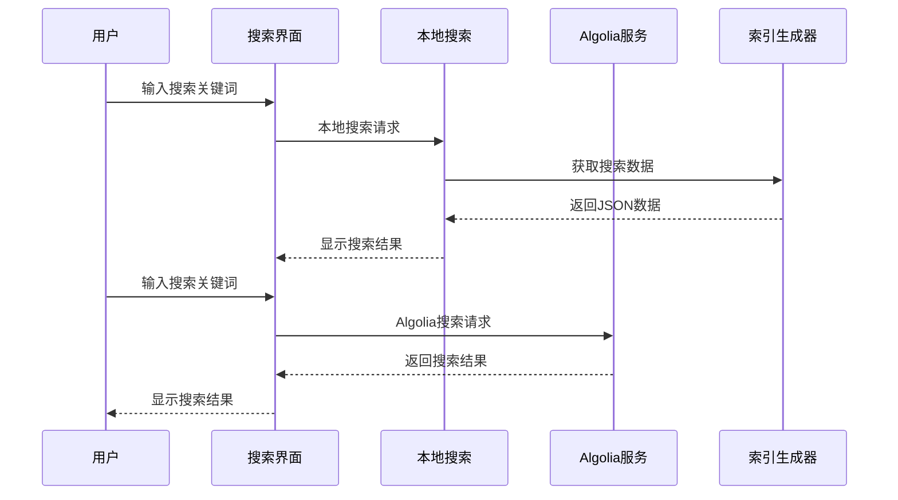
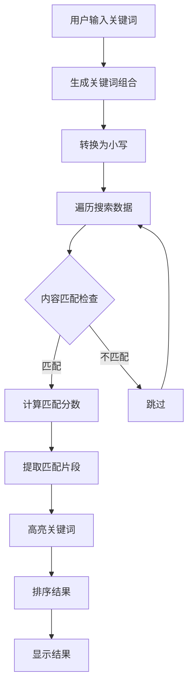
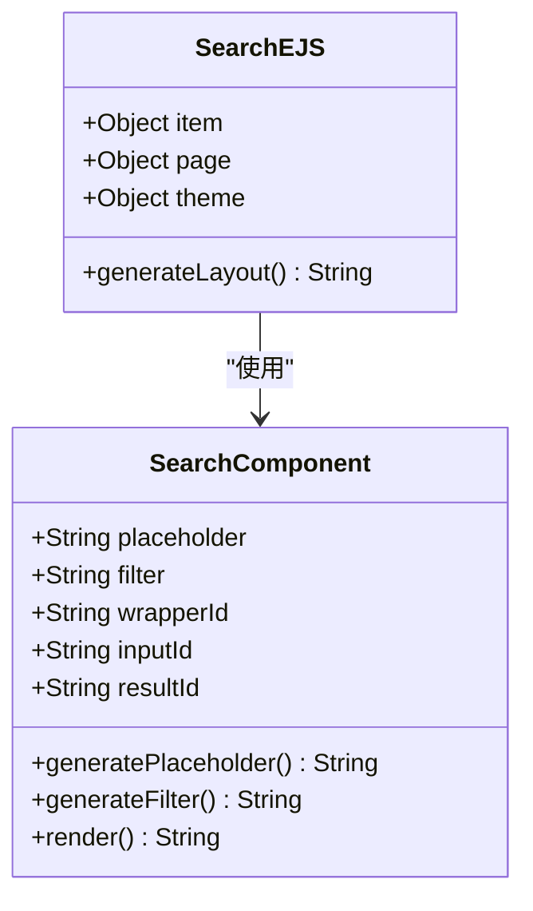
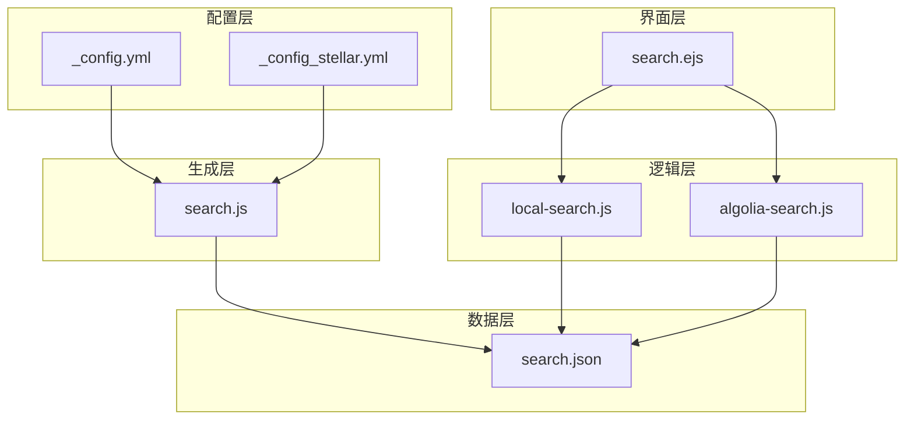

# 搜索功能配置

<cite>
**本文档引用的文件**
- [themes/stellar/_config.yml](file://themes/stellar/_config.yml)
- [themes/stellar/scripts/generators/search.js](file://themes/stellar/scripts/generators/search.js)
- [themes/stellar/layout/_partial/sidebar/search.ejs](file://themes/stellar/layout/_partial/sidebar/search.ejs)
- [themes/stellar/source/js/search/local-search.js](file://themes/stellar/source/js/search/local-search.js)
- [themes/stellar/source/js/search/algolia-search.js](file://themes/stellar/source/js/search/algolia-search.js)
- [_config_stellar.yml](file://_config_stellar.yml)
</cite>

## 目录
1. [简介](#简介)
2. [项目结构](#项目结构)
3. [核心组件](#核心组件)
4. [架构概览](#架构概览)
5. [详细组件分析](#详细组件分析)
6. [依赖关系分析](#依赖关系分析)
7. [性能考虑](#性能考虑)
8. [故障排除指南](#故障排除指南)
9. [结论](#结论)

## 简介

本文档提供了H1S97X博客基于Stellar主题的搜索功能完整配置指南。Stellar主题提供了两种搜索服务：本地搜索和Algolia搜索，能够满足不同规模博客的需求。

本地搜索通过预生成JSON索引文件实现，无需第三方服务，适合中小型博客。Algolia搜索则提供云端搜索服务，支持更强大的搜索功能和更好的用户体验，适合大型博客或需要高级搜索功能的场景。

## 项目结构

H1S97X博客的搜索功能主要分布在以下几个关键位置：

**图表来源**
- [themes/stellar/_config.yml](file://themes/stellar/_config.yml#L206-L218)
- [themes/stellar/scripts/generators/search.js](file://themes/stellar/scripts/generators/search.js#L1-L101)
- [themes/stellar/layout/_partial/sidebar/search.ejs](file://themes/stellar/layout/_partial/sidebar/search.ejs#L1-L55)

**章节来源**
- [themes/stellar/_config.yml](file://themes/stellar/_config.yml#L206-L218)
- [themes/stellar/scripts/generators/search.js](file://themes/stellar/scripts/generators/search.js#L1-L101)

## 核心组件

### 搜索配置结构

Stellar主题的搜索配置位于主题配置文件中，包含以下关键参数：

#### 本地搜索配置
- **service**: 设置为 `local_search` 启用本地搜索
- **field**: 搜索范围，可选值：`post`、`page`、`all`
- **path**: 搜索JSON文件的生成路径，默认 `/search.json`
- **content**: 是否搜索文章内容，默认 `true`
- **skip_search**: 排除搜索的路径模式数组

#### Algolia搜索配置
- **appId**: Algolia应用ID
- **apiKey**: Algolia API密钥
- **indexName**: 索引名称
- **js**: Algolia JavaScript SDK地址

**章节来源**
- [themes/stellar/_config.yml](file://themes/stellar/_config.yml#L206-L218)
- [_config_stellar.yml](file://_config_stellar.yml#L175-L188)

### 搜索索引生成器

搜索索引生成器负责从博客内容中提取数据并生成JSON格式的搜索索引：

**图表来源**
- [themes/stellar/scripts/generators/search.js](file://themes/stellar/scripts/generators/search.js#L6-L100)

**章节来源**
- [themes/stellar/scripts/generators/search.js](file://themes/stellar/scripts/generators/search.js#L1-L101)

## 架构概览

Stellar主题的搜索系统采用前后端分离的设计模式：

**图表来源**
- [themes/stellar/layout/_partial/sidebar/search.ejs](file://themes/stellar/layout/_partial/sidebar/search.ejs#L14-L52)
- [themes/stellar/source/js/search/local-search.js](file://themes/stellar/source/js/search/local-search.js#L4-L128)
- [themes/stellar/source/js/search/algolia-search.js](file://themes/stellar/source/js/search/algolia-search.js#L1-L78)

## 详细组件分析

### 本地搜索实现

本地搜索是Stellar主题的核心搜索功能，完全基于浏览器端JavaScript实现：

#### 搜索算法流程

**图表来源**
- [themes/stellar/source/js/search/local-search.js](file://themes/stellar/source/js/search/local-search.js#L6-L115)

#### 性能优化机制

本地搜索实现了多项性能优化措施：

1. **缓存机制**: 使用localStorage缓存搜索数据，避免重复加载
2. **延迟初始化**: 搜索数据异步加载，不影响页面初始渲染
3. **智能过滤**: 支持路径过滤，提高搜索精度
4. **结果缓存**: 搜索结果在一定时间内缓存

**章节来源**
- [themes/stellar/source/js/search/local-search.js](file://themes/stellar/source/js/search/local-search.js#L1-L184)

### Algolia搜索实现

Algolia搜索提供云端搜索服务，支持更强大的搜索功能：

#### 搜索配置参数

| 参数名 | 类型 | 必需 | 描述 |
|--------|------|------|------|
| appId | String | 是 | Algolia应用ID |
| apiKey | String | 是 | Algolia API密钥 |
| indexName | String | 是 | 搜索索引名称 |
| js | String | 否 | JavaScript SDK地址 |

#### 搜索功能特性

1. **全文搜索**: 支持全文内容搜索
2. **高亮显示**: 自动高亮匹配关键词
3. **结果过滤**: 支持路径过滤和结果限制
4. **实时搜索**: 云端实时搜索服务

**章节来源**
- [themes/stellar/source/js/search/algolia-search.js](file://themes/stellar/source/js/search/algolia-search.js#L1-L78)

### 搜索界面组件

搜索界面组件提供了用户交互界面和搜索功能集成：

#### 搜索组件结构

**图表来源**
- [themes/stellar/layout/_partial/sidebar/search.ejs](file://themes/stellar/layout/_partial/sidebar/search.ejs#L14-L52)

**章节来源**
- [themes/stellar/layout/_partial/sidebar/search.ejs](file://themes/stellar/layout/_partial/sidebar/search.ejs#L1-L55)

## 依赖关系分析

搜索功能涉及多个组件之间的复杂依赖关系：

**图表来源**
- [themes/stellar/_config.yml](file://themes/stellar/_config.yml#L206-L218)
- [themes/stellar/scripts/generators/search.js](file://themes/stellar/scripts/generators/search.js#L96-L99)

**章节来源**
- [themes/stellar/_config.yml](file://themes/stellar/_config.yml#L206-L218)
- [themes/stellar/scripts/generators/search.js](file://themes/stellar/scripts/generators/search.js#L1-L101)

## 性能考虑

### 本地搜索性能优化

1. **数据预加载**: 搜索数据在页面加载时异步预加载
2. **缓存策略**: 使用localStorage缓存搜索数据
3. **智能分词**: 支持关键词组合搜索，提高搜索准确性
4. **结果排序**: 基于匹配度排序搜索结果

### Algolia搜索性能优势

1. **云端处理**: 搜索负载在云端处理，减轻服务器压力
2. **CDN加速**: 通过CDN分发搜索数据
3. **实时索引**: 支持实时索引更新
4. **智能缓存**: 云端智能缓存机制

## 故障排除指南

### 常见问题及解决方案

#### 搜索功能无法正常工作

1. **检查配置文件**: 确认搜索配置正确设置
2. **验证索引文件**: 检查search.json文件是否正确生成
3. **浏览器兼容性**: 确认浏览器支持相关JavaScript功能

#### 搜索结果不准确

1. **调整搜索范围**: 修改field参数限制搜索范围
2. **添加排除规则**: 使用skip_search排除不需要的页面
3. **优化关键词**: 提供更精确的搜索关键词

#### 性能问题

1. **启用缓存**: 确保localStorage缓存正常工作
2. **减少索引大小**: 限制搜索内容范围
3. **优化CSS样式**: 减少DOM操作对性能的影响

**章节来源**
- [themes/stellar/source/js/search/local-search.js](file://themes/stellar/source/js/search/local-search.js#L130-L184)

## 结论

H1S97X博客的Stellar主题搜索功能提供了完整的本地和云端搜索解决方案。通过合理的配置和优化，可以为用户提供优秀的搜索体验。

对于小型博客，建议使用本地搜索，因为它简单易用且无需额外费用。对于大型博客或需要高级搜索功能的场景，建议使用Algolia搜索，它提供了更强大的搜索能力和更好的用户体验。

通过本文档提供的配置指南和最佳实践，用户可以根据自己的需求选择合适的搜索方案，并进行相应的优化配置。