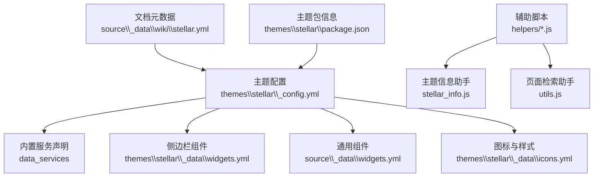
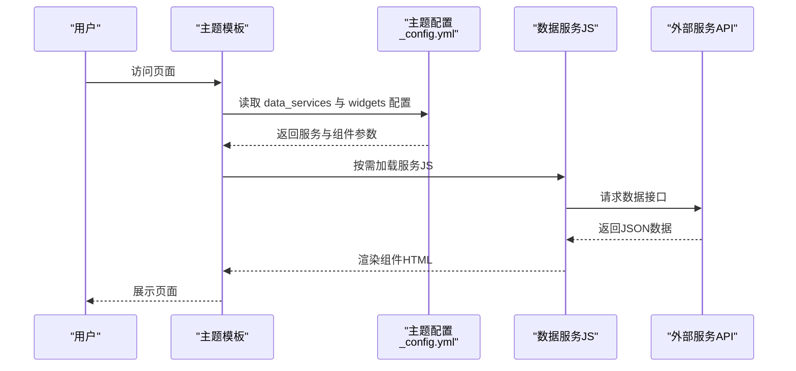
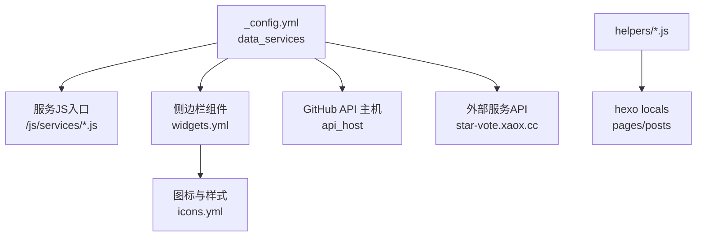

# 服务配置

<cite>
**本文引用的文件**
- [themes\stellar\_config.yml](file://themes\stellar\_config.yml)
- [themes\stellar\scripts\helpers\stellar_info.js](file://themes\stellar\scripts\helpers\stellar_info.js)
- [themes\stellar\scripts\helpers\utils.js](file://themes\stellar\scripts\helpers\utils.js)
- [themes\stellar\package.json](file://themes\stellar\package.json)
- [source\_data\widgets.yml](file://source\_data\widgets.yml)
- [themes\stellar\_data\widgets.yml](file://themes\stellar\_data\widgets.yml)
- [themes\stellar\_data\icons.yml](file://themes\stellar\_data\icons.yml)
- [source\_data\wiki\stellar.yml](file://source\_data\wiki\stellar.yml)
</cite>

## 目录
1. [简介](#简介)
2. [项目结构](#项目结构)
3. [核心组件](#核心组件)
4. [架构概览](#架构概览)
5. [详细组件分析](#详细组件分析)
6. [依赖关系分析](#依赖关系分析)
7. [性能考虑](#性能考虑)
8. [故障排查指南](#故障排查指南)
9. [结论](#结论)
10. [附录](#附录)

## 简介
本指南聚焦于 H1S97X 博客在使用 Stellar 主题时的数据服务配置，涵盖 GitHub 信息、评分系统、投票系统、站点信息、友链、时间线等服务的设置与接入方法。文档基于仓库中的配置文件与脚本，提供服务地址、数据接口、显示样式、自动加载机制及自定义扩展的接入路径，帮助用户快速集成所需的数据服务功能。

## 项目结构
围绕服务配置的关键文件分布如下：
- 主题配置：themes\stellar\_config.yml
- 侧边栏组件与数据：themes\stellar\_data\widgets.yml、source\_data\widgets.yml
- 图标与样式：themes\stellar\_data\icons.yml
- 文档元数据：source\_data\wiki\stellar.yml
- 辅助脚本：themes\stellar\scripts\helpers\stellar_info.js、themes\stellar\scripts\helpers\utils.js
- 主题包信息：themes\stellar\package.json

**图表来源**
- [themes\stellar\_config.yml](file://themes\stellar\_config.yml#L464-L521)
- [themes\stellar\_data\widgets.yml](file://themes\stellar\_data\widgets.yml#L1-L85)
- [source\_data\widgets.yml](file://source\_data\widgets.yml#L1-L10)
- [themes\stellar\_data\icons.yml](file://themes\stellar\_data\icons.yml#L1-L59)
- [themes\stellar\scripts\helpers\stellar_info.js](file://themes\stellar\scripts\helpers\stellar_info.js#L1-L22)
- [themes\stellar\scripts\helpers\utils.js](file://themes\stellar\scripts\helpers\utils.js#L1-L21)
- [source\_data\wiki\stellar.yml](file://source\_data\wiki\stellar.yml#L1-L10)
- [themes\stellar\package.json](file://themes\stellar\package.json#L1-L33)

**章节来源**
- [themes\stellar\_config.yml](file://themes\stellar\_config.yml#L1-L725)
- [themes\stellar\_data\widgets.yml](file://themes\stellar\_data\widgets.yml#L1-L85)
- [source\_data\widgets.yml](file://source\_data\widgets.yml#L1-L10)
- [themes\stellar\_data\icons.yml](file://themes\stellar\_data\icons.yml#L1-L59)
- [themes\stellar\scripts\helpers\stellar_info.js](file://themes\stellar\scripts\helpers\stellar_info.js#L1-L22)
- [themes\stellar\scripts\helpers\utils.js](file://themes\stellar\scripts\helpers\utils.js#L1-L21)
- [source\_data\wiki\stellar.yml](file://source\_data\wiki\stellar.yml#L1-L10)
- [themes\stellar\package.json](file://themes\stellar\package.json#L1-L33)

## 核心组件
- 数据服务总览：data_services 下声明了各服务的 JS 入口与 API 地址，支持按需自动加载。
- 侧边栏组件：widgets.yml 提供 recent、timeline、latest_comment 等组件的布局与参数。
- 图标与样式：icons.yml 提供 SVG 图标与默认样式键值，便于统一风格。
- 辅助脚本：stellar_info.js 提供主题信息查询，utils.js 提供页面检索。

**章节来源**
- [themes\stellar\_config.yml](file://themes\stellar\_config.yml#L464-L521)
- [themes\stellar\_data\widgets.yml](file://themes\stellar\_data\widgets.yml#L19-L84)
- [themes\stellar\_data\icons.yml](file://themes\stellar\_data\icons.yml#L1-L59)
- [themes\stellar\scripts\helpers\stellar_info.js](file://themes\stellar\scripts\helpers\stellar_info.js#L1-L22)
- [themes\stellar\scripts\helpers\utils.js](file://themes\stellar\scripts\helpers\utils.js#L1-L21)

## 架构概览
Stellar 主题通过配置文件集中声明数据服务与侧边栏组件，运行时按需加载对应 JS 并调用相应 API 获取数据，最终在页面中渲染展示。

**图表来源**
- [themes\stellar\_config.yml](file://themes\stellar\_config.yml#L464-L521)
- [themes\stellar\_data\widgets.yml](file://themes\stellar\_data\widgets.yml#L19-L84)

## 详细组件分析

### GitHub 信息（ghinfo）
- 用途：展示仓库信息、README 卡片等。
- 配置要点：
  - JS 入口：/js/services/ghinfo.js
  - API 主机：见 api_host 下的 ghapi、ghraw、gist、ghcard
- 使用建议：
  - 在文章或侧边栏组件中引用 ghrepo、ghissues 等布局组件。
  - 通过 widgets.yml 配置 ghrepo、ghissues 的显示数量与过滤条件。

**章节来源**
- [themes\stellar\_config.yml](file://themes\stellar\_config.yml#L474-L475)
- [themes\stellar\_config.yml](file://themes\stellar\_config.yml#L713-L717)
- [themes\stellar\_data\widgets.yml](file://themes\stellar\_data\widgets.yml#L6-L16)

### 评分系统（rating）
- 用途：对内容进行评分。
- 配置要点：
  - JS 入口：/js/services/rating.js
  - API：https://star-vote.xaox.cc/api/rating
- 使用建议：
  - 在文章或页面中启用评分组件，确保前端 JS 能正常加载。
  - 通过主题配置中的 data_services 项确认服务已启用。

**章节来源**
- [themes\stellar\_config.yml](file://themes\stellar\_config.yml#L477-L479)

### 投票系统（vote）
- 用途：对内容进行投票。
- 配置要点：
  - JS 入口：/js/services/vote.js
  - API：https://star-vote.xaox.cc/api/vote
- 使用建议：
  - 在需要互动的页面启用投票组件。
  - 确认前端 JS 与后端 API 的连通性。

**章节来源**
- [themes\stellar\_config.yml](file://themes\stellar\_config.yml#L481-L483)

### 站点信息（siteinfo）
- 用途：自动提取网页标题、图标等信息。
- 配置要点：
  - JS 入口：/js/services/siteinfo.js
  - API：可在配置中设置自定义服务地址（如 https://api.xaox.cc/site_info/v1?url={href}）
- 使用建议：
  - 在需要抓取外部链接元信息的场景启用。
  - 配置完成后，前端将自动调用 API 并渲染结果。

**章节来源**
- [themes\stellar\_config.yml](file://themes\stellar\_config.yml#L469-L473)

### 友链（friends / friends_and_posts）
- 用途：展示友链与友链文章。
- 配置要点：
  - JS 入口：/js/services/friends.js、/js/services/friends_and_posts.js
- 使用建议：
  - 在侧边栏组件中添加 friends 或 friends_and_posts。
  - 通过 widgets.yml 配置显示数量与样式。

**章节来源**
- [themes\stellar\_config.yml](file://themes\stellar\_config.yml#L488-L490)
- [themes\stellar\_data\widgets.yml](file://themes\stellar\_data\widgets.yml#L1-L85)

### 时间线（timeline）
- 用途：展示动态时间线。
- 配置要点：
  - JS 入口：/js/services/timeline.js
  - API：可指向 GitHub Issues 等数据源
  - 支持按用户过滤与数量限制
- 使用建议：
  - 在作者页或侧边栏启用 timeline 组件。
  - 通过 widgets.yml 设置 api、user、limit 等参数。

**章节来源**
- [themes\stellar\_config.yml](file://themes\stellar\_config.yml#L492-L493)
- [themes\stellar\_data\widgets.yml](file://themes\stellar\_data\widgets.yml#L66-L71)

### 最新评论（latest_comment）
- 用途：展示来自评论服务的最新评论。
- 配置要点：
  - JS 入口：twikoo_latest_comment.js、waline_latest_comment.js、artalk_latest_comment.js、giscus_latest_comment.js
  - 类型：twikoo、waline、artalk、giscus
  - API：各服务提供的接口地址
- 使用建议：
  - 在侧边栏组件中启用 latest_comment。
  - 通过 widgets.yml 设置 api、type、limit 等参数。

**章节来源**
- [themes\stellar\_config.yml](file://themes\stellar\_config.yml#L508-L515)
- [themes\stellar\_data\widgets.yml](file://themes\stellar\_data\widgets.yml#L73-L78)

### 网格布局（sites）
- 用途：以网格形式展示站点或内容集合。
- 配置要点：
  - JS 入口：/js/services/sites.js
- 使用建议：
  - 在需要以网格展示的页面启用该服务。
  - 通过 widgets.yml 配置布局与样式。

**章节来源**
- [themes\stellar\_config.yml](file://themes\stellar\_config.yml#L485-L486)

### 列表布局（weibo、memos、fcircle）
- 用途：展示微博、备忘录、朋友圈等列表数据。
- 配置要点：
  - JS 入口：/js/services/weibo.js、/js/services/memos.js、/js/services/fcircle.js
- 使用建议：
  - 在侧边栏或页面中启用对应组件。
  - 通过 widgets.yml 配置显示数量与样式。

**章节来源**
- [themes\stellar\_config.yml](file://themes\stellar\_config.yml#L496-L499)

### 贡献者（contributors）
- 用途：展示贡献者信息与“编辑本文”链接。
- 配置要点：
  - JS 入口：/js/services/contributors.js
  - 编辑链接映射：支持将本地路径替换为 GitHub 源码链接
- 使用建议：
  - 在文章或页面中启用 contributors 组件。
  - 通过 widgets.yml 配置 edit_this_page 的替换规则。

**章节来源**
- [themes\stellar\_config.yml](file://themes\stellar\_config.yml#L516-L520)
- [themes\stellar\_data\widgets.yml](file://themes\stellar\_data\widgets.yml#L36-L38)

### 自动加载机制与自定义服务接入
- 自动加载：
  - data_services 中声明的服务会在页面中用到时按需加载，未用到则不加载，降低首屏负担。
- 自定义服务接入：
  - 在 data_services 下新增服务配置（至少包含 enable 字段），并在 layout/_plugins/ 下创建对应 EJS 文件以注入资源。
  - 若仅需引入外部文件，可在配置中增加 inject 字段，无需创建 EJS 文件。
- 示例路径：
  - 服务 JS：/js/services/<service>.js
  - 插件 EJS：layout/_plugins/<plugin>.ejs
  - 本地 JS：/source/js/plugins/<plugin>.js

**章节来源**
- [themes\stellar\_config.yml](file://themes\stellar\_config.yml#L523-L529)

### 辅助脚本与主题信息
- stellar_info.js：提供主题名称、版本、仓库链接、Wiki 链接等信息，便于在模板中引用。
- utils.js：提供页面检索能力，可用于定位页面或文章对象。

**章节来源**
- [themes\stellar\scripts\helpers\stellar_info.js](file://themes\stellar\scripts\helpers\stellar_info.js#L1-L22)
- [themes\stellar\scripts\helpers\utils.js](file://themes\stellar\scripts\helpers\utils.js#L1-L21)
- [themes\stellar\package.json](file://themes\stellar\package.json#L1-L33)

## 依赖关系分析
- 主题配置依赖：
  - data_services 依赖 JS 入口与外部 API
  - widgets.yml 依赖侧边栏布局与图标样式
  - helpers 依赖 hexo 本地数据（pages、posts）
- 外部依赖：
  - GitHub API 主机（ghapi、ghraw、gist、ghcard）
  - 评分/投票服务 API（star-vote.xaox.cc）

**图表来源**
- [themes\stellar\_config.yml](file://themes\stellar\_config.yml#L464-L521)
- [themes\stellar\_data\widgets.yml](file://themes\stellar\_data\widgets.yml#L1-L85)
- [themes\stellar\_data\icons.yml](file://themes\stellar\_data\icons.yml#L1-L59)
- [themes\stellar\scripts\helpers\stellar_info.js](file://themes\stellar\scripts\helpers\stellar_info.js#L1-L22)
- [themes\stellar\scripts\helpers\utils.js](file://themes\stellar\scripts\helpers\utils.js#L1-L21)
- [themes\stellar\_config.yml](file://themes\stellar\_config.yml#L713-L717)

**章节来源**
- [themes\stellar\_config.yml](file://themes\stellar\_config.yml#L464-L521)
- [themes\stellar\_data\widgets.yml](file://themes\stellar\_data\widgets.yml#L1-L85)
- [themes\stellar\_data\icons.yml](file://themes\stellar\_data\icons.yml#L1-L59)
- [themes\stellar\scripts\helpers\stellar_info.js](file://themes\stellar\scripts\helpers\stellar_info.js#L1-L22)
- [themes\stellar\scripts\helpers\utils.js](file://themes\stellar\scripts\helpers\utils.js#L1-L21)
- [themes\stellar\_config.yml](file://themes\stellar\_config.yml#L713-L717)

## 性能考虑
- 按需加载：data_services 中的服务仅在页面使用时加载，有助于减少初始资源消耗。
- 外部 API：评分/投票与站点信息等服务依赖外部接口，需关注网络延迟与可用性。
- 图标与样式：icons.yml 中的 SVG 图标可减少额外资源请求，提升渲染效率。
- 侧边栏组件：合理设置 recent、timeline 等组件的数量与样式，避免过度渲染。

[本节为通用指导，无需列出具体文件来源]

## 故障排查指南
- 服务未加载：
  - 检查 data_services 中对应服务的启用状态与 JS 入口路径。
  - 确认页面中确实使用了该组件。
- 外部 API 无法访问：
  - 校验 API 地址与网络连通性。
  - 对于评分/投票服务，确认服务端可用性。
- 侧边栏组件显示异常：
  - 检查 widgets.yml 中的布局与参数配置。
  - 确认图标键值在 icons.yml 中存在。
- 页面检索失败：
  - 使用 utils.js 的 get_page 辅助函数定位页面或文章对象。

**章节来源**
- [themes\stellar\_config.yml](file://themes\stellar\_config.yml#L464-L521)
- [themes\stellar\_data\widgets.yml](file://themes\stellar\_data\widgets.yml#L19-L84)
- [themes\stellar\_data\icons.yml](file://themes\stellar\_data\icons.yml#L1-L59)
- [themes\stellar\scripts\helpers\utils.js](file://themes\stellar\scripts\helpers\utils.js#L1-L21)

## 结论
通过集中配置 data_services、widgets.yml 与 icons.yml，Stellar 主题实现了灵活的数据服务集成与按需加载机制。结合 helpers 脚本与外部 API，用户可以快速启用 GitHub 信息、评分/投票、站点信息、友链、时间线等服务，并通过自定义扩展接入更多第三方能力。建议在生产环境中关注外部 API 的稳定性与性能表现，合理配置组件数量与样式，以获得最佳用户体验。

[本节为总结性内容，无需列出具体文件来源]

## 附录
- 文档元数据：source\_data\wiki\stellar.yml 提供主题名称、标题、图标、封面、描述、仓库、主页等信息，便于在页面中引用。
- 主题包信息：themes\stellar\package.json 提供主题版本、仓库地址等元信息，便于在模板中展示。

**章节来源**
- [source\_data\wiki\stellar.yml](file://source\_data\wiki\stellar.yml#L1-L10)
- [themes\stellar\package.json](file://themes\stellar\package.json#L1-L33)