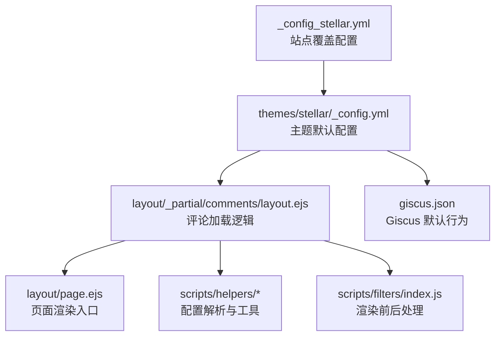
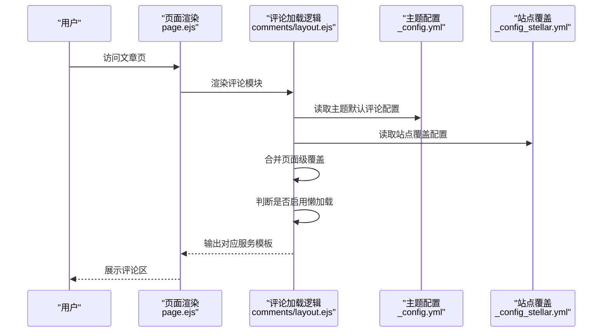
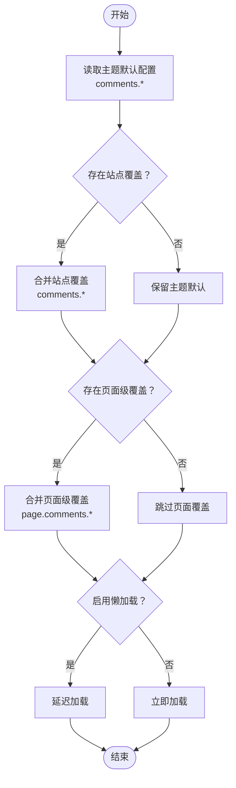
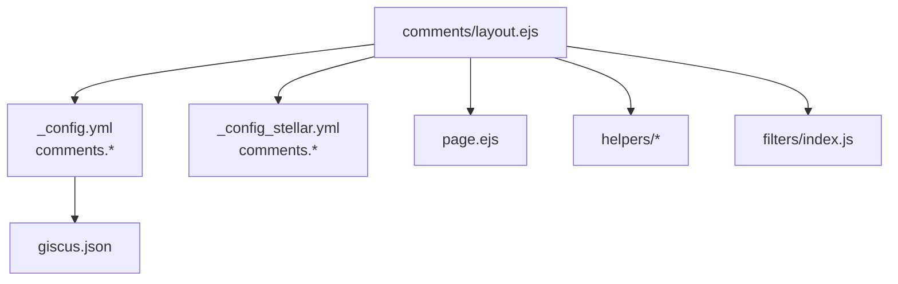

# 评论系统配置

<cite>
**本文引用的文件**
- [themes/stellar/_config.yml](file://themes/stellar/_config.yml)
- [_config_stellar.yml](file://_config_stellar.yml)
- [themes/stellar/layout/_partial/comments/layout.ejs](file://themes/stellar/layout/_partial/comments/layout.ejs)
- [themes/stellar/layout/page.ejs](file://themes/stellar/layout/page.ejs)
- [themes/stellar/scripts/helpers/parse_config.js](file://themes/stellar/scripts/helpers/parse_config.js)
- [themes/stellar/scripts/helpers/utils.js](file://themes/stellar/scripts/helpers/utils.js)
- [themes/stellar/scripts/filters/index.js](file://themes/stellar/scripts/filters/index.js)
- [themes/stellar/giscus.json](file://themes/stellar/giscus.json)
</cite>

## 目录
1. [简介](#简介)
2. [项目结构](#项目结构)
3. [核心组件](#核心组件)
4. [架构总览](#架构总览)
5. [详细组件分析](#详细组件分析)
6. [依赖关系分析](#依赖关系分析)
7. [性能考量](#性能考量)
8. [故障排查指南](#故障排查指南)
9. [结论](#结论)
10. [附录](#附录)

## 简介
本指南面向使用 H1S97X 博客（基于 Hexo + Stellar 主题）的用户，系统讲解如何在 Stellar 主题中启用与配置多种评论系统：Beaudar、Utterances、Giscus、Twikoo、Waline、Artalk。内容涵盖：
- 各评论系统的配置参数与作用
- 主题配置与页面级覆盖机制
- 评论系统的启用方式与懒加载策略
- 不同评论系统的设置步骤与示例要点
- 常见问题与优化建议

## 项目结构
与评论系统相关的关键位置如下：
- 主题配置：themes/stellar/_config.yml
- 站点级覆盖配置：_config_stellar.yml
- 评论模块模板：themes/stellar/layout/_partial/comments/layout.ejs
- 页面渲染入口：themes/stellar/layout/page.ejs
- 辅助工具与过滤器：helpers 与 filters
- Giscus 默认行为：themes/stellar/giscus.json

**图表来源**
- [themes/stellar/_config.yml](file://themes/stellar/_config.yml#L220-L330)
- [_config_stellar.yml](file://_config_stellar.yml#L191-L233)
- [themes/stellar/layout/_partial/comments/layout.ejs](file://themes/stellar/layout/_partial/comments/layout.ejs#L1-L48)
- [themes/stellar/layout/page.ejs](file://themes/stellar/layout/page.ejs#L63-L64)
- [themes/stellar/scripts/helpers/parse_config.js](file://themes/stellar/scripts/helpers/parse_config.js#L1-L43)
- [themes/stellar/scripts/filters/index.js](file://themes/stellar/scripts/filters/index.js#L1-L31)
- [themes/stellar/giscus.json](file://themes/stellar/giscus.json#L1-L4)

**章节来源**
- [themes/stellar/_config.yml](file://themes/stellar/_config.yml#L220-L330)
- [_config_stellar.yml](file://_config_stellar.yml#L191-L233)
- [themes/stellar/layout/_partial/comments/layout.ejs](file://themes/stellar/layout/_partial/comments/layout.ejs#L1-L48)
- [themes/stellar/layout/page.ejs](file://themes/stellar/layout/page.ejs#L63-L64)
- [themes/stellar/scripts/helpers/parse_config.js](file://themes/stellar/scripts/helpers/parse_config.js#L1-L43)
- [themes/stellar/scripts/filters/index.js](file://themes/stellar/scripts/filters/index.js#L1-L31)
- [themes/stellar/giscus.json](file://themes/stellar/giscus.json#L1-L4)

## 核心组件
- 主题评论配置中心：themes/stellar/_config.yml 中的 comments 节点，定义了默认启用的服务、懒加载开关、各服务的参数模板。
- 站点覆盖层：_config_stellar.yml 中的 comments 节点可覆盖主题默认配置，便于在不同站点或环境下快速切换。
- 评论加载逻辑：layout/_partial/comments/layout.ejs 负责合并主题与页面级配置、判断是否加载评论、选择对应服务模板。
- 页面渲染：layout/page.ejs 在文章布局中插入评论模块容器。
- 辅助与过滤：helpers 提供配置解析工具；filters 提供渲染前后处理（如图片懒加载等）。

**章节来源**
- [themes/stellar/_config.yml](file://themes/stellar/_config.yml#L220-L330)
- [_config_stellar.yml](file://_config_stellar.yml#L191-L233)
- [themes/stellar/layout/_partial/comments/layout.ejs](file://themes/stellar/layout/_partial/comments/layout.ejs#L1-L48)
- [themes/stellar/layout/page.ejs](file://themes/stellar/layout/page.ejs#L63-L64)
- [themes/stellar/scripts/helpers/parse_config.js](file://themes/stellar/scripts/helpers/parse_config.js#L1-L43)
- [themes/stellar/scripts/filters/index.js](file://themes/stellar/scripts/filters/index.js#L1-L31)

## 架构总览
Stellar 主题的评论系统采用“主题默认配置 + 站点覆盖 + 页面级覆盖”的三层配置模型，并在渲染阶段动态选择服务模板。

**图表来源**
- [themes/stellar/layout/page.ejs](file://themes/stellar/layout/page.ejs#L63-L64)
- [themes/stellar/layout/_partial/comments/layout.ejs](file://themes/stellar/layout/_partial/comments/layout.ejs#L1-L48)
- [themes/stellar/_config.yml](file://themes/stellar/_config.yml#L220-L330)
- [_config_stellar.yml](file://_config_stellar.yml#L191-L233)

## 详细组件分析

### 通用配置项
- service：启用的评论服务名称（可选：beaudar、utterances、giscus、twikoo、waline、artalk）
- comment_title：评论区标题文案
- lazyload：是否启用懒加载
- custom_css：为未全局启用的评论加载自定义样式（某些服务）

这些项位于主题配置 comments 节点下，站点覆盖配置可直接覆盖。

**章节来源**
- [themes/stellar/_config.yml](file://themes/stellar/_config.yml#L220-L226)
- [_config_stellar.yml](file://_config_stellar.yml#L191-L197)

### Beaudar
- 适用场景：基于 GitHub Issues 的轻量评论，适合个人或小团队。
- 关键参数（主题默认模板）：
  - repo：GitHub 仓库路径
  - issue-term：Issue 映射字段（如 pathname）
  - issue-number：指定 Issue 编号（可选）
  - theme：主题模式（如 preferred-color-scheme）
  - label：Issue 标签（可选）
  - input-position：评论框位置（top/bottom）
  - comment-order：评论排序（desc）
  - keep-theme：保持主题（布尔）
  - loading：加载行为（布尔）
  - branch：分支（如 main）

启用方式：
- 在主题配置 comments.service 设置为 beaudar
- 在站点覆盖配置中填入 repo 等必要参数
- 可在页面级 front-matter 中覆盖部分参数

**章节来源**
- [themes/stellar/_config.yml](file://themes/stellar/_config.yml#L226-L239)
- [_config_stellar.yml](file://_config_stellar.yml#L198-L210)

### Utterances
- 适用场景：与 Beaudar 类似，基于 GitHub Issues，但更广为人知。
- 关键参数（主题默认模板）：
  - repo：GitHub 仓库路径
  - issue-term：Issue 映射字段
  - issue-number：指定 Issue 编号（可选）
  - theme：主题模式
  - label：Issue 标签（可选）

启用方式：
- 在主题配置 comments.service 设置为 utterances
- 填写 repo 等参数
- 可在页面级覆盖

**章节来源**
- [themes/stellar/_config.yml](file://themes/stellar/_config.yml#L239-L247)
- [_config_stellar.yml](file://_config_stellar.yml#L211-L218)

### Giscus
- 适用场景：基于 GitHub Discussions 的现代化评论，支持 reactions、metadata 等。
- 关键参数（主题默认模板）：
  - src：客户端脚本地址
  - data-repo：仓库路径
  - data-repo-id：仓库 ID
  - data-category：讨论分区名
  - data-category-id：分区 ID
  - data-mapping：映射字段（如 pathname）
  - data-strict：严格模式
  - data-reactions-enabled：启用 reactions
  - data-emit-metadata：是否发送 metadata
  - data-input-position：评论框位置（top/bottom）
  - data-theme：主题模式
  - data-lang：语言（如 zh-CN）
  - data-loading：加载策略（如 lazy）
  - crossorigin：跨域属性

默认行为：
- giscus.json 中可设置默认评论排序等行为

启用方式：
- 在主题配置 comments.service 设置为 giscus
- 填写 data-repo、data-repo-id、data-category、data-category-id 等
- 可在页面级覆盖

**章节来源**
- [themes/stellar/_config.yml](file://themes/stellar/_config.yml#L247-L264)
- [themes/stellar/giscus.json](file://themes/stellar/giscus.json#L1-L4)
- [_config_stellar.yml](file://_config_stellar.yml#L218-L233)

### Twikoo
- 适用场景：国内可用的无后端评论，通常配合 Vercel Functions。
- 关键参数（主题默认模板）：
  - js：脚本地址（建议锁定版本）
  - envId：Vercel 函数地址（如 https://xxx）

启用方式：
- 在主题配置 comments.service 设置为 twikoo
- 填写 envId
- 可在页面级覆盖

**章节来源**
- [themes/stellar/_config.yml](file://themes/stellar/_config.yml#L265-L270)
- [_config_stellar.yml](file://_config_stellar.yml#L233-L233)

### Waline
- 适用场景：功能丰富的独立评论系统，支持图片上传、表情、计数等。
- 关键参数（主题默认模板）：
  - js/css/meta_css：客户端资源地址
  - serverURL：服务端地址（默认示例）
  - commentCount：首页是否显示评论数
  - pageview：浏览量统计（注意与其它统计冲突）
  - emoji：自定义表情包（可选）
  - imageUploader：自定义图床（可选）

启用方式：
- 在主题配置 comments.service 设置为 waline
- 填写 serverURL 等必要参数
- 可在页面级覆盖

**章节来源**
- [themes/stellar/_config.yml](file://themes/stellar/_config.yml#L271-L312)
- [_config_stellar.yml](file://_config_stellar.yml#L233-L233)

### Artalk
- 适用场景：支持图片上传、暗色模式、fancybox 等增强体验。
- 关键参数（主题默认模板）：
  - css/js：客户端资源地址
  - server：后端服务地址
  - site：站点名
  - darkMode：暗色模式策略
  - fancybox：是否启用评论区图片预览
  - imageUploader：自定义图床（可选）

启用方式：
- 在主题配置 comments.service 设置为 artalk
- 填写 server、site 等参数
- 可在页面级覆盖

**章节来源**
- [themes/stellar/_config.yml](file://themes/stellar/_config.yml#L313-L329)
- [_config_stellar.yml](file://_config_stellar.yml#L233-L233)

### 启用与覆盖机制
- 全局启用：在主题配置 comments.service 指定服务名
- 站点覆盖：在 _config_stellar.yml 中覆盖 comments 节点
- 页面级覆盖：在文章 front-matter 中设置 comments 与对应服务参数
- 项目级覆盖：对于 wiki 项目，可在项目配置中设置 comments 并合并到页面

**图表来源**
- [themes/stellar/layout/_partial/comments/layout.ejs](file://themes/stellar/layout/_partial/comments/layout.ejs#L1-L48)
- [themes/stellar/_config.yml](file://themes/stellar/_config.yml#L220-L330)
- [_config_stellar.yml](file://_config_stellar.yml#L191-L233)

**章节来源**
- [themes/stellar/layout/_partial/comments/layout.ejs](file://themes/stellar/layout/_partial/comments/layout.ejs#L1-L48)
- [themes/stellar/layout/page.ejs](file://themes/stellar/layout/page.ejs#L63-L64)
- [themes/stellar/_config.yml](file://themes/stellar/_config.yml#L220-L330)
- [_config_stellar.yml](file://_config_stellar.yml#L191-L233)

### 懒加载配置
- lazyload：在主题 comments 节点中设置为 true 可启用懒加载
- 不同服务对懒加载的支持与实现细节不同（如 Giscus 的 data-loading: lazy）
- 页面渲染时，评论模块会在可见时再加载对应服务脚本与资源

**章节来源**
- [themes/stellar/_config.yml](file://themes/stellar/_config.yml#L224-L224)
- [themes/stellar/_config.yml](file://themes/stellar/_config.yml#L262-L262)
- [themes/stellar/layout/_partial/comments/layout.ejs](file://themes/stellar/layout/_partial/comments/layout.ejs#L8-L13)

## 依赖关系分析
- comments/layout.ejs 依赖主题配置与站点覆盖配置，动态选择服务模板
- page.ejs 在文章布局中注入评论模块容器
- helpers 与 filters 提供配置解析与渲染前后处理能力
- giscus.json 为 Giscus 提供默认行为（如排序）

**图表来源**
- [themes/stellar/layout/_partial/comments/layout.ejs](file://themes/stellar/layout/_partial/comments/layout.ejs#L1-L48)
- [themes/stellar/layout/page.ejs](file://themes/stellar/layout/page.ejs#L63-L64)
- [themes/stellar/_config.yml](file://themes/stellar/_config.yml#L220-L330)
- [_config_stellar.yml](file://_config_stellar.yml#L191-L233)
- [themes/stellar/scripts/helpers/parse_config.js](file://themes/stellar/scripts/helpers/parse_config.js#L1-L43)
- [themes/stellar/scripts/helpers/utils.js](file://themes/stellar/scripts/helpers/utils.js#L1-L21)
- [themes/stellar/scripts/filters/index.js](file://themes/stellar/scripts/filters/index.js#L1-L31)
- [themes/stellar/giscus.json](file://themes/stellar/giscus.json#L1-L4)

**章节来源**
- [themes/stellar/layout/_partial/comments/layout.ejs](file://themes/stellar/layout/_partial/comments/layout.ejs#L1-L48)
- [themes/stellar/layout/page.ejs](file://themes/stellar/layout/page.ejs#L63-L64)
- [themes/stellar/_config.yml](file://themes/stellar/_config.yml#L220-L330)
- [_config_stellar.yml](file://_config_stellar.yml#L191-L233)
- [themes/stellar/scripts/helpers/parse_config.js](file://themes/stellar/scripts/helpers/parse_config.js#L1-L43)
- [themes/stellar/scripts/helpers/utils.js](file://themes/stellar/scripts/helpers/utils.js#L1-L21)
- [themes/stellar/scripts/filters/index.js](file://themes/stellar/scripts/filters/index.js#L1-L31)
- [themes/stellar/giscus.json](file://themes/stellar/giscus.json#L1-L4)

## 性能考量
- 启用懒加载可降低首屏资源压力，提升页面加载速度
- 选择就近的 CDN 资源地址可改善加载稳定性
- 避免同时启用多个评论系统，减少重复加载
- 对于 Waline、Artalk 等富功能服务，合理配置图片上传与表情包，避免过大资源影响加载

## 故障排查指南
- 评论区不显示
  - 检查 comments.service 是否正确设置
  - 确认页面级 comments 未被显式禁用
  - 核对 repo/envId/serverURL 等关键参数是否填写
- 评论无法提交或显示异常
  - 检查服务端配置（如 Giscus 的仓库、分区、映射字段）
  - 确认语言与主题模式设置（data-lang、data-theme）
  - 对于 Twikoo/Waline/Artalk，确认后端服务可用与跨域配置
- 懒加载无效
  - 确认 lazyload 已启用
  - 检查浏览器兼容性与网络环境
- 页面级覆盖不生效
  - 确认 front-matter 中的 comments 与服务参数键名正确
  - 检查项目级覆盖是否覆盖了页面级设置

**章节来源**
- [themes/stellar/layout/_partial/comments/layout.ejs](file://themes/stellar/layout/_partial/comments/layout.ejs#L1-L48)
- [themes/stellar/_config.yml](file://themes/stellar/_config.yml#L220-L330)
- [_config_stellar.yml](file://_config_stellar.yml#L191-L233)

## 结论
通过三层配置体系（主题默认 → 站点覆盖 → 页面级覆盖）与懒加载策略，Stellar 主题为用户提供了灵活、可扩展的评论系统集成方案。建议根据团队规模、隐私要求与资源条件选择合适的服务，并结合懒加载与 CDN 优化提升性能与稳定性。

## 附录
- 配置示例要点（以站点覆盖为例）：
  - 选择服务：在 comments.service 中设置目标服务
  - 填写必要参数：如 repo、envId、serverURL、data-* 等
  - 启用懒加载：将 lazyload 设为 true
  - 页面级覆盖：在文章 front-matter 中设置 comments 与对应参数
- Giscus 默认行为：可通过 giscus.json 调整默认排序等行为

**章节来源**
- [_config_stellar.yml](file://_config_stellar.yml#L191-L233)
- [themes/stellar/giscus.json](file://themes/stellar/giscus.json#L1-L4)