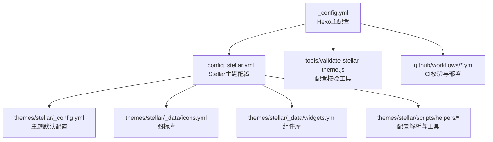
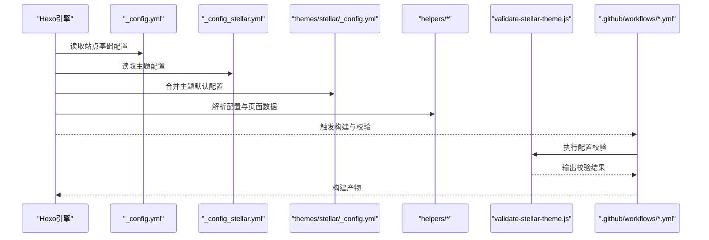
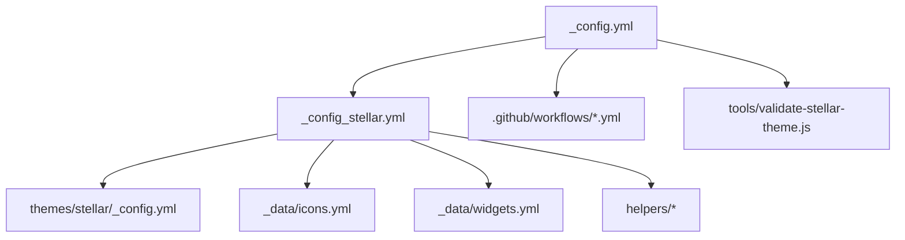

# 配置管理

<cite>
**本文引用的文件**
- [_config.yml](file://_config.yml)
- [_config_stellar.yml](file://_config_stellar.yml)
- [themes/stellar/_config.yml](file://themes/stellar/_config.yml)
- [themes/stellar/scripts/helpers/parse_config.js](file://themes/stellar/scripts/helpers/parse_config.js)
- [themes/stellar/scripts/helpers/utils.js](file://themes/stellar/scripts/helpers/utils.js)
- [themes/stellar/_data/icons.yml](file://themes/stellar/_data/icons.yml)
- [themes/stellar/_data/widgets.yml](file://themes/stellar/_data/widgets.yml)
- [tools/validate-stellar-theme.js](file://tools/validate-stellar-theme.js)
- [STELLAR_THEME_SETUP.md](file://STELLAR_THEME_SETUP.md)
- [STELLAR_DEPLOYMENT_GUIDE.md](file://STELLAR_DEPLOYMENT_GUIDE.md)
- [.github/workflows/stellar-ci.yml](file://.github/workflows/stellar-ci.yml)
- [.github/workflows/ci.yml](file://.github/workflows/ci.yml)
</cite>

## 目录
1. [简介](#简介)
2. [项目结构](#项目结构)
3. [核心组件](#核心组件)
4. [架构总览](#架构总览)
5. [详细组件分析](#详细组件分析)
6. [依赖关系分析](#依赖关系分析)
7. [性能考虑](#性能考虑)
8. [故障排查指南](#故障排查指南)
9. [结论](#结论)
10. [附录](#附录)

## 简介
本指南面向H1S97X博客Stellar主题的配置管理，系统梳理Hexo主配置与Stellar主题配置的层次关系与职责边界，逐项解释配置项的数据类型、默认值、取值范围与使用场景，并提供实际配置示例与最佳实践，帮助读者正确配置评论系统、搜索功能、社交链接、插件与样式等模块。

## 项目结构
- Hexo主配置：位于根目录的[_config.yml](file://_config.yml)，负责站点基础信息、URL、目录、分页、RSS、部署等全局设置。
- Stellar主题配置：位于根目录的[_config_stellar.yml](file://_config_stellar.yml)，负责主题层面的导航、页面树、评论、搜索、插件、样式、默认占位图等。
- 主题内置配置：位于主题目录[themes/stellar/_config.yml](file://themes/stellar/_config.yml)，提供主题默认值与可覆盖项。
- 辅助脚本与校验：主题helpers与验证工具用于解析配置、生成页面、校验配置正确性。
- 文档与工作流：包含主题使用说明、部署指南与CI校验流程。

**图示来源**
- [_config.yml](file://_config.yml#L1-L136)
- [_config_stellar.yml](file://_config_stellar.yml#L1-L699)
- [themes/stellar/_config.yml](file://themes/stellar/_config.yml#L1-L725)
- [themes/stellar/_data/icons.yml](file://themes/stellar/_data/icons.yml#L1-L59)
- [themes/stellar/_data/widgets.yml](file://themes/stellar/_data/widgets.yml#L1-L85)
- [themes/stellar/scripts/helpers/parse_config.js](file://themes/stellar/scripts/helpers/parse_config.js#L1-L43)
- [themes/stellar/scripts/helpers/utils.js](file://themes/stellar/scripts/helpers/utils.js#L1-L21)
- [tools/validate-stellar-theme.js](file://tools/validate-stellar-theme.js#L1-L313)
- [.github/workflows/stellar-ci.yml](file://.github/workflows/stellar-ci.yml#L1-L61)
- [.github/workflows/ci.yml](file://.github/workflows/ci.yml#L1-L53)

**章节来源**
- [_config.yml](file://_config.yml#L1-L136)
- [_config_stellar.yml](file://_config_stellar.yml#L1-L699)
- [themes/stellar/_config.yml](file://themes/stellar/_config.yml#L1-L725)

## 核心组件
- 站点基本信息与URL
  - 站点标题、副标题、作者、语言、时区、favicon、头像等。
  - URL、永久链接格式、美化链接尾缀等。
- 目录与分页
  - 源目录、公开目录、标签/归档/分类目录、分页数量与目录名。
- 写作与高亮
  - 新文章命名、默认布局、标题大小写、外链行为、代码高亮与PrismJS。
- 搜索与RSS
  - 搜索路径、字段、格式、限制；RSS类型、路径、限制、图标、自动发现。
- 部署
  - Git部署仓库与分支。
- 主题配置要点
  - 侧边栏Logo与菜单、站点主结构树、笔记本/文章/笔记/作者/错误页布局、搜索服务、评论系统、插件、样式主题、默认占位图、API主机等。

**章节来源**
- [_config.yml](file://_config.yml#L5-L136)
- [_config_stellar.yml](file://_config_stellar.yml#L1-L699)
- [themes/stellar/_config.yml](file://themes/stellar/_config.yml#L1-L725)

## 架构总览
Hexo在构建时，先读取主配置[_config.yml](file://_config.yml)，再读取Stellar主题配置[_config_stellar.yml](file://_config_stellar.yml)与主题默认配置[themes/stellar/_config.yml](file://themes/stellar/_config.yml)。主题helpers负责解析Markdown链接与文本、页面检索等；验证工具与CI工作流保障配置正确性与构建稳定性。

**图示来源**
- [_config.yml](file://_config.yml#L104-L136)
- [_config_stellar.yml](file://_config_stellar.yml#L1-L699)
- [themes/stellar/_config.yml](file://themes/stellar/_config.yml#L1-L725)
- [themes/stellar/scripts/helpers/parse_config.js](file://themes/stellar/scripts/helpers/parse_config.js#L1-L43)
- [themes/stellar/scripts/helpers/utils.js](file://themes/stellar/scripts/helpers/utils.js#L1-L21)
- [tools/validate-stellar-theme.js](file://tools/validate-stellar-theme.js#L1-L313)
- [.github/workflows/stellar-ci.yml](file://.github/workflows/stellar-ci.yml#L1-L61)
- [.github/workflows/ci.yml](file://.github/workflows/ci.yml#L1-L53)

## 详细组件分析

### 1) 站点基本信息与URL
- 关键项
  - 站点标题、副标题、作者、语言、时区、favicon、头像。
  - URL、永久链接格式、美化链接尾缀。
- 数据类型与默认值
  - title: 字符串；默认未设置，建议必填。
  - url: 字符串；默认未设置，建议配置为GitHub Pages域名。
  - permalink: 字符串；默认包含年/月/日/标题。
  - pretty_urls.trailing_index/trailing_html: 布尔；默认保留尾缀以兼容静态托管。
- 使用场景
  - 作为Open Graph与RSS的站点元信息来源。
  - 影响页面URL结构与SEO友好性。
- 最佳实践
  - 统一语言设置，避免多语言混杂。
  - 使用稳定CDN托管favicon与头像。
  - 永久链接保持稳定，避免频繁变更。

**章节来源**
- [_config.yml](file://_config.yml#L5-L26)
- [_config.yml](file://_config.yml#L104-L136)

### 2) 目录与分页
- 关键项
  - source_dir、public_dir、tag_dir、archive_dir、category_dir、code_dir、i18n_dir。
  - per_page、pagination_dir。
- 数据类型与默认值
  - 目录均为字符串；per_page默认10。
- 使用场景
  - 控制生成文件的组织结构与分页行为。
- 最佳实践
  - 保持目录结构清晰，便于迁移与维护。
  - 合理设置分页数量，平衡加载性能与阅读体验。

**章节来源**
- [_config.yml](file://_config.yml#L27-L99)

### 3) 写作与高亮
- 关键项
  - new_post_name、default_layout、titlecase、external_link.enable/field/exclude。
  - highlight与prismjs：行号、自动检测、换行包裹、hljs开关。
- 数据类型与默认值
  - highlight.enable: 布尔；默认true。
  - prismjs.enable: 布尔；默认false。
- 使用场景
  - 提升代码展示与外链打开体验。
- 最佳实践
  - 优先使用highlight（默认），如需PrismJS可启用prismjs并关闭highlight。
  - 外链统一在新窗口打开，提升安全性。

**章节来源**
- [_config.yml](file://_config.yml#L37-L62)
- [_config.yml](file://_config.yml#L41-L44)

### 4) 搜索与RSS
- 关键项
  - search.path、field、format、limit。
  - feed.enable/type/path/limit/content/content_limit/order_by/icon/autodiscovery。
- 数据类型与默认值
  - search.field: all/post/page；默认all。
  - feed.type: atom/rss2；默认atom。
- 使用场景
  - 本地搜索索引生成；RSS订阅与SEO。
- 最佳实践
  - 搜索路径与字段按需配置，避免索引过大。
  - RSS限制内容长度，提升订阅端性能。

**章节来源**
- [_config.yml](file://_config.yml#L108-L128)

### 5) 部署
- 关键项
  - deploy.type、repo、branch。
- 数据类型与默认值
  - type: git；repo为字符串；branch: master。
- 使用场景
  - 自动部署到GitHub Pages。
- 最佳实践
  - 使用SSH密钥或令牌，避免明文密码。
  - 分支与仓库保持一致，避免部署失败。

**章节来源**
- [_config.yml](file://_config.yml#L130-L136)

### 6) 主题配置：侧边栏与导航
- 关键项
  - logo.avatar、title、subtitle。
  - menubar.columns、menubar.items（id、theme、icon、title、url）。
- 数据类型与默认值
  - columns: 整数；默认4。
  - items: 数组对象；包含id、theme、icon、title、url。
- 使用场景
  - 控制侧边栏Logo与主导航菜单的显示与跳转。
- 最佳实践
  - 图标可来自内置icons.yml或外部URL。
  - 菜单项顺序与分类对应，提升导航效率。

**章节来源**
- [_config_stellar.yml](file://_config_stellar.yml#L2-L32)
- [themes/stellar/_data/icons.yml](file://themes/stellar/_data/icons.yml#L1-L59)

### 7) 主题配置：站点主结构树
- 关键项
  - site_tree.home/index_blog/index_wiki/post/wiki/notebooks/notes/note/author/error_page/page。
  - 每类页面的leftbar/rightbar与nav_tabs。
- 数据类型与默认值
  - base_dir/menu_id/leftbar/rightbar/nav_tabs均为字符串或映射。
- 使用场景
  - 定义不同页面类型的侧栏与导航标签。
- 最佳实践
  - 为博客与文档分别配置不同的导航标签与侧栏组件。
  - 错误页与作者页单独配置，保证用户体验。

**章节来源**
- [_config_stellar.yml](file://_config_stellar.yml#L34-L121)

### 8) 主题配置：笔记本与文章
- 关键项
  - notebook.auto_excerpt、per_page、order_by、license、share。
  - article.type、indent、cover_ratio、banner_ratio、auto_banner、auto_excerpt、category_color、license、share、related_posts。
- 数据类型与默认值
  - type: tech/story；默认tech。
  - related_posts.enable: 布尔；默认false。
- 使用场景
  - 控制笔记本与文章的摘要、排序、许可协议与分享按钮。
- 最佳实践
  - 文章类型按内容风格选择，图文类可启用更大行距。
  - 相关文章插件需额外安装hexo-related-popular-posts。

**章节来源**
- [_config_stellar.yml](file://_config_stellar.yml#L123-L174)

### 9) 主题配置：搜索服务
- 关键项
  - search.service（local_search/algolia_search）、local_search.field/path/content/skip_search、algolia_search（appId/apiKey/indexName/js）。
- 数据类型与默认值
  - service: local_search；local_search.field: all/post/page；默认all。
- 使用场景
  - 本地全文搜索或Algolia Docsearch。
- 最佳实践
  - 本地搜索适合小站点；Algolia适合大站点与复杂搜索需求。
  - skip_search可排除特定路径，减少索引冗余。

**章节来源**
- [_config_stellar.yml](file://_config_stellar.yml#L175-L189)

### 10) 主题配置：评论系统
- 关键项
  - comments.service（giscus/beaudar/utterances/twikoo/waline/artalk）、lazyload、custom_css。
  - giscus/data-repo/data-repo-id/data-category/data-category-id/data-mapping/data-theme等。
- 数据类型与默认值
  - service: 字符串；giscus为常用默认。
- 使用场景
  - 为文章页启用评论区，支持多服务切换。
- 最佳实践
  - Giscus需配置正确的仓库ID与分类ID。
  - Twikoo/Waline/Artalk需配置服务端或CDN地址。

**章节来源**
- [_config_stellar.yml](file://_config_stellar.yml#L191-L301)

### 11) 主题配置：页脚与社交链接
- 关键项
  - footer.social（图标与URL）、sitemap（标题与条目）、content（Markdown支持）。
- 数据类型与默认值
  - social为映射；sitemap为数组对象。
- 使用场景
  - 展示社交链接、站点地图与版权信息。
- 最佳实践
  - 社交链接指向真实地址，避免404。
  - 站点地图包含主要入口，利于SEO。

**章节来源**
- [_config_stellar.yml](file://_config_stellar.yml#L302-L350)

### 12) 主题配置：标签插件与样式
- 关键项
  - tag_plugins.note、checkbox、quot、emoji、icon、button、image、copy、timeline、mark、hashtag、okr、gallery、chat。
  - style.prefers_theme、smooth_scroll、font-size/font-family/text-align、prefix、border-radius、color、codeblock、loading、gradient、leftbar、paginator、error_page、header_prefix。
  - default（占位图）、api_host（ghapi/ghraw/gist/ghcard）。
- 数据类型与默认值
  - prefers_theme: auto/light/dark；color为主题色系；font-size支持px与百分比。
- 使用场景
  - 自定义标签插件样式与交互；统一主题风格与字体排版。
- 最佳实践
  - 保持主题色与强调色一致性。
  - 字体与字号按阅读习惯调整，兼顾移动端。

**章节来源**
- [_config_stellar.yml](file://_config_stellar.yml#L351-L699)

### 13) 主题配置：插件与依赖
- 关键项
  - dependencies（jquery/marked/lazyload）、data_services（mdrender/siteinfo/ghinfo/rating/vote/sites/friends/friends_and_posts/timeline/fcircle/weibo/memos/voice/video/download-file/twikoo/waline/artalk/giscus/contributors）。
  - plugins（preload/fancybox/swiper/scrollreveal/tianli_gpt/katex/mathjax/mermaid/copycode/heti）。
- 数据类型与默认值
  - enable: 布尔；多数插件默认关闭，按需开启。
- 使用场景
  - 按需加载外部库与内置服务，提升功能与性能。
- 最佳实践
  - 仅启用必要插件，避免资源冗余。
  - 数学公式与Mermaid需安装对应渲染器或过滤器。

**章节来源**
- [_config_stellar.yml](file://_config_stellar.yml#L428-L607)

### 14) 主题配置：系统与覆盖
- 关键项
  - system.override_pretty_urls（统一链接格式）。
- 使用场景
  - 统一美化链接格式，减少维护成本。
- 最佳实践
  - 保持与Hexo默认行为一致，避免破坏SEO。

**章节来源**
- [_config_stellar.yml](file://_config_stellar.yml#L695-L699)

### 15) 主题默认配置与解析
- 主题默认配置
  - 主题默认配置[themes/stellar/_config.yml](file://themes/stellar/_config.yml)提供主题的默认值与可覆盖项。
- 配置解析与工具
  - helpers：
    - [parse_config.js](file://themes/stellar/scripts/helpers/parse_config.js)：解析Markdown链接与文本，支持{config.*}占位替换。
    - [utils.js](file://themes/stellar/scripts/helpers/utils.js)：页面检索工具。
- 使用场景
  - 在模板中安全引用配置，避免硬编码。
- 最佳实践
  - 通过helpers间接引用配置，便于主题升级与维护。

**章节来源**
- [themes/stellar/_config.yml](file://themes/stellar/_config.yml#L1-L725)
- [themes/stellar/scripts/helpers/parse_config.js](file://themes/stellar/scripts/helpers/parse_config.js#L1-L43)
- [themes/stellar/scripts/helpers/utils.js](file://themes/stellar/scripts/helpers/utils.js#L1-L21)

### 16) 配置校验与CI
- 验证工具
  - [tools/validate-stellar-theme.js](file://tools/validate-stellar-theme.js)：校验主配置、Stellar配置、主题文件、依赖包。
- CI工作流
  - [.github/workflows/stellar-ci.yml](file://.github/workflows/stellar-ci.yml)、[.github/workflows/ci.yml](file://.github/workflows/ci.yml)：自动初始化子模块、校验配置、构建与测试。
- 使用场景
  - 自动化保障配置正确性与构建稳定性。
- 最佳实践
  - 在PR与推送时自动触发校验，及时发现问题。

**章节来源**
- [tools/validate-stellar-theme.js](file://tools/validate-stellar-theme.js#L1-L313)
- [.github/workflows/stellar-ci.yml](file://.github/workflows/stellar-ci.yml#L1-L61)
- [.github/workflows/ci.yml](file://.github/workflows/ci.yml#L1-L53)

## 依赖关系分析
- 配置耦合
  - _config.yml与_config_stellar.yml存在强耦合：前者决定站点基础，后者决定主题行为。
  - 主题默认配置与用户配置形成“默认值+覆盖”的关系。
- 外部依赖
  - 评论系统依赖GitHub Discussions或其他服务端。
  - 搜索服务可本地或第三方（Algolia）。
  - 插件依赖CDN或本地资源。
- 循环依赖
  - 配置层之间无循环依赖，解析与工具脚本独立于配置。
- 风险点
  - 评论服务参数错误会导致评论区不可用。
  - 插件未启用导致功能缺失。
  - CI未通过导致部署失败。

**图示来源**
- [_config.yml](file://_config.yml#L1-L136)
- [_config_stellar.yml](file://_config_stellar.yml#L1-L699)
- [themes/stellar/_config.yml](file://themes/stellar/_config.yml#L1-L725)
- [themes/stellar/_data/icons.yml](file://themes/stellar/_data/icons.yml#L1-L59)
- [themes/stellar/_data/widgets.yml](file://themes/stellar/_data/widgets.yml#L1-L85)
- [themes/stellar/scripts/helpers/parse_config.js](file://themes/stellar/scripts/helpers/parse_config.js#L1-L43)
- [themes/stellar/scripts/helpers/utils.js](file://themes/stellar/scripts/helpers/utils.js#L1-L21)
- [tools/validate-stellar-theme.js](file://tools/validate-stellar-theme.js#L1-L313)
- [.github/workflows/stellar-ci.yml](file://.github/workflows/stellar-ci.yml#L1-L61)
- [.github/workflows/ci.yml](file://.github/workflows/ci.yml#L1-L53)

**章节来源**
- [_config.yml](file://_config.yml#L1-L136)
- [_config_stellar.yml](file://_config_stellar.yml#L1-L699)
- [themes/stellar/_config.yml](file://themes/stellar/_config.yml#L1-L725)

## 性能考虑
- 资源加载
  - 仅启用必要插件，避免不必要的CDN请求。
  - 使用CDN缓存与合理的资源压缩策略。
- 构建与索引
  - 搜索索引字段与路径合理配置，避免过大JSON。
  - 分页与RSS限制内容长度，降低生成时间。
- 主题渲染
  - 代码高亮与PrismJS二选一，避免重复渲染。
  - 平滑滚动与动画按需开启，避免长页面定位偏差。

[本节为通用建议，无需特定文件引用]

## 故障排查指南
- 配置校验
  - 使用验证工具：npm run stellar:validate。
  - 检查主题文件是否存在与版本是否正确。
- 常见问题
  - 主题未启用或子模块未初始化：执行git submodule更新与安装依赖。
  - 评论区不显示：核对giscus的仓库ID与分类ID；检查lazyload与自定义CSS。
  - 搜索异常：确认search.service与local_search配置；检查skip_search规则。
  - CI失败：查看工作流日志，确认子模块初始化与依赖安装。
- 参考文档
  - 主题文档与Hexo配置文档。

**章节来源**
- [tools/validate-stellar-theme.js](file://tools/validate-stellar-theme.js#L1-L313)
- [STELLAR_THEME_SETUP.md](file://STELLAR_THEME_SETUP.md#L140-L206)
- [STELLAR_DEPLOYMENT_GUIDE.md](file://STELLAR_DEPLOYMENT_GUIDE.md#L64-L146)
- [.github/workflows/stellar-ci.yml](file://.github/workflows/stellar-ci.yml#L1-L61)
- [.github/workflows/ci.yml](file://.github/workflows/ci.yml#L1-L53)

## 结论
通过明确Hexo主配置与Stellar主题配置的职责边界，结合主题默认配置与helpers工具，可实现稳定、可维护且高性能的博客配置体系。建议遵循“最小启用、按需扩展、自动化校验”的原则，持续优化搜索、评论、插件与样式，以获得更佳的创作与阅读体验。

[本节为总结性内容，无需特定文件引用]

## 附录

### A. 配置项速查表（示例）
- 站点基础
  - title: 字符串；默认未设置；建议必填。
  - url: 字符串；默认未设置；建议配置为GitHub Pages域名。
  - language: 数组；默认[zh-CN, en]。
  - timezone: 字符串；默认Asia/Shanghai。
- 搜索与RSS
  - search.path: 字符串；默认search.xml。
  - feed.enable/type/path/limit: 布尔/字符串/字符串/整数。
- 主题导航
  - menubar.columns: 整数；默认4。
  - menubar.items[].id/theme/icon/title/url: 字符串/字符串/字符串/字符串/字符串。
- 评论系统
  - comments.service: 字符串；默认giscus。
  - giscus.data-repo/data-repo-id/data-category/data-category-id: 字符串。
- 插件
  - plugins.katex/mathjax/mermaid/copycode.enable: 布尔；默认按需开启。
- 样式
  - style.prefers_theme: auto/light/dark；默认auto。
  - style.color/theme/accent/link: HSL字符串。

**章节来源**
- [_config.yml](file://_config.yml#L5-L136)
- [_config_stellar.yml](file://_config_stellar.yml#L1-L699)

### B. 实际配置示例（路径引用）
- 基础信息与URL
  - 参考：[_config.yml](file://_config.yml#L5-L26)
- 搜索与RSS
  - 参考：[_config.yml](file://_config.yml#L108-L128)
- 主题导航
  - 参考：[_config_stellar.yml](file://_config_stellar.yml#L9-L32)
- 评论系统
  - 参考：[_config_stellar.yml](file://_config_stellar.yml#L220-L264)
- 插件与依赖
  - 参考：[_config_stellar.yml](file://_config_stellar.yml#L504-L607)
- 样式主题
  - 参考：[_config_stellar.yml](file://_config_stellar.yml#L609-L699)

**章节来源**
- [_config.yml](file://_config.yml#L5-L136)
- [_config_stellar.yml](file://_config_stellar.yml#L1-L699)