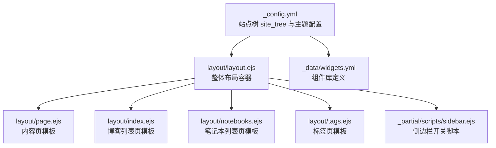
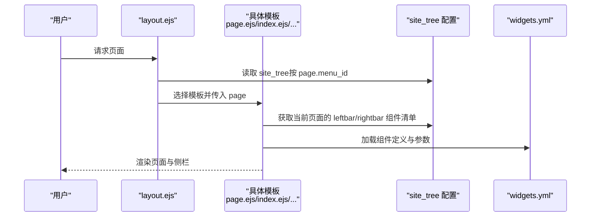
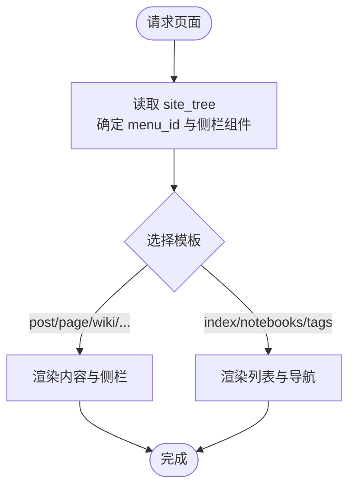
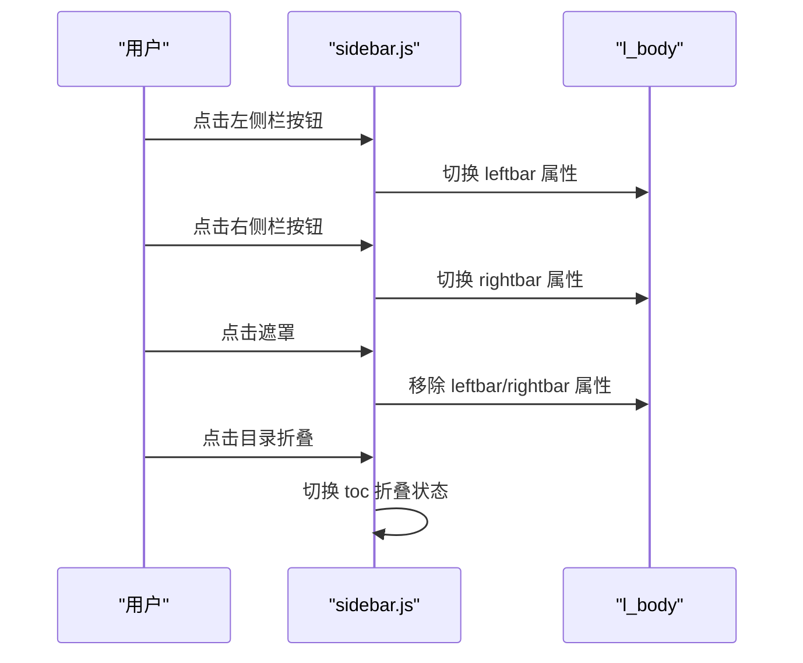
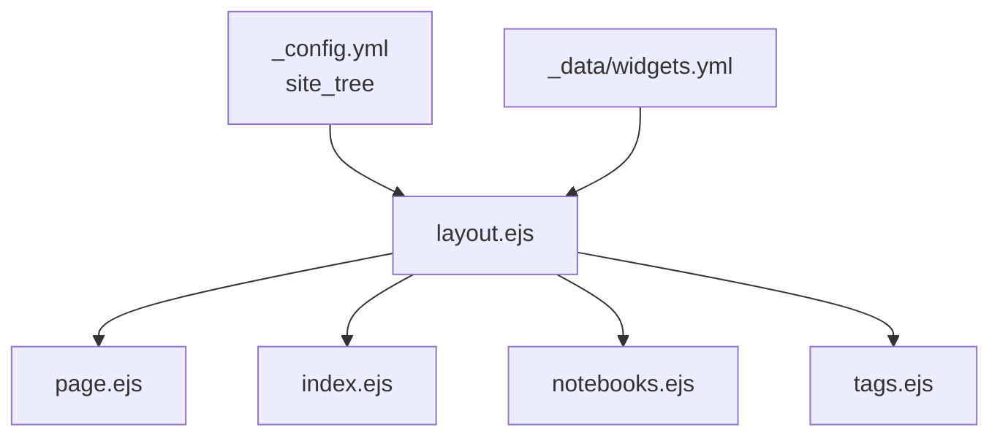

# 页面配置

<cite>
**本文引用的文件**
- [themes/stellar/_config.yml](file://themes/stellar/_config.yml)
- [themes/stellar/layout/layout.ejs](file://themes/stellar/layout/layout.ejs)
- [themes/stellar/layout/page.ejs](file://themes/stellar/layout/page.ejs)
- [themes/stellar/layout/index.ejs](file://themes/stellar/layout/index.ejs)
- [themes/stellar/layout/notebooks.ejs](file://themes/stellar/layout/notebooks.ejs)
- [themes/stellar/layout/tags.ejs](file://themes/stellar/layout/tags.ejs)
- [themes/stellar/layout/_partial/scripts/sidebar.ejs](file://themes/stellar/layout/_partial/scripts/sidebar.ejs)
- [themes/stellar/_data/widgets.yml](file://themes/stellar/_data/widgets.yml)
- [source/_data/wiki/stellar.yml](file://source/_data/wiki/stellar.yml)
</cite>

## 目录
1. [简介](#简介)
2. [项目结构](#项目结构)
3. [核心组件](#核心组件)
4. [架构总览](#架构总览)
5. [详细组件分析](#详细组件分析)
6. [依赖关系分析](#依赖关系分析)
7. [性能考量](#性能考量)
8. [故障排查指南](#故障排查指南)
9. [结论](#结论)
10. [附录](#附录)

## 简介
本指南面向使用 Stellar 主题的 H1S97X 博客用户，聚焦“页面配置”这一主题。我们将深入解释站点树 site_tree 的作用与页面类型配置，详解主页、博客列表页、文档页、笔记本页等的布局与侧边栏设置；同时说明左侧栏与右侧栏的组成与组件来源，给出针对不同页面类型的自定义示例，帮助你快速构建一致、清晰、易用的阅读体验。

## 项目结构
围绕页面配置的关键文件与职责如下：
- 主题配置：站点树 site_tree、侧边栏组件库、评论与插件等
- 页面模板：layout.ejs（整体布局）、page.ejs（内容页）、index.ejs（博客列表）、notebooks.ejs（笔记本列表）、tags.ejs（标签页）
- 侧边栏脚本：侧边栏开关与折叠逻辑
- 组件库：widgets.yml 定义可用侧边栏组件及其参数

**图表来源**
- [themes/stellar/_config.yml](file://themes/stellar/_config.yml#L72-L152)
- [themes/stellar/layout/layout.ejs](file://themes/stellar/layout/layout.ejs#L51-L66)
- [themes/stellar/layout/page.ejs](file://themes/stellar/layout/page.ejs#L14-L22)
- [themes/stellar/layout/index.ejs](file://themes/stellar/layout/index.ejs#L1-L41)
- [themes/stellar/layout/notebooks.ejs](file://themes/stellar/layout/notebooks.ejs#L1-L9)
- [themes/stellar/layout/tags.ejs](file://themes/stellar/layout/tags.ejs#L1-L21)
- [themes/stellar/_data/widgets.yml](file://themes/stellar/_data/widgets.yml#L1-L85)
- [themes/stellar/layout/_partial/scripts/sidebar.ejs](file://themes/stellar/layout/_partial/scripts/sidebar.ejs#L1-L25)

**章节来源**
- [themes/stellar/_config.yml](file://themes/stellar/_config.yml#L72-L152)
- [themes/stellar/layout/layout.ejs](file://themes/stellar/layout/layout.ejs#L51-L66)

## 核心组件
- 站点树 site_tree：定义各页面类型的默认 menu_id、导航标签、以及左右侧栏组件集合。这是“页面配置”的核心入口。
- 侧边栏组件库 widgets.yml：定义 welcome、recent、related、tree、toc、ghrepo、ghissues、ghuser、author、tagcloud、timeline、latest_comment、tagtree 等组件及其参数。
- 页面模板：根据 page.layout 与 page.menu_id 决定使用哪种模板与侧栏组件；内容页还会根据 page.type、page.topic、page.wiki 等决定文章类型与缩进等。
- 侧边栏脚本：提供左侧栏/右侧栏的开关与折叠逻辑，便于移动端与桌面端的交互体验。

**章节来源**
- [themes/stellar/_config.yml](file://themes/stellar/_config.yml#L72-L152)
- [themes/stellar/_data/widgets.yml](file://themes/stellar/_data/widgets.yml#L1-L85)
- [themes/stellar/layout/page.ejs](file://themes/stellar/layout/page.ejs#L14-L22)
- [themes/stellar/layout/_partial/scripts/sidebar.ejs](file://themes/stellar/layout/_partial/scripts/sidebar.ejs#L1-L25)

## 架构总览
Stellar 的页面配置遵循“配置驱动 + 模板渲染”的模式：
- 配置层：_config.yml 的 site_tree 与 widgets.yml 决定页面类型、菜单高亮、侧栏组件与组件参数。
- 渲染层：layout.ejs 作为根布局，按 page.layout 选择 index.ejs、page.ejs、notebooks.ejs、tags.ejs 等模板；模板内部再按 page.menu_id 与组件清单渲染侧栏。
- 组件层：widgets.yml 提供组件定义与参数，组件在侧栏模板中被实例化与展示。

**图表来源**
- [themes/stellar/layout/layout.ejs](file://themes/stellar/layout/layout.ejs#L51-L66)
- [themes/stellar/layout/page.ejs](file://themes/stellar/layout/page.ejs#L14-L22)
- [themes/stellar/_config.yml](file://themes/stellar/_config.yml#L72-L152)
- [themes/stellar/_data/widgets.yml](file://themes/stellar/_data/widgets.yml#L1-L85)

## 详细组件分析

### 站点树 site_tree 的作用与页面类型配置
- 作用：为不同页面类型提供默认的 menu_id、导航标签、以及左右侧栏组件集合。当页面未在 front-matter 中显式指定 menu_id 时，模板会回退到 site_tree 中的配置。
- 页面类型与默认配置要点：
  - 主页 home：左侧 welcome、recent；右侧留空
  - 博客列表 index_blog：左侧 welcome、recent；右侧留空；可配置 nav_tabs
  - 文档列表 index_wiki：左侧 related、recent；右侧留空；可配置 nav_tabs
  - 博客文章 post：左侧 related、recent；右侧 ghrepo、toc
  - 文档 wiki：左侧 tree、related、recent；右侧 ghrepo、toc
  - 笔记本列表 notebooks：左侧 recent；右侧留空
  - 笔记列表 notes：左侧 tagtree、recent；右侧留空
  - 笔记 note：左侧 tagtree、recent；右侧 toc
  - 作者 author：左侧 recent、timeline；右侧 timeline
  - 错误页 error_page：左侧 recent、timeline；右侧 timeline
  - 其它自定义页面 page：左侧 recent；右侧 toc

**章节来源**
- [themes/stellar/_config.yml](file://themes/stellar/_config.yml#L72-L152)

### 左侧栏与右侧栏的配置方法
- 左侧栏 leftbar：在对应页面类型的 site_tree 条目中设置，如 home.leftbar、post.leftbar 等。
- 右侧栏 rightbar：同理，如 post.rightbar、wiki.rightbar 等。
- 组件来源：widgets.yml 定义了组件清单与参数。模板会根据页面类型读取 leftbar/rightbar 列表，逐一加载组件。
- 组件参数：例如 recent.limit、toc.min_depth/max_depth、ghrepo、tagcloud、timeline 等均可在 widgets.yml 中配置。

**章节来源**
- [themes/stellar/_config.yml](file://themes/stellar/_config.yml#L72-L152)
- [themes/stellar/_data/widgets.yml](file://themes/stellar/_data/widgets.yml#L1-L85)

### 页面模板与侧栏渲染流程
- 整体布局 layout.ejs：负责创建 l_left（左侧栏）、l_main（主内容）、l_right（右侧栏）三大容器，并在其中插入侧栏与内容。
- 内容页 page.ejs：根据 page.menu_id 与笔记本配置决定默认 menu_id；随后按模板顺序渲染文章内容、相关文章、评论等。
- 列表页模板：index.ejs（博客列表）、notebooks.ejs（笔记本列表）、tags.ejs（标签页）分别渲染各自列表与导航标签。

**图表来源**
- [themes/stellar/layout/layout.ejs](file://themes/stellar/layout/layout.ejs#L51-L66)
- [themes/stellar/layout/page.ejs](file://themes/stellar/layout/page.ejs#L14-L22)
- [themes/stellar/layout/index.ejs](file://themes/stellar/layout/index.ejs#L1-L41)
- [themes/stellar/layout/notebooks.ejs](file://themes/stellar/layout/notebooks.ejs#L1-L9)
- [themes/stellar/layout/tags.ejs](file://themes/stellar/layout/tags.ejs#L1-L21)

**章节来源**
- [themes/stellar/layout/layout.ejs](file://themes/stellar/layout/layout.ejs#L51-L66)
- [themes/stellar/layout/page.ejs](file://themes/stellar/layout/page.ejs#L14-L22)
- [themes/stellar/layout/index.ejs](file://themes/stellar/layout/index.ejs#L1-L41)
- [themes/stellar/layout/notebooks.ejs](file://themes/stellar/layout/notebooks.ejs#L1-L9)
- [themes/stellar/layout/tags.ejs](file://themes/stellar/layout/tags.ejs#L1-L21)

### 侧边栏组件与参数详解
- welcome：欢迎信息组件，通常用于主页或文档页的引导
- recent：最近更新组件，支持 limit、rss 等参数
- related：相关文章/内容组件
- tree：页面树（与当前页面强关联的上下文）
- toc：文章目录，支持最小/最大层级、折叠策略、编辑按钮映射
- ghrepo、ghissues、ghuser：GitHub 相关组件
- author：作者信息组件
- tagcloud、tagtree：标签云与标签树
- timeline、latest_comment：时间线与最新评论
- 组件参数示例：在 widgets.yml 中可设置标题、数量、颜色、排序、折叠等

**章节来源**
- [themes/stellar/_data/widgets.yml](file://themes/stellar/_data/widgets.yml#L1-L85)

### 页面布局自定义示例
以下示例基于 site_tree 与 widgets.yml 的配置方式，帮助你根据不同页面类型设置合适的侧边栏组件：

- 示例一：为博客文章页添加“GitHub 仓库”组件
  - 在 post.rightbar 中加入 ghrepo
  - 在 widgets.yml 中配置 ghrepo 的仓库信息
  - 参考路径：[themes/stellar/_config.yml](file://themes/stellar/_config.yml#L100-L104)、[themes/stellar/_data/widgets.yml](file://themes/stellar/_data/widgets.yml#L6-L16)

- 示例二：为文档页启用“页面树”与“相关”
  - 在 wiki.leftbar 中加入 tree、related
  - 在 widgets.yml 中配置 tree 组件
  - 参考路径：[themes/stellar/_config.yml](file://themes/stellar/_config.yml#L108-L112)、[themes/stellar/_data/widgets.yml](file://themes/stellar/_data/widgets.yml#L24-L27)

- 示例三：为笔记本列表页显示“标签树”与“最近”
  - 在 notebooks.leftbar 中加入 tagtree、recent
  - 在 widgets.yml 中配置 tagtree、recent
  - 参考路径：[themes/stellar/_config.yml](file://themes/stellar/_config.yml#L113-L119)、[themes/stellar/_data/widgets.yml](file://themes/stellar/_data/widgets.yml#L80-L85)

- 示例四：为主页添加“欢迎”与“最近”
  - 在 home.leftbar 中加入 welcome、recent
  - 在 widgets.yml 中配置 recent 的数量与 rss
  - 参考路径：[themes/stellar/_config.yml](file://themes/stellar/_config.yml#L75-L78)、[themes/stellar/_data/widgets.yml](file://themes/stellar/_data/widgets.yml#L17-L23)

- 示例五：为标签页启用导航标签
  - 在 index_blog.nav_tabs 或 index_wiki.nav_tabs 中添加自定义标签
  - 参考路径：[themes/stellar/_config.yml](file://themes/stellar/_config.yml#L85-L98)

**章节来源**
- [themes/stellar/_config.yml](file://themes/stellar/_config.yml#L72-L152)
- [themes/stellar/_data/widgets.yml](file://themes/stellar/_data/widgets.yml#L1-L85)

### 侧边栏交互与折叠
- 侧边栏开关：通过 _partial/scripts/sidebar.ejs 提供 leftbar、rightbar 的切换与关闭逻辑
- 目录折叠：toggleTOC 可切换 toc 的折叠状态
- 移动端体验：模板在主容器上绑定点击事件，点击遮罩可关闭侧栏

**图表来源**
- [themes/stellar/layout/_partial/scripts/sidebar.ejs](file://themes/stellar/layout/_partial/scripts/sidebar.ejs#L1-L25)
- [themes/stellar/layout/layout.ejs](file://themes/stellar/layout/layout.ejs#L62-L68)

**章节来源**
- [themes/stellar/layout/_partial/scripts/sidebar.ejs](file://themes/stellar/layout/_partial/scripts/sidebar.ejs#L1-L25)
- [themes/stellar/layout/layout.ejs](file://themes/stellar/layout/layout.ejs#L62-L68)

## 依赖关系分析
- 配置依赖：页面模板依赖 site_tree 的 menu_id 与侧栏组件清单；组件参数依赖 widgets.yml。
- 模板依赖：layout.ejs 为根布局，依赖各页面模板；页面模板之间相互独立但共享组件库。
- 组件依赖：组件参数在 widgets.yml 中集中管理，组件在模板中按清单渲染。

**图表来源**
- [themes/stellar/_config.yml](file://themes/stellar/_config.yml#L72-L152)
- [themes/stellar/_data/widgets.yml](file://themes/stellar/_data/widgets.yml#L1-L85)
- [themes/stellar/layout/layout.ejs](file://themes/stellar/layout/layout.ejs#L51-L66)
- [themes/stellar/layout/page.ejs](file://themes/stellar/layout/page.ejs#L14-L22)
- [themes/stellar/layout/index.ejs](file://themes/stellar/layout/index.ejs#L1-L41)
- [themes/stellar/layout/notebooks.ejs](file://themes/stellar/layout/notebooks.ejs#L1-L9)
- [themes/stellar/layout/tags.ejs](file://themes/stellar/layout/tags.ejs#L1-L21)

**章节来源**
- [themes/stellar/_config.yml](file://themes/stellar/_config.yml#L72-L152)
- [themes/stellar/_data/widgets.yml](file://themes/stellar/_data/widgets.yml#L1-L85)
- [themes/stellar/layout/layout.ejs](file://themes/stellar/layout/layout.ejs#L51-L66)

## 性能考量
- 侧栏组件按需加载：widgets.yml 中的组件仅在页面声明使用时才会渲染，避免不必要的资源消耗。
- 列表页与内容页分离：index.ejs、page.ejs 等模板职责明确，减少模板内的条件判断复杂度。
- 目录与滚动：toc 的折叠与 scrollreveal 的启用需谨慎，避免在长列表页造成过度重排。

[本节为通用指导，不直接分析具体文件]

## 故障排查指南
- 页面未显示预期侧栏组件
  - 检查 site_tree 中对应页面类型的 leftbar/rightbar 是否正确设置
  - 检查 widgets.yml 中组件是否存在且参数无误
  - 参考路径：[themes/stellar/_config.yml](file://themes/stellar/_config.yml#L72-L152)、[themes/stellar/_data/widgets.yml](file://themes/stellar/_data/widgets.yml#L1-L85)
- 页面 menu_id 不生效
  - 确认页面 front-matter 中未覆盖 menu_id；若未设置，模板会回退到 site_tree 的默认值
  - 参考路径：[themes/stellar/layout/page.ejs](file://themes/stellar/layout/page.ejs#L14-L22)
- 侧栏无法关闭或折叠无效
  - 检查 sidebar.js 的事件绑定与 DOM 属性切换逻辑
  - 参考路径：[themes/stellar/layout/_partial/scripts/sidebar.ejs](file://themes/stellar/layout/_partial/scripts/sidebar.ejs#L1-L25)
- 文档或笔记本页面缺少页面树/标签树
  - 确认 widgets.yml 中 tree/tagtree 已启用并正确配置
  - 参考路径：[themes/stellar/_data/widgets.yml](file://themes/stellar/_data/widgets.yml#L24-L27)、[themes/stellar/_data/widgets.yml](file://themes/stellar/_data/widgets.yml#L80-L85)

**章节来源**
- [themes/stellar/_config.yml](file://themes/stellar/_config.yml#L72-L152)
- [themes/stellar/_data/widgets.yml](file://themes/stellar/_data/widgets.yml#L1-L85)
- [themes/stellar/layout/page.ejs](file://themes/stellar/layout/page.ejs#L14-L22)
- [themes/stellar/layout/_partial/scripts/sidebar.ejs](file://themes/stellar/layout/_partial/scripts/sidebar.ejs#L1-L25)

## 结论
通过 site_tree 与 widgets.yml 的协同配置，Stellar 主题实现了对主页、博客列表、文档、笔记本等页面的统一布局与侧栏管理。合理设置 leftbar/rightbar 与组件参数，可显著提升页面的可读性与一致性。建议在新增页面类型时，先在 site_tree 中定义默认配置，再在 widgets.yml 中完善组件参数，最后在模板中确认渲染效果。

[本节为总结性内容，不直接分析具体文件]

## 附录
- 文档元信息：用于 wiki 系统的站点信息与链接
  - 参考路径：[source/_data/wiki/stellar.yml](file://source/_data/wiki/stellar.yml#L1-L10)

**章节来源**
- [source/_data/wiki/stellar.yml](file://source/_data/wiki/stellar.yml#L1-L10)