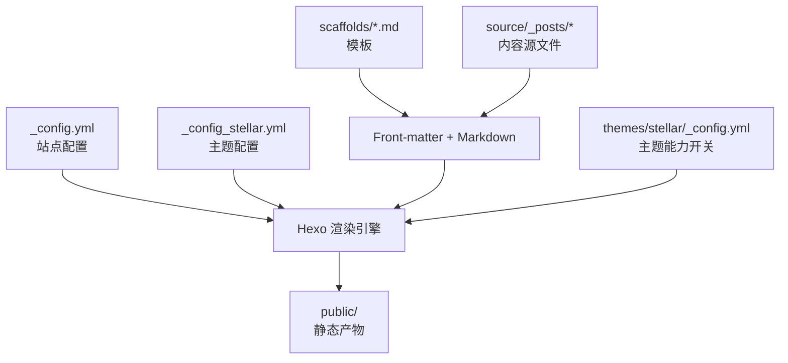
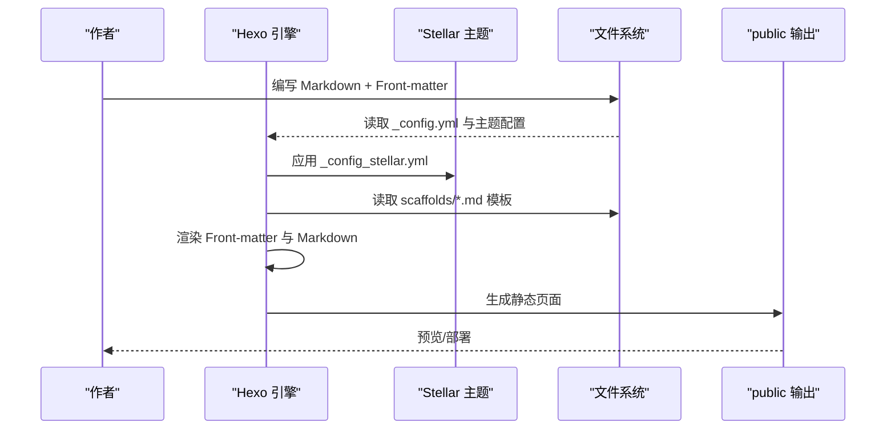
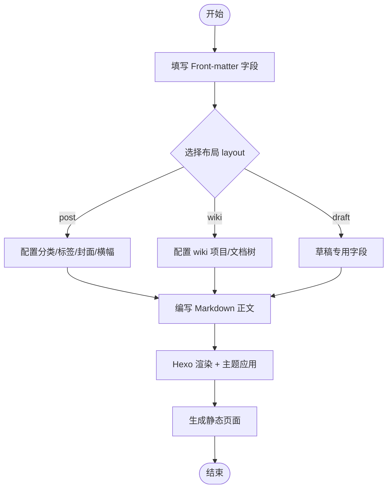
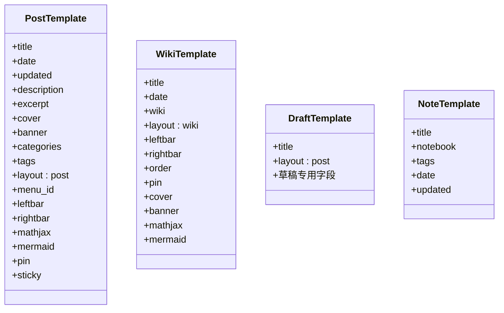
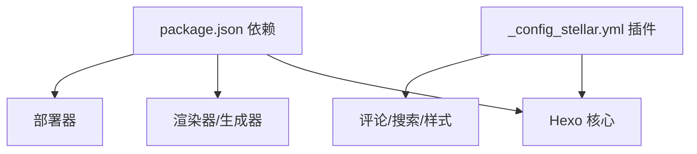

# 内容管理

<cite>
**本文引用的文件**
- [_config.yml](file://_config.yml)
- [_config_stellar.yml](file://_config_stellar.yml)
- [package.json](file://package.json)
- [scaffolds/post.md](file://scaffolds/post.md)
- [scaffolds/wiki.md](file://scaffolds/wiki.md)
- [scaffolds/draft.md](file://scaffolds/draft.md)
- [source/_posts/hello-world.md](file://source/_posts/hello-world.md)
- [source/_posts/Linux/linux.md](file://source/_posts/Linux/linux.md)
- [source/_templates/note.md](file://source/_templates/note.md)
- [themes/stellar/_config.yml](file://themes/stellar/_config.yml)
</cite>

## 目录
1. [简介](#简介)
2. [项目结构](#项目结构)
3. [核心组件](#核心组件)
4. [架构总览](#架构总览)
5. [详细组件分析](#详细组件分析)
6. [依赖分析](#依赖分析)
7. [性能考虑](#性能考虑)
8. [故障排查指南](#故障排查指南)
9. [结论](#结论)
10. [附录](#附录)

## 简介
本文件面向H1S97X博客的内容创作者与维护者，系统化梳理基于Hexo与Stellar主题的内容管理体系，涵盖文章创作流程（Front-matter配置、Markdown语法与资源管理）、模板系统（post、wiki、draft等）、分类与标签体系、多媒体内容处理、内容组织最佳实践，以及实际可用的配置模板与示例路径。

## 项目结构
- 配置层
  - 站点级配置：_config.yml
  - 主题级配置：_config_stellar.yml（Stellar主题）
  - 依赖与脚本：package.json
- 模板层
  - 文章模板：scaffolds/post.md
  - Wiki模板：scaffolds/wiki.md
  - 草稿模板：scaffolds/draft.md
  - Obsidian/templater笔记模板：source/_templates/note.md
- 内容层
  - 示例文章：source/_posts/hello-world.md
  - 大型内容示例：source/_posts/Linux/linux.md
- 主题层
  - 主题配置：themes/stellar/_config.yml

**图表来源**
- [_config.yml](file://_config.yml#L1-L136)
- [_config_stellar.yml](file://_config_stellar.yml#L1-L699)
- [themes/stellar/_config.yml](file://themes/stellar/_config.yml#L1-L725)

**章节来源**
- [package.json](file://package.json#L1-L94)
- [_config.yml](file://_config.yml#L1-L136)
- [_config_stellar.yml](file://_config_stellar.yml#L1-L699)
- [themes/stellar/_config.yml](file://themes/stellar/_config.yml#L1-L725)

## 核心组件
- 站点配置（_config.yml）
  - 站点元信息、URL、目录、写作与渲染、分页、RSS、部署等
- 主题配置（_config_stellar.yml）
  - 导航树、页面布局、侧栏组件、评论、搜索、样式与插件开关
- 模板系统（scaffolds）
  - post、wiki、draft模板，提供标准化的Front-matter字段与使用说明
- 内容源文件
  - Markdown正文配合Front-matter元数据，支持SEO、布局、评论、数学公式、Mermaid等
- 主题能力（themes/stellar/_config.yml）
  - 标签插件、搜索服务、评论服务、样式与主题色、插件注入等

**章节来源**
- [_config.yml](file://_config.yml#L1-L136)
- [_config_stellar.yml](file://_config_stellar.yml#L1-L699)
- [scaffolds/post.md](file://scaffolds/post.md#L1-L77)
- [scaffolds/wiki.md](file://scaffolds/wiki.md#L1-L84)
- [scaffolds/draft.md](file://scaffolds/draft.md#L1-L48)
- [themes/stellar/_config.yml](file://themes/stellar/_config.yml#L1-L725)

## 架构总览
Hexo在构建阶段读取站点与主题配置，依据模板生成Front-matter与Markdown内容，结合主题配置渲染页面，最终输出静态文件。Stellar主题通过其配置文件控制页面树、侧栏组件、评论与搜索等能力。

**图表来源**
- [_config.yml](file://_config.yml#L1-L136)
- [_config_stellar.yml](file://_config_stellar.yml#L1-L699)
- [themes/stellar/_config.yml](file://themes/stellar/_config.yml#L1-L725)

## 详细组件分析

### 文章创作流程与Front-matter配置
- Front-matter字段建议
  - 基础：title、date、updated、description、excerpt
  - 资源：cover、banner、poster
  - 分类与标签：categories、tags
  - 布局与导航：layout、menu_id、leftbar、rightbar
  - 内容增强：author、license、share、comment、mathjax、mermaid、pin、sticky
  - SEO：keywords、canonical_url、robots、sitemap
  - 专栏与Wiki：topic、wiki、references
- 示例参考
  - 示例文章：[source/_posts/hello-world.md](file://source/_posts/hello-world.md#L1-L39)
  - 大型内容示例：[source/_posts/Linux/linux.md](file://source/_posts/Linux/linux.md#L1-L800)
- 模板字段说明
  - post模板：[scaffolds/post.md](file://scaffolds/post.md#L1-L77)
  - wiki模板：[scaffolds/wiki.md](file://scaffolds/wiki.md#L1-L84)
  - 草稿模板：[scaffolds/draft.md](file://scaffolds/draft.md#L1-L48)

**图表来源**
- [scaffolds/post.md](file://scaffolds/post.md#L1-L77)
- [scaffolds/wiki.md](file://scaffolds/wiki.md#L1-L84)
- [scaffolds/draft.md](file://scaffolds/draft.md#L1-L48)
- [_config_stellar.yml](file://_config_stellar.yml#L70-L152)

**章节来源**
- [scaffolds/post.md](file://scaffolds/post.md#L1-L77)
- [scaffolds/wiki.md](file://scaffolds/wiki.md#L1-L84)
- [scaffolds/draft.md](file://scaffolds/draft.md#L1-L48)
- [source/_posts/hello-world.md](file://source/_posts/hello-world.md#L1-L39)
- [source/_posts/Linux/linux.md](file://source/_posts/Linux/linux.md#L1-L800)

### 模板系统：post、wiki、draft、note
- post模板
  - 适用：博客文章
  - 关键字段：layout: post、menu_id、categories、tags、cover、banner、leftbar、rightbar、mathjax、mermaid、pin、sticky
  - 参考：[scaffolds/post.md](file://scaffolds/post.md#L1-L77)
- wiki模板
  - 适用：知识库/文档项目
  - 关键字段：layout: wiki、wiki、leftbar、rightbar、order、pin、cover、banner、mathjax、mermaid
  - 参考：[scaffolds/wiki.md](file://scaffolds/wiki.md#L1-L84)
- draft模板
  - 适用：草稿（发布前不公开）
  - 关键字段：layout: post、草稿专用字段（mathjax、mermaid、comment、share默认关闭）
  - 参考：[scaffolds/draft.md](file://scaffolds/draft.md#L1-L48)
- note模板（Obsidian/templater）
  - 适用：笔记笔记本
  - 关键字段：title、notebook、tags、date、updated
  - 参考：[source/_templates/note.md](file://source/_templates/note.md#L1-L19)

**图表来源**
- [scaffolds/post.md](file://scaffolds/post.md#L1-L77)
- [scaffolds/wiki.md](file://scaffolds/wiki.md#L1-L84)
- [scaffolds/draft.md](file://scaffolds/draft.md#L1-L48)
- [source/_templates/note.md](file://source/_templates/note.md#L1-L19)

**章节来源**
- [scaffolds/post.md](file://scaffolds/post.md#L1-L77)
- [scaffolds/wiki.md](file://scaffolds/wiki.md#L1-L84)
- [scaffolds/draft.md](file://scaffolds/draft.md#L1-L48)
- [source/_templates/note.md](file://source/_templates/note.md#L1-L19)

### 分类与标签系统
- 站点配置
  - 默认分类：default_category: uncategorized
  - 分类与标签映射：category_map、tag_map
  - 参考：[_config.yml](file://_config.yml#L72-L76)
- 主题配置
  - 分类颜色：category_color
  - 分类页面与导航：site_tree 中 index_blog 的 nav_tabs
  - 参考：[_config_stellar.yml](file://_config_stellar.yml#L162-L168)
- 使用建议
  - 为常用分类设定颜色，提升视觉识别
  - 在导航中维护常用分类入口，便于用户浏览

**章节来源**
- [_config.yml](file://_config.yml#L72-L76)
- [_config_stellar.yml](file://_config_stellar.yml#L162-L168)

### 多媒体内容处理（图片、视频、音频）
- 图片
  - 支持Fancybox放大（需启用fancybox插件与selector）
  - 建议放置于source/_posts/...或主题资源目录，使用相对路径
  - 参考：[_config_stellar.yml](file://_config_stellar.yml#L514-L523)
- 视频/音频
  - 主题提供video、voice等插件入口，可在文章中按需启用
  - 参考：[themes/stellar/_config.yml](file://themes/stellar/_config.yml#L501-L507)
- 代码块与公式
  - 代码高亮：highlight
  - 数学公式：katex或mathjax（需在文章Front-matter或主题中启用）
  - Mermaid：mermaid（需在文章Front-matter或主题中启用）
  - 参考：[_config.yml](file://_config.yml#L50-L62)、[_config_stellar.yml](file://_config_stellar.yml#L585-L618)

**章节来源**
- [_config_stellar.yml](file://_config_stellar.yml#L514-L523)
- [themes/stellar/_config.yml](file://themes/stellar/_config.yml#L501-L507)
- [_config.yml](file://_config.yml#L50-L62)
- [_config_stellar.yml](file://_config_stellar.yml#L585-L618)

### 内容组织最佳实践
- 文件命名与目录
  - 使用语义化目录（如source/_posts/Linux/）
  - 文件名建议使用短横线分隔，避免特殊字符
  - 参考现有文章目录结构：[source/_posts/Linux/](file://source/_posts/Linux/)
- Front-matter元数据管理
  - 为每篇文章提供description与excerpt，利于SEO与摘要
  - 合理设置categories与tags，避免过度堆砌
  - 使用pin/sticky进行置顶管理
  - 参考：[scaffolds/post.md](file://scaffolds/post.md#L1-L77)
- 资源管理
  - 图片建议集中管理，避免路径漂移
  - 使用主题提供的占位图与默认资源，保证一致性
  - 参考：[_config_stellar.yml](file://_config_stellar.yml#L674-L711)

**章节来源**
- [scaffolds/post.md](file://scaffolds/post.md#L1-L77)
- [_config_stellar.yml](file://_config_stellar.yml#L674-L711)

### 配置模板与示例
- 站点配置模板（_config.yml）
  - 参考：[_config.yml](file://_config.yml#L1-L136)
- 主题配置模板（_config_stellar.yml）
  - 参考：[_config_stellar.yml](file://_config_stellar.yml#L1-L699)
- 主题能力开关（themes/stellar/_config.yml）
  - 参考：[themes/stellar/_config.yml](file://themes/stellar/_config.yml#L1-L725)
- 模板示例
  - post模板：[scaffolds/post.md](file://scaffolds/post.md#L1-L77)
  - wiki模板：[scaffolds/wiki.md](file://scaffolds/wiki.md#L1-L84)
  - draft模板：[scaffolds/draft.md](file://scaffolds/draft.md#L1-L48)
  - note模板：[source/_templates/note.md](file://source/_templates/note.md#L1-L19)
- 示例文章
  - hello-world：[source/_posts/hello-world.md](file://source/_posts/hello-world.md#L1-L39)
  - Linux教程：[source/_posts/Linux/linux.md](file://source/_posts/Linux/linux.md#L1-L800)

**章节来源**
- [_config.yml](file://_config.yml#L1-L136)
- [_config_stellar.yml](file://_config_stellar.yml#L1-L699)
- [themes/stellar/_config.yml](file://themes/stellar/_config.yml#L1-L725)
- [scaffolds/post.md](file://scaffolds/post.md#L1-L77)
- [scaffolds/wiki.md](file://scaffolds/wiki.md#L1-L84)
- [scaffolds/draft.md](file://scaffolds/draft.md#L1-L48)
- [source/_templates/note.md](file://source/_templates/note.md#L1-L19)
- [source/_posts/hello-world.md](file://source/_posts/hello-world.md#L1-L39)
- [source/_posts/Linux/linux.md](file://source/_posts/Linux/linux.md#L1-L800)

## 依赖分析
- Hexo版本与核心依赖
  - hexo: ^8.1.1
  - 渲染器：hexo-renderer-marked、hexo-renderer-pug、hexo-renderer-stylus
  - 生成器：hexo-generator-index、hexo-generator-archive、hexo-generator-category、hexo-generator-tag、hexo-generator-feed、hexo-generator-sitemap
  - 部署：hexo-deployer-git
  - 参考：[package.json](file://package.json#L45-L67)
- 主题与插件
  - 主题：hexo-theme-stellar
  - 评论：giscus、waline、artalk、twikoo
  - 搜索：local_search、algolia_search
  - 插件：fancybox、swiper、mermaid、katex、mathjax、copycode、tianli_gpt
  - 参考：[_config_stellar.yml](file://_config_stellar.yml#L504-L632)

**图表来源**
- [package.json](file://package.json#L45-L67)
- [_config_stellar.yml](file://_config_stellar.yml#L504-L632)

**章节来源**
- [package.json](file://package.json#L45-L67)
- [_config_stellar.yml](file://_config_stellar.yml#L504-L632)

## 性能考虑
- 代码高亮与PrismJS
  - highlight.line_number与prismjs.line_number可按需开启，避免过多DOM节点
  - 参考：[_config.yml](file://_config.yml#L50-L62)
- 懒加载与图片优化
  - 主题提供lazyload与fancybox，建议在图片较多时启用
  - 参考：[_config_stellar.yml](file://_config_stellar.yml#L514-L523)
- 搜索与评论
  - local_search可按需启用，避免不必要的外部请求
  - 评论服务按需开启，减少首屏压力
  - 参考：[_config_stellar.yml](file://_config_stellar.yml#L175-L292)

**章节来源**
- [_config.yml](file://_config.yml#L50-L62)
- [_config_stellar.yml](file://_config_stellar.yml#L514-L523)
- [_config_stellar.yml](file://_config_stellar.yml#L175-L292)

## 故障排查指南
- Front-matter字段缺失或拼写错误
  - 现象：页面异常、封面/横幅不显示、分类/标签不生效
  - 处理：对照模板字段逐一校验
  - 参考：[scaffolds/post.md](file://scaffolds/post.md#L1-L77)、[scaffolds/wiki.md](file://scaffolds/wiki.md#L1-L84)
- 评论/搜索不可用
  - 现象：评论区空白、搜索无结果
  - 处理：检查_giscus、_waline、_artalk、local_search配置
  - 参考：[_config_stellar.yml](file://_config_stellar.yml#L191-L330)
- 图片无法显示或加载缓慢
  - 现象：图片404、加载慢
  - 处理：确认资源路径、启用懒加载与fancybox
  - 参考：[_config_stellar.yml](file://_config_stellar.yml#L514-L523)
- 生成失败或构建缓慢
  - 现象：构建报错、耗时过长
  - 处理：检查渲染器/生成器版本、禁用不必要的插件
  - 参考：[package.json](file://package.json#L45-L67)

**章节来源**
- [scaffolds/post.md](file://scaffolds/post.md#L1-L77)
- [scaffolds/wiki.md](file://scaffolds/wiki.md#L1-L84)
- [_config_stellar.yml](file://_config_stellar.yml#L191-L330)
- [_config_stellar.yml](file://_config_stellar.yml#L514-L523)
- [package.json](file://package.json#L45-L67)

## 结论
通过标准化的Front-matter与模板、完善的主题配置与插件体系，H1S97X博客实现了从内容创作到静态部署的高效闭环。建议在日常运营中坚持“语义化命名+结构化目录+最小化Front-matter”的原则，并结合主题能力进行SEO与用户体验优化。

## 附录
- 常用命令
  - 本地预览：npm run server
  - 构建：npm run build
  - 部署：npm run deploy
  - 参考：[package.json](file://package.json#L5-L41)
- 示例文章
  - hello-world：[source/_posts/hello-world.md](file://source/_posts/hello-world.md#L1-L39)
  - Linux教程：[source/_posts/Linux/linux.md](file://source/_posts/Linux/linux.md#L1-L800)

**章节来源**
- [package.json](file://package.json#L5-L41)
- [source/_posts/hello-world.md](file://source/_posts/hello-world.md#L1-L39)
- [source/_posts/Linux/linux.md](file://source/_posts/Linux/linux.md#L1-L800)