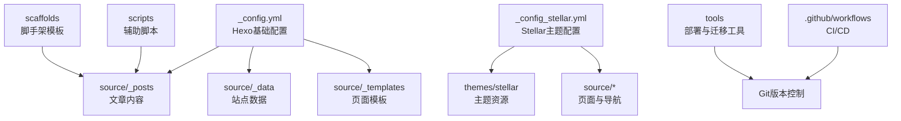
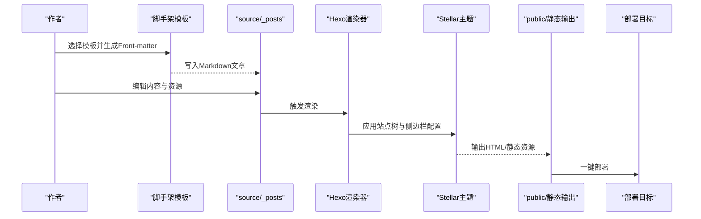
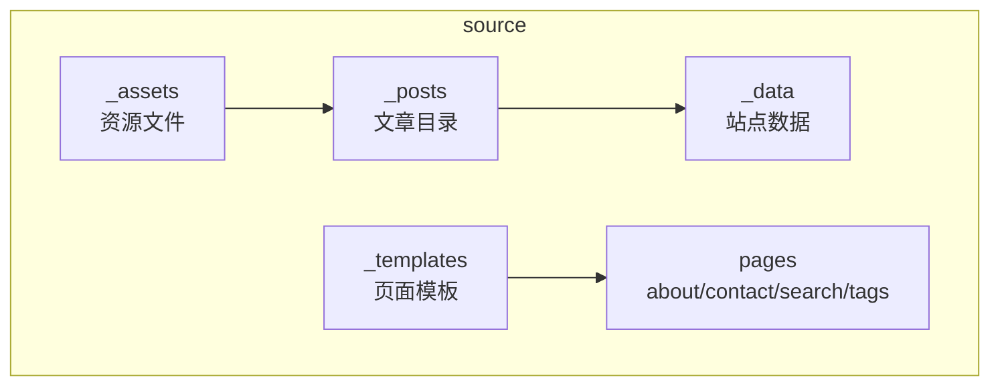
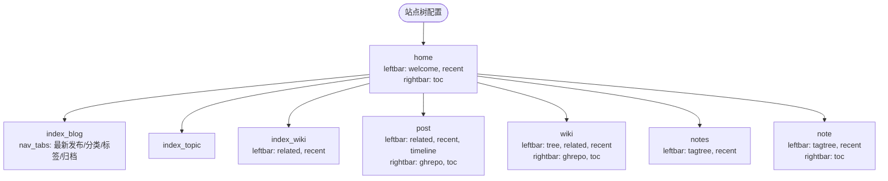
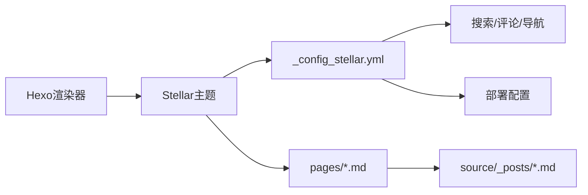

# 内容组织

<cite>
**本文引用的文件**
- [_config.yml](file://_config.yml)
- [_config_stellar.yml](file://_config_stellar.yml)
- [_config.anzhiyu.yml](file://_config.anzhiyu.yml)
- [scaffolds/post.md](file://scaffolds/post.md)
- [scaffolds/draft.md](file://scaffolds/draft.md)
- [scaffolds/page.md](file://scaffolds/page.md)
- [scaffolds/topic.md](file://scaffolds/topic.md)
- [scaffolds/wiki.md](file://scaffolds/wiki.md)
- [source/_posts/Linux/linux.md](file://source/_posts/Linux/linux.md)
- [source/_posts/blog/hexo搭建.md](file://source/_posts/blog/hexo搭建.md)
- [source/_posts/About-Me.md](file://source/_posts/About-Me.md)
- [source/_posts/hello-world.md](file://source/_posts/hello-world.md)
</cite>

## 目录
1. [简介](#简介)
2. [项目结构](#项目结构)
3. [核心组件](#核心组件)
4. [架构总览](#架构总览)
5. [详细组件分析](#详细组件分析)
6. [依赖分析](#依赖分析)
7. [性能考虑](#性能考虑)
8. [故障排除指南](#故障排除指南)
9. [结论](#结论)
10. [附录](#附录)

## 简介
本文件面向H1S97X博客的内容组织系统，围绕Hexo + Stellar主题的博客工程，系统阐述内容目录结构设计、文件命名规范、分类与标签体系、索引与导航配置、版本管理与迁移策略，以及最佳实践与可复用的配置模板。文档旨在帮助内容创作者与维护者高效组织与扩展博客内容，确保一致性与可维护性。

## 项目结构
本仓库采用标准Hexo工程结构，结合Stellar主题的站点树与侧边栏配置，形成“内容源文件 + 主题配置 + 脚手架 + 工具”的组织方式。核心目录与职责如下：
- 根配置：_config.yml（Hexo基础配置）、_config_stellar.yml（Stellar主题配置）、_config.anzhiyu.yml（备用主题配置）
- 内容源：source/_posts（文章）、source/_data（数据）、source/_templates（模板）、source/_assets（资源）
- 页面与静态：source/about/index.md、source/contact/index.md、source/search/index.md、source/tags/index.md
- 脚手架：scaffolds（post/draft/page/topic/wiki）
- 主题与脚本：themes（主题）、scripts（阅读时长等辅助脚本）
- 工具与工作流：tools（部署、校验、迁移等）、.github/workflows（CI）

**图表来源**
- [_config.yml](file://_config.yml#L1-L136)
- [_config_stellar.yml](file://_config_stellar.yml#L1-L699)
- [scaffolds/post.md](file://scaffolds/post.md#L1-L77)

**章节来源**
- [scaffolds/post.md](file://scaffolds/post.md#L1-L77)
- [_config.yml](file://_config.yml#L1-L136)
- [_config_stellar.yml](file://_config_stellar.yml#L1-L699)

## 核心组件
- 内容源目录（source/_posts）：存放Markdown文章，遵循Front-matter约定与分类/标签体系
- 脚手架（scaffolds）：提供post/draft/page/topic/wiki的标准化模板，统一Front-matter字段与默认配置
- 主题配置（_config_stellar.yml）：定义站点树、侧边栏组件、导航标签、搜索与评论等
- 根配置（_config.yml）：定义URL、目录、分页、RSS、部署等基础行为
- 页面与索引（source/about、source/tags、source/search等）：提供静态页面与索引入口

**章节来源**
- [scaffolds/post.md](file://scaffolds/post.md#L1-L77)
- [scaffolds/draft.md](file://scaffolds/draft.md#L1-L48)
- [scaffolds/page.md](file://scaffolds/page.md#L1-L57)
- [scaffolds/topic.md](file://scaffolds/topic.md#L1-L89)
- [scaffolds/wiki.md](file://scaffolds/wiki.md#L1-L84)
- [_config_stellar.yml](file://_config_stellar.yml#L36-L121)
- [_config.yml](file://_config.yml#L1-L136)

## 架构总览
内容组织的运行时流程：作者通过脚手架创建文章 → 写入source/_posts → Hexo渲染 → 生成静态页面 → 部署到目标站点。Stellar主题通过站点树与侧边栏配置，将内容组织为“主页/博客列表/专题/文档/笔记本/页面”等页面类型，并提供导航、目录树、搜索、评论等组件。

**图表来源**
- [_config.yml](file://_config.yml#L104-L136)
- [_config_stellar.yml](file://_config_stellar.yml#L36-L121)
- [scaffolds/post.md](file://scaffolds/post.md#L1-L77)

## 详细组件分析

### 目录结构与组织原则
- source/_posts：按主题/领域分目录（如Linux、blog、服务器、游戏攻略等），便于分类浏览与检索
- source/_data：站点数据（如wiki.yml、widgets.yml、wiki/stellar.yml），用于主题渲染与侧边栏
- source/_templates：页面模板（coding/note/post），统一页面结构
- source/_assets：资源文件（图片、PDF、代码等），建议与文章同名或按主题分组
- source/about、source/contact、source/search、source/tags：静态页面与索引入口

**图表来源**
- [_config.yml](file://_config.yml#L28-L35)
- [_config_stellar.yml](file://_config_stellar.yml#L36-L121)

**章节来源**
- [_config.yml](file://_config.yml#L28-L35)
- [_config_stellar.yml](file://_config_stellar.yml#L36-L121)

### 文件命名规范与日期格式
- 文章文件名建议采用“YYYYMMDD-HHMMSS-作者-主题.md”格式，确保按时间排序与可读性
- Front-matter中的date与updated字段用于控制发布时间与更新时间
- 日期格式由根配置统一设置（如YYYY-MM-DD），确保生成链接与RSS一致

**章节来源**
- [_config.yml](file://_config.yml#L85-L88)
- [scaffolds/post.md](file://scaffolds/post.md#L2-L4)

### 分类与标签体系
- 分类（categories）：用于宏观主题划分（如技术开发、系统运维、游戏世界、学术学习、个人随笔、软件工具）
- 标签（tags）：用于细粒度标记（如Linux、Hexo、网络安全、密码学等）
- 默认分类（default_category）与映射（category_map/tag_map）可在根配置中统一管理

**章节来源**
- [_config.yml](file://_config.yml#L72-L76)
- [scaffolds/post.md](file://scaffolds/post.md#L11-L17)

### 站点树与导航配置
- 站点树（site_tree）定义页面类型与侧边栏组件（leftbar/rightbar），如主页、博客列表、专题、文档、笔记本、笔记页等
- 导航标签（nav_tabs）为博客列表页提供“最新发布/分类/标签/归档”等导航
- 侧边栏组件包括recent、related、timeline、toc、tree、ghrepo等，按页面类型启用

**图表来源**
- [_config_stellar.yml](file://_config_stellar.yml#L36-L121)

**章节来源**
- [_config_stellar.yml](file://_config_stellar.yml#L36-L121)

### 内容索引与搜索
- 本地搜索（local_search）：可配置搜索范围（post/page/all）、是否索引内容、跳过路径等
- Algolia搜索：可选的全文搜索方案（需配置appId、apiKey、indexName）
- 搜索结果页面：通过生成器与模板提供搜索入口与结果展示

**章节来源**
- [_config_stellar.yml](file://_config_stellar.yml#L175-L189)

### 评论系统与社交
- 评论服务：giscus、twikoo、waline、artalk等，支持懒加载与主题适配
- 社交链接：在主题配置中定义，用于页脚与侧边栏展示

**章节来源**
- [_config_stellar.yml](file://_config_stellar.yml#L191-L301)

### 版本管理与备份策略
- Git版本控制：通过根配置的deploy字段与CI/CD工作流实现一键部署
- 备份建议：定期导出source/_posts与source/_data，使用Git分支隔离重大变更，配合GitHub Releases进行版本归档
- 内容迁移：通过脚本批量重写Front-matter或迁移目录结构，确保URL与链接一致性

**章节来源**
- [_config.yml](file://_config.yml#L130-L136)
- [.github/workflows](file://.github/workflows)

### 内容组织最佳实践
- 使用脚手架统一Front-matter字段，减少遗漏
- 为文章设置明确的categories与tags，提升可发现性
- 合理使用侧边栏组件（toc、tree、related等），优化阅读体验
- 保持目录层级清晰，避免过深嵌套
- 使用语义化文件名与资源命名，便于检索与维护

**章节来源**
- [scaffolds/post.md](file://scaffolds/post.md#L1-L77)
- [_config_stellar.yml](file://_config_stellar.yml#L36-L121)

## 依赖分析
- Hexo渲染器依赖：Front-matter字段、Markdown语法、主题模板
- 主题依赖：站点树配置、侧边栏组件、搜索与评论插件
- 部署依赖：Git仓库、SSH/Git凭证、CI/CD工作流

**图表来源**
- [_config_stellar.yml](file://_config_stellar.yml#L36-L121)
- [_config.yml](file://_config.yml#L104-L136)

**章节来源**
- [_config_stellar.yml](file://_config_stellar.yml#L36-L121)
- [_config.yml](file://_config.yml#L104-L136)

## 性能考虑
- 合理使用侧边栏组件，避免过多异步加载
- 控制图片与资源尺寸，减少首屏加载时间
- 使用本地搜索与懒加载评论，降低初始渲染压力
- 通过分页与归档减少单页内容体量

[本节为通用指导，无需引用具体文件]

## 故障排除指南
- Nunjucks解析错误：Front-matter或内容中包含未转义的{{}}或，可用raw标签包裹或转义
- 部署失败：检查deploy配置、SSH密钥与仓库权限
- 评论不显示：确认评论服务配置与懒加载设置

**章节来源**
- [source/_posts/blog/hexo搭建.md](file://source/_posts/blog/hexo搭建.md#L118-L124)
- [_config.yml](file://_config.yml#L130-L136)
- [_config_stellar.yml](file://_config_stellar.yml#L191-L301)

## 结论
通过标准化的目录结构、脚手架模板与主题配置，H1S97X博客实现了内容的有序组织与高效渲染。遵循本文的命名规范、分类标签体系与最佳实践，可显著提升内容创作与维护效率，并为未来的扩展与迁移奠定坚实基础。

[本节为总结性内容，无需引用具体文件]

## 附录

### 目录结构示例
- source/_posts/Linux/linux.md
- source/_posts/blog/hexo搭建.md
- source/_posts/About-Me.md
- source/_posts/hello-world.md

**章节来源**
- [source/_posts/Linux/linux.md](file://source/_posts/Linux/linux.md#L1-L800)
- [source/_posts/blog/hexo搭建.md](file://source/_posts/blog/hexo搭建.md#L1-L134)
- [source/_posts/About-Me.md](file://source/_posts/About-Me.md#L1-L11)
- [source/_posts/hello-world.md](file://source/_posts/hello-world.md#L1-L39)

### 配置模板（片段）
- 根配置（_config.yml）：站点信息、URL、目录、分页、RSS、部署
- 主题配置（_config_stellar.yml）：站点树、导航标签、侧边栏组件、搜索与评论
- 脚手架模板（scaffolds/post.md）：统一Front-matter字段与默认配置

**章节来源**
- [_config.yml](file://_config.yml#L1-L136)
- [_config_stellar.yml](file://_config_stellar.yml#L36-L121)
- [scaffolds/post.md](file://scaffolds/post.md#L1-L77)