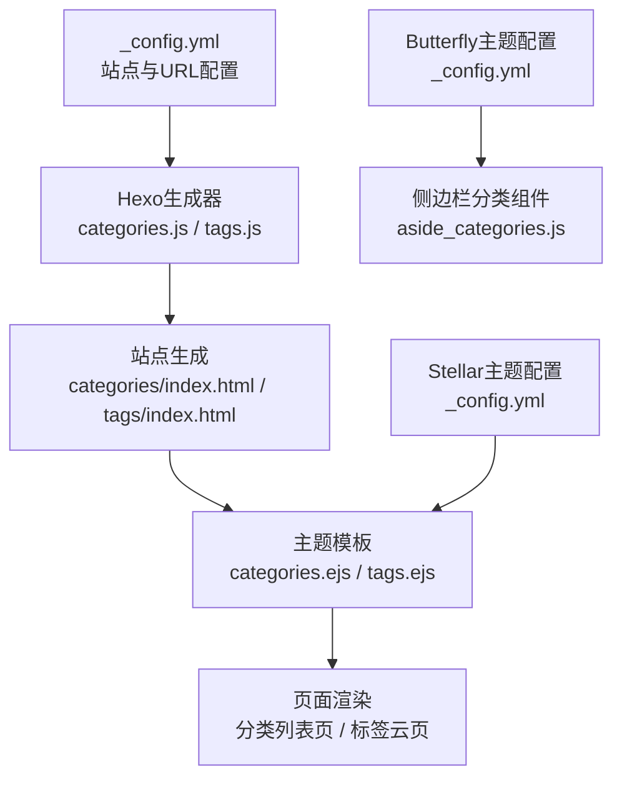
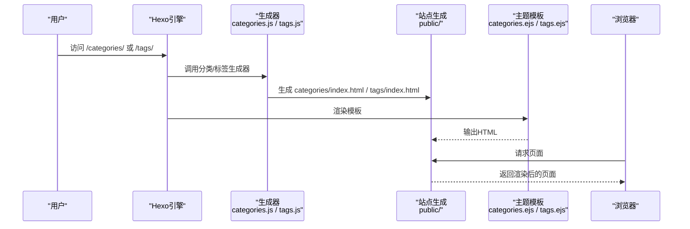
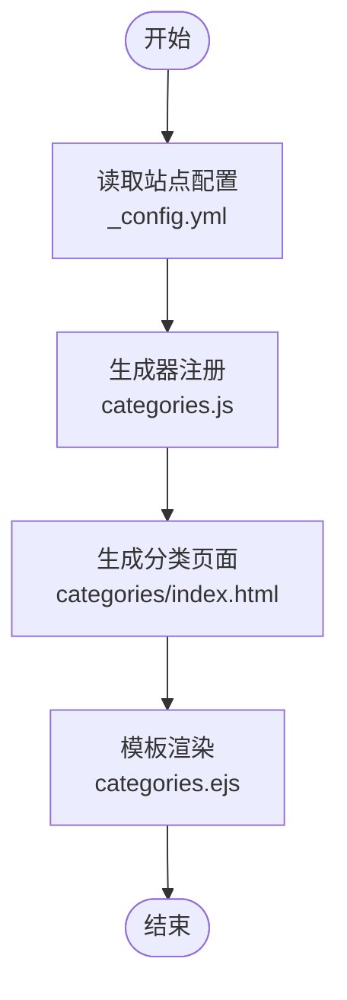
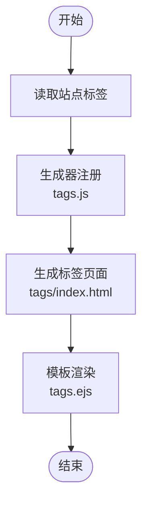
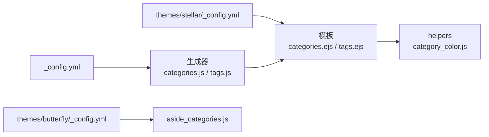

# 分类标签管理

<cite>
**本文引用的文件**
- [_config.yml](file://_config.yml)
- [themes/stellar/_config.yml](file://themes/stellar/_config.yml)
- [themes/stellar/scripts/generators/categories.js](file://themes/stellar/scripts/generators/categories.js)
- [themes/stellar/scripts/generators/tags.js](file://themes/stellar/scripts/generators/tags.js)
- [themes/stellar/layout/categories.ejs](file://themes/stellar/layout/categories.ejs)
- [themes/stellar/layout/tags.ejs](file://themes/stellar/layout/tags.ejs)
- [themes/stellar/scripts/helpers/category_color.js](file://themes/stellar/scripts/helpers/category_color.js)
- [themes/butterfly/_config.yml](file://themes/butterfly/_config.yml)
- [themes/butterfly/scripts/helpers/aside_categories.js](file://themes/butterfly/scripts/helpers/aside_categories.js)
- [docs/BLOG_CLASSIFICATION_ANALYSIS.md](file://docs/BLOG_CLASSIFICATION_ANALYSIS.md)
- [source/_posts/hello-world.md](file://source/_posts/hello-world.md)
- [source/_posts/Linux基础.md](file://source/_posts/Linux基础.md)
- [source/_posts/CTF-网络安全夺旗赛.md](file://source/_posts/CTF-网络安全夺旗赛.md)
- [source/_posts/blog/hexo搭建.md](file://source/_posts/blog/hexo搭建.md)
</cite>

## 目录
1. [简介](#简介)
2. [项目结构](#项目结构)
3. [核心组件](#核心组件)
4. [架构总览](#架构总览)
5. [详细组件分析](#详细组件分析)
6. [依赖分析](#依赖分析)
7. [性能考量](#性能考量)
8. [故障排查指南](#故障排查指南)
9. [结论](#结论)
10. [附录](#附录)

## 简介
本文件面向H1S97X博客的分类标签系统，提供从配置到使用、从SEO优化到最佳实践的完整说明。文档聚焦于：
- 分类系统的层级结构配置（一级分类与二级分类）
- 标签系统的使用（标签云生成、标签页面显示、标签过滤）
- Front-matter中的分类与标签配置方法
- SEO优化（URL结构与元数据）
- 分类标签管理的最佳实践（命名规范、层级设计、维护策略）
- 配置示例与实际使用案例

## 项目结构
H1S97X博客基于Hexo，主题采用Stellar（默认主题），并辅以Butterfly的部分配置与组件。分类与标签功能由Hexo默认生成器与Stellar主题模板共同实现。

**图表来源**
- [_config.yml](file://_config.yml#L1-L136)
- [themes/stellar/scripts/generators/categories.js](file://themes/stellar/scripts/generators/categories.js#L1-L16)
- [themes/stellar/scripts/generators/tags.js](file://themes/stellar/scripts/generators/tags.js#L1-L16)
- [themes/stellar/layout/categories.ejs](file://themes/stellar/layout/categories.ejs#L1-L24)
- [themes/stellar/layout/tags.ejs](file://themes/stellar/layout/tags.ejs#L1-L21)
- [themes/stellar/_config.yml](file://themes/stellar/_config.yml#L1-L725)
- [themes/butterfly/_config.yml](file://themes/butterfly/_config.yml#L1-L987)
- [themes/butterfly/scripts/helpers/aside_categories.js](file://themes/butterfly/scripts/helpers/aside_categories.js#L74-L97)

**章节来源**
- [themes/stellar/scripts/generators/categories.js](file://themes/stellar/scripts/generators/categories.js#L1-L16)
- [themes/stellar/scripts/generators/tags.js](file://themes/stellar/scripts/generators/tags.js#L1-L16)
- [themes/stellar/layout/categories.ejs](file://themes/stellar/layout/categories.ejs#L1-L24)
- [themes/stellar/layout/tags.ejs](file://themes/stellar/layout/tags.ejs#L1-L21)
- [themes/stellar/_config.yml](file://themes/stellar/_config.yml#L1-L725)
- [themes/butterfly/_config.yml](file://themes/butterfly/_config.yml#L1-L987)
- [themes/butterfly/scripts/helpers/aside_categories.js](file://themes/butterfly/scripts/helpers/aside_categories.js#L74-L97)

## 核心组件
- 站点配置与URL
  - 站点URL、永久链接、目录结构、默认分类与标签映射等由根配置文件统一管理。
- 分类与标签生成器
  - 通过主题提供的生成器注册分类与标签的自动生成页面。
- 分类与标签模板
  - 使用主题模板渲染分类列表与标签云，支持排序与链接生成。
- 分类颜色助手
  - 为主题中的分类提供颜色样式注入，提升视觉一致性。
- 侧边栏分类组件（可选）
  - Butterfly主题的侧边栏分类组件支持层级化展示与展开/收起。

**章节来源**
- [_config.yml](file://_config.yml#L1-L136)
- [themes/stellar/scripts/generators/categories.js](file://themes/stellar/scripts/generators/categories.js#L1-L16)
- [themes/stellar/scripts/generators/tags.js](file://themes/stellar/scripts/generators/tags.js#L1-L16)
- [themes/stellar/layout/categories.ejs](file://themes/stellar/layout/categories.ejs#L1-L24)
- [themes/stellar/layout/tags.ejs](file://themes/stellar/layout/tags.ejs#L1-L21)
- [themes/stellar/scripts/helpers/category_color.js](file://themes/stellar/scripts/helpers/category_color.js#L1-L23)
- [themes/butterfly/scripts/helpers/aside_categories.js](file://themes/butterfly/scripts/helpers/aside_categories.js#L74-L97)

## 架构总览
分类与标签的生成与渲染流程如下：

**图表来源**
- [themes/stellar/scripts/generators/categories.js](file://themes/stellar/scripts/generators/categories.js#L5-L15)
- [themes/stellar/scripts/generators/tags.js](file://themes/stellar/scripts/generators/tags.js#L5-L15)
- [themes/stellar/layout/categories.ejs](file://themes/stellar/layout/categories.ejs#L7-L23)
- [themes/stellar/layout/tags.ejs](file://themes/stellar/layout/tags.ejs#L7-L20)

## 详细组件分析

### 分类系统
- 层级结构配置
  - 一级分类：在Front-matter中设置categories数组，支持单个或多个分类。
  - 二级分类：主题配置中可为分类设置颜色，渲染时可结合颜色样式。
- 生成与显示
  - 生成器会为存在分类的站点生成分类列表页。
  - 模板遍历分类并按路径排序，输出分类链接与文章计数。
- URL与SEO
  - 分类目录由配置文件控制，配合主题配置可统一URL风格。

**图表来源**
- [_config.yml](file://_config.yml#L28-L35)
- [themes/stellar/scripts/generators/categories.js](file://themes/stellar/scripts/generators/categories.js#L5-L15)
- [themes/stellar/layout/categories.ejs](file://themes/stellar/layout/categories.ejs#L7-L23)

**章节来源**
- [themes/stellar/scripts/generators/categories.js](file://themes/stellar/scripts/generators/categories.js#L1-L16)
- [themes/stellar/layout/categories.ejs](file://themes/stellar/layout/categories.ejs#L1-L24)
- [themes/stellar/_config.yml](file://themes/stellar/_config.yml#L194-L196)

### 标签系统
- 标签云生成
  - 生成器为存在标签的站点生成标签云页。
  - 模板按标签数量降序排列，输出标签链接。
- 标签页面显示与过滤
  - 模板输出标签云，点击可进入标签详情页（由Hexo默认生成）。
  - 可结合主题侧边栏组件实现标签过滤与导航。

**图表来源**
- [themes/stellar/scripts/generators/tags.js](file://themes/stellar/scripts/generators/tags.js#L5-L15)
- [themes/stellar/layout/tags.ejs](file://themes/stellar/layout/tags.ejs#L7-L20)

**章节来源**
- [themes/stellar/scripts/generators/tags.js](file://themes/stellar/scripts/generators/tags.js#L1-L16)
- [themes/stellar/layout/tags.ejs](file://themes/stellar/layout/tags.ejs#L1-L21)

### Front-matter中的分类与标签配置
- 分类配置
  - 在Front-matter中设置categories数组，支持多级分类（如一级分类下再细分子分类）。
- 标签配置
  - 在Front-matter中设置tags数组，支持多个标签。
- 示例参考
  - 示例文章展示了Front-matter的基本结构与分类/标签字段。

**章节来源**
- [source/_posts/hello-world.md](file://source/_posts/hello-world.md#L1-L39)
- [source/_posts/Linux基础.md](file://source/_posts/Linux基础.md#L1-L800)
- [source/_posts/CTF-网络安全夺旗赛.md](file://source/_posts/CTF-网络安全夺旗赛.md#L1-L16)
- [source/_posts/blog/hexo搭建.md](file://source/_posts/blog/hexo搭建.md#L1-L104)

### SEO优化配置
- URL结构
  - 通过站点配置控制永久链接与目录结构，确保分类与标签URL简洁一致。
- 元数据
  - 可结合主题配置启用Open Graph、结构化数据等，提升搜索引擎识别度。
- robots与索引
  - 模板中可设置页面robots策略，避免重复索引。

**章节来源**
- [_config.yml](file://_config.yml#L18-L35)
- [themes/stellar/layout/categories.ejs](file://themes/stellar/layout/categories.ejs#L2)
- [themes/stellar/layout/tags.ejs](file://themes/stellar/layout/tags.ejs#L2)
- [themes/stellar/_config.yml](file://themes/stellar/_config.yml#L25-L31)

### 分类颜色与视觉一致性
- 主题助手
  - 通过分类颜色助手为分类注入CSS变量，实现统一的文本与背景色。
- 配置入口
  - 在主题配置中为分类设置颜色映射，渲染时自动应用。

**章节来源**
- [themes/stellar/scripts/helpers/category_color.js](file://themes/stellar/scripts/helpers/category_color.js#L1-L23)
- [themes/stellar/_config.yml](file://themes/stellar/_config.yml#L194-L196)

### 侧边栏分类与标签（可选）
- 侧边栏分类
  - Butterfly主题提供侧边栏分类组件，支持层级化展示与“更多”按钮。
- 标签云
  - 可在侧边栏配置标签云组件，支持随机排序与限制数量。

**章节来源**
- [themes/butterfly/_config.yml](file://themes/butterfly/_config.yml#L243-L247)
- [themes/butterfly/_config.yml](file://themes/butterfly/_config.yml#L248-L254)
- [themes/butterfly/scripts/helpers/aside_categories.js](file://themes/butterfly/scripts/helpers/aside_categories.js#L74-L97)

## 依赖分析
- 配置依赖
  - 站点配置决定URL与目录结构；主题配置决定模板行为与样式。
- 生成器依赖
  - 生成器依赖Hexo本地数据（categories/tags），并在存在数据时生成页面。
- 模板依赖
  - 模板依赖主题配置与helpers，渲染分类列表与标签云。
- 主题组件依赖
  - 侧边栏组件依赖主题配置与Hexo数据，提供层级化导航。

**图表来源**
- [_config.yml](file://_config.yml#L28-L35)
- [themes/stellar/scripts/generators/categories.js](file://themes/stellar/scripts/generators/categories.js#L5-L15)
- [themes/stellar/scripts/generators/tags.js](file://themes/stellar/scripts/generators/tags.js#L5-L15)
- [themes/stellar/layout/categories.ejs](file://themes/stellar/layout/categories.ejs#L7-L23)
- [themes/stellar/layout/tags.ejs](file://themes/stellar/layout/tags.ejs#L7-L20)
- [themes/stellar/scripts/helpers/category_color.js](file://themes/stellar/scripts/helpers/category_color.js#L1-L23)
- [themes/butterfly/_config.yml](file://themes/butterfly/_config.yml#L243-L247)
- [themes/butterfly/scripts/helpers/aside_categories.js](file://themes/butterfly/scripts/helpers/aside_categories.js#L74-L97)

**章节来源**
- [_config.yml](file://_config.yml#L1-L136)
- [themes/stellar/_config.yml](file://themes/stellar/_config.yml#L1-L725)

## 性能考量
- 生成器条件渲染
  - 仅在存在分类或标签时生成对应页面，避免无效页面生成。
- 模板排序
  - 标签按数量排序，分类按路径排序，减少前端处理负担。
- 侧边栏组件
  - 可限制显示数量与排序方式，降低页面渲染压力。

[本节为通用指导，无需引用具体文件]

## 故障排查指南
- 分类/标签页面为空
  - 检查站点配置中分类/标签目录是否正确。
  - 确认文章Front-matter中是否设置了分类/标签。
- URL不生效或404
  - 检查永久链接与目录配置，确保与主题生成器输出一致。
- 标签云显示异常
  - 检查模板排序逻辑与标签数量统计。
- 分类颜色不生效
  - 检查主题配置中的分类颜色映射与助手调用。

**章节来源**
- [_config.yml](file://_config.yml#L28-L35)
- [themes/stellar/layout/categories.ejs](file://themes/stellar/layout/categories.ejs#L7-L23)
- [themes/stellar/layout/tags.ejs](file://themes/stellar/layout/tags.ejs#L7-L20)
- [themes/stellar/scripts/helpers/category_color.js](file://themes/stellar/scripts/helpers/category_color.js#L1-L23)

## 结论
H1S97X博客的分类标签系统依托Hexo默认生成器与Stellar主题模板实现，具备清晰的层级结构与良好的可维护性。通过合理的Front-matter配置、主题配置与SEO设置，可实现高质量的内容组织与用户体验。建议在实践中遵循命名规范与层级设计，持续优化标签体系与维护策略。

[本节为总结性内容，无需引用具体文件]

## 附录

### 配置示例与最佳实践
- 分类与标签命名规范
  - 使用清晰、一致的命名，避免过长或歧义。
- 分类层级设计
  - 建议不超过两级，保持扁平化与易用性。
- 标签体系
  - 建议围绕技术栈、平台、技能与内容类型建立标签体系。
- 自动化与人工审核
  - 通过内容分析与关键词自动生成标签，再进行人工审核与优化。

**章节来源**
- [docs/BLOG_CLASSIFICATION_ANALYSIS.md](file://docs/BLOG_CLASSIFICATION_ANALYSIS.md#L80-L175)

### 实际使用案例
- Front-matter示例
  - 参考示例文章的Front-matter结构，设置title、date、categories、tags等字段。
- 分类与标签应用
  - 在文章中正确设置categories与tags，确保生成器与模板能正确识别与渲染。

**章节来源**
- [source/_posts/hello-world.md](file://source/_posts/hello-world.md#L1-L39)
- [source/_posts/Linux基础.md](file://source/_posts/Linux基础.md#L1-L800)
- [source/_posts/CTF-网络安全夺旗赛.md](file://source/_posts/CTF-网络安全夺旗赛.md#L1-L16)
- [source/_posts/blog/hexo搭建.md](file://source/_posts/blog/hexo搭建.md#L1-L104)