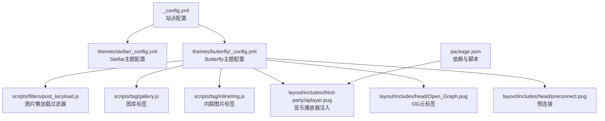
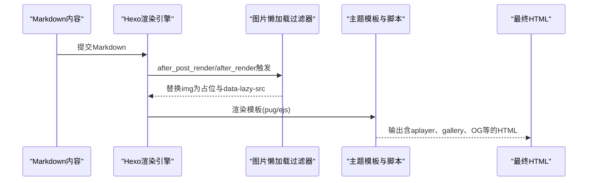
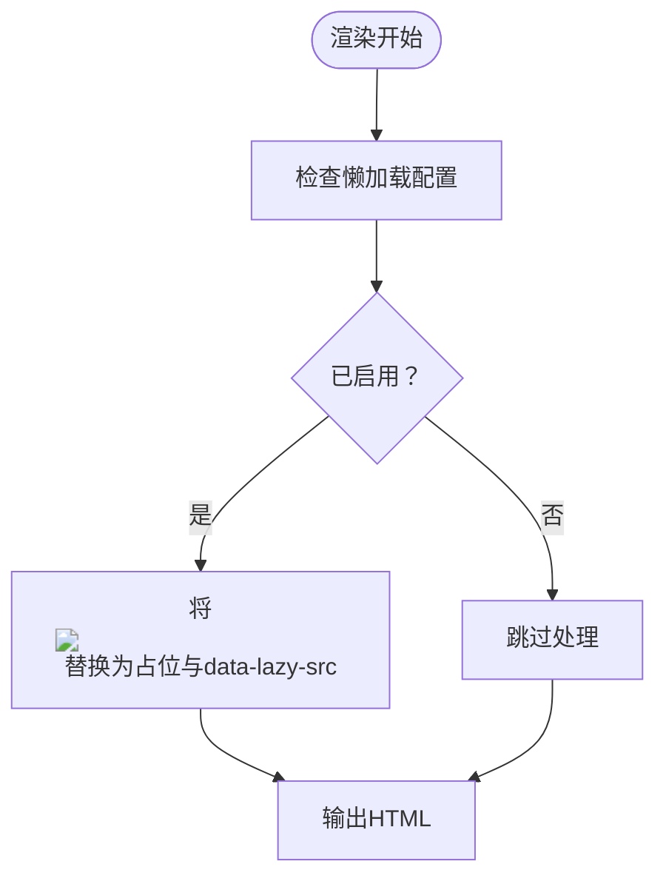
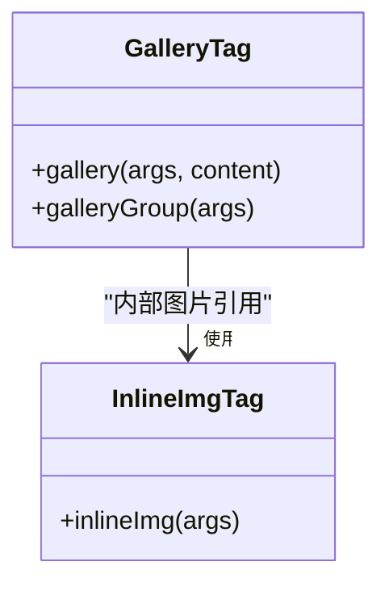
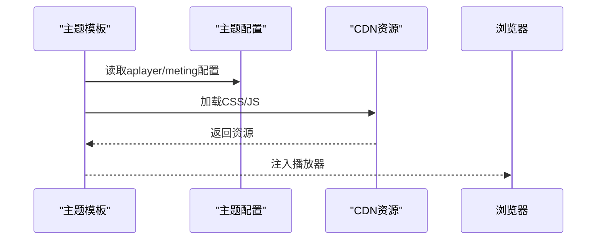
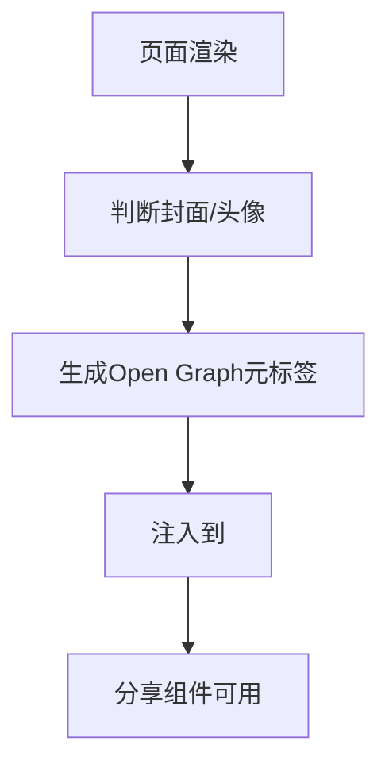
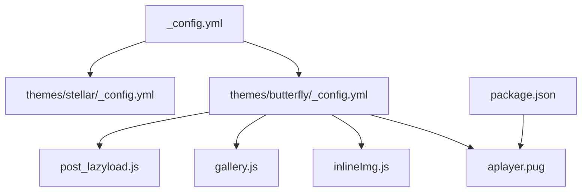

# 媒体资源管理

<cite>
**本文引用的文件**
- [_config.yml](file://_config.yml)
- [themes/butterfly/_config.yml](file://themes/butterfly/_config.yml)
- [themes/stellar/_config.yml](file://themes/stellar/_config.yml)
- [themes/butterfly/scripts/filters/post_lazyload.js](file://themes/butterfly/scripts/filters/post_lazyload.js)
- [themes/butterfly/scripts/tag/gallery.js](file://themes/butterfly/scripts/tag/gallery.js)
- [themes/butterfly/scripts/tag/inlineImg.js](file://themes/butterfly/scripts/tag/inlineImg.js)
- [themes/butterfly/layout/includes/third-party/aplayer.pug](file://themes/butterfly/layout/includes/third-party/aplayer.pug)
- [themes/butterfly/layout/includes/head/Open_Graph.pug](file://themes/butterfly/layout/includes/head/Open_Graph.pug)
- [themes/butterfly/layout/includes/head/preconnect.pug](file://themes/butterfly/layout/includes/head/preconnect.pug)
- [package.json](file://package.json)
</cite>

## 目录
1. [简介](#简介)
2. [项目结构](#项目结构)
3. [核心组件](#核心组件)
4. [架构总览](#架构总览)
5. [详细组件分析](#详细组件分析)
6. [依赖关系分析](#依赖关系分析)
7. [性能考量](#性能考量)
8. [故障排查指南](#故障排查指南)
9. [结论](#结论)
10. [附录](#附录)

## 简介
本文件面向H1S97X博客的媒体资源管理，聚焦以下目标：
- 图片资源的组织与管理：上传、压缩与优化策略
- 视频与音频资源的嵌入：HTML5播放器配置与响应式设计
- 多媒体内容的懒加载：性能优化与体验提升
- 资源路径管理与引用：相对路径与绝对路径的选择
- 最佳实践：命名规范、存储结构、缓存策略
- 具体示例与配置说明：基于仓库现有实现提炼

## 项目结构
H1S97X博客基于Hexo静态站点生成器，主题采用Stellar与Butterfly组合。媒体资源管理涉及：
- 站点配置：控制URL、路径、部署等
- 主题配置：控制图片占位、懒加载、图库、分享、预连接等
- 渲染过滤器：对HTML内容进行二次加工（如图片懒加载）
- 标签插件：提供gallery、inlineImg等媒体展示能力
- 外部播放器与第三方集成：音乐播放器、Open Graph、预连接等

**图表来源**
- [_config.yml](file://_config.yml#L1-L136)
- [themes/stellar/_config.yml](file://themes/stellar/_config.yml#L1-L725)
- [themes/butterfly/_config.yml](file://themes/butterfly/_config.yml#L1-L987)
- [themes/butterfly/scripts/filters/post_lazyload.js](file://themes/butterfly/scripts/filters/post_lazyload.js#L1-L30)
- [themes/butterfly/scripts/tag/gallery.js](file://themes/butterfly/scripts/tag/gallery.js#L1-L70)
- [themes/butterfly/scripts/tag/inlineImg.js](file://themes/butterfly/scripts/tag/inlineImg.js#L1-L17)
- [themes/butterfly/layout/includes/third-party/aplayer.pug](file://themes/butterfly/layout/includes/third-party/aplayer.pug#L1-L3)
- [themes/butterfly/layout/includes/head/Open_Graph.pug](file://themes/butterfly/layout/includes/head/Open_Graph.pug#L1-L14)
- [themes/butterfly/layout/includes/head/preconnect.pug](file://themes/butterfly/layout/includes/head/preconnect.pug#L1-L19)
- [package.json](file://package.json#L1-L94)

**章节来源**
- [themes/butterfly/_config.yml](file://themes/butterfly/_config.yml#L1-L987)
- [themes/stellar/_config.yml](file://themes/stellar/_config.yml#L1-L725)
- [_config.yml](file://_config.yml#L1-L136)
- [package.json](file://package.json#L1-L94)

## 核心组件
- 图片懒加载过滤器：在渲染阶段将img的src替换为占位图与data-lazy-src，结合主题懒加载配置实现延迟加载
- 图库标签：支持Markdown内联图片集合与URL直传两种模式，生成瀑布流图库并可选懒加载
- 内联图片标签：提供内联图片插入能力，支持高度控制
- 音乐播放器注入：通过aplayer与meting集成，按需加载CSS/JS
- Open Graph与预连接：为分享与CDN加速提供OG元标签与预连接
- 站点与主题配置：统一管理URL、路径、CDN、第三方服务等

**章节来源**
- [themes/butterfly/scripts/filters/post_lazyload.js](file://themes/butterfly/scripts/filters/post_lazyload.js#L1-L30)
- [themes/butterfly/scripts/tag/gallery.js](file://themes/butterfly/scripts/tag/gallery.js#L1-L70)
- [themes/butterfly/scripts/tag/inlineImg.js](file://themes/butterfly/scripts/tag/inlineImg.js#L1-L17)
- [themes/butterfly/layout/includes/third-party/aplayer.pug](file://themes/butterfly/layout/includes/third-party/aplayer.pug#L1-L3)
- [themes/butterfly/layout/includes/head/Open_Graph.pug](file://themes/butterfly/layout/includes/head/Open_Graph.pug#L1-L14)
- [themes/butterfly/layout/includes/head/preconnect.pug](file://themes/butterfly/layout/includes/head/preconnect.pug#L1-L19)
- [themes/butterfly/_config.yml](file://themes/butterfly/_config.yml#L1-L987)
- [themes/stellar/_config.yml](file://themes/stellar/_config.yml#L1-L725)
- [_config.yml](file://_config.yml#L1-L136)

## 架构总览
媒体资源管理在Hexo渲染流水线中的位置如下：

**图表来源**
- [themes/butterfly/scripts/filters/post_lazyload.js](file://themes/butterfly/scripts/filters/post_lazyload.js#L16-L29)
- [themes/butterfly/layout/includes/third-party/aplayer.pug](file://themes/butterfly/layout/includes/third-party/aplayer.pug#L1-L3)
- [themes/butterfly/layout/includes/head/Open_Graph.pug](file://themes/butterfly/layout/includes/head/Open_Graph.pug#L1-L14)

## 详细组件分析

### 图片懒加载（图片上传、压缩与优化策略）
- 实现机制
  - 在渲染阶段，过滤器将img的src替换为占位图与data-lazy-src，从而推迟真实图片加载
  - 支持站点级与文章级开关，通过主题配置控制
- 上传与优化建议
  - 优先使用现代格式（WebP/JPEG XL）并在CDN上按需转换
  - 上传前压缩（尺寸与质量），按设备像素比准备多套尺寸
  - 使用懒加载占位图（如低分辨率模糊图或骨架屏）提升感知性能
- 配置要点
  - 启用/禁用：在主题配置中开启图片懒加载
  - 占位图：可配置占位图URL或使用默认Base64占位
  - 作用范围：站点级或文章级

**图表来源**
- [themes/butterfly/scripts/filters/post_lazyload.js](file://themes/butterfly/scripts/filters/post_lazyload.js#L11-L14)
- [themes/butterfly/scripts/filters/post_lazyload.js](file://themes/butterfly/scripts/filters/post_lazyload.js#L16-L29)

**章节来源**
- [themes/butterfly/scripts/filters/post_lazyload.js](file://themes/butterfly/scripts/filters/post_lazyload.js#L1-L30)
- [themes/butterfly/_config.yml](file://themes/butterfly/_config.yml#L1-L987)

### 图库与内联图片（图片组织与展示）
- 图库标签
  - 支持两种模式：Markdown内联图片集合与URL直传
  - 可配置行高、数量限制、是否懒加载
  - 生成瀑布流布局，支持“加载更多”
- 内联图片标签
  - 提供内联图片插入，支持指定高度
- 最佳实践
  - 图库：按主题/系列分组，合理设置rowHeight与limit
  - 内联：配合段落与标题，控制视觉密度
  - 路径：优先使用相对路径，确保在不同部署环境下可用

**图表来源**
- [themes/butterfly/scripts/tag/gallery.js](file://themes/butterfly/scripts/tag/gallery.js#L13-L48)
- [themes/butterfly/scripts/tag/gallery.js](file://themes/butterfly/scripts/tag/gallery.js#L50-L66)
- [themes/butterfly/scripts/tag/inlineImg.js](file://themes/butterfly/scripts/tag/inlineImg.js#L10-L15)

**章节来源**
- [themes/butterfly/scripts/tag/gallery.js](file://themes/butterfly/scripts/tag/gallery.js#L1-L70)
- [themes/butterfly/scripts/tag/inlineImg.js](file://themes/butterfly/scripts/tag/inlineImg.js#L1-L17)

### 音频资源嵌入（HTML5播放器配置与响应式设计）
- 集成方式
  - 通过aplayer与meting在主题中注入CSS/JS
  - 依赖CDN加载，确保跨域与稳定性
- 响应式设计
  - 播放器容器随屏幕尺寸变化，保持比例与可触控性
  - 建议在移动端提供清晰的播放/暂停与进度控制
- 配置要点
  - 在主题配置中启用aplayer与meting
  - 确保CDN可用与HTTPS

**图表来源**
- [themes/butterfly/layout/includes/third-party/aplayer.pug](file://themes/butterfly/layout/includes/third-party/aplayer.pug#L1-L3)
- [themes/butterfly/_config.yml](file://themes/butterfly/_config.yml#L1-L987)
- [themes/stellar/_config.yml](file://themes/stellar/_config.yml#L1-L725)
- [package.json](file://package.json#L45-L67)

**章节来源**
- [themes/butterfly/layout/includes/third-party/aplayer.pug](file://themes/butterfly/layout/includes/third-party/aplayer.pug#L1-L3)
- [themes/butterfly/_config.yml](file://themes/butterfly/_config.yml#L1-L987)
- [themes/stellar/_config.yml](file://themes/stellar/_config.yml#L1-L725)
- [package.json](file://package.json#L45-L67)

### 视频资源嵌入（HTML5播放器与响应式设计）
- 嵌入方式
  - 使用HTML5 video标签，支持autoplay、loop、controls等属性
  - 建议提供多种格式（如.webp/.mp4）以提升兼容性
- 响应式设计
  - 使用容器包裹video，设置max-width:100%与高度自适应
  - 在移动端提供清晰的控制条与全屏入口
- 性能优化
  - 预加载策略：根据场景选择none/auto/metadata
  - 懒加载：视频可视时再加载，减少首屏压力
  - CDN加速：将视频托管在CDN，降低带宽与延迟

[本节为通用实践说明，不直接分析具体文件，故无“章节来源”]

### 资源路径管理与引用（相对路径与绝对路径）
- 相对路径
  - 优点：便于本地预览与多环境迁移
  - 适用：同仓库内资源、主题资源
- 绝对路径
  - 优点：明确指向远端资源（CDN/图床）
  - 适用：第三方CDN、公共图床
- 建议
  - 优先使用相对路径，配合url_for生成绝对URL
  - 对于跨域资源，确保HTTPS与CORS配置正确
  - 在主题配置中集中管理CDN与静态资源根路径

**章节来源**
- [themes/butterfly/scripts/tag/gallery.js](file://themes/butterfly/scripts/tag/gallery.js#L53-L54)
- [themes/butterfly/scripts/tag/inlineImg.js](file://themes/butterfly/scripts/tag/inlineImg.js#L10-L14)
- [themes/butterfly/layout/includes/head/Open_Graph.pug](file://themes/butterfly/layout/includes/head/Open_Graph.pug#L3-L6)

### 分享与OG元标签（提升SEO与社交传播）
- OG元标签
  - 自动生成文章/页面的og:image等元信息
  - 可根据页面封面或头像动态选择
- 分享
  - 配合第三方分享组件，提升传播效果
- 预连接
  - 对常用CDN与分析服务进行预连接，降低首包延迟

**图表来源**
- [themes/butterfly/layout/includes/head/Open_Graph.pug](file://themes/butterfly/layout/includes/head/Open_Graph.pug#L3-L11)
- [themes/butterfly/layout/includes/head/preconnect.pug](file://themes/butterfly/layout/includes/head/preconnect.pug#L1-L19)

**章节来源**
- [themes/butterfly/layout/includes/head/Open_Graph.pug](file://themes/butterfly/layout/includes/head/Open_Graph.pug#L1-L14)
- [themes/butterfly/layout/includes/head/preconnect.pug](file://themes/butterfly/layout/includes/head/preconnect.pug#L1-L19)

## 依赖关系分析
- 主题与站点配置
  - _config.yml控制站点URL、路径、部署等
  - themes/stellar/_config.yml与themes/butterfly/_config.yml控制主题行为（懒加载、图库、分享、CDN等）
- 渲染与注入
  - scripts/filters/post_lazyload.js在渲染阶段处理图片
  - scripts/tag/gallery.js与scripts/tag/inlineImg.js提供媒体展示标签
  - layout/includes/third-party/aplayer.pug注入音乐播放器
- 依赖管理
  - package.json声明hexo与主题相关依赖，如hexo-tag-aplayer、hexo-tag-dplayer等

**图表来源**
- [_config.yml](file://_config.yml#L1-L136)
- [themes/stellar/_config.yml](file://themes/stellar/_config.yml#L1-L725)
- [themes/butterfly/_config.yml](file://themes/butterfly/_config.yml#L1-L987)
- [themes/butterfly/scripts/filters/post_lazyload.js](file://themes/butterfly/scripts/filters/post_lazyload.js#L1-L30)
- [themes/butterfly/scripts/tag/gallery.js](file://themes/butterfly/scripts/tag/gallery.js#L1-L70)
- [themes/butterfly/scripts/tag/inlineImg.js](file://themes/butterfly/scripts/tag/inlineImg.js#L1-L17)
- [themes/butterfly/layout/includes/third-party/aplayer.pug](file://themes/butterfly/layout/includes/third-party/aplayer.pug#L1-L3)
- [package.json](file://package.json#L45-L67)

**章节来源**
- [_config.yml](file://_config.yml#L1-L136)
- [themes/stellar/_config.yml](file://themes/stellar/_config.yml#L1-L725)
- [themes/butterfly/_config.yml](file://themes/butterfly/_config.yml#L1-L987)
- [package.json](file://package.json#L45-L67)

## 性能考量
- 图片懒加载：减少首屏请求数与带宽占用
- CDN与预连接：缩短关键资源加载时间
- 响应式与格式：优先WebP/AVIF，提供多格式回退
- 视频优化：按需加载、预加载策略、分层清晰度
- 缓存策略：静态资源强缓存、版本化与ETag

[本节为通用指导，不直接分析具体文件，故无“章节来源”]

## 故障排查指南
- 图片未懒加载
  - 检查主题配置中懒加载开关与作用范围
  - 确认过滤器在渲染阶段被触发
- 图库不显示或样式异常
  - 检查gallery标签参数与图片URL
  - 确认主题中图库相关CSS/JS已加载
- 音乐播放器无法加载
  - 检查aplayer与meting的CDN可用性
  - 确认HTTPS与跨域配置
- OG分享异常
  - 检查Open Graph元标签生成逻辑与封面路径
  - 确认预连接与CDN配置

**章节来源**
- [themes/butterfly/scripts/filters/post_lazyload.js](file://themes/butterfly/scripts/filters/post_lazyload.js#L16-L29)
- [themes/butterfly/scripts/tag/gallery.js](file://themes/butterfly/scripts/tag/gallery.js#L13-L48)
- [themes/butterfly/layout/includes/third-party/aplayer.pug](file://themes/butterfly/layout/includes/third-party/aplayer.pug#L1-L3)
- [themes/butterfly/layout/includes/head/Open_Graph.pug](file://themes/butterfly/layout/includes/head/Open_Graph.pug#L3-L11)

## 结论
H1S97X博客的媒体资源管理以Hexo为主题渲染平台，结合Butterfly/Stellar主题的配置与脚本，实现了：
- 图片懒加载与占位优化
- 图库与内联图片的灵活展示
- 音乐播放器的CDN注入
- OG元标签与预连接的SEO与性能优化

建议在实际使用中遵循命名规范、存储结构与缓存策略，持续优化图片与视频的加载体验。

[本节为总结性内容，不直接分析具体文件，故无“章节来源”]

## 附录
- 示例与配置说明
  - 图片懒加载：在主题配置中启用，并确保过滤器生效
  - 图库：使用gallery标签，传入URL或Markdown内联图片，设置rowHeight与limit
  - 内联图片：使用inlineImg标签，传入src与可选高度
  - 音乐播放器：在主题配置中启用aplayer与meting，确保CDN可用
  - OG与预连接：确认Open Graph元标签生成与预连接配置

**章节来源**
- [themes/butterfly/scripts/filters/post_lazyload.js](file://themes/butterfly/scripts/filters/post_lazyload.js#L1-L30)
- [themes/butterfly/scripts/tag/gallery.js](file://themes/butterfly/scripts/tag/gallery.js#L1-L70)
- [themes/butterfly/scripts/tag/inlineImg.js](file://themes/butterfly/scripts/tag/inlineImg.js#L1-L17)
- [themes/butterfly/layout/includes/third-party/aplayer.pug](file://themes/butterfly/layout/includes/third-party/aplayer.pug#L1-L3)
- [themes/butterfly/layout/includes/head/Open_Graph.pug](file://themes/butterfly/layout/includes/head/Open_Graph.pug#L1-L14)
- [themes/butterfly/layout/includes/head/preconnect.pug](file://themes/butterfly/layout/includes/head/preconnect.pug#L1-L19)