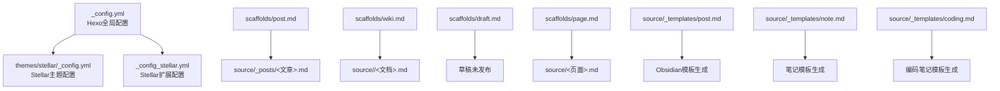
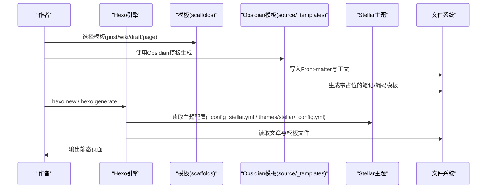
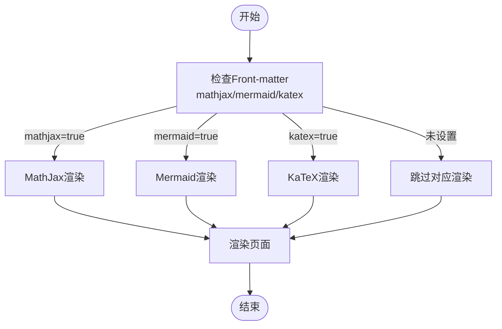
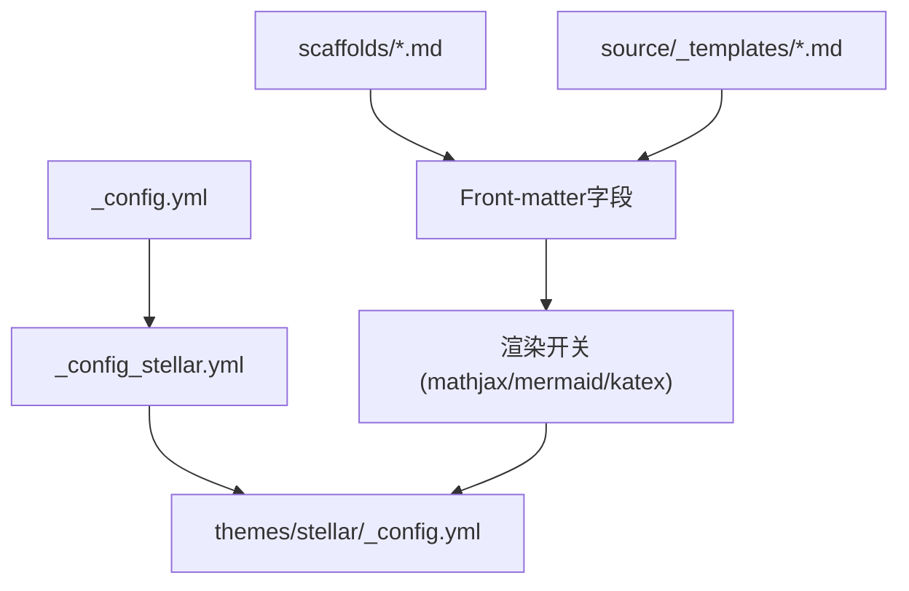

# 文章创作

<cite>
**本文引用的文件**   
- [_config.yml](file://_config.yml)
- [_config_stellar.yml](file://_config_stellar.yml)
- [themes/stellar/_config.yml](file://themes/stellar/_config.yml)
- [scaffolds/post.md](file://scaffolds/post.md)
- [scaffolds/wiki.md](file://scaffolds/wiki.md)
- [scaffolds/draft.md](file://scaffolds/draft.md)
- [scaffolds/page.md](file://scaffolds/page.md)
- [source/_templates/post.md](file://source/_templates/post.md)
- [source/_templates/note.md](file://source/_templates/note.md)
- [source/_templates/coding.md](file://source/_templates/coding.md)
</cite>

## 目录
1. [简介](#简介)
2. [项目结构](#项目结构)
3. [核心组件](#核心组件)
4. [架构总览](#架构总览)
5. [详细组件分析](#详细组件分析)
6. [依赖关系分析](#依赖关系分析)
7. [性能考虑](#性能考虑)
8. [故障排查指南](#故障排查指南)
9. [结论](#结论)
10. [附录](#附录)

## 简介
本文件面向H1S97X博客的创作者，系统讲解基于Hexo与Stellar主题的文章创作流程与最佳实践。内容涵盖：
- Hexo文章创建流程与Front-matter关键参数（title、date、categories、tags、top_img等）
- Markdown高级语法（代码块、数学公式、Mermaid图表、LaTeX公式）
- 文章模板（post、wiki、draft、page）的使用与差异
- 写作规范（标题、结构、图片、链接）
- 实战示例（Front-matter与Markdown片段路径）

## 项目结构
本仓库采用Hexo标准目录组织，结合Stellar主题的配置与模板：
- 配置层：根配置[_config.yml](file://_config.yml)与Stellar主题配置[_config_stellar.yml](file://_config_stellar.yml)、[themes/stellar/_config.yml](file://themes/stellar/_config.yml)
- 模板层：scaffolds目录下的post、wiki、draft、page模板；Obsidian风格模板在source/_templates
- 内容层：source/_posts用于文章，source/_templates用于模板，source/_data用于数据

**图示来源**
- [_config.yml](file://_config.yml#L1-L136)
- [_config_stellar.yml](file://_config_stellar.yml#L1-L699)
- [themes/stellar/_config.yml](file://themes/stellar/_config.yml#L1-L725)
- [scaffolds/post.md](file://scaffolds/post.md#L1-L77)
- [scaffolds/wiki.md](file://scaffolds/wiki.md#L1-L84)
- [scaffolds/draft.md](file://scaffolds/draft.md#L1-L48)
- [scaffolds/page.md](file://scaffolds/page.md#L1-L57)
- [source/_templates/post.md](file://source/_templates/post.md#L1-L18)
- [source/_templates/note.md](file://source/_templates/note.md#L1-L19)
- [source/_templates/coding.md](file://source/_templates/coding.md#L1-L58)

**章节来源**
- [themes/stellar/_config.yml](file://themes/stellar/_config.yml#L1-L725)
- [_config.yml](file://_config.yml#L1-L136)

## 核心组件
- Hexo配置与渲染
  - 全局配置[_config.yml](file://_config.yml)定义站点元信息、URL、目录、写作参数、分页、高亮、RSS与部署等
  - 主题配置[_config_stellar.yml](file://_config_stellar.yml)与[themes/stellar/_config.yml](file://themes/stellar/_config.yml)共同决定页面树、侧栏、文章样式、评论、标签插件、Mermaid/KaTeX/MathJax等
- 文章模板与生成
  - scaffolds模板：post、wiki、draft、page，定义Front-matter默认字段与写作指引
  - Obsidian模板：source/_templates/post、note、coding，支持动态命名与目录组织
- Markdown与标签插件
  - 支持代码高亮、Mermaid图表、KaTeX/MathJax公式渲染（需在Front-matter或主题配置中启用）

**章节来源**
- [_config.yml](file://_config.yml#L37-L136)
- [_config_stellar.yml](file://_config_stellar.yml#L148-L699)
- [themes/stellar/_config.yml](file://themes/stellar/_config.yml#L523-L632)
- [scaffolds/post.md](file://scaffolds/post.md#L1-L77)
- [scaffolds/wiki.md](file://scaffolds/wiki.md#L1-L84)
- [scaffolds/draft.md](file://scaffolds/draft.md#L1-L48)
- [scaffolds/page.md](file://scaffolds/page.md#L1-L57)
- [source/_templates/post.md](file://source/_templates/post.md#L1-L18)
- [source/_templates/note.md](file://source/_templates/note.md#L1-L19)
- [source/_templates/coding.md](file://source/_templates/coding.md#L1-L58)

## 架构总览
下图展示从“创建文章”到“渲染页面”的关键流程与配置交互。

**图示来源**
- [scaffolds/post.md](file://scaffolds/post.md#L1-L77)
- [scaffolds/wiki.md](file://scaffolds/wiki.md#L1-L84)
- [scaffolds/draft.md](file://scaffolds/draft.md#L1-L48)
- [scaffolds/page.md](file://scaffolds/page.md#L1-L57)
- [source/_templates/post.md](file://source/_templates/post.md#L1-L18)
- [source/_templates/note.md](file://source/_templates/note.md#L1-L19)
- [source/_templates/coding.md](file://source/_templates/coding.md#L1-L58)
- [_config_stellar.yml](file://_config_stellar.yml#L148-L699)
- [themes/stellar/_config.yml](file://themes/stellar/_config.yml#L523-L632)

## 详细组件分析

### Hexo Front-matter 参数详解
Front-matter是文章元数据的核心，直接影响渲染与SEO。以下参数来自模板与主题配置：

- 基础信息
  - title：文章标题（模板与Obsidian模板均支持自动生成）
  - date：创建时间（默认使用当前时间）
  - updated：更新时间（默认与创建时间一致）
- SEO与摘要
  - description：用于SEO与摘要显示
  - excerpt：自定义摘要，未填写则自动截取内容
  - keywords：关键词（可选）
  - robots：搜索引擎指令（可选）
  - sitemap：是否包含在站点地图中（可选）
- 分类与标签
  - categories：主分类（如tech-development、system-operations等）
  - tags：标签数组
- 封面与横幅
  - cover：封面图片URL
  - banner：横幅图片URL
  - poster：卡片海报图片URL
- 布局与导航
  - layout：post/page/wiki/topic
  - menu_id：导航菜单ID（如post、wiki、notebooks等）
  - leftbar/rightbar：侧栏组件（如toc、related、recent、timeline等）
- 内容增强
  - author：作者名称（未填则使用全局配置）
  - license：许可协议（未填则使用主题默认）
  - share：是否显示分享按钮（可选）
  - comment：是否启用评论（可选）
  - mathjax/mermaid：是否启用数学公式或Mermaid图表（需在主题配置中允许）
  - pin/sticky：置顶与置顶权重（用于Stellar主题的置顶机制）
- 专栏与Wiki
  - topic：所属专栏名称（可选）
  - wiki：所属Wiki项目名称（wiki模板必填）
  - references：参考链接列表（可选）

**章节来源**
- [scaffolds/post.md](file://scaffolds/post.md#L1-L77)
- [scaffolds/wiki.md](file://scaffolds/wiki.md#L1-L84)
- [scaffolds/draft.md](file://scaffolds/draft.md#L1-L48)
- [scaffolds/page.md](file://scaffolds/page.md#L1-L57)
- [_config_stellar.yml](file://_config_stellar.yml#L148-L176)
- [themes/stellar/_config.yml](file://themes/stellar/_config.yml#L585-L617)

### Markdown 高级语法与渲染
- 代码块
  - 支持语法高亮与复制按钮（由主题配置启用）
  - 代码块样式与主题高亮主题由配置控制
- 数学公式
  - KaTeX：在主题配置中启用并注入样式
  - MathJax：可在文章Front-matter中按需开启
- Mermaid 图表
  - 需安装过滤器并在文章Front-matter中开启
  - 支持graph、flowchart、sequence等图表类型

**图示来源**
- [_config_stellar.yml](file://_config_stellar.yml#L559-L592)
- [themes/stellar/_config.yml](file://themes/stellar/_config.yml#L585-L617)

**章节来源**
- [_config_stellar.yml](file://_config_stellar.yml#L559-L592)
- [themes/stellar/_config.yml](file://themes/stellar/_config.yml#L585-L617)

### 文章模板与适用场景
- post模板
  - 适用：博客文章、技术随笔、个人记录
  - 特点：支持封面、横幅、分类、标签、评论、分享、置顶等
  - 参考：[scaffolds/post.md](file://scaffolds/post.md#L1-L77)
- wiki模板
  - 适用：结构化文档、教程、API文档、产品手册
  - 特点：wiki项目必填、支持文档树、相关文档引用
  - 参考：[scaffolds/wiki.md](file://scaffolds/wiki.md#L1-L84)
- draft模板
  - 适用：草稿阶段内容，不对外发布
  - 特点：不设置发布日期，发布时自动补全并移至_posts
  - 参考：[scaffolds/draft.md](file://scaffolds/draft.md#L1-L48)
- page模板
  - 适用：静态页面（关于、音乐、项目展示等）
  - 特点：默认不启用评论与分享，适合展示型页面
  - 参考：[scaffolds/page.md](file://scaffolds/page.md#L1-L57)
- Obsidian模板
  - post模板：自动生成标题与日期，支持故事风格类型
    - 参考：[source/_templates/post.md](file://source/_templates/post.md#L1-L18)
  - note模板：自动归档到notes笔记本
    - 参考：[source/_templates/note.md](file://source/_templates/note.md#L1-L19)
  - coding模板：面向编码练习的结构化模板，内置示例与代码块占位
    - 参考：[source/_templates/coding.md](file://source/_templates/coding.md#L1-L58)

**章节来源**
- [scaffolds/post.md](file://scaffolds/post.md#L1-L77)
- [scaffolds/wiki.md](file://scaffolds/wiki.md#L1-L84)
- [scaffolds/draft.md](file://scaffolds/draft.md#L1-L48)
- [scaffolds/page.md](file://scaffolds/page.md#L1-L57)
- [source/_templates/post.md](file://source/_templates/post.md#L1-L18)
- [source/_templates/note.md](file://source/_templates/note.md#L1-L19)
- [source/_templates/coding.md](file://source/_templates/coding.md#L1-L58)

### 写作最佳实践
- 标题规范
  - 使用简洁明确的标题，避免冗长与歧义
  - 与分类/标签形成良好映射，便于检索
- 内容结构
  - 使用层级标题组织内容（概述、主要内容、总结、参考资料）
  - 重要结论与要点使用强调标记或分节突出
- 图片与链接
  - 图片建议放置在source/_posts或主题资产目录，使用相对路径
  - 链接遵循“目标明确、可读性强”，避免裸链接
- SEO与可访问性
  - 合理填写description与keywords
  - 为图片添加alt描述，提升可访问性
- 渲染与性能
  - 适度使用数学公式与Mermaid图表，避免过度渲染导致页面加载缓慢
  - 代码块数量与长度控制，避免长篇大段无分隔

[本节为通用指导，不直接分析具体文件]

## 依赖关系分析
- 配置耦合
  - Hexo全局配置[_config.yml](file://_config.yml)决定URL、分页、高亮、RSS与部署
  - Stellar主题配置[_config_stellar.yml](file://_config_stellar.yml)与[themes/stellar/_config.yml](file://themes/stellar/_config.yml)决定页面树、侧栏、评论、标签插件与渲染开关
- 模板依赖
  - scaffolds模板与source/_templates模板共同决定Front-matter字段与默认值
  - 不同模板的layout与menu_id影响页面树与导航高亮
- 渲染依赖
  - Mermaid、KaTeX、MathJax的启用受Front-matter与主题配置双重控制

**图示来源**
- [_config.yml](file://_config.yml#L1-L136)
- [_config_stellar.yml](file://_config_stellar.yml#L148-L699)
- [themes/stellar/_config.yml](file://themes/stellar/_config.yml#L523-L632)
- [scaffolds/post.md](file://scaffolds/post.md#L1-L77)
- [scaffolds/wiki.md](file://scaffolds/wiki.md#L1-L84)
- [scaffolds/draft.md](file://scaffolds/draft.md#L1-L48)
- [scaffolds/page.md](file://scaffolds/page.md#L1-L57)
- [source/_templates/post.md](file://source/_templates/post.md#L1-L18)
- [source/_templates/note.md](file://source/_templates/note.md#L1-L19)
- [source/_templates/coding.md](file://source/_templates/coding.md#L1-L58)

**章节来源**
- [_config.yml](file://_config.yml#L1-L136)
- [_config_stellar.yml](file://_config_stellar.yml#L148-L699)
- [themes/stellar/_config.yml](file://themes/stellar/_config.yml#L523-L632)

## 性能考虑
- 渲染性能
  - 控制数学公式与Mermaid图表数量，避免一次性渲染过多复杂图表
  - 合理使用图片与懒加载，减少首屏阻塞
- 代码高亮
  - 启用行号与自动检测时注意性能权衡，必要时关闭自动检测
- 分页与索引
  - 合理设置分页数量与索引范围，避免生成过大索引文件

[本节为通用指导，不直接分析具体文件]

## 故障排查指南
- 数学公式不显示
  - 检查Front-matter是否开启mathjax或katex
  - 确认主题配置中已注入相应脚本与样式
  - 参考：[_config_stellar.yml](file://_config_stellar.yml#L559-L592)、[themes/stellar/_config.yml](file://themes/stellar/_config.yml#L585-L617)
- Mermaid图表不显示
  - 安装Mermaid过滤器并在Front-matter中开启mermaid
  - 参考：[themes/stellar/_config.yml](file://themes/stellar/_config.yml#L602-L617)
- 代码块复制/高亮异常
  - 检查高亮配置与主题高亮主题设置
  - 参考：[_config.yml](file://_config.yml#L50-L62)、[_config_stellar.yml](file://_config_stellar.yml#L609-L632)
- 评论系统未加载
  - 检查主题配置中的评论服务设置与lazyload选项
  - 参考：[_config_stellar.yml](file://_config_stellar.yml#L191-L330)、[themes/stellar/_config.yml](file://themes/stellar/_config.yml#L220-L330)

**章节来源**
- [_config_stellar.yml](file://_config_stellar.yml#L559-L592)
- [themes/stellar/_config.yml](file://themes/stellar/_config.yml#L585-L617)
- [_config.yml](file://_config.yml#L50-L62)
- [_config_stellar.yml](file://_config_stellar.yml#L191-L330)

## 结论
通过合理使用Hexo与Stellar主题的配置与模板，结合本文提供的Front-matter参数、Markdown高级语法与写作规范，您可以高效产出高质量的文章内容。建议在创作前先确定文章类型（post/wiki/draft/page），选择合适的模板并按规范填写Front-matter，再配合Mermaid与数学公式提升表达力，最后进行SEO与可访问性优化。

[本节为总结，不直接分析具体文件]

## 附录

### Front-matter 示例与路径
- 基础示例（博客文章）
  - 参考：[scaffolds/post.md](file://scaffolds/post.md#L1-L77)
- Wiki示例
  - 参考：[scaffolds/wiki.md](file://scaffolds/wiki.md#L1-L84)
- 草稿示例
  - 参考：[scaffolds/draft.md](file://scaffolds/draft.md#L1-L48)
- 页面示例
  - 参考：[scaffolds/page.md](file://scaffolds/page.md#L1-L57)

### Markdown 语法片段路径
- Mermaid 图表示例（需在Front-matter开启mermaid）
  - 参考：[themes/stellar/_config.yml](file://themes/stellar/_config.yml#L602-L617)
- KaTeX 公式示例（需在Front-matter开启katex）
  - 参考：[_config_stellar.yml](file://_config_stellar.yml#L585-L592)
- MathJax 公式示例（需在Front-matter开启mathjax）
  - 参考：[_config_stellar.yml](file://_config_stellar.yml#L594-L601)