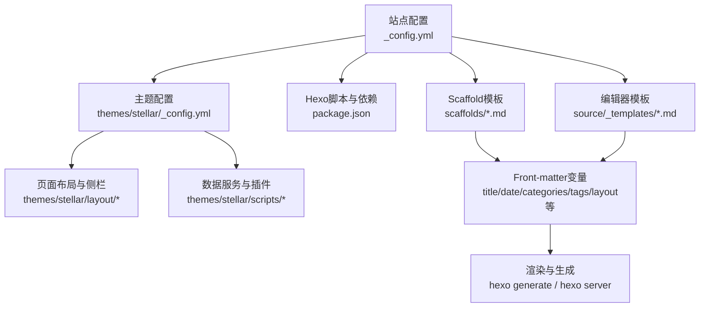
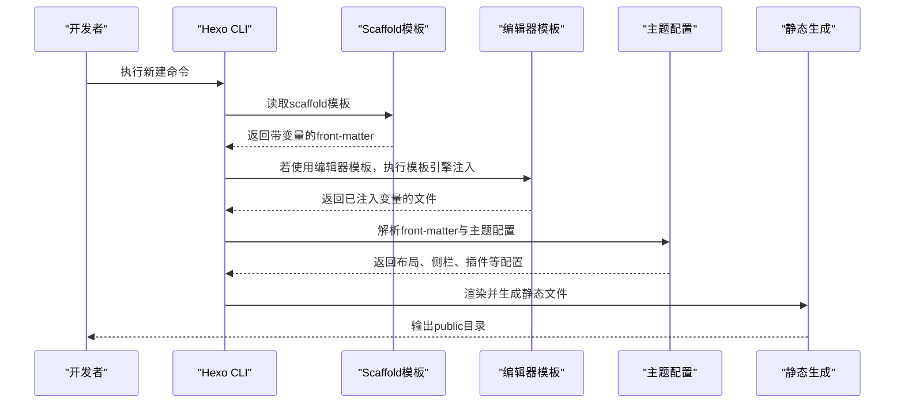
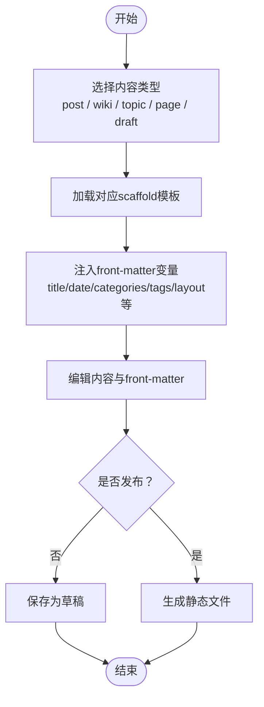
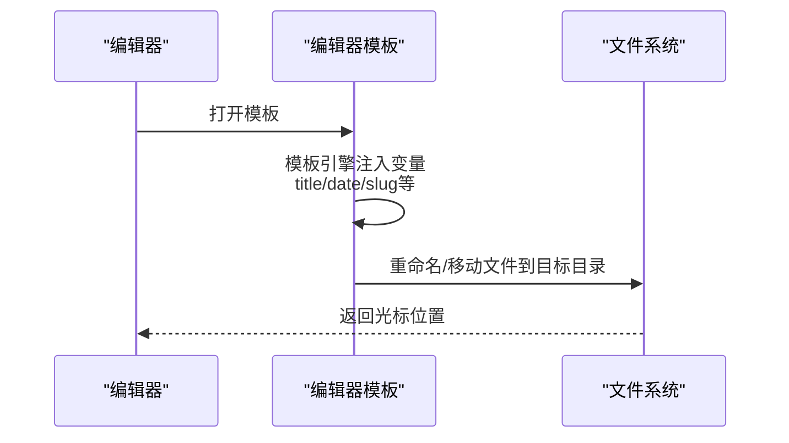
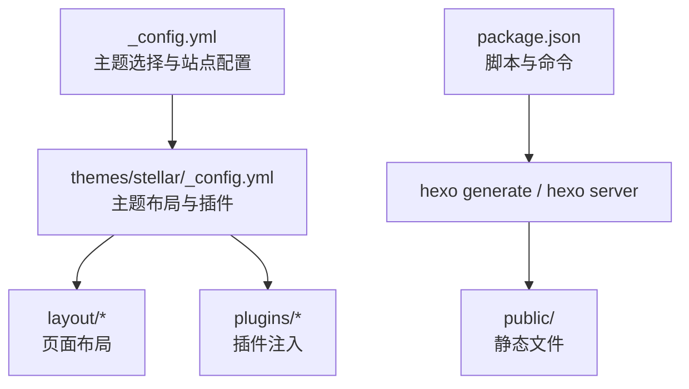

# 模板系统

<cite>
**本文引用的文件**
- [scaffolds/post.md](file://scaffolds/post.md)
- [scaffolds/wiki.md](file://scaffolds/wiki.md)
- [scaffolds/topic.md](file://scaffolds/topic.md)
- [scaffolds/page.md](file://scaffolds/page.md)
- [scaffolds/draft.md](file://scaffolds/draft.md)
- [source/_templates/note.md](file://source/_templates/note.md)
- [source/_templates/post.md](file://source/_templates/post.md)
- [source/_templates/coding.md](file://source/_templates/coding.md)
- [themes/stellar/_config.yml](file://themes/stellar/_config.yml)
- [themes/butterfly/_config.yml](file://themes/butterfly/_config.yml)
- [_config.yml](file://_config.yml)
- [package.json](file://package.json)
- [source/_posts/hello-world.md](file://source/_posts/hello-world.md)
</cite>

## 目录
1. [简介](#简介)
2. [项目结构](#项目结构)
3. [核心组件](#核心组件)
4. [架构总览](#架构总览)
5. [详细组件分析](#详细组件分析)
6. [依赖关系分析](#依赖关系分析)
7. [性能考量](#性能考量)
8. [故障排查指南](#故障排查指南)
9. [结论](#结论)
10. [附录](#附录)

## 简介
本文件面向H1S97X博客的模板系统，系统性梳理Hexo的scaffold模板机制与Stellar主题下的模板使用规范。重点覆盖post、note、wiki、topic、page、draft等模板的结构与用途；详解模板变量（如日期、标题、作者等）在front-matter中的动态注入；提供自定义模板的创建与修改方法（含模板继承与扩展思路）；说明模板在不同主题中的适配与兼容性问题；并给出模板定制的最佳实践与常见问题排查建议。

## 项目结构
围绕模板系统的关键目录与文件：
- scaffolds：Hexo默认scaffold模板目录，定义新建文章、页面、草稿等的初始结构与变量占位
- source/_templates：Obsidian/Typora等编辑器模板（基于模板引擎语法），用于自动命名、日期注入与目录组织
- themes/stellar/_config.yml：Stellar主题的全局配置，包含页面布局、侧栏、插件、SEO等关键项
- themes/butterfly/_config.yml：Butterfly主题配置（用于对比不同主题的差异）
- _config.yml：站点全局配置，包含主题选择、URL、分页、RSS等
- package.json：脚本与依赖，包含scaffold校验、构建、部署等命令

**图表来源**
- [_config.yml](file://_config.yml#L104-L136)
- [themes/stellar/_config.yml](file://themes/stellar/_config.yml#L72-L152)
- [package.json](file://package.json#L5-L41)

**章节来源**
- [_config.yml](file://_config.yml#L1-L136)
- [themes/stellar/_config.yml](file://themes/stellar/_config.yml#L1-L725)
- [themes/butterfly/_config.yml](file://themes/butterfly/_config.yml#L1-L987)
- [package.json](file://package.json#L1-L94)

## 核心组件
- Scaffold模板（Hexo默认机制）
  - post：博客文章模板，包含SEO、分类标签、Stellar主题配置、内容增强开关等
  - wiki：Wiki文档模板，强调项目归属、文档树、侧栏配置与SEO
  - topic：专栏文章模板，强调系列化内容、导航与关联
  - page：静态页面模板，适合关于、友链、项目展示等
  - draft：草稿模板，发布前的临时内容，发布时自动补全日期与移动目录
- 编辑器模板（Typora/Obsidian）
  - note：用于笔记笔记本，自动处理标题、日期、slug与目录
  - post：用于故事型内容，自动处理标题、日期、slug与目录
  - coding：用于算法/题解模板，内置问题、示例、测试用例与代码块占位
- 主题配置（Stellar）
  - site_tree：站点主结构树，定义主页、博客列表、Wiki列表、文章内页、笔记列表/页等的默认侧栏与菜单ID
  - article：文章类型、缩进、封面/横幅比例、自动摘要长度、许可协议、分享、相关文章等
  - tag_plugins：主题内置标签插件（note、checkbox、timeline、gallery等）的默认行为
  - data_services：数据服务（如友链、时间线、站点信息等）的加载与接口配置
  - plugins：插件（如KaTeX、MathJax、Mermaid、Swiper、Heti等）的启用与注入策略
  - style：主题样式（字体、字号、圆角、颜色、动画等）与默认占位图
  - default：默认头像、链接、封面、横幅、话题、加载动画等占位资源
  - system：链接美化、Pretty URLs覆盖等系统级行为

**章节来源**
- [scaffolds/post.md](file://scaffolds/post.md#L1-L77)
- [scaffolds/wiki.md](file://scaffolds/wiki.md#L1-L84)
- [scaffolds/topic.md](file://scaffolds/topic.md#L1-L89)
- [scaffolds/page.md](file://scaffolds/page.md#L1-L57)
- [scaffolds/draft.md](file://scaffolds/draft.md#L1-L48)
- [source/_templates/note.md](file://source/_templates/note.md#L1-L19)
- [source/_templates/post.md](file://source/_templates/post.md#L1-L18)
- [source/_templates/coding.md](file://source/_templates/coding.md#L1-L58)
- [themes/stellar/_config.yml](file://themes/stellar/_config.yml#L72-L152)
- [themes/stellar/_config.yml](file://themes/stellar/_config.yml#L179-L452)
- [themes/stellar/_config.yml](file://themes/stellar/_config.yml#L523-L632)
- [themes/stellar/_config.yml](file://themes/stellar/_config.yml#L635-L725)

## 架构总览
模板系统在Hexo中的工作流：
- 新建内容时，Hexo根据scaffold模板生成初始文件（含front-matter变量占位）
- Obsidian/Typora等编辑器可使用source/_templates模板，自动注入标题、日期、slug并重命名/移动文件
- 渲染阶段，Hexo依据front-matter中的layout、menu_id等字段，结合主题配置，选择对应布局与侧栏
- 生成静态文件后，通过部署脚本发布到目标平台

**图表来源**
- [scaffolds/post.md](file://scaffolds/post.md#L1-L77)
- [source/_templates/post.md](file://source/_templates/post.md#L1-L18)
- [themes/stellar/_config.yml](file://themes/stellar/_config.yml#L72-L152)
- [package.json](file://package.json#L5-L41)

## 详细组件分析

### Hexo Scaffold 模板
- post模板
  - 作用：生成博客文章的初始结构，包含SEO、分类标签、Stellar主题配置、内容增强开关、专栏/文档关联等
  - 关键变量：title、date、updated、description、excerpt、cover、banner、poster、categories、tags、layout、menu_id、author、license、share、comment、mathjax、mermaid、pin、sticky、keywords、canonical_url、robots、sitemap、topic、wiki、references等
  - 使用建议：发布前补充缺失字段，启用所需插件（如mathjax、mermaid），设置合适的分类与标签
- wiki模板
  - 作用：生成Wiki文档的初始结构，强调项目归属、文档树、侧栏配置与SEO
  - 关键变量：title、date、updated、description、wiki、layout、menu_id、leftbar、rightbar、order、pin、cover、banner、mathjax、mermaid、comment、share、keywords、robots、sitemap、references、related等
  - 使用建议：为文档设置清晰的项目归属与排序权重，启用必要的插件与侧栏组件
- topic模板
  - 作用：生成专栏文章的初始结构，强调系列化内容、导航与关联
  - 关键变量：title、date、updated、description、excerpt、cover、banner、topic、layout、menu_id、order、pin、categories、tags、leftbar、rightbar、mathjax、mermaid、comment、share、keywords、robots、sitemap、references、related等
  - 使用建议：确保文章在系列中的顺序合理，提供清晰的导航与前后文关联
- page模板
  - 作用：生成静态页面的初始结构，适合关于、友链、项目展示等
  - 关键变量：title、date、updated、description、cover、banner、layout、menu_id、leftbar、rightbar、comment、share、mathjax、mermaid、keywords、robots、sitemap等
  - 使用建议：页面通常不需要评论与分享，保持内容简洁明了
- draft模板
  - 作用：草稿模板，发布时自动补全日期与移动到_posts目录
  - 关键变量：title、categories、tags、layout等
  - 使用建议：先写大纲与要点，逐步完善内容，发布前检查格式与链接

**图表来源**
- [scaffolds/post.md](file://scaffolds/post.md#L1-L77)
- [scaffolds/wiki.md](file://scaffolds/wiki.md#L1-L84)
- [scaffolds/topic.md](file://scaffolds/topic.md#L1-L89)
- [scaffolds/page.md](file://scaffolds/page.md#L1-L57)
- [scaffolds/draft.md](file://scaffolds/draft.md#L1-L48)

**章节来源**
- [scaffolds/post.md](file://scaffolds/post.md#L1-L77)
- [scaffolds/wiki.md](file://scaffolds/wiki.md#L1-L84)
- [scaffolds/topic.md](file://scaffolds/topic.md#L1-L89)
- [scaffolds/page.md](file://scaffolds/page.md#L1-L57)
- [scaffolds/draft.md](file://scaffolds/draft.md#L1-L48)

### 编辑器模板（Typora/Obsidian）
- note模板
  - 作用：为笔记笔记本自动处理标题、日期、slug与目录，若标题为“未命名”则交互式提示输入
  - 关键变量：title、notebook、tags、date、updated
  - 使用建议：遵循模板引擎语法，确保日期格式与目录结构一致
- post模板
  - 作用：为故事型内容自动处理标题、日期、slug与目录
  - 关键变量：title、type、date、updated
  - 使用建议：与Stellar主题的layout: post配合，启用所需侧栏与插件
- coding模板
  - 作用：为算法/题解提供标准化结构，内置问题描述、示例、测试用例与代码块占位
  - 关键变量：title、notebook、tags、date、updated、katex
  - 使用建议：按模板填充问题、示例与代码，使用asset_code标签插入代码文件

**图表来源**
- [source/_templates/note.md](file://source/_templates/note.md#L1-L19)
- [source/_templates/post.md](file://source/_templates/post.md#L1-L18)
- [source/_templates/coding.md](file://source/_templates/coding.md#L1-L58)

**章节来源**
- [source/_templates/note.md](file://source/_templates/note.md#L1-L19)
- [source/_templates/post.md](file://source/_templates/post.md#L1-L18)
- [source/_templates/coding.md](file://source/_templates/coding.md#L1-L58)

### 模板变量与动态内容
- 常用变量
  - title：文章标题（scaffold与编辑器模板均支持）
  - date/updated：创建与更新时间（scaffold默认注入当前时间；编辑器模板支持格式化）
  - categories/tags：分类与标签（用于SEO与归档）
  - layout：页面布局（post/page/wiki/topic/note等）
  - menu_id：主导航高亮（如post、wiki、notebooks等）
  - description/excerpt：描述与摘要（SEO与摘要显示）
  - cover/banner/poster：封面/横幅/海报（卡片显示）
  - author/license/share/comment：作者、许可协议、分享、评论
  - mathjax/mermaid：数学公式与Mermaid图表
  - keywords/robots/sitemap：SEO优化
  - topic/wiki/references：专栏/Wiki与参考资料
- 注入方式
  - Hexo scaffold：front-matter占位，生成时由Hexo填充
  - 编辑器模板：模板引擎语法注入，生成时自动处理标题、日期、slug与目录

**章节来源**
- [scaffolds/post.md](file://scaffolds/post.md#L1-L77)
- [scaffolds/wiki.md](file://scaffolds/wiki.md#L1-L84)
- [scaffolds/topic.md](file://scaffolds/topic.md#L1-L89)
- [scaffolds/page.md](file://scaffolds/page.md#L1-L57)
- [scaffolds/draft.md](file://scaffolds/draft.md#L1-L48)
- [source/_templates/note.md](file://source/_templates/note.md#L1-L19)
- [source/_templates/post.md](file://source/_templates/post.md#L1-L18)
- [source/_templates/coding.md](file://source/_templates/coding.md#L1-L58)

### 自定义模板的创建与修改
- 创建新模板
  - 在scaffolds目录新增*.md文件，定义front-matter字段与默认值
  - 在source/_templates目录新增*.md文件，使用模板引擎语法实现自动命名与注入
- 修改现有模板
  - 更新scaffold字段以满足新的SEO或布局需求
  - 调整编辑器模板的变量注入逻辑与目录结构
- 模板继承与扩展
  - 通过front-matter中的layout与menu_id，结合主题配置的site_tree，实现布局与侧栏的继承
  - 使用主题配置中的plugins与tag_plugins，扩展内容增强能力
- 最佳实践
  - 保持front-matter字段一致性，便于主题解析
  - 为不同内容类型设置合理的默认侧栏与插件开关
  - 使用草稿模板进行内容创作，发布前统一检查与格式化

**章节来源**
- [themes/stellar/_config.yml](file://themes/stellar/_config.yml#L72-L152)
- [themes/stellar/_config.yml](file://themes/stellar/_config.yml#L523-L632)

### 模板在不同主题中的适配与兼容性
- Stellar主题
  - site_tree：定义主页、博客列表、Wiki列表、文章内页、笔记列表/页等的默认侧栏与菜单ID
  - article：控制文章类型、封面/横幅比例、自动摘要长度、许可协议、分享、相关文章等
  - tag_plugins：内置标签插件的默认行为，如note、checkbox、timeline、gallery等
  - data_services：数据服务（如友链、时间线、站点信息等）的加载与接口配置
  - plugins：插件（如KaTeX、MathJax、Mermaid、Swiper、Heti等）的启用与注入策略
- Butterfly主题
  - 侧栏、TOC、评论系统、代码高亮、暗色模式等配置与Stellar存在差异
  - 若切换主题，需根据目标主题的配置调整front-matter字段与侧栏组件
- 兼容性建议
  - 优先使用通用字段（如title、date、categories、tags、layout、menu_id）
  - 针对特定主题的功能（如Mermaid、MathJax）在front-matter中显式启用
  - 通过主题配置文件统一管理插件与样式，减少模板层面的差异化

**章节来源**
- [themes/stellar/_config.yml](file://themes/stellar/_config.yml#L72-L152)
- [themes/stellar/_config.yml](file://themes/stellar/_config.yml#L179-L452)
- [themes/stellar/_config.yml](file://themes/stellar/_config.yml#L523-L632)
- [themes/butterfly/_config.yml](file://themes/butterfly/_config.yml#L1-L987)

### 模板定制最佳实践
- 布局设计
  - 使用layout与menu_id确保页面在导航与侧栏中的正确高亮
  - 根据内容类型选择合适的侧栏组件（如Wiki的tree、topic的toc等）
- 内容组织
  - 为文章设置清晰的分类与标签，提升SEO与归档质量
  - 合理使用description/excerpt，确保摘要与SEO优化
- 插件与增强
  - 在front-matter中启用mathjax/mermaid等插件，避免在模板中硬编码
  - 使用主题提供的标签插件（如note、checkbox、timeline、gallery）提升内容表现力
- 发布流程
  - 使用草稿模板进行内容创作，发布前统一检查格式与链接
  - 通过脚本命令（如scaffolds:validate）校验模板一致性

**章节来源**
- [themes/stellar/_config.yml](file://themes/stellar/_config.yml#L72-L152)
- [themes/stellar/_config.yml](file://themes/stellar/_config.yml#L523-L632)
- [package.json](file://package.json#L26-L29)

## 依赖关系分析
- 站点配置与主题配置
  - _config.yml指定主题为stellar，影响所有页面的布局与侧栏
  - themes/stellar/_config.yml定义页面布局、侧栏、插件、SEO等
- 脚本与命令
  - package.json提供scaffold校验、构建、部署等脚本，保障模板一致性与发布流程
- 实际示例
  - source/_posts/hello-world.md展示了最小化的post front-matter结构

**图表来源**
- [_config.yml](file://_config.yml#L104-L136)
- [themes/stellar/_config.yml](file://themes/stellar/_config.yml#L72-L152)
- [package.json](file://package.json#L5-L41)

**章节来源**
- [_config.yml](file://_config.yml#L104-L136)
- [themes/stellar/_config.yml](file://themes/stellar/_config.yml#L72-L152)
- [package.json](file://package.json#L5-L41)
- [source/_posts/hello-world.md](file://source/_posts/hello-world.md#L1-L39)

## 性能考量
- 插件启用策略
  - 仅在需要的文章中启用mathjax/mermaid等重型插件，避免全局开启导致页面加载缓慢
- 侧栏与数据服务
  - 合理配置侧栏组件数量，避免过多异步请求影响首屏性能
- 静态资源优化
  - 使用主题提供的默认占位图与CDN资源，减少自定义资源带来的额外请求
- 生成与缓存
  - 使用hexo clean与增量生成策略，减少重复渲染时间

## 故障排查指南
- 模板变量未生效
  - 检查front-matter字段是否拼写正确，确认模板中包含对应变量
  - 若使用编辑器模板，确认模板引擎语法与注入逻辑无误
- 页面布局异常
  - 检查layout与menu_id是否与主题配置一致，核对site_tree中的默认侧栏设置
- 插件未加载
  - 在front-matter中显式启用插件（如mathjax: true、mermaid: true），或在主题配置中启用全局加载
- 发布流程问题
  - 使用脚本命令校验模板一致性（如scaffolds:validate），确保发布前检查清单完整
- 实际示例
  - source/_posts/hello-world.md展示了最小化的post front-matter结构，可作为新建文章的参考

**章节来源**
- [themes/stellar/_config.yml](file://themes/stellar/_config.yml#L523-L632)
- [package.json](file://package.json#L26-L29)
- [source/_posts/hello-world.md](file://source/_posts/hello-world.md#L1-L39)

## 结论
H1S97X博客的模板系统以Hexo的scaffold与编辑器模板为核心，结合Stellar主题的配置，实现了灵活的内容创建与统一的页面布局。通过合理使用front-matter变量、插件与侧栏组件，开发者可以高效地创建博客文章、Wiki文档、专栏文章、静态页面与笔记内容。在不同主题之间切换时，建议优先使用通用字段并根据目标主题的配置进行适配，以确保模板的兼容性与可维护性。

## 附录
- 模板文件示例与配置说明
  - post模板：定义SEO、分类标签、Stellar主题配置、内容增强开关、专栏/文档关联等
  - wiki模板：强调项目归属、文档树、侧栏配置与SEO
  - topic模板：强调系列化内容、导航与关联
  - page模板：适合关于、友链、项目展示等静态页面
  - draft模板：草稿模板，发布时自动补全日期与移动到_posts目录
  - note/post/coding模板：编辑器模板，自动处理标题、日期、slug与目录

**章节来源**
- [scaffolds/post.md](file://scaffolds/post.md#L1-L77)
- [scaffolds/wiki.md](file://scaffolds/wiki.md#L1-L84)
- [scaffolds/topic.md](file://scaffolds/topic.md#L1-L89)
- [scaffolds/page.md](file://scaffolds/page.md#L1-L57)
- [scaffolds/draft.md](file://scaffolds/draft.md#L1-L48)
- [source/_templates/note.md](file://source/_templates/note.md#L1-L19)
- [source/_templates/post.md](file://source/_templates/post.md#L1-L18)
- [source/_templates/coding.md](file://source/_templates/coding.md#L1-L58)